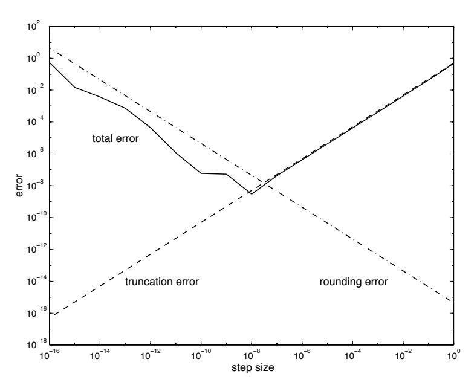
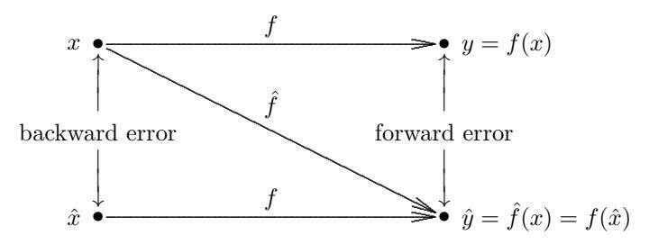
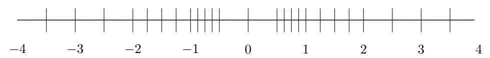
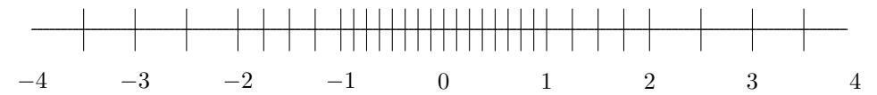
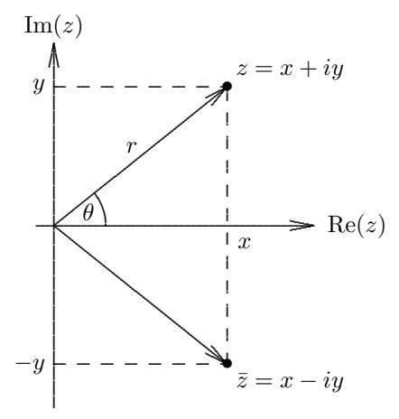

# Tudományos számítások

## 1.1 Bevezetés

Ennek a könyvnek a tárgyát hagyományosan numerikus analízisnek nevezik. A numerikus analízis olyan algoritmusok tervezésével és elemzésével foglalkozik, amelyek számos területen – különösen a természettudományokban és a mérnöki tudományokban – felmerülő matematikai feladatokat oldanak meg. Ezért a numerikus analízist az utóbbi időben tudományos számításoknak is nevezik. A tudományos számításokat a számítástudomány legtöbb más ágától az különbözteti meg, hogy folytonos, nem pedig diszkrét mennyiségekkel foglalkozik. Olyan függvényekkel és egyenletekkel dolgozik, amelyek alapul szolgáló változói – idő, távolság, sebesség, hőmérséklet, sűrűség, nyomás, feszültség és hasonlók – természetüknél fogva folytonosak.

A folytonos matematika legtöbb feladata (például szinte bármely feladat, amely deriváltakat, integrálokat vagy nemlinearitást tartalmaz) még elvben sem oldható meg véges számú lépésben egzaktul, ezért ezeket egy (elméletileg végtelen) iteratív eljárással kell megoldani, amely végül a megoldáshoz konvergál. A gyakorlatban természetesen nem iterálunk örökké, hanem csak addig, amíg a válasz megközelítőleg helyes, azaz gyakorlati célokra „elég közel” van a kívánt eredményhez. Így a tudományos számítások egyik legfontosabb aspektusa a gyorsan konvergáló iteratív algoritmusok megtalálása és a kapott közelítés pontosságának felmérése. Ha a konvergencia kellően gyors, akkor még néhány olyan feladat is, amely véges algoritmussal megoldható – mint például a lineáris algebrai egyenletrendszerek –, bizonyos esetekben előnyösebben oldható meg iterációs módszerekkel, amint azt látni fogjuk.

Ebből kifolyólag a tudományos számítások egy másik megkülönböztető jellemzője, hogy foglalkozik a közelítések hatásaival. Sok megoldási technika különféle típusú közelítések egész sorozatát foglalja magában. Még a használt aritmetika is csak közelítő, hiszen a digitális számítógépek nem tudnak minden valós számot egzaktul ábrázolni. A jó algoritmusok szokásos tulajdonságain – például a hatékonyságon – túl a numerikus algoritmusoknak a lehető legmegbízhatóbbnak és legpontosabbnak kell lenniük az útközben alkalmazott különféle közelítések ellenére.

### 1.1.1 Számítási feladatok

Ahogy a név is sugallja, a tudományos számításokban felmerülő sok feladat a természettudományokból és a mérnöki tudományokból származik, ahol a végső cél valamely természeti jelenség megértése vagy egy eszköz tervezése. A számítógépes szimuláció egy fizikai rendszer vagy folyamat számítógépes ábrázolása és utánzása. A számítógépes szimuláció nagymértékben elmélyítheti a tudományos megértést, mert lehetővé teszi olyan helyzetek vizsgálatát, amelyeket kizárólag elméleti, megfigyelési vagy kísérleti úton nehéz vagy lehetetlen volna vizsgálni. Az asztrofizikában például két ütköző fekete lyuk részletes viselkedése túl bonyolult ahhoz, hogy elméletileg meghatározzuk, és lehetetlen közvetlenül megfigyelni vagy laboratóriumban reprodukálni. Számítógépes szimulációjához mindössze egy megfelelő matematikai leírásra (ebben az esetben Einstein általános relativitáselméleti egyenleteire), az egyenletek numerikus megoldására szolgáló algoritmusra és egy elegendően nagy számítógépre van szükség, amelyen az algoritmus implementálható.

A számítógépes szimuláció nemcsak egzotikus vagy egyébként hozzáférhetetlen helyzetek feltárására hasznos, hanem a „normális” forgatókönyvek szélesebb körének vizsgálatát is lehetővé teszi, mint amennyit ésszerű költséggel és idővel egyébként vizsgálni lehetne. A mérnöki tervezésben a számítógépes szimuláció lehetővé teszi, hogy sok tervezési alternatívát sokkal gyorsabban, olcsóbban és biztonságosabban próbáljunk ki, mint a fizikai prototípusokat használó hagyományos „építsd meg és teszteld” módszerekkel. Ebben az értelemben a számítógépes szimuláció virtuális prototípus-készítés néven is ismertté vált. A gépjárműbiztonság javításánál például a törésteszt számítógépen sokkal olcsóbb és veszélytelenebb, mint a valóságban, így a lehetséges tervezési paraméterek tere sokkal alaposabban feltárható egy optimális terv kidolgozásához.

A számítógépes szimuláció átfogó problémamegoldási folyamata általában a következő lépéseket tartalmazza:

- 1. Az érdeklődési körbe tartozó fizikai jelenség vagy rendszer matematikai modelljének kidolgozása – általában valamilyen típusú egyenletekkel megfogalmazva.
- 2. Algoritmusok kidolgozása az egyenletek numerikus megoldására.
- 3. Az algoritmusok implementálása számítógépes szoftverben.
- 4. A szoftver futtatása számítógépen, a fizikai folyamat numerikus szimulálására.
- 5. A számított eredmények valamilyen érthető formában – például grafikus megjelenítéssel – való bemutatása.
- 6. A számított eredmények értelmezése és validálása, szükség esetén az előző lépések bármelyikének megismétlésével.

Az 1. lépést gyakran matematikai modellezésnek nevezik. Ehhez az érintett tudományos vagy mérnöki terület speciális ismerete, valamint az alkalmazott matematikában való jártasság szükséges. A 2. és 3. lépés – numerikus algoritmusok és szoftverek tervezése, elemzése, implementálása és használata – a tudományos számítások fő témája, így e könyvé is. Noha a 2. és 3. lépésre összpontosítunk, lényeges, hogy mindezek a lépések – a probléma megfogalmazásától egészen az eredmények értelmezéséig és validálásáig – megfelelően történjenek, hogy az eredmények értelmesek és hasznosak legyenek. A tudományos számítások elveit és módszereit meglehetősen általános szinten lehet tanulmányozni, amint azt látni fogjuk, de a konkrét feladat konkrét forrását és az eredmények felhasználási módját mindig szem előtt kell tartani, mivel mindegyik szempont hat a többire és fordítva. Például az eredeti feladatmegfogalmazás erősen befolyásolhatja a numerikus eredmények pontosságát, ami viszont kihat az eredmények értelmezésére és validálására.

Egy matematikai feladatot jól kitűzöttnek mondunk, ha létezik megoldása, az egyértelmű, és folytonosan függ a feladat adataitól. Az utóbbi feltétel azt jelenti, hogy a feladat adatainak kis megváltozása nem okoz hirtelen, aránytalan változást a megoldásban; ez a tulajdonság különösen fontos a numerikus számításokban, ahol – amint hamarosan látni fogjuk – az ilyen perturbációk általában elkerülhetetlenek. A jól kitűzöttség erősen kívánatos a fizikai rendszerek matematikai modelljeiben, de ez nem mindig érhető el. Például egy fizikai rendszer belső szerkezetére csak külső megfigyelésekből való következtetés – mint a tomográfiában vagy a szeizmológiában – gyakran eredendően rosszul kitűzött matematikai feladatokra vezet, amelyekben egymástól jelentősen eltérő belső konfigurációk megkülönböztethetetlen külső megjelenéssel rendelkeznek.

Még ha egy feladat jól kitűzött is, a megoldás akkor is nagyon érzékenyen (bár folytonosan) reagálhat a feladat adataiban bekövetkező perturbációkra. Ahhoz, hogy felmérjük az ilyen perturbációk hatásait, a folytonosság kvalitatív fogalmán túl kell lépnünk, és meg kell határoznunk a feladat érzékenységének mennyiségi mértékét. Ezenfelül ügyelnünk kell arra is, hogy az adott feladat numerikus megoldására használt algoritmus ne tegye az eredményeket érzékenyebbé annál, mint ami az alapul szolgáló feladatban eleve benne rejlik (a „ne árts!” hippokratészi eskü a numerikus matematikusokra éppúgy vonatkozik, mint az orvosokra). Ez a követelmény vezet el a stabil algoritmus fogalmához. Ezeket az általános fogalmakat és kérdéseket ebben a fejezetben vezetjük be, majd a későbbi fejezetekben részletesen is tárgyaljuk őket a konkrét típusú számítási feladatok kapcsán.

### 1.1.2 Általános stratégia

Egy adott számítási feladat megoldása során – és ez a könyvön végigvonuló alapvető stratégia – az a célunk, hogy egy nehéz feladatot egy könnyebbre cseréljünk, amelynek ugyanaz a megoldása, vagy legalábbis nagyon közel áll ahhoz. Ennek a megközelítésnek a példái:

- Végtelendimenziós terek helyettesítése végesdimenziós terekkel
- Végtelen folyamatok helyettesítése véges folyamatokkal, például integrálok vagy végtelen sorok helyettesítése véges összegekkel, illetve a deriváltak helyettesítése véges differenciákkal
- Differenciálegyenletek helyettesítése algebrai egyenletekkel
- Nemlineáris feladatok helyettesítése lineáris feladatokkal
- Magasabb rendű rendszerek helyettesítése alacsonyabb rendű rendszerekkel
- Bonyolult függvények helyettesítése egyszerű függvényekkel, például polinomokkal
- Általános mátrixok helyettesítése egyszerűbb alakú mátrixokkal

Például egy nemlineáris differenciálegyenlet-rendszert először egy nemlineáris algebrai egyenletrendszerrel helyettesíthetünk, majd a nemlineáris algebrai rendszert egy lineáris algebrai rendszerrel, végül pedig a lineáris rendszer mátrixát olyan speciális alakú mátrixra cserélhetjük, amellyel a megoldás már könnyen kiszámítható. E folyamat minden lépésében meg kell győződnünk arról, hogy a megoldás nem változott meg, vagy legalábbis a valódi megoldáshoz képest egy előírt tűréshatáron belül marad.

Ahhoz, hogy ez az általános stratégia egy adott feladatra működjön, a következők megléte szükséges:

- Egy olyan alternatív feladat vagy feladatosztály, amely könnyebben megoldható
- Az eredeti feladatnak egy olyan transzformációja ebbe az alternatív típusba, amely valamilyen értelemben megőrzi a megoldást

Így erőfeszítéseink nagy része olyan megfelelő feladatosztályok azonosítására irányul, amelyeknek egyszerű megoldásuk van, valamint az ilyen osztályokba vezető, megoldástartó transzformációk megtalálására.

Ideális esetben a transzformált feladat megoldása azonos az eredeti feladat megoldásával, de ez nem mindig lehetséges. Az utóbbi esetben a megoldás csak közelíti az eredeti feladatét, de a pontosság általában tetszőlegesen javítható további számítási munka és tárhely árán. Ezért elsődleges feladatunk az ilyen közelítő megoldás pontosságának becslése és annak igazolása, hogy határértékben a valódi megoldáshoz konvergál.

## 1.2 Közelítések a tudományos számításokban

### 1.2.1 A közelítés forrásai

A tudományos számításokban a közelítésnek, illetve a pontatlanságnak számos forrása van. Néhány közelítés már a számítás megkezdése előtt felléphet:

- Modellezés: A vizsgált feladat vagy rendszer bizonyos fizikai jellemzőit leegyszerűsíthetjük vagy elhagyhatjuk (pl. súrlódás, viszkozitás, légellenállás).
- Empirikus mérések: A laboratóriumi műszereknek véges a pontossága. Pontosságukat tovább korlátozhatja a kis mintaelemszám, vagy a leolvasott értékeket véletlen zaj, illetve szisztematikus torzítás is terhelheti. Például még a fontos fizikai állandók – mint a Newton-féle gravitációs állandó vagy a Planck-állandó – legalaposabb méréseiből is jellemzően legfeljebb nyolc vagy kilenc értékes jegyet kapunk, a legtöbb laboratóriumi mérés pedig ennél jóval pontatlanabb.
- Korábbi számítások: A bemenő adatok egy korábbi számítási lépésből származhatnak, amelynek eredményei csak közelítők voltak.

Az imént felsorolt közelítésekre általában nincs ráhatásunk, de fontos szerepet játszanak annak meghatározásában, hogy egy számítástól milyen pontosság várható. Figyelmünket elsősorban azokra a közelítésekre fordítjuk, amelyeket képesek vagyunk befolyásolni. Ezek a számítás közben fellépő szisztematikus közelítések a következők:

• Csonkítás vagy diszkretizáció: egy matematikai modell bizonyos jellemzőit elhagyhatjuk vagy leegyszerűsíthetjük (pl. deriváltakat véges differenciákkal helyettesítünk, vagy egy végtelen sornak csak véges sok tagját használjuk).

• Kerekítés: legyen szó kézi számításról, zsebszámológépről vagy digitális számítógépről, a valós számok és a rajtuk végzett aritmetikai műveletek ábrázolása végső soron véges pontosságra korlátozódik, így általában nem egzakt.

Egy számítás végeredményének pontossága ezen közelítések bármelyikéből, vagy akár mindegyikének együttes hatásából is fakadhat, a fellépő perturbációkat pedig a megoldandó feladat természete vagy a használt algoritmus – netán mindkettő – fel is erősítheti. Az ilyen közelítéseknek a numerikus algoritmusok pontosságára és stabilitására gyakorolt hatásának vizsgálatát hagyományosan hibaelemzésnek nevezik.

**1.1. Példa. Közelítések.** A Föld felszínét egy $r$ sugarú gömb felszínképletével, az

$$A = 4\pi r^2$$

összefüggéssel számíthatjuk ki. Ennek a képletnek a használata a számításban számos közelítést foglal magában:

- A Földet gömbként modellezzük, ami a tényleges alakjának idealizálása.
- Az $r \approx 6370$ km sugárérték empirikus mérések és korábbi számítások kombinációján alapul.
- A $\pi$ értékét egy végtelen határérték-folyamat adja meg, amelyet valahol csonkolni kell.
- A bemenő adatok numerikus értékei, valamint a rajtuk végzett aritmetikai műveletek eredményei egy számítógépen vagy számológépen kerekítéssel állnak elő.

A számított eredmény pontossága mindezektől a közelítésektől függ.

### 1.2.2 Abszolút hiba és relatív hiba

Egy hiba jelentősége nyilvánvalóan összefügg a mért vagy számított mennyiség nagyságával. Például egy egységnyi hiba sokkal kisebb jelentőségű a Föld népességének számolásánál, mint egy telefonfülke lakóinak számolásánál. Ez motiválja az *abszolút hiba* és a *relatív hiba* fogalmait, amelyeket a következőképpen definiálunk:

$$\text{abszolút hiba} = \text{közelítő érték} - \text{valódi érték},$$

$$\text{relatív hiba} = \frac{\text{abszolút hiba}}{\text{valódi érték}}.$$

Egyes szerzők az abszolút hibát a fenti különbség abszolút értékeként definiálják, de mi az abszolút értéket (vagy vektorok és mátrixok esetén a normát) csak akkor alkalmazzuk, amikor kifejezetten a hiba nagyságára van szükségünk. Megjegyezzük, hogy a relatív hiba nincs definiálva, ha a valódi érték nulla.

A relatív hiba százalékban is kifejezhető, ami egyszerűen a relatív hiba 100-szorosa. Így például egy 0,1-es abszolút hiba a 10-es valódi értékhez viszonyítva 0,01, azaz 1 százalékos relatív hibának felel meg. Egy teljesen hibás közelítés legalább 1, azaz legalább 100 százalékos relatív hibának felelne meg, ami azt jelenti, hogy az abszolút hiba akkora, mint maga a valódi érték.

A relatív hiba egy másik értelmezése: ha egy közelítő érték relatív hibája körülbelül $10^{-p}$, akkor tizedestört alakja körülbelül $p$ helyes értékes jegyet tartalmaz (az értékes jegyek az első nem nulla számjegytől kezdve az azt követő összes jegyet jelentik). Ezzel kapcsolatban érdemes különbséget tenni a *precízió* és a *pontosság* között: a precízió azon jegyek számára utal, amelyekkel a számot kifejezzük, a pontosság pedig a kívánt mennyiség közelítésében helyes értékes jegyek számára (azaz a relatív hibára). Például a 3,252603764690804 egy nagyon precíz szám, de a $\pi$ közelítéseként nem túl pontos. Amint hamarosan látni fogjuk, az, hogy egy mennyiséget adott precízióval számítunk, önmagában nem jelenti, hogy az eredmény ugyanilyen mértékben lesz pontos.

Az abszolút és relatív hiba közötti összefüggés egy hasznos alakja a következő:

$$\text{közelítő érték} = (\text{valódi érték}) \times (1 + \text{relatív hiba}).$$

Természetesen általában nem ismerjük a valódi értéket; ha ismernénk, nem kellene bajlódnunk a közelítésével. Ezért a hibát rendszerint csak becsüljük vagy felső korlátot adunk rá, nem pedig egzaktul kiszámítjuk, hiszen a valódi érték ismeretlen. Ugyanezen okból a relatív hibát gyakran a közelítő értékhez, nem pedig a valódi értékhez viszonyítva számítják, eltérően a fenti definíciótól.

### 1.2.3 Adathiba és számítási hiba

Amint láttuk, egyes hibák a bemenő adatoknak tulajdoníthatók, míg mások a későbbi számítási folyamatok során keletkeznek. Bár ez a megkülönböztetés nem mindig egyértelmű (a kerekítés például érintheti a bemenő adatokat és a későbbi számítási eredményeket is), mégis segít megérteni a közelítéseknek a numerikus számításokra gyakorolt összhatását.

A legtöbb realisztikus feladat többdimenziós, de az egyszerűség kedvéért ebben a fejezetben csak egydimenziós feladatokat vizsgálunk; a definíciók és eredmények magasabb dimenziókra való kiterjesztése egyértelmű, általában csak az abszolút értékek megfelelő normákra cserélését igényli (lásd a 2.3.1. szakaszt). Egy tipikus egydimenziós feladat felfogható egy függvény – mondjuk $f: \mathbb{R} \to \mathbb{R}$ – értékének számításaként, amely egy adott bemenő értéket egy kimenő eredményhez rendel. Jelölje a bemenet valódi értékét $x$, így a kívánt valódi eredmény $f(x)$. Tegyük fel, hogy pontatlan bemenettel, mondjuk $\hat{x}$-szel kell dolgoznunk, és csak egy közelítést – mondjuk $\hat{f}$-et – tudunk számítani a függvényértékre. Ekkor azzal a jól ismert matematikai trükkel, hogy ugyanazt a mennyiséget hozzáadjuk és kivonjuk úgy, hogy az összeg változatlan maradjon, a következőt kapjuk:

$$\begin{aligned}
\text{teljes hiba} &= \hat{f}(\hat{x}) - f(x) \\
&= \bigl(\hat{f}(\hat{x}) - f(\hat{x})\bigr) + \bigl(f(\hat{x}) - f(x)\bigr) \\
&= \text{számítási hiba} + \text{továbbterjedő adathiba}.
\end{aligned}$$

Ebben az összegben az első tag a pontos és a közelítő függvény különbsége ugyanazon bemenet mellett, tehát tiszta *számítási hibának* tekinthető. A második tag a pontos függvényértékek különbsége a bemenet hibája miatt, tehát tiszta *továbbterjedő adathibának* tekinthető. Megjegyezzük, hogy az algoritmus megválasztása nincs hatással a továbbterjedő adathibára.

**1.2. Példa. Adathiba és számítási hiba.** Tegyük fel, hogy nincs számítógépünk vagy számológépünk, és „gyors, de durva” közelítésre van szükségünk a $\sin(\pi/8)$ értékére. Először a $\pi$ valamilyen értékére van szükségünk a bemenethez. Röviden fontolóra vesszük a $\pi \approx 22/7$ klasszikus, iskoláskorunkból megmaradt közelítést, de úgy döntünk, túl sok munka volna átváltani a kívánt tizedestört alakba, és inkább a $\pi \approx 3$ egyszerű „bibliai” közelítésnél maradunk, így a tényleges bemenetünk $3/8$. A függvényérték kiszámításához felidézzük az analízisből, hogy kis argumentumokra jó közelítést ad a Taylor-sor első tagja, ami $\sin(x)$ esetén egyszerűen $x$. Végeredményünk tehát

$$\sin(\pi/8) \approx \sin(3/8) \approx 3/8 = 0{,}3750.$$

A fenti közelítések közül az első – egy perturbált $\hat{x} = 3/8$ bemenet használata a valódi $x = \pi/8$ helyett – továbbterjedő adathibát okoz: még ha egzaktul számítanánk is ki a szinuszfüggvényt, hibás eredményt kapnánk, mert hibás bemenetet használtunk. A második közelítés egy számítási hibát jelent, noha a „számításunk” ebben az esetben csupán a bemenet lemásolása volt! (A számítási hibák gyakran ilyen „elhagyásból eredő” hibák, bár általában nem ennyire szélsőségesek.) A korábban bevezetett jelölésben az $\hat{f}(x) = x$ csonkolt matematikai kifejezést használtuk a valódi $f(x) = \sin(x)$ függvény helyett, ami azt jelenti, hogy még helyes bemenet esetén is helytelen eredményt kaptunk volna. A végeredmény pontosságát e két közelítés kombinációja határozza meg.

Később – miután hozzáférünk egy zsebszámológéphez – megállapítjuk, hogy négy tizedesjegy pontossággal a helyes válasz

$$\sin(\pi/8) \approx 0{,}3827,$$

így a teljes hiba

$$\hat{f}(\hat{x}) - f(x) \approx 0{,}3750 - 0{,}3827 = -0{,}0077.$$

Észrevéve, hogy a perturbált bemenetre a helyes válasz

$$f(\hat{x}) = \sin(3/8) \approx 0{,}3663,$$

látjuk, hogy a pontatlan bemenet használata által okozott továbbterjedő adathiba

$$f(\hat{x}) - f(x) = \sin(3/8) - \sin(\pi/8) \approx 0{,}3663 - 0{,}3827 = -0{,}0164.$$

A végtelen sor csonkolásából adódó számítási hiba pedig

$$\hat{f}(\hat{x}) - f(\hat{x}) = 3/8 - \sin(3/8) \approx 0{,}3750 - 0{,}3663 = 0{,}0087.$$

E két hiba összege adja a megfigyelt teljes hibát. Ebben a konkrét példában a két hibának ellentétes az előjele, tehát részben kioltják egymást; más körülmények között azonos előjelűek is lehetnek, és ekkor felerősítik egymást. Ennél a bemenetnél a továbbterjedő adathiba és a számítási hiba nagyságrendileg hasonló – körülbelül kétszeres szorzóval tér el –, de bármelyik hibaforrás dominánssá válhat más bemenő értékek esetén. Ha a $\pi$-re és a $\sin(x)$-re ugyanezeket a közelítéseket használjuk, a továbbterjedő adathiba sokkal kisebb bemeneteknél lenne domináns, míg a számítási hiba sokkal nagyobb bemeneteknél (Miért?). A teljes hiba csökkentésére használhatnánk pontosabb értéket $\pi$-re (ami csökkentené a továbbterjedő adathibát), vagy pontosabb matematikai leírást $\sin(x)$-re (pl. a végtelen sor több tagját), ami csökkentené a számítási hibát.

### 1.2.4 Csonkítási hiba és kerekítési hiba

A számítási hiba (azaz a számítás során keletkező hiba) tovább bontható *csonkítási* (vagy *diszkretizációs*) *hibára* és *kerekítési hibára*:

- A csonkítási hiba a valódi eredmény (a tényleges bemenet mellett) és az adott algoritmus egzakt aritmetikával kapott eredménye közötti különbség. Olyan közelítésekből ered, mint egy végtelen sor csonkolása, a deriváltak végesdifferencia-formulákkal való helyettesítése, vagy egy iterációs eljárás konvergencia előtti megszakítása.
- A kerekítési hiba az adott algoritmus egzakt aritmetikával kapott eredménye és ugyanezen algoritmus véges precíziójú, kerekített aritmetikával számított eredménye közötti különbség. A valós számok és a rajtuk végzett aritmetikai műveletek ábrázolásának pontatlanságából ered, amelyet az 1.3. szakaszban részletesen is tárgyalunk.

A definíció szerint tehát a számítási hiba egyszerűen a csonkítási hiba és a kerekítési hiba összege. Az 1.2. példában a bemenetet kerekítettük, de a számítás során nem volt kerekítési hiba, így a számítási hiba kizárólag a végtelen sor egyetlen tagjának használatából eredő csonkítási hibából állt. Több tag használata a sorban csökkentette volna a csonkítási hibát, de valószínűleg némi kerekítési hibát is bevezetett volna a sor kiszámításához szükséges aritmetikába. A csonkítási és a kerekítési hibák közötti ehhez hasonló kompromisszumok egyáltalán nem szokatlanok.

**1.3. Példa. Végesdifferencia-közelítés.** Egy differenciálható $f: \mathbb{R} \to \mathbb{R}$ függvényre tekintsük az első derivált végesdifferencia-közelítését:

$$f'(x) \approx \frac{f(x+h) - f(x)}{h}.$$

A Taylor-tétel szerint

$$f(x+h) = f(x) + f'(x)h + f''(\theta)h^{2}/2$$

valamely $\theta \in [x, x+h]$ esetén, így a végesdifferencia-közelítés csonkítási hibája felülről korlátozható $Mh/2$-vel, ahol $M$ egy $|f''(t)|$-re adott felső korlát az $x$ környezetében. Feltéve, hogy a függvényértékek hibáját $\epsilon$ korlátozza, a végesdifferencia-képlet kiszámításának kerekítési hibája $2\epsilon/h$-val becsülhető. A teljes számítási hiba így felülről korlátozható két tag összegével:

$$\frac{Mh}{2} + \frac{2\epsilon}{h},$$

ahol az első tag $h$ csökkenésével egyre kisebb lesz, a második pedig egyre nő. Ezért a $h$ lépésköz megválasztásánál kompromisszum áll fenn a csonkítási hiba és a kerekítési hiba között. Ezt a kifejezést $h$ szerint deriválva és a deriváltat nullával egyenlővé téve látható, hogy a teljes számítási hibára adott korlát a minimumát

$$h = 2\sqrt{\epsilon/M}$$

esetén veszi fel. Egy tipikus példa az 1.1. ábrán látható, ahol a végesdifferencia-közelítés teljes számítási hibáját – a csonkítási és kerekítési hibákra adott külön-külön korlátokkal együtt – az $f(x) = \sin(x)$ függvényre $x = 1$-ben ábrázoltuk a $h$ lépésköz függvényében, $M = 1$ mellett és egy $\epsilon \approx 10^{-16}$ precíziójú számítógépen. Láthatjuk, hogy a teljes hiba valóban $h \approx 10^{-8} \approx \sqrt{\epsilon}$ környékén éri el a minimumát. A teljes hiba a túl nagy $h$ értékek esetén a növekvő csonkítási hiba miatt, a túl kicsi $h$ értékek esetén pedig a növekvő kerekítési hiba miatt indul növekedésnek.

1.1. ábra: A végesdifferencia-közelítés számítási hibája adott lépésközre.

A csonkítási hiba csökkenthető lenne pontosabb végesdifferencia-formula használatával, például a középpontos differencia-közelítéssel (lásd a 8.6.1. szakaszt):

$$f'(x) \approx \frac{f(x+h) - f(x-h)}{2h}.$$

A kerekítési hiba magasabb precíziójú aritmetikával csökkenthető, ha rendelkezésre áll.

Bár egy adott számításban a csonkítási hiba és a kerekítési hiba egyaránt fontos szerepet játszhat, általában egyik vagy másik válik a teljes számítási hiba domináns tényezőjévé. Nagyjából elmondható, hogy a kerekítési hiba rendszerint a tisztán algebrai, véges megoldási algoritmusú feladatokban dominál, míg a csonkítási hiba az integrálokat, deriváltakat vagy nemlinearitást tartalmazó feladatokban, amelyek gyakran elméletileg végtelen megoldási folyamatot igényelnek.

A különböző hibatípusok között tett megkülönböztetéseink fontosak a numerikus algoritmusok viselkedésének és a pontosságukat befolyásoló tényezők megértéséhez, de az egyes hibatípusokat általában nem szükséges – és nem is mindig lehetséges – pontosan kvantifikálni. Valójában, amint hamarosan látni fogjuk, gyakran előnyös, ha az összes hibát összevonjuk és a bemenő adatok hibájára visszavezetjük.

### 1.2.5 Előreható hiba és hátraható hiba

Egy számított eredmény minősége egyéb tényezők mellett a bemenő adatok minőségétől is függ. Ha például a bemenő adatok csak – mondjuk – négy értékes jegyre pontosak, akkor legfeljebb négy értékes jegyet várhatunk a számított eredményben is, bárhogy is végezzük a számítást. A jól ismert számítástechnikai alapigazság, a „szemét megy be, szemét jön ki” (garbage in, garbage out) ezt a megfigyelést viszi a logikus végletekig. Ezért a számított eredmények minőségének értékelésekor nem szabad figyelmen kívül hagynunk a bemenő adatok – bizonytalansági szintjükön belüli – perturbációinak lehetséges hatásait.

**1.4. Példa. Az adathiba hatásai.** Tegyük fel, hogy egy ország népességét szeretnénk előrejelezni tíz év múlva. Először egy matematikai modellre van szükségünk, amely leírja a népesség időbeli változásait. Feltéve, hogy a születések és a halálozások egyaránt arányosak a mindenkori népességgel, a

$$P(t + \Delta t) = P(t) + (B - D)P(t)\Delta t$$

egyszerű modellhez jutunk, ahol $P(t)$ a népességet jelöli a $t$ időpontban, $\Delta t$ egy adott időintervallum (mondjuk egy év), $B$ és $D$ pedig a születési és halálozási ráta (például a nettó növekedési ráta $B - D = 0{,}04$, azaz évi 4 százalék lehet). Használhatjuk ezt a diszkrét modellt egy rögzített $\Delta t$ időintervallummal, vagy vehetjük a $\Delta t \to 0$ határátmenetet, hogy a

$$dP(t)/dt = (B - D)P(t)$$

differenciálegyenlethez jussunk, amelynek megoldása a jól ismert exponenciális növekedési törvény:

$$P(t) = P(0) \exp\bigl((B - D)t\bigr).$$

Mindkét esetben a modell nyilvánvalóan csak közelítése a valóságnak; például elhanyagoltuk a bevándorlást és a korlátozott eltartóképesség (kapacitás) esetleges hatásait. Bár e szemléltetésben az ilyen modellezési hibákat figyelmen kívül hagyjuk, szinte minden valós tudományos feladatban való jelenlétük miatt mérsékelnünk kell a további számításokban elérhető pontossággal szembeni elvárásainkat. Akár a diszkrét, akár a folytonos modellt használjuk népesség-előrejelzéshez, ismernünk kell a jelenlegi népességet, valamint a születési és halálozási rátákat. Közismert, hogy egy népszámlálásnál nehéz mindenkit megszámolni anélkül, hogy valakit kihagynánk, így a kiindulási népesség csak korlátozott pontossággal ismert. Ennek megfelelően a kiindulási népességet rendszerint „kerek számokkal” (azaz csak néhány értékes jeggyel) adják meg, utalva az érték bizonytalansági szintjére. Ezt nem szabad kerekítési hibának tekinteni, mert a kapott érték éppúgy lehet helyes, mint egy precízebbnek tűnő érték, hiszen az elhagyott jegyek kétségesek vagy értelmetlenek voltak. Hasonlóképpen a születési és halálozási ráták is – amelyek sok diszkrét eseményre vett átlagok – csak korlátozott pontossággal ismertek.

A modellünk bemenetében lévő bizonytalanságok szükségszerűen bizonyos bizonytalanságot okoznak a kapott népesség-előrejelzésben is. Következésképpen úgy tekinthetjük a modellünket, hogy a bemeneti tér egy „elmosódott” tartományát a kimeneti tér egy „elmosódott” tartományára képezi le (ez utóbbi az összes lehetséges bemenet-kombináció bizonytalansági tartományán belül adódó összes lehetséges eredmény halmaza). A modell implementálása során némi számítási hiba (csonkítási vagy kerekítési hiba) léphet fel, de amíg az előállított eredmény a bemenő adatok bizonytalanságának megfelelő kimeneti tér elmosódott tartományában marad, addig az eredmény aligha kifogásolható. Másként fogalmazva: bármely eredmény – bárhogy is kaptuk –, amely egzakt eredménye egy ugyanolyan valószínűséggel helyes bemenetnek, mint amilyet ténylegesen használtunk, annyira jó válasz, amennyire csak joggal elvárhatunk.

Most formalizáljuk ezeket a fogalmakat, ismét az egyszerűség kedvéért egydimenziós feladatokra összpontosítva. Tegyük fel, hogy egy $y = f(x)$ függvényérték kiszámítása a cél, ahol $f: \mathbb{R} \to \mathbb{R}$, de helyette egy közelítő $\hat{y}$ értéket kapunk. A számított és a valódi érték közötti eltérést, $\Delta y = \hat{y} - y$, *előreható hibának* nevezzük. A számított eredmény minősége értékelésének egyik módja, hogy megpróbáljuk megbecsülni ennek az előreható hibának a relatív nagyságát, ami a konkrét körülményektől függően lehet könnyű vagy nehéz. Általában azonban egy számításban a hibák előrefelé történő terjedésének (propagálásának) elemzése – a későbbiekben látható okokból – gyakran nehéz. Sőt, a minden szakaszban feltételezett legrosszabb esetek gyakran nagyon pesszimista korláthoz vezetnek a teljes hibára nézve.

Egy alternatív megközelítés, ha a kapott közelítő megoldást úgy tekintjük, mint egy módosított feladat egzakt megoldását, és megkérdezzük: mekkora módosítás szükséges az eredeti feladathoz ahhoz, hogy éppen a ténylegesen kapott eredményt adja? Más szóval: mekkora adathibára volna szükség a kiindulási bemenetben, hogy megmagyarázza a végső számított eredmény összes hibáját? Formálisabban a $\Delta x = \hat{x} - x$ mennyiséget – ahol $f(\hat{x}) = \hat{y}$ – *hátraható hibának* nevezzük, amelynek relatív nagyságát a hátraható hibaelemzésben próbáljuk megbecsülni. Ebből a nézőpontból egy adott feladatra adott közelítő megoldás akkor jó, ha egy „közeli” feladat egzakt megoldása (azaz a relatív hátraható hiba kicsi). Ha pedig a közeli feladat a bemenő adatok bizonytalanságán belül van, akkor a $\hat{y}$ számított megoldás valójában lehet „a” valódi megoldás, amennyire tudhatjuk (vagy tudhatnánk, tekintve a bemenet bizonytalanságát), tehát aligha kifogásolható.

Ezeket az összefüggéseket sematikusan (nem méretarányosan) az 1.2. ábra szemlélteti, ahol $x$ és $f$ rendre az egzakt bemenet és az egzakt függvény, $\hat{f}$ a ténylegesen számított közelítő függvény, $\hat{x}$ pedig egy olyan bemeneti érték, amelyre az egzakt függvény éppen ezt a számított eredményt adná. Megjegyezzük, hogy a $\hat{f}(x) = f(\hat{x})$ egyenlőség éppen $\hat{x}$ választásából adódik; valójában ez a követelmény definiálja $\hat{x}$-et. Az 1.2.6. szakaszban számszerűsítjük az előreható és a hátraható hiba közötti kapcsolatot.

1.2. ábra: Sematikus ábra az előreható és a hátraható hiba szemléltetésére.

**1.5. Példa. Előreható és hátraható hiba.** A $y = \sqrt{2}$ közelítéseként a $\hat{y} = 1{,}4$ érték abszolút előreható hibája

$$|\Delta y| = |\hat{y} - y| = |1{,}4 - 1{,}41421\ldots| \approx 0{,}0142,$$

azaz körülbelül 1 százalékos relatív előreható hiba. A hátraható hiba meghatározásához megfigyeljük, hogy $\sqrt{1{,}96} = 1{,}4$, tehát az abszolút hátraható hiba

$$|\Delta x| = |\hat{x} - x| = |1{,}96 - 2| = 0{,}04,$$

azaz 2 százalékos relatív hátraható hiba.

**1.6. Példa. Hátraható hibaelemzés.** Tegyük fel, hogy egyszerű közelítést keresünk a $y = f(x) = \cos(x)$ koszinuszfüggvényre az $x = 1$ helyen. A koszinuszfüggvényt a

$$\cos(x) = 1 - \frac{x^2}{2!} + \frac{x^4}{4!} - \frac{x^6}{6!} + \cdots$$

végtelen sor adja meg, így fontolóra vehetjük a sor csonkolását, mondjuk két tag után, hogy a

$$\hat{y} = \hat{f}(x) = 1 - x^2/2$$

közelítést kapjuk. Ekkor a közelítés előreható hibája

$$\Delta y = \hat{y} - y = \hat{f}(x) - f(x) = 1 - x^2/2 - \cos(x).$$

A hátraható hiba meghatározásához meg kell találnunk azt a $\hat{x}$ bemenő értéket $f$-re, amely a ténylegesen kapott $\hat{y}$ kimenő értéket adja, azaz amelyre $\hat{f}(x) = f(\hat{x})$. A koszinuszfüggvény esetén ezt az értéket

$$\hat{x} = \arccos\bigl(\hat{f}(x)\bigr) = \arccos(\hat{y})$$

adja meg. Így $x = 1$ esetén:

$$y = f(1) = \cos(1) \approx 0{,}5403,$$

$$\hat{y} = \hat{f}(1) = 1 - 1^2/2 = 0{,}5,$$

$$\hat{x} = \arccos(\hat{y}) = \arccos(0{,}5) \approx 1{,}0472,$$

$$\text{előreható hiba} = \Delta y = \hat{y} - y \approx 0{,}5 - 0{,}5403 = -0{,}0403,$$

$$\text{hátraható hiba} = \Delta x = \hat{x} - x \approx 1{,}0472 - 1 = 0{,}0472.$$

Az előreható hiba arra utal, hogy a pontosság meglehetősen jó, mert a kimenet közel van ahhoz, amit számítani szerettünk volna; a hátraható hiba pedig arra utal, hogy a pontosság jó, mert a kapott kimenet helyes egy csak kissé perturbált bemenetre. A következőkben látni fogjuk, hogyan kapcsolódik az előreható és a hátraható hiba egymáshoz számszerűen.

### 1.2.6 Érzékenység és kondicionáltság

Egy pontatlan megoldás nem feltétlenül egy rosszul megtervezett algoritmus következménye; a pontatlanság a megoldandó feladat eredendő tulajdonsága is lehet. Még egzakt számítás esetén is előfordulhat, hogy a feladat megoldása rendkívül érzékeny a bemenő adatok perturbációira. Az érzékenység kvalitatív fogalma és annak kvantitatív mértéke – a kondicionáltság – a továbbterjedő adathibával foglalkozik, azaz a bemenő adatok perturbációinak a megoldásra gyakorolt hatását vizsgálja.

Egy feladatot érzéketlennek, vagy *jól kondicionáltnak* nevezünk, ha a bemenő adatok egy adott relatív változása a megoldásban azzal összemérhető (vele arányos) relatív változást okoz. Egy feladatot érzékenynek, vagy *rosszul kondicionáltnak* nevezünk, ha a megoldásban bekövetkező relatív változás nagyságrendekkel nagyobb lehet, mint a bemenő adatokban bekövetkező változás. Aki valaha tapasztalta már, hogy a zuhany vize a hőmérséklet-szabályozó legkisebb elállítására is fagyosból forróvá (vagy fordítva) vált, az első kézből tapasztalhatta meg, milyen egy érzékeny rendszer: a hatás aránytalanul nagy a kiváltó okhoz képest.

Pontosabban, egy feladat *kondíciószámát* a megoldás relatív változásának és a bemenet relatív változásának hányadosaként definiáljuk. Egy feladat akkor rosszul kondicionált (azaz érzékeny), ha a kondíciószáma sokkal nagyobb 1-nél. Egy függvény kiszámításának korábbi példájában használt jelölésekkel:

$$\text{kondíciószám} = \frac{\bigl|(f(\hat{x}) - f(x))/f(x)\bigr|}{\bigl|(\hat{x} - x)/x\bigr|} = \frac{|(\hat{y} - y)/y|}{|(\hat{x} - x)/x|} = \frac{|\Delta y/y|}{|\Delta x/x|}.$$

A tört számlálójában és nevezőjében rendre a relatív előreható, illetve a relatív hátraható hibát ismerhetjük fel, így az összefüggés a következőképpen is felírható:

$$|\text{relatív előreható hiba}| = \text{kondíciószám} \times |\text{relatív hátraható hiba}|.$$

A kondíciószám tehát egyfajta „erősítési tényezőként" értelmezhető, amely összekapcsolja az előreható és a hátraható hibát. Ha egy feladat rosszul kondicionált (azaz a kondíciószáma nagy), akkor a relatív előreható hiba (a megoldás relatív perturbációja) akkor is nagy lehet, ha a relatív hátraható hiba (a bemenet relatív perturbációja) csekély.

A kondíciószám általában a bemenettől függően változik, és a gyakorlatban ritkán ismerjük a pontos értékét. Ezért gyakran meg kell elégednünk a kondíciószám durva becslésével vagy egy adott bemeneti tartományra vonatkozó felső korlátjával; emiatt a hátraható és az előreható hiba közötti összefüggés közelítő egyenlőtlenséggé válik:

$$|\text{relatív előreható hiba}| \lesssim \text{kondíciószám} \times |\text{relatív hátraható hiba}|,$$

amely felülről korlátozza a legrosszabb esetben fellépő előreható hibát, de nem feltétlenül éles (nem feltétlenül valósul meg) minden bemenet esetén. Ezen összefüggés alapján a kondíciószám lehetővé teszi a (számunkra általában legfontosabb) előreható hiba becslését a (gyakran könnyebben meghatározható) hátraható hiba függvényében.

Egy differenciálható $f: \mathbb{R} \to \mathbb{R}$ függvény kiszámításának kondíciószámát az analízis eszközeivel közelíthetjük:

$$\text{abszolút előreható hiba} = f(x + \Delta x) - f(x) \approx f'(x)\Delta x,$$

így

$$\text{relatív előreható hiba} = \frac{f(x + \Delta x) - f(x)}{f(x)} \approx \frac{f'(x)\Delta x}{f(x)},$$

és ezért

$$\text{kondíciószám} \approx \left| \frac{f'(x)\Delta x/f(x)}{\Delta x/x} \right| = \left| \frac{x\,f'(x)}{f(x)} \right|.$$

Így a kimenő függvényérték relatív hibája sokkal nagyobb, de akár sokkal kisebb is lehet a bemenet relatív hibájánál, a szóban forgó függvény tulajdonságaitól és a bemenet konkrét értékétől függően.

Egy adott feladat *inverz feladata* annak meghatározása, hogy melyik bemenet eredményezne egy adott kimenetet. Egy $y = f(x)$ függvény esetében az inverz feladat – jelölésben $x = f^{-1}(y)$ – az, hogy egy adott $y$ értékhez meghatározzuk azt az $x$ értéket, amelyre $f(x) = y$. A definícióból jól látható, hogy az inverz feladat kondíciószáma az eredeti feladat kondíciószámának reciproka. Következésképpen, ha a kondíciószám közel van 1-hez, akkor mind a feladat, mind annak inverze jól kondicionált. Ha azonban a kondíciószám sokkal nagyobb vagy sokkal kisebb 1-nél, akkor rendre a feladat vagy az inverze rosszul kondicionált.

Felidézve az analízisből tanultakat, ha $g$ az inverz függvény, azaz $g(y) = f^{-1}(y)$, és $x$ és $y$ olyan értékek, amelyekre $y = f(x)$, akkor $g'(y) = 1/f'(x)$, feltéve, hogy $f'(x) \neq 0$. Így a $g$ inverz függvény kondíciószáma:

$$\text{kondíciószám} \approx \left| \frac{y\,g'(y)}{g(y)} \right| = \left| \frac{f(x)\,(1/f'(x))}{x} \right| = \left| \frac{f(x)}{x\,f'(x)} \right|,$$

ami az eredeti $f$ függvény kondíciószámának reciproka.

**1.7. Példa. Kondíciószám.** Tekintsük az $f(x) = \sqrt{x}$ függvényt. Mivel $f'(x) = 1/(2\sqrt{x})$,

$$\text{kondíciószám} \approx \left| \frac{xf'(x)}{f(x)} \right| = \left| \frac{x/(2\sqrt{x})}{\sqrt{x}} \right| = \frac{1}{2}.$$

Ez azt jelenti, hogy a bemenet adott relatív változása a kimenetben körülbelül fele akkora relatív változást okoz. Vagyis a relatív előreható hiba megközelítőleg fele a relatív hátraható hibának, ahogy ezt az 1.5. példában is láttuk ugyanezen feladat kapcsán. Így a négyzetgyökvonás feladata kifejezetten jól kondicionált. Megjegyezzük, hogy az inverz feladat, a $g(y) = y^2$ kondíciószáma $|y\,g'(y)/g(y)| = |y(2y)/y^2| = 2$, ami a négyzetgyökvonás kondíciószámának reciproka, ahogy vártuk.

**1.8. Példa. Érzékenység.** Tekintsük a tangensfüggvényt, $f(x) = \tan(x)$. Mivel $f'(x) = \sec^2(x) = 1 + \tan^2(x)$,

$$\text{kondíciószám} \approx \left| \frac{xf'(x)}{f(x)} \right| = \left| \frac{x(1 + \tan^2(x))}{\tan(x)} \right| = \left| x \left( \frac{1}{\tan(x)} + \tan(x) \right) \right|.$$

Így a $\tan(x)$ nagyon érzékeny a $\pi/2$ bármely páratlan többszörösének közelében, ahol a függvényérték a végtelenhez tart. Például az $x = 1{,}57079$ helyen a kondíciószám körülbelül $2{,}48275 \times 10^5$. Ennek hatását úgy szemléltethetjük, ha a függvényt két közeli pontban kiszámítjuk:

$$\tan(1{,}57079) \approx 1{,}58058 \times 10^5, \qquad \tan(1{,}57078) \approx 6{,}12490 \times 10^4.$$

Jól látható, hogy a kimenet relatív változása – körülbelül $1{,}58$ – nagyjából negyedmilliószorosa a bemenet relatív változásának, ami körülbelül $6{,}37 \times 10^{-6}$. Másfelől a $g(y) = \arctan(y)$ inverz függvény kondíciószáma $|y\,g'(y)/g(y)| = |y\,(1/(1+y^2))/\arctan(y)|$. Az $y = 1{,}58058 \times 10^5$ értékre ez a kondíciószám körülbelül $4{,}0278 \times 10^{-6}$, ami a tangensfüggvény megfelelő $x$-re vett kondíciószámának reciproka. Így az $\arctan(y)$ rendkívül érzéketlen (jól kondicionált) ebben a pontban.

Az így definiált kondíciószámot néha *relatív* kondíciószámnak nevezik, mivel a bemenet és a kimenet relatív változásaira, illetve relatív hibáira nézve van definiálva. Általában ez a legmegfelelőbb megközelítés, de nincs értelmezve, ha a bemeneti $x$ vagy a kimeneti $y$ érték nulla. Ilyen esetekben az *abszolút* kondíciószám – a megoldás abszolút változásának és a bemenet abszolút változásának hányadosa, $|\Delta y|/|\Delta x|$ – az érzékenység megfelelő mértéke. Ilyen helyzet merül fel például a *gyökkeresés* során: egy $f: \mathbb{R} \to \mathbb{R}$ függvényhez olyan $x^*$ értéket keresünk, amelyre $f(x^*) = 0$ (lásd az 5. fejezetet). Az $f(x)$ függvény egy ilyen $x^*$ gyök közelében vett abszolút kondíciószáma:

$$\frac{|\Delta y|}{|\Delta x|} \approx |f'(x^*)|,$$

a gyök meghatározására vonatkozó inverz feladat – azaz egy olyan $x$ bemeneti érték keresése, amely az $y = f(x) = 0$ kimenetet adja – abszolút kondíciószáma pedig $1/|f'(x^*)|$, feltéve, hogy $f'(x^*) \neq 0$.

### 1.2.7 Stabilitás és pontosság

Egy számítási algoritmus *stabilitásának* fogalma analóg egy matematikai feladat kondicionáltságával abban az értelemben, hogy mindkettő a perturbációk hatásairól szól. A különbség az, hogy a stabilitás a számítási hibának a számított eredményre gyakorolt hatására vonatkozik, míg a kondicionáltság az adathibának a feladat megoldására gyakorolt hatását írja le. Egy algoritmus *stabil*, ha a kiszámított eredmény viszonylag érzéketlen a számítás során alkalmazott közelítések miatti perturbációkra. A hátraható hibaelemzés szemszögéből egy algoritmus akkor stabil, ha az általa adott eredmény egy közeli feladat egzakt megoldása, azaz a számítás során fellépő perturbációk hatása nem rosszabb, mint amilyen hatással egy kis mennyiségű adathiba lenne az eredeti feladat bemenetében. Ezen definíció értelmében egy stabil algoritmus egzaktul a helyes eredményt adja egy közelítőleg helyes (kissé perturbált) feladatra. Sok – de nem minden – hasznos algoritmus stabil ebben az erős értelemben. Bizonyos kontextusokban hasznos egy gyengébb stabilitási fogalom is: az, hogy az algoritmus közelítőleg helyes eredményt ad egy közelítőleg helyes feladatra.

A *pontosság* a számított megoldás és a vizsgált feladat valódi megoldása közötti közelséget jelenti. Egy algoritmus stabilitása önmagában nem garantálja, hogy a számított eredmény pontos is lesz: a pontosság egyszerre függ a feladat kondicionáltságától és az algoritmus stabilitásától. A stabilitás azt mondja meg, hogy a kapott megoldás egzakt egy közeli feladatra nézve, de ennek a közeli feladatnak a megoldása nem feltétlenül van közel az eredeti feladat megoldásához, hacsak a feladat nem jól kondicionált. Így pontatlanság eredhet akár egy stabil algoritmusnak egy rosszul kondicionált feladatra való alkalmazásából, akár egy instabil algoritmusnak egy jól kondicionált feladatra való alkalmazásából. Ezzel szemben, ha egy stabil algoritmust egy jól kondicionált feladatra alkalmazunk, akkor pontos megoldáshoz jutunk.

## 1.3 Számítógépes aritmetika

Ahogy már említettük, a tudományos számításokban az egyik elkerülhetetlen közelítés a valós számok számítógépes ábrázolásában rejlik. Ebben a szakaszban részletesebben megvizsgáljuk azokat a véges precíziójú aritmetikai rendszereket, amelyeket a digitális számítógépeken végzett tudományos számítások túlnyomó többségében használunk.

### 1.3.1 Lebegőpontos számok

Egy digitális számítógépen a matematikai $\mathbb{R}$ valós számrendszert egy *lebegőpontos számrendszerrel* ábrázoljuk. Az alapötlet a tudományos jelölésmódra (normálalakra) hasonlít, amelyben egy nagyon nagy vagy nagyon kicsi abszolút értékű számot egy mérsékelt méretű szám és a tíz megfelelő hatványának szorzataként fejezünk ki. Például a 2347 és a 0,0007396 rendre $2{,}347 \times 10^3$ és $7{,}396 \times 10^{-4}$ alakban írható. Ebben a formátumban a tizedespont mozog, vagyis „lebeg", ahogy a $10$ hatványa változik. Formálisan egy $F$ lebegőpontos számrendszert négy egész szám jellemez:

$$\begin{aligned}
\beta &\quad \text{a számrendszer alapja (radix)}\\
p &\quad \text{precízió (a mantissza hossza)}\\
[L, U] &\quad \text{exponens-tartomány}
\end{aligned}$$

Bármely $x \in F$ lebegőpontos szám alakja

$$x = \pm \left(d_0 + \frac{d_1}{\beta} + \frac{d_2}{\beta^2} + \dots + \frac{d_{p-1}}{\beta^{p-1}}\right) \beta^E,$$

ahol a $d_i$ olyan egész szám, amelyre

$$0 \le d_i \le \beta - 1, \quad i = 0, \dots, p - 1,$$

$E$ pedig olyan egész szám, amelyre

$$L \leq E \leq U.$$

A zárójelben lévő részt, amelyet a $d_0 d_1 \cdots d_{p-1}$ $p$ darab $\beta$-alapú számjegyből álló sorozat ábrázol, *mantisszának* vagy *szignifikándnak* nevezzük, $E$-t pedig az $x$ lebegőpontos szám *exponensének* vagy *karakterisztikájának*. A mantissza $d_1 d_2 \cdots d_{p-1}$ része a *törtrész*. Egy számítógépen az előjelet, az exponenst és a mantisszát egy adott lebegőpontos szó külön mezőiben tárolják, amelyek mindegyike rögzített szélességű. A nulla egyedi ábrázolást igényel, például úgy, hogy mind a mantisszája, mind az exponense nulla, vagy úgy, hogy a törtrésze nulla és az exponens egy speciális értéket vesz fel.

Manapság a legtöbb számítógép bináris ($\beta = 2$) aritmetikát használ, de más alapok is előfordultak a múltban: például hexadecimális ($\beta = 16$) az IBM mainframe-eken, illetve $\beta = 3$ egy balsorsú orosz számítógépen. Az oktális ($\beta = 8$) és a hexadecimális jelölést gyakran használjuk kényelmes rövidítésként a bináris számok hármas, illetve négyes bitcsoportokba rendezett leírására. Nyilvánvaló okokból a decimális ($\beta = 10$) aritmetika népszerű a zsebszámológépekben. Az emberi interakció megkönnyítése érdekében egy számítógép általában a bevitt számértékeket decimális jelölésről belső ábrázolásra, a kimeneten pedig vissza decimális jelölésre alakítja át, függetlenül attól, milyen alapot használ belsőleg. Néhány tipikus lebegőpontos rendszer paramétereit az 1.1. táblázat tartalmazza, amely jól illusztrálja a mezőszélességekből adódó kompromisszumot a precízió és az exponens-tartomány között. Például ugyanolyan 64 bites szóhosszúság mellett a Cray rendszer szélesebb exponens-tartománnyal rendelkezik, mint az IEEE dupla pontosságú ábrázolás, cserébe viszont kisebb pontossággal (precízióval) fizet.

Az IEEE szabvány szerinti egyszeres pontosságú (SP) és dupla pontosságú (DP) bináris lebegőpontos rendszerek ma messze a legfontosabbak. Szinte egyetemesen elterjedtek a személyi számítógépekben és munkaállomásokon, valamint számos mainframe- és szuperszámítógépen is. Az IEEE szabványt gondosan úgy tervezték, hogy kiküszöbölje a korábbi, gyártóspecifikus lebegőpontos implementációk számos anomáliáját és kétértelműségét, és ezzel nagyban elősegítette a hordozható és megbízható numerikus szoftverek fejlesztését. Emellett lehetővé teszi a kivételes helyzetek – például a nullával való osztás – értelmes és következetes kezelését.

| Rendszer      | $\beta$ | $p$ | $L$        | $U$       |
| ------------- | ------- | --- | ---------- | --------- |
| IEEE SP       | 2       | 24  | $-126$     | $127$     |
| IEEE DP       | 2       | 53  | $-1022$    | $1023$    |
| Cray          | 2       | 48  | $-16\,383$ | $16\,384$ |
| HP számológép | 10      | 12  | $-499$     | $499$     |
| IBM mainframe | 16      | 6   | $-64$      | $63$      |

1.1. táblázat: Tipikus lebegőpontos rendszerek paraméterei.

### 1.3.2 Normalizáltság

Egy lebegőpontos rendszert *normalizáltnak* nevezünk, ha a vezető $d_0$ számjegy mindig nullától különböző, kivéve, ha az ábrázolt szám nulla. Így egy normalizált lebegőpontos rendszerben egy adott, nem nulla lebegőpontos szám $m$ mantisszájára mindig fennáll, hogy

$$1 \leq m < \beta.$$

(Egy másik konvenció szerint $d_0$ mindig nulla, ebben az esetben egy lebegőpontos szám akkor normalizált, ha $d_1 \neq 0$, és ekkor $\beta^{-1} \leq m < 1$.) A lebegőpontos rendszereket általában normalizálják, mert:

- Így minden szám ábrázolása egyértelmű.
- Nem pazarolunk el számjegyeket vezető nullákra, és ezzel maximalizáljuk a precíziót.
- Egy bináris ($\beta = 2$) rendszerben a vezető bit mindig $1$, így nem kell tárolni, és ezáltal egy adott mezőszélességen belül egy bittel nagyobb precíziót nyerünk.

### 1.3.3 A lebegőpontos rendszerek tulajdonságai

Egy lebegőpontos számrendszer véges és diszkrét. Egy adott lebegőpontos rendszerben a normalizált lebegőpontos számok száma

$$2(\beta - 1)\,\beta^{p-1}\,(U - L + 1) + 1,$$

mivel az előjelre két választási lehetőség van, a mantissza vezető számjegyére $\beta - 1$, a mantissza további $p - 1$ számjegyének mindegyikére $\beta$, az exponensre pedig $U - L + 1$ lehetséges érték. A $+1$-et azért adjuk hozzá, mert a szám lehet nulla is.

Létezik egy legkisebb pozitív normalizált lebegőpontos szám,

$$\text{UFL (alulcsordulási szint)} = \beta^L,$$

amelyben a vezető számjegy $1$, a mantissza többi számjegye $0$, az exponens pedig a legkisebb lehetséges érték. Létezik egy legnagyobb lebegőpontos szám,

$$\text{OFL (túlcsordulási szint)} = \beta^{U+1}\bigl(1 - \beta^{-p}\bigr),$$

amelyben a mantissza minden számjegye $\beta - 1$, az exponens pedig a legnagyobb lehetséges érték. Az adott lebegőpontos rendszerben nem ábrázolható az OFL-nél nagyobb szám, sem az UFL-nél kisebb pozitív szám. A lebegőpontos számok nem egyenletesen oszlanak el az értékkészletükben, hanem csak az egymást követő $\beta$-hatványok között egyenletes a távolságuk.

**1.9. Példa. Lebegőpontos rendszer.** Egy példa lebegőpontos rendszert szemléltet az 1.3. ábra, ahol a skálajelek a $\beta = 2$, $p = 3$, $L = -1$, $U = 1$ paraméterű rendszer mind a 25 lebegőpontos számát jelzik. Ebben a rendszerben a legnagyobb szám $\text{OFL} = (1{,}11)_2 \times 2^1 = (3{,}5)_{10}$, a legkisebb pozitív normalizált szám pedig $\text{UFL} = (1{,}00)_2 \times 2^{-1} = (0{,}5)_{10}$. Ez egy nagyon apró, szemléltető célú „játékrendszer", mégis jellemző a lebegőpontos rendszerekre általában: kellően nagy nagyítás mellett minden normalizált lebegőpontos rendszer lényegében így néz ki – szemcsés és egyenetlen eloszlású.

1.3. ábra: Példa lebegőpontos számrendszer.

### 1.3.4 Kerekítés

Azokat a valós számokat, amelyek egy adott lebegőpontos rendszerben pontosan ábrázolhatók, *gépi számoknak* nevezzük. Ha egy adott $x$ valós szám nem ábrázolható pontosan lebegőpontos számként, akkor valamilyen „közeli" lebegőpontos számmal kell közelítenünk. Egy $x$ valós szám lebegőpontos közelítését $\mathrm{fl}(x)$-szel jelöljük. Azt a folyamatot, amelynek során egy adott $x$ valós számhoz egy közeli $\mathrm{fl}(x)$ lebegőpontos számot választunk, *kerekítésnek* nevezzük, az ilyen közelítés által bevezetett hibát pedig *kerekítési hibának*. Két gyakran használt kerekítési szabály:

- Csonkítás: az $x$ szám $\beta$-alapú kifejtését a $(p-1)$-edik számjegy után elvágjuk. Mivel az $\mathrm{fl}(x)$ a következő lebegőpontos szám $x$-től a nulla felé haladva, ezt a szabályt néha *nulla felé kerekítésnek* is nevezik.
- Kerekítés a legközelebbihez: $\mathrm{fl}(x)$ az $x$-hez legközelebbi lebegőpontos szám; döntetlen esetén azt a lebegőpontos számot választjuk, amelynek az utolsó tárolt számjegye páros. Ez utóbbi tulajdonság miatt ezt a szabályt *páros felé kerekítésnek* is nevezik.

A legközelebbihez való kerekítés a legpontosabb és torzítatlan, de helyes megvalósítása valamivel költségesebb. Egyes régebbi rendszerek olcsóbban megvalósítható szabályokat használtak, például csonkítást, de az IEEE szabványos rendszerekben a legközelebbihez való kerekítés az alapértelmezett szabály.

**1.10. Példa. Kerekítési szabályok.** Az alábbi decimális számok két számjegyre kerekítése mindkét szabály szerint a következő eredményt adja:

| Szám  | Csonkítás | Legközelebbi | Szám  | Csonkítás | Legközelebbi |
| ----- | --------- | ------------ | ----- | --------- | ------------ |
| 1,649 | 1,6       | 1,6          | 1,749 | 1,7       | 1,7          |
| 1,650 | 1,6       | 1,6          | 1,750 | 1,7       | 1,8          |
| 1,651 | 1,6       | 1,7          | 1,751 | 1,7       | 1,8          |
| 1,699 | 1,6       | 1,7          | 1,799 | 1,7       | 1,8          |

Egy további, gyakran figyelmen kívül hagyott hibaforrás a lebegőpontos számok bevitelekor és kiírásakor szokásosan elvégzett decimális-bináris és bináris-decimális átváltásokban rejlik. Ezekre az átváltásokra az IEEE szabvány nem terjed ki; a szabvány csak a belső aritmetikai műveleteket rögzíti. A helyesen kerekített bevitel és kiírás ésszerű költséggel megvalósítható, de nem minden számítógépes rendszerben alkalmazzák. A helyesen kerekített bináris-decimális és decimális-bináris átváltásokra hatékony, hordozható rutinok – a `dtoa` és az `strtod` – érhetők el a Netlibről (lásd az 1.4.1. szakaszt).

### 1.3.5 Gépi pontosság

Egy lebegőpontos rendszer pontosságát olyan mennyiség jellemzi, amelyet *egységnyi kerekítési hibának* (unit roundoff), *gépi pontosságnak* vagy *gépi epszilonnak* is neveznek. Ennek értéke – amelyet $\epsilon_{\text{mach}}$-kal jelölünk – az alkalmazott kerekítési szabálytól függ. Csonkítás esetén

$$\epsilon_{\text{mach}} = \beta^{1-p},$$

a legközelebbihez való kerekítés esetén pedig

$$\epsilon_{\text{mach}} = \tfrac{1}{2}\,\beta^{1-p}.$$

Az egységnyi kerekítési hiba azért fontos, mert felső korlátot ad arra a *relatív hibára*, amellyel egy lebegőpontos rendszer normalizált tartományában bármely nem nulla $x$ valós szám ábrázolható:

$$\left| \frac{\mathrm{fl}(x) - x}{x} \right| \le \epsilon_{\text{mach}}.$$

Az egységnyi kerekítési hiba egy másik megfogalmazása, amellyel néha találkozhatunk, hogy $\epsilon_{\text{mach}}$ a legkisebb olyan $\epsilon$ szám, amelyre

$$\mathrm{fl}(1 + \epsilon) > 1,$$

ám ez nem teljesen ekvivalens az előbbi definícióval, ha a páros felé kerekítés szabályát alkalmazzuk. Egy további, esetenként használt definíció szerint $\epsilon_{\text{mach}}$ az $1$ és az azt követő lebegőpontos szám közötti távolság, ám ez is eltérhet az előző két definíciótól. Részleteikben különbözhetnek, de az $\epsilon_{\text{mach}}$ mindhárom definíciójának ugyanaz az alapvető célja: a lebegőpontos rendszer relatív szemcsézettségének mérése.

Az 1.9. példa szemléltető játékrendszerében csonkítás esetén $\epsilon_{\text{mach}} = 0{,}25$, a legközelebbihez való kerekítés esetén pedig $\epsilon_{\text{mach}} = 0{,}125$. Az IEEE bináris lebegőpontos rendszerekben $\epsilon_{\text{mach}} = 2^{-24} \approx 10^{-7}$ egyszeres pontosság mellett, és $\epsilon_{\text{mach}} = 2^{-53} \approx 10^{-16}$ dupla pontosság mellett. Ezért azt mondjuk, hogy az IEEE egyszeres, illetve dupla pontosságú lebegőpontos rendszerek körülbelül 7, illetve 16 decimális értékes jegy pontosságúak.

Bár mindkettő „kicsi", az egységnyi kerekítési hibát nem szabad összetéveszteni az alulcsordulási szinttel. Az $\epsilon_{\text{mach}}$ egységnyi kerekítési hibát a lebegőpontos rendszer mantisszamezejének hossza (számjegyeinek száma) határozza meg, míg az UFL alulcsordulási szintet az exponensmező hossza. Minden gyakorlatban használt lebegőpontos rendszerben fennáll, hogy

$$0 < \text{UFL} < \epsilon_{\text{mach}} < \text{OFL}.$$

### 1.3.6 Szubnormális számok és fokozatos alulcsordulás

Az 1.3. ábrán bemutatott szemléltető lebegőpontos rendszerben észrevehető rés van a nulla körül. Ez a rés – amely valamilyen mértékben minden lebegőpontos rendszerben jelen van – a normalizáltság következménye: a legkisebb lehetséges mantissza $1{,}00\dots$, a legkisebb lehetséges exponens pedig $L$, így nincs lebegőpontos szám a nulla és $\beta^L$ között. Ha feladjuk a normalizáltsági követelményt, és megengedjük, hogy a vezető számjegy nulla legyen (de csak akkor, amikor az exponens a minimális értékén áll), akkor a nulla körüli rést további lebegőpontos számokkal „tölthetjük ki". A szemléltető játékrendszerünkben ez az enyhítés hat további lebegőpontos számot eredményez, amelyek közül a legkisebb pozitív a $(0{,}01)_2 \times 2^{-1} = (0{,}125)_{10}$, ahogy azt az 1.4. ábra mutatja.

1.4. ábra: Példa lebegőpontos rendszer szubnormális számokkal.

Az így a rendszerhez hozzáadott további számokat *szubnormális* vagy *denormalizált* lebegőpontos számoknak nevezzük. Noha hasznosan kiterjesztik az ábrázolható abszolút értékek tartományát, a szubnormális számoknak eredendően kisebb a pontosságuk, mint a normalizált számokénak, mert a törtrészükben kevesebb értékes jegy szerepel. Különösen fontos megjegyezni, hogy a tartomány ilyen módon történő kiterjesztése nem csökkenti az $\epsilon_{\text{mach}}$ egységnyi kerekítési hibát.

Az ilyen módon kiterjesztett lebegőpontos rendszerről azt mondjuk, hogy *fokozatos alulcsordulást* (gradual underflow) valósít meg, mivel az ábrázolható abszolút értékek alsó tartományát kiterjeszti, ahelyett, hogy a minimális exponensérték alá csökkenéskor hirtelen nullára csordulna (flush to zero). Az IEEE szabvány előírja a szubnormális számok használatát és a fokozatos alulcsordulást. A fokozatos alulcsordulást az exponensmező egy speciális, lefoglalt értékén keresztül valósítják meg, mivel a vezető bináris számjegyet fizikailag nem tárolják, így azt nem lehet a denormalizáltság jelzésére felhasználni.

### 1.3.7 Kivételes értékek

Az IEEE lebegőpontos szabvány két további speciális értéket biztosít a kivételes helyzetek jelzésére:

- `Inf`, amely a végtelent jelöli, és egy véges szám nullával való osztásakor áll elő, például $1/0$.
- `NaN`, amely a *nem szám* (not a number) rövidítése, és definiálatlan vagy határozatlan művelet eredménye, például $0/0$, $0 \cdot \text{Inf}$ vagy $\text{Inf}/\text{Inf}$.

Az `Inf` és a `NaN` az IEEE aritmetikában az exponensmező speciális, fenntartott értékeinek segítségével valósul meg.

Az, hogy az `Inf` és a `NaN` támogatott-e felhasználói szinten egy adott számítási környezetben, a nyelvtől, a fordítótól és a futásidejű rendszertől függ. Ha elérhetők, akkor ezek a mennyiségek segíthetnek olyan szoftvert tervezni, amely a kivételes helyzeteket elegánsan kezeli, és nem szakítja meg hirtelen a programot. A MATLAB-ban (lásd az 1.4.2. szakaszt) például, ha `Inf` vagy `NaN` lép fel, a rendszer azokat értelemszerűen továbbviszi a számítás során (pl. $1 + \text{Inf} = \text{Inf}$). Ennek ellenére érdemes, ha lehetséges, teljesen elkerülni az ilyen kivételes helyzeteket. Amellett, hogy felhívják a felhasználó figyelmét az aritmetikai kivételekre, ezek a speciális értékek jelzőként (flag) is hasznosak lehetnek, mivel egyetlen érvényes numerikus értékkel sem téveszthetők össze. Például a `NaN` használható egy tömb még definiálatlan részének megjelölésére.

### 1.3.8 Lebegőpontos aritmetika

Két lebegőpontos szám összeadásánál vagy kivonásánál a mantisszák összeadása vagy kivonása előtt az exponenseknek meg kell egyezniük. Ha kezdetben nem egyeznek meg, akkor az egyik szám mantisszáját addig kell eltolni, amíg az exponensek azonosak nem lesznek. Egy ilyen eltolás során az (abszolút értékben) kisebb szám utolsó számjegyei a mantisszamező rögzített szélességén túlra kerülhetnek, így az aritmetikai művelet helyes eredménye nem ábrázolható pontosan a lebegőpontos rendszerben. Sőt, ha az abszolút értékek közötti különbség túl nagy, akkor a kisebb szám teljes mantisszája kicsúszhat a mezőszélességből, és így az eredmény egyszerűen a két operandus közül a nagyobbik lesz. Másképpen fogalmazva: ha két $p$ számjegyű szám valódi összege $p$-nél több számjegyet tartalmaz, akkor a $p$ számjegyre kerekítéskor a felesleges számjegyek elvesznek, és a legrosszabb esetben a kisebb abszolút értékű operandus teljesen eltűnhet.

Két lebegőpontos szám szorzásához nem szükséges, hogy exponenseik megegyezzenek – az exponenseket egyszerűen összeadjuk, a mantisszákat pedig összeszorozzuk. Két $p$ számjegyű mantissza szorzata azonban általában akár $2p$ számjegyet is tartalmazhat, így a helyes eredmény ismételten nem ábrázolható pontosan a lebegőpontos rendszerben, ezért kerekíteni kell.

**1.11. Példa. Lebegőpontos aritmetika.** Tekintsünk egy $\beta = 10$ és $p = 6$ paraméterű lebegőpontos rendszert. Ha $x = 1{,}92403 \times 10^2$ és $y = 6{,}35782 \times 10^{-1}$, akkor a lebegőpontos összeadás – a legközelebbihez való kerekítés mellett – az $x + y = 1{,}93039 \times 10^2$ eredményt adja. Vegyük észre, hogy $y$ utolsó két számjegye nem befolyásolja az eredményt. Még kisebb exponens esetén $y$ egyáltalán nem is hatott volna az eredményre. Hasonlóképpen, a lebegőpontos szorzás az $x \cdot y = 1{,}22326 \times 10^2$ eredményt adja, ami a valódi szorzat számjegyeinek a felét eldobja.

Két lebegőpontos szám osztása is adhat olyan eredményt, amely nem ábrázolható pontosan. Például az $1$ és a $10$ pontosan ábrázolható bináris lebegőpontos számként, de hányadosuk, az $1/10$ nem véges bináris kifejtésű, így nem ábrázolható pontosan bináris lebegőpontos számként.

Minden fent említett esetben egy lebegőpontos aritmetikai művelet eredménye eltérhet attól, amit a megfelelő valós aritmetikai művelet adna ugyanazokra az operandusokra, egyszerűen azért, mert a helyes valós eredmény ábrázolásához nincs elegendő pontosság. A valós eredmény azért is lehet nem ábrázolható, mert az exponense a lebegőpontos rendszer rendelkezésre álló tartományán kívül esik (túlcsordulás vagy alulcsordulás). A túlcsordulás általában súlyosabb probléma, mint az alulcsordulás, abban az értelemben, hogy egy lebegőpontos rendszerben nincs jó közelítés a tetszőlegesen nagy számokra, míg a nulla gyakran ésszerű közelítés a tetszőlegesen kis számokra. Ezért sok számítógépes rendszerben a túlcsordulás bekövetkezése végzetes hibával megszakítja a programot, az alulcsordulást viszont a rendszer csendben nullára állíthatja a végrehajtás megzavarása nélkül.

**1.12. Példa. Sor összegzése.** E kérdések szemléltetéseként a

$$\sum_{n=1}^{\infty} \frac{1}{n}$$

végtelen sornak véges az összege lebegőpontos aritmetikában, noha a valós sor divergens. Első ránézésre azt gondolhatnánk, hogy ez azért van, mert az $1/n$ előbb-utóbb alulcsordul, vagy a részletösszeg előbb-utóbb túlcsordul – ami végül valóban meg is történik. De mielőtt ezek bármelyike bekövetkezne, a részletösszeg már megszűnik változni, amint az $1/n$ a részletösszeghez képest elhanyagolhatóvá válik, azaz amikor $1/n < \epsilon_{\text{mach}} \sum_{k=1}^{n-1} (1/k)$, így az összeg véges marad (lásd az 1.8. számítógépes feladatot).

Amint megjegyeztük, két lebegőpontos számon elvégzett valós aritmetikai művelet eredménye nem feltétlenül egy újabb, pontos lebegőpontos szám. Ha a számítógépbe olyan szám kerül, amely lebegőpontos számként nem ábrázolható pontosan, vagy egy későbbi aritmetikai művelet ilyet állít elő, akkor azt a korábban megadott kerekítési szabályok valamelyikével kerekíteni kell, hogy lebegőpontos számot kapjunk. Mivel a lebegőpontos számok nem egyenletes eloszlásúak, az ilyen közelítésben fellépő abszolút hiba nem egyenletes, a relatív hibát azonban az $\epsilon_{\text{mach}}$ egységnyi kerekítési hiba korlátozza.

Ideális esetben $x \mathbin{\mathrm{flop}} y = \mathrm{fl}(x \mathbin{\mathrm{op}} y)$ (azaz a lebegőpontos aritmetikai műveletek helyesen kerekített eredményt adnak), és sok számítógép – például az IEEE lebegőpontos szabványnak megfelelőek – el is éri ezt az ideált, amíg az $x \mathbin{\mathrm{op}} y$ a lebegőpontos rendszer tartományán belül marad. Ennek ellenére a valós aritmetika néhány alapvető törvénye nem feltétlenül érvényes a lebegőpontos rendszerekben. Érdemes kiemelni, hogy a lebegőpontos összeadás és szorzás kommutatív, de nem asszociatív. Például ha $\epsilon$ az $\epsilon_{\text{mach}}$ egységnyi kerekítési hibánál egy picit kisebb pozitív lebegőpontos szám, akkor $(1 + \epsilon) + \epsilon = 1$, de $1 + (\epsilon + \epsilon) > 1$. Az, hogy a lebegőpontos aritmetika nem teljesíti a valós aritmetika szokásos törvényeit, az egyik fő oka annak, hogy az előreható hibaelemzés nehéz feladat. A hátraható hibaelemzés egyik nagy előnye éppen az, hogy az elemzés során lehetővé teszi a valós aritmetika szabályainak használatát.

A kerekítési hibaelemzés rendszerint a következő szabványos modellre épül a lebegőpontos aritmetikára vonatkozóan:

$$\mathrm{fl}(x \mathbin{\mathrm{op}} y) = (x \mathbin{\mathrm{op}} y)(1 + \delta),$$

ahol $|\delta| \le \epsilon_{\text{mach}}$, és az $\mathrm{op}$ a $+$, $-$, $\times$, $/$ szabványos aritmetikai műveletek valamelyike. Átrendezve láthatjuk, hogy ez a modell értelmezhető a relatív előreható hibára vonatkozó állításként is:

$$\frac{|\mathrm{fl}(x \mathbin{\mathrm{op}} y) - (x \mathbin{\mathrm{op}} y)|}{|(x \mathbin{\mathrm{op}} y)|} = |\delta| \le \epsilon_{\text{mach}}.$$

De ugyanígy értelmezhető a hátraható hibára vonatkozó állításként is. Például $\mathrm{op} = +$ esetén

$$\mathrm{fl}(x + y) = (x + y)(1 + \delta) = x(1 + \delta) + y(1 + \delta),$$

ami azt jelenti, hogy a lebegőpontos összeadás eredménye egzakt olyan $x$ és $y$ operandusokra nézve, amelyek mindegyike $|\delta|$ relatív mértékben perturbált.

**1.13. Példa. Kerekítési hibaelemzés.** Tekintsük az $x(y + z)$ egyszerű számítást. Lebegőpontos aritmetikában

$$\mathrm{fl}(y + z) = (y + z)(1 + \delta_1), \quad |\delta_1| \le \epsilon_{\text{mach}},$$

és így

$$\begin{aligned}
\mathrm{fl}\bigl(x(y + z)\bigr) &= \bigl(x\bigl((y + z)(1 + \delta_1)\bigr)\bigr)(1 + \delta_2), \quad |\delta_2| \le \epsilon_{\text{mach}} \\
&= x(y + z)(1 + \delta_1 + \delta_2 + \delta_1\delta_2) \\
&\approx x(y + z)(1 + \delta_1 + \delta_2) \\
&= x(y + z)(1 + \delta), \quad |\delta| = |\delta_1 + \delta_2| \le 2\epsilon_{\text{mach}}.
\end{aligned}$$

Ahogy korábban láttuk, ez a korlát egyaránt értelmezhető az előreható hiba (a számított és a kívánt eredmény közötti eltérés) vagy a hátraható hiba (operandusperturbációk) szempontjából is, de meglehetősen pesszimista lehet. Például $\delta_1$ és $\delta_2$ lehet ellentétes előjelű, és így ki is olthatják egymást, aminek eredményeként a teljes hiba sokkal kisebb lehet, mint amit a legrosszabb esetre vonatkozó elemzés sugall. Bonyolultabb számítások hasonló elemzése általában az $\epsilon_{\text{mach}}$ ennek megfelelő, nagyobb többszöröseit tartalmazó hibakorlátokhoz vezet. Szerencsére az $\epsilon_{\text{mach}}$ olyannyira pici, hogy a gyakorlatban az eredmény rendkívül ritkán romlik le súlyosan pusztán a számítási lépések nagy száma miatt.

### 1.3.9 Számjegykioltás

A kerekítés nem az egyetlen szükséges rossz a véges precíziójú aritmetikában. Két azonos előjelű és hasonló abszolút értékű $p$ számjegyű szám kivonása $p$-nél kevesebb értékes számjegyet tartalmazó eredményt ad, ezért az mindig pontosan ábrázolható (feltéve, hogy a két szám abszolút értéke nem több mint kétszeresen tér el egymástól). Ennek oka, hogy a két szám vezető számjegyei kioltják egymást (azaz különbségük nulla). Például ismét a $\beta = 10$ és $p = 6$ értékeket véve, ha $x = 1{,}92403 \times 10^2$ és $z = 1{,}92275 \times 10^2$, akkor $x - z = 1{,}28000 \times 10^{-1}$ adódik, amely mindössze három értékes jegyével pontosan ábrázolható.

Bár az eredmény pontos, az ilyen számjegykioltás gyakran mégis jelentős információvesztést jelent. A probléma az, hogy az operandusok a kerekítés vagy más korábbi hibák miatt gyakran eleve bizonytalanok, ezért a különbségben megjelenő relatív bizonytalanság nagyon nagy lehet. Más szóval: ha két közel azonos szám csak a kerekítési hiba pontosságáig helyes, akkor a különbségük már kizárólag csak a kerekítési hibát fogja tartalmazni.

Egyszerű példaként: ha $\epsilon$ az $\epsilon_{\text{mach}}$ egységnyi kerekítési hibánál kicsit kisebb pozitív szám, akkor $(1 + \epsilon) - (1 - \epsilon) = 1 - 1 = 0$ lebegőpontos aritmetikában, ami az utolsó kivonás tényleges operandusaira nézve helyes, de a teljes számítás valódi eredménye, a $2\epsilon$, teljesen elveszik. Maga a kivonás nem hibás: csupán felszínre hozza a már korábban bekövetkezett információvesztést.

Természetesen az információvesztés nem mindig teljes, de tény marad, hogy a számjegykioltás során elveszett számjegyek a legfontosabb, vezető számjegyek, míg a kerekítés során elveszett számjegyek a legkevésbé fontos, utolsó számjegyek. Emiatt a hatás miatt egy kis mennyiség kiszámítása két nagy mennyiség különbségeként általában rossz ötlet, mert a kerekítési hiba valószínűleg dominálni fogja a végeredményt. Például egy váltakozó előjelű sor összegzése, mint az

$$e^x = 1 + x + \frac{x^2}{2!} + \frac{x^3}{3!} + \cdots$$

$x < 0$ esetén, a katasztrofális számjegykioltás miatt végzetesen rossz eredményt adhat (lásd az 1.9. számítógépes feladatot).

**1.14. Példa. Számjegykioltás.** A számjegykioltás nemcsak a számítógépes aritmetikában okoz problémát, hanem bármely olyan helyzetben, ahol csak korlátozott pontosság érhető el – például empirikus mérések vagy laboratóriumi kísérletek során. Például Manhattan és Staten Island közötti távolság meghatározása a két hely Los Angelestől mért távolságainak különbségeként nagyon rossz eredményt adna, hacsak ez utóbbi távolságokat nem ismerjük rendkívül nagy pontossággal.

Másik példaként a fizikusok évek óta próbálják a héliumatom teljes energiáját első elvekből kiszámítani Monte-Carlo-módszerekkel. E számítások pontosságát nagyrészt a felhasznált véletlen minták száma határozza meg. Ahogy a gyorsabb számítógépek elérhetővé válnak, és a számítási technikák finomodnak, úgy javul az elérhető pontosság is. A teljes energia a mozgási és a potenciális energia összege, amelyeket külön-külön számítanak ki, és ellentétes előjelűek. Így a teljes energia valójában különbségként áll elő, és számjegykioltástól szenved. Az 1.2. táblázat az évek során kapott értékek sorozatát mutatja be (ezeket az adatokat Dr. Robert Panoff bocsátotta rendelkezésre). Ebben az időszakban a mozgási és a potenciális energiára számított értékek legfeljebb 6 százalékkal változtak, a teljes energiára adott becslés azonban 144 százalékkal. A korábbi számítások egy-két értékes jegye a későbbi kivonás során teljesen elveszett.

| Év   | Mozgási | Potenciális | Teljes    |
| ---- | ------- | ----------- | --------- |
| 1971 | 13,0    | $-14{,}0$   | $-1{,}0$  |
| 1977 | 12,76   | $-14{,}02$  | $-1{,}26$ |
| 1980 | 12,22   | $-14{,}35$  | $-2{,}13$ |
| 1985 | 12,28   | $-14{,}65$  | $-2{,}37$ |
| 1988 | 12,40   | $-14{,}84$  | $-2{,}44$ |

1.2. táblázat: A héliumatom teljes energiájára számított értékek.

**1.15. Példa. Másodfokú megoldóképlet.** A számjegykioltás és egyéb numerikus buktatók nem feltétlenül igényelnek hosszú számítássorozatot. Például a másodfokú egyenlet gyökeire szolgáló szabványos képlet használata tele van numerikus csapdákkal. Ahogy minden iskolás megtanulja, az

$$ax^2 + bx + c = 0$$

másodfokú egyenlet két megoldását a megoldóképlet adja:

$$x = \frac{-b \pm \sqrt{b^2 - 4ac}}{2a}.$$

Az együtthatók bizonyos értékei esetén e képlet naiv alkalmazása a lebegőpontos aritmetikában túlcsordulást, alulcsordulást vagy katasztrofális számjegykioltást okozhat.

Ha például az együtthatók nagyon nagyok vagy nagyon kicsik, akkor a $b^2$ vagy a $4ac$ túlcsordulhat vagy alulcsordulhat. A túlcsordulás lehetősége az együtthatók átskálázásával elkerülhető, például úgy, hogy mindhárom együtthatót elosztjuk a legnagyobb abszolút értékűvel. Ez az átskálázás nem változtatja meg a másodfokú egyenlet gyökeit, ám a legnagyobb együttható mostantól $1$, így a $b^2$ vagy a $4ac$ számításakor nem léphet fel túlcsordulás. A művelet ugyan nem szünteti meg teljesen az alulcsordulás lehetőségét, de megelőzi a felesleges alulcsordulást, amely egyébként bekövetkezhetne, ha mindhárom együttható nagyon kicsi lenne.

A $-b$ és a négyzetgyök közötti számjegykioltás elkerülhető, ha az egyik gyököt az

$$x = \frac{2c}{-b \mp \sqrt{b^2 - 4ac}}$$

alternatív képlet szerint számoljuk, amelyben az előjelek a szabványos képlet ellentettjei. A négyzetgyök alatti kioltás azonban nehezen kerülhető el nagyobb pontosság használata nélkül (ha a diszkrimináns az együtthatókhoz képest kicsi, akkor a két gyök nagyon közel van egymáshoz, és a feladat eredendően rosszul kondicionált).

Szemléltetésképpen négy számjegyű decimális aritmetikát – a legközelebbihez való kerekítéssel – használunk az $a = 0{,}05010$, $b = -98{,}78$, $c = 5{,}015$ együtthatójú másodfokú egyenlet gyökeinek számítására. Összehasonlításul a helyes gyökök, tíz értékes jegyre kerekítve:

$$1971{,}605916 \quad \text{és} \quad 0{,}05077069387.$$

A diszkrimináns négy számjegyű aritmetikában

$$b^2 - 4ac = 9757 - 1{,}005 = 9756,$$

így

$$\sqrt{b^2 - 4ac} = 98{,}77.$$

A szabványos megoldóképlet ekkor a

$$\frac{98{,}78 \pm 98{,}77}{0{,}1002} = 1972 \quad \text{és} \quad 0{,}09980$$

gyököket adja. Az első gyök a helyesen kerekített négy számjegyű eredmény, a másik viszont teljesen hibás, körülbelül 100 százalékos hibával. A probléma forrása a számjegykioltás – nem abban az értelemben, hogy a végső kivonás helytelen volna (sőt, az teljesen pontos), hanem abban, hogy a vezető számjegyek kioltása csak a korábbi kerekítési hibákat hagyta meg. Az alternatív megoldóképlet a

$$\frac{10{,}03}{98{,}78 \mp 98{,}77} = 1003 \quad \text{és} \quad 0{,}05077$$

gyököket adja. Ismét egy teljesen pontos és egy teljesen hibás gyököt kaptunk, de most éppen a másik gyök lett pontatlan. A magyarázat ismét a számjegykioltás, de az eltérő előjelminta miatt az ellenkező gyök szennyeződik. Általában az egyes gyökök számításához azt a képletet kell választanunk, amelyik – $b$ előjelétől függően – elkerüli a kioltást.

**1.16. Példa. Szórás.** Egy véges $x_i$ ($i = 1, \dots, n$) valós sorozat átlagának definíciója

$$\bar{x} = \frac{1}{n} \sum_{i=1}^{n} x_i,$$

a szórásé pedig

$$\sigma = \left[ \frac{1}{n-1} \sum_{i=1}^{n} (x_i - \bar{x})^2 \right]^{1/2}.$$

Ezen képletek használata azt jelenti, hogy kétszer kell végigmenni az adatokon: egyszer az átlag, másszor pedig a szórás kiszámításához. A hatékonyság érdekében csábító lehet a matematikailag ekvivalens

$$\sigma = \left[ \frac{1}{n-1} \left( \sum_{i=1}^{n} x_i^2 - n\bar{x}^2 \right) \right]^{1/2}$$

képletet használni a szórás számítására, hiszen így az összeg és a négyzetösszeg egyetlen lépésben (menetben) számítható.

Sajnos az egylépéses képlet végén fellépő egyetlen számjegykioltás numerikusan gyakran sokkal rombolóbb, mint a kétlépéses képletben fellépő összes kerekítési hiba együttvéve. A probléma az, hogy az egylépéses képletben kivonandó két mennyiség általában viszonylag nagy és közel azonos, így a különbségükben fellépő relatív hiba hatalmas lehet (sőt, a kerekítések miatt az eredmény akár negatív is lehet, és ilyenkor a négyzetgyökvonás is meghiúsul).

**1.17. Példa. Maradékok számítása.** Tegyük fel, hogy az $ax = b$ skaláris lineáris egyenletet oldjuk meg az $x$ ismeretlenre, és kaptunk egy $\hat{x}$ közelítő megoldást. A válaszunk minőségének egyik mérőszámaként kiszámítjuk az $r = b - a\hat{x}$ maradékot. Lebegőpontos aritmetikában

$$\mathrm{fl}(a\hat{x}) = a\hat{x}(1 + \delta_1), \quad |\delta_1| \le \epsilon_{\text{mach}},$$

így

$$\begin{aligned}
\mathrm{fl}(b - a\hat{x}) &= \bigl(b - a\hat{x}(1 + \delta_1)\bigr)(1 + \delta_2), \quad |\delta_2| \le \epsilon_{\text{mach}} \\
&= (r - a\hat{x}\delta_1)(1 + \delta_2) \\
&= r(1 + \delta_2) - a\hat{x}\delta_1 - a\hat{x}\delta_1\delta_2 \\
&\approx r(1 + \delta_2) - \delta_1 b.
\end{aligned}$$

Ám a $\delta_1 b$ tag akár $\epsilon_{\text{mach}} b$ nagyságrendű is lehet, ami viszont már megegyezhet $r$ nagyságrendjével – ez azt jelenti, hogy a maradék kiszámításában fellépő hiba elérheti a 100 százalékot, vagy akár annál is nagyobb lehet. Ezért az $r$ maradék értelmes (pontos) kiszámításához sokszor kétszeres pontosság szükséges.

Szemléltetésként tegyük fel, hogy három számjegyű decimális aritmetikát használunk, és legyen $a = 2{,}78$, $b = 3{,}14$, $\hat{x} = 1{,}13$. Három számjegyű aritmetikában $2{,}78 \times 1{,}13 = 3{,}14$, így a három számjegyű maradék $0$. Ez az eredmény egyfelől megnyugtató, mert azt mutatja, hogy a felhasznált precízió mellett a lehető legjobbat hoztuk ki a feladatból, másfelől viszont nem tartalmaz egyetlen helyes értékes jegyet sem a valódi maradékból, amely amúgy $3{,}14 - 2{,}78 \times 1{,}13 = 3{,}14 - 3{,}1414 = -0{,}0014$. Ami történt: $b$ és $a\hat{x}$ jellegükből fakadóan csaknem egyenlők, így a különbségük már csak a kerekítési hibát tartalmazza. A feladat korábbi elemzése szerint

$$3{,}14 = \mathrm{fl}(a\hat{x}) = a\hat{x}(1 + \delta_1) = 3{,}1414(1 + \delta_1),$$

amelyből $\delta_1 = -0{,}0014/3{,}1414 \approx -0{,}00044566$. A későbbi kivonásban nincs kerekítési hiba (mint a kioltás esetén általában), így $\delta_2 = 0$. A kapott számított maradék

$$\mathrm{fl}(b - a\hat{x}) \approx r(1 + \delta_2) - \delta_1 b = r - \delta_1 b \approx -0{,}0014 - (-0{,}0014) = 0.$$

Általánosságban a maradék pontos kiszámításához a munka során használt precíziónak akár a kétszeresére is szükség lehet.

### 1.3.10 Más aritmetikai rendszerek

Manapság a tudományos számítások túlnyomó többségében az IEEE szabvány szerinti lebegőpontos aritmetikát használjuk. Mivel szinte minden modern mikroprocesszor hardveresen támogatja, az IEEE lebegőpontos aritmetika rendkívül gyors, a dupla pontosságú ábrázolás pedig a legtöbb gyakorlati célra több mint elegendő precíziót biztosít. Időnként előfordulhatnak azonban olyan esetek, amikor ennél nagyobb pontosságra van szükség – például egy elkerülhetetlenül nagyon érzékeny (rosszul kondicionált) feladat megoldásakor, vagy esetleg a számítási műveletek puszta mennyisége miatt (bár ehhez rendszerint valóban hatalmas számítási volumen szükséges). Ilyenkor a rendelkezésre álló pontosság kiterjesztésére több alternatíva is adódik, ám sietve hozzá kell tennünk, hogy a kiterjesztett pontosság használata nem helyettesítheti a feladatok gondos megfogalmazását és a megbízható megoldási technikákat.

Néhány számítógépes rendszer hardveresen is biztosít négyszeres pontosságot, és ez valószínűleg egyre elterjedtebbé válik, ahogy a processzorok gyorsulnak, a memóriák pedig egyre nagyobbak lesznek. Számos olyan szoftvercsomag is elérhető, amely többszörös pontosságú lebegőpontos aritmetikát kínál (lásd az 1.4.3. szakaszt). Egyes szimbolikus számítási környezetek – például a Maple és a Mathematica (lásd az 1.4.2. szakaszt) – tetszőleges pontosságú aritmetikát biztosítanak abban az értelemben, hogy a pontosság szükség szerint növelhető, így a számítás során végig megőrizhetők az egzakt eredmények. Az ilyen szoftveres megközelítéseknek azonban jelentős hátrányaik vannak a sebesség és a memóriaigény terén: a szoftveresen végzett aritmetika nagyságrendekkel lassabb lehet, mint a megfelelő hardveres lebegőpontos műveletek, és nagy mennyiségű memóriára lehet szükség a kapott hosszú számjegysorozatok tárolásához. Még ha a pontosság abban az értelemben tetszőleges is, hogy dinamikusan változhat, végső soron az adott számítógépen rendelkezésre álló véges memória mindig határt szab neki.

Bármilyen pontosságot is használunk, a numerikus analízis egyik fő kérdése, hogy egy adott számításban valójában milyen pontosságot érünk el. Ahogy ebben a fejezetben láttuk – és a könyv hátralévő részében is látni fogjuk –, a hagyományos hibaelemzés a megoldandó feladat, a használt algoritmus, valamint azon aritmetika tulajdonságainak matematikai vizsgálatán nyugszik, amelyen az algoritmust végrehajtjuk. Az *intervallumanalízis* egy olyan alternatív megközelítés, amely a bizonytalanságok továbbterjedését magába az aritmetikai rendszerbe építi be, és ezzel legalábbis elvben automatikusan meghatározza a pontosságot. Az alapötlet az, hogy minden numerikus mennyiséget egy zárt intervallumként – mondjuk $[a, b]$ – ábrázolunk, amelyet az adott mennyiség összes lehetséges értéke halmazának tekintünk. Az intervallum hossza ekkor a mennyiség bizonytalanságát, azaz a lehetséges hibáját képviseli (ha nincs bizonytalanság, akkor $a = b$).

Két intervallumon végzett aritmetikai művelet eredménye a megfelelő valós aritmetikai művelet összes lehetséges eredményének halmaza, ha az operandusokat a két intervallumból vesszük:

$$[a, b] \mathbin{\mathrm{op}} [c, d] = \{x \mathbin{\mathrm{op}} y : x \in [a, b] \text{ és } y \in [c, d]\},$$

ahol $\mathrm{op}$ a $+$, $-$, $\times$, $/$ műveletek valamelyike. Az eredményül kapott halmaz maga is intervallum, amelynek végpontjai a következő szabályok szerint számíthatók ki:

$$\begin{aligned}
[a, b] + [c, d] &= [a + c, \; b + d], \\
[a, b] - [c, d] &= [a - d, \; b - c], \\
[a, b] \times [c, d] &= \bigl[\min(ac, ad, bc, bd), \; \max(ac, ad, bc, bd)\bigr], \\
[a, b] / [c, d] &= [a, b] \times [1/d, \; 1/c], \quad \text{feltéve, hogy } 0 \notin [c, d].
\end{aligned}$$

Lebegőpontos aritmetikában való megvalósításkor az intervallum végpontjainak kiszámítását megfelelően kell kerekíteni annak érdekében, hogy a számított intervallum biztosan tartalmazza a megfelelő egzakt intervallumot (a bal végpontot $-\infty$ felé, a jobb végpontot $+\infty$ felé kerekítjük; ez az úgynevezett *irányított kerekítés* az IEEE aritmetikában opcióként elérhető).

A bizonytalanságok (köztük a kezdeti bemenet bizonytalanságának) továbbterjesztése a számítási folyamaton keresztül egyszerű módszernek tűnhet az automatikus hibaelemzéshez, a gyakorlatban azonban a kapott intervallumok gyakran túl szélesek ahhoz, hogy hasznosak legyenek – nagyjából ugyanabból az okból kifolyólag, amiért az előreható hibaelemzés is gyakran túlzottan pesszimista korlátokat ad. Ha a számítást rögzített precízióval dolgozó, egymás után alkalmazott függvények kompozíciójának tekintjük, akkor a végső intervallum szélessége az összes érintett függvény kondíciószámának szorzatával arányos. Ha sok ilyen függvény van, vagy ha rosszul kondicionáltak, akkor a végső intervallum valószínűleg túl széles lesz ahhoz, hogy érdemi információt nyújtson. További probléma, hogy az intervallumanalízis hajlamos figyelmen kívül hagyni a számítási változók közötti függőségeket – például, ha ugyanaz a változó többször is megjelenik egy számításban –, és ezeket független bizonytalansági forrásokként kezeli, ami ismét feleslegesen széles intervallumokhoz vezethet. Egy triviális példa: $[a, b] - [a, b] = [a - b, \; b - a]$ adódik a várt $[0, 0]$ helyett.

Az intervallumaritmetika által kapott intervallumszélességek kordában tarthatók, ha a rendszert változó precízióval valósítjuk meg. Az úgynevezett *tartomány-aritmetikában* (range arithmetic) például a szokásos lebegőpontos aritmetikát két módon is kibővítjük: egyrészt a mantissza tetszőleges hosszúságú lehet egy előre meghatározott precíziókorlátig, másrészt egy további $r$ *tartományjegyet* tartunk fenn, amely a mantissza bizonytalanságát ($\pm r$) jelöli. A tartományszámokon végzett aritmetikai műveletek a korábban megadott szokásos intervallumaritmetikai szabályokat követik. A számítások előrehaladtával, ha egy adott érték bizonytalansága nő, akkor a mantisszájának hosszát ennek megfelelően csökkentik. Ha a végső eredmény mantisszája túl kevés számjegyet tartalmaz a pontossági követelmény teljesítéséhez, akkor a precíziókorlátot megemelik, és az egész számítást annyiszor ismétlik meg, ahányszor csak szükséges. Ily módon sok (de nem minden) számítási feladat megoldható tetszőlegesen előírt pontossággal, ám gyakran megjósolhatatlan (és potenciálisan hatalmas) futásidő- és memóriaigény árán.

Több olyan szoftvercsomag is elérhető, amely intervallum- vagy tartomány-aritmetikát valósít meg (lásd az 1.4.3. szakaszt). Az említett hátrányok korlátozták e módszerek széles körű elterjedését az általános tudományos számításokban, ám az intervallumos módszerek ennek ellenére a kevés jól használható alternatíva egyikét nyújtják bizonyos speciális feladatoknál – ilyenek például a nemlineáris egyenletrendszerek többdimenziós garantált megoldási módszerei és a globális optimalizálási feladatok. Bár az intervallumos módszerek részletes bemutatása meghaladja e könyv kereteit, a megfelelő helyeken jelezni fogjuk az intervallum-alapú szoftverek elérhetőségét.

### 1.3.11 Komplex aritmetika

Ahogyan az $m/n$ alakú törtek – ahol $m$ és $n$ egész számok – az egész számok halmazát bővítve a racionális számokat alkotják, az algebrai számok (például $\sqrt{2}$) és a transzcendens számok (például $\pi$) pedig a racionális számokat bővítve a valós számokat, úgy a valós számok $\sqrt{-1}$-gyel való bővítése a *komplex* számokat eredményezi. Ebben a könyvben a komplex számokat kifejezetten csak a sajátérték-feladatok (4. fejezet) és a Fourier-transzformációk (12. fejezet) tárgyalásánál használjuk. Máshol az egyszerűség kedvéért nagyrészt a valós esetre szorítkozunk, ám az általunk tárgyalt algoritmusok többsége a komplex esetre is alkalmazható.

Ahogy a matematikában szokásos, ebben a könyvben is a $\sqrt{-1}$ képzetes egységet $i$-vel jelöljük, noha egyes mérnöki tudományágak ehelyett $j$-t használnak. Egy adott $z$ komplex szám felírható a

$$z = x + iy$$

alakban, ahol az $x = \mathrm{Re}(z)$ és $y = \mathrm{Im}(z)$ valós számok rendre a $z$ valós és képzetes részei. Az összes komplex szám halmazát a $\mathbb{C} = \{x + iy : x, y \in \mathbb{R}\}$ jelöli. Egy $z$ komplex szám *valós*, ha $\mathrm{Im}(z) = 0$, és *képzetes* (vagy tisztán képzetes), ha $\mathrm{Re}(z) = 0$.

$\mathbb{C}$-t elképzelhetjük egy kétdimenziós Descartes-féle síkként – ez a *komplex számsík* (vagy más néven *Argand-diagram*) –, amelynek két valós koordinátáját egy adott komplex szám valós és képzetes része adja meg. Konvenció szerint a valós rész a vízszintes, a képzetes rész pedig a függőleges tengelyen szerepel a komplex számsíkban (lásd az 1.5. ábrát). Az $i = \sqrt{-1}$-vel való szorzás a komplex számsíkban $\pi/2$-vel való elforgatásnak felel meg. Hasonlóképpen az $i^2 = -1$-gyel való szorzás $\pi$-vel való elforgatásnak, az $i^4 = 1$-gyel való szorzás pedig $2\pi$-vel való elforgatásnak (azaz az $1$, ahogy várható, a multiplikatív egység).

1.5. ábra: Komplex számsík a $z$ komplex szám és $\bar{z}$ komplex konjugáltjának Descartes- és polárkoordinátás ábrázolásával.

Két $z_1 = x_1 + iy_1$ és $z_2 = x_2 + iy_2$ komplex szám szabványos aritmetikai műveletei a következőképpen definiáltak:

$$\begin{aligned}
z_1 + z_2 &= (x_1 + x_2) + i(y_1 + y_2), \\
z_1 - z_2 &= (x_1 - x_2) + i(y_1 - y_2), \\
z_1 \times z_2 &= (x_1 x_2 - y_1 y_2) + i(x_1 y_2 + x_2 y_1), \\
z_1 / z_2 &= \left(\frac{x_1 x_2 + y_1 y_2}{x_2^2 + y_2^2}\right) + i\left(\frac{x_2 y_1 - x_1 y_2}{x_2^2 + y_2^2}\right), \quad \text{feltéve, hogy } z_2 \neq 0.
\end{aligned}$$

Megjegyezzük, hogy két komplex számon végzett aritmetikai művelet kettőtől tizenegy valós aritmetikai műveletet igényel – a konkrét komplex művelettől függően –, így a komplex aritmetika lényegesen költségesebb lehet, mint a valós aritmetika.

Egy $z = x + iy$ komplex szám *komplex konjugáltját* $\bar{z}$ jelöli, és

$$\bar{z} = x - iy.$$

Egy komplex szám és komplex konjugáltja tehát a valós tengelyre nézve szimmetrikus (egymás tükörképei) (lásd az 1.5. ábrát). Bármely $z = x + iy$ komplex számra

$$z\bar{z} = (x + iy)(x - iy) = x^2 + y^2$$

mindig valós és nemnegatív, így egy $z = x + iy$ komplex szám *modulusa* (más néven *abszolút értéke*) definiálható:

$$|z| = \sqrt{z\bar{z}} = \sqrt{x^2 + y^2},$$

amely éppen az $(x, y)$ pont és az origó $(0, 0)$ közötti szokásos euklideszi távolság a komplex számsíkban.

Egy $z$ komplex szám egy másik hasznos ábrázolása a polárkoordinátás alak:

$$z = x + iy = r(\cos\theta + i\sin\theta),$$

ahol $r = |z|$ és $\theta = \arctan(y/x)$ (lásd az 1.5. ábrát). Az Euler-azonosságot használva,

$$e^{i\theta} = \cos\theta + i\sin\theta,$$

megkapjuk az exponenciális ábrázolást:

$$z = r e^{i\theta}.$$

Ez utóbbi különösen fontos lesz a Fourier-transzformációk tárgyalásánál (lásd a 12. fejezetet). Vegyük észre, hogy az exponenciális ábrázolásban a komplex szorzás és osztás egyszerűbb alakú:

$$\begin{aligned}
z_1 \times z_2 &= r_1 r_2\, e^{i(\theta_1 + \theta_2)}, \\
z_1 / z_2 &= (r_1 / r_2)\, e^{i(\theta_1 - \theta_2)}.
\end{aligned}$$

Egy számítógépen egy komplex számot jellemzően két szokásos lebegőpontos értékkel ábrázolunk, amelyek a valós és a képzetes résznek felelnek meg. A komplex aritmetika támogatása nyelvenként és rendszerenként változó; a Fortran minden változata például kifejezett támogatást ad a komplex adattípusokhoz és aritmetikához, míg a C és leszármazottai jellemzően nem. A MATLAB (lásd az 1.4.2. szakaszt) zökkenőmentesen támogatja a komplex aritmetikát; sőt a MATLAB elsődleges numerikus adattípusa komplex. A komplex aritmetikát a Python is támogatja – a képzetes számok `j` utótagúak, az ezekhez tartozó függvények pedig a `cmath` modulban találhatók.

## 1.4 Matematikai szoftver

Ez a könyv a numerikus analízis és a tudományos számítások témáinak széles körét tárgyalja. Bár minden témának érintjük az alapvető aspektusait, arra nincs lehetőségünk, hogy bármelyiket is kimerítően tárgyaljuk. Ahhoz, hogy érdekes számítási feladatokat tudjunk megoldani, gyakran szakemberek által fejlesztett matematikai szoftverekre támaszkodunk. Ha az algoritmikus részleteket az ilyen szoftverekre bízzuk, figyelmünket a helyes feladatmegfogalmazásra és az eredmények értelmezésére összpontosíthatjuk. Minden feladattípusnál csak a legalapvetőbb algoritmusokat tekintjük át, elsősorban az általuk nyújtott betekintés kedvéért – hogy megalapozottan tudjunk megfelelő módszert választani, és azt körültekintően alkalmazni. Elsődleges célunk az, hogy a matematikai szoftverek értő felhasználói legyünk, ne pedig az alkotói.

Mielőtt rátérnénk a jó matematikai szoftverek konkrét forrásaira, foglaljuk össze azokat a kívánatos tulajdonságokat, amelyekkel az ilyen szoftvereknek rendelkezniük kell (a felsorolás nem tükröz fontossági sorrendet):

- **Megbízhatóság:** könnyű feladatok esetén mindig helyesen működik.
- **Robusztusság:** nehéz feladatok esetén is rendszerint működik, ám amikor mégis kudarcot vall, azt elegánsan és informatív módon teszi.
- **Pontosság:** a feladat és a bemenő adatok által indokolt mértékben pontos eredményt ad, lehetőleg az elért pontosság becslésével együtt.
- **Hatékonyság:** a végrehajtási idő és a memóriaigény megközelíti a megoldandó feladat elméleti minimumát.
- **Hordozhatóság:** kis módosítással vagy anélkül is adaptálható az új számítási környezetekhez.
- **Karbantarthatóság:** könnyen érthető és módosítható.
- **Használhatóság:** kényelmes és jól dokumentált felhasználói felülettel rendelkezik.
- **Alkalmazhatóság:** feladatok széles körét képes megoldani.

Nyilvánvaló, hogy ezek a tulajdonságok gyakran ütköznek egymással, és ritka az olyan szoftver, amely mindegyiknek maradéktalanul megfelel. Ez a lista azonban segít a matematikai szoftverek felhasználóinak felismerni, milyen tulajdonságokat érdemes keresniük, a fejlesztők számára pedig kijelöl néhány elérendő célt.

#### 1.4.1 Matematikai szoftverkönyvtárak

Itt sorolunk fel néhány széles körben elérhető, általános célú matematikai szoftverforrást. Ennek a könyvnek minden fejezete végén konkrét rutinokat ismertetünk adott típusú feladatokhoz – mind ezekből az általános könyvtárakból, mind specializáltabb csomagokból.

- **FMM:** Forsythe, Malcolm és Moler *Computer Methods for Mathematical Computations* című könyvéhez [152] tartozó szoftver. Elérhető a Netlibről.
- **GAMS:** *Guide to Available Mathematical Software*, amelyet a National Institute of Standards and Technology (NIST) állít össze. `gams.nist.gov`
- **GSL (GNU Scientific Library):** Átfogó matematikai szoftverkönyvtár C és C++ nyelvhez. `www.gnu.org/software/gsl/`
- **HSL (Harwell Subroutine Library):** Az angliai Harwell Laboratóriumban kifejlesztett szoftver. `www.hsl.rl.ac.uk`
- **IMSL (International Mathematical and Statistical Libraries):** Átfogó matematikai szoftverkönyvtár. A Rogue Wave Software, Inc. kereskedelmi terméke. `www.roguewave.com/products-services/imsl-numerical-libraries`
- **KMN:** Kahaner, Moler és Nash *Numerical Methods and Software* [262] könyvéhez tartozó szoftver.
- **NAG (Numerical Algorithms Group):** Átfogó matematikai szoftverkönyvtár. A NAG Inc. kereskedelmi terméke. `www.nag.com`
- **NAPACK:** Hager *Applied Numerical Linear Algebra* [220] könyvéhez tartozó szoftver. A lineáris algebrán kívül rutinokat tartalmaz nemlineáris egyenletekhez, feltétel nélküli optimalizáláshoz és gyors Fourier-transzformációkhoz is. Elérhető a Netlibről.
- **Netlib:** Sokféle forrásból származó ingyenes szoftver. `www.netlib.org`
- **NR (Numerical Recipes):** Press, Teukolsky, Vetterling és Flannery *Numerical Recipes* [377] könyvéhez tartozó szoftver. Elérhető Fortran-, C- és C++-változatban. `numerical.recipes`
- **NUMAL:** Az amszterdami Mathematisch Centrumban kifejlesztett szoftver. Algol- és Fortran-változatban is létezik, de leginkább Lau *A Numerical Library for Scientists and Engineers* [297, 298] könyveiből érhető el C és Java változatban.
- **NUMERALGO:** A *Numerical Algorithms* folyóiratban megjelent szoftverek. Elérhető a Netlibről.
- **PORT:** A Bell Laboratories-ben kifejlesztett szoftver. Egyes rutinok szabadon elérhetők a Netlibről, más részek csak kereskedelmi licenc alatt.
- **SciPy/NumPy:** Átfogó, nyílt forráskódú matematikai szoftverkönyvtár Pythonhoz. `www.scipy.org`
- **SLATEC:** Egy USA-beli kormányzati laboratóriumokból álló konzorcium által összeállított szoftver. Elérhető a Netlibről.
- **SOL:** Optimalizálási és kapcsolódó feladatokhoz készült szoftver a Stanford University Systems Optimization Laboratoryjából. `web.stanford.edu/~saunders/brochure/brochure.html`
- **TOMS:** Az *ACM Transactions on Mathematical Software* (korábban *Collected Algorithms of the ACM*) folyóiratban megjelent szoftverek. Az algoritmusokat szám (megjelenési sorrendben) és név szerint egyaránt azonosítjuk. Elérhető a Netlibről.

#### 1.4.2 Tudományos számítási környezetek

Az imént felsorolt szoftverkönyvtárak olyan szubrutinokat tartalmaznak, amelyeket a felhasználó által írt – rendszerint egy hagyományos programozási nyelvben, például Fortranban vagy C-ben készült – programoknak kell meghívniuk. A tudományos számítások egyre népszerűbb alternatívája az olyan interaktív környezetek használata, amelyek erőteljes, kényelmesen elérhető, beépített matematikai képességeket kínálnak, gyakran kifinomult grafikával és egy nagyon magas szintű programozási nyelvvel párosítva, amely új algoritmusok gyors prototipizálására alkalmas.

Az egyik leggyakrabban használt ilyen számítási környezet a MATLAB, amely a The MathWorks, Inc. (`www.mathworks.com`) kereskedelmi terméke. A MATLAB (MATrix LABoratory) egy interaktív rendszer, amely kiterjedt matematikai képességeket – különösen lineáris algebrában –, nagy teljesítményű tudományos vizualizációt, magas szintű programozási nyelvet és többféle választható „toolboxot" ötvöz, amelyek speciális képességeket nyújtanak egy-egy alkalmazási területhez, például jelfeldolgozáshoz, képfeldolgozáshoz, szabályozáshoz, rendszeridentifikációhoz, optimalizáláshoz vagy statisztikához. A MATLAB sokféle számítógépre elérhető, szakmai és hallgatói kiadásban egyaránt. Hasonló képességeket nyújt az Octave, amely szabadon elérhető (`www.gnu.org/software/octave`). További, egyre népszerűbb alternatíva a Python, amely általános célú magas szintű programozási nyelvet, interaktív végrehajtási környezetet, kiterjedt matematikai szoftverkönyvtárakat (pl. SciPy) és átfogó ábrázolási képességeket (Matplotlib) kínál.

Az interaktív számítási környezetek egy másik családja elsősorban szimbolikus (nem pedig numerikus) számításon alapul, amit gyakran *komputeralgebrának* neveznek. Ezek a csomagok – az Axiom, Derive, Magma, Maple, Mathematica, Maxima és Reduce – sok ugyanolyan matematikai és grafikus képességet nyújtanak, és ezenfelül szimbolikus differenciálást, integrálást, egyenletmegoldást, polinommanipulációt és hasonlókat kínálnak, valamint tetszőleges pontosságú aritmetikát is. A MATLAB egy „Symbolic Math" toolbox révén szintén rendelkezik szimbolikus számítási képességekkel, Pythonhoz pedig a SymPy könyvtár kínál hasonló lehetőségeket.

Mivel a MATLAB és a Python ezek közül a környezetek közül a leggyakrabban használtak a könyvben tárgyalt feladattípusokhoz, az egyes feladatkategóriákhoz rendelkezésre álló szoftverek összegzéseiben a hagyományos szoftverkönyvtárak mellett konkrét MATLAB- és Python-függvényeket – akár az alapkörnyezetből, akár a kiegészítő toolboxokból és könyvtárakból – is felsorolunk.

#### 1.4.3 Kiterjesztett aritmetikai csomagok

A többszörös pontosságú aritmetikát biztosító szoftvercsomagok közé tartoznak a TOMS-ból származó MP(#524), FM(#693), MPFUN(#719) és ZM(#786); a CLN (Class Library for Numbers); a GMP (GNU Multiple Precision Arithmetic Library); a Python `mpmath` könyvtára; valamint az NR [377] és [378] rutinjai. Intervallum- vagy tartomány-aritmetikát megvalósító szoftvercsomagok és rendszerek többek között a TOMS-ból származó INTLIB(#737, #763); a PROFIL/BIAS [278]; az Arb (`arblib.org`); a MATLAB-hoz készült INTLAB eszköztár; valamint az [1]-hez tartozó szoftver.

#### 1.4.4 Gyakorlati tanácsok a szoftverhasználathoz

Ez a szakasz gyakorlati tanácsokat tartalmaz a könyvben hivatkozott szoftverek beszerzésére és használatára, különös tekintettel az egyes fejezetek végén található számítógépes feladatok alapján készíthető programozási házi feladatokra. A számítógépes feladatok egyik konkrét szoftvertől vagy programozási nyelvtől sem függnek, így több lehetőség is rendelkezésre áll. Egy adott esetben a legjobb választás a felhasználó tapasztalatától, erőforrásaitól és céljaitól függ.

A hivatkozott szoftverek sokféle forrásból származnak: nagy kereskedelmi könyvtárakból, például az IMSL-ből és a NAG-ból; nyilvános, szabadon hozzáférhető tárolókból, például a Netlibről; valamint tudományos számítási környezetekből, például a MATLAB-ból és a Pythonból. Sok akadémiai és ipari számítási központban és laboratóriumban az ilyen szoftverek reprezentatív mintája már telepítve és használatra kész állapotban rendelkezésre áll. Mindenesetre e könyv összes számítógépes feladatához bőséges mennyiségű szoftver szerezhető be ingyenesen az interneten keresztül, vagy jelképes összegért egyéb forrásokból (például a kísérő tankönyvekből). A megfelelő szoftver megtalálása, letöltése és telepítése hasznos, valós tapasztalatot jelent, és az ennek során megszerzett készségek fontos gyakorlati kiegészítői a könyvben tanultaknak.

Talán a legfontosabb döntés a programozási nyelv megválasztása. Ahogy az 1.4.2. szakaszban már tárgyaltuk, a MATLAB (vagy az Octave) és a Python környezetei nemcsak magas szintű programozási nyelvet nyújtanak, hanem viszonylag zökkenőmentes hozzáférést adnak kiterjedt matematikai szoftverkönyvtárakhoz is. Az ilyen környezetek felhasználói több előnyt is élvezhetnek. A felhasználói programok általában sokkal rövidebbek lesznek az explicit deklarációk, a memóriakezelés és sok ciklus mellőzhetősége miatt. További bónusz a beépített grafika, amely feleslegessé teszi az adatok külön utófeldolgozási fázisban történő ábrázolását.

A hagyományos programozási nyelvek közül a Fortran volt a tudományos számítások eredeti nyelve, és a korábbi szoftverkönyvtárak és alkalmazási kódok nagy része Fortranban íródott. E könyv használata során a Fortran-felhasználók előnyére válik, hogy ebben a nyelvben áll rendelkezésre a legszélesebb szoftverválaszték, és kompatibilis a létező alkalmazási kódok túlnyomó többségével. Emellett, mivel a Fortran viszonylag szigorú nyelv, és a hozzá tartozó fordítók sok év optimalizálási munkáján vannak túl, a Fortran-fordítók egyes számítógépes rendszereken gyakran hatékonyabb futtatható kódot állítanak elő.

A C sokoldalúbb és kifejezőbb nyelv, mint a Fortran, és a C (valamint rokon nyelvei, például a C++ és a Java) gyakrabban szerepel a kezdő programozási tárgyak tananyagában. Ha ezzel a könyvvel C-t szeretnél használni, bőséges mennyiségű szoftver áll rendelkezésedre. Ezenfelül sok számítógépes rendszeren viszonylag egyszerű Fortran-rutinokat C-programokból meghívni. A főbb eltérések, amelyekre figyelni kell: a rutinok nevei kissé módosulhatnak (gyakran a szokásos név elé vagy után kerül egy aláhúzás); minden argumentumot a Fortran-szubrutinoknak cím szerint (azaz mutatóként C-ben) kell átadni; továbbá a C és a Fortran ellentétes konvenciókat használ a tömbök tárolására (a C a mátrixokat sorfolytonosan, a Fortran pedig oszlopfolytonosan tárolja). Végül a Fortran-forráskód automatikusan át is alakítható C-kódra a Netlibről elérhető `f2c` konverterrel, így az – például az interneten – beszerzett Fortran-rutinok könnyen használhatók C-programokkal.

A könyv egyes számítógépes feladatai grafikus kimenetet igényelnek. A szükséges ábrák előállítására több lehetőség is rendelkezésre áll, a használt számítási környezettől függően. Az olyan interaktív környezetekben, mint a MATLAB vagy a Python, kiterjedt grafikai képességek automatikusan elérhetők. A hagyományos programozási nyelvekkel való használatra szabadon elérhető grafikai csomagok többek között a `gnuplot` (`www.gnuplot.info`), a `pgplot` (`www.astro.caltech.edu/~tjp/pgplot`) és a `plplot` (`plplot.sourceforge.net`). Kifinomultabb és erőteljesebb tudományos vizualizációs rendszerek is léteznek, ám ezek képességei messze meghaladják a könyv számítógépes feladataihoz szükséges, viszonylag egyszerű ábrázolásokat.

Egy másik fontos programozási szempont a teljesítmény. A mai mikroprocesszor-alapú számítógépes rendszerek teljesítménye gyakran kritikusan függ a memóriahierarchia (regiszterek, gyorsítótár, RAM, lemez stb.) megfontolt kihasználásától, mind a programozó, mind az optimalizáló fordító részéről. Ezért nemcsak a megfelelő algoritmust kell megválasztani, hanem gondosan meg is kell azt valósítani, hogy maximalizáljuk az adatok újrafelhasználását, miközben azok a memóriahierarchia leggyorsabb elérési idejű részeiben vannak. A programozás teljesítményre vonatkozó szempontjairól lásd [121, 188, 201]. Szerencsére az ilyen szintű programozás részletei a könyvben ajánlott könyvtári rutinok belsejében általában rejtve maradnak a felhasználó elől. Ez csak egyike azon számos előnynek, amely a meglévő, szakemberek által írt tudományos szoftverek – ahol csak lehetséges – használatából fakad.

Ha olyan tudományos számítási környezetet használsz, mint a MATLAB vagy a Python, tudnod kell, hogy jelentős teljesítménykülönbségek lehetnek a beépített – általában nagyon gyors – műveletek, és a felhasználó által explicit módon megírt kódok között, amelyek az értelmező (interpreter) üzemmód és a memóriakezelés többletköltsége miatt általában sokkal lassabbak. Ezért ilyen körülmények között óvatosnak kell lenni a teljesítmény-összehasonlításokkal. Előfordulhat például, hogy egy algoritmus elvileg rosszabb egy másiknál, a gyakorlatban mégis jobban teljesít, pusztán azért, mert hatékonyabban hasznosítja a gyors, beépített műveleteket.

## 1.5 Történeti jegyzetek és további olvasnivaló

A ma numerikus analízisnek vagy tudományos számításoknak nevezett tudományág jóval megelőzi a modern számítógépek megjelenését. A ma is használatos fogalmak és módszerek közül sokat a huszadik század előtti nagyok – Newton (1642–1727), Euler (1707–1783), Lagrange (1736–1813), Laplace (1749–1827), Legendre (1752–1833), Gauss (1777–1855), Cauchy (1789–1857), Jacobi (1804–1851), Adams (1819–1892), Csebisev (1821–1894), Hermite (1822–1901), Laguerre (1834–1886) és mások – fogalmaztak meg először, és nevük újra meg újra felbukkan ebben a könyvben. A fő feladat akkoriban is, akárcsak ma, a fizikában, a csillagászatban, a geodéziában és más tudományterületeken felmerülő matematikai feladatok közelítő megoldására szolgáló hatékony módszerek megtalálása volt. Sőt, a számítási erőforrások hatékony felhasználása még kritikusabb volt, amikor ceruzával, papírral és emberi agyerővel (esetleg asztali számológéppel) dolgoztak, mint ma egy modern, nagy sebességű számítógéppel.

Nagyrészt a modern számítógépek egyszerűen megnövelték a megoldható feladatok méretét. Emellett szükségessé tették a kerekítési hibák gondosabb elemzését és kontrollját is, mert a számítást már nem ember végzi, aki szükség szerint további pontossággal dolgozhat. Nem kétséges azonban, hogy a digitális számítógépek kifejlődése adta a lökést a numerikus analízis virágzó, termékeny és lendületesen fejlődő területté válásához, amely lehetővé tette, hogy a számítás ma a modern természettudomány és mérnöki gyakorlat minden területén mindenütt jelen legyen. Sőt a számítás az elmélet és a kísérlet mellett a tudományos ismeretek és a mérnöki gyakorlat előrehaladásának egyenrangú és nélkülözhetetlen partnerévé vált [267].

A numerikus analízis korai történetéről lásd [193]-at; a tudományos számításoknak a számítógépes korszakban való újabb fejlődéséről lásd [57, 63, 346]-ot. A numerikus analízis irodalma – a tankönyvektől a kutatási monográfiákon át a folyóiratokig – jóval terjedelmesebb annál, semhogy itt megfelelően tárgyalni lehetne. Ebben a szövegben megpróbáljuk megfelelően megadni az elismerést a bemutatott fő gondolatok eredetének (legalábbis azoknak, amelyek nem nyilvánvalók már a névről), és (rendszerint másodlagos) forrásokat idézünk a további olvasáshoz, ám ezek a hivatkozások és ajánlások semmiképpen sem teljesek. Túl sok kiváló általános numerikus analízis tankönyv létezik ahhoz, hogy mindegyiket megemlítsük, de közülük sok ma is érdemes olvasmány (beleértve a régebbieket is, amelyek közül sokat olcsó utánnyomásokban is újra kiadtak). Csak a tárgyalásunkhoz leginkább közvetlenül kapcsolódókat idézzük.

A legtöbb numerikus analízis tankönyv általánosan tárgyalja a hibaelemzést. A kerekítési hibák elemzésének alapművei közé tartozik az [500] – értékes meglátások kincsesháza. Szerzője, James H. Wilkinson kulcsszerepet játszott a hátraható hibaelemzés fogalmának kidolgozásában és elterjesztésében, és számos híres „számítási ellenpéldáért" is felelős, amelyek váratlan feladatokban és algoritmusokban fellépő numerikus instabilitásokat tárnak fel [502, 503]. Hasonló szellemben készült újabb munka a [237]. A hibaelemzés automatizálására – beleértve az intervallumaritmetikát – különféle megközelítésekről lásd [1, 6, 213, 254, 329, 337, 338, 348, 469]-et. Hibaelemzésre szolgáló MATLAB toolboxot tárgyal [69]. A kondicionáltság általános fogalmának egy korai tárgyalása [385]-ben található.

A számítógépes aritmetika általános tárgyalásai közé tartoznak [54, 282, 283, 287, 356, 363]. A lebegőpontos aritmetika részletes tárgyalásához lásd [345, 423]-at; rövidebb áttekintéshez [279]-et. A lebegőpontos aritmetika szabványosítására irányuló erőfeszítést és a létrejött szabvány magas színvonalát nagyrészt William Kahan inspirálta, aki számos ismert számítási ellenpéldáért is felelős. Az IEEE lebegőpontos szabvány [247]-ben található. A lebegőpontos aritmetikáról és az IEEE szabványról szóló hasznos bemutatók közé tartozik [189, 361].

A matematikai szoftver mint a numerikus analízis és az informatika részterületének megjelenéséről lásd a [80] áttekintést és a [42, 88, 131, 230, 251, 386, 387] gyűjteményeket. A szakmai minőségű szoftvereket (nem csak szemléltető kódrészleteket) tartalmazó talán legkorábbi numerikus módszerek tankönyv a [406] volt, amely hangvételében, stílusában és tartalmában hasonló Forsythe, Malcolm és Moler nagy hatású könyvéhez [152], amely ezt a megközelítést népszerűsítette. További, bevezető szintű tárgyalást és példákat nyújtó tankönyvek közé tartoznak [13, 18, 85, 123, 208, 214, 240, 262, 331, 353, 380, 407, 428, 472, 481]. Haladóbb, általános tankönyvek közé tartoznak [17, 87, 92, 93, 111, 172, 196, 248, 275, 358, 371, 379, 402, 429, 434, 448, 459, 474]. A numerikus számítás buktatóinak felismeréséhez és elkerüléséhez gyakorlati tanácsokat nyújt [3, 4, 127, 151, 422].

Strang könyvei [435, 439, 440, 441] kiváló hátteret és rálátást nyújtanak az alkalmazott matematika számos olyan területére, amelyek általában is – és különösen e könyv szinte minden fejezete szempontjából – fontosak a numerikus számításhoz. A tudományos programozás elemi bevezetéseihez lásd [265, 480, 482, 517, 518]-at. Numerikus szoftverek tervezéséhez, megvalósításához és teszteléséhez – nem pusztán a használatukhoz – lásd [43, 80, 127, 328, 354]-et. További számítógépes gyakorlatok és projektek találhatók [89, 94, 130, 155, 167, 170, 200, 203, 205, 294, 353, 418]-ban.

### Áttekintő kérdések

- **1.1.** Igaz vagy hamis: Egy feladat rosszul kondicionált, ha a megoldása nagyon érzékeny a feladat adatainak kis változásaira.
- **1.2.** Igaz vagy hamis: Nagyobb precíziójú aritmetika használata egy rosszul kondicionált feladatot jobban kondicionálttá tesz.
- **1.3.** Igaz vagy hamis: Egy feladat kondicionáltsága függ a megoldására használt algoritmustól.
- **1.4.** Igaz vagy hamis: Egy jó algoritmus a feladat kondíciójától függetlenül pontos megoldást ad.
- **1.5.** Igaz vagy hamis: Egy feladat megoldására választott algoritmusnak nincs hatása a továbbterjedő adathibára.
- **1.6.** Igaz vagy hamis: Egy stabil algoritmus jól kondicionált feladatra alkalmazva szükségképpen pontos megoldást ad.
- **1.7.** Igaz vagy hamis: Ha két valós szám lebegőpontos számként pontosan ábrázolható, akkor a rajtuk végzett valós aritmetikai művelet eredménye is ábrázolható lebegőpontos számként.
- **1.8.** Igaz vagy hamis: A lebegőpontos számok egyenletesen oszlanak el az értékkészletükön.
- **1.9.** Igaz vagy hamis: A lebegőpontos összeadás asszociatív, de nem kommutatív.
- **1.10.** Igaz vagy hamis: Egy lebegőpontos számrendszerben az alulcsordulási szint az a legkisebb pozitív szám, amely az 1-hez hozzáadva perturbálja az 1-et.
- **1.11.** Igaz vagy hamis: Az IEEE dupla pontosságú lebegőpontos aritmetika mantisszája pontosan kétszer olyan hosszú, mint az IEEE egyszeres pontosságúé.
- **1.12.** Mely három tulajdonság jellemzi a jól kitűzött feladatot?
- **1.13.** Sorolj fel három hibaforrást a tudományos számításokban.
- **1.14.** Fejtsd ki a különbséget a csonkítási (vagy diszkretizációs) hiba és a kerekítési hiba között.
- **1.15.** Fejtsd ki a különbséget az abszolút és a relatív hiba között.
- **1.16.** Fejtsd ki a különbséget a számítási hiba és a továbbterjedő adathiba között.
- **1.17.** Fejtsd ki a különbséget a precízió és a pontosság között.
- **1.18.** (a) Mit értünk egy feladat kondicionáltságán? (b) Függ-e ez a megoldásra használt algoritmustól? (c) Függ-e ez a megoldáshoz használt aritmetika precíziójától?
- **1.19.** Ha egy számítási feladat kondíciószáma $1$, ez jó vagy rossz? Miért?
- **1.20.** Fejtsd ki a különbséget a relatív és az abszolút kondíciószám között.
- **1.21.** Mi az inverz feladat? Hogyan viszonyul egymáshoz egy feladat és az inverz feladat kondicionáltsága?
- **1.22.** (a) Mit értünk egy számított eredmény hátraható hibáján? (b) A hátraható hibaelemzés szemszögéből mikor tekinthető jónak egy adott feladat közelítő megoldása?
- **1.23.** Tegyük fel, hogy egy adott feladatot egy adott algoritmussal oldunk meg. Az alábbiak mindegyikéről mondd meg, hogy függ-e az algoritmus stabilitásától, és miért: (a) továbbterjedő adathiba; (b) a számított eredmény pontossága; (c) a feladat kondicionáltsága.
- **1.24.** (a) Fejtsd ki a különbséget az előreható és a hátraható hiba között. (b) Hogyan kapcsolódik az előreható és a hátraható hiba mennyiségileg egymáshoz?
- **1.25.** Adott lebegőpontos számrendszer esetén írd le szavakkal a gépi számok eloszlását a valós egyenes mentén.
- **1.26.** Lebegőpontos aritmetikában általában melyik károsabb: az alulcsordulás vagy a túlcsordulás? Miért?
- **1.27.** Lebegőpontos aritmetikában az alábbi műveletek közül, két pozitív lebegőpontos operandusra, melyek okozhatnak túlcsordulást? (a) összeadás; (b) kivonás; (c) szorzás; (d) osztás.
- **1.28.** Lebegőpontos aritmetikában az alábbi műveletek közül, két pozitív lebegőpontos operandusra, melyek okozhatnak alulcsordulást? (a) összeadás; (b) kivonás; (c) szorzás; (d) osztás.
- **1.29.** Sorolj fel két okot, amiért a lebegőpontos számrendszereket rendszerint normalizálják.
- **1.30.** Egy lebegőpontos rendszerben mely mennyiség határozza meg egy adott valós szám gépi számmal való ábrázolásakor fellépő maximális relatív hibát?
- **1.31.** (a) Fejtsd ki a különbséget a „nulla felé kerekítés" és a „legközelebbihez kerekítés" szabályai között egy lebegőpontos rendszerben. (b) E két szabály közül melyik pontosabb? (c) Mekkora számszerű különbséget okoz ez az $\epsilon_{\text{mach}}$ egységnyi kerekítési hibában?
- **1.32.** Egy $p$ számjegyű bináris lebegőpontos rendszerben legközelebbihez kerekítés mellett mekkora az $\epsilon_{\text{mach}}$ egységnyi kerekítési hiba értéke?
- **1.33.** Egy fokozatos alulcsordulást (szubnormális számokat) engedélyező lebegőpontos rendszerben minden szám ábrázolása egyértelmű marad-e? Miért?
- **1.34.** Egy lebegőpontos rendszerben két gépi szám szorzata rendszerint pontosan ábrázolható a lebegőpontos rendszerben? Miért?
- **1.35.** Egy lebegőpontos rendszerben két nem nulla gépi szám hányadosa mindig pontosan ábrázolható a lebegőpontos rendszerben? Miért?
- **1.36.** (a) Adj példát, amely megmutatja, hogy a lebegőpontos összeadás nem feltétlenül asszociatív. (b) Adj példát, amely megmutatja, hogy a lebegőpontos szorzás nem feltétlenül asszociatív.
- **1.37.** (a) Milyen körülmények között lép fel számjegykioltás egy lebegőpontos rendszerben? (b) A kioltás fellépése azt jelenti-e, hogy az azt kiváltó konkrét művelet valódi eredménye nem ábrázolható pontosan a lebegőpontos rendszerben? Miért? (c) Miért általában rossz a kioltás?
- **1.38.** Adj példát olyan számra, amelynek a tízes számrendszerbeli alakja véges (azaz véges számú nem nulla számjegyet tartalmaz), de a bináris alakja nem.
- **1.39.** Adj példákat olyan lebegőpontos aritmetikai műveletekre, amelyek a `Inf` és a `NaN` kivételes értékek mindegyikét előállítják.
- **1.40.** Egy $\beta$ alapú, $p$ precíziójú, legközelebbihez kerekítést használó lebegőpontos rendszerben mi a maximális relatív hiba bármely nem nulla valós szám ábrázolásában, a rendszer tartományán belül?
- **1.41.** Fejtsd ki, miért gyakran rossz a két hasonló abszolút értékű szám kivonásakor fellépő kioltás, annak ellenére, hogy az eredmény az operandusokra nézve pontosan helyes lehet.
- **1.42.** Tegyük fel, hogy egy tízes alapú lebegőpontos rendszerrel dolgozunk, amelynek gépi precíziója $\epsilon_{\text{mach}} = 10^{-5}$, exponens-tartománya pedig $\pm 20$. Mi az alábbi lebegőpontos aritmetikai műveletek eredménye? (a) $1 + 10^{-7}$; (b) $1 + 10^{3}$; (c) $1 + 10^{7}$; (d) $10^{10} + 10^{3}$; (e) $10^{10} / 10^{-15}$; (f) $10^{-10} \times 10^{-15}$.
- **1.43.** Egy olyan lebegőpontos rendszerben, amelynek alulcsordulási szintje $\text{UFL} = 10^{-38}$, az alábbi számítások közül melyekben lép fel alulcsordulás?
  (a) $a = \sqrt{b^2 + c^2}$, ahol $b = 1$, $c = 10^{-25}$.
  (b) $a = \sqrt{b^2 + c^2}$, ahol $b = c = 10^{-25}$.
  (c) $u = (v \times w)/(y \times z)$, ahol $v = 10^{-15}$, $w = 10^{-30}$, $y = 10^{-20}$, $z = 10^{-25}$.
  Azokban az esetekben, ahol alulcsordulás lép fel, ésszerű-e egyszerűen nullára állítani az alulcsorduló mennyiséget?
- **1.44.** (a) Fejtsd ki szavakkal a különbséget egy lebegőpontos rendszer $\epsilon_{\text{mach}}$ egységnyi kerekítési hibája és $\text{UFL}$ alulcsordulási szintje között. E két mennyiség közül (b) melyik függ csak a mantissza mezőjében található számjegyek számától? (c) melyik függ csak az exponens mezőjében található számjegyek számától? (d) melyik nem függ a használt kerekítési szabálytól? (e) melyiket nem befolyásolja a szubnormális számok engedélyezése?
- **1.45.** Legyen $x_k$ pozitív számok szigorúan csökkenő, véges sorozata (azaz $x_k > x_{k+1}$ minden $k$-ra). Ha a számokat tetszőleges általunk választott sorrendben vehetjük, milyen sorrendben kellene összegezni a sorozatot a kerekítési hiba minimalizálása érdekében?
- **1.46.** Példa-e a kioltás a kerekítési hibára? Miért?
- **1.47.** (a) Magyarázd meg, miért lehet véges az összege lebegőpontos aritmetikában egy olyan divergens végtelen sornak, mint

$$\sum_{n=1}^{\infty} \frac{1}{n}.$$

  (b) Melyik ponton fognak a részletösszegek megszűnni változni?
- **1.48.** Lebegőpontos aritmetikában, ha egy pozitív tagú konvergens végtelen sor

$$S = \sum_{i=1}^{\infty} x_i$$

  összegét számítod természetes sorrendben, milyen megállási kritériumot alkalmaznál a lehető legnagyobb pontosság eléréséhez a legkevesebb taggal?
- **1.49.** Fejtsd ki, miért nehéz lebegőpontos aritmetikában pontosan kiértékelni egy váltakozó előjelű végtelen sort, például

$$e^x = 1 + x + \frac{x^2}{2!} + \frac{x^3}{3!} + \cdots$$

  $x < 0$ esetén.
- **1.50.** Ha $f$ egy valós változós valós értékű függvény, akkor a deriváltjának

$$f'(x) \approx \frac{f(x+h) - f(x)}{h}$$

  véges differencia közelítésében a csonkítási hiba $h \to 0$ esetén nullához tart. Ha lebegőpontos aritmetikát használunk, sorolj fel két tényezőt, amely korlátozza, mennyire kicsi $h$ értéket tudunk a gyakorlatban használni.
- **1.51.** Sorolj fel legalább két módot, ahogy a

$$x = \frac{-b \pm \sqrt{b^2 - 4ac}}{2a}$$

  másodfokú megoldóképlet kiértékelése lebegőpontos aritmetikában numerikus nehézségekbe ütközhet.

### Feladatok

- **1.1.** Az átlagos emberi testhőmérsékletet szokás $98{,}6$ Fahrenheit-foknak megadni, amit vélhetnénk egy nagy népesség átlagaként, három értékes jegyre kerekítve. Valójában azonban a $98{,}6$ egyszerűen a $37$ Celsius-fok Fahrenheit-megfelelője, amely csak két értékes jegyre pontos.
  (a) Mi a maximális relatív hiba az elfogadott értékben, feltéve, hogy az $\pm 0{,}05\,^\circ\text{F}$ pontosságú?
  (b) Mi a maximális relatív hiba az elfogadott értékben, feltéve, hogy az $\pm 0{,}5\,^\circ\text{C}$ pontosságú?
- **1.2.** Mi a közelítő abszolút és relatív hiba $\pi$ közelítésére a következő mennyiségek mindegyikével?
  (a) $3$; (b) $3{,}14$; (c) $22/7$.
- **1.3.** Ha $a$ egy $t$ valódi értékű mennyiség közelítő értéke, és $a$ relatív hibája $r$, akkor e fogalmak definícióiból bizonyítsuk be, hogy $a = t(1 + r)$.
- **1.4.** Tekintsük a $\sin(x)$ függvény kiértékelésének feladatát – különösen a továbbterjedő adathibát, azaz a függvényérték hibáját, amelyet az $x$ argumentum $h$ perturbációja okoz.
  (a) Becsüld meg a $\sin(x)$ kiértékelésének abszolút hibáját.
  (b) Becsüld meg a $\sin(x)$ kiértékelésének relatív hibáját.
  (c) Becsüld meg a feladat kondíciószámát.
  (d) Az $x$ argumentum mely értékeire nagyon érzékeny ez a feladat?
- **1.5.** Tekintsük az $f: \mathbb{R}^2 \to \mathbb{R}$ függvényt, amelyet $f(x, y) = x - y$ definiál. A bemenet $(x, y)$ méretét $|x| + |y|$-nal mérve, és feltételezve, hogy $|x| + |y| \approx 1$ és $x - y \approx \epsilon$, mutasd meg, hogy $\operatorname{cond}(f) \approx 1/\epsilon$. Mit mondhatsz a kivonás érzékenységéről?
- **1.6.** A szinuszfüggvényt a

$$\sin(x) = x - \frac{x^3}{3!} + \frac{x^5}{5!} - \frac{x^7}{7!} + \cdots$$

  végtelen sor adja meg.
  (a) Mi az előreható és a hátraható hiba, ha a szinuszfüggvényt a sor első tagjával közelítjük – azaz $\sin(x) \approx x$ – $x = 0{,}1$, $0{,}5$ és $1{,}0$ esetén?
  (b) Mi az előreható és a hátraható hiba, ha a szinuszfüggvényt a sor első két tagjával közelítjük – azaz $\sin(x) \approx x - x^3/6$ – $x = 0{,}1$, $0{,}5$ és $1{,}0$ esetén?
- **1.7.** Egy lebegőpontos számrendszert négy egész szám jellemez: a $\beta$ alap, a $p$ precízió, valamint az exponens-tartomány $L$ és $U$ alsó, illetve felső határai.
  (a) Ha $\beta = 10$, mik $p$ és $U$ legkisebb, illetve $L$ legnagyobb értékei, hogy a $2365{,}27$ és a $0{,}0000512$ egyaránt pontosan ábrázolható legyen egy normalizált lebegőpontos rendszerben?
  (b) Hogyan változna a válaszod, ha a rendszer nem normalizált, azaz fokozatos alulcsordulást engedélyezünk?
- **1.8.** Egy $p = 6$ decimális precíziójú lebegőpontos rendszerben legyen $x = 1{,}23456$ és $y = 1{,}23579$.
  (a) Hány értékes jegyet tartalmaz a $y - x$ különbség?
  (b) Ha a lebegőpontos rendszer normalizált, mi a minimális exponens-tartomány, amely esetén $x$, $y$ és $y - x$ mindegyike pontosan ábrázolható?
  (c) Az exponens-tartománytól függetlenül pontosan ábrázolható-e a $y - x$ különbség, ha fokozatos alulcsordulás megengedett? Miért?
- **1.9.** (a) Négy számjegyű decimális aritmetikával és az 1.1. példában adott képlettel számítsd ki a Föld felszínét $r = 6370$ km mellett.
  (b) Ugyanezzel a képlettel és precízióval számítsd ki a felszín különbségét, ha a sugár értékét 1 km-rel növeljük.
  (c) Mivel $dA/dr = 8\pi r$, a felszín változása $8\pi r h$-val közelíthető, ahol $h$ a sugár változása. Ezzel a képlettel – még mindig négy számjegyű aritmetikával – számítsd ki a felszín különbségét a sugár 1 km-es növekedése miatt. Hogyan viszonyul az e közelítő képlettel kapott érték a (b)-ben az „egzakt" képlettel kapott értékhez?
  (d) Határozd meg, melyik az előző két válasz közül a közelebb álló a helyeshez úgy, hogy mindkét számítást magasabb precízióval – mondjuk hat számjegyű decimális aritmetikával – megismétled.
  (e) Magyarázd meg az (a)–(d) pontokban kapott eredményeket.
  (f) Próbáld ki ezt a feladatot számítógépen. Milyen kicsi $h$ sugárváltoztatás esetén lép fel ugyanez a jelenség? Próbáld ki mind egyszeres, mind dupla pontossággal, ha rendelkezésre áll.
- **1.10.** Tekintsük az

$$\frac{1}{1-x} - \frac{1}{1+x}$$

  kifejezést, feltételezve, hogy $x \neq \pm 1$.
  (a) Az $x$ értékek mely tartományára nehéz e kifejezést pontosan számítani lebegőpontos aritmetikában?
  (b) Add meg a tagok olyan átrendezését, amely az (a)-beli $x$-tartományra lebegőpontos aritmetikában pontosabb.
- **1.11.** Ha $x \approx y$, akkor azt várnánk, hogy a $\log(x) - \log(y)$ számítás kioltást szenved. Másfelől $\log(x) - \log(y) = \log(x/y)$, és az utóbbi nem tartalmaz kioltást. Jelenti-e ez azt, hogy $\log(x/y)$ számítása valószínűleg jobb eredményt ad? (*Útmutatás:* Milyen értékre érzékeny a logaritmusfüggvény?)
- **1.12.** (a) A matematikailag ekvivalens

$$x^2 - y^2 \quad \text{és} \quad (x - y)(x + y)$$

  kifejezések közül melyik értékelhető ki pontosabban lebegőpontos aritmetikában? Miért?
  (b) $x$ és $y$ mely – egymáshoz viszonyított – értékeire van lényeges különbség a két kifejezés pontosságában?
- **1.13.** Egy $n$-dimenziós $\boldsymbol{x}$ vektor euklideszi normáját az

$$\|\boldsymbol{x}\|_2 = \left(\sum_{i=1}^n x_i^2\right)^{1/2}$$

  képlet definiálja. Hogyan kerülheted el a túlcsordulást és a káros alulcsordulást ebben a számításban?
- **1.14.** Egy $[a, b]$ intervallum $m$ középpontjának lebegőpontos aritmetikában történő számításához a következő két képlet közül melyik jobb, és miért? Mikor? (*Útmutatás:* Találj ki példákat, amelyekben a képlet által adott „középpont" az $[a, b]$ intervallumon kívülre esik.)
  (a) $m = (a + b)/2{,}0$
  (b) $m = a + (b - a)/2{,}0$
- **1.15.** Adj konkrét példákat, amelyek megmutatják, hogy a lebegőpontos összeadás nem asszociatív, a következő lebegőpontos rendszerek mindegyikében:
  (a) az 1.9. példa játék lebegőpontos rendszere;
  (b) IEEE egyszeres pontosságú lebegőpontos aritmetika.
- **1.16.** Magyarázd meg, hogyan különbözhetnek a gyakorlatban az $\epsilon_{\text{mach}}$ egységnyi kerekítési hiba 1.3.5. szakaszban adott különféle definíciói. (*Útmutatás:* Tekintsd az 1.9. példa játék lebegőpontos rendszerét.)
- **1.17.** Legyen $x$ egy adott nem nulla lebegőpontos szám egy normalizált rendszerben, és legyen $y$ egy szomszédos – szintén nem nulla – lebegőpontos szám.
  (a) Mi a minimális lehetséges távolság $x$ és $y$ között?
  (b) Mi a maximális lehetséges távolság $x$ és $y$ között?
- **1.18.** Hány normalizált gépi szám van egy IEEE egyszeres pontosságú lebegőpontos rendszerben? Hány további gépi számot nyerünk, ha megengedjük a szubnormálisakat?
- **1.19.** Egy IEEE egyszeres pontosságú lebegőpontos rendszerben mi a legnagyobb gépi szám $\text{OFL}$, és a legkisebb pozitív normalizált gépi szám $\text{UFL}$ értéke? Hogyan változnak a válaszaid, ha a szubnormálisak megengedettek?
- **1.20.** Mi a $0{,}1$ decimális tört IEEE egyszeres pontosságú bináris lebegőpontos ábrázolása
  (a) csonkítással?
  (b) legközelebbihez kerekítéssel?
- **1.21.** (a) Egy lebegőpontos rendszerben az $\epsilon_{\text{mach}}$ egységnyi kerekítési hiba szükségképpen gépi szám-e?
  (b) Létezhet-e olyan lebegőpontos rendszer, amelyben $\epsilon_{\text{mach}} < \text{UFL}$? Ha igen, adj példát.
- **1.22.** Tegyük fel, hogy az $ax^2 + bx + c = 0$ másodfokú egyenletet oldjuk meg $a = 1{,}22$, $b = 3{,}34$, $c = 2{,}28$ mellett, egy $\beta = 10$, $p = 3$ normalizált lebegőpontos rendszerben.
  (a) Mi a diszkrimináns $b^2 - 4ac$ számított értéke?
  (b) Mi a diszkrimináns helyes értéke valós (egzakt) aritmetikában?
  (c) Mi a diszkrimináns számított értékének relatív hibája?
- **1.23.** Tegyünk fel egy $\beta = 10$, $p = 3$, $L = -98$ normalizált lebegőpontos rendszert.
  (a) Mi az $\text{UFL}$ alulcsordulási szint értéke ebben a rendszerben?
  (b) Ha $x = 6{,}87 \times 10^{-97}$ és $y = 6{,}81 \times 10^{-97}$, mi $x - y$ eredménye?
  (c) Mi lenne $x - y$ eredménye, ha a rendszer megengedné a fokozatos alulcsordulást?
- **1.24.** Tekintsük a következő állítást: ha két azonos előjelű lebegőpontos szám, $x$ és $y$ legfeljebb a $\beta$ alap szerinti tényezővel tér el (azaz $1/\beta \le x/y \le \beta$), akkor a különbségük, $x - y$ pontosan ábrázolható a lebegőpontos rendszerben. Mutasd meg, hogy ez az állítás igaz $\beta = 2$ esetén, de adj ellenpéldát $\beta > 2$ esetére.
- **1.25.** Néhány mikroprocesszor rendelkezik egy `mpyadd(a, b, c)` utasítással (szorzás-összeadás), amely egyszeres hosszúságú bemeneteket vesz, és hozzáadja $c$-t $a$ és $b$ dupla hosszúságú szorzatához, mielőtt normalizálná és egyszeres hosszúságú eredményt adna vissza. Hogyan lehet egy ilyen utasítást felhasználni dupla pontosságú szorzatok kiszámítására úgy, hogy dupla hosszúságú változókat egyáltalán nem használunk (azaz $a$ és $b$ dupla hosszúságú szorzata két egyszeres hosszúságú változóban – például $s$-ben és $t$-ben – tárolódik)?
- **1.26.** Igazold, hogy az 1.15. példában adott alternatív másodfokú megoldóképlet valóban helyes gyököket ad a másodfokú egyenletre (egzakt aritmetikában).
- **1.27.** Adj részletes magyarázatot a szórás számításához használt egymenetes képlet numerikus gyengeségére az 1.16. példában adott kétmenetes képlethez képest.

### Számítógépes feladatok

- **1.1.** Írj programot, amely kiszámítja Stirling közelítésének

$$n! \approx \sqrt{2\pi n}\,\left(n/e\right)^n$$

  abszolút és relatív hibáját $n = 1, \dots, 10$ esetén. Az abszolút hiba nő vagy csökken $n$ növekedtével? És a relatív hiba?
- **1.2.** Írj programot, amely közelítő értékeket határoz meg az $\epsilon_{\text{mach}}$ egységnyi kerekítési hibára és az $\text{UFL}$ alulcsordulási szintre, és teszteld egy valós számítógépen. (*Opcionális:* Meg tudod határozni a géped $\text{OFL}$ túlcsordulási szintjét is? Ez trükkösebb, mert egy tényleges túlcsordulás végzetes lehet.) Írasd ki a kapott értékeket decimálisan, és próbáld megállapítani a használt lebegőpontos rendszer mantissza- és exponensmezőjének bitszámát.
- **1.3.** A legtöbb lebegőpontos rendszerben az egységnyi kerekítési hibára gyors közelítés kapható az

$$\epsilon_{\text{mach}} \approx |3 \cdot (4/3 - 1) - 1|$$

  kifejezés kiértékelésével.
  (a) Magyarázd meg, miért működik ez a trükk.
  (b) Próbáld ki különféle számítógépeken (egyszeres és dupla pontossággal egyaránt) és számológépeken, hogy megerősítsd a működését.
  (c) Működne-e ez a trükk egy $\beta = 3$ alapú lebegőpontos rendszerben?
- **1.4.** Írj programot, amely a természetes logaritmus $e$ matematikai alapját a

$$e = \lim_{n \to \infty} (1 + 1/n)^n$$

  definícióból számítja ki. Konkrétan számítsd ki $(1 + 1/n)^n$-t $n = 10^k$-ra, $k = 1, 2, \dots, 20$. Ha a használt programnyelvben nincs hatványozási operátor, használhatod az ekvivalens

$$(1 + 1/n)^n = \exp\bigl(n\,\log(1 + 1/n)\bigr)$$

  képletet, ahol az `exp` és a `log` beépített függvények. Határozd meg a közelítéseid hibáját az `exp(1)` értékkel való összehasonlítással. A hiba mindig csökken $n$ növekedtével? Magyarázd meg az eredményeidet.
- **1.5.** (a) Tekintsük az

$$f(x) = (e^x - 1)/x$$

  függvényt. L'Hôpital szabályával mutasd meg, hogy $\lim_{x \to 0} f(x) = 1$.
  (b) Ellenőrizd ezt az eredményt kísérletileg úgy, hogy írsz egy programot, amely $f(x)$-et számítja $x = 10^{-k}$-ra, $k = 1, \dots, 15$. Az eredményeid egyeznek az elméleti várakozásokkal? Magyarázd meg, miért.
  (c) Végezd el a (b)-beli kísérletet ismét, ezúttal a matematikailag ekvivalens

$$f(x) = (e^x - 1)/\log(e^x)$$

  megfogalmazást használva, a jelzett módon, minden egyszerűsítés nélkül. Ha ez jobban működik, meg tudod magyarázni, miért?
- **1.6.** Tegyük fel, hogy $n + 1$ egyenletesen elhelyezett pontot kell generálnunk az $[a, b]$ intervallumon, $h = (b - a)/n$ lépésközzel.
  (a) Lebegőpontos aritmetikában a következő két módszer közül melyik jobb, és miért?

$$x_0 = a, \quad x_k = x_{k-1} + h, \quad k = 1, \dots, n$$

  vagy

$$x_k = a + kh, \quad k = 0, \dots, n.$$

  (b) Írj programot, amely mindkét módszert implementálja, és találj egy példát – mondjuk $a = 0$ és $b = 1$ mellett –, amely szemlélteti a különbséget közöttük.
- **1.7.** (a) Írj programot, amely egy függvény deriváltjának közelítő értékét a

$$f'(x) \approx \frac{f(x+h) - f(x)}{h}$$

  véges differencia képlettel számítja. Teszteld a programot a $\tan(x)$ függvényen $x = 1$-nél. Határozd meg a hibát a beépített $\sec(x)$ függvény négyzetével való összehasonlítással. Ábrázold a hiba nagyságát $h$ függvényében $h = 10^{-k}$-ra, $k = 0, \dots, 16$. Mind $h$-t, mind a hiba nagyságát logaritmikus skálán érdemes használni. Van a hiba nagyságának minimuma? Hogyan viszonyul a hozzá tartozó $h$ érték az 1.3. példában levezetett $h \approx \sqrt{\epsilon_{\text{mach}}}$ hüvelykujj-szabályhoz?
  (b) Ismételd meg a feladatot a

$$f'(x) \approx \frac{f(x+h) - f(x-h)}{2h}$$

  középpontos differencia közelítéssel.
- **1.8.** Tekintsük a

$$\sum_{n=1}^{\infty} \frac{1}{n}$$

  végtelen sort.
  (a) Bizonyítsd be, hogy a sor divergens. (*Útmutatás:* Csoportosítsd a tagokat olyan halmazokba, amelyek az $1/(2^{k-1} + 1)$-től $1/2^k$-ig tartó tagokat tartalmazzák, $k = 1, 2, \dots$)
  (b) Magyarázd meg, miért ad véges összeget a sor lebegőpontos aritmetikában való összegzése.
  (c) Próbáld megjósolni, mikor szűnik meg változni a részletösszeg IEEE egyszeres, illetve dupla pontosságú lebegőpontos aritmetikában. A géped lebegőpontos műveletekre vonatkozó végrehajtási sebességét figyelembe véve próbáld megjósolni, mennyi ideig tartana minden egyes számítás befejezése.
  (d) Írj két programot a sor összegének kiszámítására: egyet egyszeres, egyet dupla pontossággal. Kövesd az összegzés előrehaladását úgy, hogy az indexet és a részletösszeget időnként kiírod. Milyen megállási kritériumot használnál? Milyen eredményt ad ténylegesen a géped? Hasonlítsd össze az eredményeidet a jóslataiddal, beleértve a szükséges futásidőt is. (*Figyelem:* Az egyszeres pontosságú változat várhatóan viszonylag gyorsan befejeződik, a dupla pontosságú azonban sokkal tovább tarthat, így lehet, hogy nem gyakorlati befejezésig futtatni, még bőkezű számítási kerettel sem.)
- **1.9.** (a) Írj programot, amely az $e^x$ exponenciális függvényt az

$$e^x = 1 + x + \frac{x^2}{2!} + \frac{x^3}{3!} + \cdots$$

  végtelen sorral számítja.
  (b) Természetes sorrendben összegezve milyen megállási kritériumot használnál?
  (c) Teszteld a programot $x = \pm 1, \pm 5, \pm 10, \pm 15, \pm 20$ értékekre, és hasonlítsd össze az eredményeket a beépített `exp(x)` függvénnyel.
  (d) Használhatod-e a sort ebben a formában pontos eredmények eléréséhez $x < 0$ esetén? (*Útmutatás:* $e^{-x} = 1/e^x$.)
  (e) Át tudod-e rendezni a sort, vagy át tudod-e csoportosítani a tagokat oly módon, hogy pontosabb eredményeket kapj $x < 0$ esetén?
- **1.10.** Írj programot, amely az $ax^2 + bx + c = 0$ másodfokú egyenletet oldja meg a szabványos

$$x = \frac{-b \pm \sqrt{b^2 - 4ac}}{2a}$$

  képlettel vagy a

$$x = \frac{2c}{-b \mp \sqrt{b^2 - 4ac}}$$

  alternatív képlettel. A programnak bemenetként $a$, $b$, $c$ együtthatókat kell elfogadnia, kimenetként pedig az egyenlet két gyökét kell előállítania. A programnak észlelnie kell, ha a gyökök nem valósak, de nem szükséges explicit módon komplex aritmetikát használnia (például ebben az esetben visszaadhatja a komplex konjugált gyökpár valós és képzetes részét). Védekezz a felesleges túlcsordulás, alulcsordulás és kioltás ellen. Mikor kell használnod a két képlet közül melyiket? Tedd robusztussá a programot a szokatlan bemeneti értékekre is, például $a = 0$ vagy $c = 0$, amelyek egyébként az egyik képletet megbuktatnák. Bármely gyökhöz, amely a lebegőpontos rendszer tartományán belül van, pontosan számítsa ki az értékét, még akkor is, ha a másik gyök kívül esik. Teszteld a programot a következő együtthatóértékekkel:

| $a$              | $b$               | $c$               |
| ---------------- | ----------------- | ----------------- |
| $6$              | $5$               | $-4$              |
| $6 \times 10^{154}$ | $5 \times 10^{154}$ | $-4 \times 10^{154}$ |
| $0$              | $1$               | $1$               |
| $1$              | $-10^5$           | $1$               |
| $1$              | $-4$              | $3{,}999999$      |
| $10^{-155}$      | $-10^{155}$       | $10^{155}$        |

- **1.11.** A nem nulla vezető együtthatóval való osztással bármely harmadfokú egyenlet az

$$x^3 + ax^2 + bx + c = 0$$

  alakra hozható. Ha az együtthatók valósak, akkor egy ilyen egyenletnek legalább egy valós gyöke van, amely zárt alakban a következőképpen számítható ki. Alkalmazd az $y = x + a/3$ helyettesítést. Az egyenlet ekkor a

$$y^3 + py + q = 0$$

  alakra redukálódik, ahol

$$p = \frac{3b - a^2}{3}, \qquad q = \frac{2a^3}{27} - \frac{ab}{3} + c.$$

  Ha a $D = (p/3)^3 + (q/2)^2$ diszkrimináns pozitív, akkor csak egy valós gyök létezik, amelyet az

$$x = -\frac{a}{3} + \sqrt[3]{-\frac{q}{2} + \sqrt{D}} + \sqrt[3]{-\frac{q}{2} - \sqrt{D}}$$

  képlet ad meg. Írj valós aritmetikát használó rutint ezzel a módszerrel (ügyelve arra, hogy az alkalmazott köbgyök valós legyen) egy valós együtthatós harmadfokú egyenlet valós gyökének kiszámítására abban az esetben, amikor csak egy gyök valós. Ha különösen ambiciózus vagy, kiszámíthatod a másik két gyököt is erre az esetre, vagy foglalkozhatsz a három valós gyök esetével, de ehhez komplex aritmetikára (vagy bonyolultabb trigonometrikus megoldásra) lesz szükség. Tedd a rutint a lehető legrobusztusabbá, védekezve a felesleges túlcsordulás, alulcsordulás és kioltás ellen. Mit kell tennie a rutinnak, ha a vezető együttható nulla? Teszteld a rutint különféle együtthatóértékekre, az előző feladathoz hasonlóan. Lásd még az 5.17. számítógépes feladatot.
- **1.12.** (a) Írj programot, amely egy véges $x_i$ sorozat $\bar{x}$ átlagát és $\sigma$ szórását számítja. A program bemenetként egy $n$ dimenziós $\boldsymbol{x}$ vektort fogadjon el, kimenetként pedig a sorozat átlagát és szórását adja meg. A szórásra próbáld ki mind a kétmenetes

$$\sigma = \left[\frac{1}{n-1} \sum_{i=1}^{n} (x_i - \bar{x})^2\right]^{1/2}$$

  képletet, mind az egymenetes

$$\sigma = \left[\frac{1}{n-1} \left(\sum_{i=1}^{n} x_i^2 - n\bar{x}^2\right)\right]^{1/2}$$

  képletet, és hasonlítsd össze az eredményeket egy általad választott bemeneti sorozaton.
  (b) Ki tudsz találni olyan bemeneti adatsorozatot, amely drámaian szemlélteti a két matematikailag ekvivalens képlet numerikus különbségét? (*Figyelem:* Óvakodj egy negatív szám négyzetgyökének vételétől.)
- **1.13.** Ha egy $a$ összeget $r$ kamatlábbal fektetnek be, és a kamatot évente $n$-szer tőkésítik, akkor az egy év végén kapott végérték

$$f = a(1 + r/n)^n.$$

  Ez a kamatos kamat ismerős képlete. Egyszerű kamat esetén $n = 1$. Jellemzően negyedévente ($n = 4$), vagy akár naponta ($n = 365$) tőkésítenek. Nyilvánvaló, hogy minél gyakoribb a tőkésítés, annál nagyobb a végösszeg, hiszen a korábbi kamatra is kamatot kapunk. De mekkora különbséget okoz valójában ez a gyakoriság? Írj programot, amely a kamatos kamat képletet implementálja. Teszteld a programot $a = 100$ kezdeti befektetéssel, $r = 0{,}05$ (5 százalékos) kamatlábbal, és a következő $n$ értékekkel: 1, 4, 12, 365. Kísérletezz azzal is, mi történik, ha $n$ nagyon nagy lesz. Találsz-e olyan értéket, amelyre a végösszeg nem nő a tőkésítés gyakoriságával, ahogy kellene? (Ez könnyű, ha egyszeres pontosságot használsz, de jóval nehezebb, ha duplát.)

  Implementáld a kamatos kamat képletet két különböző módon:
  (a) Ha a használt programnyelvben nincs hatványozási operátor (pl. C), akkor a képletet egy olyan ciklussal implementálhatod, amely $a$-t ismételten szorozza $(1 + r/n)$-nel, összesen $n$-szer. Még ha a programnyelved rendelkezik is hatványozási operátorral (pl. Fortran), implementáld a képletet egy ilyen ciklussal, és írd ki az eredményeket a bemeneti értékekre.
  (b) Az `exp(x)` és `log(x)` függvényekkel a kamatos kamat képlet a

$$f = a \exp\bigl(n\,\log(1 + r/n)\bigr)$$

  alakban is írható. Implementáld ezt a képletet a megfelelő beépített függvények használatával, és hasonlítsd össze az eredményeidet az első – ciklust használó – implementáció eredményeivel ugyanazon bemeneti értékekre.
- **1.14.** Az $(x - 1)^6$ polinom $x = 1$-nél nulla, máshol pozitív. A polinom kifejtett alakja, $x^6 - 6x^5 + 15x^4 - 20x^3 + 15x^2 - 6x + 1$, matematikailag ekvivalens, de numerikusan nem feltétlenül adja ugyanazt az eredményt. Számítsd ki és ábrázold e polinom értékeit mindkét forma használatával a $[0{,}995, 1{,}005]$ intervallum $101$ egyenletesen elhelyezett pontjában – azaz $0{,}0001$ lépésközzel. A diagramot úgy skálázd, hogy mind az $x$, mind a polinom értékei a saját tengelyük teljes tartományát kihasználják. Meg tudod magyarázni ezt a viselkedést?
- **1.15.** Egy $n$-dimenziós $\boldsymbol{x}$ vektor euklideszi normáját az

$$\|\boldsymbol{x}\|_2 = \left(\sum_{i=1}^n x_i^2\right)^{1/2}$$

  képlet definiálja. Implementálj robusztus rutint e mennyiség kiszámítására egy tetszőleges bemeneti $\boldsymbol{x}$ vektorra. A rutinnak el kell kerülnie a túlcsordulást és a káros alulcsordulást. Hasonlítsd össze a robusztus rutin pontosságát és teljesítményét egy egyszerűbb, naiv implementációval. Ki tudsz találni olyan vektort, amely jelentősen eltérő eredményeket ad a két rutintól? Mennyi teljesítményt áldoz fel a robusztus rutin?
- **1.16.** Írj programot, amely $n$ véletlen, egyszeres pontosságú lebegőpontos számot – $x_i$, a $[0, 1]$ intervallumon egyenletes eloszlású – összegez (lásd a 13.1. táblázatot egy megfelelő véletlenszám-generátorhoz). A számokat az alábbi módokon összegezd (csak egyszeres pontosságú lebegőpontos változókat használj, hacsak másképp nem jelezzük):
  (a) Összegezd a számokat a generálás sorrendjében, egy dupla pontosságú változót használva az összeg gyűjtésére.
  (b) Összegezd a számokat a generálás sorrendjében, ezúttal egy egyszeres pontosságú gyűjtőt használva.
  (c) Használd a következő (Kahan-féle) kompenzált összegzési algoritmust – szintén csak egyszeres pontosságot használva –, a számokat a generálás sorrendjében összegezve:

$$\begin{aligned}
s &= x_1 \\
c &= 0 \\
\textbf{for } &i = 2 \text{ to } n \\
y &= x_i - c \\
t &= s + y \\
c &= (t - s) - y \\
s &= t \\
\textbf{end}&
\end{aligned}$$

  (d) Összegezd a számokat növekvő abszolút érték szerinti sorrendben (ehhez a számokat összegzés előtt rendezni kell, amihez használhatsz könyvtári rendezőrutint).
  (e) Összegezd a számokat csökkenő abszolút érték szerinti sorrendben (azaz az összegzés sorrendjét fordítsd meg a (d)-beli sorrendhez képest).

  Futtasd a programot különböző $n$ értékekre, és hasonlítsd össze a (a)–(e) módszerek eredményeit. Lényeges eltérés megfigyeléséhez elég nagy $n$ értéket érdemes használnod. Hogyan rangsorolhatók a módszerek pontosság szerint, és miért? Hogyan viszonyulnak egymáshoz a módszerek költségben? Meg tudod magyarázni, miért működik a (c)-beli algoritmus?
- **1.17.** Írj programot, amely az

$$x_{k+1} = 2{,}25\,x_k - 0{,}5\,x_{k-1}$$

  differenciaegyenlet első $n$ tagját állítja elő, kezdőértékek

$$x_1 = \frac{1}{3} \quad \text{és} \quad x_2 = \frac{1}{12}.$$

  Használd $n = 25$-öt egyszeres, vagy $n = 60$-at dupla pontosság esetén. Készíts féllogaritmikus ábrát a kapott értékekről $k$ függvényében. A differenciaegyenlet egzakt megoldása

$$x_k = \frac{4^{1-k}}{3},$$

  amely $k$ növekedtével szigorúan monoton csökken. Igazolja-e az ábrád ezt az elméletileg várt viselkedést? Meg tudod magyarázni az eredményeidet? (*Útmutatás:* Keresd meg a differenciaegyenlet általános megoldását.)
- **1.18.** Írj programot, amely az

$$x_{k+1} = 111 - (1130 - 3000/x_{k-1})/x_k$$

  differenciaegyenlet első $n$ tagját állítja elő, kezdőértékek

$$x_1 = \frac{11}{2} \quad \text{és} \quad x_2 = \frac{61}{11}.$$

  Használd $n = 10$-et egyszeres, vagy $n = 20$-at dupla pontosság esetén. Az egzakt megoldás egy szigorúan monoton növekvő, $6$-hoz konvergáló sorozat. Meg tudod magyarázni az eredményeidet?
