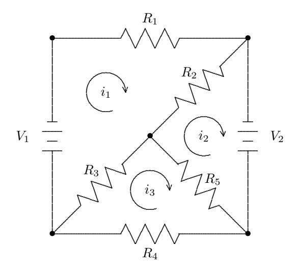
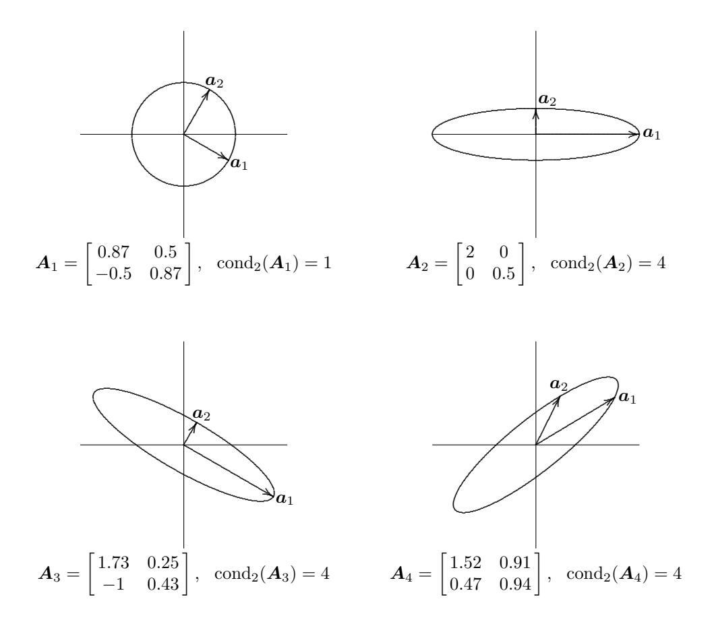
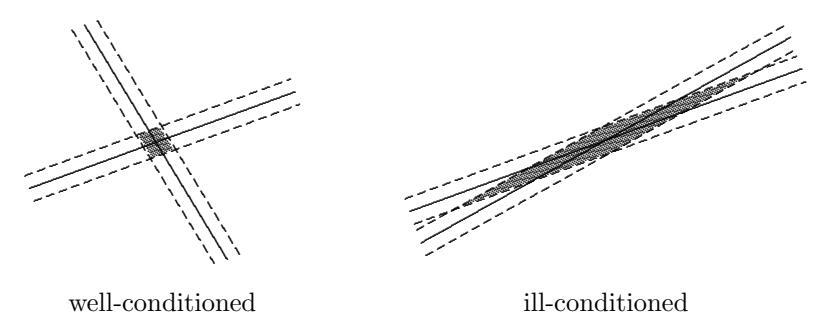
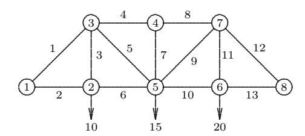

# Lineáris egyenletrendszerek

## 2.1 Lineáris rendszerek

A természetben sok összefüggés lineáris, vagyis a hatások az okaikkal arányosak. A mechanikában például Newton második törvénye, $F = ma$, azt mondja ki, hogy az erő arányos a gyorsulással, ahol az arányossági tényező a tárgy tömege. Ha ismerjük az erőt és a tömeget, akkor ezt a lineáris egyenletet a gyorsulásra nézve meg tudjuk oldani. Az elektromosságtanban az Ohm-törvény, $V = iR$, kimondja, hogy egy vezető két vége közötti feszültség (potenciálkülönbség) arányos a rajta átfolyó árammal, ahol az arányossági tényező az ellenállás. Ismét, ha ismerjük a feszültséget és az ellenállást, meg tudjuk oldani az egyenletet az áramra nézve. A rugalmasságtanban a Hooke-törvény szerint a mechanikai feszültség arányos a deformációval, ahol az arányossági tényező a Young-modulus.

Magasabb dimenziókban az ilyen lineáris kapcsolatokat egy $\mathcal{L}$ lineáris transzformáció fejezi ki, amely egy „okokat" tartalmazó $\boldsymbol{u}$ vektort egy „hatásokat" tartalmazó $\boldsymbol{f}$ vektorhoz rendel:

$$\mathcal{L}\boldsymbol{u} = \boldsymbol{f}.$$

Az Ohm-törvény és a Kirchhoff-törvények például lehetővé teszik, hogy felírjunk egy egész egyenletrendszert, amely egy sok vezetőből álló áramkörben a feszültségek és az áramok közötti lineáris kapcsolatot fejezi ki (lásd a 2.1. példát). Ahogy az elemi lineáris algebrából megtanultuk, két végesdimenziós vektortér közötti lineáris transzformációt kényelmesen egy mátrixszal ábrázolhatunk. Mátrix-vektor jelöléssel egy lineáris algebrai egyenletrendszer alakja

$$A\boldsymbol{x} = \boldsymbol{b},$$

ahol $A$ egy ismert $m \times n$-es mátrix, $\boldsymbol{b}$ egy $m$-dimenziós vektor, $\boldsymbol{x}$ pedig egy $n$-dimenziós vektor. Ha ismerjük $\boldsymbol{x}$-et, akkor egy ilyen lineáris kapcsolat lehetővé teszi, hogy a mátrix-vektor szorzás elvégzésével meghatározzuk a $\boldsymbol{b}$ hatást az $\boldsymbol{x}$ ok alapján: $\boldsymbol{b} = A\boldsymbol{x}$. Gyakrabban azonban a lineáris egyenletrendszerek lehetőséget adnak a „visszafejtésre": ha ismerjük a hatások $\boldsymbol{b}$ vektorát, szeretnénk meghatározni a hozzá tartozó okok $\boldsymbol{x}$ vektorát. E fejezet tárgyát azok a numerikus módszerek képezik, amelyek ezt lehetővé teszik.

Még ha az összefüggések nemlineárisak is, gyakran jól közelíthetők lokálisan (azaz egy adott rögzített érték környezetében) egy lineáris modellel. Pontosan ezt teszi az analízisben a derivált: egy nemlineáris görbéhez lokális lineáris közelítést – az érintőegyenest – rendel. Ez a megfigyelés számos nemlineáris algebrai feladat numerikus megoldási módszerének is az alapja. Még a nem algebrai feladatokat is – például a differenciál- vagy integrálegyenleteket – végső soron lineáris algebrai egyenletrendszerekkel közelíthetjük, ahogyan azt a könyv későbbi részeiben látni fogjuk. Ezért a lineáris egyenletrendszerek megoldása számos gyakorlati számítási feladat numerikus algoritmusának sarokköve, és ennek megfelelően elengedhetetlen, hogy az ilyen rendszereket pontosan és hatékonyan tudjuk megoldani.

Az $A\boldsymbol{x} = \boldsymbol{b}$ lineáris egyenletrendszer lényegében azt a kérdést teszi fel: „kifejezhető-e a $\boldsymbol{b}$ vektor az $A$ mátrix oszlopainak lineáris kombinációjaként?" (azaz „benne van-e $\boldsymbol{b}$ a $\operatorname{span}(A) = \{A\boldsymbol{x} : \boldsymbol{x} \in \mathbb{R}^n\}$ oszloptérben?"). Ha igen, akkor a rendszert *megoldhatónak (konzisztensnek)* mondjuk, és a lineáris kombináció együtthatóit az $\boldsymbol{x}$ megoldásvektor komponensei adják. Előfordulhat, hogy van megoldás, és az is, hogy nincs; ha van megoldás, az lehet egyértelmű, de lehetséges végtelen sok megoldás is. Ebben a fejezetben csak *négyzetes* rendszereket tekintünk, azaz $m = n$ – a mátrix sorainak és oszlopainak száma megegyezik, vagyis az egyenletek száma ($A$ és $\boldsymbol{b}$ sorai) megegyezik az ismeretlenek számával ($\boldsymbol{x}$ komponensei). Az $m \neq n$ esetet a 3. fejezetben tárgyaljuk. Az egyszerűség kedvéért figyelmünket elsősorban valós lineáris rendszerekre fordítjuk; a komplex rendszereket nagyon hasonlóan lehet kezelni.

**2.1. Példa. Elektromos áramkör.** Tekintsük a 2.1. ábrán látható elektromos áramkört. Adottak a $V$ feszültségek és az $R$ ellenállások, és azt szeretnénk meghatározni, milyen $i$ áramok folynak az áramkör három hurkában. Ehhez az alábbi fizikai törvényeket alkalmazzuk:

- **Ohm-törvény:** egy $R$ ellenálláson egy $i$ áram irányában eső feszültségesés $iR$.
- **Kirchhoff huroktörvénye:** egy zárt hurokban a feszültségesések (és forrásfeszültségek) algebrai összege nulla.

Ezeket a törvényeket az áramkör minden hurkára alkalmazva a következő három lineáris egyenletből álló rendszert kapjuk:

$$\begin{aligned}
i_1 R_1 + (i_1 - i_2) R_2 + (i_1 - i_3) R_3 + V_1 &= 0, \\
(i_2 - i_1) R_2 + (i_2 - i_3) R_5 - V_2 &= 0, \\
(i_3 - i_1) R_3 + i_3 R_4 + (i_3 - i_2) R_5 &= 0,
\end{aligned}$$

amely mátrixalakban így írható:

$$\begin{bmatrix} R_1 + R_2 + R_3 & -R_2 & -R_3 \\ -R_2 & R_2 + R_5 & -R_5 \\ -R_3 & -R_5 & R_3 + R_4 + R_5 \end{bmatrix} \begin{bmatrix} i_1 \\ i_2 \\ i_3 \end{bmatrix} = \begin{bmatrix} -V_1 \\ V_2 \\ 0 \end{bmatrix}.$$

Így ez a feladat $A\boldsymbol{x} = \boldsymbol{b}$ alakú, és megoldható az e fejezetben tanulmányozott módszerekkel.



2.1. ábra: Ellenállásokkal és feszültségforrásokkal felépített elektromos áramkör.

## 2.2 Létezés és egyértelműség

Egy $n \times n$-es $\boldsymbol{A}$ mátrixot *nemszingulárisnak* nevezünk, ha az alábbi – egymással ekvivalens – feltételek bármelyike teljesül rá:

1. $\boldsymbol{A}$-nak van inverze (azaz létezik egy olyan, $\boldsymbol{A}^{-1}$-gyel jelölt $n \times n$-es mátrix, amelyre $\boldsymbol{A}\boldsymbol{A}^{-1} = \boldsymbol{A}^{-1}\boldsymbol{A} = \boldsymbol{I}$, az egységmátrix).
2. $\det(\boldsymbol{A}) \neq 0$ (azaz $\boldsymbol{A}$ determinánsa nem nulla).
3. $\operatorname{rank}(\boldsymbol{A}) = n$ (egy mátrix rangja a benne található lineárisan független sorok vagy oszlopok maximális száma).
4. Bármely $\boldsymbol{z} \neq \boldsymbol{0}$ vektorra $\boldsymbol{A}\boldsymbol{z} \neq \boldsymbol{0}$ (azaz $\boldsymbol{A}$ egyetlen nemtriviális vektort sem annullál).

Minden más esetben a mátrix *szinguláris*. Az $\boldsymbol{A}\boldsymbol{x} = \boldsymbol{b}$ lineáris egyenletrendszer megoldásának létezése és egyértelműsége attól függ, hogy az $\boldsymbol{A}$ mátrix szinguláris vagy nemszinguláris. Ha $\boldsymbol{A}$ nemszinguláris, akkor létezik az inverze ($\boldsymbol{A}^{-1}$), és az $\boldsymbol{A}\boldsymbol{x} = \boldsymbol{b}$ rendszernek mindig pontosan egy $\boldsymbol{x} = \boldsymbol{A}^{-1}\boldsymbol{b}$ megoldása van, a $\boldsymbol{b}$ értékétől függetlenül. Ha viszont $\boldsymbol{A}$ szinguláris, akkor a megoldások száma a $\boldsymbol{b}$ jobb oldali vektortól függ: adott $\boldsymbol{b}$ mellett előfordulhat, hogy nincs megoldás, de ha létezik olyan $\boldsymbol{x}$ megoldás, amelyre $\boldsymbol{A}\boldsymbol{x} = \boldsymbol{b}$, akkor az $\boldsymbol{A}(\boldsymbol{x} + \gamma \boldsymbol{z}) = \boldsymbol{b}$ is teljesül bármely $\gamma$ skalárra, ahol $\boldsymbol{z} \neq \boldsymbol{0}$ olyan vektor, amelyre $\boldsymbol{A}\boldsymbol{z} = \boldsymbol{0}$ (ilyen $\boldsymbol{z}$-nek léteznie kell, hiszen ellenkező esetben a definíció 4. feltétele szerint a mátrix nemszinguláris volna). Ezért egy négyzetes, konzisztens és szinguláris lineáris rendszer megoldása sosem lehet egyértelmű. Adott négyzetes $\boldsymbol{A}$ mátrixra és $\boldsymbol{b}$ jobb oldali vektorra a lehetőségeket az alábbiak foglalják össze:

- **Egyértelmű megoldás:** $\boldsymbol{A}$ nemszinguláris, $\boldsymbol{b}$ tetszőleges.
- **Végtelen sok megoldás:** $\boldsymbol{A}$ szinguláris, $\boldsymbol{b} \in \operatorname{span}(\boldsymbol{A})$ (konzisztens).
- **Nincs megoldás:** $\boldsymbol{A}$ szinguláris, $\boldsymbol{b} \notin \operatorname{span}(\boldsymbol{A})$ (inkonzisztens).

Két dimenzióban a rendszer minden lineáris egyenlete egy egyenest határoz meg a síkban. A rendszer megoldása a két egyenes metszéspontja. Ha a két egyenes nem párhuzamos, akkor pontosan egy metszéspontjuk van (a nemszinguláris eset). Ha a két egyenes párhuzamos, akkor vagy egyáltalán nem metszik egymást (nincs megoldás), vagy a két egyenes egybeesik (az egyenes bármely pontja megoldás). Magasabb dimenziókban minden egyenlet egy hipersíkot határoz meg. A nemszinguláris esetben az egyértelmű megoldás az összes hipersík metszéspontja.

**2.2. Példa. Szingularitás és nemszingularitás.** A $2 \times 2$-es

$$\begin{aligned}
2x_1 + 3x_2 &= b_1, \\
5x_1 + 4x_2 &= b_2,
\end{aligned}$$

rendszer – vagy mátrix-vektor jelöléssel:

$$\boldsymbol{A}\boldsymbol{x} = \begin{bmatrix} 2 & 3 \\ 5 & 4 \end{bmatrix} \begin{bmatrix} x_1 \\ x_2 \end{bmatrix} = \begin{bmatrix} b_1 \\ b_2 \end{bmatrix} = \boldsymbol{b},$$

– a $\boldsymbol{b}$ értékétől függetlenül egyértelmű megoldással rendelkezik, mert az $\boldsymbol{A}$ nemszinguláris. Például ha $\boldsymbol{b} = \begin{bmatrix} 8 & 13 \end{bmatrix}^T$, akkor az egyértelmű megoldás $\boldsymbol{x} = \begin{bmatrix} 1 & 2 \end{bmatrix}^T$.

Viszont a $2 \times 2$-es

$$\boldsymbol{A}\boldsymbol{x} = \begin{bmatrix} 2 & 3 \\ 4 & 6 \end{bmatrix} \begin{bmatrix} x_1 \\ x_2 \end{bmatrix} = \begin{bmatrix} b_1 \\ b_2 \end{bmatrix} = \boldsymbol{b}$$

rendszerben az $\boldsymbol{A}$ mátrix szinguláris, ezért a $\boldsymbol{b}$ konkrét értékétől függően előfordulhat, hogy van megoldás, de az is, hogy nincs, egyértelmű megoldása viszont semmiképpen sem lehet. Például ha $\boldsymbol{b} = \begin{bmatrix} 4 & 7 \end{bmatrix}^T$, akkor nincs megoldás, ha viszont $\boldsymbol{b} = \begin{bmatrix} 4 & 8 \end{bmatrix}^T$, akkor az

$$\boldsymbol{x} = \begin{bmatrix} \gamma \\ (4 - 2\gamma)/3 \end{bmatrix}$$

megoldás bármely $\gamma$ valós számra.

## 2.3 Érzékenység és kondicionáltság

Miután megfogalmaztuk az $\boldsymbol{A}\boldsymbol{x} = \boldsymbol{b}$ lineáris egyenletrendszer megoldásának létezésére és egyértelműségére vonatkozó feltételeket, most az $\boldsymbol{x}$ megoldás érzékenységét vizsgáljuk a bemeneti adatok perturbációival szemben, amelyek ebben a feladatban az $\boldsymbol{A}$ mátrix és a $\boldsymbol{b}$ jobb oldali vektor. Az ilyen perturbációk méréséhez szükségünk van a vektorok és mátrixok „méretének" valamilyen fogalmára. A nagyság, abszolút érték vagy modulus skaláris fogalma általánosítható a vektorok és mátrixok normáinak fogalmára.

### 2.3.1 Vektornormák

Bár általánosabb definíció is lehetséges, a továbbiakban használt vektornormák mind a $p$-normák speciális esetei, amelyeket egy $p \ge 1$ szám és egy $n$-dimenziós $\boldsymbol{x}$ vektor esetén a következőképpen definiálunk:

$$\|\boldsymbol{x}\|_p = \left(\sum_{i=1}^n |x_i|^p\right)^{1/p}.$$

Fontos speciális esetek:

- 1-norma:

$$\|\boldsymbol{x}\|_1 = \sum_{i=1}^n |x_i|,$$

amelyet néha Manhattan-normának is neveznek, mivel két dimenzióban ez két pont „háztömbökben" mért távolságának felel meg.

- 2-norma:

$$\|\boldsymbol{x}\|_2 = \left(\sum_{i=1}^n |x_i|^2\right)^{1/2},$$

amely az euklideszi térben megszokott távolságfogalomnak felel meg, ezért euklideszi normának is nevezzük.

- $\infty$-norma (maximum norma):

$$\|\boldsymbol{x}\|_{\infty} = \max_{1 \le i \le n} |x_i|,$$

amely $p \to \infty$ határesetként értelmezhető.

Ezek a normák kvalitatívan mind hasonló eredményeket adnak, de bizonyos körülmények között egy adott norma kezelhető a legkönnyebben analitikusan vagy számítási szempontból. A lineáris egyenletrendszerek megoldásainak érzékenységi vizsgálatához általában az 1-normát vagy az $\infty$-normát használjuk. A 2-normát később, más kontextusokban fogjuk kiterjedten alkalmazni. E normák közötti különbségeket $\mathbb{R}^2$-ben a 2.2. ábra szemlélteti, amely az egységgömböt, azaz az $\{\boldsymbol{x} : \|\boldsymbol{x}\|_p = 1\}$ halmazt mutatja $p = 1, 2, \infty$ esetén. (Megjegyzendő, hogy az egységgömböt – amelyet két dimenzióban pontosabb lenne egységkörnek nevezni – csak a 2-normában valóban „kerek", innen kapta a nevét.) Egy vektor normája egyszerűen az a tényező, amellyel a megfelelő egységgömböt ki kell tágítani vagy össze kell zsugorítani ahhoz, hogy az a vektort éppen magában foglalja.

**2.3. Példa. Vektornormák.** A 2.2. ábrán látható $\boldsymbol{x} = [-1{,}6, 1{,}2]^T$ vektor esetén

$$\|\boldsymbol{x}\|_1 = 2{,}8, \quad \|\boldsymbol{x}\|_2 = 2{,}0, \quad \|\boldsymbol{x}\|_{\infty} = 1{,}6.$$


2.2. ábra: Egységgömbök különböző vektornormákban.

Általában tetszőleges $n$-dimenziós $\boldsymbol{x}$ vektor esetén:

$$\|\boldsymbol{x}\|_1 \ge \|\boldsymbol{x}\|_2 \ge \|\boldsymbol{x}\|_{\infty}.$$

Másrészt az is fennáll, hogy

$$\|\boldsymbol{x}\|_1 \le \sqrt{n} \|\boldsymbol{x}\|_2, \quad \|\boldsymbol{x}\|_2 \le \sqrt{n} \|\boldsymbol{x}\|_{\infty}, \quad \text{és} \quad \|\boldsymbol{x}\|_1 \le n \|\boldsymbol{x}\|_{\infty}.$$

Így adott $n$ esetén e normák közül bármely kettő legfeljebb egy konstans szorzóban tér el egymástól, tehát abban az értelemben mind ekvivalensek, hogy ha az egyik kicsi, akkor valamennyinek arányosan kicsinek kell lennie (valójában minden $p$-norma ekvivalens ebben az értelemben). Ezért mindig azt a normát választhatjuk, amelyik az adott kontextusban a legkényelmesebb. A könyv hátralévő részében megfelelő alsó index jelöli majd a konkrét normát, amikor ez szükséges, de az alsó indexet elhagyjuk, ha mindegy, hogy éppen melyik normát használjuk.

Minden vektor $p$-norma rendelkezik a következő fontos tulajdonságokkal, ahol $\boldsymbol{x}$ és $\boldsymbol{y}$ tetszőleges vektorok:

1. $\|\boldsymbol{x}\| > 0$, ha $\boldsymbol{x} \neq \boldsymbol{0}$.
2. $\|\gamma \boldsymbol{x}\| = |\gamma| \cdot \|\boldsymbol{x}\|$ tetszőleges $\gamma$ skalár esetén.
3. $\|\boldsymbol{x} + \boldsymbol{y}\| \le \|\boldsymbol{x}\| + \|\boldsymbol{y}\|$ (háromszög-egyenlőtlenség).

Általánosabb megközelítésben egy vektornorma *definíciójaként* bármely olyan valós értékű függvényt tekinthetünk egy vektoron, amely e három tulajdonságot teljesíti. Megjegyzendő, hogy az első két tulajdonság együtt magában foglalja, hogy $\|\boldsymbol{x}\| = 0$ akkor és csak akkor, ha $\boldsymbol{x} = \boldsymbol{0}$. A háromszög-egyenlőtlenség hasznos változata:

$$|\|\boldsymbol{x}\| - \|\boldsymbol{y}\|| \le \|\boldsymbol{x} - \boldsymbol{y}\|,$$

amely egyúttal azt is megmutatja, hogy a vektornorma folytonos függvény.

### 2.3.2 Mátrixnormák

A mátrixok méretének vagy nagyságának mérésére is szükségünk van valamilyen módszerre. Itt is lehetséges általánosabb definíció, de a továbbiakban használt mátrixnormákat mind egy alapul szolgáló vektornorma segítségével definiáljuk. Pontosabban: egy adott vektornorma mellett egy $m \times n$ méretű $\boldsymbol{A}$ mátrixhoz tartozó mátrixnormát a következőképpen értelmezzük:

$$\|\boldsymbol{A}\| = \max_{\boldsymbol{x} \neq \boldsymbol{0}} \frac{\|\boldsymbol{A}\boldsymbol{x}\|}{\|\boldsymbol{x}\|}.$$

Az ilyen mátrixnormáról azt mondjuk, hogy a vektornorma által *indukált* (vagy annak szubordinált) normája. Szemléletesen: a mátrix normája azt a maximális nyújtást méri, amelyet a mátrix az adott vektornormában mérve bármely vektoron végrehajthat.

Egyes mátrixnormák sokkal könnyebben számíthatók ki, mint mások. Például az 1-es vektornorma által indukált mátrixnorma egyszerűen a mátrix maximális abszolút oszlopösszege:

$$\|\boldsymbol{A}\|_1 = \max_j \sum_{i=1}^m |a_{ij}|,$$

a maximum-norma ($\infty$-norma) által indukált mátrixnorma pedig egyszerűen a mátrix maximális abszolút sorösszege:

$$\|\boldsymbol{A}\|_{\infty} = \max_{i} \sum_{j=1}^{n} |a_{ij}|.$$

Könnyű megjegyezni őket úgy, hogy ezek a mátrixnormák egy $n \times 1$ méretű mátrix (oszlopvektor) esetén megegyeznek a megfelelő vektornormákkal. Sajnos a 2-es vektornorma által indukált mátrixnormát nem olyan könnyű kiszámítani (lásd a 3.6.1. szakaszt).

**2.4. Példa. Mátrixnormák.** Az

$$\boldsymbol{A} = \begin{bmatrix} 2 & -1 & 1 \\ 1 & 0 & 1 \\ 3 & -1 & 4 \end{bmatrix}$$

mátrix esetén a maximális abszolút oszlop- és sorösszegekből rendre

$$\|\boldsymbol{A}\|_1 = 6 \quad \text{és} \quad \|\boldsymbol{A}\|_{\infty} = 8$$

adódik. (E mátrix 2-normájához lásd a 3.17. példát.)

Az így definiált mátrixnormák a következő fontos tulajdonságokkal rendelkeznek, ahol $\boldsymbol{A}$ és $\boldsymbol{B}$ tetszőleges mátrixok:

1. $\|\boldsymbol{A}\| > 0$, ha $\boldsymbol{A} \neq \boldsymbol{O}$.
2. $\|\gamma \boldsymbol{A}\| = |\gamma| \cdot \|\boldsymbol{A}\|$ tetszőleges $\gamma$ skalár esetén.
3. $\|\boldsymbol{A} + \boldsymbol{B}\| \le \|\boldsymbol{A}\| + \|\boldsymbol{B}\|$.
4. $\|\boldsymbol{A}\boldsymbol{B}\| \le \|\boldsymbol{A}\| \cdot \|\boldsymbol{B}\|$.
5. $\|\boldsymbol{A}\boldsymbol{x}\| \le \|\boldsymbol{A}\| \cdot \|\boldsymbol{x}\|$ tetszőleges $\boldsymbol{x}$ vektor esetén.

Általánosabb megközelítésben egy mátrixnorma definíciójaként bármely olyan valós értékű mátrixfüggvényt tekinthetünk, amely az első három tulajdonságot teljesíti. A fennmaradó két tulajdonság, amelyeket *szubmultiplikatív* vagy konzisztenciafeltételeknek neveznek, az ilyen általánosabb mátrixnormákra nem feltétlenül teljesül, de a vektor $p$-normák által indukált mátrixnormákra mindig érvényes. Ismét megjegyezzük, hogy az első két tulajdonság együtt azt eredményezi, hogy $\|\boldsymbol{A}\| = 0$ akkor és csak akkor, ha $\boldsymbol{A} = \boldsymbol{O}$ (ahol $\boldsymbol{O}$ a zérusmátrix).

### 2.3.3 Mátrix kondíciószáma

Egy nemszinguláris $\boldsymbol{A}$ négyzetes mátrix adott mátrixnormára vonatkozó kondíciószámát a következőképpen definiáljuk:

$$\operatorname{cond}(\boldsymbol{A}) = \|\boldsymbol{A}\| \cdot \|\boldsymbol{A}^{-1}\|.$$

Megállapodás szerint $\operatorname{cond}(\boldsymbol{A}) = \infty$, ha $\boldsymbol{A}$ szinguláris. A 2.3.4. szakaszban látni fogjuk, hogy ez a fogalom összhangban van a kondíciószám 1.2.6. szakaszban bevezetett általános fogalmával, amennyiben a mátrix kondíciószáma felső korlátot ad a megoldás relatív változásának és a bemeneti adatok relatív változásának arányára.

**2.5. Példa. Mátrix kondíciószáma.** Mátrixszorzással könnyen ellenőrizhető, hogy a 2.4. példában szereplő mátrix inverze:

$$\boldsymbol{A}^{-1} = \begin{bmatrix} 0{,}5 & 1{,}5 & -0{,}5 \\ -0{,}5 & 2{,}5 & -0{,}5 \\ -0{,}5 & -0{,}5 & 0{,}5 \end{bmatrix},$$

amelyből

$$\|\boldsymbol{A}^{-1}\|_1 = 4{,}5 \quad \text{és} \quad \|\boldsymbol{A}^{-1}\|_{\infty} = 3{,}5.$$

Ezek alapján

$$\operatorname{cond}_1(\boldsymbol{A}) = \|\boldsymbol{A}\|_1 \cdot \|\boldsymbol{A}^{-1}\|_1 = 6 \cdot 4{,}5 = 27$$

és

$$\operatorname{cond}_{\infty}(\boldsymbol{A}) = \|\boldsymbol{A}\|_{\infty} \cdot \|\boldsymbol{A}^{-1}\|_{\infty} = 8 \cdot 3{,}5 = 28.$$

E mátrix 2-normára vonatkozó kondíciószámát a 3.17. példa tárgyalja.

A 2.5. példából látható, hogy egy $n \times n$-es mátrix kondíciószámának értéke függ az alkalmazott normától (amit az alsó index jelez), de az alapul szolgáló vektornormák ekvivalenciája miatt ezek az értékek legfeljebb egy rögzített (csak $n$-től függő) konstans szorzó erejéig térnek el egymástól, így a kondicionáltság kvantitatív mértékeként egyaránt hasznosak.

Mivel

$$\|\boldsymbol{A}\| \cdot \|\boldsymbol{A}^{-1}\| = \left(\max_{\boldsymbol{x} \neq \boldsymbol{0}} \frac{\|\boldsymbol{A}\boldsymbol{x}\|}{\|\boldsymbol{x}\|}\right) \cdot \left(\min_{\boldsymbol{x} \neq \boldsymbol{0}} \frac{\|\boldsymbol{A}\boldsymbol{x}\|}{\|\boldsymbol{x}\|}\right)^{-1},$$

a mátrix kondíciószáma a maximális relatív nyújtás és a maximális relatív zsugorítás arányát méri, amelyet a mátrix bármely nem nulla vektoron végrehajthat. Úgy is fogalmazhatunk, hogy a mátrix kondíciószáma az egységgömb torzulásának mértékét jellemzi (a megfelelő vektornormában) a mátrixszal való transzformáció során. Minél nagyobb a kondíciószám, annál elnyújtottabb és torzabb lesz az egységgömb képe. Két dimenzióban például a 2-normabeli egységkörből egyre inkább szivar alakú ellipszis lesz, az 1-normában vagy az $\infty$-normában pedig az egységgömb (amely euklideszi értelemben négyzet) egyre ferdébb paralelogrammává torzul a kondíciószám növekedésével.

**2.6. Példa. Mátrix kondíciószáma.** A 2.3. ábra négy különböző mátrix hatását szemlélteti az $\mathbb{R}^2$-beli egységkörön, a 2-normát használva. $\boldsymbol{A}_1$ az egységkört 30 fokkal az óramutató járásával megegyező irányba forgatja el, de egyik vektor euklideszi hosszát sem változtatja meg, így $\operatorname{cond}_2(\boldsymbol{A}_1) = 1$. $\boldsymbol{A}_2$ az $\boldsymbol{e}_1$ bázisvektort 2-szeresére nyújtja, az $\boldsymbol{e}_2$ bázisvektort pedig 0,5-szeresére zsugorítja; mivel mindkét változtatás maximális mértékű, $\operatorname{cond}_2(\boldsymbol{A}_2) = 2/0{,}5 = 4$. $\boldsymbol{A}_3$ egyszerre forgatja és torzítja az egységkört, de a maximális arány itt is megegyezik $\boldsymbol{A}_2$ értékével, így $\operatorname{cond}_2(\boldsymbol{A}_3) = 4$. Végül $\boldsymbol{A}_4$ egy általánosabb transzformáció, amelynél a maximális nyújtási arány már nem a bázisvektoroknál jelentkezik, de a maximum értéke továbbra is ugyanaz, tehát $\operatorname{cond}_2(\boldsymbol{A}_4) = 4$.



2.3. ábra: Az egységkör transzformációja 2-normában különböző mátrixokkal.

A kondíciószám következő fontos tulajdonságai a definícióból könnyen levezethetők, és tetszőleges normára érvényesek:

1. Tetszőleges $\boldsymbol{A}$ mátrix esetén $\operatorname{cond}(\boldsymbol{A}) \ge 1$.
2. Az egységmátrixra $\operatorname{cond}(\boldsymbol{I}) = 1$.
3. Tetszőleges $\boldsymbol{A}$ mátrix és nem nulla $\gamma$ skalár esetén $\operatorname{cond}(\gamma \boldsymbol{A}) = \operatorname{cond}(\boldsymbol{A})$.
4. Tetszőleges $\boldsymbol{D} = \operatorname{diag}(d_i)$ diagonális mátrix esetén $\operatorname{cond}(\boldsymbol{D}) = (\max |d_i|)/(\min |d_i|)$.

A kondíciószám azt méri, hogy a mátrix mennyire van közel a szingularitáshoz: egy nagy kondíciószámú mátrix (ezt a 2.3.4. szakaszban számszerűsítjük) közel szinguláris, míg az 1-hez közeli kondíciószámú mátrix távol van a szingularitástól. A definícióból adódik, hogy egy nemszinguláris mátrix és az inverze kondíciószáma megegyezik. Ez szemléletesen is érthető: ha egy mátrix közel szinguláris, akkor az inverze is ugyanolyan mértékben „közel" van a szingularitáshoz.

Megjegyzendő, hogy a mátrix determinánsa nem megbízható mutatója a szingularitáshoz való közelségnek: bár az $\boldsymbol{A}$ mátrix szinguláris, ha $\det(\boldsymbol{A}) = 0$, a nem nulla determináns nagysága önmagában semmilyen információt nem ad a kondicionáltságról. Például $\det(\alpha \boldsymbol{I}_n) = \alpha^n$, ami $|\alpha| < 1$ esetén tetszőlegesen kicsi lehet, ennek ellenére a mátrix bármely $\alpha \neq 0$ esetén tökéletesen jól kondicionált, kondíciószáma minden mátrixnormában pontosan 1.

A kondíciószám hasznossága a lineáris egyenletrendszerek megoldásának becsült pontosságában rejlik. Mivel a kondíciószám definíciója tartalmazza a mátrix inverzét, a kiszámítása nem triviális. Valójában a kondíciószám közvetlen kiszámítása lényegesen nagyobb munkát igényelne, mint magának az egyenletrendszernek a megoldása. A gyakorlatban ezért a kondíciószámot csupán becsüljük (rendszerint egy nagyságrendnyi pontossággal), a megoldási folyamat viszonylag olcsó „melléktermékeként".

Az $\|\boldsymbol{A}\|$ mátrixnormát könnyen kiszámíthatjuk a maximális oszlop- vagy sorösszegként. A kihívást az $\|\boldsymbol{A}^{-1}\|$ költséghatékony becslése jelenti. A normák tulajdonságaiból tudjuk, hogy ha $\boldsymbol{z}$ az $\boldsymbol{A}\boldsymbol{z} = \boldsymbol{y}$ rendszer megoldása, akkor:

$$\|\boldsymbol{z}\| = \|\boldsymbol{A}^{-1}\boldsymbol{y}\| \le \|\boldsymbol{A}^{-1}\| \cdot \|\boldsymbol{y}\|,$$

így

$$\frac{\|\boldsymbol{z}\|}{\|\boldsymbol{y}\|} \le \|\boldsymbol{A}^{-1}\|,$$

és ez a korlát valamely optimálisan választott $\boldsymbol{y}$ vektor esetén egyenlőségként is teljesülhet. Ezért ha $\boldsymbol{y}$-t úgy választjuk meg, hogy a $\|\boldsymbol{z}\|/\|\boldsymbol{y}\|$ hányados a lehető legnagyobb legyen, ésszerű becslést kapunk $\|\boldsymbol{A}^{-1}\|$-re.

**2.7. Példa. Kondícióbecslés.** Tekintsük az alábbi mátrixot:

$$\boldsymbol{A} = \begin{bmatrix} 0{,}913 & 0{,}659 \\ 0{,}457 & 0{,}330 \end{bmatrix}.$$

Ha $\boldsymbol{y} = [0, 1{,}5]^T$-t választjuk, akkor $\boldsymbol{z} = [-7780, 10780]^T$, tehát

$$\|\boldsymbol{A}^{-1}\|_{1} \approx \frac{\|\boldsymbol{z}\|_{1}}{\|\boldsymbol{y}\|_{1}} \approx 1{,}238 \times 10^{4},$$

és így

$$\operatorname{cond}_1(\boldsymbol{A}) = \|\boldsymbol{A}\|_1 \cdot \|\boldsymbol{A}^{-1}\|_1 \approx 1{,}370 \times 1{,}238 \times 10^4 = 1{,}696 \times 10^4,$$

ami – mint kiderül – a megadott tizedesjegyek erejéig pontos. E viszonylag nagy kondíciószám következményeit a 2.8. és a 2.17. példában vizsgáljuk meg.

A 2.7. példabeli $\boldsymbol{y}$ vektort gondosan úgy választottuk meg, hogy a maximális hányadost adja, és így $\|\boldsymbol{A}^{-1}\|$ pontos értékét kapjuk meg. Egy ilyen optimális $\boldsymbol{y}$ megtalálása általában túl sok számítási kapacitást igényelne, de léteznek olcsóbb közelítések is. Az egyik heurisztika szerint $\boldsymbol{y}$-t az $\boldsymbol{A}^T \boldsymbol{y} = \boldsymbol{c}$ rendszer megoldásaként keressük, ahol $\boldsymbol{c}$ komponensei $\pm 1$ értékűek, és az előjeleket úgy választjuk meg, hogy az adódó $\boldsymbol{y}$ a lehető legnagyobb legyen. Egy másik stratégia egyszerűen néhány véletlenszerű $\boldsymbol{y}$ vektorral próbálkozik; a kapott legnagyobb hányados általában elegendő becslést ad $\|\boldsymbol{A}^{-1}\|$-re.

A kondícióbecslés egy alternatív megközelítése, hogy a feladatot konvex optimalizálási problémaként kezeljük, ami heurisztikus algoritmusokkal nagyon hatékonyan megoldható. A 2-norma esetén lehetőség van a szingulárisérték-felbontásból (SVD) való származtatásra is (lásd 3.6.1. szakasz), de ez aránytalanul nagy számításigényű, hacsak az SVD-t egyéb okból amúgy sem számítjuk ki. Szerencsére a felhasználóknak ritkán kell ezekkel a részletekkel foglalkozniuk, mivel a modern szoftvercsomagok többsége tartalmaz hatékony és megbízható kondícióbecslőt (lásd a 2.1. táblázatot).

### 2.3.4 Hibakorlátok

A kondíciószám nemcsak a szingularitáshoz való közelség megbízható mutatója, hanem kvantitatív korlátot is ad a lineáris egyenletrendszer számított megoldásának hibájára. Legyen $\boldsymbol{x}$ a nemszinguláris $\boldsymbol{A}\boldsymbol{x} = \boldsymbol{b}$ lineáris egyenletrendszer megoldása, és legyen $\hat{\boldsymbol{x}}$ az $\boldsymbol{A}\hat{\boldsymbol{x}} = \boldsymbol{b} + \Delta \boldsymbol{b}$ perturbált jobb oldallal rendelkező rendszer megoldása. Ha definiáljuk a $\Delta \boldsymbol{x} = \hat{\boldsymbol{x}} - \boldsymbol{x}$ hibavektort, akkor:

$$\boldsymbol{A}\hat{\boldsymbol{x}} = \boldsymbol{A}(\boldsymbol{x} + \Delta\boldsymbol{x}) = \boldsymbol{A}\boldsymbol{x} + \boldsymbol{A}\,\Delta\boldsymbol{x} = \boldsymbol{b} + \Delta\boldsymbol{b}.$$

Mivel $\boldsymbol{A}\boldsymbol{x} = \boldsymbol{b}$, ezért $\boldsymbol{A}\,\Delta \boldsymbol{x} = \Delta \boldsymbol{b}$ kell hogy teljesüljön, amiből következik, hogy $\Delta \boldsymbol{x} = \boldsymbol{A}^{-1}\Delta \boldsymbol{b}$. Normát véve kapjuk az

$$\|\boldsymbol{b}\| = \|\boldsymbol{A}\boldsymbol{x}\| \le \|\boldsymbol{A}\| \cdot \|\boldsymbol{x}\|, \quad \text{vagyis} \quad \|\boldsymbol{x}\| \ge \|\boldsymbol{b}\|/\|\boldsymbol{A}\|,$$

és a

$$\|\Delta \boldsymbol{x}\| = \|\boldsymbol{A}^{-1}\Delta \boldsymbol{b}\| \le \|\boldsymbol{A}^{-1}\| \cdot \|\Delta \boldsymbol{b}\|$$

egyenlőtlenségeket. E két összefüggést kombinálva adódik:

$$\frac{\|\Delta \boldsymbol{x}\|}{\|\boldsymbol{x}\|} \leq \|\boldsymbol{A}^{-1}\| \cdot \|\Delta \boldsymbol{b}\| \frac{\|\boldsymbol{A}\|}{\|\boldsymbol{b}\|}.$$

A definíció szerinti $\|\boldsymbol{A}\| \cdot \|\boldsymbol{A}^{-1}\| = \operatorname{cond}(\boldsymbol{A})$ behelyettesítésével a következő korlátot kapjuk:

$$\frac{\|\Delta \boldsymbol{x}\|}{\|\boldsymbol{x}\|} \leq \operatorname{cond}(\boldsymbol{A}) \frac{\|\Delta \boldsymbol{b}\|}{\|\boldsymbol{b}\|}.$$

A mátrix kondíciószáma tehát egy „erősítési tényező", amely a jobb oldali vektor adott relatív változásából fakadó megoldás maximális relatív változását korlátozza (vö. a kondíciószám 1.2.6. szakaszban megadott általános fogalmával).

Hasonló eredmény érvényes az $\boldsymbol{A}$ mátrix elemeinek relatív változásaira is. Ha $\boldsymbol{A}\boldsymbol{x} = \boldsymbol{b}$ és $(\boldsymbol{A} + \boldsymbol{E})\hat{\boldsymbol{x}} = \boldsymbol{b}$, akkor:

$$\Delta \boldsymbol{x} = \hat{\boldsymbol{x}} - \boldsymbol{x} = \boldsymbol{A}^{-1}(\boldsymbol{A}\hat{\boldsymbol{x}} - \boldsymbol{b}) = -\boldsymbol{A}^{-1}\boldsymbol{E}\hat{\boldsymbol{x}}.$$

Normát véve az

$$\|\Delta \boldsymbol{x}\| \leq \|\boldsymbol{A}^{-1}\| \cdot \|\boldsymbol{E}\| \cdot \|\hat{\boldsymbol{x}}\|$$

egyenlőtlenséget kapjuk, amelyből $\operatorname{cond}(\boldsymbol{A})$ segítségével adódik a

$$\frac{\|\Delta \boldsymbol{x}\|}{\|\hat{\boldsymbol{x}}\|} \leq \operatorname{cond}(\boldsymbol{A}) \frac{\|\boldsymbol{E}\|}{\|\boldsymbol{A}\|}$$

korlát.

Az iménti algebrai levezetések alternatívájaként a lineáris egyenletrendszerek érzékenységét differenciálszámítás segítségével is becsülhetjük. A $t$ valós paraméter bevezetésével definiáljuk az $\boldsymbol{A}(t) = \boldsymbol{A} + t\boldsymbol{E}$ és $\boldsymbol{b}(t) = \boldsymbol{b} + t\Delta \boldsymbol{b}$ mennyiségeket, és tekintsük az $\boldsymbol{A}(t)\boldsymbol{x}(t) = \boldsymbol{b}(t)$ rendszer $\boldsymbol{x}(t)$ megoldását. Ezt az egyenletet $t$ szerint differenciálva:

$$\boldsymbol{A}'(t)\boldsymbol{x}(t) + \boldsymbol{A}(t)\boldsymbol{x}'(t) = \boldsymbol{b}'(t),$$

vagy ekvivalens módon

$$\boldsymbol{E}\boldsymbol{x}(t) + \boldsymbol{A}(t)\boldsymbol{x}'(t) = \Delta \boldsymbol{b}$$

adódik. Átrendezve kapjuk, hogy

$$\boldsymbol{x}'(t) = \boldsymbol{A}(t)^{-1} (\Delta \boldsymbol{b} - \boldsymbol{E} \boldsymbol{x}(t)),$$

amiből

$$\boldsymbol{x}'(0) = \boldsymbol{A}^{-1}(\Delta \boldsymbol{b} - \boldsymbol{E}\boldsymbol{x}(0)).$$

A Taylor-formula szerint $\boldsymbol{x}(t) = \boldsymbol{x}(0) + t\boldsymbol{x}'(0) + \mathcal{O}(t^2)$, tehát:

$$\boldsymbol{x}(t) - \boldsymbol{x}(0) = t\boldsymbol{x}'(0) + \mathcal{O}(t^2) = t\boldsymbol{A}^{-1}(\Delta\boldsymbol{b} - \boldsymbol{E}\boldsymbol{x}(0)) + \mathcal{O}(t^2).$$

Legyen $\boldsymbol{x} \equiv \boldsymbol{x}(0)$; normát véve, majd $\|\boldsymbol{x}\|$-szel osztva a

$$\frac{\|\boldsymbol{x}(t) - \boldsymbol{x}\|}{\|\boldsymbol{x}\|} \leq \|\boldsymbol{A}^{-1}\| \left( \frac{\|\Delta \boldsymbol{b}\|}{\|\boldsymbol{x}\|} + \|\boldsymbol{E}\| \right) |t| + \mathcal{O}(t^{2})$$

$$\leq \operatorname{cond}(\boldsymbol{A}) \left( \frac{\|\Delta \boldsymbol{b}\|}{\|\boldsymbol{A}\| \cdot \|\boldsymbol{x}\|} + \frac{\|\boldsymbol{E}\|}{\|\boldsymbol{A}\|} \right) |t| + \mathcal{O}(t^{2})$$

$$\leq \operatorname{cond}(\boldsymbol{A}) \left( \frac{\|\Delta \boldsymbol{b}\|}{\|\boldsymbol{b}\|} + \frac{\|\boldsymbol{E}\|}{\|\boldsymbol{A}\|} \right) |t| + \mathcal{O}(t^{2})$$

korlátot kapjuk.

Ismét azt látjuk tehát, hogy a megoldás relatív változását a kondíciószám és a feladat adatainak relatív változásának szorzata korlátozza.

Az érzékenységi eredmények geometriai értelmezése két dimenzióban: ha a két egyenlet által meghatározott egyenesek közel párhuzamosak, akkor metszéspontjuk nem határozható meg élesen, amennyiben az egyenesek kerekítési vagy mérési hiba miatt némileg bizonytalanok. Ha viszont az egyenesek távol vannak a párhuzamostól, például közel merőlegesek, akkor metszéspontjuk viszonylag stabil marad. Így a nagy kondíciószám a megoldás nagy bizonytalanságával jár.



2.4. ábra: Jól kondicionált és rosszul kondicionált lineáris egyenletrendszerek.

Összefoglalva: ha a bemeneti adatok gépi pontosságig helyesek, akkor egy $\boldsymbol{A}\boldsymbol{x} = \boldsymbol{b}$ lineáris egyenletrendszer közelítő $\hat{\boldsymbol{x}}$ megoldásának relatív hibájára a következő becslést várhatjuk:

$$\frac{\|\hat{\boldsymbol{x}}-\boldsymbol{x}\|}{\|\boldsymbol{x}\|}\lessapprox \operatorname{cond}(\boldsymbol{A})\;\epsilon_{\mathrm{mach}}.$$

Ezt az eredményt a hátraható hibaelemzés nyelvén úgy értelmezhetjük, hogy a számított megoldás a bemenet pontosságához képest körülbelül $\log_{10}(\operatorname{cond}(\boldsymbol{A}))$ értékes jegyet veszít a pontosságából. A 2.7. példabeli mátrix kondíciószáma például nagyobb $10^4$-nél, ezért az ilyen mátrixot tartalmazó lineáris egyenletrendszer megoldásában nem várhatunk helyes számjegyet, hacsak a bemeneti adatok négy értékes jegynél pontosabbak, és a munkapontosság is több mint négy értékes jegyet hordoz (lásd a 2.8. és a 2.17. példát).

Az érzékenység kvantitatív mértékeként a mátrix kondíciószáma a lineáris egyenletrendszerek megoldásának feladatában ugyanazt a szerepet tölti be — és ugyanolyan típusú kapcsolatot ad az előreható és a hátraható hiba között —, mint az 1.2.6. szakaszban definiált általános kondíciószám. Fontos különbség azonban, hogy a mátrix kondíciószáma soha nem lehet kisebb 1-nél.

A pontosság kondíciószámok alapján történő megítéléséhez érdemes figyelembe venni az alábbiakat:

- A fenti normaalapú elemzés a megoldásvektor *legnagyobb* komponenseinek relatív hibájára ad korlátot. A kisebb komponensek *relatív* hibája ennél jóval nagyobb is lehet, mivel a vektornormát a legnagyobb komponensek dominálják. Komponensenkénti hibakorlátok is nyerhetők, de ezek kiszámítása összetettebb, így ezzel itt nem foglalkozunk. Ezek a korlátok különösen akkor fontosak, ha a rendszer rosszul skálázott (lásd a 2.4.10. szakaszt).

- A mátrix kondíciószámát befolyásolja a skálázás (lásd a 2.10. példát). Nagy kondíciószám adódhat pusztán rossz skálázásból is (lásd a 2.20. példát), nem csak a szingularitás közelségéből. A mátrix átskálázása az előbbi problémán segíthet, az utóbbin nem (lásd a 2.4.10. szakaszt).

### 2.3.5 Maradék

Egy egyenlet megoldásának egyik legegyszerűbb ellenőrzési módja, hogy az értéket visszahelyettesítjük az egyenletbe, és megnézzük, mennyire egyezik meg a bal és a jobb oldal. Az $\boldsymbol{A}\boldsymbol{x} = \boldsymbol{b}$ lineáris egyenletrendszer közelítő $\hat{\boldsymbol{x}}$ megoldásának **maradéka** (reziduuma) az alábbi különbség:

$$\boldsymbol{r} = \boldsymbol{b} - \boldsymbol{A}\hat{\boldsymbol{x}}.$$

Ha az $\boldsymbol{A}$ mátrix nemszinguláris, akkor elméletben a $\|\Delta \boldsymbol{x}\| = \|\hat{\boldsymbol{x}} - \boldsymbol{x}\| = 0$ hiba akkor és csak akkor teljesül, ha $\|\boldsymbol{r}\| = 0$. A gyakorlatban azonban ezek a mennyiségek nem feltétlenül egyszerre kicsik.

Először is fontos megjegyezni, hogy ha az $\boldsymbol{A}\boldsymbol{x} = \boldsymbol{b}$ egyenlet mindkét oldalát megszorozzuk egy tetszőleges nem nulla konstanssal, a megoldás változatlan marad, de a maradék ugyanezzel a tényezővel szorzódik. Így a maradék a feladat skálázásától függően tetszőlegesen naggyá vagy kicsivé tehető. Emiatt a maradék nagysága önmagában nem informatív, hacsak nem a feladat adataihoz és a megoldás méretéhez viszonyítva vizsgáljuk. Ezért a $\hat{\boldsymbol{x}}$ közelítő megoldás **relatív maradékát** a következőképpen definiáljuk:

$$\frac{\|\boldsymbol{r}\|}{\|\boldsymbol{A}\| \cdot \|\hat{\boldsymbol{x}}\|}.$$

A hiba és a maradék kapcsolatának megállapításához vegyük észre a következő összefüggést:

$$\|\Delta \boldsymbol{x}\| = \|\hat{\boldsymbol{x}} - \boldsymbol{x}\| = \|\boldsymbol{A}^{-1}(\boldsymbol{A}\hat{\boldsymbol{x}} - \boldsymbol{b})\| = \|-\boldsymbol{A}^{-1}\boldsymbol{r}\| \leq \|\boldsymbol{A}^{-1}\| \cdot \|\boldsymbol{r}\|.$$

Mindkét oldalt $\|\hat{\boldsymbol{x}}\|$ mennyiséggel osztva, és a $\operatorname{cond}(\boldsymbol{A})$ definícióját felhasználva kapjuk:

$$\frac{\|\Delta \boldsymbol{x}\|}{\|\hat{\boldsymbol{x}}\|} \leq \operatorname{cond}(\boldsymbol{A}) \frac{\|\boldsymbol{r}\|}{\|\boldsymbol{A}\| \cdot \|\hat{\boldsymbol{x}}\|}.$$

Látható, hogy a kis relatív maradék **akkor és csak akkor** jelent kis relatív hibát a megoldásban, ha a mátrix jól kondicionált.

Ha a nagy maradék következményeit vizsgáljuk, tegyük fel, hogy a számított $\hat{\boldsymbol{x}}$ megoldás egzaktul kielégít egy perturbált egyenletet:

$$(\boldsymbol{A} + \boldsymbol{E})\hat{\boldsymbol{x}} = \boldsymbol{b}.$$

Ekkor:

$$\|\boldsymbol{r}\| = \|\boldsymbol{b} - \boldsymbol{A}\hat{\boldsymbol{x}}\| = \|\boldsymbol{E}\hat{\boldsymbol{x}}\| \leq \|\boldsymbol{E}\| \cdot \|\hat{\boldsymbol{x}}\|,$$

amiből az alábbi egyenlőtlenség adódik:

$$\frac{\|\boldsymbol{r}\|}{\|\boldsymbol{A}\| \cdot \|\hat{\boldsymbol{x}}\|} \leq \frac{\|\boldsymbol{E}\|}{\|\boldsymbol{A}\|}.$$

Ez azt jelenti, hogy a **nagy relatív maradék** nagy hátraható hibát jelez a mátrixban, ami az algoritmus instabilitására utal. Másként fogalmazva: egy stabil algoritmus a feladat kondicionáltságától függetlenül mindig kis relatív maradékú megoldást ad. Emiatt a kis maradék önmagában keveset árul el a közelítő megoldás tényleges pontosságáról. (Erre a kérdésre a 2.4.5. szakaszban még visszatérünk.)

**2.8. Példa. Kis maradék.** Tekintsük az alábbi lineáris egyenletrendszert, amelynek mátrixát a 2.7. példában vizsgáltuk:

$$\boldsymbol{A}\boldsymbol{x} = \begin{bmatrix} 0{,}913 & 0{,}659 \\ 0{,}457 & 0{,}330 \end{bmatrix} \begin{bmatrix} x_1 \\ x_2 \end{bmatrix} = \begin{bmatrix} 0{,}254 \\ 0{,}127 \end{bmatrix} = \boldsymbol{b}.$$

Vegyünk két közelítő megoldást:

$$\hat{\boldsymbol{x}}_1 = \begin{bmatrix} 0{,}6391 \\ -0{,}5 \end{bmatrix}, \quad \hat{\boldsymbol{x}}_2 = \begin{bmatrix} 0{,}999 \\ -1{,}001 \end{bmatrix}.$$

A megfelelő maradékok normái:

$$\|\boldsymbol{r}_1\|_1 = 7{,}0 \times 10^{-5}, \quad \|\boldsymbol{r}_2\|_1 = 2{,}4 \times 10^{-2}.$$

Melyik a jobb megoldás? Első ránézésre $\hat{\boldsymbol{x}}_1$-et választanánk a lényegesen kisebb maradéka miatt. Azonban a rendszer egzakt megoldása $\boldsymbol{x} = [1, -1]^T$, tehát $\hat{\boldsymbol{x}}_2$ valójában sokkal pontosabb, mint $\hat{\boldsymbol{x}}_1$.

Ez a meglepő viselkedés azért fordulhat elő, mert az $\boldsymbol{A}$ mátrix rosszul kondicionált ($\operatorname{cond}(\boldsymbol{A}) > 10^4$). Rossz kondicionáltság esetén a kis maradék nem garantál kis hibát a megoldásban. (Arra, hogy $\hat{\boldsymbol{x}}_1$-et hogyan kaptuk, a 2.17. példa ad választ.)

## 2.4 Lineáris egyenletrendszerek megoldása

### 2.4.1 Feladatátalakítások

Az $\boldsymbol{A}\boldsymbol{x} = \boldsymbol{b}$ lineáris egyenletrendszer megoldásához az 1.1.2. szakaszban felvázolt általános stratégia azt sugallja, hogy a rendszert olyan rendszerré kell átalakítanunk, amelynek megoldása megegyezik az eredetiével, de könnyebben kiszámítható. Milyen típusú átalakítás hagyja változatlanul egy lineáris rendszer megoldását? Az $\boldsymbol{A}\boldsymbol{x} = \boldsymbol{b}$ lineáris rendszer mindkét oldalát balról bármely nemszinguláris (reguláris) $\boldsymbol{M}$ mátrixszal megszorozhatjuk anélkül, hogy a megoldást befolyásolnánk. Ennek belátásához vegyük észre, hogy az $\boldsymbol{M}\boldsymbol{A}\boldsymbol{z} = \boldsymbol{M}\boldsymbol{b}$ lineáris rendszer megoldása:

$$\boldsymbol{z} = (\boldsymbol{M}\boldsymbol{A})^{-1}\boldsymbol{M}\boldsymbol{b} = \boldsymbol{A}^{-1}\boldsymbol{M}^{-1}\boldsymbol{M}\boldsymbol{b} = \boldsymbol{A}^{-1}\boldsymbol{b} = \boldsymbol{x}.$$

**2.9. Példa. Permutációk.** Az ilyen átalakítások egyik fontos példája az a tény, hogy az $\boldsymbol{A}$ sorai és a $\boldsymbol{b}$ megfelelő elemei átrendezhetők az $\boldsymbol{x}$ megoldás megváltoztatása nélkül. Ez szemléletesen is nyilvánvaló: a rendszer összes egyenletének egyidejűleg kell teljesülnie, ezért az a sorrend, amelyben leírjuk őket, mellékes; akár véletlenszerűen is húzhatnánk őket egy kalapból. Formálisan a sorok ilyen átrendezését úgy valósítjuk meg, hogy az egyenlet mindkét oldalát balról megszorozzuk egy $\boldsymbol{P}$ permutációs mátrixszal. A permutációs mátrix olyan négyzetes mátrix, amelynek minden sorában és oszlopában pontosan egy 1-es szerepel, a többi elem pedig nulla (azaz egy olyan egységmátrix, amelynek sorai és oszlopai permutálva vannak). Például:

$$\begin{bmatrix} 0 & 0 & 1 \\ 1 & 0 & 0 \\ 0 & 1 & 0 \end{bmatrix} \begin{bmatrix} v_1 \\ v_2 \\ v_3 \end{bmatrix} = \begin{bmatrix} v_3 \\ v_1 \\ v_2 \end{bmatrix}.$$

Egy permutációs mátrix mindig nemszinguláris; valójában az inverze egyszerűen a transzponáltja, $\boldsymbol{P}^{-1} = \boldsymbol{P}^T$. (Egy $\boldsymbol{M}$ mátrix transzponáltja, amelyet $\boldsymbol{M}^T$ jelöl, olyan mátrix, amelynek oszlopai az $\boldsymbol{M}$ sorai, azaz ha $\boldsymbol{N} = \boldsymbol{M}^T$, akkor $n_{ij} = m_{ji}$.) Így az átrendezett rendszer $\boldsymbol{P}\boldsymbol{A}\boldsymbol{x} = \boldsymbol{P}\boldsymbol{b}$ alakban írható, és az $\boldsymbol{x}$ megoldás változatlan marad.

Ha jobbról szorzunk meg egy mátrixot permutációs mátrixszal, akkor az az oszlopait rendezi át a sorok helyett. Az ilyen átalakítás megváltoztatja a megoldást, de csak annyiban, hogy a megoldás komponensei permutálódnak. Ennek belátásához figyeljük meg, hogy az $\boldsymbol{A}\boldsymbol{P}\boldsymbol{z} = \boldsymbol{b}$ rendszer megoldása:

$$\boldsymbol{z} = (\boldsymbol{A}\boldsymbol{P})^{-1}\boldsymbol{b} = \boldsymbol{P}^{-1}\boldsymbol{A}^{-1}\boldsymbol{b} = \boldsymbol{P}^{T}\boldsymbol{A}^{-1}\boldsymbol{b} = \boldsymbol{P}^{T}\boldsymbol{x},$$

és ennélfogva az eredeti $\boldsymbol{A}\boldsymbol{x} = \boldsymbol{b}$ rendszer megoldása $\boldsymbol{x} = \boldsymbol{P}\boldsymbol{z}$.

**2.10. Példa. Diagonális skálázás.** Egy másik egyszerű, de fontos átalakítási típus a diagonális skálázás. Emlékezzünk vissza, hogy egy $\boldsymbol{D}$ mátrix diagonális, ha $d_{ij} = 0$ minden $i \neq j$ esetén, azaz az egyetlen nemnulla elemei a főátlón lévő $d_{ii}$ ($i = 1, \dots, n$) elemek. Ha az $\boldsymbol{A}\boldsymbol{x} = \boldsymbol{b}$ lineáris rendszer mindkét oldalát balról megszorozzuk egy nemszinguláris $\boldsymbol{D}$ diagonális mátrixszal, akkor a mátrix minden sorát és a jobb oldalt a $\boldsymbol{D}$ megfelelő átlóbeli elemével szorozzuk meg; ezt nevezzük soronkénti skálázásnak. Elvben a soronkénti skálázás nem változtatja meg a lineáris rendszer megoldását, a gyakorlatban azonban befolyásolhatja a numerikus megoldási folyamatot és az elérhető pontosságot, amint azt látni fogjuk.

Az oszloponkénti skálázás — egy lineáris rendszer mátrixának jobbról való megszorzása egy nemszinguláris $\boldsymbol{D}$ diagonális mátrixszal — a mátrix minden oszlopát a $\boldsymbol{D}$ megfelelő átlóbeli elemével szorozza meg. Az ilyen átalakítás megváltoztatja a megoldást: gyakorlatilag azokat a mértékegységeket módosítja, amelyekben a megoldás komponenseit mérjük. A skálázott $\boldsymbol{A}\boldsymbol{D}\boldsymbol{z} = \boldsymbol{b}$ rendszer megoldása:

$$\boldsymbol{z} = (\boldsymbol{A}\boldsymbol{D})^{-1}\boldsymbol{b} = \boldsymbol{D}^{-1}\boldsymbol{A}^{-1}\boldsymbol{b} = \boldsymbol{D}^{-1}\boldsymbol{x},$$

és ennélfogva az eredeti $\boldsymbol{A}\boldsymbol{x} = \boldsymbol{b}$ rendszer megoldása $\boldsymbol{x} = \boldsymbol{D}\boldsymbol{z}$.

### 2.4.2 Háromszögű lineáris egyenletrendszerek

A következő kérdés az, hogy milyen típusú lineáris rendszer oldható meg könnyen. Tegyük fel, hogy az $\boldsymbol{A}\boldsymbol{x} = \boldsymbol{b}$ rendszerben van egy olyan egyenlet, amely csak egyetlen ismeretlent tartalmaz (azaz az $\boldsymbol{A}$ ezen sorában csak egyetlen elem nemnulla). Ekkor ez az egyenlet egy egyszerű osztással megoldható erre az ismeretlenre. Tegyük fel most, hogy a rendszerben van egy másik egyenlet is, amely csak két ismeretlent tartalmaz, és ezek egyike a már meghatározott érték. Ha ezt behelyettesítjük a második egyenletbe, akkor könnyen megoldhatjuk azt a másik ismeretlenre. Ha ez a minta folytatódik — egyenletenként csak egy-egy új ismeretlen lép fel —, akkor a megoldás összes komponense egymás után kiszámítható. Az ilyen speciális tulajdonságú mátrixot *háromszögmátrixnak* nevezzük. Mivel a háromszögű lineáris rendszerek ezzel az egymás utáni helyettesítéssel könnyen megoldhatók, ez egy ideális célalak, amelyre az általános lineáris rendszereket átalakíthatjuk.

Bár a fent leírt általános háromszögalak elegendő ahhoz, hogy a rendszer egymás utáni helyettesítéssel megoldható legyen, számítási szempontból kényelmes két speciális alakot definiálnunk. Egy $\boldsymbol{L}$ mátrix *alsó háromszögmátrix*, ha a főátló feletti összes eleme nulla ($l_{ij} = 0$, ha $i < j$). Hasonlóan, egy $\boldsymbol{U}$ mátrix *felső háromszögmátrix*, ha a főátló alatti összes eleme nulla ($u_{ij} = 0$, ha $i > j$). Egy, a fentebb definiált általánosabb értelemben háromszög alakú mátrix a sorainak vagy oszlopainak alkalmas permutációjával felső vagy alsó háromszögalakba hozható.

Egy $\boldsymbol{L}\boldsymbol{x} = \boldsymbol{b}$ alsó háromszögű rendszer esetén az egymás utáni helyettesítést *előrehelyettesítésnek* (forward substitution) nevezzük, és matematikailag így fejezhetjük ki:

$$x_1 = b_1/l_{11}, \quad x_i = \left(b_i - \sum_{j=1}^{i-1} l_{ij} x_j\right)/l_{ii}, \quad i = 2, \dots, n.$$

Ennek megvalósítását mutatja a 2.1. algoritmus.

**2.1. Algoritmus. Előrehelyettesítés alsó háromszögű rendszerre.**

```
for j = 1 to n                       { ciklus az oszlopokra }
    if ℓjj = 0 then stop             { leállás, ha a mátrix szinguláris }
    xj = bj/ℓjj                      { megoldáskomponens kiszámítása }
    for i = j + 1 to n
        bi = bi − ℓij xj             { jobb oldal frissítése }
    end
end
```

Hasonlóan, egy $\boldsymbol{U}\boldsymbol{x} = \boldsymbol{b}$ felső háromszögű rendszer esetén az egymás utáni helyettesítést *visszahelyettesítésnek* (back substitution) nevezzük:

$$x_n = b_n/u_{nn}, \quad x_i = \left(b_i - \sum_{j=i+1}^n u_{ij}x_j\right)/u_{ii}, \quad i = n-1, \dots, 1.$$

Ennek megvalósítását mutatja a 2.2. algoritmus.

Mindkét algoritmusban úgy választottuk meg a ciklusváltozók sorrendjét, hogy a mátrixhoz oszloponként (és nem soronként) férünk hozzá. A belső ciklus művelete egy skalár szorozva egy vektorral, amihez hozzáadunk egy másik vektort — ez az úgynevezett „saxpy" művelet (lásd a 2.7.2. szakaszt).

**2.2. Algoritmus. Visszahelyettesítés felső háromszögű rendszerre.**

```
for j = n to 1                       { ciklus az oszlopokra visszafelé }
    if ujj = 0 then stop             { leállás, ha a mátrix szinguláris }
    xj = bj/ujj                      { megoldáskomponens kiszámítása }
    for i = 1 to j − 1
        bi = bi − uij xj             { jobb oldal frissítése }
    end
end
```

Választhattuk volna a ciklusváltozók fordított sorrendjét is, ekkor a mátrixhoz soronként férnénk hozzá, és a belső ciklus művelete két vektor belső szorzata lenne (azaz „sdot" művelet). Ezek a választások jelentős hatással lehetnek a teljesítményre a programozási nyelvtől és a számítógépes architektúrától függően. Érdemes megjegyezni, hogy egy nulla átlóbeli elem mindkét algoritmus futását meghiúsítja, ami várható is, hiszen egy nulla átlóbeli elemű háromszögmátrix szükségképpen szinguláris.

**2.11. Példa. Háromszögű lineáris egyenletrendszer.** Tekintsük a következő felső háromszögű lineáris rendszert:

$$\begin{bmatrix} 1 & 2 & 2 \\ 0 & -4 & -6 \\ 0 & 0 & -1 \end{bmatrix} \begin{bmatrix} x_1 \\ x_2 \\ x_3 \end{bmatrix} = \begin{bmatrix} 3 \\ -6 \\ 1 \end{bmatrix}.$$

Az utolsó egyenlet, $-x_3 = 1$, közvetlenül megoldható: $x_3 = -1$. Ezt behelyettesítve a második egyenletbe $x_2 = 3$-at kapunk, végül $x_3$-at és $x_2$-t az első egyenletbe helyettesítve $x_1 = -1$ adódik.

### 2.4.3 Elemi eliminációs mátrixok

Stratégiánk lényege tehát az, hogy olyan nemszinguláris lineáris transzformációkat tervezzünk, amelyek egy adott általános lineáris rendszert olyan háromszögű rendszerré alakítanak, amely azután egymás utáni helyettesítéssel könnyen megoldható. Ehhez olyan transzformációra van szükségünk, amely a mátrix kiválasztott elemeit nullázza ki. Ez a mátrix sorainak alkalmas lineáris kombinációival érhető el, amint azt most megmutatjuk.

Tekintsünk egy kétdimenziós $\boldsymbol{a} = \begin{bmatrix} a_1 & a_2 \end{bmatrix}^T$ vektort. Ha $a_1 \neq 0$, akkor

$$\begin{bmatrix} 1 & 0 \\ -a_2/a_1 & 1 \end{bmatrix} \begin{bmatrix} a_1 \\ a_2 \end{bmatrix} = \begin{bmatrix} a_1 \\ 0 \end{bmatrix}.$$

Általánosabban: egy $n$-dimenziós $\boldsymbol{a}$ vektor $k$-adik pozíciója alatti összes elemet nullázhatjuk ki — feltéve, hogy $a_k \neq 0$ — a következő transzformációval:

$$\boldsymbol{M}_{k}\,\boldsymbol{a} = \begin{bmatrix} 1 & \cdots & 0 & 0 & \cdots & 0 \\ \vdots & \ddots & \vdots & \vdots & \ddots & \vdots \\ 0 & \cdots & 1 & 0 & \cdots & 0 \\ 0 & \cdots & -m_{k+1} & 1 & \cdots & 0 \\ \vdots & \ddots & \vdots & \vdots & \ddots & \vdots \\ 0 & \cdots & -m_{n} & 0 & \cdots & 1 \end{bmatrix} \begin{bmatrix} a_{1} \\ \vdots \\ a_{k} \\ a_{k+1} \\ \vdots \\ a_{n} \end{bmatrix} = \begin{bmatrix} a_{1} \\ \vdots \\ a_{k} \\ 0 \\ \vdots \\ 0 \end{bmatrix},$$

ahol $m_i = a_i/a_k$, $i = k+1, \dots, n$. Az $a_k$ osztót *főelemnek* (pivotnak) nevezzük. Az ilyen alakú mátrixot *elemi eliminációs mátrixnak* vagy *Gauss-transzformációnak* nevezzük. Egy vektorra gyakorolt hatása az, hogy a $k$-adik sor megfelelő többszörösét hozzáadja az összes alatta lévő sorhoz, úgy megválasztva az $m_i$ szorzótényezőket, hogy az eredmény minden esetben nulla legyen. Vegyük észre az elemi eliminációs mátrixok alábbi tulajdonságait:

1. $\boldsymbol{M}_k$ alsó háromszögmátrix, amelynek főátlójában csupa egyes áll (egység-főátlójú), ezért szükségképpen nemszinguláris.
2. $\boldsymbol{M}_k = \boldsymbol{I} - \boldsymbol{m}_k \boldsymbol{e}_k^T$, ahol $\boldsymbol{m}_k = [0, \dots, 0, m_{k+1}, \dots, m_n]^T$, és $\boldsymbol{e}_k$ az egységmátrix $k$-adik oszlopa.
3. $\boldsymbol{M}_k^{-1} = \boldsymbol{I} + \boldsymbol{m}_k \boldsymbol{e}_k^T$, ami azt jelenti, hogy $\boldsymbol{M}_k^{-1}$ — amelyet $\boldsymbol{L}_k$-val fogunk jelölni — szerkezete megegyezik $\boldsymbol{M}_k$-éval, csak a szorzótényezők előjele ellentétes.
4. Ha $\boldsymbol{M}_j$ ($j > k$) egy másik elemi eliminációs mátrix $\boldsymbol{m}_j$ szorzótényező-vektorral, akkor

$$\boldsymbol{M}_k \boldsymbol{M}_j = \boldsymbol{I} - \boldsymbol{m}_k \boldsymbol{e}_k^T - \boldsymbol{m}_j \boldsymbol{e}_j^T + \boldsymbol{m}_k \boldsymbol{e}_k^T \boldsymbol{m}_j \boldsymbol{e}_j^T = \boldsymbol{I} - \boldsymbol{m}_k \boldsymbol{e}_k^T - \boldsymbol{m}_j \boldsymbol{e}_j^T,$$

mivel $\boldsymbol{e}_k^T \boldsymbol{m}_j = 0$. Így szorzatuk lényegében a két mátrix elemeinek „egyesítése". Mivel azonos alakúak, hasonló eredmény érvényes inverzeik $\boldsymbol{L}_k \boldsymbol{L}_j$ szorzatára is. Figyeljük meg, hogy a szorzás sorrendje lényeges; ezek az összefüggések a szorzás fordított sorrendjére nem teljesülnek.

**2.12. Példa. Elemi eliminációs mátrixok.** Ha $a = \begin{bmatrix} 2 & 4 & -2 \end{bmatrix}^T$, akkor

$$\boldsymbol{M}_1 \boldsymbol{a} = \begin{bmatrix} 1 & 0 & 0 \\ -2 & 1 & 0 \\ 1 & 0 & 1 \end{bmatrix} \begin{bmatrix} 2 \\ 4 \\ -2 \end{bmatrix} = \begin{bmatrix} 2 \\ 0 \\ 0 \end{bmatrix}, \quad \boldsymbol{M}_2 \boldsymbol{a} = \begin{bmatrix} 1 & 0 & 0 \\ 0 & 1 & 0 \\ 0 & 0{,}5 & 1 \end{bmatrix} \begin{bmatrix} 2 \\ 4 \\ -2 \end{bmatrix} = \begin{bmatrix} 2 \\ 4 \\ 0 \end{bmatrix}.$$

Megjegyezzük továbbá, hogy

$$\boldsymbol{L}_1 = \boldsymbol{M}_1^{-1} = \begin{bmatrix} 1 & 0 & 0 \\ 2 & 1 & 0 \\ -1 & 0 & 1 \end{bmatrix}, \quad \boldsymbol{L}_2 = \boldsymbol{M}_2^{-1} = \begin{bmatrix} 1 & 0 & 0 \\ 0 & 1 & 0 \\ 0 & -0{,}5 & 1 \end{bmatrix},$$

és

$$\boldsymbol{M}_1 \boldsymbol{M}_2 = \begin{bmatrix} 1 & 0 & 0 \\ -2 & 1 & 0 \\ 1 & 0{,}5 & 1 \end{bmatrix}, \quad \boldsymbol{L}_1 \boldsymbol{L}_2 = \begin{bmatrix} 1 & 0 & 0 \\ 2 & 1 & 0 \\ -1 & -0{,}5 & 1 \end{bmatrix}.$$

### 2.4.4 Gauss-kiküszöbölés és LU-felbontás

Elemi eliminációs mátrixokat használva egy általános $\boldsymbol{A}\boldsymbol{x} = \boldsymbol{b}$ lineáris rendszert felső háromszögalakra redukálhatunk. Először a 2.4.3. szakaszban ismertetett módszer alapján választunk egy $\boldsymbol{M}_1$ elemi eliminációs mátrixot úgy, hogy a főelem az első átlóbeli elem ($a_{11}$) legyen, és az $\boldsymbol{A}$ első oszlopa nullává váljon az első sor alatt. Természetesen $\boldsymbol{A}$ többi oszlopát és a $\boldsymbol{b}$ vektort is meg kell szorozni $\boldsymbol{M}_1$-gyel, így az új rendszer $\boldsymbol{M}_1 \boldsymbol{A} \boldsymbol{x} = \boldsymbol{M}_1 \boldsymbol{b}$ alakú lesz, de a megoldás változatlan marad.

Ezután a második átlóbeli elemet használjuk főelemként egy olyan $\boldsymbol{M}_2$ mátrix meghatározásához, amely az új $\boldsymbol{M}_1 \boldsymbol{A}$ mátrix második oszlopának elemeit nullázza ki a főátló alatt. $\boldsymbol{M}_2$-t ismét az egész mátrixra és a jobb oldali vektorra alkalmazzuk, így az $\boldsymbol{M}_2 \boldsymbol{M}_1 \boldsymbol{A} \boldsymbol{x} = \boldsymbol{M}_2 \boldsymbol{M}_1 \boldsymbol{b}$ módosított rendszert kapjuk. Megjegyzendő, hogy $\boldsymbol{M}_1 \boldsymbol{A}$ első oszlopát $\boldsymbol{M}_2$ nem befolyásolja. Ez a folyamat minden oszlopra folytatódik, amíg a mátrix összes főátló alatti eleme el nem tűnik. Ha $\boldsymbol{M} = \boldsymbol{M}_{n-1} \cdots \boldsymbol{M}_1$, akkor a transzformált rendszer

$$\boldsymbol{M}\boldsymbol{A}\boldsymbol{x} = \boldsymbol{M}_{n-1} \cdots \boldsymbol{M}_1 \boldsymbol{A}\boldsymbol{x} = \boldsymbol{M}_{n-1} \cdots \boldsymbol{M}_1 \boldsymbol{b} = \boldsymbol{M}\boldsymbol{b}$$

felső háromszögű, és visszahelyettesítéssel megoldható.

Ezt az eljárást *Gauss-kiküszöbölésnek* nevezzük. *LU-felbontásnak* is hívják, mert az $\boldsymbol{A}$ mátrixot egy egység-főátlójú alsó háromszögmátrix ($\boldsymbol{L}$) és egy felső háromszögmátrix ($\boldsymbol{U}$) szorzatára bontja. Mivel az $\boldsymbol{L}_k \boldsymbol{L}_j$ szorzat egység-főátlójú alsó háromszögmátrix, ha $k < j$, így

$$\boldsymbol{L} = \boldsymbol{M}^{-1} = (\boldsymbol{M}_{n-1} \cdots \boldsymbol{M}_1)^{-1} = \boldsymbol{M}_1^{-1} \cdots \boldsymbol{M}_{n-1}^{-1} = \boldsymbol{L}_1 \cdots \boldsymbol{L}_{n-1}$$

szintén egység-főátlójú alsó háromszögmátrix. Mivel $\boldsymbol{U} = \boldsymbol{M}\boldsymbol{A}$ konstrukció szerint felső háromszögű, így $\boldsymbol{A}$-t az

$$\boldsymbol{A} = \boldsymbol{L}\boldsymbol{U}$$

szorzatként állítottuk elő. Egy ilyen felbontás birtokában az $\boldsymbol{A}\boldsymbol{x} = \boldsymbol{b}$ rendszer $\boldsymbol{L}\boldsymbol{U}\boldsymbol{x} = \boldsymbol{b}$ alakban írható, és két lépésben megoldható: előbb az $\boldsymbol{L}\boldsymbol{y} = \boldsymbol{b}$ rendszert előrehelyettesítéssel, majd az $\boldsymbol{U}\boldsymbol{x} = \boldsymbol{y}$ rendszert visszahelyettesítéssel oldjuk meg. Az $\boldsymbol{y}$ köztes megoldás megegyezik a transzformált jobb oldali $\boldsymbol{M}\boldsymbol{b}$ vektorral. Az LU-alak előnye, hogy világossá teszi: a felbontási fázist nem kell megismételni, ha ugyanazzal az $\boldsymbol{A}$ mátrixszal, de más jobb oldali vektorokkal kell rendszereket megoldanunk.

A Gauss-kiküszöbölés algoritmusát a 2.3. Algoritmus foglalja össze. Ez egyúttal az $\boldsymbol{A}$ LU-felbontását is elvégzi: $\boldsymbol{L}$ elemeit az $m_{ik}$ szorzók adják, $\boldsymbol{U}$ elemei pedig $\boldsymbol{A}$ felülírt elemei lesznek. A gyakorlatban az eliminált elemek helyén (a főátló alatt) kényelmesen tárolhatók $\boldsymbol{L}$ megfelelő elemei; az algoritmus így „helyben" (in-place) végzi el a felbontást.

**2.3. Algoritmus. LU-felbontás Gauss-kiküszöböléssel.**

```
for k = 1 to n − 1                       { ciklus az oszlopokra }
    if akk = 0 then stop                 { leállás, ha a főelem nulla }
    for i = k + 1 to n                   { szorzótényezők kiszámítása
        mik = aik/akk                        az aktuális oszlopra }
    end
    for j = k + 1 to n                   { transzformáció alkalmazása
        for i = k + 1 to n                   a maradék részmátrixra }
            aij = aij − mik akj
        end
    end
end
```

**2.13. Példa. Gauss-kiküszöbölés.** A Gauss-kiküszöbölést a következő lineáris egyenletrendszer megoldásán illusztráljuk:

$$x_1 + 2x_2 + 2x_3 = 3,$$
$$4x_1 + 4x_2 + 2x_3 = 6,$$
$$4x_1 + 6x_2 + 4x_3 = 10,$$

vagy mátrix jelöléssel

$$\boldsymbol{A}\boldsymbol{x} = \begin{bmatrix} 1 & 2 & 2 \\ 4 & 4 & 2 \\ 4 & 6 & 4 \end{bmatrix} \begin{bmatrix} x_1 \\ x_2 \\ x_3 \end{bmatrix} = \boldsymbol{b}.$$

$A$ első oszlopának főátló alatti elemeinek annullálásához az első sor négyszeresét vonjuk ki a második és a harmadik sorból:

$$M_1 A = \begin{bmatrix} 1 & 0 & 0 \\ -4 & 1 & 0 \\ -4 & 0 & 1 \end{bmatrix} \begin{bmatrix} 1 & 2 & 2 \\ 4 & 4 & 2 \\ 4 & 6 & 4 \end{bmatrix} = \begin{bmatrix} 1 & 2 & 2 \\ 0 & -4 & -6 \\ 0 & -2 & -4 \end{bmatrix},$$

$$M_1 b = \begin{bmatrix} 1 & 0 & 0 \\ -4 & 1 & 0 \\ -4 & 0 & 1 \end{bmatrix} \begin{bmatrix} 3 \\ 6 \\ 10 \end{bmatrix} = \begin{bmatrix} 3 \\ -6 \\ -2 \end{bmatrix}.$$

Most az $M_1 A$ második oszlopa főátló alatti elemének annullálásához a második sor $0{,}5$-szörösét vonjuk ki a harmadik sorból:

$$\mathbf{M}_{2}\mathbf{M}_{1}\mathbf{A} = \begin{bmatrix} 1 & 0 & 0 \\ 0 & 1 & 0 \\ 0 & -0{,}5 & 1 \end{bmatrix} \begin{bmatrix} 1 & 2 & 2 \\ 0 & -4 & -6 \\ 0 & -2 & -4 \end{bmatrix} = \begin{bmatrix} 1 & 2 & 2 \\ 0 & -4 & -6 \\ 0 & 0 & -1 \end{bmatrix},$$

$$\mathbf{M}_{2}\mathbf{M}_{1}\mathbf{b} = \begin{bmatrix} 1 & 0 & 0 \\ 0 & 1 & 0 \\ 0 & -0{,}5 & 1 \end{bmatrix} \begin{bmatrix} 3 \\ -6 \\ -2 \end{bmatrix} = \begin{bmatrix} 3 \\ -6 \\ 1 \end{bmatrix}.$$

Ezzel az eredeti rendszert a következő ekvivalens felső háromszögű rendszerre redukáltuk:

$$\boldsymbol{U}\boldsymbol{x} = \begin{bmatrix} 1 & 2 & 2 \\ 0 & -4 & -6 \\ 0 & 0 & -1 \end{bmatrix} \begin{bmatrix} x_1 \\ x_2 \\ x_3 \end{bmatrix} = \begin{bmatrix} 3 \\ -6 \\ 1 \end{bmatrix} = \boldsymbol{M}\boldsymbol{b} = \boldsymbol{y},$$

amelyet most visszahelyettesítéssel oldhatunk meg (mint a 2.11. Példában), és így $x = \begin{bmatrix} -1 & 3 & -1 \end{bmatrix}^T$ adódik. Az LU-felbontás explicit felírásához

$$\boldsymbol{L}_1\boldsymbol{L}_2 = \begin{bmatrix} 1 & 0 & 0 \\ 4 & 1 & 0 \\ 4 & 0 & 1 \end{bmatrix} \begin{bmatrix} 1 & 0 & 0 \\ 0 & 1 & 0 \\ 0 & 0{,}5 & 1 \end{bmatrix} = \begin{bmatrix} 1 & 0 & 0 \\ 4 & 1 & 0 \\ 4 & 0{,}5 & 1 \end{bmatrix} = \boldsymbol{L},$$

így

$$\mathbf{A} = \begin{bmatrix} 1 & 2 & 2 \\ 4 & 4 & 2 \\ 4 & 6 & 4 \end{bmatrix} = \begin{bmatrix} 1 & 0 & 0 \\ 4 & 1 & 0 \\ 4 & 0{,}5 & 1 \end{bmatrix} \begin{bmatrix} 1 & 2 & 2 \\ 0 & -4 & -6 \\ 0 & 0 & -1 \end{bmatrix} = \mathbf{L}\mathbf{U}.$$

### 2.4.5 Főelemkiválasztás

A Gauss-kiküszöbölési eljárás során, ahogy azt eddig tárgyaltuk, egy nyilvánvaló és egy némileg rejtettebb problémával is szembe kell néznünk. A kézenfekvő nehézség az, hogy az eljárás elakad, ha a mátrix még redukálatlan részének vezető átlóbeli eleme (a főelem) valamelyik lépésben nulla, mivel a szorzótényezők kiszámításához ezzel az elemmel kell osztanunk. A megoldás szintén egyszerű: ha a $k$-adik lépésben az átlóbeli elem nulla, cseréljük fel a rendszer $k$-adik sorát egy olyan későbbi sorral, amelynek $k$-adik oszlopbeli eleme nemnulla. A 2.9. példából tudjuk, hogy az ilyen csere nem változtatja meg a megoldást. Ezt a sorcserét *főelemkiválasztásnak* (pivoting) nevezzük.

**2.14. Példa. Főelemkiválasztás és szingularitás.** A főelemkiválasztás esetleges szüksége semmilyen kapcsolatban nem áll azzal, hogy a mátrix szinguláris-e. Például az

$$\boldsymbol{A} = \begin{bmatrix} 0 & 1 \\ 1 & 0 \end{bmatrix}$$

mátrix nemszinguláris, mégsincs LU-felbontása, hacsak nem cseréljük fel a sorokat, míg a szinguláris

$$\boldsymbol{A} = \begin{bmatrix} 1 & 1 \\ 1 & 1 \end{bmatrix}$$

mátrixnak van LU-felbontása:

$$\boldsymbol{A} = \begin{bmatrix} 1 & 1 \\ 1 & 1 \end{bmatrix} = \begin{bmatrix} 1 & 0 \\ 1 & 1 \end{bmatrix} \begin{bmatrix} 1 & 1 \\ 0 & 0 \end{bmatrix} = \boldsymbol{L}\boldsymbol{U}.$$

Ha viszont a $k$-adik oszlop átlóján vagy az alatt egyáltalán nincs nemnulla elem, akkor az adott oszlopban nincs mit eliminálni, így továbbléphetünk a következőre ($\boldsymbol{M}_k = \boldsymbol{I}$). Ez a lépés nullát hagy a főátlón, így az $\boldsymbol{U}$ felső háromszögmátrix szinguláris lesz. Ez érthető, hiszen ilyenkor az eredeti $\boldsymbol{A}$ mátrix is szinguláris. Lebegőpontos aritmetikában azonban sokkal alattomosabb hiba, ha a főelem nem nulla, de abszolút értékben nagyon kicsi — ez vezet el a finomabb, numerikus stabilitási kérdéshez.

Elvben bármely nemnulla érték megfelelhet főelemnek a szorzótényezők kiszámítására, de véges pontosságú aritmetikában a választást körültekintően kell meghozni, hogy minimalizáljuk a numerikus hiba terjedését. Konkrétan korlátozni szeretnénk a szorzótényezők nagyságát, hogy a korábbi kerekítési hibák ne erősödjenek fel, amikor a mátrix és a jobb oldal maradék részét megszorozzuk az egyes elemi eliminációs mátrixokkal. A szorzótényezők nagysága soha nem fogja meghaladni az 1-et, ha minden oszlopban az átlón vagy az alatt található legnagyobb abszolút értékű elemet választjuk főelemnek. Az ilyen eljárást *részleges főelemkiválasztásnak* nevezzük, és a gyakorlatban elengedhetetlen az általános lineáris rendszereken végzett Gauss-kiküszöbölés numerikusan stabil megvalósításához.

**2.15. Példa. Kis főelemek.** Véges pontosságú aritmetikában nemcsak a nulla főelemeket, hanem a *kis* főelemeket is kerülnünk kell, hogy megelőzzük az elfogadhatatlan hibanövekedést, mint az alábbi példa mutatja. Legyen

$$A = \begin{bmatrix} \epsilon & 1 \\ 1 & 1 \end{bmatrix},$$

ahol $\epsilon$ egy olyan pozitív szám, amely az adott lebegőpontos rendszer $\epsilon_{\text{mach}}$ egységnyi kerekítési hibájánál kisebb. Ha nem cseréljük fel a sorokat, akkor a főelem $\epsilon$, és a kapott szorzótényező $-1/\epsilon$, így az eliminációs mátrix

$$M = \begin{bmatrix} 1 & 0 \\ -1/\epsilon & 1 \end{bmatrix},$$

és ennélfogva

$$\boldsymbol{L} = \begin{bmatrix} 1 & 0 \\ 1/\epsilon & 1 \end{bmatrix} \quad \text{és} \quad \boldsymbol{U} = \begin{bmatrix} \epsilon & 1 \\ 0 & 1 - 1/\epsilon \end{bmatrix} = \begin{bmatrix} \epsilon & 1 \\ 0 & -1/\epsilon \end{bmatrix}$$

lebegőpontos aritmetikában. De akkor

$$\boldsymbol{L}\boldsymbol{U} = \begin{bmatrix} 1 & 0 \\ 1/\epsilon & 1 \end{bmatrix} \begin{bmatrix} \epsilon & 1 \\ 0 & -1/\epsilon \end{bmatrix} = \begin{bmatrix} \epsilon & 1 \\ 1 & 0 \end{bmatrix} \neq \boldsymbol{A}.$$

Egy kis főelem és az ennek megfelelő nagy szorzótényező használata a transzformált mátrixban helyrehozhatatlan információvesztést okozott. Ha viszont felcseréljük a sorokat, akkor a főelem 1, és a kapott szorzótényező $-\epsilon$, így az eliminációs mátrix

$$\boldsymbol{M} = \begin{bmatrix} 1 & 0 \\ -\epsilon & 1 \end{bmatrix},$$

és ennélfogva

$$\boldsymbol{L} = \begin{bmatrix} 1 & 0 \\ \epsilon & 1 \end{bmatrix} \quad \text{és} \quad \boldsymbol{U} = \begin{bmatrix} 1 & 1 \\ 0 & 1 - \epsilon \end{bmatrix} = \begin{bmatrix} 1 & 1 \\ 0 & 1 \end{bmatrix}$$

lebegőpontos aritmetikában. Így

$$\boldsymbol{L}\boldsymbol{U} = \begin{bmatrix} 1 & 0 \\ \epsilon & 1 \end{bmatrix} \begin{bmatrix} 1 & 1 \\ 0 & 1 \end{bmatrix} = \begin{bmatrix} 1 & 1 \\ \epsilon & 1 \end{bmatrix},$$

ami a permutálás utáni helyes eredmény.

Bár az előbbi példa meglehetősen szélsőséges, az elv általánosan érvényes: a nagyobb főelemek kisebb szorzótényezőkhöz, és így kisebb hibákhoz vezetnek. Különösen, ha minden oszlopban az átlón vagy az alatt található legnagyobb elemet használjuk főelemnek – mint a 2.4. Algoritmusban –, akkor a szorzótényezők nagysága 1-gyel felülről korlátozott. A részleges főelemkiválasztás által megkövetelt sorcserék némileg bonyolultabbá teszik az LU-felbontás korábban megadott formális leírását. Konkrétan minden $\boldsymbol{M}_k$ elemi eliminációs mátrix előtt egy $\boldsymbol{P}_k$ permutációs mátrix áll, amely sorcserékkel a $k$-adik oszlop átlón vagy alatt található legnagyobb abszolút értékű elemét az átlós főelempozícióba hozza. Továbbra is $MA = U$, ahol $\boldsymbol{U}$ felső háromszögű, de most

$$\boldsymbol{M} = \boldsymbol{M}_{n-1} \boldsymbol{P}_{n-1} \cdots \boldsymbol{M}_1 \boldsymbol{P}_1.$$

$M^{-1}$ továbbra is háromszögalakú a korábban definiált általános értelemben, de a permutációk miatt $M^{-1}$ nem szükségképpen alsó háromszögű, bár továbbra is $\boldsymbol{L}$-lel jelöljük. Így az „LU"-felbontás szó szerint már nem „alsó szorozva felső" háromszögmátrixot jelent, de a lineáris rendszerek egymás utáni helyettesítéssel való megoldására ugyanolyan hasznos.

**2.4. Algoritmus. LU-felbontás Gauss-kiküszöböléssel részleges főelemkiválasztással.**

```
for k = 1 to n − 1                           { ciklus az oszlopokra }
    Find index p such that                   { főelem keresése az
        |apk| ≥ |aik| for k ≤ i ≤ n              aktuális oszlopban }
    if p ≠ k then                            { sorok cseréje,
        interchange rows k and p                 ha szükséges }
    if akk = 0 then                          { az aktuális oszlop átugrása,
        continue with next k                     ha már eleve nulla }
    for i = k + 1 to n                       { szorzótényezők kiszámítása
        mik = aik/akk                            az aktuális oszlopra }
    end
    for j = k + 1 to n                       { transzformáció alkalmazása
        for i = k + 1 to n                       a maradék részmátrixra }
            aij = aij − mik akj
        end
    end
end
```

Megjegyezzük, hogy a

$$P = P_{n-1} \cdots P_1$$

permutációs mátrix a részleges főelemkiválasztás által meghatározott sorrendbe rendezi $\boldsymbol{A}$ sorait. Egy másik értelmezés szerint tehát a részleges főelemkiválasztásra úgy is tekinthetünk, mint egy olyan sorrend meghatározásának módjára, amelyben a numerikus stabilitás érdekében nem volna szükség semmilyen cserére (persze egy ilyen sorrendet előre meghatározni nem lehet). Így a

$$PA = LU$$

felbontást kapjuk, ahol most $\boldsymbol{L}$ valóban alsó háromszögmátrix. Az $\boldsymbol{A}\boldsymbol{x} = \boldsymbol{b}$ lineáris rendszer megoldásához először az $Ly = Pb$ alsó háromszögű rendszert előrehelyettesítéssel, majd az $Ux = y$ felső háromszögű rendszert visszahelyettesítéssel oldjuk meg.

**2.16. Példa. Gauss-kiküszöbölés részleges főelemkiválasztással.** A 2.13. Példában nem használtunk sorcseréket, és néhány szorzótényező nagysága meghaladta az 1-et. Most illusztráció kedvéért megismételjük ezt a példát, ezúttal részleges főelemkiválasztást alkalmazva. A 2.13. Példa rendszere

$$\boldsymbol{A}\boldsymbol{x} = \begin{bmatrix} 1 & 2 & 2 \\ 4 & 4 & 2 \\ 4 & 6 & 4 \end{bmatrix} \begin{bmatrix} x_1 \\ x_2 \\ x_3 \end{bmatrix} = \begin{bmatrix} 3 \\ 6 \\ 10 \end{bmatrix} = \boldsymbol{b}.$$

Az első oszlop legnagyobb eleme 4, ezért felcseréljük az első két sort a

$$\mathbf{P}_1 = \begin{bmatrix} 0 & 1 & 0 \\ 1 & 0 & 0 \\ 0 & 0 & 1 \end{bmatrix}$$

permutációs mátrixszal, így a permutált rendszer

$$\boldsymbol{P}_{1}\boldsymbol{A}\boldsymbol{x} = \begin{bmatrix} 4 & 4 & 2 \\ 1 & 2 & 2 \\ 4 & 6 & 4 \end{bmatrix} \begin{bmatrix} x_{1} \\ x_{2} \\ x_{3} \end{bmatrix} = \begin{bmatrix} 6 \\ 3 \\ 10 \end{bmatrix} = \boldsymbol{P}_{1}\boldsymbol{b}.$$

Az első oszlop főátló alatti elemeinek eliminálásához a

$$\mathbf{M}_1 = \begin{bmatrix} 1 & 0 & 0 \\ -0{,}25 & 1 & 0 \\ -1 & 0 & 1 \end{bmatrix}$$

eliminációs mátrixot használjuk, így a transzformált rendszer

$$\boldsymbol{M}_1\boldsymbol{P}_1\boldsymbol{A}\boldsymbol{x} = \begin{bmatrix} 4 & 4 & 2 \\ 0 & 1 & 1{,}5 \\ 0 & 2 & 2 \end{bmatrix} \begin{bmatrix} x_1 \\ x_2 \\ x_3 \end{bmatrix} = \begin{bmatrix} 6 \\ 1{,}5 \\ 4 \end{bmatrix} = \boldsymbol{M}_1\boldsymbol{P}_1\boldsymbol{b}.$$

A második oszlopban az átlón vagy az alatt található legnagyobb elem 2, ezért felcseréljük az utolsó két sort a

$$P_2 = \begin{bmatrix} 1 & 0 & 0 \\ 0 & 0 & 1 \\ 0 & 1 & 0 \end{bmatrix}$$

permutációs mátrixszal, így a permutált rendszer

$$P_2 M_1 P_1 A x = \begin{bmatrix} 4 & 4 & 2 \\ 0 & 2 & 2 \\ 0 & 1 & 1{,}5 \end{bmatrix} \begin{bmatrix} x_1 \\ x_2 \\ x_3 \end{bmatrix} = \begin{bmatrix} 6 \\ 4 \\ 1{,}5 \end{bmatrix} = P_2 M_1 P_1 b.$$

A második oszlop főátló alatti elemének eliminálásához a

$$\mathbf{M}_2 = \begin{bmatrix} 1 & 0 & 0 \\ 0 & 1 & 0 \\ 0 & -0{,}5 & 1 \end{bmatrix}$$

eliminációs mátrixot használjuk, így a transzformált rendszer

$$\boldsymbol{M}_2\boldsymbol{P}_2\boldsymbol{M}_1\boldsymbol{P}_1\boldsymbol{A}\boldsymbol{x} = \begin{bmatrix} 4 & 4 & 2 \\ 0 & 2 & 2 \\ 0 & 0 & 0{,}5 \end{bmatrix} \begin{bmatrix} x_1 \\ x_2 \\ x_3 \end{bmatrix} = \begin{bmatrix} 6 \\ 4 \\ -0{,}5 \end{bmatrix} = \boldsymbol{M}_2\boldsymbol{P}_2\boldsymbol{M}_1\boldsymbol{P}_1\boldsymbol{b}.$$

Ezzel az eredeti rendszert egy ekvivalens felső háromszögű rendszerre redukáltuk, amelyet most visszahelyettesítéssel oldhatunk meg, és ugyanazt a megoldást kapjuk, mint korábban: $x = \begin{bmatrix} -1 & 3 & -1 \end{bmatrix}^T$.

Az LU-felbontás explicit felírásához

$$L = M^{-1} = (M_2 P_2 M_1 P_1)^{-1} = P_1^T L_1 P_2^T L_2 =$$

$$\begin{bmatrix} 0 & 1 & 0 \\ 1 & 0 & 0 \\ 0 & 0 & 1 \end{bmatrix} \begin{bmatrix} 1 & 0 & 0 \\ 0{,}25 & 1 & 0 \\ 1 & 0 & 1 \end{bmatrix} \begin{bmatrix} 1 & 0 & 0 \\ 0 & 0 & 1 \\ 0 & 1 & 0 \end{bmatrix} \begin{bmatrix} 1 & 0 & 0 \\ 0 & 1 & 0 \\ 0 & 0{,}5 & 1 \end{bmatrix} = \begin{bmatrix} 0{,}25 & 0{,}5 & 1 \\ 1 & 0 & 0 \\ 1 & 1 & 0 \end{bmatrix},$$

és ennélfogva

$$\mathbf{A} = \begin{bmatrix} 1 & 2 & 2 \\ 4 & 4 & 2 \\ 4 & 6 & 4 \end{bmatrix} = \begin{bmatrix} 0{,}25 & 0{,}5 & 1 \\ 1 & 0 & 0 \\ 1 & 1 & 0 \end{bmatrix} \begin{bmatrix} 4 & 4 & 2 \\ 0 & 2 & 2 \\ 0 & 0 & 0{,}5 \end{bmatrix} = \mathbf{L}\mathbf{U}.$$

Vegyük észre, hogy $\boldsymbol{L}$ nem alsó háromszögű, de az általánosabb értelemben háromszögű (egy alsó háromszögmátrix permutációja). Alternatívaként választhatjuk a

$$\boldsymbol{P} = \boldsymbol{P}_2 \boldsymbol{P}_1 = \begin{bmatrix} 1 & 0 & 0 \\ 0 & 0 & 1 \\ 0 & 1 & 0 \end{bmatrix} \begin{bmatrix} 0 & 1 & 0 \\ 1 & 0 & 0 \\ 0 & 0 & 1 \end{bmatrix} = \begin{bmatrix} 0 & 1 & 0 \\ 0 & 0 & 1 \\ 1 & 0 & 0 \end{bmatrix},$$

és

$$\boldsymbol{L} = \begin{bmatrix} 1 & 0 & 0 \\ 1 & 1 & 0 \\ 0{,}25 & 0{,}5 & 1 \end{bmatrix}$$

megválasztást, így

$$\boldsymbol{P}\boldsymbol{A} = \begin{bmatrix} 0 & 1 & 0 \\ 0 & 0 & 1 \\ 1 & 0 & 0 \end{bmatrix} \begin{bmatrix} 1 & 2 & 2 \\ 4 & 4 & 2 \\ 4 & 6 & 4 \end{bmatrix} = \begin{bmatrix} 1 & 0 & 0 \\ 1 & 1 & 0 \\ 0{,}25 & 0{,}5 & 1 \end{bmatrix} \begin{bmatrix} 4 & 4 & 2 \\ 0 & 2 & 2 \\ 0 & 0 & 0{,}5 \end{bmatrix} = \boldsymbol{L}\boldsymbol{U},$$

ahol most $\boldsymbol{L}$ valóban alsó háromszögmátrix, de $\boldsymbol{A}$ permutálva van.

A „részleges" főelemkiválasztás elnevezés abból a tényből ered, hogy csak az aktuális oszlopban keresünk alkalmas főelemet. Egy kimerítőbb főelemkiválasztási stratégia a *teljes főelemkiválasztás*, amelyben a teljes maradék, redukálatlan részmátrixban keressük a legnagyobb elemet, majd azt permutáljuk az átlós főelempozícióba. Vegyük észre, hogy ez a sorok cseréje mellett az oszlopok cseréjét is igényli, és ezért a

$$PAQ = LU$$

alakú felbontáshoz vezet, ahol $\boldsymbol{L}$ egység-főátlójú alsó háromszögmátrix, $\boldsymbol{U}$ felső háromszögmátrix, $\boldsymbol{P}$ és $\boldsymbol{Q}$ pedig permutációs mátrixok, amelyek rendre $\boldsymbol{A}$ sorait és oszlopait rendezik át. Az $\boldsymbol{A}\boldsymbol{x} = \boldsymbol{b}$ lineáris rendszer megoldásához először az $Ly = Pb$ alsó háromszögű rendszert előrehelyettesítéssel, majd az $Uz = y$ felső háromszögű rendszert visszahelyettesítéssel oldjuk meg, végül pedig a megoldás komponenseit permutáljuk, hogy megkapjuk $x = Qz$-t. Bár a teljes főelemkiválasztás numerikus stabilitása elméletben jobb, sokkal költségesebb főelem-keresést igényel, mint a részleges főelemkiválasztás. Mivel a részleges főelemkiválasztás numerikus stabilitása a gyakorlatban bőven elegendő, általános lineáris rendszerek Gauss-kiküszöböléssel történő megoldásában szinte univerzálisan ezt használják.

A főelem kiválasztása az egyes mátrixelemek nagyságától függ, így a konkrét választás nyilvánvalóan függ a mátrix skálázásától. A mátrix diagonális skálázása (emlékezzünk a 2.10. Példára) eltérő főelem-sorrendhez vezethet. Például egy adott oszlop bármelyik nemnulla eleme a legnagyobbá tehető abszolút értékben, ha az adott sornak kellően nagy súlyt adunk. Ez azonban nem jelenti azt, hogy tetszőleges főelem-sorrend elfogadható: egy rosszul eltorzított skálázás rosszul kondicionált rendszerhez és ennek megfelelően pontatlan megoldáshoz vezethet (lásd a 2.20. Példát). Egy jól megfogalmazott feladatban az ismeretlen változók mérésére megfelelően arányos mértékegységeket kell használni (oszloponkénti skálázás), és az egyes egyenleteknek a viszonylagos fontosságukat helyesen tükröző súlyozást kell kapniuk (sorkénti skálázás). Figyelembe kell venni a bemeneti adatok viszonylagos pontosságát is. Ezek között a körülmények között a főelemkiválasztási eljárás általában olyan megoldást produkál, amely annyira pontos, amennyire a feladat indokolja (lásd a 2.3.4. szakaszt).

A 2.3.5. szakaszban láttuk, hogy egy kiszámított megoldás relatív maradéka kielégíti a

$$\frac{\|\boldsymbol{r}\|}{\|\boldsymbol{A}\|\cdot\|\hat{\boldsymbol{x}}\|} \leq \frac{\|\boldsymbol{E}\|}{\|\boldsymbol{A}\|}$$

egyenlőtlenséget, ahol $\boldsymbol{E}$ az $\boldsymbol{A}$ mátrixhoz tartozó hátraható hiba. De mekkora is $\|E\|$ valójában a gyakorlatban? Wilkinson [499] megmutatta, hogy a Gauss-kiküszöböléssel végzett LU-felbontás esetén

$$\frac{\|\boldsymbol{E}\|}{\|\boldsymbol{A}\|} \le \rho \; n^2 \; \epsilon_{\text{mach}}$$

alakú korlát érvényes, ahol $\rho$ – amelyet *növekedési tényezőnek* nevezünk – $\boldsymbol{U}$ legnagyobb abszolút értékű elemének és $\boldsymbol{A}$ legnagyobb abszolút értékű elemének hányadosa (technikailag a növekedési tényező a felbontási folyamat *bármely* lépésében előállított legnagyobb elemtől függ, de ez rendszerint az utolsó, azaz $\boldsymbol{U}$). Főelemkiválasztás nélkül $\rho$ tetszőlegesen nagy lehet, és ezért a főelemkiválasztás nélküli Gauss-kiküszöbölés instabil, amint azt már láttuk. Részleges főelemkiválasztás mellett a növekedési tényező legrosszabb esetben elérheti a $2^{n-1}$-t (mivel legrosszabb esetben az elemek mérete az elimináció minden lépésében megduplázódhat), de az ilyen viselkedés rendkívül ritka. A gyakorlatban kicsi vagy egyáltalán nincs növekedés, és egy realisztikus korlátot a

$$\frac{\|\boldsymbol{E}\|}{\|\boldsymbol{A}\|} \lessapprox n \ \epsilon_{\mathrm{mach}}$$

reláció ad. Ez a reláció azt jelenti, hogy egy lineáris rendszernek részleges főelemkiválasztásos Gauss-kiküszöböléssel, majd visszahelyettesítéssel való megoldása szinte mindig nagyon kicsi relatív maradékot eredményez, függetlenül attól, mennyire rosszul kondicionált a rendszer. Így egy kicsi relatív maradék önmagában nem feltétlenül jelenti, hogy a kiszámított megoldás pontos, hacsak a rendszer nem jól kondicionált. A teljes főelemkiválasztás még kisebb növekedési tényezőt eredményez, mind elméletben, mind a gyakorlatban, de az általa nyújtott további stabilitási tartalék rendszerint nem éri meg az extra költséget.

**2.17. Példa. Kis maradék.** Tekintsük a

$$\boldsymbol{A}\boldsymbol{x} = \begin{bmatrix} 0{,}913 & 0{,}659 \\ 0{,}457 & 0{,}330 \end{bmatrix} \begin{bmatrix} x_1 \\ x_2 \end{bmatrix} = \begin{bmatrix} 0{,}254 \\ 0{,}127 \end{bmatrix} = \boldsymbol{b}$$

lineáris rendszert a 2.8. Példából. Négyjegyű decimális aritmetika használatával a Gauss-kiküszöbölés a

$$\begin{bmatrix} 0{,}9130 & 0{,}6590 \\ 0 & 0{,}0002 \end{bmatrix} \begin{bmatrix} x_1 \\ x_2 \end{bmatrix} = \begin{bmatrix} 0{,}2540 \\ -0{,}0001 \end{bmatrix}$$

háromszögű rendszert adja, majd a visszahelyettesítés az

$$\hat{\boldsymbol{x}} = \begin{bmatrix} 0{,}6391 \\ -0{,}5 \end{bmatrix}$$

kiszámított megoldást szolgáltatja. Amint a 2.8. Példában láttuk, ennek a megoldásnak a maradéknormája $\|\boldsymbol{r}\|_1 = 7{,}04 \times 10^{-5}$, ami olyan kicsi, amilyenre négyjegyű aritmetikával számíthatunk. Mégis a rendszer pontos megoldása könnyen ellenőrizhetően $\boldsymbol{x} = [1, -1]^T$, így a hiba ugyanakkora, mint a megoldás. Ennek a jelenségnek az oka az, hogy az $\boldsymbol{A}$ mátrix közel szinguláris: amint a 2.7. Példában láttuk, kondíciószáma nagyobb, mint $10^4$. Az $x_2$-t meghatározó osztás két olyan mennyiség között történik, amelyek mindegyike a kerekítési hiba nagyságrendjébe esik (négyjegyű aritmetikában), és ezért az eredmény lényegében tetszőleges. Mégis, konstrukció szerint, amikor ezt az $x_2$-re vonatkozó tetszőleges értéket ezután behelyettesítjük az első egyenletbe, egy olyan $x_1$ érték adódik, amelyre az első egyenlet teljesül. Így kicsi maradékot, de rossz megoldást kapunk.

Amint az imént láttuk, a Gauss-kiküszöbölés stabilitásához általában szükség van a főelemkiválasztásra. Vannak azonban olyan mátrixosztályok, amelyekre a Gauss-kiküszöbölés főelemkiválasztás nélkül is stabil. Például ha az $\boldsymbol{A}$ mátrix *oszloponként diagonálisan domináns*, ami azt jelenti, hogy minden átlóbeli elem abszolút értéke nagyobb, mint az oszlopa többi eleme abszolút értékeinek összege,

$$\sum_{i=1, i \neq j}^{n} |a_{ij}| < |a_{jj}|, \quad j = 1, \dots, n,$$

akkor az LU-felbontás Gauss-kiküszöböléssel történő kiszámításához nincs szükség főelemkiválasztásra. Ha ilyen mátrixra részleges főelemkiválasztást alkalmazunk, akkor ténylegesen nem történik sorcsere. Egy másik fontos osztály, amelyre nincs szükség főelemkiválasztásra, a szimmetrikus és pozitív definit mátrixok, amelyeket a 2.5. szakaszban fogunk definiálni. A felesleges főelem-keresések elkerülése jelentős időmegtakarítást jelenthet a felbontás kiszámításában.

### 2.4.6 A Gauss-kiküszöbölés megvalósítása

A Gauss-kiküszöbölés, azaz az LU-felbontás, általános alakja egy háromszorosan egymásba ágyazott ciklus, amint azt a 2.5. Algoritmus sematikusan mutatja. A `for` ciklusok $i$, $j$ és $k$ indexeit tetszőleges sorrendben használhatjuk, így a ciklusok összesen $3! = 6$-féleképpen rendezhetők el. Néhány jelzett aritmetikai művelet nagyobb hatékonyság érdekében kivihető a legbelső ciklusból (mint például a 2.3. Algoritmusban), és a műveletek olyan további átrendezései is lehetségesek, amelyek esetleg nem szigorúan egymásba ágyazott ciklusokat eredményeznek. Az alapalgoritmus ezen változatainak eltérő hozzáférési mintáik (például sorkénti vagy oszloponkénti) vannak, és eltérőek abban, mennyire képesek kihasználni egy adott számítógép architekturális jellemzőit (például gyorsítótár, lapozás, vektorizáció, több processzor). Így teljesítményük adott számítógépen vagy különböző számítógépeken nagyon eltérő lehet, és nincs olyan egyetlen elrendezés, amely egyöntetűen felsőbbrendű volna.

**2.5. Algoritmus. Általános Gauss-kiküszöbölés.**

```
for ______

    for ______

        for ______

            aij = aij − (aik/akk) akj
        end
    end
end
```

Számos megvalósítási részlet ehhez hasonló módon változó lehet. Például az általunk leírt részleges főelemkiválasztási eljárás oszlopok mentén keres és sorokat cserél, de alternatívaként keresni lehetne sorok mentén és oszlopokat cserélni. Úgy is vettük, hogy $\boldsymbol{L}$-nek egységnyi átlója van, de intézhetnénk úgy is, hogy $\boldsymbol{U}$-nak legyen egységnyi átlója. A Gauss-kiküszöbölés ezen változatai közül némelyiket olyan fontosnak tartják, hogy nevet is kaptak, mint például a Crout- és Doolittle-módszer.

Bár a Gauss-kiküszöbölés sokféle lehetséges változata drámai hatással lehet a teljesítményre, nemszinguláris $\boldsymbol{A}$ mátrix esetén mind lényegében ugyanazt a felbontást produkálják. Ha a sorok főelem-kiválasztási sorrendje ugyanaz, akkor két LU-felbontás, $PA = LU = \hat{L}\hat{U}$, esetén ez a kifejezés azt jelenti, hogy $\hat{L}^{-1}L = \hat{U}U^{-1} = D$ egyszerre alsó és felső háromszögű, és ennélfogva diagonális. Ha mind $\boldsymbol{L}$-ről, mind $\hat{L}$-ről feltesszük, hogy egységnyi átlójú alsó háromszögmátrix, akkor $D$ valójában az $I$ egységmátrix kell legyen, és így $L = \hat{L}$ és $U = \hat{U}$, vagyis a felbontás egyértelmű. E feltevés nélkül azonban még mindig következtethetünk arra, hogy az LU-felbontás a tényezők diagonális skálázása erejéig egyértelmű. Ezt az egyértelműséget az LDU-felbontás, $PA = LDU$, teszi explicitté, ahol $\boldsymbol{L}$ egységnyi átlójú alsó háromszögmátrix, $\boldsymbol{U}$ egységnyi átlójú felső háromszögmátrix, $D$ pedig diagonális.

A tárkezelés egy másik fontos megvalósítási kérdés. A tárgyalt számos mátrix – az $\boldsymbol{M}_k$ elemi eliminációs mátrixok, azok $\boldsymbol{L}_k$ inverzei és a $\boldsymbol{P}_k$ permutációs mátrixok – csupán formálisan írja le a felbontási folyamatot. A gyakorlati megvalósításban nem képezzük őket explicit módon. A tárhely megtakarítása érdekében az $\boldsymbol{L}$ és $\boldsymbol{U}$ tényezők felülírják a bemeneti $\boldsymbol{A}$ mátrix kezdeti tárterületét: a transzformált $\boldsymbol{U}$ mátrix $\boldsymbol{A}$ felső háromszögét (az átlót is beleértve) foglalja el, a szigorú alsó háromszögű $\boldsymbol{L}$-t alkotó szorzótényezők pedig $\boldsymbol{A}$ (most már nulla) szigorú alsó háromszögét. $\boldsymbol{L}$ egységnyi átlóját nem kell tárolni.

Az adatmozgatás minimalizálása érdekében a főelemkiválasztás által megkövetelt sorcseréket rendszerint nem végezzük el ténylegesen. Ehelyett a sorok eredeti helyükön maradnak, és egy segéd egészértékű vektor nyilvántartja az új sorsorrendet. Megjegyzendő, hogy egyetlen ilyen vektor elegendő, mivel az összes csere nettó hatása még mindig csak az $1, \ldots, n$ egészek egy permutációja.

### 2.4.7 A lineáris egyenletrendszerek megoldásának komplexitása

Egy $n \times n$-es mátrix LU-felbontásának Gauss-kiküszöböléssel való kiszámítása körülbelül $n^3/3$ lebegőpontos szorzást és hasonló számú összeadást igényel. Az eredményül kapott háromszögű rendszer egyetlen jobb oldali vektorra való megoldása előre- és visszahelyettesítéssel körülbelül $n^2$ szorzást és hasonló számú összeadást igényel. Így ahogy a mátrix $n$ mérete nő, a lineáris rendszerek megoldásának költségében az LU-felbontás fázisa egyre dominánsabbá válik.

Egy lineáris rendszert a mátrix explicit invertálásával is megoldhatunk, úgy, hogy a megoldást $x = A^{-1}b$ adja. De $A^{-1}$ kiszámítása egyenértékű $n$ darab lineáris rendszer megoldásával: $\boldsymbol{A}$ egy LU-felbontását, majd $n$ darab előre- és visszahelyettesítést igényel, egyet az egységmátrix minden oszlopára. A teljes műveletszám körülbelül $n^3$ szorzás és hasonló számú összeadás (kihasználva a jobb oldali vektorok nullait az előrehelyettesítésnél). Az explicit invertálás tehát háromszor költségesebb, mint az LU-felbontás.

Az azt követő $x = A^{-1}b$ mátrix-vektor szorzás, amellyel a lineáris rendszert megoldjuk, körülbelül $n^2$ szorzást és hasonló számú összeadást igényel, ami hasonló az előre- és visszahelyettesítés összköltségéhez. Így, még több jobb oldali vektor esetén is, a mátrixinverzió költségesebb, mint az LU-felbontás, ha lineáris rendszereket szeretnénk megoldani. Ezen felül az explicit invertálás pontatlanabb választ ad. Egyszerű példaként, ha a $3x = 18$ $1 \times 1$-es lineáris rendszert osztással oldjuk meg, akkor $x = 18/3 = 6$-ot kapunk, de az explicit invertálás $x = 3^{-1} \times 18 = 0{,}333 \times 18 = 5{,}99$-et adna háromjegyű aritmetikát használva. Ebben a kis példában az invertáláshoz egy plusz aritmetikai műveletre van szükség, és kevésbé pontos eredményt ad. Az invertálás ezen hátrányai csak súlyosbodnak, ahogy a rendszer mérete nő.

Az explicit mátrixinverzek kényelmes jelölésként gyakran előfordulnak különféle képletekben, de ez a gyakorlat nem jelenti azt, hogy egy ilyen képlet megvalósításához explicit inverzre volna szükség. Csupán megfelelő jobb oldallal – amely maga is lehet mátrix – egy lineáris rendszert kell megoldani. Így például egy $A^{-1}B$ alakú szorzatot $\boldsymbol{A}$ LU-felbontásával, majd $B$ minden oszlopát használva elvégzett előre- és visszahelyettesítésekkel kell kiszámítani. A gyakorlatban rendkívül ritka, hogy tényleg explicit mátrixinverzre volna szükség, így amikor csak egy mátrixinverzet látsz egy képletben, mindig arra gondolj: „oldj meg egy rendszert", ne arra, hogy „invertálj egy mátrixot".

Egy másik lineáris rendszer megoldási módszer, amelyet kerülni kell, a Cramer-szabály, amelyben a megoldás minden komponensét determinánsok hányadosaként számítjuk ki. Bár elemi lineáris algebrai kurzusokon gyakran tanítják, ez a módszer nem triviális méretű teli mátrixok esetén csillagászatilag drága. A Cramer-szabály főként elméleti eszközként hasznos.

### 2.4.8 Gauss–Jordan-kiküszöbölés

A Gauss-kiküszöbölés mögötti motiváció az, hogy egy általános mátrixot háromszögalakra redukáljunk, mivel az így kapott lineáris rendszer könnyen megoldható. A diagonális lineáris rendszerek azonban még könnyebben megoldhatók, így a diagonális alak még kívánatosabb célnak tűnik. A *Gauss–Jordan-kiküszöbölés* a standard Gauss-kiküszöbölés olyan változata, amelyben a mátrixot nemcsak háromszög-, hanem diagonális alakra redukáljuk. A mátrixelemek kiküszöbölésére ugyanolyan jellegű sorkombinációkat használunk, mint a standard Gauss-kiküszöbölésben, de ezeket mind az átló alatti, mind az átló feletti elemek annullálására alkalmazzuk. Így egy adott $\boldsymbol{a}$ oszlopvektorra alkalmazott eliminációs mátrix alakja

$$\begin{bmatrix} 1 & \cdots & 0 & -m_1 & 0 & \cdots & 0 \\ \vdots & \ddots & \vdots & \vdots & \vdots & \ddots & \vdots \\ 0 & \cdots & 1 & -m_{k-1} & 0 & \cdots & 0 \\ 0 & \cdots & 0 & 1 & 0 & \cdots & 0 \\ 0 & \cdots & 0 & -m_{k+1} & 1 & \cdots & 0 \\ \vdots & \ddots & \vdots & \vdots & \vdots & \ddots & \vdots \\ 0 & \cdots & 0 & -m_n & 0 & \cdots & 1 \end{bmatrix} \begin{bmatrix} a_1 \\ \vdots \\ a_{k-1} \\ a_k \\ a_{k+1} \\ \vdots \\ a_n \end{bmatrix} = \begin{bmatrix} 0 \\ \vdots \\ 0 \\ a_k \\ 0 \\ \vdots \\ 0 \end{bmatrix},$$

ahol $m_i = a_i/a_k$, $i = 1, \dots, n$. Ez az eljárás körülbelül $n^3/2$ szorzást és hasonló számú összeadást igényel, ami 50 százalékkal drágább, mint a standard Gauss-kiküszöbölés.

A kiküszöbölési fázis során ugyanezeket a sorműveleteket alkalmazzuk a lineáris egyenletrendszer jobb oldali vektorára (vagy vektoraira) is. Ha egyszer a kiküszöbölési fázis befejeződött, és a mátrix diagonális alakba került, akkor a lineáris rendszer megoldásának komponensei egyszerűen úgy számíthatók ki, hogy a transzformált jobb oldal minden elemét a mátrix megfelelő átlóbeli elemével elosztjuk. Ez a számítás összesen csak $n$ osztást igényel, ami jelentősen olcsóbb, mint egy háromszögű rendszer megoldása, de nem elég a költségesebb kiküszöbölési fázis kompenzálására. A Gauss–Jordan-kiküszöbölésnek az a numerikus hátránya is megvan, hogy a szorzótényezők nagysága még főelemkiválasztás esetén is meghaladhatja az 1-et.

Nagyobb összköltsége ellenére bizonyos helyzetekben a Gauss–Jordan-kiküszöbölés előnyben részesíthető, mert végső megoldási fázisa rendkívül egyszerű. Például néha párhuzamos számítógépekre való megvalósításhoz ajánlják, mivel a felbontási fázis alatt egyenletes a munkaterhelés, és a megoldás minden komponense egyszerre számítható ki – nem pedig egyesével, ahogyan a közönséges visszahelyettesítésnél.

A Gauss–Jordan-kiküszöbölést néha egy mátrix inverzének explicit kiszámítására is használják, ha arra szükség van. Ha a jobb oldali mátrixot az $I$ egységmátrixra inicializáljuk, és az adott $\boldsymbol{A}$ mátrixot Gauss–Jordan-kiküszöböléssel az egységmátrixra redukáljuk, akkor a transzformált jobb oldali mátrix $\boldsymbol{A}$ inverze lesz. Az inverz kiszámításához a Gauss–Jordan-kiküszöbölés körülbelül ugyanannyi műveletet igényel, mint a Gauss-kiküszöböléssel végzett explicit invertálás, amelyet előre- és visszahelyettesítés követ.

**2.18. Példa. Gauss–Jordan-kiküszöbölés.** A Gauss–Jordan-kiküszöbölést annak használatával illusztráljuk, hogy kiszámítjuk a 2.13. Példa mátrixának inverzét. Az egyszerűség kedvéért a főelemkiválasztást kihagyjuk. Az $\boldsymbol{A}$ mátrixszal kezdünk, jobb oldalon az $\boldsymbol{I}$ egységmátrixszal bővítve, és ismételten eliminációs mátrixokat alkalmazunk $\boldsymbol{A}$ átlón kívüli elemeinek annullálására, amíg el nem érjük a diagonális alakot; majd a megmaradt átlóbeli elemekkel skálázva a bal oldalon az egységmátrixot, így a jobb oldalon az $A^{-1}$ inverz mátrixot állítjuk elő.

$$\begin{bmatrix} 1 & 0 & 0 \\ -4 & 1 & 0 \\ -4 & 0 & 1 \end{bmatrix} \begin{bmatrix} 1 & 2 & 2 & 1 & 0 & 0 \\ 4 & 4 & 2 & 0 & 1 & 0 \\ 4 & 6 & 4 & 0 & 0 & 1 \end{bmatrix} = \begin{bmatrix} 1 & 2 & 2 & 1 & 0 & 0 \\ 0 & -4 & -6 & -4 & 1 & 0 \\ 0 & -2 & -4 & -4 & 0 & 1 \end{bmatrix},$$

$$\begin{bmatrix} 1 & 0{,}5 & 0 \\ 0 & 1 & 0 \\ 0 & -0{,}5 & 1 \end{bmatrix} \begin{bmatrix} 1 & 2 & 2 & 1 & 0 & 0 \\ 0 & -4 & -6 & -4 & 1 & 0 \\ 0 & -2 & -4 & -4 & 0 & 1 \end{bmatrix} = \begin{bmatrix} 1 & 0 & -1 & -1 & 0{,}5 & 0 \\ 0 & -4 & -6 & -4 & 1 & 0 \\ 0 & 0 & -1 & -2 & -0{,}5 & 1 \end{bmatrix},$$

$$\begin{bmatrix} 1 & 0 & -1 \\ 0 & 1 & -6 \\ 0 & 0 & 1 \end{bmatrix} \begin{bmatrix} 1 & 0 & -1 & -1 & 0{,}5 & 0 \\ 0 & -4 & -6 & -4 & 1 & 0 \\ 0 & 0 & -1 & -2 & -0{,}5 & 1 \end{bmatrix} = \begin{bmatrix} 1 & 0 & 0 & 1 & 1 & -1 \\ 0 & -4 & 0 & 8 & 4 & -6 \\ 0 & 0 & -1 & -2 & -0{,}5 & 1 \end{bmatrix},$$

$$\begin{bmatrix} 1 & 0 & 0 \\ 0 & -0{,}25 & 0 \\ 0 & 0 & -1 \end{bmatrix} \begin{bmatrix} 1 & 0 & 0 & 1 & 1 & -1 \\ 0 & -4 & 0 & 8 & 4 & -6 \\ 0 & 0 & -1 & -2 & -0{,}5 & 1 \end{bmatrix} = \begin{bmatrix} 1 & 0 & 0 & 1 & 1 & -1 \\ 0 & 1 & 0 & -2 & -1 & 1{,}5 \\ 0 & 0 & 1 & 2 & 0{,}5 & -1 \end{bmatrix},$$

így

$$A^{-1} = \begin{bmatrix} 1 & 1 & -1 \\ -2 & -1 & 1{,}5 \\ 2 & 0{,}5 & -1 \end{bmatrix}.$$

### 2.4.9 Módosított feladatok megoldása

Számos gyakorlati helyzetben a lineáris rendszerek nem elszigetelten fordulnak elő, hanem rokon feladatok olyan sorozatának részeként, amelyek valamilyen szisztematikus módon változnak. Előfordulhat például, hogy olyan $\boldsymbol{A}\boldsymbol{x} = \boldsymbol{b}$ lineáris rendszerek sorozatát kell megoldani, amelyeknek ugyanaz az $\boldsymbol{A}$ mátrixuk, de eltérőek a $\boldsymbol{b}$ jobb oldalaik. Az első rendszer Gauss-kiküszöböléssel való megoldása után a már kiszámított $\boldsymbol{L}$ és $\boldsymbol{U}$ tényezőket fel lehet használni a további rendszereknek előre- és visszahelyettesítéssel való megoldására. A felbontási fázist a későbbi lineáris rendszerek megoldása során nem kell megismételni, hacsak a mátrix nem változik. Ez az eljárás jelentős munkamegtakarítást jelent, mivel a további háromszögű megoldások költsége csupán $\mathcal{O}(n^2)$, ellentétben egy felbontás $\mathcal{O}(n^3)$ költségével.

Sőt: bizonyos fontos különleges esetekben még akkor is elkerülhető egy új felbontás, ha a mátrix változik. Ilyen, gyakran előforduló eset egy olyan $n \times n$-es mátrix hozzáadása vagy kivonása, amely két nemnulla $n$-dimenziós vektor, $\boldsymbol{u}$ és $\boldsymbol{v}$, $\boldsymbol{u}\boldsymbol{v}^T$ külső szorzata. Ezt *egyrangú módosításnak* nevezzük, mert az $\boldsymbol{u}\boldsymbol{v}^T$ külső szorzatmátrix rangja egy (azaz csak egy lineárisan független sora vagy oszlopa van), és bármely egyrangú mátrix kifejezhető két vektor ilyen külső szorzataként (lásd a 2.25. Feladatot). Például ha az $\boldsymbol{A}$ mátrix egyetlen eleme változik meg – például a $(j, k)$ elem $a_{jk}$-ról $\tilde{a}_{jk}$-ra –, akkor az új mátrix $\boldsymbol{A} - \alpha \boldsymbol{e}_j \boldsymbol{e}_k^T$, ahol $\boldsymbol{e}_j$ és $\boldsymbol{e}_k$ az egységmátrix megfelelő oszlopai, és $\alpha = a_{jk} - \tilde{a}_{jk}$.

A Sherman–Morrison-formula,

$$(A - uv^T)^{-1} = A^{-1} + A^{-1}u (1 - v^T A^{-1}u)^{-1} v^T A^{-1},$$

ahol $u$ és $v$ $n$-dimenziós vektorok, megadja egy olyan mátrix inverzét, amely egy olyan mátrix egyrangú módosításából származik, amelynek inverze már ismert; ez közvetlen szorzással könnyen igazolható (lásd a 2.27. Feladatot). Ennek a képletnek a kiértékelése csak $\mathcal{O}(n^2)$ munkát (mátrix-vektor szorzásokat) igényel, szemben a módosított mátrix nulláról való invertálásához szükséges $\mathcal{O}(n^3)$ munkával.

Az $(A - uv^T)x = b$ új mátrixú lineáris rendszerre a Sherman–Morrison-formula az

$$x = (A - uv^T)^{-1}b = A^{-1}b + A^{-1}u(1 - v^T A^{-1}u)^{-1} v^T A^{-1}b$$

megoldást adja, de kerüljük az explicit inverzeket. Ha van LU-felbontásunk az eredeti $\boldsymbol{A}$ mátrixra, akkor a módosított rendszer megoldása a 2.6. Algoritmussal számítható, amely háromszögű rendszerek megoldását és vektorok belső szorzatának kiszámítását tartalmazza, így nem igényel explicit inverzet, és csak $\mathcal{O}(n^2)$ munkát igényel. Megjegyzendő, hogy az első lépés $\boldsymbol{b}$-től független, és ezért nem kell megismételni, ha több $\boldsymbol{b}$ jobb oldali vektor van.

**2.6. Algoritmus. Megoldás egyrangú frissítése.**

```
Oldjuk meg Az = u-t z-re, így z = A^{-1} u
Oldjuk meg Ay = b-t y-ra, így y = A^{-1} b
x = y + ((v^T y) / (1 - v^T z)) z
```

Hasonló technikákkal az inverz vagy a megoldás helyett a felbontást is frissíthetjük. Ezeknek a frissítési képleteknek a használatakor azonban óvatosnak kell lennünk, mert a mátrix változása során az egymást követő frissítésekben általánosságban nincs garancia a numerikus stabilitásra. A Woodbury-formula,

$$(A - UV^T)^{-1} = A^{-1} + A^{-1}U(I - V^T A^{-1} U)^{-1} V^T A^{-1},$$

ahol $\boldsymbol{U}$ és $V$ $n \times k$-as mátrixok, általánosítja a Sherman–Morrison-formulát a mátrix egy $k$-rangú módosítására (lásd a 2.28. Feladatot).

**2.19. Példa. Megoldás egyrangú frissítése.** Az egyrangú frissítést a

$$\begin{bmatrix} 1 & 2 & 2 \\ 4 & 4 & 2 \\ 4 & 4 & 4 \end{bmatrix} \begin{bmatrix} x_1 \\ x_2 \\ x_3 \end{bmatrix} = \begin{bmatrix} 3 \\ 6 \\ 10 \end{bmatrix}$$

lineáris rendszer megoldásán illusztráljuk, amely a 2.13. Példa rendszerének egyrangú módosítása, mivel csak az $\boldsymbol{A}$ mátrix $(3, 2)$ eleme változott 6-ról 4-re. A frissítővektorok egyik választási lehetősége

$$\boldsymbol{u} = \begin{bmatrix} 0 \\ 0 \\ 1 \end{bmatrix} \quad \text{és} \quad \boldsymbol{v} = \begin{bmatrix} 0 \\ 2 \\ 0 \end{bmatrix},$$

így a módosított rendszer mátrixa $A - uv^T =$

$$\begin{bmatrix} 1 & 2 & 2 \\ 4 & 4 & 2 \\ 4 & 6 & 4 \end{bmatrix} - \begin{bmatrix} 0 \\ 0 \\ 1 \end{bmatrix} \begin{bmatrix} 0 & 2 & 0 \end{bmatrix} = \begin{bmatrix} 1 & 2 & 2 \\ 4 & 4 & 2 \\ 4 & 6 & 4 \end{bmatrix} - \begin{bmatrix} 0 & 0 & 0 \\ 0 & 0 & 0 \\ 0 & 2 & 0 \end{bmatrix} = \begin{bmatrix} 1 & 2 & 2 \\ 4 & 4 & 2 \\ 4 & 4 & 4 \end{bmatrix},$$

a $\boldsymbol{b}$ jobb oldali vektor pedig nem változott.

A 2.13. Példában korábban kiszámított LU-felbontást felhasználva megoldhatjuk $Az = u$-t, így $z = \begin{bmatrix} -1 & 1{,}5 & -1 \end{bmatrix}^T$, és $Ay = b$-t már megoldottuk, így $y = \begin{bmatrix} -1 & 3 & -1 \end{bmatrix}^T$. Az utolsó lépés ezek után a frissített megoldás kiszámítása:

$$\boldsymbol{x} = \boldsymbol{y} + \frac{\boldsymbol{v}^T \boldsymbol{y}}{1 - \boldsymbol{v}^T \boldsymbol{z}} \, \boldsymbol{z} = \begin{bmatrix} -1 \\ 3 \\ -1 \end{bmatrix} + \frac{6}{1 - 3} \begin{bmatrix} -1 \\ 1{,}5 \\ -1 \end{bmatrix} = \begin{bmatrix} 2 \\ -1{,}5 \\ 2 \end{bmatrix}.$$

Így a módosított rendszer megoldását anélkül számítottuk ki, hogy a módosított mátrixot újra felbontottuk volna.

### 2.4.10 A pontosság javítása

Bár egy lineáris rendszer megoldásában várható pontosság látszólag kőbe vésett, bizonyos esetekben a pontosság javítható a rendszer átskálázásával vagy a kezdetben kiszámított megoldás iteratív javításával. Ezek az eszközök nem mindig vihetők véghez, de kipróbálásuk megérheti, különösen erősen rosszul kondicionált rendszerek esetén.

A 2.10. Példából emlékezhetünk rá, hogy egy lineáris rendszer diagonális skálázása vagy változatlanul hagyja a megoldást (sorkénti skálázás), vagy úgy változtatja meg, hogy a megoldás könnyen visszanyerhető (oszloponkénti skálázás). A gyakorlatban azonban a skálázás befolyásolja a rendszer kondicionáltságát és a Gauss-kiküszöbölésben a főelemek kiválasztását, amelyek mindegyike viszont a kiszámított megoldás pontosságát befolyásolja. Így egy lineáris rendszer sorkénti és oszloponkénti skálázása lehetőséget adhat a numerikus stabilitás és pontosság javítására (vagy rontására).

A pontosság rendszerint javul, ha a mátrix minden eleme körülbelül azonos nagyságrendű – vagy ami még jobb, ha a mátrixelemekben lévő bizonytalanságok is körülbelül azonos méretűek. Néha puszta ránézésre is nyilvánvaló, hogyan skálázzuk a mátrixot úgy, hogy ilyen egyensúly álljon elő: az egyes változókhoz tartozó mértékegységek megválasztásával és az egyes egyenleteknek a viszonylagos fontosságuk és bizonytalanságuk szerinti súlyozásával. Olyan általános, automatikus technikát azonban még soha nem fejlesztettek ki, amely hatékony és megbízható módon optimális skálázást eredményezne. Ráadásul maga a skálázási folyamat is bevezethet kerekítési hibákat, hacsak nem vigyázunk (például ha csak az aritmetikai alap hatványait használjuk skálázási tényezőként).

**2.20. Példa. Rossz skálázás.** Egyszerű példaként az

$$\begin{bmatrix} 1 & 0 \\ 0 & \epsilon \end{bmatrix} \begin{bmatrix} x_1 \\ x_2 \end{bmatrix} = \begin{bmatrix} 1 \\ \epsilon \end{bmatrix}$$

lineáris rendszer kondíciószáma $1/\epsilon$, és ezért nagyon rosszul kondicionált, ha $\epsilon$ nagyon kicsi. Ez a rossz kondicionáltság azt jelenti, hogy a bemeneti adatok kis perturbációi viszonylag nagy változásokat okozhatnak a megoldásban. Például ha a jobb oldalt a $\begin{bmatrix} 0 & -\epsilon \end{bmatrix}^T$ vektorral perturbáljuk, a megoldás $\begin{bmatrix} 1 & 1 \end{bmatrix}^T$-ról $\begin{bmatrix} 1 & 0 \end{bmatrix}^T$-ra változik. Ha viszont a második sort előbb $1/\epsilon$-nal szorozzuk, akkor a rendszer tökéletesen jól kondicionálttá válik, és ugyanaz a perturbáció most a megoldásban ezzel arányos kis változást eredményez. Így a látszólagos rossz kondicionáltság pusztán a rossz skálázásnak volt köszönhető. Sajnos az, hogy általános mátrixok esetén hogyan korrigáljuk a rossz skálázást, sokkal kevésbé kézenfekvő.

Az *iteratív finomítás* egy másik eszköz, amellyel egy kiszámított megoldás pontossága esetleg javítható. Tegyük fel, hogy az $\boldsymbol{A}\boldsymbol{x} = \boldsymbol{b}$ lineáris rendszerre kiszámítottunk egy közelítő $x_0$ megoldást – például valamilyen LU-felbontási alakkal –, és kiszámítjuk a

$$\boldsymbol{r}_0 = \boldsymbol{b} - \boldsymbol{A}\boldsymbol{x}_0$$

maradékot. Természetesen azt szeretnénk, ha a maradék megfelelően kicsi volna, ha viszont nem az, akkor a korábban kiszámított LU-tényezőkkel megoldhatjuk az

$$As_0 = r_0$$

lineáris rendszert $s_0$-ra, és az

$$\boldsymbol{x}_1 = \boldsymbol{x}_0 + \boldsymbol{s}_0$$

értéket vesszük új, „jobb" közelítő megoldásnak, mivel

$$Ax_1 = A(x_0 + s_0) = Ax_0 + As_0 = (b - r_0) + r_0 = b.$$

Ez az eljárás ismételhető a megoldás egymás utáni finomítására, konvergenciáig, esetleg olyan megoldást előállítva, amelynek maradéka olyan kicsi, amennyire az alkalmazott aritmetikai pontosságon csak lehet.

Sajnos az iteratív finomítás dupla tárhelyet igényel, mivel mind az eredeti mátrixra, mind annak LU-felbontására szükség van (rendre a maradék kiszámításához és a későbbi rendszerek megoldásához). Ráadásul ahhoz, hogy az iteratív finomítás maximális haszonnal járjon, a maradékot rendszerint a kezdeti megoldás kiszámításához használt pontosságnál nagyobb pontossággal kell kiszámítani (emlékezzünk az 1.17. Példára).

Ezen okok miatt az iteratív finomítás gyakran nem praktikus rutinszerű használatra, bizonyos körülmények között azonban mégis hasznos lehet. Az iteratív finomítással például visszanyerhető a teljes pontosság a rosszul skálázott rendszerek esetén, és olykor stabilizálhatók vele az egyébként potenciálisan instabil megoldási módszerek. Ironikus módon, ha a kezdeti megoldás viszonylag rossz, akkor a maradék elegendően nagy lehet ahhoz, hogy extra pontosság nélkül is kielégítő pontossággal legyen kiszámítható. Az iteratív finomításra a 11.7. Példában térünk vissza.

## 2.5 Lineáris egyenletrendszerek speciális típusai

Eddig azt feltételeztük, hogy a lineáris rendszer mátrixa általános és *sűrű*, azaz a mátrix bejegyzéseinek lényegében mindegyike nemnulla. Ha a mátrix rendelkezik valamilyen speciális tulajdonsággal, akkor a lineáris rendszer megoldásakor gyakran műveletet és tárhelyet lehet megtakarítani. A kihasználható speciális tulajdonságokra néhány példa a következő:

- Szimmetrikus: $\boldsymbol{A} = \boldsymbol{A}^T$, azaz $a_{ij} = a_{ji}$ minden $i, j$ esetén.
- Pozitív definit: $\boldsymbol{x}^T \boldsymbol{A} \boldsymbol{x} > 0$ minden $\boldsymbol{x} \neq \mathbf{0}$ vektorra.
- Sávos: $a_{ij} = 0$ minden $|i - j| > \beta$ esetén, ahol $\beta$ az $\boldsymbol{A}$ mátrix sávszélessége. Fontos speciális eset a tridiagonális mátrix, amelyre $\beta = 1$.
- Ritka: az $\boldsymbol{A}$ bejegyzéseinek többsége nulla.

A szimmetrikus és sávos rendszerek kezelésének technikái a sűrű rendszerekre alkalmazott Gauss-kiküszöbölés viszonylag egyszerű változatai. Az általánosabb nemnulla-mintázatú ritka lineáris rendszerek ezzel szemben olyan kifinomultabb algoritmusokat és adatszerkezeteket igényelnek, amelyek elkerülik a mátrixban lévő nullák tárolását és a velük végzett műveleteket (lásd a 11.4.1. szakaszt).

A valós mátrixokra az imént definiált tulajdonságoknak komplex mátrixok esetén is megvannak a megfelelőik, de a komplex esetben a szokásos mátrixtranszponált helyébe a konjugált transzponált lép, amelyet $H$ felső indexszel jelölünk. Ha $z = \alpha + i\beta$ komplex szám, ahol $\alpha$ és $\beta$ valós számok és $i = \sqrt{-1}$, akkor a komplex konjugáltját a $\bar{z} = \alpha - i\beta$ definíció adja (lásd az 1.3.11. szakaszt). Egy $\boldsymbol{A}$ mátrix konjugált transzponáltját ezek után az $\{\boldsymbol{A}^H\}_{ij} = \bar{a}_{ji}$ képlet adja meg. Természetesen egy valós $\boldsymbol{A}$ mátrixra $\boldsymbol{A}^H = \boldsymbol{A}^T$. Egy komplex mátrix *hermitikus*, ha $\boldsymbol{A} = \boldsymbol{A}^H$, és pozitív definit, ha $\boldsymbol{x}^H \boldsymbol{A} \boldsymbol{x} > 0$ minden $\boldsymbol{x} \neq \boldsymbol{0}$ komplex vektorra.

### 2.5.1 Szimmetrikus pozitív definit rendszerek

Ha az $\boldsymbol{A}$ mátrix szimmetrikus és pozitív definit, akkor az LU-felbontás úgy is elrendezhető, hogy $\boldsymbol{U} = \boldsymbol{L}^T$ legyen, azaz $\boldsymbol{A} = \boldsymbol{L}\boldsymbol{L}^T$, ahol $\boldsymbol{L}$ alsó háromszögmátrix pozitív diagonális bejegyzésekkel (de általában nem egység-főátlóval). Ezt nevezik az $\boldsymbol{A}$ Cholesky-felbontásának, és egy algoritmus a kiszámítására abból kapható, ha az $\boldsymbol{A}$ és a $\boldsymbol{L}\boldsymbol{L}^T$ megfelelő bejegyzéseit egyenlővé tesszük, majd az $\boldsymbol{L}$ bejegyzéseit a helyes sorrendben állítjuk elő. Például a $2 \times 2$-es esetben

$$\begin{bmatrix} a_{11} & a_{21} \\ a_{21} & a_{22} \end{bmatrix} = \begin{bmatrix} \ell_{11} & 0 \\ \ell_{21} & \ell_{22} \end{bmatrix} \begin{bmatrix} \ell_{11} & \ell_{21} \\ 0 & \ell_{22} \end{bmatrix},$$

amiből adódik, hogy

$$\ell_{11} = \sqrt{a_{11}}, \quad \ell_{21} = a_{21}/\ell_{11}, \quad \ell_{22} = \sqrt{a_{22} - \ell_{21}^2}.$$

Az ezáltal nyert általános eljárás egyik lehetséges megszervezése a 2.7. algoritmus, amelyben a Cholesky-faktor $\boldsymbol{L}$ felülírja az eredeti $\boldsymbol{A}$ mátrixot.

A Cholesky-felbontási algoritmusnak számos olyan tulajdonsága van, amely nagyon vonzóvá és népszerűvé teszi szimmetrikus pozitív definit mátrixok esetén:

- A szükséges $n$ négyzetgyökvonás mindegyike pozitív számra történik, így az algoritmus jól definiált.
- Numerikus stabilitás céljából nincs szükség főelemkiválasztásra.

**2.7. Algoritmus. Cholesky-felbontás.**

```
for k = 1 to n                            { ciklus az oszlopokon }
    akk = sqrt(akk)
    for i = k + 1 to n                    { az aktuális oszlop skálázása }
        aik = aik / akk
    end
    for j = k + 1 to n                    { maradék részmátrix frissítése }
        for i = j to n
            aij = aij − aik · ajk
        end
    end
end
```

- Csak az $\boldsymbol{A}$ alsó háromszöge kerül elérésre, ezért a szigorú felső háromszög-részét nem kell tárolni.
- Csak körülbelül $n^3/6$ szorzásra és hozzávetőleg ugyanennyi összeadásra van szükség.

Így a Cholesky-felbontás csak körülbelül feleannyi műveletet és feleannyi tárhelyet igényel, mint egy általános mátrix Gauss-kiküszöböléssel való LU-felbontása. Sajnos ahhoz, hogy a tárhelynek ezt a megtakarítását ki is használjuk, rendszerint szükség van arra, hogy a szimmetrikus mátrix egyik háromszögét egy egydimenziós tömbbe csomagoljuk, ami kényelmetlenebb, mint a mátrixok szokásos kétdimenziós tárolása. Ezért a lineáris algebrai szoftvercsomagok szimmetrikus mátrixokra általában mind a csomagolt tárolású, mind a szabványos kétdimenziós tömbtárolású változatot felkínálják, hogy a felhasználó a kényelem és a tárhelytakarékosság között választhasson.

Bizonyos körülmények között előnyös lehet a Cholesky-felbontást $\boldsymbol{A} = \boldsymbol{L}\boldsymbol{D}\boldsymbol{L}^T$ alakban felírni, ahol $\boldsymbol{L}$ egység-főátlójú alsó háromszögmátrix, $\boldsymbol{D}$ pedig pozitív diagonális bejegyzésű diagonális mátrix. Egy ilyen felbontás a szabványos Cholesky-algoritmus egy egyszerű változatával számítható ki, és megvan az az előnye, hogy nem igényel négyzetgyökvonást. A $\boldsymbol{L}\boldsymbol{D}\boldsymbol{L}^T$-felbontásban a $\boldsymbol{D}$ diagonális bejegyzései egyszerűen a $\boldsymbol{L}\boldsymbol{L}^T$-felbontásban szereplő $\boldsymbol{L}$ diagonális bejegyzéseinek négyzetei.

**2.21. Példa. Cholesky-felbontás.** Az algoritmus szemléltetésére kiszámítjuk a szimmetrikus pozitív definit

$$\boldsymbol{A} = \begin{bmatrix} 3 & -1 & -1 \\ -1 & 3 & -1 \\ -1 & -1 & 3 \end{bmatrix}$$

mátrix Cholesky-felbontását. Mivel az algoritmus csak a mátrix alsó háromszögét érinti, a mátrix alsó háromszögének egymást követő transzformációit mutatjuk be. Az első oszlopot a diagonális bejegyzésének négyzetgyökével, $\sqrt{3} \approx 1{,}7321$-gyel elosztva

$$\begin{bmatrix} 1{,}7321 \\ -0{,}5774 & 3 \\ -0{,}5774 & -1 & 3 \end{bmatrix}$$

adódik. A második oszlopot úgy módosítjuk, hogy kivonjuk belőle a $(2, 1)$ bejegyzésnek, $-0{,}5774$-nek, az első oszlop megfelelő részével vett szorzatát, a harmadik oszlopot pedig úgy, hogy kivonjuk belőle a $(3, 1)$ bejegyzésnek, szintén $-0{,}5774$-nek, az első oszlop megfelelő részével vett szorzatát, ami

$$\begin{bmatrix} 1{,}7321 \\ -0{,}5774 & 2{,}6667 \\ -0{,}5774 & -1{,}3333 & 2{,}6667 \end{bmatrix}$$

eredményre vezet. A második oszlopot ezután elosztjuk a diagonális bejegyzésének négyzetgyökével, $\sqrt{2{,}6667} \approx 1{,}6330$-cal, amivel

$$\begin{bmatrix} 1{,}7321 \\ -0{,}5774 & 1{,}6330 \\ -0{,}5774 & -0{,}8165 & 2{,}6667 \end{bmatrix}$$

adódik. A harmadik oszlopot úgy módosítjuk, hogy kivonjuk belőle a $(3, 2)$ bejegyzésnek, $-0{,}8165$-nek, a második oszlop megfelelő részével vett szorzatát, ami

$$\begin{bmatrix} 1{,}7321 \\ -0{,}5774 & 1{,}6330 \\ -0{,}5774 & -0{,}8165 & 2{,}0000 \end{bmatrix}$$

eredményre vezet. A harmadik diagonális bejegyzés négyzetgyökét véve a végeredmény

$$\boldsymbol{L} = \begin{bmatrix} 1{,}7321 \\ -0{,}5774 & 1{,}6330 \\ -0{,}5774 & -0{,}8165 & 1{,}4142 \end{bmatrix}.$$

### 2.5.2 Szimmetrikus indefinit rendszerek

Ha az $\boldsymbol{A}$ mátrix szimmetrikus, de indefinit (azaz $x^T A x$ $\boldsymbol{x}$-től függően pozitív és negatív értékeket is felvehet), akkor a Cholesky-felbontás nem alkalmazható, és a numerikus stabilitáshoz általában valamilyen főelemkiválasztásra van szükség. Nyilvánvaló, hogy ha meg akarjuk őrizni a mátrix szimmetriáját, a főelemkiválasztásnak szimmetrikusnak kell lennie, azaz $P A P^T$ alakúnak, ahol $\boldsymbol{P}$ permutációs mátrix.

Szeretnénk olyan $P A P^T = L D L^T$ alakú felbontást kapni, ahol $\boldsymbol{L}$ egységdiagonálisú alsó háromszögmátrix és $D$ diagonális. Sajnos diagonális $D$-vel ilyen felbontás nem feltétlenül létezik, és létezése esetén is általában nem számítható ki stabilan pusztán szimmetrikus főelemkiválasztással. A legjobb, amit tehetünk, hogy $D$-t vagy tridiagonálisnak, vagy $1 \times 1$-es és $2 \times 2$-es diagonális blokkokkal rendelkező blokkdiagonálisnak választjuk. (Blokkmátrixnak nevezünk egy olyan mátrixot, amelynek bejegyzéseit kompatibilis méretű részmátrixokra, azaz „blokkokra” osztjuk. Egy blokkdiagonális mátrixban ezek közül a részmátrixok közül mindegyik nulla, kivéve a fő blokkdiagonálisban lévőket.)

Hatékony algoritmusokat dolgozott ki Aasen a tridiagonális felbontásra, valamint Bunch és Parlett (Bunch és Kaufman, illetve mások későbbi továbbfejlesztéseivel a főelemkiválasztási eljárásban) a blokkdiagonális felbontásra (lásd [198]). Mindkét esetben a főelemkiválasztási eljárás olyan stabil felbontást ad, amely csak körülbelül $n^3/6$ szorzást és hozzávetőleg ugyanennyi összeadást igényel. Mindkét esetben a rákövetkező megoldási szakasznak is csak $\mathcal{O}(n^2)$ munkára van szüksége. Így a szimmetrikus indefinit rendszerek megoldásának költsége hasonló a pozitív definit rendszerek Cholesky-felbontással való megoldásának költségéhez, és csak körülbelül a fele a nemszimmetrikus rendszerek Gauss-kiküszöböléssel való megoldásának költségének.

### 2.5.3 Sávos rendszerek

A Gauss-kiküszöbölés sávmátrixokra alig különbözik az általános esettől: az egyedüli algoritmikus változtatások a ciklusok tartományaiban vannak. Természetesen olyan adatszerkezetet érdemes használni a sávmátrixhoz, amely elkerüli a sávon kívüli nulla bejegyzések tárolását. Gyakori választás, amikor a sáv sűrű, hogy a mátrixot kétdimenziós tömbben, diagonálisonként tároljuk. Ha numerikus stabilitáshoz szükség van főelemkiválasztásra, akkor az algoritmus kissé bonyolultabbá válik annyiban, hogy a sávszélesség növekedhet (de legfeljebb a kétszeresére). Így egy tetszőleges sávszélességű sávos rendszereket kezelő általános célú megoldó igen hasonló egy általános mátrixokra szolgáló Gauss-kiküszöbölési kódhoz.

Rögzített kis sávszélesség esetén azonban egy sávos rendszermegoldó rendkívül egyszerű lehet, különösen ha a stabilitáshoz nincs szükség főelemkiválasztásra. Tekintsük például a tridiagonális

$$\mathbf{A} = \begin{bmatrix} b_1 & c_1 & 0 & \cdots & 0 \\ a_2 & b_2 & c_2 & \ddots & \vdots \\ 0 & \ddots & \ddots & \ddots & 0 \\ \vdots & \ddots & a_{n-1} & b_{n-1} & c_{n-1} \\ 0 & \cdots & 0 & a_n & b_n \end{bmatrix}$$

mátrixot. Ha a stabilitáshoz nincs szükség főelemkiválasztásra – ami a gyakorlatban előforduló tridiagonális rendszerek esetén gyakran teljesül (például ha a mátrix diagonálisan domináns vagy pozitív definit) –, akkor a Gauss-kiküszöbölés a 2.8. algoritmusra redukálódik, és az $\boldsymbol{A}$ mátrix keletkező háromszögű faktorait a következő képletek adják:

$$\boldsymbol{L} = \begin{bmatrix} 1 & 0 & \cdots & \cdots & 0 \\ m_2 & 1 & \ddots & \ddots & \vdots \\ 0 & \ddots & \ddots & \ddots & \vdots \\ \vdots & \ddots & m_{n-1} & 1 & 0 \\ 0 & \cdots & 0 & m_n & 1 \end{bmatrix}, \quad \boldsymbol{U} = \begin{bmatrix} d_1 & c_1 & 0 & \cdots & 0 \\ 0 & d_2 & c_2 & \ddots & \vdots \\ \vdots & \ddots & \ddots & \ddots & 0 \\ \vdots & \ddots & \ddots & \ddots & 0 \\ \vdots & \ddots & \ddots & d_{n-1} & c_{n-1} \\ 0 & \cdots & \cdots & 0 & d_n \end{bmatrix}.$$

Általában egy $\beta$ sávszélességű sávos rendszer csak $\mathcal{O}(\beta n)$ tárhelyet igényel, a felbontás pedig csak $\mathcal{O}(\beta^2 n)$ munkát; mindkettő jelentős megtakarítást jelent a telt rendszerekhez képest, ha $\beta \ll n$.

**2.8. Algoritmus. Tridiagonális LU-felbontás főelemkiválasztás nélkül.**

```
d1 = b1
for i = 2 to n
    mi = ai/di−1
    di = bi − mici−1
end
                                 { ciklus az oszlopokon }
                                 { szorzó kiszámítása }
                                 { transzformáció alkalmazása }
```

## 2.6 Iterációs módszerek lineáris egyenletrendszerekhez

A Gauss-kiküszöbölés egy példa a lineáris rendszerek megoldására szolgáló direkt módszerre, azaz olyan módszerre, amely (pontos aritmetikát feltételezve) egy lineáris rendszer pontos megoldását véges számú lépésben állítja elő. Az iterációs módszerek ezzel szemben a megoldás egy kezdeti becsléséből indulnak ki, és azt egymást követően javítják, amíg a megoldás olyan pontos nem lesz, amilyet kívánunk. Elméletben végtelen sok iterációra lehet szükség ahhoz, hogy a pontos megoldáshoz konvergáljon, a gyakorlatban azonban az iterációkat akkor állítjuk le, amikor a $\|b - Ax\|$ maradék – vagy a hiba valamilyen más mérőszáma – olyan kicsi, amilyet kívánunk. Egyes feladattípusok esetén az iterációs módszereknek jelentős előnyeik lehetnek a direkt módszerekkel szemben. A lineáris egyenletrendszerek iterációs módszereinek tárgyalását a 11. fejezetre halasztjuk, ahol a parciális differenciálegyenletek numerikus megoldását tekintjük, ami olyan ritka lineáris rendszerekre vezet, amelyeket gyakran iterációs módszerekkel lehet a legjobban megoldani.

## 2.7 Szoftverek lineáris egyenletrendszerekhez

Szinte minden tudományos számítási szoftverkönyvtár tartalmaz különféle típusú lineáris rendszerek megoldására szolgáló rutinokat. A 2.1. táblázat valós, általános, sűrű lineáris rendszerek megoldására, valamint a kondíciószám becslésére szolgáló megfelelő rutinok listáját tartalmazza néhány széles körben elérhető szoftvergyűjteményből. Egyes csomagok a rutinnevekben különböző elő- vagy utótagokat használnak az adattípus jelölésére, tipikusan az `s` az egyszeres pontosságú valós, `d` a dupla pontosságú valós, `c` az egyszeres pontosságú komplex és `z` a dupla pontosságú komplex változatra utal; itt csak az egyszeres pontosságú valós változatokat soroljuk fel. A legtöbb ilyen szubrutinkönyvtárban speciálisabb rutinok is rendelkezésre állnak a lineáris rendszerek bizonyos típusaira, mint a szimmetrikus, pozitív definit, sávos rendszerek vagy ezek kombinációi. Ezek közül a rutinok közül néhányat a 2.2. táblázat sorol fel; más rutinok is rendelkezésre állhatnak, amelyek tárhelytakarékosabbak, vagy egyéb speciális feladatokra készültek.

Az $A\boldsymbol{x} = \boldsymbol{b}$ lineáris rendszerek megoldására szolgáló hagyományos szoftver olykor egyetlen rutinként van megvalósítva, de felosztható két rutinra is: az egyik a felbontás kiszámítására, a másik a keletkező háromszögű rendszer megoldására. Mindkét esetben a felbontás megismétlésére nincs szükség, ha ugyanazzal a mátrixszal, de más jobb oldalakkal szeretnénk további megoldásokat. A tipikusan megkövetelt bemenet a következőket tartalmazza: egy kétdimenziós tömb az $\boldsymbol{A}$ mátrixszal, egy egydimenziós tömb a $\boldsymbol{b}$ jobb oldali vektorral (vagy egy kétdimenziós tömb több jobb oldali vektorra), a rendszer egész $n$ rendje, az $\boldsymbol{A}$-t tartalmazó tömb vezető dimenziója (hogy a szubrutin helyesen tudja értelmezni a tömbindexeket), valamint esetenként némi munkaterület és egy zászló az elvégzendő konkrét feladat jelzésére. Visszatéréskor az $\boldsymbol{x}$ megoldás rendszerint felülírja a $\boldsymbol{b}$ tárhelyét, a felbontás pedig az $\boldsymbol{A}$ tárhelyét. További kimenetként szerepelhet egy állapotjelző zászló a hibák vagy figyelmeztetések jelzésére, valamint a mátrix kondíciószámának egy becslése (vagy olykor a kondíciószám reciproka). A kondíciószám becslésének többletköltsége miatt ez a szolgáltatás általában opcionális.

| Forrás           | Felbontás      | Megoldás       | Kondíció­becslés |
|------------------|----------------|----------------|--------------------|
| [152]<br>FMM     | decomp         | solve          |                    |
| GSL              | gsl<br>linalg  | gsl<br>linalg  |                    |
|                  | LU<br>decomp   | LU<br>solve    |                    |
| HSL              | ma21           | ma21           |                    |
| IMSL             | lftrg          | lfsrg          | lfcrg              |
| [262]<br>KMN     | sgefs          | sgefs          | sgefs              |
| [9]<br>LAPACK    | sgetrf         | sgetrs         | sgecon             |
| [116]<br>LINPACK | sgefa          | sgesl          | sgeco              |
| MATLAB           | lu             | \              | rcond/condest      |
| NAG              | f07adf         | f07aef         | f07agf             |
| [220]<br>NAPACK  | fact           | solve          | con                |
| [377]<br>NR      | ludcmp         | lubksb         |                    |
| [297]<br>NUMAL   | dec            | sol            |                    |
| SciPy            | linalg.        | linalg.        | numpy.linalg.      |
|                  | lu<br>factor   | lu<br>solve    | cond               |
| SLATEC           | sgefa          | sgesl          | sgeco              |

2.1. táblázat: Szoftverek általános lineáris rendszerek megoldására

Lineáris rendszerek megoldása interaktív környezetben, például MATLAB-ban egyszerűbb, mint hagyományos szoftverrel, mert a csomag belsőleg nyilvántartja az olyan részleteket, mint a vektorok és mátrixok méretei, és sok mátrixművelet be van építve a nyelv szintaxisába és szemantikájába. Például az $A\boldsymbol{x} = \boldsymbol{b}$ lineáris rendszer megoldását MATLAB-ban a „bal oldali osztás” operátor adja, amelyet fordított törtvonal jelöl, tehát `x = A \ b`. A megoldást belsőleg LU-felbontással, majd előre- és visszahelyettesítéssel számítja a rendszer, de a felhasználónak erről nem kell tudnia. Az LU-felbontás kifejezetten is kiszámítható, ha szükséges, a MATLAB `lu` függvényével: `[L, U] = lu(A)`, illetve ha a mátrix szimmetrikus és pozitív definit, akkor a Cholesky-felbontását az `L = chol(A)` adja.

### 2.7.1 LINPACK és LAPACK

A LINPACK átfogó szoftvercsomag sokféle lineáris egyenletrendszer megoldására, az általános sűrű rendszereken kívül olyanokat is beleértve, amelyeknek különféle speciális tulajdonságaik vannak, például szimmetrikusak vagy sávosak. A lineáris rendszerek megoldása annyira alapvető fontosságú a tudományos számításokban, hogy a LINPACK a számítógépek teljesítményének összehasonlítására szolgáló szabványos benchmarkká vált. A LINPACK kézikönyv [116] hasznos forrás gyakorlati tanácsokhoz a lineáris egyenletrendszerek megoldásához.

|                  | Szimmetrikus       | Szimmetrikus        | Általános       |
|------------------|--------------------|---------------------|-----------------|
| Forrás           | pozitív definit    | indefinit           | sávos           |
| GSL              | gsl<br>linalg      | gsl<br>linalg       |                 |
|                  | cholesky<br>decomp | mcholesky<br>decomp |                 |
| HSL              | ma22               | ma29                | ma35            |
| IMSL             | lftds/lfsds        | lftsf/lfssf         | lftrb/lfsrb     |
| [9]<br>LAPACK    | spotrf/spotrs      | ssytrf/ssytrs       | sgbtrf/sgbtrs   |
| [116]<br>LINPACK | spofa/sposl        | ssifa/ssisl         | sgbfa/sgbsl     |
| NAG              | f07fdf/f07fef      | f07mdf/f07mef       | f07bdf/f07bef   |
| [220]<br>NAPACK  | sfact/ssolve       | ifact/isolve        | bfact/bsolve    |
| [377]<br>NR      | choldc/cholsl      |                     | bandec/banbks   |
| [297]<br>NUMAL   | chldec2/chlsol2    | decsym2/solsym2     | decbnd/solbnd   |
| SciPy            | linalg.            | linalg.             | linalg.         |
|                  | cholesky           | ldl                 | solve<br>banded |
| SLATEC           | spofa/sposl        | ssifa/ssisl         | sgbfa/sgbsl     |

2.2. táblázat: Szoftverek speciális lineáris rendszerek megoldására

A LAPACK nevű utódcsomag a teljes LINPACK-gyűjteményt frissíti, nagyobb teljesítményt nyújtva a modern számítógép-architektúrákon, egyes párhuzamos számítógépeket is beleértve. A LAPACK újabb algoritmusai sok esetben nagyobb pontosságot, robusztusságot és funkcionalitást is elérnek, mint a LINPACK-beli elődeik. A LAPACK a lineáris algebra összes jelentős számítási feladatához egyaránt tartalmaz egyszerű és szakértői meghajtókat, valamint a különféle felbontásokhoz, a háromszögű rendszerek megoldásához, a normabecsléshez, a skálázáshoz és az iteratív finomításhoz szükséges sokféle számítási és kiegészítő rutint. Mind a LINPACK, mind a LAPACK elérhető a Netlibről, és számos egyéb könyvtár és csomag lineáris rendszermegoldóit közvetlenül ezekre építik.

### 2.7.2 Basic Linear Algebra Subprograms (BLAS)

A LINPACK és a LAPACK magas szintű rutinjai az alacsonyabb szintű Basic Linear Algebra Subprograms (BLAS) csomagon alapulnak. A BLAS-t eredetileg arra tervezték, hogy egységbe zárja a vektorokon végzett alapvető műveleteket, hogy azok egy adott számítógép-architektúrára optimalizálhatók legyenek, miközben a magasabb szintű, őket hívó rutinok hordozhatók maradnak. Az újabb számítógép-architektúrák arra ösztönöztek, hogy magasabb szintű BLAS-t fejlesszenek ki, amely a mátrix-vektor és a mátrix-mátrix műveleteket zárja egységbe a hierarchikus memóriának – például a gyorsítótárnak, a vektorregisztereknek és a lapozásos virtuális memóriának – a jobb kihasználása érdekében. A 2.3. táblázat felsorolja az egyes szintek néhány legfontosabb BLAS-rutinját.

A jó teljesítmény kulcsa az adat-újrafelhasználás, azaz az, hogy egy adott adaton minél több aritmetikai műveletet végezzünk, miközben az a memóriahierarchia leggyorsabban elérhető részében van tárolva. A 3. szintű BLAS-nak nagyobb lehetősége van az adat-újrafelhasználásra, mert $\mathcal{O}(n^3)$ műveletet végez $\mathcal{O}(n^2)$ adaton, míg az alacsonyabb szintű BLAS esetén a műveletek száma az adatok számával arányos. A BLAS általános változatai elérhetők a Netlibről, és számos számítógépgyártó kínál egyedi változatokat, amelyek a saját rendszerükön a legjobb teljesítményre vannak optimalizálva.

| Szint | TOMS<br># | Munka         | Példák | Funkció                          |  |
|-------|-----------|---------------|----------|---------------------------------|--|
| 1     | 539       | O(n)          | saxpy    | Skalár · vektor plusz vektor    |  |
|       |           |               | sdot     | Két vektor belső szorzata       |  |
|       |           |               | snrm2    | Vektor euklideszi normája       |  |
| 2     | 656       | 2<br>O(n<br>) | sgemv    | Mátrix-vektor szorzás           |  |
|       |           |               | strsv    | Háromszögű megoldás             |  |
|       |           |               | sger     | Elsőrendű frissítés             |  |
| 3     | 679       | 3<br>O(n<br>) | sgemm    | Mátrix-mátrix szorzás           |  |
|       |           |               | strsm    | Többszörös háromszögű megoldás  |  |
|       |           |               | ssyrk    | $k$-adrendű frissítés           |  |

2.3. táblázat: Példák az alapvető lineáris algebrai szubrutinokra (BLAS)

## 2.8 Történeti jegyzetek és további olvasnivaló

Gauss 1810-ben fogalmazta meg a kiküszöbölési módszerét, de nem egy mátrix felbontásaként, hanem egy kvadratikus alak egyszerűsítéseként írta le. A mátrixokat ugyanis csak 1855-ben vezette be Cayley, és a Gauss-kiküszöbölés mátrixfelbontásként való értelmezését csak az 1940-es években ismerte fel Dwyer, von Neumann és mások (lásd [431]). A digitális számítások korai úttörőit – például von Neumannt [487] és Turingot [471] (a mátrix kondíciószámának fogalma Turingtól származik) – súlyosan aggasztotta, hogy a nagy lineáris rendszerek Gauss-kiküszöböléssel történő megoldásakor felhalmozódó kerekítési hiba használhatatlanná teszi-e az eredményeket, és kezdetben jelentős pesszimizmus övezte ezt a kérdést. A számítási tapasztalatok hamarosan megmutatták azonban, hogy a módszer a gyakorlatban meglepően stabil és pontos, és a hibaelemzések végül követték a tapasztalatot, hogy magyarázatot adjanak erre a szerencsére (lásd különösen Wilkinson munkáit [499, 500, 501]).

Mint kiderült, a részleges főelemkiválasztással végzett Gauss-kiküszöbölés műveletszáma rosszabb az optimálisnál [444], a legrosszabb esetben instabil [499], és elméleti értelemben nem valósítható meg hatékonyan párhuzamosan [485]. Mégis a gyakorlatban – még párhuzamos számítógépeken is – következetesen eredményes, és a tudományos számítások egyik fő igáslova. A legtöbb numerikus algoritmus Murphy törvényének engedelmeskedik – „ha valami elromolhat, el is romlik" –, ám úgy tűnik, a Gauss-kiküszöbölés boldog kivétel. E figyelemre méltó algoritmus egyes „rejtélyeinek" további tárgyalásához lásd [461, 467]-et; „számítási ellenpéldákhoz" lásd [156, 510]-et.

A lineáris algebra hátteréhez az olvasó Strang kiváló tankönyveit [436, 441] veheti kézbe. Haladóbb mátrixelmélethez lásd [241, 242]-t. További példák, feladatok és a számítási lineáris algebra gyakorlati alkalmazásai megtalálhatók [238, 276, 314]-ben. A mátrixszámítások enciklopédikus referenciája [198]; tankönyvi tárgyalások közé tartoznak [40, 96, 104, 185, 220, 257, 426, 430, 466, 493, 496]. A lineáris rendszerek megoldásának egyik nagy hatású korai műve – és az elsők egyike, amely magas színvonalú szoftvert is tartalmaz – a [153]. A mátrixszámítások hasznos, Fortran és MATLAB nyelvű gyakorlati kézikönyve a [82].

A lineáris rendszerek és a lineáris algebra számos egyéb feladatának hibaelemzéséről és perturbációelméletéről szóló átfogó tárgyaláshoz lásd [237, 433]-at. A kondíciószám-becslésről áttekintést ad [235]. A lineáris algebrában a (normaszerű helyett) komponensenkénti perturbációelmélet részletes áttekintését adja [236]. A LINPACK és a LAPACK dokumentációja [116], illetve [9]. A BLAS (Basic Linear Algebra Subprograms) könyvtárról lásd [114, 115, 300]-at. A számítási környezetnek a Gauss-kiküszöbölés és más mátrixszámítások teljesítményére gyakorolt hatását vizsgáló egyik legkorábbi cikk [330] volt. Az erről a mára igen terjedelmessé vált témáról egy ízelítőhöz lásd [105, 117, 118, 357]-et.

### Áttekintő kérdések

- **2.1.** Igaz vagy hamis: Ha egy $\boldsymbol{A}$ mátrix nemszinguláris, akkor az $\boldsymbol{A}\boldsymbol{x} = \boldsymbol{b}$ lineáris egyenletrendszer megoldásainak száma a $\boldsymbol{b}$ jobb oldali vektor konkrét választásától függ.
- **2.2.** Igaz vagy hamis: Ha egy mátrix determinánsa nagyon kicsi, akkor a mátrix majdnem szinguláris.
- **2.3.** Igaz vagy hamis: Szimmetrikus $\boldsymbol{A}$ mátrixra mindig $\|A\|_1 = \|A\|_\infty$.
- **2.4.** Igaz vagy hamis: Ha egy háromszögmátrixnak van nullával egyenlő eleme a főátlóban, akkor a mátrix szükségképpen szinguláris.
- **2.5.** Igaz vagy hamis: Ha egy tetszőleges mátrixnak van nullával egyenlő eleme a főátlóban, akkor a mátrix szükségképpen szinguláris.
- **2.6.** Igaz vagy hamis: Egy alulhatározott $\boldsymbol{A}\boldsymbol{x} = \boldsymbol{b}$ lineáris egyenletrendszernek, ahol $\boldsymbol{A}$ egy $m \times n$-es mátrix $m < n$-nel, mindig van megoldása.
- **2.7.** Igaz vagy hamis: Két felső háromszögmátrix szorzata felső háromszögmátrix.
- **2.8.** Igaz vagy hamis: Két szimmetrikus mátrix szorzata szimmetrikus.
- **2.9.** Igaz vagy hamis: Egy nemszinguláris felső háromszögmátrix inverze felső háromszögmátrix.
- **2.10.** Igaz vagy hamis: Ha egy $n \times n$-es $\boldsymbol{A}$ mátrix sorai lineárisan összefüggők, akkor az oszlopai is lineárisan összefüggők.
- **2.11.** Igaz vagy hamis: Az $\boldsymbol{A}\boldsymbol{x} = \boldsymbol{b}$ lineáris egyenletrendszernek akkor és csak akkor van megoldása, ha az $m \times n$-es $\boldsymbol{A}$ mátrix és az $m \times (n+1)$-es $[\,A\ b\,]$ kibővített mátrix rangja azonos.
- **2.12.** Igaz vagy hamis: Ha $\boldsymbol{A}$ tetszőleges $n \times n$-es mátrix és $\boldsymbol{P}$ tetszőleges $n \times n$-es permutációs mátrix, akkor $PA = AP$.
- **2.13.** Igaz vagy hamis: Ha sorcserék megengedettek, akkor az LU-felbontás mindig létezik, még szinguláris $\boldsymbol{A}$ mátrixra is.
- **2.14.** Igaz vagy hamis: Ha egy lineáris rendszer jól kondicionált, akkor a Gauss-kiküszöbölésben nincs szükség főelemkiválasztásra.
- **2.15.** Igaz vagy hamis: Ha egy mátrix szinguláris, akkor nem lehet LU-felbontása.
- **2.16.** Igaz vagy hamis: Ha egy nemszinguláris szimmetrikus mátrix nem pozitív definit, akkor nem lehet Cholesky-felbontása.
- **2.17.** Igaz vagy hamis: Egy szimmetrikus pozitív definit mátrix mindig jól kondicionált.
- **2.18.** Igaz vagy hamis: A főelemkiválasztás nélküli Gauss-kiküszöbölés csak akkor hiúsul meg, ha a mátrix rosszul kondicionált vagy szinguláris.
- **2.19.** Igaz vagy hamis: Ha egy mátrix LU-felbontását már kiszámítottuk egy lineáris rendszer megoldásához, akkor az ugyanazzal a mátrixszal, de eltérő jobb oldali vektorokkal adott további lineáris rendszerek a mátrix újrafelbontása nélkül megoldhatók.
- **2.20.** Igaz vagy hamis: LU-felbontáson és háromszögű megoldáson alapuló explicit mátrixinvertálásban a munka többségét a felbontás adja.
- **2.21.** Igaz vagy hamis: Ha $\boldsymbol{x}$ tetszőleges $n$-dimenziós vektor, akkor $\|x\|_1 \ge \|x\|_\infty$.
- **2.22.** Igaz vagy hamis: Egy szinguláris mátrix normája nulla.
- **2.23.** Igaz vagy hamis: Ha $\|A\| = 0$, akkor $A = 0$.
- **2.24.** Igaz vagy hamis: $\|A\|_1 = \|A^T\|_\infty$.
- **2.25.** Igaz vagy hamis: Ha $\boldsymbol{A}$ tetszőleges $n \times n$-es nemszinguláris mátrix, akkor $\operatorname{cond}(A) = \operatorname{cond}(A^{-1})$.
- **2.26.** Igaz vagy hamis: Nemszinguláris lineáris egyenletrendszer megoldásakor a részleges főelemkiválasztással végzett Gauss-kiküszöbölés általában kis maradékot ad, még ha a mátrix rosszul kondicionált is.
- **2.27.** Igaz vagy hamis: A részleges főelemkiválasztással végzett Gauss-kiküszöbölésben a szorzótényezők abszolút értékben $1$-gyel korlátosak, ezért az egymást követő redukált mátrixok elemei abszolút értékben nem növekedhetnek.
- **2.28.** Lehet-e egy $\boldsymbol{A}\boldsymbol{x} = \boldsymbol{b}$ lineáris egyenletrendszernek pontosan két különböző megoldása?
- **2.29.** Meghatározható-e egy $\boldsymbol{A}\boldsymbol{x} = \boldsymbol{b}$ lineáris rendszer megoldásainak száma valaha is pusztán az $\boldsymbol{A}$ mátrixból, a $\boldsymbol{b}$ jobb oldali vektor ismerete nélkül?
- **2.30.** Egy $\boldsymbol{A}\boldsymbol{x} = \boldsymbol{b}$ négyzetes lineáris egyenletrendszer megoldásakor melyik volna a súlyosabb nehézség: ha $\boldsymbol{A}$ sorai lineárisan összefüggők, vagy ha $\boldsymbol{A}$ oszlopai lineárisan összefüggők? Magyarázd meg.
- **2.31.** (a) Mondj ki egy definiáló tulajdonságot egy $\boldsymbol{A}$ szinguláris mátrixra. (b) Tegyük fel, hogy az $\boldsymbol{A}\boldsymbol{x} = \boldsymbol{b}$ lineáris rendszernek két különböző $\boldsymbol{x}$ és $\boldsymbol{y}$ megoldása van. Az (a)-ban megadott tulajdonsággal bizonyítsd be, hogy $\boldsymbol{A}$ szükségképpen szinguláris.
- **2.32.** Adott egy nemszinguláris $\boldsymbol{A}\boldsymbol{x} = \boldsymbol{b}$ lineáris egyenletrendszer. Az alábbi műveletek mindegyikének milyen hatása van az $\boldsymbol{x}$ megoldásvektorra? (a) $[\,A\ b\,]$ sorainak permutálása; (b) $\boldsymbol{A}$ oszlopainak permutálása; (c) az egyenlet mindkét oldalának balról való szorzása egy $\boldsymbol{M}$ nemszinguláris mátrixszal.
- **2.33.** Tegyük fel, hogy egy $\boldsymbol{A}\boldsymbol{x} = \boldsymbol{b}$ lineáris egyenletrendszer mindkét oldalát megszorozzuk egy nem nulla $\alpha$ skalárral. (a) Megváltozik-e ettől a valódi $\boldsymbol{x}$ megoldás? (b) Megváltozik-e ettől egy adott $\boldsymbol{x}$-re az $r = b - Ax$ maradékvektor? (c) Milyen következtetés vonható le egy számított megoldás minőségének megítéléséről?
- **2.34.** Tegyük fel, hogy egy $\boldsymbol{A}\boldsymbol{x} = \boldsymbol{b}$ lineáris egyenletrendszer mindkét oldalát balról megszorozzuk egy nemszinguláris diagonális mátrixszal. (a) Megváltozik-e ettől a valódi $\boldsymbol{x}$ megoldás? (b) Befolyásolhatja-e ez a rendszer kondicionáltságát? (c) Befolyásolhatja-e ez a Gauss-kiküszöbölésben a főelemek választását?
- **2.35.** Adj meg egy elemi eliminációs mátrixot, amely az alábbi vektor utolsó két komponensét nullává teszi:

$$\begin{bmatrix} 3 \\ 2 \\ -1 \\ 4 \end{bmatrix}.$$

- **2.36.** (a) Adj meg egy $4 \times 4$-es permutációs mátrixot, amely bármely $4$-dimenziós vektor 2. és 4. komponensét felcseréli. (b) Adj meg egy $4 \times 4$-es permutációs mátrixot, amely bármely $4$-dimenziós vektor komponenseinek sorrendjét megfordítja.
- **2.37.** Szinguláris mátrix és egzakt aritmetika használata esetén egy lineáris rendszer Gauss-kiküszöböléssel történő megoldásában hol fog a megoldási folyamat megakadni (a) részleges főelemkiválasztással? (b) főelemkiválasztás nélkül?
- **2.38.** (a) Mi a különbség a Gauss-kiküszöbölésben a részleges és a teljes főelemkiválasztás között? (b) Mondj a másikhoz képest egy-egy előnyt mindkét típusú főelemkiválasztásra.
- **2.39.** Tekintsük az alábbi $\boldsymbol{A}$ mátrixot, amelynek LU-felbontását Gauss-kiküszöböléssel szeretnénk kiszámítani:

$$\boldsymbol{A} = \begin{bmatrix} 4 & -8 & 1 \\ 6 & 5 & 7 \\ 0 & -10 & -3 \end{bmatrix}.$$

Mi lesz a kezdeti főelem, ha (a) nem használunk főelemkiválasztást? (b) részleges főelemkiválasztást használunk? (c) teljes főelemkiválasztást használunk?

- **2.40.** Adj két okot arra, hogy a Gauss-kiküszöbölés numerikusan stabil megvalósításához miért lényeges a főelemkiválasztás.
- **2.41.** Ha $\boldsymbol{A}$ egy rosszul kondicionált mátrix, és az LU-felbontását részleges főelemkiválasztással végzett Gauss-kiküszöböléssel számítjuk, azt várnád-e, hogy a rossz kondicionáltság $\boldsymbol{L}$-ben, $\boldsymbol{U}$-ban vagy mindkettőben tükröződik? Miért?
- **2.42.** (a) Mi az alábbi mátrix inverze?

$$\begin{bmatrix} 1 & 0 & 0 & 0 \\ 0 & 1 & 0 & 0 \\ 0 & m_1 & 1 & 0 \\ 0 & m_2 & 0 & 1 \end{bmatrix}$$

(b) Hogyan merülhet fel egy ilyen mátrix a számítási gyakorlatban?

- **2.43.** (a) Felírható-e minden $n \times n$-es nemszinguláris $\boldsymbol{A}$ mátrix $\boldsymbol{A} = \boldsymbol{L}\boldsymbol{U}$ szorzat alakban, ahol $\boldsymbol{L}$ alsó háromszögmátrix és $\boldsymbol{U}$ felső háromszögmátrix? (b) Ha igen, milyen algoritmus valósítja ezt meg? Ha nem, adj ellenpéldát a szemléltetésre.
- **2.44.** Adott egy $n \times n$-es nemszinguláris $\boldsymbol{A}$ mátrix és egy további $n \times n$-es $\boldsymbol{B}$ mátrix. Mi a legjobb módja az $n \times n$-es $\boldsymbol{A}^{-1}\boldsymbol{B}$ mátrix kiszámításának?
- **2.45.** Ha $\boldsymbol{A}$ és $B$ $n \times n$-es mátrixok, $\boldsymbol{A}$ nemszinguláris, és $c$ egy $n$-dimenziós vektor, hogyan számítanád ki hatékonyan az $A^{-1}Bc$ szorzatot?
- **2.46.** Ha $\boldsymbol{A}$ egy $n \times n$-es mátrix és $\boldsymbol{x}$ egy $n$-dimenziós vektor, az alábbi számítások közül melyik igényel kevesebb munkát? Magyarázd meg. (a) $\boldsymbol{y} = (\boldsymbol{x}\,\boldsymbol{x}^T)\,\boldsymbol{A}$; (b) $\boldsymbol{y} = \boldsymbol{x}\,(\boldsymbol{x}^T\,\boldsymbol{A})$.
- **2.47.** Hogyan viszonyul egy $n \times n$-es háromszögű lineáris egyenletrendszer megoldásához szükséges számítási munka egy általános $n \times n$-es rendszer megoldásához szükségesével?
- **2.48.** Tegyük fel, hogy egy nemszinguláris $\boldsymbol{A}$ mátrix $A = LU$ LU-felbontását már kiszámítottad. Hogyan használnád fel az $A^T x = b$ lineáris rendszer megoldásához?
- **2.49.** Ha $\boldsymbol{L}$ egy nemszinguláris alsó háromszögmátrix, $\boldsymbol{P}$ egy permutációs mátrix, és $\boldsymbol{b}$ egy adott vektor, hogyan oldanád meg az alábbi lineáris rendszerek mindegyikét? (a) $LPx = b$; (b) $PLx = b$.
- **2.50.** Az $\mathbb{R}^2$ síkban lehetséges-e olyan $\boldsymbol{x} \neq \boldsymbol{0}$ vektor, amelyre $\|\boldsymbol{x}\|_1 = \|\boldsymbol{x}\|_\infty$? Ha igen, adj példát.
- **2.51.** Az $\mathbb{R}^2$ síkban lehetséges-e olyan $\boldsymbol{x}$ és $\boldsymbol{y}$ vektor, amelyekre $\|\boldsymbol{x}\|_1 > \|\boldsymbol{y}\|_1$, de $\|\boldsymbol{x}\|_\infty < \|\boldsymbol{y}\|_\infty$? Ha igen, adj példát.
- **2.52.** Általában melyik mátrixnormát könnyebb kiszámítani, $\|A\|_1$-et vagy $\|A\|_2$-t? Miért?
- **2.53.** (a) Egy mátrix determinánsának nagysága jó mutatója-e annak, hogy a mátrix majdnem szinguláris-e? (b) Ha igen, miért? Ha nem, mi a közelszingularitás jobb mutatója?
- **2.54.** (a) Hogyan definiáljuk egy $\boldsymbol{A}$ mátrix kondíciószámát egy adott mátrixnormára? (b) Hogyan használjuk a kondíciószámot az $\boldsymbol{A}\boldsymbol{x} = \boldsymbol{b}$ lineáris rendszer számított megoldásának pontosságbecslésére?
- **2.55.** Miért nem triviális feladat egy általános mátrix kondíciószámának kiszámítása?
- **2.56.** Adj példát egy $3 \times 3$-as $\boldsymbol{A}$ mátrixra – az egységmátrixtól különbözőre –, amelyre $\operatorname{cond}(A) = 1$.
- **2.57.** (a) Mi az alábbi mátrix kondíciószáma az $1$-normát használva?

$$\begin{bmatrix} 4 & 0 & 0 \\ 0 & -6 & 0 \\ 0 & 0 & 2 \end{bmatrix}$$

(b) Eltér-e a válaszod, ha a $\infty$-normát használjuk?

- **2.58.** Tegyük fel, hogy az $n \times n$-es $\boldsymbol{A}$ mátrix tökéletesen jól kondicionált, azaz $\operatorname{cond}(A) = 1$. Az alábbi mátrixok közül melyek szükségképpen szintén ezzel a tulajdonsággal rendelkeznek? (a) $c\boldsymbol{A}$, ahol $c$ tetszőleges nem nulla skalár; (b) $\boldsymbol{D}\boldsymbol{A}$, ahol $\boldsymbol{D}$ egy nemszinguláris diagonális mátrix; (c) $PA$, ahol $\boldsymbol{P}$ tetszőleges permutációs mátrix; (d) $\boldsymbol{B}\boldsymbol{A}$, ahol $\boldsymbol{B}$ tetszőleges nemszinguláris mátrix; (e) $A^{-1}$, azaz $\boldsymbol{A}$ inverze; (f) $\boldsymbol{A}^T$, azaz $\boldsymbol{A}$ transzponáltja.
- **2.59.** Legyen $\boldsymbol{A} = \operatorname{diag}(1/2)$ egy $n \times n$-es diagonális mátrix, amelynek minden diagonális eleme $1/2$. (a) Mi $\det(\boldsymbol{A})$ értéke? (b) Mi $\operatorname{cond}(A)$ értéke? (c) Milyen következtetést lehet levonni ezekből az eredményekből?
- **2.60.** Tegyük fel, hogy az $n \times n$-es $\boldsymbol{A}$ mátrix egzaktul szinguláris, de a lebegőpontos ábrázolása, $fl(\boldsymbol{A})$, nemszinguláris. Ebben az esetben mit várnál a $\operatorname{cond}(fl(\boldsymbol{A}))$ kondíciószám nagyságrendjének?
- **2.61.** Sorold be az alábbi mátrixok mindegyikét, hogy jól vagy rosszul kondicionált-e:

$$\begin{array}{lll}
(a) & \begin{bmatrix} 10^{10} & 0 \\ 0 & 10^{-10} \end{bmatrix} \\
(b) & \begin{bmatrix} 10^{10} & 0 \\ 0 & 10^{10} \end{bmatrix} \\
(c) & \begin{bmatrix} 10^{-10} & 0 \\ 0 & 10^{-10} \end{bmatrix} \\
(d) & \begin{bmatrix} 1 & 2 \\ 2 & 4 \end{bmatrix}
\end{array}$$

- **2.62.** Az alábbiak közül melyek jó mutatói annak, hogy egy mátrix majdnem szinguláris? (a) Determinánsa kicsi. (b) Normája kicsi. (c) Normája nagy. (d) Kondíciószáma nagy.
- **2.63.** (a) Egy $\boldsymbol{A}\boldsymbol{x} = \boldsymbol{b}$ lineáris rendszer megoldásakor mit értünk egy $\hat{x}$ közelítő megoldás maradékán? (b) Kis relatív maradék mindig azt jelenti-e, hogy a megoldás pontos? Miért? (c) Nagy relatív maradék mindig azt jelenti-e, hogy a megoldás pontatlan? Miért?
- **2.64.** Egy $10$ decimális jegy precíziójú lebegőpontos rendszerben, ha egy olyan lineáris rendszert oldunk meg részleges főelemkiválasztással végzett Gauss-kiküszöböléssel, amelynek mátrixa $10^3$ kondíciószámú, és amelynek bemeneti adatai teljes gépi precízióval pontosak, körülbelül hány értékes jegyet várnál a megoldásban?
- **2.65.** Tegyük fel, hogy egy $\boldsymbol{A}\boldsymbol{x} = \boldsymbol{b}$ lineáris egyenletrendszert egy olyan számítógépen oldasz meg, amelynek lebegőpontos számrendszere $12$ decimális jegy precíziójú, és hogy a feladat adatai teljes gépi precízióval pontosak. Körülbelül milyen nagy lehet az $\boldsymbol{A}$ mátrix kondíciószáma, mielőtt a számított $\boldsymbol{x}$ megoldás egyetlen értékes jegyet sem tartalmaz?
- **2.66.** Milyen körülmények között jelenti-e egy kis $r = b - Ax$ maradékvektor, hogy $\boldsymbol{x}$ az $\boldsymbol{A}\boldsymbol{x} = \boldsymbol{b}$ lineáris rendszer pontos megoldása?
- **2.67.** Legyen $\boldsymbol{A}$ egy tetszőleges négyzetes mátrix, és $c$ egy tetszőleges skalár. Az alábbi állítások közül melyek kell szükségképpen teljesüljenek? (a) $\|cA\| = |c| \cdot \|A\|$. (b) $\operatorname{cond}(cA) = |c| \cdot \operatorname{cond}(A)$.
- **2.68.** (a) Mi a fő különbség a Gauss-kiküszöbölés és a Gauss–Jordan-kiküszöbölés között? (b) Mondj a másikhoz képest egy-egy előnyt mindkét típusú kiküszöbölésre.
- **2.69.** Rangsorold az alábbi módszereket az $n$-ed rendű általános lineáris egyenletrendszer megoldásához szükséges munka mennyisége szerint: (a) Gauss–Jordan-kiküszöbölés; (b) részleges főelemkiválasztással végzett Gauss-kiküszöbölés; (c) Cramer-szabály; (d) explicit mátrixinvertálás, majd mátrix-vektor szorzás.
- **2.70.** (a) Mennyi tárhely szükséges egy egyrangú $n \times n$-es mátrix hatékony tárolásához? (b) Hány aritmetikai művelet szükséges egy $n$-dimenziós vektor és egy egyrangú $n \times n$-es mátrix szorzatának hatékony kiszámításához?
- **2.71.** Egy $\boldsymbol{A}\boldsymbol{x} = \boldsymbol{b}$ lineáris rendszer megoldásához a közönséges Gauss-kiküszöbölés és a Gauss–Jordan-kiküszöbölés összehasonlításakor (a) melyiknek költségesebb a felbontása? (b) melyiknek költségesebb a visszahelyettesítése? (c) melyiknek nagyobb az összköltsége?
- **2.72.** A lineáris rendszerek megoldására szolgáló alábbi kiküszöbölési algoritmusok mindegyikére: van-e olyan főelemválasztási stratégia, amely biztosítani tudja, hogy minden szorzótényező abszolút értéke legfeljebb $1$? (a) Gauss-kiküszöbölés; (b) Gauss–Jordan-kiküszöbölés.
- **2.73.** Egy $\boldsymbol{A}$ mátrix mely két tulajdonsága együtt implikálja, hogy $\boldsymbol{A}$-nak van Cholesky-felbontása?
- **2.74.** Sorolj fel három előnyt, amelyet a Cholesky-felbontás az LU-felbontáshoz képest nyújt.
- **2.75.** Egy $n \times n$-es szimmetrikus pozitív definit mátrix Cholesky-felbontásának kiszámításához hány négyzetgyökre van szükség?
- **2.76.** Legyen $A = \{a_{ij}\}$ egy $n \times n$-es szimmetrikus pozitív definit mátrix. (a) Mi a Cholesky-tényezőjének $(1,1)$ eleme? (b) Mi a Cholesky-tényezőjének $(n,1)$ eleme?
- **2.77.** Mi az alábbi mátrix Cholesky-felbontása?

$$\begin{bmatrix} 4 & 2 \\ 2 & 2 \end{bmatrix}$$

- **2.78.** (a) Lehetséges-e általában egy szimmetrikus indefinit lineáris rendszert hasonló költséggel megoldani, mint amennyibe egy szimmetrikus pozitív definit lineáris rendszer Cholesky-felbontással történő megoldása kerül? (b) Ha igen, milyen algoritmus valósítja ezt meg? Ha nem, miért?
- **2.79.** Adj két okot arra, hogy a lineáris rendszerek megoldására szolgáló iteratív finomítás miért gyakran nem valósítható meg a gyakorlatban.
- **2.80.** Tegyük fel, hogy egy $n \times n$-es $\boldsymbol{A}\boldsymbol{x} = \boldsymbol{b}$ lineáris rendszert LU-felbontással és visszahelyettesítéssel már megoldottál. Mi a további költsége (a nagyságrendi becslés elegendő) egy új rendszer megoldásának (a) ugyanazzal a mátrixszal, de más jobb oldali vektorral? (b) ha a mátrixot egy egyrangú mátrix hozzáadásával módosítjuk? (c) ha a mátrix teljesen megváltozik?

### Feladatok

- **2.1.** A 2.2. szakaszban négy definiáló tulajdonságot adtunk meg egy szinguláris mátrixra. Mutasd meg, hogy ez a négy tulajdonság valóban ekvivalens.
- **2.2.** Tegyük fel, hogy egy $n \times n$-es $\boldsymbol{A}$ mátrix minden sorösszege nulla. Mutasd meg, hogy $\boldsymbol{A}$ szükségképpen szinguláris.
- **2.3.** Tegyük fel, hogy $\boldsymbol{A}$ egy szinguláris $n \times n$-es mátrix. Bizonyítsd be, hogy ha az $\boldsymbol{A}\boldsymbol{x} = \boldsymbol{b}$ lineáris rendszernek van legalább egy $\boldsymbol{x}$ megoldása, akkor végtelen sok megoldása van.
- **2.4.** (a) Mutasd meg, hogy az alábbi mátrix szinguláris.

$$\boldsymbol{A} = \begin{bmatrix} 1 & 1 & 0 \\ 1 & 2 & 1 \\ 1 & 3 & 2 \end{bmatrix}$$

(b) Ha $b = \begin{bmatrix} 2 & 4 & 6 \end{bmatrix}^T$, hány megoldása van az $\boldsymbol{A}\boldsymbol{x} = \boldsymbol{b}$ rendszernek?

- **2.5.** Mi az alábbi mátrix inverze?

$$\mathbf{A} = \begin{bmatrix} 1 & 0 & 0 \\ 1 & -1 & 0 \\ 1 & -2 & 1 \end{bmatrix}$$

- **2.6.** Legyen $\boldsymbol{A}$ olyan $n \times n$-es mátrix, amelyre $A^2 = O$, azaz a nullmátrix. Mutasd meg, hogy $\boldsymbol{A}$ szükségképpen szinguláris.
- **2.7.** Legyen

$$\boldsymbol{A} = \begin{bmatrix} 1 & 1+\epsilon \\ 1-\epsilon & 1 \end{bmatrix}.$$

(a) Mi $\boldsymbol{A}$ determinánsa? (b) Lebegőpontos aritmetikában $\epsilon$ mely értéktartományára lesz a determináns számított értéke nulla? (c) Mi $\boldsymbol{A}$ LU-felbontása? (d) Lebegőpontos aritmetikában $\epsilon$ mely értéktartományára lesz $\boldsymbol{U}$ számított értéke szinguláris?

- **2.8.** Legyen $\boldsymbol{A}$ és $B$ tetszőleges két $n \times n$-es mátrix. (a) Bizonyítsd be, hogy $(AB)^T = B^T A^T$. (b) Ha $\boldsymbol{A}$ és $B$ mindkettő nemszinguláris, bizonyítsd be, hogy $(AB)^{-1} = B^{-1} A^{-1}$.
- **2.9.** Ha $\boldsymbol{A}$ tetszőleges nemszinguláris valós mátrix, mutasd meg, hogy $(A^{-1})^T = (A^T)^{-1}$. Ennek következtében az $A^{-T}$ jelölés egyértelműen használható e mátrix jelölésére. Hasonlóan, ha $\boldsymbol{A}$ tetszőleges nemszinguláris komplex mátrix, akkor $(A^{-1})^H = (A^H)^{-1}$, és az $A^{-H}$ jelölés egyértelműen használható e mátrix jelölésére.
- **2.10.** Legyen $\boldsymbol{P}$ egy tetszőleges permutációs mátrix. (a) Bizonyítsd be, hogy $P^{-1} = P^T$. (b) Bizonyítsd be, hogy $\boldsymbol{P}$ kifejezhető páronkénti cserék szorzataként.
- **2.11.** Írj részletes algoritmust egy $Lx = b$ alsó háromszögű lineáris rendszer előrehelyettesítéssel történő megoldására.
- **2.12.** Ellenőrizd, hogy egy $n$-ed rendű alsó háromszögű rendszer előrehelyettesítéssel történő megoldásának műveletszámában (szorzások vagy összeadások számában) a domináns tag $n^2/2$.
- **2.13.** Hogyan oldanád meg a következő alakú particionált lineáris rendszert?

$$\begin{bmatrix} \boldsymbol{L}_1 & \boldsymbol{O} \\ \boldsymbol{B} & \boldsymbol{L}_2 \end{bmatrix} \begin{bmatrix} \boldsymbol{x} \\ \boldsymbol{y} \end{bmatrix} = \begin{bmatrix} \boldsymbol{b} \\ \boldsymbol{c} \end{bmatrix},$$

ahol $\boldsymbol{L}_1$ és $\boldsymbol{L}_2$ nemszinguláris alsó háromszögmátrixok, és a megoldás- és jobb oldali vektorokat ennek megfelelően particionáljuk. Mutasd be a konkrét lépéseket a megadott almátrixok és vektorok segítségével.

- **2.14.** Bizonyítsd be az elemi eliminációs mátrixok 2.4.3. szakaszban felsorolt négy tulajdonságát.
- **2.15.** (a) Bizonyítsd be, hogy két alsó háromszögmátrix szorzata alsó háromszögmátrix. (b) Bizonyítsd be, hogy egy nemszinguláris alsó háromszögmátrix inverze alsó háromszögmátrix.
- **2.16.** (a) Mi az alábbi mátrix LU-felbontása?

$$\begin{bmatrix} 1 & a \\ c & b \end{bmatrix}$$

(b) Milyen feltétel mellett szinguláris ez a mátrix?

- **2.17.** Írd fel az alábbi mátrix LU-felbontását (mutasd be mind az $\boldsymbol{L}$-t, mind az $\boldsymbol{U}$-t explicit módon):

$$\begin{bmatrix} 1 & -1 & 0 \\ -1 & 2 & -1 \\ 0 & -1 & 1 \end{bmatrix}.$$

- **2.18.** Bizonyítsd be, hogy az

$$\mathbf{A} = \begin{bmatrix} 0 & 1 \\ 1 & 0 \end{bmatrix}$$

mátrixnak nincs LU-felbontása, azaz nem létezik olyan $\boldsymbol{L}$ alsó háromszögmátrix és $\boldsymbol{U}$ felső háromszögmátrix, amelyekre $A = LU$.

- **2.19.** Legyen $\boldsymbol{A}$ egy $n \times n$-es nemszinguláris mátrix. Tekintsük az alábbi algoritmust: 1. Végigfutva $\boldsymbol{A}$ $1$-től $n$-ig terjedő oszlopain, permutáljuk a sorokat szükség szerint úgy, hogy minden oszlopban a főátlón vagy az alatta lévő elemek közül a főátlóbeli elem legyen az abszolút értékben legnagyobb. Az eredmény $PA$ valamilyen $\boldsymbol{P}$ permutációs mátrixszal. 2. Ezután főelemkiválasztás nélküli Gauss-kiküszöböléssel számítsuk ki $PA$ LU-felbontását. (a) Numerikusan stabil-e ez az algoritmus? (b) Ha igen, magyarázd meg miért. Ha nem, adj ellenpéldát a szemléltetésre.
- **2.20.** Bizonyítsd be, hogy ha részleges főelemkiválasztással végzett Gauss-kiküszöbölést alkalmazunk egy oszloponként diagonálisan domináns $\boldsymbol{A}$ mátrixra, akkor sorcserék nem fognak bekövetkezni.
- **2.21.** Ha $\boldsymbol{A}$, $B$ és $C$ $n \times n$-es mátrixok, $B$ és $C$ nemszinguláris, és $\boldsymbol{b}$ egy $n$-dimenziós vektor, hogyan implementálnád az

$$x = B^{-1}(2A + I)(C^{-1} + A)b$$

képletet anélkül, hogy bármelyik mátrixinverzet kiszámítanád?

- **2.22.** Ellenőrizd, hogy egy $n$-ed rendű mátrix Gauss-kiküszöböléssel történő LU-felbontásának műveletszámában (szorzások vagy összeadások számában) a domináns tag $n^3/3$.
- **2.23.** Ellenőrizd, hogy egy $n$-ed rendű mátrix Gauss-kiküszöböléssel történő inverzének kiszámításához tartozó műveletszámban (szorzások vagy összeadások számában) a domináns tag $n^3$.
- **2.24.** Ellenőrizd, hogy egy $n$-ed rendű mátrixon végrehajtott Gauss–Jordan-kiküszöbölés műveletszámában (szorzások vagy összeadások számában) a domináns tag $n^3/2$.
- **2.25.** (a) Ha $u$ és $v$ nem nulla $n$-dimenziós vektorok, bizonyítsd be, hogy a $uv^T$ $n \times n$-es külső szorzat mátrix rangja $1$. (b) Ha $\boldsymbol{A}$ egy olyan $n \times n$-es mátrix, amelyre $\operatorname{rank}(A) = 1$, bizonyítsd be, hogy léteznek olyan nem nulla $u$ és $v$ $n$-dimenziós vektorok, amelyekre $A = uv^T$.
- **2.26.** Egy $n \times n$-es $\boldsymbol{A}$ mátrixot *elemi*nek nevezünk, ha az egységmátrixtól egy egyrangú mátrixban tér el, azaz $A = I - uv^T$ valamilyen $u$ és $v$ $n$-dimenziós vektorokkal. (a) Ha $\boldsymbol{A}$ elemi, milyen feltétel biztosítja $u$-ra és $v$-re, hogy $\boldsymbol{A}$ nemszinguláris? (b) Ha $\boldsymbol{A}$ elemi és nemszinguláris, bizonyítsd be, hogy $A^{-1}$ is elemi, megmutatva, hogy $A^{-1} = I - \sigma u v^T$ valamilyen $\sigma$ skalárral. Mi a konkrét $\sigma$ érték $u$ és $v$ függvényében? (c) Elemi-e egy a 2.4.3. szakaszban definiált elemi eliminációs mátrix? Ha igen, mik $u$, $v$ és $\sigma$ ebben az esetben?
- **2.27.** Bizonyítsd be, hogy a 2.4.9. szakaszban megadott Sherman–Morrison-formula,

$$(\boldsymbol{A} - \boldsymbol{u}\boldsymbol{v}^T)^{-1} = A^{-1} + A^{-1}u(1 - v^T A^{-1}u)^{-1}v^T A^{-1},$$

helyes. (*Útmutatás:* Szorozd meg mindkét oldalt $A - uv^T$-tal.)

- **2.28.** Bizonyítsd be, hogy a 2.4.9. szakaszban megadott Woodbury-formula,

$$(\boldsymbol{A} - \boldsymbol{U}\boldsymbol{V}^T)^{-1} = A^{-1} + A^{-1}U(I - V^T A^{-1}U)^{-1}V^T A^{-1},$$

helyes. (*Útmutatás:* Szorozd meg mindkét oldalt $A - UV^T$-tal.)

- **2.29.** $p = 1, 2$ és $\infty$ esetén bizonyítsd be, hogy a vektor $p$-normák teljesítik a 2.3.1. szakasz végén megadott három tulajdonságot.
- **2.30.** $p = 1$ és $\infty$ esetén bizonyítsd be, hogy a mátrix $p$-normák teljesítik a 2.3.2. szakasz végén megadott öt tulajdonságot.
- **2.31.** Legyen $\boldsymbol{A}$ egy szimmetrikus pozitív definit mátrix. Mutasd meg, hogy az

$$\|\boldsymbol{x}\|_A = (\boldsymbol{x}^T \boldsymbol{A} \boldsymbol{x})^{1/2}$$

függvény teljesíti a vektornorma 2.3.1. szakasz végén megadott három tulajdonságát. Ezt a vektornormát az $\boldsymbol{A}$ mátrix által *indukáltnak* mondjuk.

- **2.32.** Mutasd meg, hogy egy $m \times n$-es $\boldsymbol{A}$ mátrix alábbi függvényei teljesítik a mátrixnorma 2.3.2. szakasz végén megadott első három tulajdonságát, és ezért mátrixnormák az ott említett általánosabb értelemben. (a)

$$\|\boldsymbol{A}\|_{\max} = \max_{i,j} |a_{ij}|$$

Figyeljük meg, hogy ez egyszerűen $\boldsymbol{A}$-nak az $\mathbb{R}^{mn}$-beli vektorként tekintett $\infty$-normája. (b)

$$\|A\|_F = \left(\sum_{i,j} |a_{ij}|^2\right)^{1/2}$$

Figyeljük meg, hogy ez egyszerűen $\boldsymbol{A}$-nak az $\mathbb{R}^{mn}$-beli vektorként tekintett $2$-normája. Ezt *Frobenius-mátrixnormának* nevezzük.

- **2.33.** Bizonyítsd be vagy adj ellenpéldát: Ha $\boldsymbol{A}$ nemszinguláris mátrix, akkor $\|A^{-1}\| = \|A\|^{-1}$.
- **2.34.** Tegyük fel, hogy $\boldsymbol{A}$ pozitív definit mátrix. (a) Mutasd meg, hogy $\boldsymbol{A}$ szükségképpen nemszinguláris. (b) Mutasd meg, hogy $A^{-1}$ szükségképpen pozitív definit.
- **2.35.** Tegyük fel, hogy az $\boldsymbol{A}$ mátrixnak van $A = BB^T$ alakú felbontása, ahol $B$ nemszinguláris. Mutasd meg, hogy $\boldsymbol{A}$ szükségképpen szimmetrikus és pozitív definit.
- **2.36.** Vezess le egy algoritmust, amely egy $n \times n$-es szimmetrikus pozitív definit $\boldsymbol{A}$ mátrix $\boldsymbol{L}\boldsymbol{L}^T$ Cholesky-felbontásának kiszámításához $\boldsymbol{A}$ és $\boldsymbol{L}\boldsymbol{L}^T$ megfelelő elemeinek egyenlővé tételével kapható.
- **2.37.** Tegyük fel, hogy az

$$\boldsymbol{B} = \begin{bmatrix} \alpha & \boldsymbol{a}^T \\ \boldsymbol{a} & \boldsymbol{A} \end{bmatrix}$$

$(n+1)$-ed rendű szimmetrikus mátrix pozitív definit. (a) Mutasd meg, hogy az $\alpha$ skalár szükségképpen pozitív, és az $n \times n$-es $\boldsymbol{A}$ mátrix szükségképpen pozitív definit. (b) Mi $\boldsymbol{B}$ Cholesky-felbontása az alkotó almátrixok segítségével?

- **2.38.** Tegyük fel, hogy az

$$\boldsymbol{B} = \begin{bmatrix} \boldsymbol{A} & \boldsymbol{a} \\ \boldsymbol{a}^T & \alpha \end{bmatrix}$$

$(n+1)$-ed rendű szimmetrikus mátrix pozitív definit. (a) Mutasd meg, hogy az $\alpha$ skalár szükségképpen pozitív, és az $n \times n$-es $\boldsymbol{A}$ mátrix szükségképpen pozitív definit. (b) Mi $\boldsymbol{B}$ Cholesky-felbontása az alkotó almátrixok segítségével?

- **2.39.** Ellenőrizd, hogy egy $n$-ed rendű szimmetrikus pozitív definit mátrix Cholesky-felbontásának műveletszámában (szorzások vagy összeadások számában) a domináns tag $n^3/6$.
- **2.40.** Legyen $\boldsymbol{A}$ egy $\beta$ sávszélességű sávos mátrix, és tegyük fel, hogy a $\boldsymbol{P}\boldsymbol{A} = \boldsymbol{L}\boldsymbol{U}$ LU-felbontást részleges főelemkiválasztással végzett Gauss-kiküszöböléssel számítjuk. Mutasd meg, hogy az $\boldsymbol{U}$ felső háromszögű tényező sávszélessége legfeljebb $2\beta$.
- **2.41.** Legyen $\boldsymbol{A}$ egy nemszinguláris tridiagonális mátrix. (a) Mutasd meg, hogy általában $A^{-1}$ sűrű. (b) Hasonlítsd össze az $\boldsymbol{A}\boldsymbol{x} = \boldsymbol{b}$ lineáris rendszer Gauss-kiküszöböléssel és visszahelyettesítéssel történő megoldásához, valamint a rendszer explicit mátrixinvertálással történő megoldásához szükséges munkát és tárhelyet.

Ez a példa egy további okot szemléltet arra, hogy az explicit mátrixinvertálás miért rendszerint rossz ötlet.

- **2.42.** (a) Készíts algoritmust egy nemszinguláris $n \times n$-es háromszögmátrix inverzének helyben történő kiszámítására, azaz további tömbtárhely nélkül. (b) Lehetséges-e egy általános nemszinguláris $n \times n$-es mátrix inverzét helyben kiszámítani? Ha igen, vázolj egy erre szolgáló algoritmust, ha nem, magyarázd meg miért. E feladat céljaira feltételezheted, hogy főelemkiválasztásra nincs szükség.
- **2.43.** Tegyük fel, hogy egy $Cz = d$ lineáris rendszert kell megoldanod, ahol $C$ egy komplex $n \times n$-es mátrix, $d$ és $\boldsymbol{z}$ pedig komplex $n$-dimenziós vektorok, de a lineáris egyenletrendszer-megoldód csak valós rendszereket kezel. Legyen $C = A + iB$ és $d = b + ic$, ahol $\boldsymbol{A}$, $B$, $\boldsymbol{b}$ és $c$ valósak, és $i = \sqrt{-1}$. Mutasd meg, hogy a $z = x + iy$ megoldást a

$$\begin{bmatrix} A & -B \\ B & A \end{bmatrix} \begin{bmatrix} x \\ y \end{bmatrix} = \begin{bmatrix} b \\ c \end{bmatrix}$$

$2n \times 2n$-es valós lineáris rendszer adja. Jó módja-e ez a feladat megoldásának? Miért?

### Számítógépes feladatok

- **2.1.** (a) Mutasd meg, hogy az

$$\mathbf{A} = \begin{bmatrix} 0{,}1 & 0{,}2 & 0{,}3 \\ 0{,}4 & 0{,}5 & 0{,}6 \\ 0{,}7 & 0{,}8 & 0{,}9 \end{bmatrix}$$

mátrix szinguláris. Írd le az $\boldsymbol{A}\boldsymbol{x} = \boldsymbol{b}$ rendszer megoldásainak halmazát, ha

$$\boldsymbol{b} = \begin{bmatrix} 0{,}1 \\ 0{,}3 \\ 0{,}5 \end{bmatrix}.$$

(b) Ha részleges főelemkiválasztással végzett Gauss-kiküszöböléssel akarnánk megoldani ezt a rendszert egzakt aritmetikával, hol akadna meg a folyamat? (c) Mivel $\boldsymbol{A}$ néhány eleme nem ábrázolható egzaktul egy bináris lebegőpontos rendszerben, a mátrix a számítógépbe bevitel után már nem egzaktul szinguláris, így a rendszer Gauss-kiküszöböléssel történő megoldása nem feltétlenül hiúsul meg. Oldd meg ezt a rendszert számítógépen egy Gauss-kiküszöbölést végző könyvtári rutinnal. Hasonlítsd össze a számított megoldást az (a) részben adott megoldáshalmaz leírásával. Ha a szoftvered tartalmaz kondícióbecslőt, mi a $\operatorname{cond}(A)$ becsült értéke? Mennyi értékes jegyet várnál e becslés alapján a megoldásban?

- **2.2.** (a) Egy Gauss-kiküszöbölést végző könyvtári rutinnal oldd meg az $\boldsymbol{A}\boldsymbol{x} = \boldsymbol{b}$ rendszert, ahol

$$\boldsymbol{A} = \begin{bmatrix} 2 & 4 & -2 \\ 4 & 9 & -3 \\ -2 & -1 & 7 \end{bmatrix}, \quad \boldsymbol{b} = \begin{bmatrix} 2 \\ 8 \\ 10 \end{bmatrix}.$$

(b) Az $\boldsymbol{A}$ mátrix már kiszámított LU-felbontását felhasználva – a mátrix újrafelbontása nélkül – oldd meg az $Ay = c$ rendszert, ahol

$$\boldsymbol{c} = \begin{bmatrix} 4 \\ 8 \\ -6 \end{bmatrix}.$$

(c) Ha az $\boldsymbol{A}$ mátrix úgy változik, hogy $a_{1,2} = 2$, a Sherman–Morrison-féle frissítési technikával – a mátrix újrafelbontása nélkül – számítsd ki az új $\boldsymbol{x}$ megoldást az eredeti $\boldsymbol{b}$ jobb oldali vektort használva.

- **2.3.** Az alábbi ábra egy síkbeli rácsszerkezetet ábrázol, amely 13 rúdból (a számozott egyenesek) és 10 csomópontból (a számozott körök) áll. A jelzett terhelések, tonnában, a 2., az 5. és a 6. csomópontra hatnak, és meg szeretnénk határozni a rácsszerkezet egyes rúdjaira ható eredő erőt.



Ahhoz, hogy a rácsszerkezet statikus egyensúlyban legyen, minden csomópontban se vízszintes, se függőleges irányú eredő erő ne lépjen fel. Így a rúderőket úgy határozhatjuk meg, hogy minden csomópontban a balról és a jobbról ható vízszintes erőket, hasonlóképpen a felfelé és a lefelé ható függőleges erőket egyenlővé tesszük. A nyolc csomópontra ez 16 egyenletet adna, ami több, mint a 13 meghatározandó ismeretlen erő. Ahhoz, hogy a rácsszerkezet statikailag határozott legyen, azaz hogy egyetlen megoldás létezzen, feltételezzük, hogy az 1. csomópont vízszintesen és függőlegesen is mereven rögzített, a 8. csomópont pedig függőlegesen rögzített. A rúderőket vízszintes és függőleges komponensekre felbontva és $\alpha = \sqrt{2}/2$-t bevezetve a rúderőkre, $f_i$-re, a következő egyenletrendszert kapjuk:

Egy könyvtári rutinnal oldd meg ezt a lineáris egyenletrendszert az $f$ rúderővektorra. Megjegyzendő, hogy e rendszer mátrixa meglehetősen ritka, így érdemes lehet sávos rendszer-megoldóval vagy általánosabb ritka megoldóval is kísérletezned, bár ez a konkrét feladatpéldány túl kicsi ahhoz, hogy ezek egy általános megoldóhoz képest jelentős előnyt jelentsenek.

- **2.4.** Írj rutint egy $\boldsymbol{A}$ mátrix kondíciószámának becslésére. Használhatod akár az $1$-normát, akár a $\infty$-normát (vagy próbáld ki mindkettőt, és hasonlítsd össze az eredményeket). Ki kell majd számítanod $\|\boldsymbol{A}\|$-t, ami könnyű, és meg kell becsülnöd $\|\boldsymbol{A}^{-1}\|$-t, ami nagyobb kihívás. Ahogy a 2.3.3. szakaszban tárgyaltuk, $\|\boldsymbol{A}^{-1}\|$ becslésének egy módja, hogy olyan $\boldsymbol{y}$ vektort választunk, amelyre a $\|\boldsymbol{z}\|/\|\boldsymbol{y}\|$ arány nagy, ahol $\boldsymbol{z}$ az $\boldsymbol{A}\boldsymbol{z} = \boldsymbol{y}$ megoldása. Próbálj ki két különböző megközelítést $\boldsymbol{y}$ választására: (a) Válaszd $\boldsymbol{y}$-t az $A^T y = c$ rendszer megoldásaként, ahol $c$ egy olyan vektor, amelynek minden komponense $\pm 1$, és az egyes komponensekhez tartozó előjelet az alábbi heurisztikával választjuk. Az $\mathbf{A} = \mathbf{L}\mathbf{U}$ felbontást felhasználva az $\mathbf{A}^T \mathbf{y} = \mathbf{c}$ rendszert két lépésben oldjuk meg: egymás után megoldjuk az $\mathbf{U}^T \mathbf{v} = \mathbf{c}$ és az $\mathbf{L}^T \mathbf{y} = \mathbf{v}$ háromszögű rendszereket. Az első háromszögű megoldás minden lépésében $c$ megfelelő komponensét $1$-nek vagy $-1$-nek választjuk, attól függően, hogy melyik választás teszi a kapott $v$-komponenst abszolút értékben nagyobbá. (Ehhez egy saját háromszögű megoldó rutint kell majd írnod e logika megvalósítására.) Ezután oldd meg a második háromszögű rendszert a szokott módon $\boldsymbol{y}$-ra. Az ötlet az, hogy az $\boldsymbol{A}$-ban jelen lévő rossz kondicionáltság $\boldsymbol{U}$-ban fog tükröződni, viszonylag nagy $v$-t eredményezve. A viszonylag jól kondicionált egységháromszögű $\boldsymbol{L}$ mátrix aztán megőrzi ezt a viszonyt, viszonylag nagy $\boldsymbol{y}$-t eredményezve. (b) Válassz néhány – mondjuk öt – különböző $\boldsymbol{y}$ vektort véletlenszerűen, és azt használd, amelyik a legnagyobb $\|\boldsymbol{z}\|/\|\boldsymbol{y}\|$ arányt adja. (Ehhez közönséges háromszögű megoldó rutint használhatsz.)

Az $\boldsymbol{A}$ szükséges LU-felbontásához könyvtári rutint használhatsz. Teszteld mindkét megközelítést az alábbi mátrixokon:

$$\mathbf{A}_1 = \begin{bmatrix} 10 & -7 & 0 \\ -3 & 2 & 6 \\ 5 & -1 & 5 \end{bmatrix},$$

$$\mathbf{A}_2 = \begin{bmatrix} -73 & 78 & 24 \\ 92 & 66 & 25 \\ -80 & 37 & 10 \end{bmatrix}.$$

Hogyan viszonyulnak egymáshoz a két módszerrel kapott eredmények? A becsléseid minőségének ellenőrzéséhez számítsd ki $\mathbf{A}^{-1}$-et explicit módon, hogy meghatározd a valódi normáját (ehhez a számításhoz is felhasználhatod a már kiszámított LU-felbontást). Ha van hozzáférésed olyan lineáris egyenletrendszer-szoftverhez, amely már tartalmaz kondícióbecslőt, hogyan viszonyulnak az eredményeid az övéhez?

- **2.5.** (a) Egy egyszeres pontosságú, Gauss-kiküszöbölést végző rutinnal oldd meg az $\boldsymbol{A}\boldsymbol{x} = \boldsymbol{b}$ rendszert, ahol

$$\boldsymbol{A} = \begin{bmatrix} 21{,}0 & 67{,}0 & 88{,}0 & 73{,}0 \\ 76{,}0 & 63{,}0 & 7{,}0 & 20{,}0 \\ 0{,}0 & 85{,}0 & 56{,}0 & 54{,}0 \\ 19{,}3 & 43{,}0 & 30{,}2 & 29{,}4 \end{bmatrix},$$

$$\boldsymbol{b} = \begin{bmatrix} 141{,}0 \\ 109{,}0 \\ 218{,}0 \\ 93{,}7 \end{bmatrix}.$$

(b) Számítsd ki az $r = b - Ax$ maradékot dupla pontosságú aritmetikával, ha elérhető (de a végső eredményt egyszeres pontosságú $r$ vektorba tárolva). Megjegyzendő, hogy a megoldó rutin elpusztíthatja az $\boldsymbol{A}$-t tartalmazó tömböt, így külön másolatot kell majd megőrizned a maradék számításához. (Ha a használt számítási környezetben csak egyetlen precízió érhető el, akkor végezd el a teljes feladatot abban a precízióban.) (c) Oldd meg az $Az = r$ lineáris rendszert a „javított" $x + z$ megoldás megkapásához. Megjegyzendő, hogy $\boldsymbol{A}$-t nem kell újrafelbontani. (d) Ismételd a (b) és (c) lépéseket, amíg további javulást nem tapasztalsz.

- **2.6.** Egy $n \times n$-es $\boldsymbol{H}$ Hilbert-mátrix elemei $h_{ij} = 1/(i+j-1)$, így az alakja

$$\begin{bmatrix} 1 & 1/2 & 1/3 & \cdots \\ 1/2 & 1/3 & 1/4 & \cdots \\ 1/3 & 1/4 & 1/5 & \cdots \\ \vdots & \vdots & \vdots & \ddots \end{bmatrix}.$$

$n = 2, 3, \ldots$ esetén generáld az $n$-ed rendű Hilbert-mátrixot, valamint a $\boldsymbol{b} = \boldsymbol{H}\boldsymbol{x}$ $n$-dimenziós vektort, ahol $\boldsymbol{x}$ az az $n$-dimenziós vektor, amelynek minden komponense $1$. Egy Gauss-kiküszöbölést (vagy Cholesky-felbontást, mivel a Hilbert-mátrix szimmetrikus és pozitív definit) végző könyvtári rutinnal oldd meg a kapott $\boldsymbol{H}\boldsymbol{x} = \boldsymbol{b}$ lineáris rendszert, $\hat{x}$ közelítő megoldást kapva. Számítsd ki az $\mathbf{r} = \mathbf{b} - \mathbf{H}\hat{x}$ maradék és a $\Delta \mathbf{x} = \hat{x} - \mathbf{x}$ hiba $\infty$-normáját, ahol $\mathbf{x}$ a csupa egyes vektor. Milyen nagyra veheted $n$-et, mielőtt a hiba 100 százalékossá válik (azaz a megoldásban nincs egyetlen értékes jegy sem)? Emellett egy kondícióbecslővel határozd meg $\operatorname{cond}(\boldsymbol{H})$-t minden $n$-re. Próbáld meg jellemezni a kondíciószámot $n$ függvényében. Ahogy $n$ változik, hogyan viszonyul a számított megoldás komponenseiben lévő helyes számjegyek száma a mátrix kondíciószámához?

- **2.7.** (a) Mi történik, ha részleges főelemkiválasztással végzett Gauss-kiküszöbölést alkalmazunk a következő alakú mátrixra?

$$\begin{bmatrix}
1 & 0 & 0 & 0 & 1 \\
-1 & 1 & 0 & 0 & 1 \\
-1 & -1 & 1 & 0 & 1 \\
-1 & -1 & -1 & 1 & 1 \\
-1 & -1 & -1 & -1 & 1
\end{bmatrix}$$

Nőnek-e a transzformált mátrix elemei? Mi történik, ha ehelyett teljes főelemkiválasztást használunk? (Megjegyzendő, hogy az (a) rész nem igényel számítógépet.)

(b) Egy részleges főelemkiválasztással végzett Gauss-kiküszöbölést alkalmazó könyvtári rutinnal oldj meg ilyen alakú, különböző méretű lineáris rendszereket, olyan jobb oldali vektorokat választva, amelyek esetén a megoldás ismert. Hogyan viselkedik a hiba, a maradék és a kondíciószám, ahogy a rendszerek egyre nagyobbak lesznek? Ez a mesterségesen megkonstruált rendszer a 2.4.5. szakaszban idézett, legrosszabb esetben fellépő növekedési tényezőt illusztrálja, és nem jellemző a részleges főelemkiválasztással végzett Gauss-kiküszöbölés szokásos viselkedésére.

- **2.8.** Egy $\boldsymbol{A}\boldsymbol{x} = \boldsymbol{b}$ lineáris rendszer mindkét oldalának egy $D$ nemszinguláris diagonális mátrixszal való szorzása, hogy egy új $DAx = Db$ rendszert kapjunk, egyszerűen átskálázza a rendszer sorait, és elméletben nem változtatja meg a megoldást. Az ilyen skálázás azonban befolyásolja a mátrix kondíciószámát és a Gauss-kiküszöbölésben a főelemek választását, így véges precíziójú aritmetikában befolyásolhatja a megoldás pontosságát. Megjegyzendő, hogy a skálázás némi kerekítési hibát vihet a mátrixba, hacsak $D$ elemei nem a használt lebegőpontos aritmetikai rendszer alapjának hatványai (miért?).

Véletlenszerűen választott $\boldsymbol{A}$ mátrixú lineáris rendszer és olyan $\boldsymbol{b}$ jobb oldali vektor használatával, amely mellett a megoldás ismert, kísérletezz különféle $D$ skálázó mátrixokkal, hogy milyen hatással vannak a $DA$ mátrix kondíciószámára és a $DAx = Db$ lineáris rendszer megoldására egy erre szolgáló könyvtári rutin által adott megoldásra. Mindenképpen próbálj ki elég torz skálázásokat is, amelyeknél $D$ diagonális elemeinek nagyságrendje jelentősen különbözik egymástól (a cél egy rosszul megválasztott mértékegységekkel adott rendszer szimulálása). Hasonlítsd össze mind a relatív maradékokat, mind a különféle skálázások által adott hibát. Találsz-e olyan skálázást, amely nagyon rossz pontosságot ad? Ebben az esetben a maradék továbbra is kicsi marad-e?

- **2.9.** (a) Főelemkiválasztás nélküli Gauss-kiküszöböléssel oldd meg az

$$\begin{bmatrix} \epsilon & 1 \\ 1 & 1 \end{bmatrix} \begin{bmatrix} x_1 \\ x_2 \end{bmatrix} = \begin{bmatrix} 1+\epsilon \\ 2 \end{bmatrix}$$

lineáris rendszert $\epsilon = 10^{-2k}$ esetén, $k = 1, \ldots, 10$. Az egzakt megoldás $x = \begin{bmatrix} 1 & 1 \end{bmatrix}^T$, $\epsilon$ értékétől függetlenül. Hogyan viselkedik a számított megoldás pontossága, ahogy $\epsilon$ értéke csökken?

(b) Ismételd meg az (a) részt, továbbra is főelemkiválasztás nélküli Gauss-kiküszöbölést használva, de ezúttal a megoldás javítására egy lépés iteratív finomítást is alkalmazz, a maradékot ugyanolyan precízióval számítva, mint a számítások többi részét. Most hogyan viselkedik a számított megoldás pontossága, ahogy $\epsilon$ értéke csökken?

- **2.10.** Tekintsük az

$$\begin{bmatrix} 1 & 1+\epsilon \\ 1-\epsilon & 1 \end{bmatrix} \begin{bmatrix} x_1 \\ x_2 \end{bmatrix} = \begin{bmatrix} 1+(1+\epsilon)\epsilon \\ 1 \end{bmatrix}$$

lineáris rendszert, ahol $\epsilon$ egy rögzítendő kis paraméter. Az egzakt megoldás nyilvánvalóan

$$\boldsymbol{x} = \begin{bmatrix} 1 \\ \epsilon \end{bmatrix}$$

$\epsilon$ bármely értékére.

Egy Gauss-kiküszöbölésen alapuló könyvtári rutinnal oldd meg ezt a rendszert. Kísérletezz $\epsilon$ különféle értékeivel, különösen a saját számítógéped $\sqrt{\epsilon_{\text{mach}}}$-ához közeli értékekkel. $\epsilon$ minden kipróbált értékére becsüld meg a mátrix kondíciószámát és a megoldás minden komponensében lévő relatív hibát. Milyen pontosan van meghatározva az egyes komponensek? Hogyan viszonyul az egyes komponensekre kapott pontosság a mátrix kondíciószáma és a 2.3.4. szakaszban megadott hibakorlátok alapján várhatóhoz? Milyen következtetéseket tudsz levonni ebből a kísérletből?

- **2.11.** (a) Írj programokat, amelyek megvalósítják a főelemkiválasztás nélküli, a részleges főelemkiválasztással és a teljes főelemkiválasztással végzett Gauss-kiküszöbölést. (b) Generálj több véletlen mátrixú lineáris rendszert (azaz a mátrix elemeinek előállítására használj véletlenszám-generátort), valamint olyan jobb oldali vektorokat, amelyek mellett a megoldás ismert, és hasonlítsd össze a három implementáció pontosságát, maradékait és teljesítményét. (c) Tudsz-e alkotni egy (nem véletlen) mátrixot, amelyre a teljes főelemkiválasztás lényegesen pontosabb, mint a részleges főelemkiválasztás?
- **2.12.** Írj rutint tridiagonális lineáris egyenletrendszerek megoldására a 2.5.3. szakaszban megadott algoritmussal, és teszteld néhány mintapéldán. Írd le, hogyan változna a rutinod, ha részleges főelemkiválasztást vennél be. Írd le, hogyan változna a rutinod, ha a rendszer pozitív definit volna, és LU-felbontás helyett a Cholesky-felbontást számítanád ki.
- **2.13.** Egy háromszögmátrix determinánsa a főátlóbeli elemeinek szorzatával egyenlő. Használd ezt a tényt egy olyan rutin kidolgozásához, amely egy tetszőleges $n \times n$-es $\boldsymbol{A}$ mátrix determinánsát számítja ki az LU-felbontása segítségével. Használhatsz egy részleges főelemkiválasztással végzett Gauss-kiküszöbölést megvalósító könyvtári rutint az LU-felbontás megszerzésére, vagy tervezheted saját rutinodat. Hogyan tudod meghatározni a determináns megfelelő előjelét? A túlcsordulás vagy alulcsordulás veszélyének elkerülésére érdemes lehet a determináns tényleges értéke helyett a logaritmusának kiszámítását fontolóra venned.
- **2.14.** Írj programokat, amelyek megvalósítják a $C = AB$ mátrixszorzást – ahol $\boldsymbol{A}$ egy $m \times n$-es és $B$ egy $n \times k$-s mátrix – két különböző módon: (a) Számítsd ki az $\boldsymbol{A}$ sorainak és $\boldsymbol{B}$ oszlopainak $mk$ darab belső szorzatát. (b) $C$ minden oszlopát $\boldsymbol{A}$ oszlopainak lineáris kombinációjaként állítsd elő.

BLAS-terminológiában (lásd a 2.7.2. szakaszt) az első implementáció az `sdot`-ot, a második pedig az `saxpy`-t használja. Hasonlítsd össze e két implementáció teljesítményét a saját számítógépeden. Előfordulhat, hogy elég nagy mátrixokat kell kipróbálnod, mielőtt a teljesítménykülönbségek jelentőssé válnának. Tudj meg annyit a számítógéprendszeredről, amennyit csak tudsz (pl. a gyorsítótár mérete és kezelési stratégiája), és használd fel ezt az információt a megfigyelt eredmények magyarázatára.

- **2.15.** Valósítsd meg a Gauss-kiküszöbölést a hármas egymásba ágyazott ciklus mind a hat különböző sorrendjével, és hasonlítsd össze a teljesítményüket a saját számítógépeden. E feladat céljaira a numerikus stabilitás érdekében végzett főelemkiválasztást figyelmen kívül hagyhatod, de mindenképpen olyan tesztmátrixokat használj, amelyek nem igényelnek főelemkiválasztást. Előfordulhat, hogy elég nagy rendszert kell kipróbálnod, mielőtt a teljesítménykülönbségek jelentőssé válnának. Tudj meg annyit a számítógéprendszeredről, amennyit csak tudsz (pl. a gyorsítótár mérete és kezelési stratégiája), és használd fel ezt az információt a megfigyelt eredmények magyarázatára.
- **2.16.** Háromszögű lineáris rendszerek megoldásához mind az előre-, mind a visszahelyettesítés olyan egymásba ágyazott ciklusokat tartalmaz, amelyek két indexe bármelyik sorrendben futhat. Valósítsd meg mind az előre-, mind a visszahelyettesítést a két indexsorrend mindegyikével (összesen négy algoritmust), és hasonlítsd össze teljesítményüket különböző méretű háromszögű tesztmátrixokon. Előfordulhat, hogy elég nagy rendszert kell kipróbálnod, mielőtt a teljesítménykülönbségek jelentőssé válnának. Az indexsorrendek legjobb választása ugyanaz-e mindkét algoritmusnál? Tudj meg annyit a számítógéprendszeredről, amennyit csak tudsz (pl. a gyorsítótár mérete és kezelési stratégiája), és használd fel ezt az információt a megfigyelt eredmények magyarázatára.
- **2.17.** Tekintsünk egy vízszintes, egyik végén befogott, a hossza fennmaradó részén szabad tartót. A tartón ható erők egy diszkrét modellje egy $\boldsymbol{A}\boldsymbol{x} = \boldsymbol{b}$ lineáris egyenletrendszert ad, ahol az $n \times n$-es $\boldsymbol{A}$ mátrix a következő sávos alakú:

$$\begin{bmatrix} 9 & -4 & 1 & 0 & \cdots & \cdots & 0 \\ -4 & 6 & -4 & 1 & \ddots & & \vdots \\ 1 & -4 & 6 & -4 & 1 & \ddots & \vdots \\ 0 & \ddots & \ddots & \ddots & \ddots & \ddots & 0 \\ \vdots & \ddots & 1 & -4 & 6 & -4 & 1 \\ \vdots & & \ddots & 1 & -4 & 5 & -2 \\ 0 & \cdots & \cdots & 0 & 1 & -2 & 1 \end{bmatrix},$$

a $\boldsymbol{b}$ $n$-dimenziós vektor a tartóra ható ismert terhelés (a saját súlyával együtt), a $\boldsymbol{x}$ $n$-dimenziós vektor pedig a tartó meghatározandó, eredő lehajlását jelöli. A tartót egyenletesen terheltnek tekintjük, úgy, hogy a terhelésvektor minden komponensére $b_i = 1/n^4$.

(a) $n = 100$ esetén oldd meg ezt a lineáris rendszert mind egy sűrű lineáris rendszerekhez szolgáló standard könyvtári rutinnal, mind egy sávos (vagy általánosabb ritka) rendszerekhez tervezett könyvtári rutinnal. Hogyan viszonyul egymáshoz a két rutin a megoldás kiszámításához szükséges időben? Mennyire egyeznek meg a kapott válaszok egymással?

(b) Ellenőrizd, hogy az $\boldsymbol{A}$ mátrixnak van $A = RR^T$ UL-felbontása, ahol $R$ a következő alakú felső háromszögmátrix:

| $\lceil 2 \rceil$ | -2            | 1  | 0  |    | 0 ]                                     |
|-------------------|---------------|----|----|----|-----------------------------------------|
| 0                 | -2<br>1<br>∴. | -2 | 1  | ٠. | :                                       |
| :                 | ٠.            | ٠  | ٠. | ٠  | 0                                       |
| :                 |               | ٠. |    | -2 |                                         |
| :                 |               |    | ٠. | 1  | $\begin{bmatrix} -2 \\ 1 \end{bmatrix}$ |
|                   |               |    |    | 0  | 1                                       |

$n = 1000$ esetén oldd meg a lineáris rendszert e felbontással (két háromszögű megoldásra lesz szükség). Emellett oldd meg a rendszert az eredeti alakjában is egy sávos (vagy általános ritka) rendszer-megoldóval, ahogy az (a) részben. Mennyire egyeznek meg a kapott válaszok egymással? Melyik megközelítés tűnik pontosabbnak? Mi $\boldsymbol{A}$ kondíciószáma, és milyen pontosságot sugall, hogy várnunk kellene? Próbáld ki az iteratív finomítást, hogy lássad, a kevésbé pontos módszernél javul-e a pontosság vagy a maradék.
