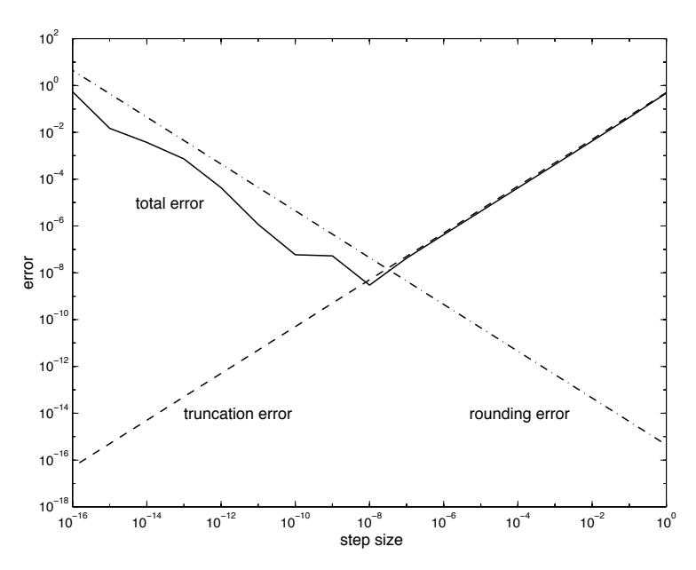
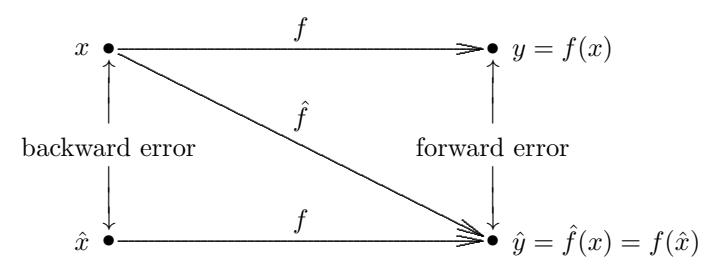
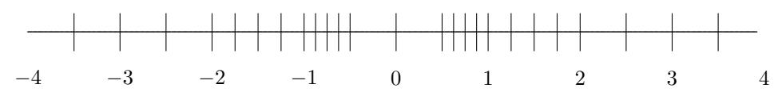
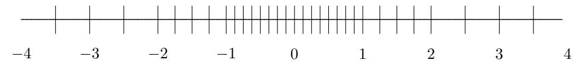
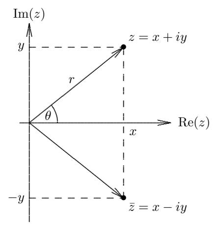

# Scientific Computing

# 1.1 Introduction

The subject of this book is traditionally called numerical analysis. Numerical analysis is concerned with the design and analysis of algorithms for solving mathematical problems that arise in many fields, especially science and engineering. For this reason, numerical analysis has more recently also become known as scientific computing. Scientific computing is distinguished from most other parts of computer science in that it deals with quantities that are continuous, as opposed to discrete. It is concerned with functions and equations whose underlying variables—time, distance, velocity, temperature, density, pressure, stress, and the like—are continuous in nature.

Most of the problems of continuous mathematics (for example, almost any problem involving derivatives, integrals, or nonlinearities) cannot be solved exactly, even in principle, in a finite number of steps and thus must be solved by a (theoretically infinite) iterative process that ultimately converges to a solution. In practice one does not iterate forever, of course, but only until the answer is approximately correct, "close enough" to the desired result for practical purposes. Thus, one of the most important aspects of scientific computing is finding rapidly convergent iterative algorithms and assessing the accuracy of the resulting approximation. If convergence is sufficiently rapid, even some of the problems that can be solved by finite algorithms, such as systems of linear algebraic equations, may in some cases be better solved by iterative methods, as we will see.

Consequently, a second factor that distinguishes scientific computing is its concern with the effects of approximations. Many solution techniques involve a whole series of approximations of various types. Even the arithmetic used is only approximate, for digital computers cannot represent all real numbers exactly. In addition to having the usual properties of good algorithms, such as efficiency, numerical algorithms should also be as reliable and accurate as possible despite the various approximations made along the way.

#### 1.1.1 Computational Problems

As the name suggests, many problems in scientific computing come from science and engineering, in which the ultimate aim is to understand some natural phenomenon or to design some device. Computational simulation is the representation and emulation of a physical system or process using a computer. Computational simulation can greatly enhance scientific understanding by allowing the investigation of situations that may be difficult or impossible to investigate by theoretical, observational, or experimental means alone. In astrophysics, for example, the detailed behavior of two colliding black holes is too complicated to determine theoretically and impossible to observe directly or duplicate in the laboratory. To simulate it computationally, however, requires only an appropriate mathematical representation (in this case Einstein's equations of general relativity), an algorithm for solving those equations numerically, and a sufficiently large computer on which to implement the algorithm.

Computational simulation is useful not just for exploring exotic or otherwise inaccessible situations, however, but also for exploring a wider variety of "normal" scenarios than could otherwise be investigated with reasonable cost and time. In engineering design, computational simulation allows a large number of design options to be tried much more quickly, inexpensively, and safely than with traditional "build-and-test" methods using physical prototypes. In this context, computational simulation has become known as virtual prototyping. In improving automobile safety, for example, crash testing is far less expensive and dangerous on a computer than in real life, and thus the space of possible design parameters can be explored much more thoroughly to develop an optimal design.

The overall problem-solving process in computational simulation usually includes the following steps:

- 1. Develop a mathematical model—usually expressed by equations of some type—of a physical phenomenon or system of interest
- 2. Develop algorithms to solve the equations numerically
- 3. Implement the algorithms in computer software
- 4. Run the software on a computer to simulate the physical process numerically
- 5. Represent the computed results in some comprehensible form such as graphical visualization
- 6. Interpret and validate the computed results, repeating any or all of the preceding steps, if necessary.

Step 1 is often called mathematical modeling. It requires specific knowledge of the particular scientific or engineering disciplines involved as well as knowledge of applied mathematics. Steps 2 and 3—designing, analyzing, implementing, and using numerical algorithms and software—are the main subject matter of scientific computing, and of this book in particular. Although we will focus on Steps 2 and 3, it is essential that all of these steps, from problem formulation to interpretation and 1.1 Introduction 3

validation of results, be done properly for the results to be meaningful and useful. The principles and methods of scientific computing can be studied at a fairly broad level of generality, as we will see, but the specific source of a given problem and the uses to which the results will be put should always be kept in mind, as each aspect affects—and is affected by—the others. For example, the original problem formulation may strongly affect the accuracy of numerical results, which in turn affects the interpretation and validation of those results.

A mathematical problem is said to be well-posed if a solution exists, is unique, and depends continuously on the problem data. The latter condition means that a small change in the problem data does not cause an abrupt, disproportionate change in the solution; this property is especially important for numerical computations, where, as we will see shortly, such perturbations are usually inevitable. Well-posedness is highly desirable in mathematical models of physical systems, but this is not always achievable. For example, inferring the internal structure of a physical system solely from external observations, as in tomography or seismology, often leads to mathematical problems that are inherently ill-posed in that distinctly different internal configurations may have indistinguishable external appearances.

Even when a problem is well-posed, however, the solution may still respond in a highly sensitive (though continuous) manner to perturbations in the problem data. In order to assess the effects of such perturbations, we must go beyond the qualitative concept of continuity to define a quantitative measure of the sensitivity of a problem. In addition, we must also take care to ensure that the algorithm we use to solve a given problem numerically does not make the results more sensitive than is already inherent in the underlying problem (the Hippocratic oath, "do no harm," applies to numerical analysts as well as physicians). This requirement will lead us to the notion of a stable algorithm. These general concepts and issues will be introduced in this chapter and then discussed in detail in subsequent chapters for specific types of computational problems.

# 1.1.2 General Strategy

In seeking a solution to a given computational problem, a basic general strategy, which occurs throughout this book, is to replace a difficult problem with an easier one that has the same solution, or at least a closely related solution. Examples of this approach include

- Replacing infinite-dimensional spaces with finite-dimensional spaces
- Replacing infinite processes with finite processes, such as replacing integrals or infinite series with finite sums, or derivatives with finite differences
- Replacing differential equations with algebraic equations
- Replacing nonlinear problems with linear problems
- Replacing high-order systems with low-order systems
- Replacing complicated functions with simple functions, such as polynomials
- Replacing general matrices with matrices having a simpler form

For example, to solve a system of nonlinear differential equations, we might first replace it with a system of nonlinear algebraic equations, then replace the nonlinear algebraic system with a linear algebraic system, then replace the matrix of the linear system with one of a special form for which the solution is easy to compute. At each step of this process, we would need to verify that the solution is unchanged, or is at least within some required tolerance of the true solution.

To make this general strategy work for solving a given problem, we must have

- An alternative problem, or class of problems, that is easier to solve
- A transformation of the given problem into a problem of this alternative type that preserves the solution in some sense

Thus, much of our effort will go into identifying suitable problem classes with simple solutions and solution-preserving transformations into those classes.

Ideally, the solution to the transformed problem is identical to that of the original problem, but this is not always possible. In the latter case the solution may only approximate that of the original problem, but the accuracy can usually be made arbitrarily good at the expense of additional work and storage. Thus, primary concerns are estimating the accuracy of such an approximate solution and establishing convergence to the true solution in the limit.

# 1.2 Approximations in Scientific Computation

### 1.2.1 Sources of Approximation

There are many sources of approximation or inexactness in computational science. Some approximations may occur before a computation begins:

- Modeling: Some physical features of the problem or system under study may be simplified or omitted (e.g., friction, viscosity, air resistance).
- Empirical measurements: Laboratory instruments have finite precision. Their accuracy may be further limited by small sample size, or readings obtained may be subject to random noise or systematic bias. For example, even the most careful measurements of important physical constants—such as Newton's gravitational constant or Planck's constant—typically yield values with at most eight or nine significant decimal digits, and most laboratory measurements are much less accurate than that.
- Previous computations: Input data may have been produced by a previous computational step whose results were only approximate.

The approximations just listed are usually beyond our control, but they still play an important role in determining the accuracy that should be expected from a computation. We will focus most of our attention on approximations over which we do have some influence. These systematic approximations that occur during computation include

• Truncation or discretization: Some features of a mathematical model may be omitted or simplified (e.g., replacing derivatives by finite differences or using only a finite number of terms in an infinite series).

• Rounding: Whether in hand computation, a calculator, or a digital computer, the representation of real numbers and arithmetic operations upon them is ultimately limited to some finite amount of precision and thus is generally inexact.

The accuracy of the final results of a computation may reflect a combination of any or all of these approximations, and the resulting perturbations may be amplified by the nature of the problem being solved or the algorithm being used, or both. The study of the effects of such approximations on the accuracy and stability of numerical algorithms is traditionally called error analysis.

Example 1.1 Approximations. The surface area of the Earth might be computed using the formula

$$A = 4\pi r^2$$

for the surface area of a sphere of radius r. The use of this formula for the computation involves a number of approximations:

- The Earth is modeled as a sphere, which is an idealization of its true shape.
- The value for the radius, r ≈ 6370 km, is based on a combination of empirical measurements and previous computations.
- The value for π is given by an infinite limiting process, which must be truncated at some point.
- The numerical values for the input data, as well as the results of the arithmetic operations performed on them, are rounded in a computer or calculator.

The accuracy of the computed result depends on all of these approximations.

#### 1.2.2 Absolute Error and Relative Error

The significance of an error is obviously related to the magnitude of the quantity being measured or computed. For example, an error of 1 is much less significant in counting the population of the Earth than in counting the occupants of a phone booth. This motivates the concepts of absolute error and relative error , which are defined as follows:

Absolute error = approximate value − true value,

Relative error = absolute error true value .

Some authors define absolute error to be the absolute value of the foregoing difference, but we will take the absolute value (or norm for vectors and matrices) explicitly when only the magnitude of the error is needed. Note that the relative error is undefined if the true value is zero.

Relative error can also be expressed as a percentage, which is simply the relative error times 100. Thus, for example, an absolute error of 0.1 relative to a true value of 10 would be a relative error of 0.01, or 1 percent. A completely erroneous approximation would correspond to a relative error of at least 1, or at least 100 percent, meaning that the absolute error is as large as the true value.

Another interpretation of relative error is that if an approximate value has a relative error of about 10<sup>−</sup><sup>p</sup> , then its decimal representation has about p correct significant digits (significant digits are the leading nonzero digit and all following digits). In this connection, it is worth noting the distinction between precision and accuracy: precision refers to the number of digits with which a number is expressed, whereas accuracy refers to the number of correct significant digits (i.e., relative error) in approximating some desired quantity. For example, 3.252603764690804 is a very precise number, but it is not very accurate as an approximation to π. As we will soon see, computing a quantity using a given precision does not necessarily mean that the result will be accurate to that precision.

A useful way to express the relationship between absolute and relative error is the following:

Approximate value = (true value) 
$$\times$$
 (1 + relative error).

Of course, we do not usually know the true value; if we did, we would not need to bother with approximating it. Thus, we will usually merely estimate or bound the error rather than compute it exactly, because the true value is unknown. For this same reason, relative error is often taken to be relative to the approximate value rather than to the true value, as in the foregoing definition.

#### 1.2.3 Data Error and Computational Error

As we have seen, some errors can be attributed to the input data, whereas others are due to subsequent computational processes. Although this distinction is not always clear-cut (rounding, for example, may affect both the input data and subsequent computational results), it is nevertheless helpful in understanding the overall effects of approximations in numerical computations.

Most realistic problems are multidimensional, but for simplicity we will consider only one-dimensional problems in this chapter; extension of the definitions and results to higher dimensions is straightforward, usually requiring only replacement of absolute values by appropriate norms (see Section 2.3.1). A typical problem in one dimension can be viewed as the computation of the value of a function, say f: R → R, that maps a given input value to an output result. Denote the true value of the input by x, so that the desired true result is f(x). Suppose that we must work with inexact input, say ˆx, and we can compute only an approximation to the function, say ˆf. Then, using the standard mathematical trick of adding and subtracting the same quantity so that the total is unchanged, we have

Total error 
$$=$$
  $\hat{f}(\hat{x}) - f(x)$   
 $=$   $(\hat{f}(\hat{x}) - f(\hat{x})) + (f(\hat{x}) - f(x))$   
 $=$  computational error  $+$  propagated data error.

The first term in this sum is the difference between the exact and approximate functions for the same input and hence can be considered pure computational error . The second term is the difference between exact function values due to error in the input and thus can be viewed as pure propagated data error . Note that the choice of algorithm has no effect on the propagated data error.

Example 1.2 Data Error and Computational Error. Suppose we are without access to a computer or calculator, and we need a "quick and dirty" approximation to sin(π/8). First, we need a value for π to determine the input. We briefly consider the classic approximation π ≈ 22/7 remembered from school days, but decide it would be too much work to convert to the desired decimal fraction format, and we settle instead for the simple "biblical" approximation π ≈ 3, so that our actual input is 3/8. To compute the function value, we remember from calculus that a good approximation for small arguments is to use the first term in the Taylor series expansion, which for sin(x) is simply x. Our final result is therefore

$$\sin(\pi/8) \approx \sin(3/8) \approx 3/8 = 0.3750.$$

The first of the foregoing approximations—using a perturbed input ˆx = 3/8 instead of the true value x = π/8—induces propagated data error: even if we evaluated the sine function exactly, we would obtain an incorrect result because we used an incorrect input. The second approximation represents a computational error, even though our "computation" in this case consisted of merely copying the input! (Computational errors are often such "errors of omission," though usually not this extreme.) In the notation introduced earlier, we used a truncated mathematical expression ˆf(x) = x instead of the true function f(x) = sin(x), which means that we would have obtained an incorrect result even if we had used the correct input. Our overall accuracy is determined by a combination of these two approximations.

Later, having gained access to a calculator, we determine that the correct answer, to four decimal digits, is

$$\sin(\pi/8) \approx 0.3827,$$

so that the total error is

$$\hat{f}(\hat{x}) - f(x) \approx 0.3750 - 0.3827 = -0.0077.$$

Observing that the correct answer for the perturbed input is

$$f(\hat{x}) = \sin(3/8) \approx 0.3663,$$

we see that the propagated data error induced by using inexact input is

$$f(\hat{x}) - f(x) = \sin(3/8) - \sin(\pi/8) \approx 0.3663 - 0.3827 = -0.0164.$$

The computational error caused by truncating the infinite series is

$$\hat{f}(\hat{x}) - f(\hat{x}) = 3/8 - \sin(3/8) \approx 0.3750 - 0.3663 = 0.0087.$$

The sum of these two errors accounts for the observed total error. For this particular example, the two errors have opposite signs, so they partially offset each other; in other circumstances they may have the same sign and thus reinforce each other instead. For this specific input, the propagated data error and computational error are roughly similar in magnitude, differing by a factor of about two, but either source of error can dominate for other input values. Using the same approximations for π and sin(x), propagated data error would dominate for much smaller inputs, whereas computational error would dominate for much larger inputs (Why?). To try to reduce the total error, we could use a more accurate value for π, which would reduce propagated data error, or a more accurate mathematical representation of sin(x) (e.g., more terms in the infinite series), which would reduce computational error.

## 1.2.4 Truncation Error and Rounding Error

Computational error (that is, error made during a computation) can be subdivided into truncation (or discretization) error and rounding error:

- Truncation error is the difference between the true result (for the actual input) and the result that would be produced by a given algorithm using exact arithmetic. It is due to approximations such as truncating an infinite series, replacing derivatives by finite differences, or terminating an iterative sequence before convergence.
- Rounding error is the difference between the result produced by a given algorithm using exact arithmetic and the result produced by the same algorithm using finite-precision, rounded arithmetic. It is due to inexactness in the representation of real numbers and arithmetic operations upon them, which we will consider in detail in Section 1.3.

By definition, then, computational error is simply the sum of truncation error and rounding error. In Example 1.2, the input was rounded, but there was no rounding error during the computation, so the computational error consisted solely of truncation error from using only one term of the infinite series. Using additional terms in the series would have reduced the truncation error, but would likely have introduced some rounding error in the arithmetic required to evaluate the series. Such tradeoffs between truncation error and rounding error are not uncommon.

Example 1.3 Finite Difference Approximation. For a differentiable function f: R → R, consider the finite difference approximation to the first derivative,

$$f'(x) \approx \frac{f(x+h) - f(x)}{h}.$$

By Taylor's Theorem,

$$f(x+h) = f(x) + f'(x)h + f''(\theta)h^{2}/2$$

for some θ ∈ [x, x+h], so the truncation error of the finite difference approximation is bounded by Mh/2, where M is a bound on |f <sup>00</sup>(t)| for t near x. Assuming the error in function values is bounded by , the rounding error in evaluating the finite difference formula is bounded by 2/h. The total computational error is therefore bounded by the sum of two functions,

$$\frac{Mh}{2} + \frac{2\epsilon}{h},$$

with the first decreasing and the second increasing as h decreases. Thus, there is a tradeoff between truncation error and rounding error in choosing the step size h. Differentiating this function with respect to h and setting its derivative equal to zero, we see that the bound on the total computational error is minimized when

$$h = 2\sqrt{\epsilon/M}.$$

A typical example is shown in Fig. 1.1, where the total computational error in the finite difference approximation, along with the individual bounds on the truncation and rounding errors, for the function f(x) = sin(x) at x = 1 are plotted as functions of the step size h, taking M = 1 and using a computer for which ≈ 10<sup>−</sup><sup>16</sup>. We see that the total error indeed reaches a minimum at h ≈ 10<sup>−</sup><sup>8</sup> ≈ √ . The total error increases for larger values of h because of increasing truncation error, and increases for smaller values of h because of increasing rounding error.



Figure 1.1: Computational error in finite difference approximation for given step size.

The truncation error could be reduced by using a more accurate finite difference formula, such as the centered difference approximation (see Section 8.6.1)

$$f'(x) \approx \frac{f(x+h) - f(x-h)}{2h}.$$

The rounding error could be reduced by working with higher-precision arithmetic, if available.

Although truncation error and rounding error can both play an important role in a given computation, one or the other is usually the dominant factor in the overall computational error. Roughly speaking, rounding error tends to dominate in purely algebraic problems with finite solution algorithms, whereas truncation error tends to dominate in problems involving integrals, derivatives, or nonlinearities, which often require a theoretically infinite solution process.

The distinctions we have made among the different types of errors are important for understanding the behavior of numerical algorithms and the factors affecting their accuracy, but it is usually not necessary, or even possible, to quantify precisely the individual types of errors. Indeed, as we will soon see, it is often advantageous to lump all of the errors together and attribute them to error in the input data.

#### 1.2.5 Forward Error and Backward Error

The quality of a computed result depends on the quality of the input data, among other factors. For example, if the input data are accurate to only four significant digits, say, then we can expect no more than four significant digits in the computed result regardless of how well we do the computation. The famous computer maxim "garbage in, garbage out" carries this observation to its logical extreme. Thus, in assessing the quality of computed results, we must not overlook the possible effects of perturbations in the input data within their level of uncertainty.

Example 1.4 Effects of Data Error. Suppose we want to predict the population of some country ten years from now. First, we need a mathematical model describing changes in population over time. Assuming that both births and deaths are proportional to the population at any given time yields the simple model

$$P(t + \Delta t) = P(t) + (B - D)P(t)\Delta t,$$

where P(t) denotes the population at time t, ∆t is some time interval (say, one year), and B and D are the birth and death rates (for example, the net growth rate might be B − D = 0.04, or 4 percent per year). We could just use this discrete model for a fixed time interval ∆t, or we could take the limit as ∆t → 0 to obtain a differential equation

$$dP(t)/dt = (B - D)P(t),$$

whose solution is the familiar exponential growth law

$$P(t) = P(0) \exp((B - D)t).$$

In either case, the model is obviously only an approximation to reality; for example, we have omitted immigration and any effects of limited capacity. Though we will ignore such modeling errors for purposes of this illustration, their presence in almost all real scientific problems should temper our expectations regarding achievable accuracy in subsequent computations. To use either the discrete or continuous model for our population projection, we need to know the current population and the birth and death rates. It is notoriously difficult to count everyone in a census without missing anyone, so the starting population is known with only limited accuracy. Accordingly, the starting population would usually be expressed in "round figures" (i.e., with only a few significant digits) to indicate the level of uncertainty in its value. This should not be thought of as a rounding error because the resulting value is just as likely to be correct as the more precise value, since the discarded digits were dubious or meaningless anyway. Similarly, the birth and death rates, which represent averages taken over many discrete events, are also known with only limited accuracy.

These uncertainties in the input for our model necessarily imply some degree of uncertainty in the resulting population projection. Consequently, we can think of our model as relating a fuzzy region in input space with a fuzzy region in output space (namely, the set of all possible results for all possible combinations of inputs within their regions of uncertainty). In implementing our model, we may incur some computational error (truncation error or rounding error), but as long the result produced remains within the fuzzy region of output space corresponding to the uncertainty in the input data, the result can hardly be faulted. Another way of saying this is that any result, however obtained, that is the exact result for some input that is equally as plausible as the one we actually used is as good an answer as we have any right to expect.

We now formalize these notions, again focusing on one-dimensional problems for simplicity. Suppose we want to compute the value of a function, y = f(x), where f: R → R, but we obtain instead an approximate value ˆy. The discrepancy between the computed and true values, ∆y = ˆy−y, is called the forward error . One way to assess the quality of the computed result is to try to estimate the relative magnitude of this forward error, which may or may not be easy, depending on the specific circumstances. In general, however, analyzing the forward propagation of errors in a computation is often difficult for reasons we will see later. Moreover, worst-case assumptions made at each stage often lead to a very pessimistic bound for the overall error.

An alternative approach is to consider the approximate solution obtained to be the exact solution for a modified problem, then ask how large a modification to the original problem is required to give the result actually obtained. In other words, how much data error in the initial input would be required to explain all of the error in the final computed result? More formally, the quantity ∆x = ˆx − x, where f(ˆx) = ˆy, is called the backward error , whose relative magnitude we try to estimate in backward error analysis. From this perspective, an approximate solution to a given problem is good if it is the exact solution to a "nearby" problem (i.e., the relative backward error is small). Indeed, if the nearby problem is within the uncertainty in the input data, then the computed solution ˆy might actually be the "true" solution for all we know (or can know, given the uncertainty in the input), and therefore can hardly be faulted.

These relationships are illustrated schematically (and not to scale) in Fig. 1.2, where x and f denote the exact input and function, respectively, ˆf denotes the approximate function actually computed, and  $\hat{x}$  denotes an input value for which the exact function would give this computed result. Note that the equality  $\hat{f}(x) = f(\hat{x})$  is due to the choice of  $\hat{x}$ ; indeed, this requirement defines  $\hat{x}$ . In Section 1.2.6 we will quantify the relationship between forward error and backward error.



Figure 1.2: Schematic diagram showing forward and backward error.

**Example 1.5 Forward and Backward Error.** As an approximation to  $y = \sqrt{2}$ , the value  $\hat{y} = 1.4$  has an absolute forward error of

$$|\Delta y| = |\hat{y} - y| = |1.4 - 1.41421...| \approx 0.0142,$$

or a relative forward error of about 1 percent. To determine the backward error we observe that  $\sqrt{1.96} = 1.4$ , so the absolute backward error is

$$|\Delta x| = |\hat{x} - x| = |1.96 - 2| = 0.04,$$

or a relative backward error of 2 percent.

**Example 1.6 Backward Error Analysis.** Suppose we want a simple approximation to the cosine function  $y = f(x) = \cos(x)$  for x = 1. The cosine function is given by the infinite series

$$cos(x) = 1 - \frac{x^2}{2!} + \frac{x^4}{4!} - \frac{x^6}{6!} + \cdots,$$

so we might consider truncating the series after, say, two terms to obtain the approximation

$$\hat{y} = \hat{f}(x) = 1 - x^2/2.$$

The forward error in this approximation is then given by

$$\Delta y = \hat{y} - y = \hat{f}(x) - f(x) = 1 - x^2/2 - \cos(x).$$

To determine the backward error, we must find the input value  $\hat{x}$  for f that gives the output value  $\hat{y}$  we actually obtained, that is, for which  $\hat{f}(x) = f(\hat{x})$ . For the cosine function, this value is given by

$$\hat{x} = \arccos(\hat{f}(x)) = \arccos(\hat{y}).$$

Thus, for x = 1, we have

$$y = f(1) = \cos(1) \approx 0.5403,$$

$$\hat{y} = \hat{f}(1) = 1 - 1^2/2 = 0.5,$$

$$\hat{x} = \arccos(\hat{y}) = \arccos(0.5) \approx 1.0472,$$
 Forward error =  $\Delta y = \hat{y} - y \approx 0.5 - 0.5403 = -0.0403,$  Backward error =  $\Delta x = \hat{x} - x \approx 1.0472 - 1 = 0.0472.$ 

The forward error indicates that the accuracy is fairly good because the output is close to what we wanted to compute, whereas the backward error indicates that the accuracy is fairly good because the output we obtained is correct for an input that is only slightly perturbed. We will next see how forward and backward error are related to each other quantitatively.

### 1.2.6 Sensitivity and Conditioning

An inaccurate solution is not necessarily due to an ill-conceived algorithm, but may be inherent in the problem being solved. Even with exact computation, the solution to the problem may be highly sensitive to perturbations in the input data. The qualitative notion of sensitivity, and its quantitative measure, called conditioning, are concerned with propagated data error, i.e., the effects on the solution of perturbations in the input data.

A problem is said to be insensitive, or well-conditioned, if a given relative change in the input data causes a reasonably commensurate relative change in the solution. A problem is said to be sensitive, or ill-conditioned, if the relative change in the solution can be much larger than that in the input data. Anyone who has felt a shower go from freezing to scalding, or vice versa, at the slightest touch of the temperature control has had first-hand experience with a sensitive system in that the effect is out of proportion to the cause.

More quantitatively, we define the condition number of a problem to be the ratio of the relative change in the solution to the relative change in the input. A problem is ill-conditioned, or sensitive, if its condition number is much larger than 1. Using the notation from our earlier example of evaluating a function, we have

Condition number = 
$$\frac{|(f(\hat{x}) - f(x))/f(x)|}{|(\hat{x} - x)/x|} = \frac{|(\hat{y} - y)/y|}{|(\hat{x} - x)/x|} = \frac{|\Delta y/y|}{|\Delta x/x|}$$
.

We recognize the numerator and denominator in this ratio as the relative forward and backward errors, respectively, so this relationship can be rephrased

|Relative forward error| = condition number × |relative backward error|.

Thus, the condition number can be interpreted as an "amplification factor" that relates forward error to backward error. If a problem is ill-conditioned (i.e., its condition number is large), then the relative forward error (relative perturbation in the solution) can be large even if the relative backward error (relative perturbation in the input) is small.

In general, the condition number varies with the input, and in practice we usually do not know the condition number exactly anyway. Thus, we often must content ourselves with a rough estimate or upper bound for the maximum condition number over some domain of inputs, and hence the relationship between backward and forward error becomes an approximate inequality,

 $|Relative forward error| \lesssim condition number \times |relative backward error|,$ 

which bounds the worst case forward error but will not necessarily be realized for all inputs. Based on this relationship, the condition number enables us to bound the forward error, which is usually of most interest, in terms of the backward error, which is often easier to estimate.

Using calculus, we can approximate the condition number for the problem of evaluating a differentiable function  $f: \mathbb{R} \to \mathbb{R}$ :

Absolute forward error = 
$$f(x + \Delta x) - f(x) \approx f'(x)\Delta x$$
,

so that

Relative forward error = 
$$\frac{f(x + \Delta x) - f(x)}{f(x)} \approx \frac{f'(x)\Delta x}{f(x)}$$
,

and hence

Condition number 
$$\approx \left| \frac{f'(x)\Delta x/f(x)}{\Delta x/x} \right| = \left| \frac{xf'(x)}{f(x)} \right|$$
.

Thus, the relative error in the output function value can be much larger or smaller than that in the input, depending on the properties of the function involved and the particular value of the input.

For a given problem, the *inverse problem* is to determine what input would yield a given output. For the problem of evaluating a function, y = f(x), the inverse problem, denoted by  $x = f^{-1}(y)$ , is to determine, for a given value y, a value x such that f(x) = y. From the definition, we see that the condition number of the inverse problem is the reciprocal of that of the original problem. Consequently, if the condition number is near 1, then both the problem and its inverse problem are well-conditioned. If the condition number is much larger or smaller than 1, however, then either the problem or its inverse, respectively, is ill-conditioned.

We recall from calculus that if g is the inverse function  $g(y) = f^{-1}(y)$ , and x and y are values such that y = f(x), then g'(y) = 1/f'(x), provided  $f'(x) \neq 0$ . Thus, the condition number of the inverse function g is

Condition number 
$$\approx \left| \frac{y \, g'(y)}{g(y)} \right| = \left| \frac{f(x)(1/f'(x))}{x} \right| = \left| \frac{f(x)}{x f'(x)} \right|,$$

which is the reciprocal of the condition number of the original function f.

**Example 1.7 Condition Number.** Consider the function  $f(x) = \sqrt{x}$ . Since  $f'(x) = 1/(2\sqrt{x})$ , we have

Condition number 
$$\approx \left| \frac{xf'(x)}{f(x)} \right| = \left| \frac{x/(2\sqrt{x})}{\sqrt{x}} \right| = \frac{1}{2}.$$

This means that a given relative change in the input causes a relative change in the output of about half that size. Equivalently, the relative forward error is about half the relative backward error in magnitude, as we saw for this same problem in Example 1.5. Thus, the square root problem is quite well-conditioned. Note that the inverse problem,  $g(y) = y^2$ , has a condition number of  $|y g'(y)/g(y)| = |y(2y)/y^2| = 2$ , which is the reciprocal of that for the square root, as expected.

**Example 1.8 Sensitivity.** Consider the tangent function,  $f(x) = \tan(x)$ . Since  $f'(x) = \sec^2(x) = 1 + \tan^2(x)$ , we have

Condition number 
$$\approx \left| \frac{xf'(x)}{f(x)} \right| = \left| \frac{x(1 + \tan^2(x))}{\tan(x)} \right| = \left| x \left( \frac{1}{\tan(x)} + \tan(x) \right) \right|.$$

Thus,  $\tan(x)$  is highly sensitive for x near any integer multiple of  $\pi/2$ , where its value becomes infinite. For example, for x=1.57079, the condition number is approximately  $2.48275 \times 10^5$ . To see the effect of this, we evaluate the function at two nearby points,

$$\tan(1.57079) \approx 1.58058 \times 10^5, \qquad \tan(1.57078) \approx 6.12490 \times 10^4,$$

and see that indeed the relative change in the output, which is approximately 1.58, is about a quarter of a million times larger than the relative change in the input, which is approximately  $6.37 \times 10^{-6}$ . On the other hand, the inverse function  $g(y) = \arctan(y)$  has a condition number of  $|y g'(y)/g(y)| = |y(1/(1+y^2))/\arctan(y)|$ . For  $y = 1.58058 \times 10^5$ , this condition number is about  $4.0278 \times 10^{-6}$ , which is the reciprocal of that for the tangent function at the corresponding value for x. Thus,  $\arctan(y)$  is extremely insensitive at this point.

The condition number we have defined is sometimes called the *relative* condition number because it is defined in terms of relative changes, or relative errors, in the input and output. This is usually most appropriate, but it is undefined if either the input x or output y is zero. In such cases, the *absolute* condition number, defined as the ratio of the absolute change in the solution to the absolute change in the input,  $|\Delta y|/|\Delta x|$ , is an appropriate measure of sensitivity. Such a situation arises, for example, in *root finding*: given a function  $f: \mathbb{R} \to \mathbb{R}$ , we seek a value  $x^*$  such that  $f(x^*) = 0$  (see Chapter 5). Evaluating the function f(x) near such a root  $x^*$  has absolute condition number

$$\frac{|\Delta y|}{|\Delta x|} \approx |f'(x^*)|,$$

and the inverse problem of determining the root, i.e., finding an input value x ∗ for x that yields y = f(x ∗ ) = 0, has absolute condition number 1/|f 0 (x ∗ )|, provided f 0 (x ∗ ) 6= 0.

### 1.2.7 Stability and Accuracy

The concept of stability of a computational algorithm is analogous to conditioning of a mathematical problem in that both have to do with the effects of perturbations. The distinction between them is that stability refers to the effects of computational error on the result computed by an algorithm, whereas conditioning refers to the effects of data error on the solution to a problem. An algorithm is stable if the result it produces is relatively insensitive to perturbations due to approximations made during the computation. From the viewpoint of backward error analysis, an algorithm is stable if the result it produces is the exact solution to a nearby problem, i.e., the effect of perturbations during the computation is no worse than the effect of a small amount of data error in the input for the given problem. By this definition, a stable algorithm produces exactly the correct result for nearly the correct problem. Many—but not all—useful algorithms are stable in this strong sense. A weaker concept of stability that is useful in some contexts is that the algorithm produces nearly the correct result for nearly the correct problem.

Accuracy refers to the closeness of a computed solution to the true solution of the problem under consideration. Stability of an algorithm does not by itself guarantee that the computed result is accurate: accuracy depends on the conditioning of the problem as well as the stability of the algorithm. Stability tells us that the solution obtained is exact for a nearby problem, but the solution to that nearby problem is not necessarily close to the solution to the original problem unless the problem is well-conditioned. Thus, inaccuracy can result from applying a stable algorithm to an ill-conditioned problem as well as from applying an unstable algorithm to a well-conditioned problem. By contrast, if we apply a stable algorithm to a wellconditioned problem, then we will obtain an accurate solution.

# 1.3 Computer Arithmetic

As noted earlier, one type of approximation inevitably made in scientific computing is in representing real numbers on a computer. In this section we will examine in some detail the finite-precision arithmetic systems that are used for most scientific computations on digital computers.

## 1.3.1 Floating-Point Numbers

In a digital computer, the real number system R of mathematics is represented by a floating-point number system. The basic idea resembles scientific notation, in which a number of very large or very small magnitude is expressed as a number of moderate size times an appropriate power of ten. For example, 2347 and 0.0007396 are written as 2.347×10<sup>3</sup> and 7.396×10<sup>−</sup><sup>4</sup> , respectively. In this format, the decimal point moves, or floats, as the power of 10 changes. Formally, a floating-point number system F is characterized by four integers:

> β Base or radix p Precision [L, U] Exponent range

Any floating-point number x ∈ F has the form

$$x = \pm \left(d_0 + \frac{d_1}{\beta} + \frac{d_2}{\beta^2} + \dots + \frac{d_{p-1}}{\beta^{p-1}}\right) \beta^E,$$

where d<sup>i</sup> is an integer such that

$$0 \le d_i \le \beta - 1, \quad i = 0, \dots, p - 1,$$

and E is an integer such that

$$L \leq E \leq U$$
.

The part in parentheses, represented by a string of p base-β digits d0d<sup>1</sup> · · · dp−1, is called the mantissa or significand, and E is called the exponent or characteristic of the floating-point number x. The portion d1d<sup>2</sup> · · · dp−<sup>1</sup> of the mantissa is called the fraction. In a computer, the sign, exponent, and mantissa are stored in separate fields of a given floating-point word, each of which has a fixed width. The number zero can be represented uniquely by having both its mantissa and exponent equal to zero or by having a zero fraction and a special value of the exponent.

Most computers today use binary (β = 2) arithmetic, but other bases have also been used in the past, such as hexadecimal (β = 16) in IBM mainframes and β = 3 in an ill-fated Russian computer. Octal (β = 8) and hexadecimal notations are also commonly used as a convenient shorthand for writing binary numbers in groups of three or four binary digits (bits), respectively. For obvious reasons, decimal (β = 10) arithmetic is popular in hand-held calculators. To facilitate human interaction, a computer usually converts numerical values from decimal notation on input and to decimal notation for output, regardless of the base it uses internally. Parameters for some typical floating-point systems are given in Table 1.1, which illustrates the tradeoff between precision and exponent range implied by their respective field widths. For example, working with the same 64-bit word length, the Cray system has a wider exponent range than does IEEE double precision, but at the expense of carrying less precision.

The IEEE standard single-precision (SP) and double-precision (DP) binary floating-point systems are by far the most important today. They have been almost universally adopted for personal computers and workstations, and also for many mainframes and supercomputers as well. The IEEE standard was carefully crafted to eliminate the many anomalies and ambiguities in earlier vendor-specific floatingpoint implementations and has greatly facilitated the development of portable and reliable numerical software. It also allows for sensible and consistent handling of exceptional situations, such as division by zero.

| System        | β   | p   | L           | U          |
| ------------- | --- | --- | ----------- | ---------- |
| IEEE SP       | 2   | 24  | −126        | 127        |
| IEEE DP       | 2   | 53  | −1,<br>022  | 1,<br>023  |
| Cray          | 2   | 48  | −16,<br>383 | 16,<br>384 |
| HP calculator | 10  | 12  | −499        | 499        |
| IBM mainframe | 16  | 6   | −64         | 63         |

Table 1.1: Parameters for typical floating-point systems

#### 1.3.2 Normalization

A floating-point system is said to be normalized if the leading digit d<sup>0</sup> is always nonzero unless the number represented is zero. Thus, in a normalized floating-point system, the mantissa m of a given nonzero floating-point number always satisfies

$$1 \leq m < \beta$$
.

(An alternative convention is that d<sup>0</sup> is always zero, in which case a floating-point number is said to be normalized if d<sup>1</sup> 6= 0, and β <sup>−</sup><sup>1</sup> ≤ m < 1 instead.) Floatingpoint systems are usually normalized because

- The representation of each number is then unique.
- No digits are wasted on leading zeros, thereby maximizing precision.
- In a binary (β = 2) system, the leading bit is always 1 and thus need not be stored, thereby gaining one extra bit of precision for a given field width.

# 1.3.3 Properties of Floating-Point Systems

A floating-point number system is finite and discrete. The number of normalized floating-point numbers in a given floating-point system is

$$2\left(\beta-1\right)\beta^{p-1}\left(U-L+1\right)+1$$

because there are two choices of sign, β − 1 choices for the leading digit of the mantissa, β choices for each of the remaining p − 1 digits of the mantissa, and U − L + 1 possible values for the exponent. The 1 is added because the number could be zero.

There is a smallest positive normalized floating-point number,

Underflow level = UFL = 
$$\beta^L$$
,

which has a 1 as the leading digit and 0 for the remaining digits of the mantissa, and the smallest possible value for the exponent. There is a largest floating-point number,

Overflow level = OFL = 
$$\beta^{U+1}(1 - \beta^{-p})$$
,

which has β − 1 as the value for each digit of the mantissa and the largest possible value for the exponent. Any number larger than OFL cannot be represented in the given floating-point system, nor can any positive number smaller than UFL. Floating-point numbers are not uniformly distributed throughout their range, but are equally spaced only between successive powers of  $\beta$ .

**Example 1.9 Floating-Point System.** An example floating-point system is illustrated in Fig. 1.3, where the tick marks indicate all of the 25 floating-point numbers in a system having  $\beta=2$ , p=3, L=-1, and U=1. For this system, the largest number is OFL =  $(1.11)_2 \times 2^1 = (3.5)_{10}$ , and the smallest positive normalized number is UFL =  $(1.00)_2 \times 2^{-1} = (0.5)_{10}$ . This is a very tiny, toy system for illustrative purposes only, but it is in fact characteristic of floating-point systems in general: at a sufficiently high level of magnification, every normalized floating-point system looks essentially like this one—grainy and unequally spaced.



Figure 1.3: Example floating-point number system.

### 1.3.4 Rounding

Real numbers that are exactly representable in a given floating-point system are called  $machine\ numbers$ . If a given real number x is not exactly representable as a floating-point number, then it must be approximated by some "nearby" floating-point number. We denote the floating-point approximation of a given real number x by  $\mathrm{fl}(x)$ . The process of choosing a nearby floating-point number  $\mathrm{fl}(x)$  to approximate a given real number x is called rounding, and the error introduced by such an approximation is called  $rounding\ error$ , or  $roundoff\ error$ . Two commonly used rounding rules are

- Chop: The base- $\beta$  expansion of x is truncated after the (p-1)st digit. Because f(x) is the next floating-point number towards zero from x, this rule is also sometimes called round toward zero.
- Round to nearest: f(x) is the nearest floating-point number to x; in case of a tie, we use the floating-point number whose last stored digit is even. Because of the latter property, this rule is also sometimes called round to even.

Rounding to nearest is the most accurate and unbiased, but it is somewhat more expensive to implement correctly. Some systems in the past have used rounding rules that are cheaper to implement, such as chopping, but rounding to nearest is the default rounding rule in IEEE standard systems.

**Example 1.10 Rounding Rules.** Rounding the following decimal numbers to two digits using each of the rounding rules gives the following results

| Number | Chop | Round to nearest | Number | Chop | Round to nearest |
| ------ | ---- | ---------------- | ------ | ---- | ---------------- |
| 1.649  | 1.6  | 1.6              | 1.749  | 1.7  | 1.7              |
| 1.650  | 1.6  | 1.6              | 1.750  | 1.7  | 1.8              |
| 1.651  | 1.6  | 1.7              | 1.751  | 1.7  | 1.8              |
| 1.699  | 1.6  | 1.7              | 1.799  | 1.7  | 1.8              |

A potential source of additional error that is often overlooked is in the decimal-to-binary and binary-to-decimal conversions that usually take place upon input and output of floating-point numbers. Such conversions are not covered by the IEEE standard, which governs only internal arithmetic operations. Correctly rounded input and output can be obtained at reasonable cost, but not all computer systems do so. Efficient, portable routines for correctly rounded binary-to-decimal and decimal-to-binary conversions—dtoa and strtod, respectively—are available from Netlib (see Section 1.4.1).

#### 1.3.5 Machine Precision

The accuracy of a floating-point system can be characterized by a quantity variously known as the *unit roundoff*, *machine precision*, or *machine epsilon*. Its value, which we denote by  $\epsilon_{\text{mach}}$ , depends on the particular rounding rule used. With rounding by chopping,

$$\epsilon_{\text{mach}} = \beta^{1-p}$$

whereas with rounding to nearest,

$$\epsilon_{\text{mach}} = \frac{1}{2} \beta^{1-p}$$
.

The unit roundoff is important because it bounds the *relative error* in representing any nonzero real number x within the normalized range of a floating-point system:

$$\left| \frac{\mathrm{fl}(x) - x}{x} \right| \le \epsilon_{\mathrm{mach}}.$$

An alternative characterization of the unit roundoff that you may sometimes see is that it is the smallest number  $\epsilon$  such that

$$fl(1+\epsilon) > 1,$$

but this is not quite equivalent to the previous definition if the round-to-even rule is used. Yet another definition sometimes used is that  $\epsilon_{\rm mach}$  is the distance from 1 to the next larger floating-point number, but this may differ from either of the other definitions. Although they can differ in detail, all three definitions of  $\epsilon_{\rm mach}$  have the same basic intent as measures of the relative granularity of a floating-point system.

For the toy illustrative system in Example 1.9,  $\epsilon_{\rm mach}=0.25$  with rounding by chopping, and  $\epsilon_{\rm mach}=0.125$  with rounding to nearest. For IEEE binary floating-point systems,  $\epsilon_{\rm mach}=2^{-24}\approx 10^{-7}$  in single precision and  $\epsilon_{\rm mach}=2^{-53}\approx 10^{-16}$  in double precision. We thus say that the IEEE single- and double-precision floating-point systems have about 7 and 16 decimal digits of precision, respectively.

Though both are "small," the unit roundoff should not be confused with the underflow level. The unit roundoff mach is determined by the number of digits in the mantissa field of a floating-point system, whereas the underflow level UFL is determined by the number of digits in the exponent field. In all practical floatingpoint systems,

$$0 < \text{UFL} < \epsilon_{\text{mach}} < \text{OFL}.$$

## 1.3.6 Subnormals and Gradual Underflow

In the toy floating-point system illustrated in Fig. 1.3, there is a noticeable gap around zero. This gap, which is present to some degree in any floating-point system, is due to normalization: the smallest possible mantissa is 1.00. . . , and the smallest possible exponent is L, so there are no floating-point numbers between zero and β L. If we relax our insistence on normalization and allow leading digits to be zero (but only when the exponent is at its minimum value), then the gap around zero can be "filled in" by additional floating-point numbers. For our toy illustrative system, this relaxation gains six additional floating-point numbers, the smallest positive one of which is (0.01)<sup>2</sup> × 2 <sup>−</sup><sup>1</sup> = (0.125)10, as shown in Fig. 1.4.



Figure 1.4: Example floating-point system with subnormals.

The extra numbers added to the system in this way are referred to as subnormal or denormalized floating-point numbers. Although they usefully extend the range of magnitudes representable, subnormal numbers have inherently lower precision than normalized numbers because they have fewer significant digits in their fractional parts. In particular, extending the range in this manner does not make the unit roundoff mach any smaller.

Such an augmented floating-point system is sometimes said to exhibit gradual underflow, since it extends the lower range of magnitudes representable rather than underflowing to zero as soon as the minimum exponent value would otherwise be exceeded. The IEEE standard provides for such subnormal numbers and gradual underflow. Gradual underflow is implemented through a special reserved value of the exponent field because the leading binary digit is not stored and hence cannot be used to indicate a denormalized number.

# 1.3.7 Exceptional Values

The IEEE floating-point standard provides two additional special values to indicate exceptional situations:

• Inf, which stands for infinity, results from dividing a finite number by zero, such as 1/0.

• NaN, which stands for not a number , results from an undefined or indeterminate operation such as 0/0, 0 ∗ Inf, or Inf/Inf.

Inf and NaN are implemented in IEEE arithmetic through special reserved values of the exponent field.

Whether Inf and NaN are supported at the user level in a given computing environment depends on the language, compiler, and run-time system. If available, these quantities can be helpful in designing software that deals gracefully with exceptional situations rather than abruptly aborting the program. In MATLAB (see Section 1.4.2), for example, if Inf and NaN arise, they are propagated sensibly through a computation (e.g., 1 + Inf = Inf). It is still desirable, however, to avoid such exceptional situations entirely, if possible. In addition to alerting the user to arithmetic exceptions, these special values can also be useful as flags that cannot be confused with any legitimate numeric value. For example, NaN might be used to indicate a portion of an array that has not yet been defined.

#### 1.3.8 Floating-Point Arithmetic

In adding or subtracting two floating-point numbers, their exponents must match before their mantissas can be added or subtracted. If they do not match initially, then the mantissa of one of the numbers must be shifted until the exponents do match. In performing such a shift, some of the trailing digits of the smaller (in magnitude) number will be shifted beyond the fixed width of the mantissa field, and thus the correct result of the arithmetic operation cannot be represented exactly in the floating-point system. Indeed, if the difference in magnitude is too great, then the entire mantissa of the smaller number may be shifted completely beyond the field width so that the result is simply the larger of the operands. Another way of saying this is that if the true sum of two p-digit numbers contains more than p digits, then the excess digits will be lost when the result is rounded to p digits, and in the worst case the operand of smaller magnitude may be lost completely.

Multiplication of two floating-point numbers does not require that their exponents match—the exponents are simply summed and the mantissas multiplied. However, the product of two p-digit mantissas will in general contain up to 2p digits, and thus once again the correct result cannot be represented exactly in the floating-point system and must be rounded.

Example 1.11 Floating-Point Arithmetic. Consider a floating-point system with β = 10 and p = 6. If x = 1.92403 × 10<sup>2</sup> and y = 6.35782 × 10<sup>−</sup><sup>1</sup> , then floating-point addition gives the result x + y = 1.93039 × 10<sup>2</sup> , assuming rounding to nearest. Note that the last two digits of y have no effect on the result. With an even smaller exponent, y could have had no effect at all on the result. Similarly, floating-point multiplication gives the result x ∗ y = 1.22326 × 10<sup>2</sup> , which discards half of the digits of the true product.

Division of two floating-point numbers may also give a result that cannot be represented exactly. For example, 1 and 10 are exactly representable as binary floating-point numbers, but their quotient, 1/10, has a nonterminating binary expansion and thus is not a binary floating-point number.

In each of the cases just cited, the result of a floating-point arithmetic operation may differ from the result that would be given by the corresponding real arithmetic operation on the same operands because there is insufficient precision to represent the correct real result. The real result may also be unrepresentable because its exponent is beyond the range available in the floating-point system (overflow or underflow). Overflow is usually a more serious problem than underflow in the sense that there is no good approximation in a floating-point system to arbitrarily large numbers, whereas zero is often a reasonable approximation for arbitrarily small numbers. For this reason, on many computer systems the occurrence of an overflow aborts the program with a fatal error, but an underflow may be silently set to zero without disrupting execution.

Example 1.12 Summing a Series. As an illustration of these issues, the infinite series

$$\sum_{n=1}^{\infty} \frac{1}{n}$$

has a finite sum in floating-point arithmetic even though the real series is divergent. At first blush, one might think that this result occurs because 1/n will eventually underflow, or the partial sum will eventually overflow, as indeed they must. But before either of these occurs, the partial sum ceases to change once 1/n becomes negligible relative to the partial sum, i.e., when 1/n < mach P<sup>n</sup>−<sup>1</sup> <sup>k</sup>=1 (1/k), and thus the sum is finite (see Computer Problem 1.8).

As we have noted, a real arithmetic operation on two floating-point numbers does not necessarily result in another floating-point number. If a number that is not exactly representable as a floating-point number is entered into the computer or is produced by a subsequent arithmetic operation, then it must be rounded (using one of the rounding rules given earlier) to obtain a floating-point number. Because floating-point numbers are not equally spaced, the absolute error made in such an approximation is not uniform, but the relative error is bounded by the unit roundoff mach.

Ideally, x flop y = fl(x op y) (i.e., floating-point arithmetic operations produce correctly rounded results); and many computers, such as those meeting the IEEE floating-point standard, achieve this ideal as long as x op y is within the range of the floating-point system. Nevertheless, some familiar laws of real arithmetic are not necessarily valid in a floating-point system. In particular, floating-point addition and multiplication are commutative but not associative. For example, if is a positive floating-point number slightly smaller than the unit roundoff mach, then (1 + ) + = 1, but 1 + ( + ) > 1. The failure of floating-point arithmetic to satisfy the usual laws of real arithmetic is one reason that forward error analysis can be difficult. One advantage of backward error analysis is that it permits the use of real arithmetic in the analysis.

Rounding error analysis is usually based on the following standard model for floating-point arithmetic:

$$f(x \text{ op } y) = (x \text{ op } y)(1+\delta),$$

where |δ| ≤ mach and op is any of the standard arithmetic operations +, −, ×, /. Rearranging, we see that this model can be interpreted as a statement about the relative forward error:

$$\frac{|\mathrm{fl}(x \ \mathrm{op} \ y) - (x \ \mathrm{op} \ y)|}{|(x \ \mathrm{op} \ y)|} = |\delta| \le \epsilon_{\mathrm{mach}}.$$

It can also be interpreted as a statement about backward error. For example, for op = +,

$$f(x + y) = (x + y)(1 + \delta) = x(1 + \delta) + y(1 + \delta),$$

which means that the result of floating-point addition is exact for operands x and y that are each perturbed by a relative amount |δ|.

Example 1.13 Rounding Error Analysis. Consider the simple computation x(y + z). In floating-point arithmetic we have

$$f(y+z) = (y+z)(1+\delta_1), \text{ with } |\delta_1| \le \epsilon_{\text{mach}},$$

so that

$$\begin{split} \mathrm{fl}(x(y+z)) &=& (x((y+z)(1+\delta_1)))(1+\delta_2), \quad \mathrm{with} \ |\delta_2| \leq \epsilon_{\mathrm{mach}} \\ &=& x(y+z)(1+\delta_1+\delta_2+\delta_1\delta_2) \\ &\approx& x(y+z)(1+\delta_1+\delta_2) \\ &=& x(y+z)(1+\delta), \quad \mathrm{with} \ |\delta| = |\delta_1+\delta_2| \leq 2\epsilon_{\mathrm{mach}}. \end{split}$$

As before, this bound can be interpreted in terms of forward error (discrepancy between computed and desired result) or backward error (perturbations of operands) and may be quite pessimistic. For example, δ<sup>1</sup> and δ<sup>2</sup> may be of opposite sign and hence offset each other, yielding a much smaller overall error than expected from worst-case analysis. Similar analyses of more complicated computations generally lead to error bounds containing correspondingly larger multiples of mach. Fortunately, mach is so small that in practice it is extremely rare for the sheer volume of computation alone to degrade results seriously.

#### 1.3.9 Cancellation

Rounding is not the only necessary evil in finite-precision arithmetic. Subtraction between two p-digit numbers having the same sign and similar magnitudes yields a result with fewer than p significant digits, and hence it is always exactly representable (provided the two numbers involved do not differ in magnitude by more than a factor of two). The reason is that the leading digits of the two numbers cancel (i.e., their difference is zero). For example, again taking β = 10 and p = 6, if x = 1.92403 × 10<sup>2</sup> and z = 1.92275 × 10<sup>2</sup> , then we obtain the result x − z = 1.28000 × 10<sup>−</sup><sup>1</sup> , which, with only three significant digits, is exactly representable.

Despite the exactness of the result, however, such cancellation nevertheless often implies a potentially serious loss of information. The problem is that the operands are often uncertain, owing to rounding or other previous errors, in which case the relative uncertainty in the difference may be large. In effect, if two nearly equal numbers are accurate only to within rounding error, then taking their difference leaves only rounding error as a result.

As a simple example, if is a positive number slightly smaller than the unit roundoff mach, then (1 +)−(1−) = 1−1 = 0 in floating-point arithmetic, which is correct for the actual operands of the final subtraction, but the true result of the overall computation, 2, has been completely lost. The subtraction itself is not at fault: it merely signals the loss of information that had already occurred.

Of course, the loss of information is not always complete, but the fact remains that the digits lost to cancellation are the most significant, leading digits, whereas the digits lost in rounding are the least significant, trailing digits. Because of this effect, computing a small quantity as a difference of large quantities is generally a bad idea, for rounding error is likely to dominate the result. For example, summing a series with alternating signs, such as

$$e^x = 1 + x + \frac{x^2}{2!} + \frac{x^3}{3!} + \cdots$$

for x < 0, may give disastrous results because of catastrophic cancellation (see Computer Problem 1.9).

Example 1.14 Cancellation. Cancellation is an issue not only in computer arithmetic, but in any situation in which limited precision is attainable, such as empirical measurements or laboratory experiments. For example, determining the distance from Manhattan to Staten Island by using their respective distances from Los Angeles will produce a very poor result unless the latter distances are known with extraordinarily high accuracy.

As another example, for many years physicists have been trying to compute the total energy of the helium atom from first principles using Monte Carlo techniques. The accuracy of these computations is determined largely by the number of random trials used. As faster computers become available and computational techniques are refined, the attainable accuracy improves. The total energy is the sum of the kinetic energy and the potential energy, which are computed separately and have opposite signs. Thus, the total energy is computed as a difference and suffers cancellation. Table 1.2 gives a sequence of values obtained over a number of years (these data were kindly provided by Dr. Robert Panoff). During this span the computed values for the kinetic and potential energies changed by only 6 percent or less, yet the resulting estimate for the total energy changed by 144 percent. The one or two significant digits in the earlier computations were completely lost in the subsequent subtraction.

| Year | Kinetic | Potential | Total |
| ---- | ------- | --------- | ----- |
| 1971 | 13.0    | −14.0     | −1.0  |
| 1977 | 12.76   | −14.02    | −1.26 |
| 1980 | 12.22   | −14.35    | −2.13 |
| 1985 | 12.28   | −14.65    | −2.37 |
| 1988 | 12.40   | −14.84    | −2.44 |

Table 1.2: Computed values for total energy of helium atom

Example 1.15 Quadratic Formula. Cancellation and other numerical difficulties need not involve a long series of computations. For example, use of the standard formula for the roots of a quadratic equation is fraught with numerical pitfalls. As every schoolchild learns, the two solutions of the quadratic equation

$$ax^2 + bx + c = 0$$

are given by the quadratic formula

$$x = \frac{-b \pm \sqrt{b^2 - 4ac}}{2a}.$$

For some values of the coefficients, naive use of this formula in floating-point arithmetic can produce overflow, underflow, or catastrophic cancellation.

For example, if the coefficients are very large or very small, then b <sup>2</sup> or 4ac may overflow or underflow. The possibility of overflow can be avoided by rescaling the coefficients, such as dividing all three coefficients by the coefficient of largest magnitude. Such a rescaling does not change the roots of the quadratic equation, but now the largest coefficient is 1 and overflow cannot occur in computing b <sup>2</sup> or 4ac. Such rescaling does not eliminate the possibility of underflow, but it does prevent needless underflow, which could otherwise occur when all three coefficients are very small.

Cancellation between −b and the square root can be avoided by computing one of the roots using the alternative formula

$$x = \frac{2c}{-b \mp \sqrt{b^2 - 4ac}},$$

which has the opposite sign pattern from that of the standard formula. But cancellation inside the square root cannot be easily avoided without using higher precision (if the discriminant is small relative to the coefficients, then the two roots are close to each other, and the problem is inherently ill-conditioned).

As an illustration, we use four-digit decimal arithmetic, with rounding to nearest, to compute the roots of the quadratic equation having coefficients a = 0.05010, b = −98.78, and c = 5.015. For comparison, the correct roots, rounded to ten significant digits, are

1971.605916 and 0.05077069387.

Computing the discriminant in four-digit arithmetic produces

$$b^2 - 4ac = 9757 - 1.005 = 9756,$$

so that

$$\sqrt{b^2 - 4ac} = 98.77.$$

The standard quadratic formula then gives the roots

$$\frac{98.78 \pm 98.77}{0.1002} = 1972 \quad \text{and} \quad 0.09980.$$

The first root is the correctly rounded four-digit result, but the other root is completely wrong, with an error of about 100 percent. The culprit is cancellation, not in the sense that the final subtraction is wrong (indeed it is exactly correct), but in the sense that cancellation of the leading digits has left nothing remaining but previous rounding errors. The alternative quadratic formula gives the roots

$$\frac{10.03}{98.78 \mp 98.77} = 1003 \quad \text{and} \quad 0.05077.$$

Once again we have obtained one fully accurate root and one completely erroneous root, but in each case it is the opposite root from the one obtained previously. Cancellation is again the explanation, but the different sign pattern causes the opposite root to be contaminated. In general, for computing each root we should choose whichever formula avoids this cancellation, depending on the sign of b.

Example 1.16 Standard Deviation. The mean of a finite sequence of real values x<sup>i</sup> , i = 1, . . . , n, is defined by

$$\bar{x} = \frac{1}{n} \sum_{i=1}^{n} x_i,$$

and the standard deviation is defined by

$$\sigma = \left[ \frac{1}{n-1} \sum_{i=1}^{n} (x_i - \bar{x})^2 \right]^{1/2}.$$

Use of these formulas requires two passes through the data: one to compute the mean and another to compute the standard deviation. For better efficiency, it is tempting to use the mathematically equivalent formula

$$\sigma = \left[ \frac{1}{n-1} \left( \sum_{i=1}^{n} x_i^2 - n\bar{x}^2 \right) \right]^{1/2}$$

to compute the standard deviation, since both the sum and the sum of squares can be computed in a single pass through the data.

Unfortunately, the single cancellation at the end of the one-pass formula is often much more damaging numerically than all of the cancellations in the twopass formula combined. The problem is that the two quantities being subtracted in the one-pass formula are apt to be relatively large and nearly equal, and hence the relative error in the difference may be large (indeed, the result can even be negative, causing the square root to fail).

Example 1.17 Computing Residuals. Suppose we are solving the scalar linear equation ax = b for the unknown x, and we have obtained an approximate solution xˆ. As one measure of the quality of our answer, we compute the residual r = b−axˆ. In floating-point arithmetic,

$$fl(a\hat{x}) = a\hat{x}(1 + \delta_1)$$
 with  $|\delta_1| \le \epsilon_{\text{mach}}$ ,

so that

$$\begin{split} \mathrm{fl}(b-a\hat{x}) &= (b-a\hat{x}(1+\delta_1))(1+\delta_2) \quad \mathrm{with} \ |\delta_2| \leq \epsilon_{\mathrm{mach}} \\ &= (r-a\hat{x}\delta_1)(1+\delta_2) \\ &= r(1+\delta_2) - a\hat{x}\delta_1 - a\hat{x}\delta_1\delta_2 \\ &\approx r(1+\delta_2) - \delta_1 b. \end{split}$$

But δ1b may be as large as machb, which may be as large as r, which means that the error in computing the residual may be 100 percent or more. Thus, higher precision may be required to enable a meaningful computation of the residual r.

To illustrate, suppose we are using three-digit decimal arithmetic, and take a = 2.78, b = 3.14, and ˆx = 1.13. In three-digit arithmetic, 2.78 × 1.13 = 3.14, so the three-digit residual is 0. This result is comforting in that it shows we have done the best we can for the precision used, but it gives us no significant digits of the true residual, which is 3.14 − 2.78 × 1.13 = 3.14 − 3.1414 = −0.0014. What has happened is that, by design, b and axˆ are very nearly equal, and thus their difference contains nothing but rounding error. In terms of our previous analysis of this problem,

$$3.14 = fl(a\hat{x}) = a\hat{x}(1+\delta_1) = 3.1414(1+\delta_1),$$

with δ<sup>1</sup> = −0.0014/3.1414 ≈ −0.00044566. There is no rounding error in the subsequent subtraction (as usual with cancellation), so δ<sup>2</sup> = 0. The resulting computed residual is

$$fl(b - a\hat{x}) \approx r(1 + \delta_2) - \delta_1 b = r - \delta_1 b \approx -0.0014 - (-0.0014) = 0.$$

In general, up to twice the working precision may be required to compute the residual accurately.

#### 1.3.10 Other Arithmetic Systems

Today, IEEE standard floating-point arithmetic is used for the overwhelming majority of scientific computations. Because it is built into the hardware of almost all modern microprocessors, IEEE floating-point arithmetic is extremely fast, and IEEE double precision enables more than adequate accuracy to be achieved for most practical purposes. Circumstances may occasionally arise, however, in which higher precision may be needed, for example for solving a problem that is unavoidably highly sensitive, or possibly due to the sheer volume of computation (although this usually takes a truly immense amount of computation). In such cases, there are several alternatives for extending the available precision, although we hasten to add that the use of extended precision should not be a substitute for careful problem formulation and sound solution techniques.

A few computer systems have provided quadruple precision in hardware, and this will likely become increasingly common as processors become ever faster and memories ever larger. Several software packages are available that provide multiple precision floating-point arithmetic (see Section 1.4.3). Some symbolic computing environments, such as Maple and Mathematica (see Section 1.4.2), provide arbitrary precision arithmetic in that the precision grows as necessary to maintain exact results throughout a computation. Such software approaches have major drawbacks in speed and memory, however, in that arithmetic performed in software may be orders of magnitude slower than the corresponding hardware floating-point operations, and a great deal of memory may be required to store the long strings of digits that result. Even when precision is arbitrary in the sense that it is allowed to vary, it is still ultimately limited by the finite amount of memory available on a given computer.

Whatever precision is used, a major issue in numerical analysis is determining the accuracy actually achieved in a given computation. As we have seen in this chapter, and will see throughout the remainder of this book, conventional error analysis is based on mathematical analysis of the problem being solved and the algorithm being used, as well as the properties of the arithmetic with which the algorithm is implemented. Interval analysis is an alternative approach that incorporates the propagation of uncertainties into the arithmetic system itself, thereby determining accuracy automatically, at least in principle. The basic idea is to represent each numerical quantity as a closed interval, say [a, b], which is interpreted as the range of all possible values for that quantity. The length of the interval then represents the uncertainty, or possible error, in the quantity (if there is no uncertainty, then a = b).

The result of an arithmetic operation on two intervals is taken to be the set of all possible results for the corresponding real arithmetic operation with an operand from each of the respective intervals:

$$[a,b] \text{ op } [c,d] = \{x \text{ op } y \colon x \in [a,b] \text{ and } y \in [c,d]\},$$

where op is any of +, −, ×, /. The resulting set is itself an interval, whose endpoints

can be computed using the following rules:

```
[a, b] + [c, d] = [a + c, b + d],
[a, b] − [c, d] = [a − d, b − c],
[a, b] × [c, d] = [min(ac, ad, bc, bd), max(ac, ad, bc, bd)],
 [a, b]/[c, d] = [a, b] × [1/d, 1/c], provided 0 ∈/ [c, d].
```

When implemented in floating-point arithmetic, computation of the interval endpoints must be properly rounded to ensure that the computed interval contains the corresponding exact interval (the left endpoint is rounded toward −∞ and the right endpoint toward +∞; such directed rounding is provided as an option in IEEE arithmetic).

Propagating uncertainties (including those in the initial input) through a computation might appear to be an easy road to automatic error analysis, but in practice the resulting intervals are often too wide to be useful, for much the same reason that forward error analysis often produces excessively pessimistic bounds. If we view a computation as a composition of successive functions using fixed precision, then the final interval width will be proportional to the product of the condition numbers of all of the functions. If those functions are numerous or ill-conditioned, or both, then the final interval width is likely to be too wide to provide useful information. Another problem is that interval analysis may ignore dependences among computational variables—such as when the same variable appears more than once in a computation—and treat them as distinct sources of uncertainty, which again may lead to unnecessarily wide intervals. As a trivial example, [a, b]−[a, b] = [a−b, b−a] rather than [0, 0].

The interval widths produced by interval arithmetic can be controlled if implemented using variable precision. In range arithmetic, for example, ordinary floating-point arithmetic is augmented in two ways: the mantissa can be of arbitrary length up to some predefined limit on precision, and an additional range digit, r, is maintained to indicate the uncertainty (±r) in the mantissa. Arithmetic operations on ranged numbers use the usual rules for interval arithmetic given earlier. As computations proceed, if the uncertainty in a given value grows, then the length of its mantissa is reduced accordingly. If the final result has too few digits in its mantissa to satisfy the accuracy requirement, then the precision limit is increased and the entire computation is repeated as many times as necessary until the accuracy requirement is met. In this manner, many (but not all) computational problems can be solved to any prespecified accuracy, but often with unpredictable (and potentially large) execution time and memory requirements.

Several software packages are available that implement interval and range arithmetic (see Section 1.4.3). The drawbacks we noted have limited the use of interval and range arithmetic for general purpose scientific computing, but interval methods nevertheless provide one of the few options available for certain types of problems, such as guaranteed methods for solving multidimensional systems of nonlinear equations and global optimization problems. Though detailed presentation of interval methods is beyond the scope of this book, we will note the availability of relevant interval-based software where appropriate.

#### 1.3.11 Complex Arithmetic

Just as fractions of the form m/n, where m and n are integers, augment the integers to form the rational numbers, and algebraic numbers, such as  $\sqrt{2}$ , and transcendental numbers, such as  $\pi$ , augment the rational numbers to form the real numbers, so the real numbers can be augmented by  $\sqrt{-1}$  to form the *complex* numbers. In this book, we will make explicit use of complex numbers primarily in discussing eigenvalue problems (Chapter 4) and Fourier transforms (Chapter 12). Elsewhere, for simplicity we will largely confine our discussion to the real case, but most of the algorithms we will consider are applicable to the complex case as well.

As is common in mathematics, in this book we will denote the imaginary unit  $\sqrt{-1}$  by i, though some engineering disciplines use j instead. A given complex number z can be expressed as a sum

$$z = x + iy$$

where the real numbers x = Re(z) and y = Im(z) are the real and imaginary parts, respectively, of z. We denote the set of all complex numbers by  $\mathbb{C} = \{x + iy : x, y \in \mathbb{R}\}$ . A complex number z is real if Im(z) = 0 and imaginary (or purely imaginary) if Re(z) = 0.

We can think of  $\mathbb C$  as forming a two-dimensional Cartesian plane, called the complex plane (or sometimes the Argand diagram), whose two real coordinates are given by the real and imaginary parts of a given complex number. Conventionally, the real part is on the horizontal axis, and the imaginary part is on the vertical axis in the complex plane (see Fig. 1.5). Multiplication by  $i = \sqrt{-1}$  corresponds to a rotation by  $\pi/2$  in the complex plane. Similarly, multiplication by  $i^2 = -1$  corresponds to a rotation by  $\pi/2$ , and multiplication by  $i^4 = 1$  corresponds to a rotation by  $2\pi$  (i.e., 1 is the multiplicative identity, as expected).



Figure 1.5: Complex plane, showing Cartesian and polar representations of complex number z and its complex conjugate  $\bar{z}$ .

The standard arithmetic operations on two complex numbers z<sup>1</sup> = x<sup>1</sup> + iy<sup>1</sup> and z<sup>2</sup> = x<sup>2</sup> + iy<sup>2</sup> are defined as follows:

$$z_1 + z_2 = (x_1 + x_2) + i(y_1 + y_2),$$

$$z_1 - z_2 = (x_1 - x_2) + i(y_1 - y_2),$$

$$z_1 \times z_2 = (x_1x_2 - y_1y_2) + i(x_1y_2 + x_2y_1),$$

$$z_1/z_2 = \left(\frac{x_1x_2 + y_1y_2}{x_2^2 + y_2^2}\right) + i\left(\frac{x_2y_1 - x_1y_2}{x_2^2 + y_2^2}\right), \text{ provided } z_2 \neq 0.$$

Note that an arithmetic operation on two complex numbers requires from two to eleven real arithmetic operations, depending on the particular complex operation, so complex arithmetic can be substantially more costly than real arithmetic.

The complex conjugate of a complex number z = x + iy, denoted by ¯z, is given by

$$\bar{z} = x - iy.$$

Thus, a complex number and its complex conjugate are symmetric (mirror reflections of each other) about the real axis (see Fig. 1.5). For any complex number z = x + iy,

$$z\bar{z} = (x+iy)(x-iy) = x^2 + y^2$$

is always real and nonnegative, so we can define the modulus (or magnitude or absolute value) of a complex number z = x + iy by

$$|z| = \sqrt{z\overline{z}} = \sqrt{x^2 + y^2},$$

which is just the ordinary Euclidean distance between the point (x, y) and the origin (0, 0) in the complex plane.

Another useful representation of a complex number z is in polar coordinates,

$$z = x + iy = r(\cos\theta + i\sin\theta),$$

where r = |z| and θ = arctan(y/x) (see Fig. 1.5). Using Euler's identity,

$$e^{i\theta} = \cos\theta + i\sin\theta,$$

we obtain the exponential representation

$$z = re^{i\theta}.$$

The latter will be of particular importance in discussing Fourier transforms (see Chapter 12). Note that in the exponential representation, complex multiplication and division have the simpler form

$$z_1 \times z_2 = r_1 r_2 e^{i(\theta_1 + \theta_2)},$$

 $z_1/z_2 = (r_1/r_2) e^{i(\theta_1 - \theta_2)}.$ 

In a computer, a complex number is typically represented by a pair of ordinary floating-point values corresponding to its real and imaginary parts. Support for complex arithmetic varies among computer languages and systems; for example, all versions of Fortran provide explicit support for complex data types and arithmetic, whereas C and its descendants typically do not. MATLAB (see Section 1.4.2) provides seamless support for complex arithmetic; indeed, the primary numeric data type in MATLAB is complex. Complex arithmetic is supported in Python, with imaginary numbers having suffix j and supporting functions contained in the cmath module.

# 1.4 Mathematical Software

This book covers a wide range of topics in numerical analysis and scientific computing. We will discuss the essential aspects of each topic but will not have the luxury of examining any topic in great detail. To be able to solve interesting computational problems, we will often rely on mathematical software written by professionals. Leaving the algorithmic details to such software will allow us to focus on proper problem formulation and interpretation of results. We will consider only the most fundamental algorithms for each type of problem, motivated primarily by the insight to be gained into choosing an appropriate method and using it wisely. Our primary goal is to become intelligent users, rather than creators, of mathematical software.

Before citing some specific sources of good mathematical software, let us summarize the desirable characteristics that such software should possess, in no particular order of importance:

- Reliability: always works correctly for easy problems
- Robustness: usually works for hard problems, but fails gracefully and informatively when it does fail
- Accuracy: produces results as accurate as warranted by the problem and input data, preferably with an estimate of the accuracy achieved
- Efficiency: requires execution time and storage that are close to the minimum possible for the problem being solved
- Portability: adapts with little or no change to new computing environments
- Maintainability: is easy to understand and modify
- Usability: has a convenient and well-documented user interface
- Applicability: solves a broad range of problems

Obviously, these properties often conflict, and it is rare software indeed that satisfies all of them. Nevertheless, this list gives mathematical software users some idea what qualities to look for and developers some worthy goals to strive for.

#### 1.4.1 Mathematical Software Libraries

Several widely available sources of general-purpose mathematical software are listed here. At the end of each chapter of this book, specific routines are listed for given types of problems, both from these general libraries and from more specialized packages.

- FMM: Software accompanying the book Computer Methods for Mathematical Computations, by Forsythe, Malcolm, and Moler [152]. Available from Netlib.
- GAMS: Guide to Available Mathematical Software compiled by the National Institute of Standards and Technology (NIST). gams.nist.gov
- GSL (GNU Scientific Library): Comprehensive library of mathematical software for C and C++. www.gnu.org/software/gsl/
- HSL (Harwell Subroutine Library): Software developed at Harwell Laboratory in England. www.hsl.rl.ac.uk
- IMSL (International Mathematical and Statistical Libraries): Comprehensive library of mathematical software. Commercial product of Rogue Wave Software, Inc. www.roguewave.com/products-services/imsl-numerical-libraries
- KMN: Software accompanying the book Numerical Methods and Software by Kahaner, Moler, and Nash [262].
- NAG (Numerical Algorithms Group): Comprehensive library of mathematical software. Commercial product of NAG Inc. www.nag.com
- NAPACK: Software accompanying the book Applied Numerical Linear Algebra by Hager [220]. In addition to linear algebra, also contains routines for nonlinear equations, unconstrained optimization, and fast Fourier transforms. Available from Netlib.
- Netlib: Free software from diverse sources. www.netlib.org
- NR (Numerical Recipes): Software accompanying the book Numerical Recipes by Press, Teukolsky, Vetterling, and Flannery [377]. Available in Fortran, C, and C++ editions. numerical.recipes
- NUMAL: Software developed at Mathematisch Centrum in Amsterdam. Also available in Algol and Fortran, but most readily available in C and Java from the books A Numerical Library for Scientists and Engineers by Lau [297, 298].
- NUMERALGO: Software appearing in the journal Numerical Algorithms. Available from Netlib.
- PORT: Software developed at Bell Laboratories. Some routines freely available from Netlib, other portions available only under commercial license.
- SciPy/NumPy: Comprehensive library of open-source mathematial software for Python. www.scipy.org
- SLATEC: Software compiled by a consortium of U.S. government laboratories. Available from Netlib.
- SOL: Software for optimization and related problems from Systems Optimization Laboratory at Stanford University. web.stanford.edu/∼saunders/brochure/ brochure.html
- TOMS: Software appearing in ACM Transactions on Mathematical Software (formerly Collected Algorithms of the ACM). Algorithms identified by number (in order of appearance) as well as by name. Available from Netlib.

# 1.4.2 Scientific Computing Environments

The software libraries just listed contain subroutines that are meant to be called by user-written programs, usually in a conventional programming language such as Fortran or C. An increasingly popular alternative for scientific computing is interactive environments that provide powerful, conveniently accessible, built-in mathematical capabilities, often combined with sophisticated graphics and a very high-level programming language designed for rapid prototyping of new algorithms.

One of the most widely used such computing environments is MATLAB, which is a commercial product of The MathWorks, Inc. (www.mathworks.com). MATLAB, which stands for MATrix LABoratory, is an interactive system that integrates extensive mathematical capabilities, especially in linear algebra, with powerful scientific visualization, a high-level programming language, and a variety of optional "toolboxes" that provide specialized capabilities for particular applications, such as signal processing, image processing, control, system identification, optimization, and statistics. MATLAB is available for a wide variety of computers, and comes in both professional and student editions. Similar capabilities are provided by Octave, which is freely available (www.gnu.org/software/octave). Another increasingly popular alternative is Python, which provides a general purpose high-level programming language, interactive execution environment, extensive libraries of mathematical software (e.g., SciPy), and comprehensive plotting capabilities (Matplotlib).

Another family of interactive computing environments is based primarily on symbolic (rather than numeric) computation, often called computer algebra. These packages, which include Axiom, Derive, Magma, Maple, Mathematica, Maxima, and Reduce, provide many of the same mathematical and graphical capabilities, and in addition provide symbolic differentiation, integration, equation solving, polynomial manipulation, and the like, as well as arbitrary precision arithmetic. MATLAB also has symbolic computation capabilities via a "Symbolic Math" toolbox, and for Python the SymPy library provides similar capabilities.

Because MATLAB and Python are the most widely used of these environments for the types of problems discussed in this book, specific MATLAB and Python functions, either from the basic environment or from their supplementary toolboxes and libraries, are listed in the summaries of available software for each problem category, along with software from the major conventional software libraries.

## 1.4.3 Extended Arithmetic Packages

Software packages that provide multiple precision arithmetic include MP(#524), FM(#693), MPFUN(#719), and ZM(#786) from TOMS, CLN (Class Library for Numbers), GMP (GNU Multiple Precision Arithmetic Library), and the Python library mpmath, as well as routines from NR [377] and [378]. Software packages and systems implementing interval or range arithmetic include INTLIB(#737,#763) from TOMS, PROFIL/BIAS [278], Arb (arblib.org), the INTLAB toolbox for MATLAB, and the software accompanying [1].

#### 1.4.4 Practical Advice on Software

This section contains practical advice on obtaining and using the software cited throughout the book, especially for the purpose of programming assignments based on the computer problems at the end of each chapter. The computer problems do not depend on any particular software or programming language, and thus many options are available. The best choice in a given case will depend on the user's experience, resources, and objectives.

The software cited comes from a variety of sources, including large commercial libraries such as IMSL and NAG, public repositories of free software such as Netlib, and scientific computing environments such as MATLAB and Python. Many academic and industrial computing centers and laboratories will have a representative sample of such software already installed and available for use. In any case, ample software is available free via the Internet or at nominal cost from other sources (e.g., accompanying textbooks) for all of the computer problems in this book. Locating, downloading, and installing suitable software is useful real-world experience, and the skills learned in doing so are an important practical adjunct to the other skills taught in this book.

Perhaps the most important choice is that of a programming language. As we have already discussed in Section 1.4.2, environments such as MATLAB (or Octave) and Python provide not only a high-level programming language, but relatively seamless access to extensive libraries of mathematical software. Users of such an environment will enjoy several benefits. User programs will generally be much shorter because of the elimination of explicit declarations, storage management, and many loops. An additional bonus is built-in graphics, which avoids having to do this separately in a postprocessing phase.

Among conventional programming languages, Fortran was the original language of scientific computing, and many legacy software libraries and applications codes are written in Fortran. In working with this book, the Fortran user will benefit from the widest variety of available software and from compatibility with the preponderance of existing application codes. In addition, since Fortran is a relatively restrictive language and compilers for it have had the benefit of many years of tuning, Fortran often produces more efficient executable code on some computer systems.

C is a more versatile and expressive language than Fortran, and C (including its variants, such as C++ and Java) is more commonly taught in beginning programming courses. If you desire to use C with this book, there should be plenty of software available. In addition, on many computer systems it is fairly straightforward to call Fortran routines from C programs. The main differences to watch out for are that the routine names may be slightly modified (often with an underscore before and/or after the usual name), all arguments to Fortran subroutines should be passed by address (i.e., as pointers in C), and C and Fortran have opposite array storage conventions (C matrices are stored row-wise, Fortran matrices are stored column-wise). Finally, one can automatically convert Fortran source code directly into C using the f2c converter that is available from Netlib, so that Fortran routines obtained via the Internet, for example, can easily be used with C programs.

Some of the computer problems in the book call for graphical output. Several options are available for producing the required plots, depending on your computing environment. Extensive graphical capabilities are automatically available with interactive environments such as MATLAB and Python. For use with conventional programming languages, freely available plotting packages include gnuplot (www.gnuplot.info), pgplot (www.astro.caltech.edu/∼tjp/pgplot) and plplot (plplot.sourceforge.net). Much more sophisticated and powerful scientific visualization systems are also available, but their capabilities go well beyond the relatively simple plots needed for the computer problems in this book.

Another important programming consideration is performance. The performance of today's microprocessor-based computer systems often depends critically on judicious exploitation of a memory hierarchy (registers, cache, RAM, disk, etc.) both by the programmer and by the optimizing compiler. Thus, it is important not only to choose the right algorithm but also to implement it carefully to maximize the reuse of data while they are held in the portions of the memory hierarchy with faster access times. For advice on performance considerations in programming, see [121, 188, 201]. Fortunately, the details of such programming are usually hidden from the user inside the library routines recommended in this text. This feature is just one of the many benefits of using existing, professionally written software for scientific computing whenever possible.

If you use a scientific computing environment such as MATLAB or Python, you should be aware that there may be significant differences in performance between the built-in operations, which are generally very fast, and those you program explicitly yourself, which tend to be much slower owing to the interpreted mode of operation and to memory management overhead. Thus, one should be careful in making performance comparisons under these circumstances. For example, one algorithm may be inferior to another in principle, yet perform better because of more effective utilization of fast built-in operations.

# 1.5 Historical Notes and Further Reading

The subject we now call numerical analysis or scientific computing vastly predates the advent of modern computers. Many of the concepts and methods still in use today were first formulated by pre-twentieth century giants—Newton (1642–1727), Euler (1707–1783), Lagrange (1736–1813), Laplace (1749–1827), Legendre (1752– 1833), Gauss (1777–1855), Cauchy (1789–1857), Jacobi (1804–1851), Adams (1819– 1892), Chebyshev (1821–1894), Hermite (1822–1901), Laguerre (1834–1886), and others—whose names recur throughout this book. The main concern then, as it is now, was finding efficient methods for obtaining approximate solutions to mathematical problems that arose in physics, astronomy, surveying, and other disciplines. Indeed, efficient use of computational resources is even more critical when using pencil, paper, and brain power (or perhaps a hand calculator) than when using a modern high-speed computer.

For the most part, modern computers have simply increased the size of problems that are feasible to tackle. They have also necessitated more careful analysis and control of rounding error, for the computation is no longer done by a human who can carry additional precision as needed. But there is no question that the development of digital computers was the impetus for the flowering of numerical analysis into the fertile and vigorously growing field that has enabled the ubiquitous role computation now plays throughout modern science and engineering. Indeed, computation has come to be regarded as an equal and indispensable partner, along with theory and experiment, in the advance of scientific knowledge and engineering practice [267].

For an account of the early history of numerical analysis, see [193]; for the more recent development of scientific computing in the computer era, see [57, 63, 346]. The literature of numerical analysis, from textbooks to research monographs and journals, is much too vast to be covered adequately here. In this text we will try to give appropriate credit for the major ideas presented (at least those not already obvious from the name) and cite (usually secondary) sources for further reading, but these citations and recommendations are by no means complete. There are too many excellent general textbooks on numerical analysis to mention them all, but many of these still make worthwhile reading (even some of the older ones, many of which have been reissued in inexpensive reprint editions). Only those of most direct relevance to our discussion will be cited.

Most numerical analysis textbooks contain a general discussion of error analysis. A seminal reference on the analysis of rounding errors is [500], which is a treasure trove of valuable insights. Its author, James H. Wilkinson, played a major role in developing and popularizing the notion of backward error analysis and was also responsible for a number of famous "computational counterexamples" that reveal various numerical instabilities in unsuspected problems and algorithms [502, 503]. A more recent work in a similar spirit is [237]. For various approaches to automating error analysis, including interval arithmetic, see [1, 6, 213, 254, 329, 337, 338, 348, 469]. A MATLAB toolbox for error analysis is discussed in [69]. An early discussion of the general notion of conditioning is given in [385].

General treatments of computer arithmetic include [54, 282, 283, 287, 356, 363]. For a detailed treatment of floating-point arithmetic, see [345, 423]; for a more concise account, see [279]. The effort to standardize floating-point arithmetic and the high quality of the resulting standard were largely inspired by William Kahan, who is also responsible for many well known computational counterexamples. The IEEE floating-point standard can be found in [247]. Useful tutorials on floatingpoint arithmetic and the IEEE standard include [189, 361].

For an account of the emergence of mathematical software as a subdiscipline of numerical analysis and computer science, see the survey [80] and the collections [42, 88, 131, 230, 251, 386, 387]. Perhaps the earliest numerical methods textbook to feature professional quality software (not just code fragments for illustration) was [406], which is similar in tone, style, and content to the very influential book by Forsythe, Malcolm and Moler [152] that popularized this approach. Other textbooks that provide additional discussion and examples at an introductory level include [13, 18, 85, 123, 208, 214, 240, 262, 331, 353, 380, 407, 428, 472, 481]. More advanced general textbooks include [17, 87, 92, 93, 111, 172, 196, 248, 275, 358, 371, 379, 402, 429, 434, 448, 459, 474]. Practical advice on recognizing and avoiding pitfalls in numerical computation is provided in [3, 4, 127, 151, 422]

The books of Strang [435, 439, 440, 441] provide excellent background and insights on many aspects of applied mathematics that are relevant to numerical computation in general, and in particular to almost every chapter of this book. For elementary introductions to scientific programming, see [265, 480, 482, 517, 518]. For advice on designing, implementing, and testing numerical software, as opposed Review Questions 39

to simply using it, see [43, 80, 127, 328, 354]. Additional computer exercises and projects can be found in [89, 94, 130, 155, 167, 170, 200, 203, 205, 294, 353, 418].

#### Review Questions

- 1.1. True or false: A problem is ill-conditioned if its solution is highly sensitive to small changes in the problem data.

- 1.2. True or false: Using higher-precision arithmetic will make an ill-conditioned problem better conditioned.

- 1.3. True or false: The conditioning of a problem depends on the algorithm used to solve it.

- 1.4. True or false: A good algorithm will produce an accurate solution regardless of the condition of the problem being solved.

- 1.5. True or false: The choice of algorithm for solving a problem has no effect on the propagated data error.

- 1.6. True or false: A stable algorithm applied to a well-conditioned problem necessarily produces an accurate solution.

- 1.7. True or false: If two real numbers are exactly representable as floating-point numbers, then the result of a real arithmetic operation on them will also be representable as a floating-point number.

- 1.8. True or false: Floating-point numbers are distributed uniformly throughout their range.

- 1.9. True or false: Floating-point addition is associative but not commutative.

- 1.10. True or false: In a floating-point number system, the underflow level is the smallest positive number that perturbs the number 1 when added to it.

- 1.11. True or false: The mantissa in IEEE double precision floating-point arithmetic is exactly twice the length of the mantissa in IEEE single precision.

- 1.12. What three properties characterize a wellposed problem?

- 1.13. List three sources of error in scientific computation.

- 1.14. Explain the distinction between truncation (or discretization) and rounding.

- 1.15. Explain the distinction between absolute error and relative error.

- 1.16. Explain the distinction between computational error and propagated data error.

- 1.17. Explain the distinction between precision and accuracy.

- 1.18. (a) What is meant by the conditioning of a problem?

- (b) Is it affected by the algorithm used to solve the problem?

- (c) Is it affected by the precision of the arithmetic used to solve the problem?

- 1.19. If a computational problem has a condition number of 1, is this good or bad? Why?

- 1.20. Explain the distinction between relative condition number and absolute condition number.

- 1.21. What is an inverse problem? How are the conditioning of a problem and its inverse related?

- 1.22. (a) What is meant by the backward error in a computed result?

- (b) When is an approximate solution to a given problem considered to be good according to backward error analysis?

- 1.23. Suppose you are solving a given problem using a given algorithm. For each of the following, state whether it is affected by the stability of the algorithm, and why.

- (a) Propagated data error

- (b) Accuracy of computed result

- (c) Conditioning of problem

- 1.24. (a) Explain the distinction between forward error and backward error.

- (b) How are forward error and backward error related to each other quantitatively?

- 1.25. For a given floating-point number system, describe in words the distribution of machine numbers along the real line.

- 1.26. In floating-point arithmetic, which is generally more harmful, underflow or overflow? Why?

- 1.27. In floating-point arithmetic, which of the following operations on two positive floating-point operands can produce an overflow?

- (a) Addition

- (b) Subtraction

- (c) Multiplication

- (d) Division

- 1.28. In floating-point arithmetic, which of the following operations on two positive floating-point operands can produce an underflow?

- (a) Addition

- (b) Subtraction

- (c) Multiplication

- (d) Division

- 1.29. List two reasons why floating-point number systems are usually normalized.

- 1.30. In a floating-point system, what quantity determines the maximum relative error in representing a given real number by a machine number?

- 1.31. (a) Explain the difference between the rounding rules "round toward zero" and "round to nearest" in a floating-point system.

- (b) Which of these two rounding rules is more accurate?

- (c) What quantitative difference does this make in the unit roundoff mach?

- 1.32. In a p-digit binary floating-point system with rounding to nearest, what is the value of the unit roundoff mach?

- 1.33. In a floating-point system with gradual underflow (subnormal numbers), is the representation of each number still unique? Why?

- 1.34. In a floating-point system, is the product of two machine numbers usually exactly representable in the floating-point system? Why?

- 1.35. In a floating-point system, is the quotient of two nonzero machine numbers always exactly representable in the floating-point system? Why?

- 1.36. (a) Give an example to show that floatingpoint addition is not necessarily associative.

- (b) Give an example to show that floating-point multiplication is not necessarily associative.

- 1.37. (a) In what circumstances does cancellation occur in a floating-point system?

- (b) Does the occurrence of cancellation imply that the true result of the specific operation causing it is not exactly representable in the floating-point system? Why?

- (c) Why is cancellation usually bad?

- 1.38. Give an example of a number whose decimal representation is finite (i.e., it has only a finite number of nonzero digits) but whose binary representation is not.

- 1.39. Give examples of floating-point arithmetic operations that would produce each of the exceptional values Inf and NaN.

- 1.40. In a floating-point system with base β, precision p, and rounding to nearest, what is the maximum relative error in representing any nonzero real number within the range of the system?

- 1.41. Explain why the cancellation that occurs when two numbers of similar magnitude are subtracted is often bad even though the result may be exactly correct for the actual operands involved.

- 1.42. Assume a decimal (base 10) floating-point system having machine precision mach = 10<sup>−</sup><sup>5</sup> and an exponent range of ±20. What is the result of each of the following floating-point arithmetic operations?

- (a) 1 + 10<sup>−</sup><sup>7</sup>

- (b) 1 + 10<sup>3</sup>

- (c) 1 + 10<sup>7</sup>

- (d) 10<sup>10</sup> + 10<sup>3</sup>

- (e) 10<sup>10</sup>/10<sup>−</sup><sup>15</sup>

- (f ) 10<sup>−</sup><sup>10</sup> × 10<sup>−</sup><sup>15</sup>

- 1.43. In a floating-point number system having an underflow level of UFL = 10<sup>−</sup><sup>38</sup>, which of the following computations will incur an underflow? √

- (a) a = b <sup>2</sup> + c <sup>2</sup>, with b = 1, c = 10<sup>−</sup><sup>25</sup> . √

- (b) a = b <sup>2</sup> + c <sup>2</sup>, with b = c = 10<sup>−</sup><sup>25</sup> .

- (c) u = (v × w)/(y × z), with v = 10<sup>−</sup><sup>15</sup> , w = 10<sup>−</sup><sup>30</sup> , y = 10<sup>−</sup><sup>20</sup>, and z = 10<sup>−</sup><sup>25</sup> .

In each case where underflow occurs, is it reasonable simply to set to zero the quantity that underflows?

- 1.44. (a) Explain in words the difference between the unit roundoff, mach, and the underflow level, UFL, in a floating-point system.
- Of these two quantities,
- (b) Which one depends only on the number of digits in the mantissa field?

Exercises 41

- (c) Which one depends only on the number of digits in the exponent field?
- (d) Which one does not depend on the rounding rule used?
- (e) Which one is not affected by allowing subnormal numbers?
- 1.45. Let x<sup>k</sup> be a monotonically decreasing, finite sequence of positive numbers (i.e., x<sup>k</sup> > xk+1 for each k). Assuming it is practical to take the numbers in any order we choose, in what order should the sequence be summed to minimize rounding error?
- 1.46. Is cancellation an example of rounding error? Why?
- 1.47. (a) Explain why a divergent infinite series, such as

$$\sum_{n=1}^{\infty} \frac{1}{n},$$

can have a finite sum in floating-point arithmetic.

- (b) At what point will the partial sums cease to change?
- 1.48. In floating-point arithmetic, if you are computing the sum of a convergent infinite series

$$S = \sum_{i=1}^{\infty} x_i$$

- of positive terms in the natural order, what stopping criterion would you use to attain the maximum possible accuracy using the smallest number of terms?
- 1.49. Explain why an infinite series with alternating signs, such as

$$e^x = 1 + x + \frac{x^2}{2!} + \frac{x^3}{3!} + \cdots$$

for x < 0, is difficult to evaluate accurately in floating-point arithmetic.

1.50. If f is a real-valued function of a real variable, the truncation error of the finite difference approximation to the derivative

$$f'(x) \approx \frac{f(x+h) - f(x)}{h}$$

goes to zero as h → 0. If we use floating-point arithmetic, list two factors that limit how small a value of h we can use in practice.

1.51. List at least two ways in which evaluation of the quadratic formula

$$x = \frac{-b \pm \sqrt{b^2 - 4ac}}{2a}$$

may suffer numerical difficulties in floating-point arithmetic.

#### Exercises

- 1.1. The average normal human body temperature is usually quoted as 98.6 degrees Fahrenheit, which might be presumed to have been determined by computing the average over a large population and then rounding to three significant digits. In fact, however, 98.6 is simply the Fahrenheit equivalent of 37 degrees Celsius, which is accurate to only two significant digits.
- (a) What is the maximum relative error in the accepted value, assuming it is accurate to within ±0.05◦ F?
- (b) What is the maximum relative error in the accepted value, assuming it is accurate to within ±0.5 ◦ C?
- 1.2. What are the approximate absolute and relative errors in approximating π by each of the fol-

lowing quantities?

- (a) 3
- (b) 3.14
- (c) 22/7
- 1.3. If a is an approximate value for a quantity whose true value is t, and a has relative error r, prove from the definitions of these terms that a = t(1 + r).
- 1.4. Consider the problem of evaluating the function sin(x), in particular, the propagated data error, i.e., the error in the function value due to a perturbation h in the argument x.
- (a) Estimate the absolute error in evaluating sin(x).
- (b) Estimate the relative error in evaluating

sin(x).

- (c) Estimate the condition number for this problem.
- (d) For what values of the argument x is this problem highly sensitive?
- 1.5. Consider the function f: R <sup>2</sup> → R defined by f(x, y) = x − y. Measuring the size of the input (x, y) by |x| + |y|, and assuming that |x| + |y| ≈ 1 and x−y ≈ , show that cond(f) ≈ 1/. What can you conclude about the sensitivity of subtraction?
- 1.6. The sine function is given by the infinite series

$$\sin(x) = x - \frac{x^3}{3!} + \frac{x^5}{5!} - \frac{x^7}{7!} + \cdots$$

- (a) What are the forward and backward errors if we approximate the sine function by using only the first term in the series, i.e., sin(x) ≈ x, for x = 0.1, 0.5, and 1.0?

- (b) What are the forward and backward errors if we approximate the sine function by using the first two terms in the series, i.e., sin(x) ≈ x − x 3 /6, for x = 0.1, 0.5, and 1.0?

- 1.7. A floating-point number system is characterized by four integers: the base β, the precision p, and the lower and upper limits L and U of the exponent range.

- (a) If β = 10, what are the smallest values of p and U, and largest value of L, such that both 2365.27 and 0.0000512 can be represented exactly in a normalized floating-point system?

- (b) How would your answer change if the system is not normalized, i.e., if gradual underflow is allowed?

- 1.8. In a floating-point system with precision p = 6 decimal digits, let x = 1.23456 and y = 1.23579.

- (a) How many significant digits does the difference y − x contain?

- (b) If the floating-point system is normalized, what is the minimum exponent range for which x, y, and y − x are all exactly representable?

- (c) Is the difference y − x exactly representable, regardless of exponent range, if gradual underflow is allowed? Why?

- 1.9. (a) Using four-digit decimal arithmetic and the formula given in Example 1.1, compute the surface area of the Earth, with r = 6370 km.

- (b) Using the same formula and precision, compute the difference in surface area if the value for the radius is increased by 1 km.

- (c) Since dA/dr = 8πr, the change in surface area is approximated by 8πrh, where h is the change in radius. Use this formula, still with four-digit arithmetic, to compute the difference in surface area due to an increase of 1 km in radius. How does the value obtained using this approximate formula compare with that obtained from the "exact" formula in part b?

- (d) Determine which of the previous two answers is more nearly correct by repeating both computations using higher precision, say, six-digit decimal arithmetic.

- (e) Explain the results you obtained in parts a–d.

- (f ) Try this problem on a computer. How small must the change h in radius be for the same phenomenon to occur? Try both single precision and double precision, if available.

- 1.10. Consider the expression

$$\frac{1}{1-x} - \frac{1}{1+x},$$

assuming x 6= ±1.

- (a) For what range of values of x is it difficult to compute this expression accurately in floatingpoint arithmetic?
- (b) Give a rearrangement of the terms such that, for the range of x in part a, the computation is more accurate in floating-point arithmetic.
- 1.11. If x ≈ y, then we would expect some cancellation in computing log(x) − log(y). On the other hand, log(x) − log(y) = log(x/y), and the latter involves no cancellation. Does this mean that computing log(x/y) is likely to give a better result? (Hint: For what value is the log function sensitive?)
- 1.12. (a) Which of the two mathematically equivalent expressions

$$x^2 - y^2$$
 and  $(x - y)(x + y)$ 

can be evaluated more accurately in floating-point arithmetic? Why?

(b) For what values of x and y, relative to each other, is there a substantial difference in the accuracy of the two expressions?

Exercises 43

1.13. The Euclidean norm of an n-dimensional vector x is defined by

$$\|\boldsymbol{x}\|_2 = \left(\sum_{i=1}^n x_i^2\right)^{1/2}.$$

How would you avoid overflow and harmful underflow in this computation?

- 1.14. For computing the midpoint m of an interval [a, b], which of the following two formulas is preferable in floating-point arithmetic? Why? When? (Hint: Devise examples for which the "midpoint" given by the formula lies outside the interval [a, b].)

- (a) m = (a + b)/2.0

- (b) m = a + (b − a)/2.0

- 1.15. Give specific examples to show that floating-point addition is not associative in each of the following floating-point systems:

- (a) The toy floating-point system of Example 1.9

- (b) IEEE single-precision floating-point arithmetic

- 1.16. Explain how the various definitions for the unit roundoff mach given in Section 1.3.5 can differ in practice. (Hint: Consider the toy floatingpoint system of Example 1.9.)

- 1.17. Let x be a given nonzero floating-point number in a normalized system, and let y be an adjacent floating-point number, also nonzero.

- (a) What is the minimum possible spacing between x and y?

- (b) What is the maximum possible spacing between x and y?

- 1.18. How many normalized machine numbers are there in a single-precision IEEE floating-point system? How many additional machine numbers are gained if subnormals are allowed?

- 1.19. In a single-precision IEEE floating-point system, what are the values of the largest machine number, OFL, and the smallest positive normalized machine number, UFL? How do your answers change if subnormals are allowed?

- 1.20. What is the IEEE single-precision binary floating-point representation of the decimal fraction 0.1

- (a) with chopping?

- (b) with rounding to nearest?

- 1.21. (a) In a floating-point system, is the unit roundoff mach necessarily a machine number?

- (b) Is it possible to have a floating-point system in which mach < UFL? If so, give an example.

- 1.22. Assume that you are solving the quadratic equation ax<sup>2</sup> +bx+c = 0, with a = 1.22, b = 3.34, and c = 2.28, using a normalized floating-point system with β = 10, p = 3.

- (a) What is the computed value of the discriminant b <sup>2</sup> − 4ac?

- (b) What is the correct value of the discriminant in real (exact) arithmetic?

- (c) What is the relative error in the computed value of the discriminant?

- 1.23. Assume a normalized floating-point system with β = 10, p = 3, and L = −98.

- (a) What is the value of the underflow level UFL for this system?

- (b) If x = 6.87×10<sup>−</sup><sup>97</sup> and y = 6.81×10<sup>−</sup><sup>97</sup>, what is the result of x − y?

- (c) What would be the result of x−y if the system permitted gradual underflow?

- 1.24. Consider the following claim: if two floating-point numbers x and y with the same sign differ by a factor of at most the base β (i.e., 1/β ≤ x/y ≤ β), then their difference, x − y, is exactly representable in the floating-point system. Show that this claim is true for β = 2, but give a counterexample for β > 2.

- 1.25. Some microprocessors have an instruction mpyadd(a,b,c), for multiply-add, which takes single-length inputs and adds c to the doublelength product of a and b before normalizing and returning a single-length result. How can such an instruction be used to compute double-precision products without using any double-length variables (i.e., the double-length product of a and b will be contained in two single-length variables, say, s and t)?

- 1.26. Verify that the alternative quadratic formula given in Example 1.15 indeed gives the correct roots to the quadratic equation (in exact arithmetic).

- 1.27. Give a detailed explanation of the numerical inferiority of the one-pass formula for computing the standard deviation compared with the two-pass formula given in Example 1.16.

## Computer Problems

1.1. Write a program to compute the absolute and relative errors in Stirling's approximation

$$n! \approx \sqrt{2\pi n} \left( n/e \right)^n$$

for n = 1, . . . , 10. Does the absolute error grow or shrink as n increases? Does the relative error grow or shrink as n increases?

- 1.2. Write a program to determine approximate values for the unit roundoff mach and the underflow level UFL, and test it on a real computer. (Optional: Can you also determine the overflow level OFL, on your machine? This is trickier because an actual overflow may be fatal.) Print the resulting values in decimal, and also try to determine the number of bits in the mantissa and exponent fields of the floating-point system you use.
- 1.3. In most floating-point systems, a quick approximation to the unit roundoff can be obtained by evaluating the expression

$$\epsilon_{\rm mach} \approx |3*(4/3-1)-1|.$$

- (a) Explain why this trick works.
- (b) Try it on a variety of computers (in both single and double precision) and calculators to confirm that it works.
- (c) Would this trick work in a floating-point system with base β = 3?
- 1.4. Write a program to compute the mathematical constant e, the base of natural logarithms, from the definition

$$e = \lim_{n \to \infty} (1 + 1/n)^n.$$

Specifically, compute (1 + 1/n) n for n = 10<sup>k</sup> , k = 1, 2, . . . , 20. If the programming language you use does not have an operator for exponentiation, you may use the equivalent formula

$$(1+1/n)^n = \exp(n\log(1+1/n)),$$

where exp and log are built-in functions. Determine the error in your successive approximations by comparing them with the value of exp(1). Does the error always decrease as n increases? Explain your results.

1.5. (a) Consider the function

$$f(x) = (e^x - 1)/x.$$

Use l'Hˆopital's rule to show that

$$\lim_{x \to 0} f(x) = 1.$$

- (b) Check this result empirically by writing a program to compute f(x) for x = 10<sup>−</sup><sup>k</sup> , k = 1, . . . , 15. Do your results agree with theoretical expectations? Explain why.
- (c) Perform the experiment in part b again, this time using the mathematically equivalent formulation

$$f(x) = (e^x - 1)/\log(e^x),$$

evaluated as indicated, with no simplification. If this works any better, can you explain why?

- 1.6. Suppose you need to generate n + 1 equally spaced points on the interval [a, b], with spacing h = (b − a)/n.
- (a) In floating-point arithmetic, which of the following methods,

$$x_0 = a$$
,  $x_k = x_{k-1} + h$ ,  $k = 1, \dots, n$ 

or

$$x_k = a + kh, \quad k = 0, \dots, n,$$

is better, and why?

- (b) Write a program implementing both methods and find an example, say, with a = 0 and b = 1, that illustrates the difference between them.
- 1.7. (a) Write a program to compute an approximate value for the derivative of a function using the finite-difference formula

$$f'(x) \approx \frac{f(x+h) - f(x)}{h}.$$

Test your program using the function tan(x) for x = 1. Determine the error by comparing with the square of the built-in function sec(x). Plot the magnitude of the error as a function of h, for h = 10<sup>−</sup><sup>k</sup> , k = 0, . . . , 16. You should use log scale for h and for the magnitude of the error. Is there a minimum value for the magnitude of the error? How does the corresponding value for h compare with the rule of thumb h ≈ <sup>√</sup>mach derived in Example 1.3?

(b) Repeat the exercise using the centered difference approximation

$$f'(x) \approx \frac{f(x+h) - f(x-h)}{2h}.$$

1.8. Consider the infinite series

$$\sum_{n=1}^{\infty} \frac{1}{n}.$$

- (a) Prove that the series is divergent. (Hint: Group the terms in sets containing terms 1/(2<sup>k</sup>−<sup>1</sup> + 1) down to 1/2 k , for k = 1, 2,. . . .)
- (b) Explain why summing the series in floatingpoint arithmetic yields a finite sum.
- (c) Try to predict when the partial sum will cease to change in both IEEE single-precision and double-precision floating-point arithmetic. Given the execution rate of your computer for floatingpoint operations, try to predict how long each computation would take to complete.
- (d) Write two programs to compute the sum of the series, one in single precision and the other in double precision. Monitor the progress of the summation by printing out the index and partial sum periodically. What stopping criterion should you use? What result is actually produced on your computer? Compare your results with your predictions, including the execution time required. (Caution: Your single-precision version should terminate fairly quickly, but your doubleprecision version may take much longer, so it may not be practical to run it to completion, even if your computer budget is generous.)
- 1.9. (a) Write a program to compute the exponential function e <sup>x</sup> using the infinite series

$$e^x = 1 + x + \frac{x^2}{2!} + \frac{x^3}{3!} + \cdots$$

- (b) Summing in the natural order, what stopping criterion should you use?
- (c) Test your program for

$$x = \pm 1, \pm 5, \pm 10, \pm 15, \pm 20,$$

and compare your results with the built-in function exp(x).

- (d) Can you use the series in this form to obtain accurate results for x < 0? (Hint: e <sup>−</sup><sup>x</sup> = 1/e<sup>x</sup> .)
- (e) Can you rearrange the series or regroup the terms in any way to obtain more accurate results for x < 0?
- 1.10. Write a program to solve the quadratic equation ax<sup>2</sup> + bx + c = 0 using the standard quadratic formula

$$x = \frac{-b \pm \sqrt{b^2 - 4ac}}{2a}$$

or the alternative formula

$$x = \frac{2c}{-b \mp \sqrt{b^2 - 4ac}}.$$

Your program should accept values for the coefficients a, b, and c as input and produce the two roots of the equation as output. Your program should detect when the roots are not real, but need not use complex arithmetic explicitly (for example, you could return the real and imaginary parts of the complex conjugate roots in this case). You should guard against unnecessary overflow, underflow, and cancellation. When should you use each of the two formulas? Try to make your program robust when given unusual input values, such as a = 0 or c = 0, which otherwise would make one of the formulas fail. Any root that is within the range of the floating-point system should be computed accurately, even if the other is out of range. Test your program using the following values for the coefficients:

| a               | b               | c                |
| --------------- | --------------- | ---------------- |
| 6               | 5               | −4               |
| 10154<br>6<br>× | 10154<br>5<br>× | 10154<br>−4<br>× |
| 0               | 1               | 1                |
| 1               | −105            | 1                |
| 1               | −4              | 3.999999         |
| 10−155          | −10155          | 10155            |

1.11. By dividing by its nonzero leading coefficient, any cubic equation can be put into the form

$$x^3 + ax^2 + bx + c = 0.$$

Assuming the coefficients are real, such an equation has at least one real root, which can be computed in closed form as follows. Make the substitution y = x + a/3. The equation then reduces to

$$y^3 + py + q = 0,$$

where

$$p = \frac{3b - a^2}{3}$$

and

$$q = \frac{2a^3}{27} - \frac{ab}{3} + c.$$

If the discriminant

$$D = (p/3)^3 + (q/2)^2$$

is positive, then there is only one real root, and it is given by

$$x = -\frac{a}{3} + \sqrt[3]{-\frac{q}{2} + \sqrt{D}} + \sqrt[3]{-\frac{q}{2} - \sqrt{D}}.$$

Write a routine using this method in real arithmetic (taking care that the cube root you use is real) to compute the real root of a real cubic equation for the case when only one root is real. If you feel ambitious, you may also want to compute the other two roots for this case, or consider the case of three real roots, but complex arithmetic will be required (or a more elaborate trigonometric solution). Try to make your routine as robust as possible, guarding against unnecessary overflow, underflow, and cancellation. What should your routine do if the leading coefficient is zero? Test your routine for various values of the coefficients, analogous to those used in the previous exercise. See also Computer Problem 5.17.

1.12. (a) Write a program to compute the mean x¯ and standard deviation σ of a finite sequence xi. Your program should accept a vector x of dimension n as input and produce the mean and standard deviation of the sequence as output. For the standard deviation, try both the two-pass formula

$$\sigma = \left[\frac{1}{n-1} \sum_{i=1}^{n} (x_i - \bar{x})^2\right]^{1/2}$$

and the one-pass formula

$$\sigma = \left[\frac{1}{n-1} \left(\sum_{i=1}^n x_i^2 - n\bar{x}^2\right)\right]^{1/2}$$

and compare the results for an input sequence of your choice.

(b) Can you devise an input data sequence that dramatically illustrates the numerical difference between these two mathematically equivalent formulas? (Caution: Beware of taking the square root of a negative number.)

1.13. If an amount a is invested at interest rate r compounded n times per year, then the final value f at the end of one year is given by

$$f = a(1 + r/n)^n.$$

This is the familiar formula for compound interest. With simple interest, n = 1. Typically, compounding is done quarterly, n = 4, or perhaps even daily, n = 365. Obviously, the more frequent the compounding, the greater the final amount, because more interest is paid on previous interest. But how much difference does this frequency actually make? Write a program that implements the compound interest formula. Test your program using an initial investment of a = 100, an interest rate of 5 percent (i.e., r = 0.05), and the following values for n: 1, 4, 12, 365. Also experiment with what happens when n becomes very large. Can you find a value such that the final amount does not grow with the frequency of compounding, as it should? (This will be easy if you use single precision, but much harder if you use double precision.)

Implement the compound interest formula in two different ways:

- (a) If the programming language you use does not have an operator for exponentiation (e.g., C), then you might implement the compound interest formula using a loop that repeatedly multiplies a by (1 + r/n) for a total of n times. Even if your programming language does have an operator for exponentiation (e.g., Fortran), try implementing the compound interest formula using such a loop and print your results for the input values.
- (b) With the functions exp(x) and log(x), the compound interest formula can also be written

$$f = a \exp(n \log(1 + r/n)).$$

Implement this formula using the corresponding built-in functions and compare your results with those for the first implementation using the loop, for the same input values.

1.14. The polynomial (x − 1)<sup>6</sup> has the value zero at x = 1 and is positive elsewhere. The expanded form of the polynomial, x <sup>6</sup> − 6x <sup>5</sup> + 15x <sup>4</sup> − 20x <sup>3</sup> + 15x <sup>2</sup> − 6x + 1, is mathematically equivalent but may not give the same results numerically. Compute and plot the values of this polynomial, using each of the two forms, for 101 equally spaced points in the interval [0.995, 1.005], i.e., with a spacing of 0.0001. Your plot should be scaled so that the values for x and for the polynomial use the full ranges of their respective axes. Can you explain this behavior?

1.15. The Euclidean norm of an n-dimensional vector x is defined by

$$\|\boldsymbol{x}\|_2 = \left(\sum_{i=1}^n x_i^2\right)^{1/2}.$$

Implement a robust routine for computing this quantity for any given input vector x. Your routine should avoid overflow and harmful underflow. Compare both the accuracy and performance of your robust routine with a more straightforward naive implementation. Can you devise a vector that produces significantly different results from the two routines? How much performance does the robust routine sacrifice?

- 1.16. Write a program that sums n random, single-precision floating-point numbers xi, uniformly distributed on the interval [0, 1] (see Table 13.1 for an appropriate random number generator). Sum the numbers in each of the following ways (use only single-precision floating-point variables unless specifically indicated otherwise).
- (a) Sum the numbers in the order in which they were generated, using a double-precision variable in which to accumulate the sum.
- (b) Sum the numbers in the order in which they were generated, this time using a single-precision accumulator.
- (c) Use the following compensated summation algorithm (due to Kahan), again using only single precision, to sum the numbers in the order in which they were generated:

$$\begin{array}{l} s = x_1 \\ c = 0 \\ \textbf{for } i = 2 \ \textbf{to} \ n \\ y = x_i - c \\ t = s + y \\ c = (t - s) - y \\ s = t \\ \textbf{end} \end{array}$$

(d) Sum the numbers in order of increasing magnitude (this will require that the numbers be sorted before summing, for which you may use a library sorting routine).

(e) Sum the numbers in order of decreasing magnitude (i.e., reverse the order of summation from part d).

Run your program for various values of n and compare the results for methods a through e. You may need to use a fairly large value for n to see a substantial difference. How do the methods rank in terms of accuracy, and why? How do the methods compare in cost? Can you explain why the algorithm in part c works?

1.17. Write a program to generate the first n terms in the sequence given by the difference equation

$$x_{k+1} = 2.25x_k - 0.5x_{k-1},$$

with starting values

$$x_1 = \frac{1}{3}$$
 and  $x_2 = \frac{1}{12}$ .

Use n = 25 if you are working in single precision, n = 60 if you are working in double precision. Make a semilog plot of the values you obtain as a function of k. The exact solution of the difference equation is given by

$$x_k = \frac{4^{1-k}}{3},$$

which decreases monotonically as k increases. Does your graph confirm this theoretically expected behavior? Can you explain your results? (Hint: Find the general solution to the difference equation.)

1.18. Write a program to generate the first n terms in the sequence given by the difference equation:

$$x_{k+1} = 111 - (1130 - 3000/x_{k-1})/x_k,$$

with starting values

$$x_1 = \frac{11}{2}$$
 and  $x_2 = \frac{61}{11}$ .

Use n = 10 if you are working in single precision, n = 20 if you are working in double precision. The exact solution is a monotonically increasing sequence converging to 6. Can you explain your results