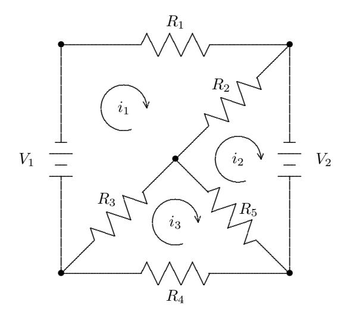
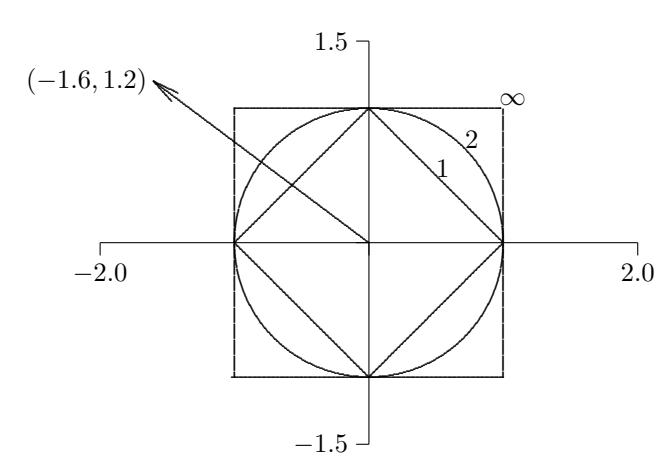
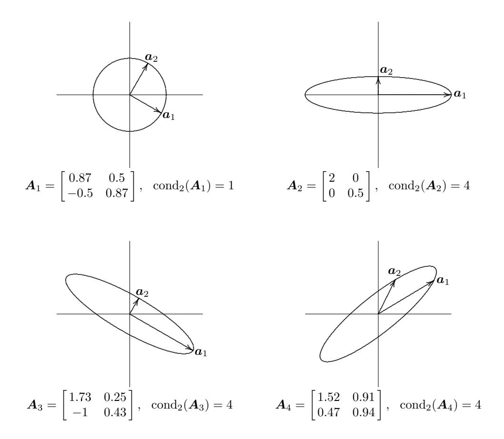
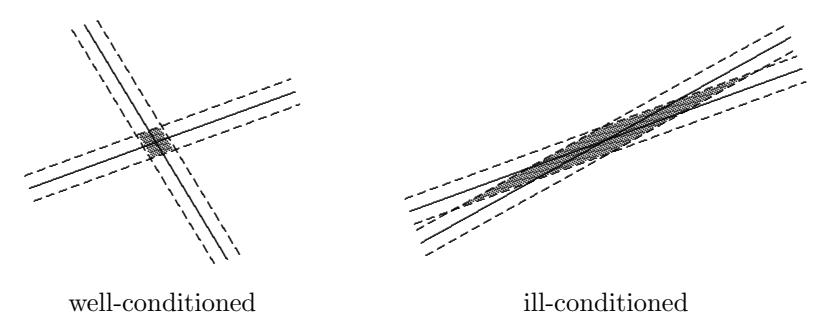
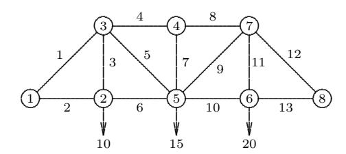

# Chapter 2

# Systems of Linear Equations

# 2.1 Linear Systems

Many relationships in nature are linear, meaning that effects are proportional to their causes. In mechanics, for example, Newton's Second Law of Motion, F = ma, says that force is proportional to acceleration, where the proportionality constant is the mass of the object. If we know the force and the mass, we can solve this linear equation for the acceleration. In electricity, Ohm's Law, V = iR, says that the voltage (potential difference) across a conductor is proportional to the current flowing through it, where the proportionality constant is the resistance. Again, if we know the voltage and resistance, we can solve for the current. In elasticity, Hooke's Law says that stress is proportional to strain, where the proportionality constant is Young's modulus.

In higher dimensions, such a linear relationship is expressed by a linear transformation L that relates a vector of "causes" u to a vector of "effects" f, so that

$$\mathcal{L}u = f$$
.

For example, Ohm's Law and Kirchhoff's Laws enable us to derive a whole system of coupled equations expressing the linear relationship between voltages and currents in an entire circuit made up of many conductors (see Example 2.1). As we learned in elementary linear algebra, a linear transformation between two finite-dimensional vector spaces is conveniently represented by a matrix. In matrix-vector notation, a system of linear algebraic equations has the form

$$Ax = b$$

where A is a known m × n matrix, b is an m-vector, and x an n-vector. If we know x, then such a linear relationship enables us to predict effect b from cause x by matrix-vector multiplication: b = Ax. More interestingly, the linear system may enable us to do "reverse engineering": if we know the vector b of effects, we would like to be able to determine the corresponding vector x of causes. Numerical methods for accomplishing this are the subject of this chapter.

Even when relationships are nonlinear, they can often be usefully approximated locally (i.e., for values near some specific fixed value) by a linear relationship. This is precisely what the derivative does in calculus: it provides a local linear approximation—the tangent line—to a nonlinear curve. This observation forms the basis for many numerical methods for solving nonlinear algebraic problems. Even nonalgebraic problems, such as differential or integral equations, can ultimately be approximated by a system of linear algebraic equations, as we will see later in this book. For these reasons, the solution of systems of linear equations forms the cornerstone of many numerical methods for solving a wide variety of practical computational problems, and consequently it is imperative that we be able to solve such systems accurately and efficiently.

A system of linear equations Ax = b asks the question, "Can the vector b be expressed as a linear combination of the columns of the matrix A?" (i.e., "Does b lie in span(A) = {Ax : x ∈ R <sup>n</sup>}?"). If so, the system is said to be consistent, and the coefficients of this linear combination are given by the components of the solution vector x. There may or may not be a solution; and if there is a solution, it may or may not be unique. In this chapter we will consider only square systems, which means that m = n, i.e., the matrix has the same number of rows and columns, or equivalently, the numbers of equations (rows of A and b) and unknowns (components of x) are the same. We will consider systems where m 6= n in Chapter 3. For simplicity, we will focus our attention primarily on real linear systems; complex systems can be treated similarly.

Example 2.1 Electrical Circuit. Consider the electrical circuit shown in Fig. 2.1. Given voltages V and resistances R, and we wish to determine the resulting currents i in each of the three loops in the circuit. To do so we apply the following physical laws:

- Ohm's Law: The voltage drop across a resistance R in the direction of a current i is given by iR.
- Kirchhoff 's Law: The net voltage drop in a closed loop is zero.

Applying these laws to each loop in the circuit, we obtain the system of three linear equations

$$i_1R_1 + (i_1 - i_2)R_2 + (i_1 - i_3)R_3 + V_1 = 0,$$
  

$$(i_2 - i_1)R_2 + (i_2 - i_3)R_5 - V_2 = 0,$$
  

$$(i_3 - i_1)R_3 + i_3R_4 + (i_3 - i_2)R_5 = 0,$$

which can be written in matrix form as

$$\begin{bmatrix} R_1 + R_2 + R_3 & -R_2 & -R_3 \\ -R_2 & R_2 + R_5 & -R_5 \\ -R_3 & -R_5 & R_3 + R_4 + R_5 \end{bmatrix} \begin{bmatrix} i_1 \\ i_2 \\ i_3 \end{bmatrix} = \begin{bmatrix} -V_1 \\ V_2 \\ 0 \end{bmatrix}.$$

Thus, this problem has the form Ax = b and can be solved using the methods we will study in this chapter.



Figure 2.1: Electrical circuit with resistors and voltage sources.

# 2.2 Existence and Uniqueness

An  $n \times n$  matrix  $\boldsymbol{A}$  is said to be *nonsingular* if it satisfies any one of the following equivalent conditions:

- 1.  $\boldsymbol{A}$  has an inverse (i.e., there is an  $n \times n$  matrix, denoted by  $\boldsymbol{A}^{-1}$ , such that  $\boldsymbol{A}\boldsymbol{A}^{-1} = \boldsymbol{A}^{-1}\boldsymbol{A} = \boldsymbol{I}$ , the identity matrix).
- 2.  $\det(\mathbf{A}) \neq 0$  (i.e., the determinant of  $\mathbf{A}$  is nonzero).
- 3.  $rank(\mathbf{A}) = n$  (the rank of a matrix is the maximum number of linearly independent rows or columns it contains).
- 4. For any vector  $z \neq 0$ ,  $Az \neq 0$  (i.e., A annihilates no nontrivial vector).

Otherwise, the matrix is singular. The existence and uniqueness of a solution to a system of linear equations Ax = b depend on whether the matrix A is singular or nonsingular. If the matrix A is nonsingular, then its inverse,  $A^{-1}$ , exists, and the system Ax = b always has the unique solution  $x = A^{-1}b$  regardless of the value for b. If, on the other hand, the matrix A is singular, then the number of solutions is determined by the right-hand-side vector b: for a given value of b there may be no solution, but if there is a solution x, so that Ax = b, then we also have  $A(x + \gamma z) = b$  for any scalar  $\gamma$ , where  $z \neq 0$  is a vector such that Az = 0 (such a z must exist, since otherwise Condition 4 in the definition implies that the matrix is nonsingular). Thus, a solution of a square, consistent, singular, linear system

cannot be unique. For a given square matrix A and right-hand-side vector b, the possibilities are summarized as follows:

- Unique solution: **A** nonsingular, **b** arbitrary
- Infinitely many solutions: A singular,  $b \in \text{span}(A)$ (consistent)
- No solution: A singular,  $b \notin \text{span}(A)$ (inconsistent)

In two dimensions, each linear equation in the system determines a straight line in the plane. The solution of the system is the intersection point of the two lines. If the two straight lines are not parallel, then they have a unique intersection point (the nonsingular case). If the two straight lines are parallel, then either they do not intersect at all (there is no solution) or the two lines coincide (any point along the line is a solution). In higher dimensions, each equation determines a hyperplane. In the nonsingular case, the unique solution is the intersection point of all the hyperplanes.

#### Example 2.2 Singularity and Nonsingularity. The $2 \times 2$ system

$$2x_1 + 3x_2 = b_1,$$
  
 $5x_1 + 4x_2 = b_2,$ 

or in matrix-vector notation

$$\bm{A}\bm{x} = \begin{bmatrix} 2 & 3 \ 5 & 4 \end{bmatrix} \bm{x}_1 \ x_2 \end{bmatrix} = \bm{b}_1 \ b_2 \end{bmatrix} = \bm{b},$$

has a unique solution regardless of the value of b, since the matrix A is nonsingular. If  $b = \begin{bmatrix} 8 & 13 \end{bmatrix}^T$ , for example, then the unique solution is  $x = \begin{bmatrix} 1 & 2 \end{bmatrix}^T$ .

The  $2 \times 2$  system

$$\bm{A}\bm{x} = \begin{bmatrix} 2 & 3 \\ 4 & 6 \end{bmatrix} \begin{bmatrix} x_1 \\ x_2 \end{bmatrix} = bgbedbelbelbelbelbelbelbelbelbelbelbelbelbelb$$

on the other hand, has a singular matrix A, and hence it may or may not have a solution, depending on the specific the value of b, and it cannot have a unique solution in any case. For example, if  $\mathbf{b} = \begin{bmatrix} 4 \\ 7 \end{bmatrix}^T$ , then there is no solution, whereas if  $\boldsymbol{b} = \begin{bmatrix} 4 & 8 \end{bmatrix}^T$ , then

$$\boldsymbol{x} = \begin{bmatrix} \gamma \\ (4 - 2\gamma)/3 \end{bmatrix}$$

is a solution for any real number  $\gamma$ .

#### 2.3 Sensitivity and Conditioning

Having stated criteria for the existence and uniqueness of a solution to a linear system Ax = b, we now consider the sensitivity of the solution x to perturbations in the input data, which for this problem are the matrix A and right-hand-side vector b. To measure such perturbations, we need some notion of "size" for vectors and matrices. The scalar concept of magnitude, absolute value, or modulus can be generalized to the concept of norms for vectors and matrices.

#### 2.3.1 Vector Norms

Although a more general definition is possible, all of the vector norms we will use are instances of p-norms, which for an integer p > 0 and an n-vector x are defined by

$$\|\boldsymbol{x}\|_p = \left(\sum_{i=1}^n |x_i|^p\right)^{1/p}.$$

Important special cases are:

• 1-norm:

$$\|x\|_1 = \sum_{i=1}^n |x_i|,$$

sometimes called the Manhattan norm because in two dimensions it corresponds to the distance between two points as measured in "city blocks."

• 2-norm:

$$\|\boldsymbol{x}\|_2 = \left(\sum_{i=1}^n |x_i|^2\right)^{1/2},$$

which corresponds to the usual notion of distance in Euclidean space, so this is also called the Euclidean norm.

• ∞-norm:

$$\|\boldsymbol{x}\|_{\infty} = \max_{1 \le i \le n} |x_i|,$$

which can be viewed as a limiting case as p → ∞.

All of these norms give similar results qualitatively, but in certain circumstances a particular norm may be easiest to work with analytically or computationally. Either the 1-norm or the ∞-norm is usually used in analyzing the sensitivity of solutions to linear systems. We will make extensive use of the 2-norm later on in other contexts. The differences among these norms are illustrated for R 2 in Fig. 2.2, which shows the unit sphere, {x : kxk<sup>p</sup> = 1}, for p = 1, 2, ∞. (Note that the unit sphere, which is more accurately termed the unit circle in two dimensions, is not really "round" except in the 2-norm, from which it gets its name.) The norm of a vector is simply the factor by which the corresponding unit sphere must be expanded or shrunk to encompass the vector.

Example 2.3 Vector Norms. For the vector x = [−1.6, 1.2]<sup>T</sup> shown in Fig. 2.2,

$$\|\boldsymbol{x}\|_1 = 2.8, \quad \|\boldsymbol{x}\|_2 = 2.0, \quad \|\boldsymbol{x}\|_{\infty} = 1.6.$$



Figure 2.2: Unit spheres in various vector norms.

In general, for any n-vector  $\boldsymbol{x}$ , we have

$$\|x\|_1 \ge \|x\|_2 \ge \|x\|_{\infty}.$$

On the other hand, we also have

$$\|x\|_1 \le \sqrt{n} \|x\|_2$$
,  $\|x\|_2 \le \sqrt{n} \|x\|_{\infty}$ , and  $\|x\|_1 \le n \|x\|_{\infty}$ .

Thus, for a given n, any two of these norms differ by at most a constant, so they are all equivalent in the sense that if one is small, they must all be proportionally small (indeed, all p-norms are equivalent in this sense). Hence, we can choose whichever norm is most convenient in a given context. In the remainder of this book, an appropriate subscript will be used to indicate a specific norm, when necessary, but the subscript will be omitted when it does not matter which particular norm is used.

For any vector p-norm, the following important properties hold, where  $\boldsymbol{x}$  and  $\boldsymbol{y}$  are any vectors:

- 1.  $\|\mathbf{x}\| > 0 \text{ if } \mathbf{x} \neq \mathbf{0}.$
- 2.  $\|\gamma \boldsymbol{x}\| = |\gamma| \cdot \|\boldsymbol{x}\|$  for any scalar  $\gamma$ .
- 3.  $\|\boldsymbol{x} + \boldsymbol{y}\| \le \|\boldsymbol{x}\| + \|\boldsymbol{y}\|$  (triangle inequality).

In a more general treatment, the *definition* of a vector norm can be taken to be any real-valued function of a vector that satisfies these three properties. Note that the first two properties together imply that  $\|\boldsymbol{x}\| = 0$  if, and only if,  $\boldsymbol{x} = \boldsymbol{0}$ . A useful variation of the triangle inequality is

$$|||x|| - ||y||| \le ||x - y||,$$

which also shows that a vector norm is a continuous function.

#### 2.3.2 Matrix Norms

We also need some way to measure the size or magnitude of matrices. Again, a more general definition is possible, but all of the matrix norms we will use are

defined in terms of an underlying vector norm. Specifically, given a vector norm, we define the corresponding matrix norm of an m × n matrix A by

$$\|\boldsymbol{A}\| = \max_{\boldsymbol{x} \neq \boldsymbol{0}} \frac{\|\boldsymbol{A}\boldsymbol{x}\|}{\|\boldsymbol{x}\|}.$$

Such a matrix norm is said to be induced by or subordinate to the vector norm. Intuitively, the norm of a matrix measures the maximum stretching the matrix does to any vector, as measured in the given vector norm.

Some matrix norms are much easier to compute than others. For example, the matrix norm corresponding to the vector 1-norm is simply the maximum absolute column sum of the matrix,

$$\|A\|_1 = \max_j \sum_{i=1}^m |a_{ij}|,$$

and the matrix norm corresponding to the vector ∞-norm is simply the maximum absolute row sum of the matrix,

$$\|\mathbf{A}\|_{\infty} = \max_{i} \sum_{j=1}^{n} |a_{ij}|.$$

A handy way to remember these is that the matrix norms agree with the corresponding vector norms for an n × 1 matrix. Unfortunately, the matrix norm corresponding to the vector 2-norm is not so easy to compute (see Section 3.6.1).

#### Example 2.4 Matrix Norms. For the matrix

$$\mathbf{A} = \begin{bmatrix} 2 & -1 & 1 \\ 1 & 0 & 1 \\ 3 & -1 & 4 \end{bmatrix},$$

the maximum absolute column and row sums, respectively, give

$$\|A\|_1 = 6$$
 and  $\|A\|_{\infty} = 8$ .

For the 2-norm of this matrix, see Example 3.17.

The matrix norms we have defined satisfy the following important properties, where A and B are any matrices:

- 1. kAk > 0 if A 6= O.
- 2. kγAk = |γ| · kAk for any scalar γ.
- 3. kA + Bk ≤ kAk + kBk.
- 4. kABk ≤ kAk · kBk.
- 5. kAxk ≤ kAk · kxk for any vector x.

In a more general treatment, the definition of a matrix norm can be taken to be any real-valued function of a matrix satisfying the first three of these properties. The remaining two properties, known as submultiplicative or consistency conditions, may or may not hold for these more general matrix norms, but they always hold for the matrix norms induced by the vector p-norms. Note again that the first two properties together imply that kAk = 0 if, and only if, A = O.

#### 2.3.3 Matrix Condition Number

The condition number of a nonsingular square matrix A with respect to a given matrix norm is defined to be

$$\operatorname{cond}(\boldsymbol{A}) = \|\boldsymbol{A}\| \cdot \|\boldsymbol{A}^{-1}\|.$$

By convention, cond(A) = ∞ if A is singular. We will see in Section 2.3.4 that this concept is consistent with the general notion of condition number defined in Section 1.2.6 in that the condition number of the matrix bounds the ratio of the relative change in the solution of a linear system to a given relative change in the input data.

Example 2.5 Matrix Condition Number. As can easily be verified by matrix multiplication, the inverse of the matrix in Example 2.4 is given by

$$\mathbf{A}^{-1} = \begin{bmatrix} 0.5 & 1.5 & -0.5 \\ -0.5 & 2.5 & -0.5 \\ -0.5 & -0.5 & 0.5 \end{bmatrix},$$

so that

$$\|\mathbf{A}^{-1}\|_1 = 4.5$$
 and  $\|\mathbf{A}^{-1}\|_{\infty} = 3.5$ .

Thus, we have

$$\operatorname{cond}_1(\mathbf{A}) = \|\mathbf{A}\|_1 \cdot \|\mathbf{A}^{-1}\|_1 = 6 \cdot 4.5 = 27$$

and

$$\operatorname{cond}_{\infty}(\mathbf{A}) = \|\mathbf{A}\|_{\infty} \cdot \|\mathbf{A}^{-1}\|_{\infty} = 8 \cdot 3.5 = 28.$$

For the condition number of this matrix using the 2-norm, see Example 3.17.

From Example 2.5 we see that the numerical value of the condition number of an n × n matrix depends on the particular norm used (indicated by the corresponding subscript), but because of the equivalence of the underlying vector norms, these values can differ by at most a fixed constant (which depends on n), and hence they are equally useful as quantitative measures of conditioning.

Since

$$\|\boldsymbol{A}\| \cdot \|\boldsymbol{A}^{-1}\| = \left(\max_{\boldsymbol{x} \neq \boldsymbol{0}} \frac{\|\boldsymbol{A}\boldsymbol{x}\|}{\|\boldsymbol{x}\|}\right) \cdot \left(\min_{\boldsymbol{x} \neq \boldsymbol{0}} \frac{\|\boldsymbol{A}\boldsymbol{x}\|}{\|\boldsymbol{x}\|}\right)^{-1},$$

the condition number of a matrix measures the ratio of the maximum relative stretching to the maximum relative shrinking that the matrix does to any nonzero vectors. Another way to say this is that the condition number of a matrix measures the amount of distortion of the unit sphere (in the corresponding vector norm) under transformation by the matrix. The larger the condition number, the more distorted (relatively long and thin) the unit sphere becomes when transformed by the matrix. In two dimensions, for example, the unit circle in the 2-norm becomes an increasingly cigar-shaped ellipse, and with the 1-norm or ∞-norm, the unit sphere is transformed from a square into an increasingly skewed parallelogram as the condition number increases.

Example 2.6 Matrix Condition Number. Fig. 2.3 illustrates the effect of four different matrices on the unit circle in  $\mathbb{R}^2$  using the 2-norm.  $A_1$  rotates the unit circle clockwise by 30 degrees but does not change the Euclidean length of any vector, so  $\operatorname{cond}_2(A_1) = 1$ .  $A_2$  stretches the basis vector  $e_1$  by a factor of 2 and shrinks the basis vector  $e_2$  by a factor of 0.5, and these are both maximal, so  $\operatorname{cond}_2(A_2) = 2/0.5 = 4$ .  $A_3$  both rotates and distorts the unit circle, but the maximum ratio is still the same as with  $A_2$ , so  $\operatorname{cond}_2(A_3) = 4$ . Finally,  $A_4$  is a more general transformation under which the maximum ratio no longer occurs for the basis vectors, but the value of the maximum is still the same, so  $\operatorname{cond}_2(A_4) = 4$ .



Figure 2.3: Transformation of unit circle in 2-norm by various matrices.

The following important properties of the condition number are easily derived from the definition and hold for any norm:

- 1. For any matrix A, cond(A) ≥ 1.
- 2. For the identity matrix, cond(I) = 1.
- 3. For any matrix A and nonzero scalar γ, cond(γA) = cond(A).
- 4. For any diagonal matrix D = diag(di), cond(D) = (max |d<sup>i</sup> |)/(min |d<sup>i</sup> |).

The condition number is a measure of how close a matrix is to being singular: a matrix with a large condition number (which we will quantify in Section 2.3.4) is nearly singular, whereas a matrix with a condition number close to 1 is far from being singular. It is obvious from the definition that a nonsingular matrix and its inverse have the same condition number. This stands to reason, since if a matrix is nearly singular, then its inverse is equally close to being singular.

Note that the determinant of a matrix is not a good indicator of near singularity: although a matrix A is singular if det(A) = 0, the magnitude of a nonzero determinant, large or small, gives no information on how close to singular the matrix may be. For example, det(αIn) = α <sup>n</sup>, which can be arbitrarily small for |α| < 1, yet the matrix is perfectly well-conditioned for any nonzero α, with a condition number of 1 in any matrix norm.

As we will see shortly, the usefulness of the condition number is in assessing the accuracy of solutions to linear systems. The definition of the condition number involves the inverse of the matrix, so computing its value is obviously a nontrivial task. In fact, to compute the condition number directly from its definition would require substantially more work than computing the solution whose accuracy is to be assessed using the condition number. In practice, therefore, the condition number is merely estimated, to perhaps within an order of magnitude, as a relatively inexpensive byproduct of the solution process.

The matrix norm kAk is easily computed as the maximum absolute column sum (or row sum, depending on the norm used). It is estimating kA<sup>−</sup><sup>1</sup>k at low cost that presents a challenge. From the properties of norms, we know that if z is the solution to Az = y, then

$$\|z\| = \|A^{-1}y\| \le \|A^{-1}\| \cdot \|y\|,$$

so that

$$\frac{\|\boldsymbol{z}\|}{\|\boldsymbol{y}\|} \le \|\boldsymbol{A}^{-1}\|,$$

and this bound is achieved for some optimally chosen vector y. Thus, if we can choose a vector y such that the ratio kzk/kyk is as large as possible, then we will have a reasonable estimate for kA<sup>−</sup><sup>1</sup>k.

## Example 2.7 Condition Estimation. Consider the matrix

$$\mathbf{A} = \begin{bmatrix} 0.913 & 0.659 \\ 0.457 & 0.330 \end{bmatrix}.$$

If we choose y = [0, 1.5]<sup>T</sup> , then z = [−7780, 10780]<sup>T</sup> , so that

$$\|\boldsymbol{A}^{-1}\|_{1} \approx \frac{\|\boldsymbol{z}\|_{1}}{\|\boldsymbol{y}\|_{1}} \approx 1.238 \times 10^{4},$$

and hence

$$\operatorname{cond}_1(\mathbf{A}) = \|\mathbf{A}\|_1 \cdot \|\mathbf{A}^{-1}\|_1 \approx 1.370 \times 1.238 \times 10^4 = 1.696 \times 10^4,$$

which turns out to be exact to the number of digits shown. The ramifications of this relatively large condition number will be explored in Examples 2.8 and 2.17.

The vector y in Example 2.7 was carefully chosen to produce the maximum possible ratio kzk/kyk, and hence the correct value for kA<sup>−</sup><sup>1</sup>k. Finding such an optimal y would be prohibitively expensive, in general, but a useful approximation can be obtained much more cheaply. One heuristic is to choose y as the solution to the system A<sup>T</sup> y = c, where c is a vector whose components are ±1, with the signs chosen successively to make the resulting y as large as possible. Another strategy is simply to try a few random choices for y; taking the maximum ratio among them usually yields an estimate for kA<sup>−</sup><sup>1</sup>k that is close enough for practical purposes.

An alternative approach to condition estimation is to treat it as a convex optimization problem that can be solved very efficiently in practice using a heuristic algorithm. Still another option, when using the 2-norm, is to obtain the condition number from the singular value decomposition (see Section 3.6.1), but this is prohibitively expensive unless the SVD is already being computed anyway for other reasons. Fortunately, users need not worry about these details, as most good modern software packages for solving linear systems provide an efficient and reliable condition estimator, based on a sophisticated implementation of one of the methods outlined here (see Table 2.1).

#### 2.3.4 Error Bounds

In addition to being a reliable indicator of near singularity, the condition number also provides a quantitative bound for the error in the computed solution to a linear system, as we will now show. Let x be the solution to the nonsingular linear system Ax = b, and let xˆ be the solution to the system Axˆ = b + ∆b with a perturbed right-hand side. If we define ∆x = xˆ − x, then we have

$$\boldsymbol{A}\hat{\boldsymbol{x}} = \boldsymbol{A}(\boldsymbol{x} + \Delta\boldsymbol{x}) = \boldsymbol{A}\boldsymbol{x} + \boldsymbol{A}\,\Delta\boldsymbol{x} = \boldsymbol{b} + \Delta\boldsymbol{b}.$$

Because Ax = b, we must have A ∆x = ∆b, and hence ∆x = A<sup>−</sup><sup>1</sup>∆b. Taking norms, we obtain the inequalities

$$\|b\| = \|Ax\| \le \|A\| \cdot \|x\|, \quad \text{or} \quad \|x\| \ge \|b\|/\|A\|,$$

and

$$\|\Delta x\| = \|A^{-1}\Delta b\| \le \|A^{-1}\| \cdot \|\Delta b\|.$$

Combining these inequalities, we obtain

$$\frac{\|\Delta \boldsymbol{x}\|}{\|\boldsymbol{x}\|} \leq \|\boldsymbol{A}^{-1}\| \cdot \|\Delta \boldsymbol{b}\| \frac{\|\boldsymbol{A}\|}{\|\boldsymbol{b}\|}$$

.

By definition kAk · kA<sup>−</sup><sup>1</sup>k = cond(A), so we therefore obtain the bound

$$\frac{\|\Delta \boldsymbol{x}\|}{\|\boldsymbol{x}\|} \leq \operatorname{cond}(\boldsymbol{A}) \frac{\|\Delta \boldsymbol{b}\|}{\|\boldsymbol{b}\|}.$$

Thus, the condition number of the matrix is an "amplification factor" that bounds the maximum relative change in the solution due to a given relative change in the right-hand-side vector (compare with the general notion of condition number defined in Section 1.2.6).

A similar result holds for relative changes in the entries of the matrix A. If Ax = b and (A + E)xˆ = b, then

$$\Delta x = \hat{x} - x = A^{-1}(A\hat{x} - b) = -A^{-1}E\hat{x}.$$

Taking norms, we obtain the inequality

$$\|\Delta \boldsymbol{x}\| \leq \|\boldsymbol{A}^{-1}\| \cdot \|\boldsymbol{E}\| \cdot \|\hat{\boldsymbol{x}}\|,$$

which, upon using the definition of cond(A), yields the bound

$$\frac{\|\Delta \boldsymbol{x}\|}{\|\hat{\boldsymbol{x}}\|} \leq \operatorname{cond}(\boldsymbol{A}) \frac{\|\boldsymbol{E}\|}{\|\boldsymbol{A}\|}.$$

As an alternative to the algebraic derivations just given, calculus can be used to estimate the sensitivity of linear systems. Introducing the real-valued parameter t, we define A(t) = A + tE and b(t) = b + t∆b, and consider the solution x(t) to the linear system A(t)x(t) = b(t). Differentiating this equation with respect to t, we obtain

$$\boldsymbol{A}'(t)\boldsymbol{x}(t) + \boldsymbol{A}(t)\boldsymbol{x}'(t) = \boldsymbol{b}'(t),$$

or equivalently,

$$Ex(t) + A(t)x'(t) = \Delta b.$$

Rearranging, we then have

$$\boldsymbol{x}'(t) = \boldsymbol{A}(t)^{-1} (\Delta \boldsymbol{b} - \boldsymbol{E} \boldsymbol{x}(t)),$$

which gives

$$\boldsymbol{x}'(0) = \boldsymbol{A}^{-1}(\Delta \boldsymbol{b} - \boldsymbol{E}\boldsymbol{x}(0)).$$

Now by Taylor's Theorem, x(t) = x(0) + tx 0 (0) + O(t 2 ), so that we have

$$\boldsymbol{x}(t) - \boldsymbol{x}(0) = t\boldsymbol{x}'(0) + \mathcal{O}(t^2) = t\boldsymbol{A}^{-1}(\Delta\boldsymbol{b} - \boldsymbol{E}\boldsymbol{x}(0)) + \mathcal{O}(t^2).$$

Writing x ≡ x(0), taking norms, and dividing by kxk, we obtain the bound

$$\frac{\|\boldsymbol{x}(t) - \boldsymbol{x}\|}{\|\boldsymbol{x}\|} \leq \|\boldsymbol{A}^{-1}\| \left( \frac{\|\Delta \boldsymbol{b}\|}{\|\boldsymbol{x}\|} + \|\boldsymbol{E}\| \right) |t| + \mathcal{O}(t^{2})$$

$$\leq \operatorname{cond}(\boldsymbol{A}) \left( \frac{\|\Delta \boldsymbol{b}\|}{\|\boldsymbol{A}\| \cdot \|\boldsymbol{x}\|} + \frac{\|\boldsymbol{E}\|}{\|\boldsymbol{A}\|} \right) |t| + \mathcal{O}(t^{2})$$

$$\leq \operatorname{cond}(\boldsymbol{A}) \left( \frac{\|\Delta \boldsymbol{b}\|}{\|\boldsymbol{b}\|} + \frac{\|\boldsymbol{E}\|}{\|\boldsymbol{A}\|} \right) |t| + \mathcal{O}(t^{2}).$$

Thus, we again see that the relative change in the solution is bounded by the condition number times the relative change in the problem data.

A geometric interpretation of these sensitivity results in two dimensions is that if the straight lines defined by the two equations are nearly parallel, then their point of intersection is not sharply defined if the lines are a bit uncertain because of rounding or measurement error. If, on the other hand, the lines are far from parallel, say nearly perpendicular, then their intersection is relatively sharply defined. These two cases are illustrated in Fig. 2.4, where the dashed lines indicate the region of uncertainty for each solid line, so that the intersection point in each case could be anywhere within the shaded parallelogram. Thus, a large condition number is associated with a large uncertainty in the solution.



Figure 2.4: Well-conditioned and ill-conditioned linear systems.

To summarize, if the input data are accurate to machine precision, then we can expect the relative error in an approximate solution  $\hat{x}$  to a linear system Ax = b to be bounded by

$$\frac{\|\hat{\boldsymbol{x}}-\boldsymbol{x}\|}{\|\boldsymbol{x}\|}\lessapprox \operatorname{cond}(\boldsymbol{A})\;\epsilon_{\mathrm{mach}}.$$

Interpreting this result in terms of backward error analysis, we observe that a computed solution can be expected to lose about  $\log_{10}(\operatorname{cond}(\mathbf{A}))$  decimal digits of accuracy relative to the accuracy of the input. The matrix in Example 2.7, for instance, has a condition number greater than  $10^4$ , so we would expect no correct digits in the solution to a linear system with this matrix unless the input data are accurate to more than four decimal digits and the working precision carries more than four decimal digits (see Examples 2.8 and 2.17).

As a quantitative measure of sensitivity, the matrix condition number plays the same role for the problem of solving linear systems—and yields the same type of relationship between forward and backward error—as the general notion of condition number defined in Section 1.2.6. An important difference, however, is that the matrix condition number is never less than 1.

Before leaving the subject of assessing accuracy in terms of condition numbers, note these two caveats:

• The foregoing analysis using norms provides a bound on the relative error in the *largest* components of the solution vector. The *relative* error in the smaller

components can be much larger, because a vector norm is dominated by the largest components of a vector. Componentwise error bounds can be obtained but are somewhat more complicated to compute, and we will not pursue this topic. Componentwise bounds are of particular interest when the system is poorly scaled (see Section 2.4.10).

• The condition number of a matrix is affected by the scaling of the matrix (see Example 2.10). A large condition number can result simply from poor scaling (see Example 2.20), as well as from near singularity. Rescaling the matrix can help the former, but not the latter (see Section 2.4.10).

#### 2.3.5 Residual

One way to verify a solution to an equation is to substitute it into the equation and see how closely the left and right sides match. The residual of an approximate solution xˆ to a linear system Ax = b is the difference

$$r = b - A\hat{x}$$
.

If A is nonsingular, then in theory the error k∆xk = kxˆ − xk = 0 if, and only if, krk = 0. In practice, however, these quantities are not necessarily small simultaneously. First, note that if the equation Ax = b is multiplied by an arbitrary nonzero constant, then the solution is unaffected, but the residual is multiplied by the same factor. Thus, the residual can be made arbitrarily large or small, depending on the scaling of the problem, and hence the size of the residual is meaningless unless it is considered relative to the size of the problem data and the solution. For this reason, the relative residual for the approximate solution xˆ is defined to be krk/(kAk·kxˆk).

$$\|\Delta x\| = \|\hat{x} - x\| = \|A^{-1}(A\hat{x} - b)\| = \|-A^{-1}r\| \le \|A^{-1}\| \cdot \|r\|.$$

To relate the error to the residual, we observe that

Dividing both sides by kxˆk and using the definition of cond(A), we then have

$$\frac{\|\Delta \boldsymbol{x}\|}{\|\hat{\boldsymbol{x}}\|} \leq \operatorname{cond}(\boldsymbol{A}) \frac{\|\boldsymbol{r}\|}{\|\boldsymbol{A}\| \cdot \|\hat{\boldsymbol{x}}\|}.$$

Thus, a small relative residual implies a small relative error in the solution when, and only when, A is well-conditioned.

To see the implications of a large residual, on the other hand, suppose that the computed solution xˆ exactly satisfies

$$(\boldsymbol{A} + \boldsymbol{E})\hat{\boldsymbol{x}} = \boldsymbol{b}.$$

Then

$$\|\bm{r}\| = \|\bm{b} - \bm{A}\hat{\bm{x}}\| = \|\bm{E}\hat{\bm{x}}\| \le \|\bm{E}\| \cdot \|\hat{\bm{x}}\|,$$

so that we have the inequality

$$\frac{\|\boldsymbol{r}\|}{\|\boldsymbol{A}\|\cdot\|\hat{\boldsymbol{x}}\|} \leq \frac{\|\boldsymbol{E}\|}{\|\boldsymbol{A}\|}$$

.

Thus, a large relative residual implies a large backward error in the matrix, which means that the algorithm used to compute the solution is unstable. Another way of saying this is that a stable algorithm will invariably produce a solution with a small relative residual, irrespective of the conditioning of the problem, and hence a small residual, by itself, sheds little light on the quality of the approximate solution. We will comment further on this issue in Section 2.4.5.

#### Example 2.8 Small Residual. Consider the linear system

$$\boldsymbol{Ax} = \begin{bmatrix} 0.913 & 0.659 \\ 0.457 & 0.330 \end{bmatrix} \begin{bmatrix} x_1 \\ x_2 \end{bmatrix} = \begin{bmatrix} 0.254 \\ 0.127 \end{bmatrix} = \boldsymbol{b},$$

whose matrix we saw in Example 2.7. Consider two approximate solutions

$$\hat{\boldsymbol{x}}_1 = \begin{bmatrix} 0.6391 \\ -0.5 \end{bmatrix}$$
 and  $\hat{\boldsymbol{x}}_2 = \begin{bmatrix} 0.999 \\ -1.001 \end{bmatrix}$ .

The norms of their respective residuals are

$$\|\boldsymbol{r}_1\|_1 = 7.0 \times 10^{-5}$$
 and  $\|\boldsymbol{r}_2\|_1 = 2.4 \times 10^{-2}$ .

So which is the better solution? We are tempted to say  $\hat{x}_1$  because of its much smaller residual. But the exact solution to this system is  $x = [1, -1]^T$ , as is easily confirmed, so  $\hat{x}_2$  is actually much more accurate than  $\hat{x}_1$ . The reason for this surprising behavior is that the matrix A is ill-conditioned, as we saw in Example 2.7, and because of its large condition number, a small residual does not imply a small error in the solution. To see how  $\hat{x}_1$  was obtained, see Example 2.17.

# 2.4 Solving Linear Systems

#### 2.4.1 Problem Transformations

To solve a linear system Ax = b, the general strategy outlined in Section 1.1.2 suggests that we should transform the system into one whose solution is the same as that of the original system but is easier to compute. What type of transformation of a linear system leaves the solution unchanged? The answer is that we can premultiply (i.e., multiply from the left) both sides of the linear system Ax = b by any nonsingular matrix M without affecting the solution. To see why, note that the solution to the linear system MAz = Mb is given by

$$z = (MA)^{-1}Mb = A^{-1}M^{-1}Mb = A^{-1}b = x.$$

**Example 2.9 Permutations.** An important example of such a transformation is the fact that the rows of A and corresponding entries of b can be reordered without changing the solution x. This is intuitively obvious: all of the equations

in the system must be satisfied simultaneously, so the order in which they happen to be written down is irrelevant; they may as well have been drawn randomly from a hat. Formally, such a reordering of the rows is accomplished by premultiplying both sides of the equation by a permutation matrix P , which is a square matrix having exactly one 1 in each row and column and zeros elsewhere (i.e., an identity matrix with its rows and columns permuted). For example,

$$\begin{bmatrix} 0 & 0 & 1 \\ 1 & 0 & 0 \\ 0 & 1 & 0 \end{bmatrix} \begin{bmatrix} v_1 \\ v_2 \\ v_3 \end{bmatrix} = \begin{bmatrix} v_3 \\ v_1 \\ v_2 \end{bmatrix}.$$

A permutation matrix is always nonsingular; in fact, its inverse is simply its transpose, P <sup>−</sup><sup>1</sup> = P T (the transpose of a matrix M, denoted by M<sup>T</sup> , is a matrix whose columns are the rows of M, that is, if N = M<sup>T</sup> , then nij = mji). Thus, the reordered system can be written P Ax = P b, and the solution x is unchanged.

Postmultiplying (i.e., multiplying from the right) by a permutation matrix reorders the columns of the matrix instead of the rows. Such a transformation does change the solution, but only in that the components of the solution are permuted. To see this, observe that the solution to the system AP z = b is given by

$$z = (AP)^{-1}b = P^{-1}A^{-1}b = P^{T}A^{-1}b = P^{T}x,$$

and hence the solution to the original system Ax = b is given by x=P z.

Example 2.10 Diagonal Scaling. Another simple but important type of transformation is diagonal scaling. Recall that a matrix D is diagonal if dij = 0 for all i 6= j, that is, the only nonzero entries are dii, i = 1, . . . , n, on the main diagonal. Premultiplying both sides of a linear system Ax = b by a nonsingular diagonal matrix D multiplies each row of the matrix and right-hand side by the corresponding diagonal entry of D, and hence is called row scaling. In principle, row scaling does not change the solution to the linear system, but in practice it can affect the numerical solution process and the accuracy that can be attained for a given problem, as we will see.

Column scaling—postmultiplying the matrix of a linear system by a nonsingular diagonal matrix D—multiplies each column of the matrix by the corresponding diagonal entry of D. Such a transformation does alter the solution, in effect changing the units in which the components of the solution are measured. The solution to the scaled system ADz = b is given by

$$z = (AD)^{-1}b = D^{-1}A^{-1}b = D^{-1}x,$$

and hence the solution to the original system Ax = b is given by x=Dz.

## 2.4.2 Triangular Linear Systems

The next question is what type of linear system is easy to solve. Suppose there is an equation in the system Ax = b that involves only one of the unknown solution components (i.e., only one entry in that row of A is nonzero). Then that equation can easily be solved (by division) for that unknown. Now suppose there is another equation in the system that involves only two unknowns, one of which is the one already determined. By substituting the one solution component already determined into this second equation, we can then easily solve for its other unknown. If this pattern continues, with only one new unknown component arising per equation, then all of the solution components can be computed in succession. A matrix with this special property is called triangular , for reasons that will soon become apparent. Because triangular linear systems are easily solved by this successive substitution process, they are a suitable target in transforming a general linear system.

Although the general triangular form just described is all that is required to enable the system to be solved by successive substitution, it is convenient to define two specific triangular forms for computational purposes. A matrix L is lower triangular if all of its entries above the main diagonal are zero (i.e., if `ij = 0 for i < j). Similarly, a matrix U is upper triangular if all of its entries below the main diagonal are zero (i.e., if uij = 0 for i > j). A matrix that is triangular in the more general sense defined earlier can be permuted into upper or lower triangular form by a suitable permutation of its rows or columns.

For a lower triangular system Lx = b, successive substitution is called forwardsubstitution and can be expressed mathematically as

$$x_1 = b_1/\ell_{11}, \quad x_i = \left(b_i - \sum_{j=1}^{i-1} \ell_{ij} x_j\right)/\ell_{ii}, \quad i = 2, \dots, n.$$

One way to implement it is shown in Algorithm 2.1.

Algorithm 2.1 Forward-Substitution for Lower Triangular System

```
for j = 1 to n
    if `jj = 0 then stop
    xj = bj/`jj
    for i = j + 1 to n
        bi = bi − `ijxj
    end
end
                                  { loop over columns }
                                  { stop if matrix is singular }
                                  { compute solution component }
                                  { update right-hand side }
```

Similarly, for an upper triangular system Ux = b, successive substitution is called back-substitution and can be expressed mathematically as

$$x_n = b_n/u_{nn}, x_i = \left(b_i - \sum_{j=i+1}^n u_{ij}x_j\right)/u_{ii}, i = n-1, \dots, 1.$$

One way to implement it is shown in Algorithm 2.2.

For both of these algorithms, we have chosen the ordering of the loop indices so that the matrix is accessed by columns (rather than by rows), and the inner-loop operation is a scalar times a vector plus a vector, or "saxpy" (see Section 2.7.2).

#### Algorithm 2.2 Back-Substitution for Upper Triangular System

```
for j = n to 1
    if ujj = 0 then stop
    xj = bj/ujj
    for i = 1 to j − 1
        bi = bi − uijxj
    end
end
                                  { loop backwards over columns }
                                  { stop if matrix is singular }
                                  { compute solution component }
                                  { update right-hand side }
```

We could also have chosen the opposite ordering of the loop indices, in which case the matrix would be accessed by rows, and the inner-loop operation would be an inner product of two vectors, or "sdot." These implementation choices may have a significant impact on performance, depending on the particular programming language and computer system used (see Computer Problem 2.16). Also note that a zero diagonal entry will cause either of the algorithms to fail, but this is to be expected, since a triangular matrix with a zero diagonal entry must be singular.

Example 2.11 Triangular Linear System. Consider the upper triangular linear system

$$\begin{bmatrix} 1 & 2 & 2 \\ 0 & -4 & -6 \\ 0 & 0 & -1 \end{bmatrix} \begin{bmatrix} x_1 \\ x_2 \\ x_3 \end{bmatrix} = \begin{bmatrix} 3 \\ -6 \\ 1 \end{bmatrix}.$$

The last equation, −x<sup>3</sup> = 1, can be solved directly for x<sup>3</sup> = −1. This value can then be substituted into the second equation to obtain x<sup>2</sup> = 3, and finally both x<sup>3</sup> and x<sup>2</sup> are substituted into the first equation to obtain x<sup>1</sup> = −1.

## 2.4.3 Elementary Elimination Matrices

Our strategy then is to devise a nonsingular linear transformation that transforms a given general linear system into a triangular linear system that we can then solve easily by successive substitution. Thus, we need a transformation that replaces selected nonzero entries of the given matrix with zeros. This can be accomplished by taking appropriate linear combinations of the rows of the matrix, as we will now show.

Consider the 2-vector a = [ a<sup>1</sup> a<sup>2</sup> ] T . If a<sup>1</sup> 6= 0, then

$$\begin{bmatrix} 1 & 0 \\ -a_2/a_1 & 1 \end{bmatrix} \begin{bmatrix} a_1 \\ a_2 \end{bmatrix} = \begin{bmatrix} a_1 \\ 0 \end{bmatrix}.$$

More generally, given an n-vector a, we can annihilate all of its entries below the

kth position, provided that  $a_k \neq 0$ , by the following transformation:

$$\bm{M}_{k}\,\bm{a} = \begin{bmatrix} 1 & \cdots & 0 & 0 & \cdots & 0 \ \vdots & \ddots & \vdots & \vdots & \ddots & \vdots \ 0 & \cdots & 1 & 0 & \cdots & 0 \ 0 & \cdots & -m_{k+1} & 1 & \cdots & 0 \ \vdots & \ddots & \vdots & \vdots & \ddots & \vdots \ 0 & \cdots & -m_{n} & 0 & \cdots & 1 \end{bmatrix} \begin{bmatrix} a_{1} \ \vdots \ a_{k} \ a_{k+1} \ \vdots \ a_{n} \end{bmatrix} = \begin{bmatrix} a_{1} \ \vdots \ a_{k} \ 0 \ \vdots \ 0 \ \vdots \ 0 \end{bmatrix},$$

where  $m_i = a_i/a_k$ , i = k+1,...,n. The divisor  $a_k$  is called the *pivot*. A matrix of this form is sometimes called an *elementary elimination matrix* or *Gauss transformation*, and its effect on a vector is to add a multiple of row k to each subsequent row, with the multipliers  $m_i$  chosen so that the result in each case is zero. Note the following facts about these elementary elimination matrices:

- 1.  $M_k$  is a lower triangular matrix with unit main diagonal, and hence it must be nonsingular.
- 2.  $\mathbf{M}_k = \mathbf{I} \mathbf{m}_k \mathbf{e}_k^T$ , where  $\mathbf{m}_k = [0, \dots, 0, m_{k+1}, \dots, m_n]^T$  and  $\mathbf{e}_k$  is the kth column of the identity matrix.
- 3.  $M_k^{-1} = I + m_k e_k^T$ , which means that  $M_k^{-1}$ , which we will denote by  $L_k$ , is the same as  $M_k$  except that the signs of the multipliers are reversed.
- 4. If  $M_j$ , j > k, is another elementary elimination matrix, with vector of multipliers  $m_j$ , then

$$\boldsymbol{M}_k \boldsymbol{M}_j = \boldsymbol{I} - \boldsymbol{m}_k \boldsymbol{e}_j^T - \boldsymbol{m}_j \boldsymbol{e}_j^T + \boldsymbol{m}_k \boldsymbol{e}_k^T \boldsymbol{m}_j \boldsymbol{e}_j^T - \boldsymbol{m}_j \boldsymbol{e}_j^T,$$

since  $e_k^T m_j = 0$ . Thus, their product is essentially their "union." Because they have the same form, a similar result holds for the product of their inverses,  $L_k L_j$ . Note that the order of multiplication is significant; these results do not hold for the reverse product.

Example 2.12 Elementary Elimination Matrices. If  $a = \begin{bmatrix} 2 & 4 & -2 \end{bmatrix}^T$ , then

$$\bm{M_1}\bm{a} = \begin{bmatrix} 1 & 0 & 0 \ -2 & 1 & 0 \ 1 & 0 & 1 \end{bmatrix} \begin{bmatrix} 2 \ 4 \ -2 \end{bmatrix} = \begin{bmatrix} 2 \ 0 \ 0 \end{bmatrix}, \quad \bm{M_2}\bm{a} = \begin{bmatrix} 1 & 0 & 0 \ 0 & 1 & 0 \ 0 & 0.5 & 1 \end{bmatrix} \begin{bmatrix} 2 \ 4 \ -2 \end{bmatrix} = \begin{bmatrix} 2 \ 4 \ 0 \end{bmatrix}.$$

We also note that

$$\bm{L}_1 = \bm{M}_1^{-1} = \begin{bmatrix} 1 & 0 & 0 \\ 2 & 1 & 0 \\ -1 & 0 & 1 \end{bmatrix}, \quad \bm{L}_2 = \bm{M}_2^{-1} = \begin{bmatrix} 1 & 0 & 0 \\ 0 & 1 & 0 \\ 0 & -0.5 & 1 \end{bmatrix},$$

and

$$\bm{M}_1 \bm{M}_2 = \begin{bmatrix} 1 & 0 & 0 \ -2 & 1 & 0 \ 1 & 0.5 & 1 \end{bmatrix}, \quad \bm{L}_1 \bm{L}_2 = \begin{bmatrix} 1 & 0 & 0 \ 2 & 1 & 0 \ -1 & -0.5 & 1 \end{bmatrix}.$$

#### 2.4.4 Gaussian Elimination and LU Factorization

Using elementary elimination matrices, it is a fairly simple matter to reduce a general linear system Ax = b to upper triangular form. We first choose an elementary elimination matrix M<sup>1</sup> according to the recipe given in Section 2.4.3, with the first diagonal entry a<sup>11</sup> as pivot, so that the first column of A becomes zero below the first row when premultiplied by M1. Of course, all of the remaining columns of A, as well as the right-hand-side vector b, must also be multiplied by M1, so the new system becomes M1Ax = M1b, but by our previous discussion the solution is unchanged.

Next we use the second diagonal entry as pivot to determine a second elementary elimination matrix M<sup>2</sup> that annihilates all of the entries of the second column of the new matrix, M1A, below the second row. Again, M<sup>2</sup> must be applied to the entire matrix and right-hand-side vector, so that we obtain the further modified linear system M2M1Ax = M2M1b. Note that the first column of the matrix M1A is not affected by M<sup>2</sup> because all of its entries are zero in the relevant rows. This process is continued for each successive column until all of the subdiagonal entries of the matrix have been annihilated. If we define the matrix M = Mn−<sup>1</sup> · · ·M1, then the transformed linear system

$$MAx = M_{n-1} \cdots M_1 Ax = M_{n-1} \cdots M_1 b = Mb$$

is upper triangular and can be solved by back-substitution to obtain the solution to the original linear system Ax = b.

The process we have just described is known as Gaussian elimination. It is also known as LU factorization or LU decomposition because it decomposes the matrix A into a product of a unit lower triangular matrix, L, and an upper triangular matrix, U. To see this, recall that the product LkL<sup>j</sup> is unit lower triangular if k < j, so that

$$L = M^{-1} = (M_{n-1} \cdots M_1)^{-1} = M_1^{-1} \cdots M_{n-1}^{-1} = L_1 \cdots L_{n-1}$$

is unit lower triangular. We have already seen that, by design, the matrix U = MA is upper triangular. Therefore, we have expressed A as a product

$$A = LU$$

where L is unit lower triangular and U is upper triangular. Given such a factorization, the linear system Ax = b can be written as LUx = b and hence can be solved by first solving the lower triangular system Ly = b by forward-substitution, then the upper triangular system Ux = y by back-substitution. Note that the intermediate solution y is the same as the transformed right-hand-side vector, M b, in the previous formulation. Thus, Gaussian elimination and LU factorization are simply two ways of expressing the same solution process. However, by emphasizing the forward and backward triangular solution phases as separate from the factorization, perhaps the LU formulation makes it clearer that the factorization phase need not be repeated when solving additional systems having different right-hand-side vectors but the same matrix A, since the L and U factors can be reused.

The Gaussian elimination process is summarized formally in Algorithm 2.3. This algorithm also computes the LU factorization of A: the subdiagonal entries of L are given by `ik = mik, and the diagonal and superdiagonal entries of U replace those of A. In practice, we need not bother explicitly setting the subdiagonal entries of A to zero, since all we care about are the resulting triangular matrices U and L. Indeed, the subdiagonal entries of A that have been zeroed are the perfect places to store the subdiagonal entries of L: Algorithm 2.3 effectively computes the factorization "in place" if we write aik instead of mik at each occurrence (see Section 2.4.6 for these and other implementation details). In solving a linear system Ax = b, the necessary transformation of the right-hand-side vector b could be included as part of the LU factorization process, or it could be done as a separate step, using Algorithm 2.1 to solve the lower triangular system Ly = b after L has been obtained using Algorithm 2.3. In either case, Algorithm 2.2 is then used to solve the upper triangular system Ux = y to obtain the solution x.

#### Algorithm 2.3 LU Factorization by Gaussian Elimination

```
for k = 1 to n − 1
    if akk = 0 then stop
    for i = k + 1 to n
        mik = aik/akk
    end
    for j = k + 1 to n
        for i = k + 1 to n
            aij = aij − mikakj
        end
    end
end
                                       { loop over columns }
                                       { stop if pivot is zero }
                                       { compute multipliers
                                           for current column }
                                       { apply transformation to
                                           remaining submatrix }
```

Example 2.13 Gaussian Elimination. We illustrate Gaussian elimination by solving the linear system

$$x_1 + 2x_2 + 2x_3 = 3,$$
  
 $4x_1 + 4x_2 + 2x_3 = 6,$   
 $4x_1 + 6x_2 + 4x_3 = 10,$ 

or in matrix notation

$$\bm{Ax} = \begin{bmatrix} 1 & 2 & 2 \\ 4 & 4 & 2 \\ 4 & 6 & 4 \end{bmatrix} \bm{x}_1 \\ x_2 \\ x_3 \end{bmatrix} = \bm{b}.$$

To annihilate the subdiagonal entries of the first column of A, we subtract four times the first row from each of the second and third rows:

$$M_1 A = \begin{bmatrix} 1 & 0 & 0 \\ -4 & 1 & 0 \\ -4 & 0 & 1 \end{bmatrix} \begin{bmatrix} 1 & 2 & 2 \\ 4 & 4 & 2 \\ 4 & 6 & 4 \end{bmatrix} = \begin{bmatrix} 1 & 2 & 2 \\ 0 & -4 & -6 \\ 0 & -2 & -4 \end{bmatrix},$$

$$M_1 b = \begin{bmatrix} 1 & 0 & 0 \\ -4 & 1 & 0 \\ -4 & 0 & 1 \end{bmatrix} \begin{bmatrix} 3 \\ 6 \\ 10 \end{bmatrix} = \begin{bmatrix} 3 \\ -6 \\ -2 \end{bmatrix}.$$

Now to annihilate the subdiagonal entry of the second column of M1A, we subtract 0.5 times the second row from the third row:

$$\mathbf{M}_{2}\mathbf{M}_{1}\mathbf{A} = \begin{bmatrix} 1 & 0 & 0 \\ 0 & 1 & 0 \\ 0 & -0.5 & 1 \end{bmatrix} \begin{bmatrix} 1 & 2 & 2 \\ 0 & -4 & -6 \\ 0 & -2 & -4 \end{bmatrix} = \begin{bmatrix} 1 & 2 & 2 \\ 0 & -4 & -6 \\ 0 & 0 & -1 \end{bmatrix}, 
\mathbf{M}_{2}\mathbf{M}_{1}\mathbf{b} = \begin{bmatrix} 1 & 0 & 0 \\ 0 & 1 & 0 \\ 0 & -0.5 & 1 \end{bmatrix} \begin{bmatrix} 3 \\ -6 \\ -2 \end{bmatrix} = \begin{bmatrix} 3 \\ -6 \\ 1 \end{bmatrix}.$$

We have therefore reduced the original system to the equivalent upper triangular system

$$\boldsymbol{U}\boldsymbol{x} = \begin{bmatrix} 1 & 2 & 2 \ 0 & -4 & -6 \ 0 & 0 & -1 \end{bmatrix} \begin{bmatrix} x_1 \ x_2 \ x_3 \end{bmatrix} = \begin{bmatrix} 3 \ -6 \ 1 \end{bmatrix} = \boldsymbol{M}\boldsymbol{b} = \boldsymbol{y},$$

which can now be solved by back-substitution (as in Example 2.11) to obtain x = [ −1 3 −1 ]<sup>T</sup> . To write out the LU factorization explicitly, we have

$$\bm{L}_1\bm{L}_2 = \begin{bmatrix} 1 & 0 & 0 \ 4 & 1 & 0 \ 4 & 0 & 1 \end{bmatrix} \begin{bmatrix} 1 & 0 & 0 \ 0 & 1 & 0 \ 0 & 0.5 & 1 \end{bmatrix} = \begin{bmatrix} 1 & 0 & 0 \ 4 & 1 & 0 \ 4 & 0.5 & 1 \end{bmatrix} = \bm{L},$$

so that

$$\mathbf{A} = \begin{bmatrix} 1 & 2 & 2 \\ 4 & 4 & 2 \\ 4 & 6 & 4 \end{bmatrix} = \begin{bmatrix} 1 & 0 & 0 \\ 4 & 1 & 0 \\ 4 & 0.5 & 1 \end{bmatrix} \begin{bmatrix} 1 & 2 & 2 \\ 0 & -4 & -6 \\ 0 & 0 & -1 \end{bmatrix} = \mathbf{L}\mathbf{U}.$$

## 2.4.5 Pivoting

There is one obvious problem with the Gaussian elimination process as we have described it, as well as another, somewhat more subtle, problem. The obvious potential difficulty is that the process breaks down if the leading diagonal entry of the remaining unreduced portion of the matrix is zero at any stage, as computing the multipliers m<sup>i</sup> for a given column requires division by the diagonal entry in that column. The solution to this problem is almost equally obvious: if the diagonal entry is zero at stage k, then interchange row k of the system (both matrix and righthand-side vector) with some subsequent row whose entry in column k is nonzero. We know from Example 2.9 that such an interchange does not alter the solution to the system. With a nonzero diagonal entry as pivot, the process can then proceed as usual. Interchanging rows in this manner is called pivoting.

**Example 2.14 Pivoting and Singularity.** The potential need for pivoting has nothing to do with whether the matrix is singular. For example, the matrix

$$\boldsymbol{A} = \begin{bmatrix} 0 & 1 \\ 1 & 0 \end{bmatrix}$$

is nonsingular yet has no LU factorization unless we interchange rows, whereas the singular matrix

$$\boldsymbol{A} = \begin{bmatrix} 1 & 1 \\ 1 & 1 \end{bmatrix}$$

has the LU factorization

$$A = \begin{bmatrix} 1 & 1 \\ 1 & 1 \end{bmatrix} = \begin{bmatrix} 1 & 0 \\ 1 & 1 \end{bmatrix} \begin{bmatrix} 1 & 1 \\ 0 & 0 \end{bmatrix} = LU.$$

But what if there is no nonzero entry on or below the diagonal in column k? Then there is nothing to do at this stage, since all the entries to be annihilated are already zero, and we can simply move on to the next column (i.e.,  $M_k = I$ ). Note that this step leaves a zero on the diagonal, and hence the resulting upper triangular matrix U is singular, but the LU factorization can still be completed. It does mean, however, that the subsequent back-substitution process will fail, since it requires a division by each diagonal entry of U, but this is not surprising because the original matrix must have been singular anyway. A more insidious problem is that in floating-point arithmetic we may not get an exact zero, but only a very small diagonal entry, which brings us to the more subtle point.

In principle, any nonzero value will do as the pivot for computing the multipliers, but in finite-precision arithmetic the choice should be made with some care to minimize propagation of numerical error. In particular, we wish to limit the magnitudes of the multipliers so that previous rounding errors will not be amplified when the remaining portion of the matrix and right-hand side are multiplied by each elementary elimination matrix. The multipliers will never exceed 1 in magnitude if for each column we choose the entry of largest magnitude on or below the diagonal as pivot. Such a policy is called *partial pivoting*, and it is essential in practice for a numerically stable implementation of Gaussian elimination for general linear systems.

**Example 2.15 Small Pivots.** Using finite-precision arithmetic, we must avoid not only zero pivots but also *small* pivots in order to prevent unacceptable error growth, as shown in the following example. Let

$$A = \begin{bmatrix} \epsilon & 1 \\ 1 & 1 \end{bmatrix},$$

where  $\epsilon$  is a positive number smaller than the unit roundoff  $\epsilon_{\text{mach}}$  in a given floating-point system. If we do not interchange rows, then the pivot is  $\epsilon$  and the resulting

multiplier is −1/, so that we get the elimination matrix

$$M = \begin{bmatrix} 1 & 0 \\ -1/\epsilon & 1 \end{bmatrix},$$

and hence

$$\bm{L} = \begin{bmatrix} 1 & 0 \\ 1/\epsilon & 1 \end{bmatrix}$$
 and  $\bm{U} = \begin{bmatrix} \epsilon & 1 \\ 0 & 1 - 1/\epsilon \end{bmatrix} = \begin{bmatrix} \epsilon & 1 \\ 0 & -1/\epsilon \end{bmatrix}$ 

in floating-point arithmetic. But then

$$\bm{L}\bm{U} = \begin{bmatrix} 1 & 0 \\ 1/\epsilon & 1 \end{bmatrix} \begin{bmatrix} \epsilon & 1 \\ 0 & -1/\epsilon \end{bmatrix} = \begin{bmatrix} \epsilon & 1 \\ 1 & 0 \end{bmatrix} \neq \bm{A}.$$

Using a small pivot, and a correspondingly large multiplier, has caused an unrecoverable loss of information in the transformed matrix. If we interchange rows, on the other hand, then the pivot is 1 and the resulting multiplier is −, so that we get the elimination matrix

$$\boldsymbol{M} = \left[ \begin{array}{cc} 1 & 0 \\ -\epsilon & 1 \end{array} \right],$$

and hence

$$\bm{L} = \begin{bmatrix} 1 & 0 \\ \epsilon & 1 \end{bmatrix}$$
 and  $\bm{U} = \begin{bmatrix} 1 & 1 \\ 0 & 1 - \epsilon \end{bmatrix} = \begin{bmatrix} 1 & 1 \\ 0 & 1 \end{bmatrix}$ 

in floating-point arithmetic. We therefore have

$$\boldsymbol{L}\boldsymbol{U} = \begin{bmatrix} 1 & 0 \\ \epsilon & 1 \end{bmatrix} \begin{bmatrix} 1 & 1 \\ 0 & 1 \end{bmatrix} = \begin{bmatrix} 1 & 1 \\ \epsilon & 1 \end{bmatrix},$$

which is the correct result after permutation.

Although the foregoing example is rather extreme, the principle holds in general that larger pivots produce smaller multipliers and hence smaller errors. In particular, if the largest entry on or below the diagonal in each column is used as pivot, as in Algorithm 2.4, then the multipliers are bounded in magnitude by 1. The row interchanges required by partial pivoting slightly complicate the formal description of LU factorization given earlier. In particular, each elementary elimination matrix M<sup>k</sup> is preceded by a permutation matrix P<sup>k</sup> that interchanges rows to bring the entry of largest magnitude on or below the diagonal in column k into the diagonal pivot position. We still have MA = U, where U is upper triangular, but now

$$\boldsymbol{M} = \boldsymbol{M}_{n-1} \boldsymbol{P}_{n-1} \cdots \boldsymbol{M}_1 \boldsymbol{P}_1.$$

M<sup>−</sup><sup>1</sup> is still triangular in the general sense defined earlier, but because of the permutations, M<sup>−</sup><sup>1</sup> is not necessarily lower triangular, though we still denote it by L. Thus, "LU" factorization no longer literally means "lower times upper" triangular, but it is still equally useful for solving linear systems by successive substitution.

Algorithm 2.4 LU Factorization by Gaussian Elimination with Partial Pivoting

```
for k = 1 to n − 1
    Find index p such that
        |apk| ≥ |aik| for k ≤ i ≤ n
    if p 6= k then
        interchange rows k and p
    if akk = 0 then
        continue with next k
    for i = k + 1 to n
        mik = aik/akk
    end
    for j = k + 1 to n
        for i = k + 1 to n
            aij = aij − mikakj
        end
    end
end
                                           { loop over columns }
                                           { search for pivot in
                                               current column }
                                           { interchange rows,
                                               if necessary }
                                           { skip current column
                                               if it's already zero }
                                           { compute multipliers
                                               for current column }
                                           { apply transformation to
                                               remaining submatrix }
```

We note that the permutation matrix

$$P = P_{n-1} \cdots P_1$$

permutes the rows of A into the order determined by partial pivoting. An alternative interpretation, therefore, is to think of partial pivoting as a way of determining a row ordering for the system in which no interchanges would be required for numerical stability (though of course there is no way to determine such an ordering in advance). Thus, we obtain the factorization

$$PA = LU$$

where now L really is lower triangular. To solve the linear system Ax = b, we first solve the lower triangular system Ly = P b by forward-substitution, then the upper triangular system Ux = y by back-substitution.

Example 2.16 Gaussian Elimination with Partial Pivoting. In Example 2.13, we did not use row interchanges, and some of the multipliers were greater than 1. For illustration, we now repeat that example, this time using partial pivoting. The system in Example 2.13 is

$$\bm{Ax} = \begin{bmatrix} 1 & 2 & 2 \ 4 & 4 & 2 \ 4 & 6 & 4 \end{bmatrix} \bm{x}_1 \ x_2 \ x_3 \end{bmatrix} = \bm{5} \ 6 \ 10 \end{bmatrix} = \bm{b}.$$

The largest entry in the first column is 4, so we interchange the first two rows using the permutation matrix

$$\mathbf{P}_1 = \begin{bmatrix} 0 & 1 & 0 \\ 1 & 0 & 0 \\ 0 & 0 & 1 \end{bmatrix},$$

obtaining the permuted system

$$\boldsymbol{P}_{1}\boldsymbol{A}\boldsymbol{x} = \begin{bmatrix} 4 & 4 & 2 \\ 1 & 2 & 2 \\ 4 & 6 & 4 \end{bmatrix} \begin{bmatrix} x_{1} \\ x_{2} \\ x_{3} \end{bmatrix} = \begin{bmatrix} 6 \\ 3 \\ 10 \end{bmatrix} = \boldsymbol{P}_{1}\boldsymbol{b}.$$

To annihilate the subdiagonal entries of the first column, we use the elimination matrix

$$\mathbf{M}_1 = \begin{bmatrix} 1 & 0 & 0 \\ -0.25 & 1 & 0 \\ -1 & 0 & 1 \end{bmatrix},$$

obtaining the transformed system

$$\bm{M_1P_1Ax} = \begin{bmatrix} 4 & 4 & 2 \ 0 & 1 & 1.5 \ 0 & 2 & 2 \end{bmatrix} \begin{bmatrix} x_1 \ x_2 \ x_3 \end{bmatrix} = \begin{bmatrix} 6 \ 1.5 \ 4 \end{bmatrix} = \bm{M_1P_1b}.$$

The largest entry in the second column on or below the diagonal is 2, so we interchange the last two rows using the permutation matrix

$$P_2 = \begin{bmatrix} 1 & 0 & 0 \\ 0 & 0 & 1 \\ 0 & 1 & 0 \end{bmatrix},$$

obtaining the permuted system

$$P_2M_1P_1Ax = \begin{bmatrix} 4 & 4 & 2 \\ 0 & 2 & 2 \\ 0 & 1 & 1.5 \end{bmatrix} \begin{bmatrix} x_1 \\ x_2 \\ x_3 \end{bmatrix} = \begin{bmatrix} 6 \\ 4 \\ 1.5 \end{bmatrix} = P_2M_1P_1b.$$

To annihilate the subdiagonal entry of the second column, we use the elimination matrix

$$\mathbf{M}_2 = \begin{bmatrix} 1 & 0 & 0 \\ 0 & 1 & 0 \\ 0 & -0.5 & 1 \end{bmatrix},$$

obtaining the transformed system

$$\bm{M}_2\bm{P}_2\bm{M}_1\bm{P}_1\bm{A}\bm{x} = \begin{bmatrix} 4 & 4 & 2 \ 0 & 2 & 2 \ 0 & 0 & 0.5 \end{bmatrix} \begin{bmatrix} x_1 \ x_2 \ x_3 \end{bmatrix} = \begin{bmatrix} 6 \ 4 \ -0.5 \end{bmatrix} = \bm{M}_2\bm{P}_2\bm{M}_1\bm{P}_1\bm{b}.$$

We have therefore reduced the original system to an equivalent upper triangular system, which can now be solved by back-substitution to obtain the same solution as before, x = [ −1 3 −1 ]<sup>T</sup> .

To write out the LU factorization explicitly, we have

$$L = M^{-1} = (M_2 P_2 M_1 P_1)^{-1} = P_1^T L_1 P_2^T L_2 =$$

$$\begin{bmatrix} 0 & 1 & 0 \\ 1 & 0 & 0 \\ 0 & 0 & 1 \end{bmatrix} \begin{bmatrix} 1 & 0 & 0 \\ 0.25 & 1 & 0 \\ 1 & 0 & 1 \end{bmatrix} \begin{bmatrix} 1 & 0 & 0 \\ 0 & 0 & 1 \\ 0 & 1 & 0 \end{bmatrix} \begin{bmatrix} 1 & 0 & 0 \\ 0 & 1 & 0 \\ 0 & 0.5 & 1 \end{bmatrix} = \begin{bmatrix} 0.25 & 0.5 & 1 \\ 1 & 0 & 0 \\ 1 & 1 & 0 \end{bmatrix},$$

and hence

$$\mathbf{A} = \begin{bmatrix} 1 & 2 & 2 \\ 4 & 4 & 2 \\ 4 & 6 & 4 \end{bmatrix} = \begin{bmatrix} 0.25 & 0.5 & 1 \\ 1 & 0 & 0 \\ 1 & 1 & 0 \end{bmatrix} \begin{bmatrix} 4 & 4 & 2 \\ 0 & 2 & 2 \\ 0 & 0 & 0.5 \end{bmatrix} = \mathbf{L}\mathbf{U}.$$

Note that L is not lower triangular, but it is triangular in the more general sense (it is a permutation of a lower triangular matrix). Alternatively, we can take

$$\bm{P} = \bm{P}_2 \bm{P}_1 = \begin{bmatrix} 1 & 0 & 0 \\ 0 & 0 & 1 \\ 0 & 1 & 0 \end{bmatrix} \begin{bmatrix} 0 & 1 & 0 \\ 1 & 0 & 0 \\ 0 & 0 & 1 \end{bmatrix} = \begin{bmatrix} 0 & 1 & 0 \\ 0 & 0 & 1 \\ 1 & 0 & 0 \end{bmatrix},$$

and

$$\boldsymbol{L} = \begin{bmatrix} 1 & 0 & 0 \\ 1 & 1 & 0 \\ 0.25 & 0.5 & 1 \end{bmatrix},$$

so that

$$\boldsymbol{P}\boldsymbol{A} = \begin{bmatrix} 0 & 1 & 0 \\ 0 & 0 & 1 \\ 1 & 0 & 0 \end{bmatrix} \begin{bmatrix} 1 & 2 & 2 \\ 4 & 4 & 2 \\ 4 & 6 & 4 \end{bmatrix} = \begin{bmatrix} 1 & 0 & 0 \\ 1 & 1 & 0 \\ 0.25 & 0.5 & 1 \end{bmatrix} \begin{bmatrix} 4 & 4 & 2 \\ 0 & 2 & 2 \\ 0 & 0 & 0.5 \end{bmatrix} = \boldsymbol{L}\boldsymbol{U},$$

where L now really is lower triangular but A is permuted.

The name "partial" pivoting comes from the fact that only the current column is searched for a suitable pivot. A more exhaustive pivoting strategy is complete pivoting, in which the entire remaining unreduced submatrix is searched for the largest entry, which is then permuted into the diagonal pivot position. Note that this requires interchanging columns as well as rows, and hence it leads to a factorization of the form

$$PAQ = LU$$

where L is unit lower triangular, U is upper triangular, and P and Q are permutation matrices that reorder the rows and columns, respectively, of A. To solve the linear system Ax = b, we first solve the lower triangular system Ly = P b by forwardsubstitution, then the upper triangular system U z = y by back-substitution, and finally we permute the solution components to obtain x = Qz. Although the numerical stability of complete pivoting is theoretically superior, it requires a much more expensive pivot search than partial pivoting. Because the numerical stability of partial pivoting is more than adequate in practice, it is almost universally used in solving general linear systems by Gaussian elimination.

Pivot selection depends on the magnitudes of individual matrix entries, so the particular choice obviously depends on the scaling of the matrix. A diagonal scaling of the matrix (recall Example 2.10) may result in a different sequence of pivots. For example, any nonzero entry in a given column can be made the largest in magnitude simply by giving that row a sufficiently heavy weighting. This does not mean that an arbitrary pivot sequence is acceptable, however: a badly skewed scaling can result in an ill-conditioned system and a correspondingly inaccurate solution (see Example 2.20). A well-formulated problem should have appropriately commensurate units for measuring the unknown variables (column scaling), and a weighting of the individual equations that properly reflects their relative importance (row scaling). It should also account for the relative accuracy of the input data. Under these circumstances, the pivoting procedure will usually produce a solution that is as accurate as the problem warrants (see Section 2.3.4).

We saw in Section 2.3.5 that the relative residual for a computed solution satisfies the inequality

$$\frac{\|\boldsymbol{r}\|}{\|\boldsymbol{A}\|\cdot\|\hat{\boldsymbol{x}}\|} \leq \frac{\|\boldsymbol{E}\|}{\|\boldsymbol{A}\|},$$

where E is the backward error in the matrix A. But how large is ||E|| likely to be in practice? Wilkinson [499] showed that for LU factorization by Gaussian elimination, a bound of the form

$$\frac{\|\boldsymbol{E}\|}{\|\boldsymbol{A}\|} \le \rho \; n^2 \; \epsilon_{\text{mach}}$$

holds, where  $\rho$ , called the *growth factor*, is the ratio of the largest entry of U to the largest entry of A in magnitude (technically, the growth factor depends on the largest entry produced at *any* stage of the factorization process, but this is typically the last, or U). Without pivoting,  $\rho$  can be arbitrarily large, and hence Gaussian elimination without pivoting is unstable, as we have already seen. With partial pivoting, the growth factor can still be as large as  $2^{n-1}$  (since in the worst case the size of the entries can double at each stage of elimination), but such behavior is extremely rare. In practice, there is little or no growth, and a realistic bound is given by

$$\frac{\|\boldsymbol{E}\|}{\|\boldsymbol{A}\|} \lessapprox n \ \epsilon_{\mathrm{mach}}.$$

This relation means that solving a linear system by Gaussian elimination with partial pivoting followed by back-substitution almost always yields a very small relative residual, regardless of how ill-conditioned the system may be. Thus, a small relative residual does not necessarily indicate that a computed solution is accurate unless the system is well-conditioned. Complete pivoting yields an even smaller growth factor, both in theory and in practice, but the additional margin of stability it provides is usually not worth the extra expense.

#### Example 2.17 Small Residual. Consider the linear system

$$\boldsymbol{Ax} = \begin{bmatrix} 0.913 & 0.659 \\ 0.457 & 0.330 \end{bmatrix} \begin{bmatrix} x_1 \\ x_2 \end{bmatrix} = \begin{bmatrix} 0.254 \\ 0.127 \end{bmatrix} = \boldsymbol{b}$$

from Example 2.8. Using four-digit decimal arithmetic, Gaussian elimination yields

the triangular system

$$\begin{bmatrix} 0.9130 & 0.6590 \\ 0 & 0.0002 \end{bmatrix} \begin{bmatrix} x_1 \\ x_2 \end{bmatrix} = \begin{bmatrix} 0.2540 \\ -0.0001 \end{bmatrix},$$

and back-substitution then gives the computed solution

$$\hat{\boldsymbol{x}} = \begin{bmatrix} 0.6391 \\ -0.5 \end{bmatrix}.$$

As we saw in Example 2.8, the residual norm for this solution is  $||\mathbf{r}||_1 = 7.04 \times 10^{-5}$ , which is as small as we can expect using four-digit arithmetic. Yet the exact solution to this system is easily confirmed to be  $\mathbf{x} = [1, -1]^T$ , so that the error is as large as the solution. The cause of this phenomenon is that the matrix  $\mathbf{A}$  is nearly singular: as we saw in Example 2.7, its condition number is more than  $10^4$ . The division that determines  $x_2$  is between two quantities that are both on the order of rounding error (in four-digit arithmetic), and hence the result is essentially arbitrary. Yet, by design, when this arbitrary value for  $x_2$  is then substituted into the first equation, a value for  $x_1$  is computed so that the first equation is satisfied. Thus, we get a small residual but a poor solution.

As we have just seen, pivoting is generally required for Gaussian elimination to be stable. There are some classes of matrices, however, for which Gaussian elimination is stable without pivoting. For example, if the matrix  $\boldsymbol{A}$  is diagonally dominant by columns, which means that each diagonal entry is larger in magnitude than the sum of the magnitudes of the other entries in its column,

$$\sum_{i=1, i \neq j}^{n} |a_{ij}| < |a_{jj}|, \quad j = 1, \dots, n,$$

then pivoting is not required in computing its LU factorization by Gaussian elimination. If partial pivoting is used on such a matrix, then no row interchanges will actually occur. Another important class for which pivoting is not required is matrices that are symmetric and positive definite, which will be defined in Section 2.5. Avoiding an unnecessary pivot search can save a significant amount of time in computing the factorization.

## 2.4.6 Implementation of Gaussian Elimination

Gaussian elimination, or LU factorization, has the general form of a triple-nested loop, as shown schematically in Algorithm 2.5. The indices i, j, and k of the for loops can be taken in any order, for a total of 3! = 6 different ways of arranging the loops. Some of the indicated arithmetic operations can be moved outside the innermost loop for greater efficiency (as in Algorithm 2.3, for example), and additional reorderings of the operations that may not have strictly nested loops are also possible. These variations of the basic algorithm have different access patterns (e.g., row-wise or column-wise), and also differ in their ability to take advantage of

the architectural features of a given computer (e.g., cache, paging, vectorization, multiple processors). Thus, their performance may vary widely on a given computer or across different computers, and no single arrangement may be uniformly superior.

Algorithm 2.5 Generic Gaussian Elimination

```
for ______

for _____

a_{ij}=a_{ij}-\left(a_{ik}/a_{kk}\right)a_{kj}
\nend
\nend
\nend
```

Numerous implementation details of the algorithm are subject to variation in this way. For example, the partial pivoting procedure we described searches along columns and interchanges rows, but alternatively, one could search along rows and interchange columns. We have also taken  $\boldsymbol{L}$  to have unit diagonal, but one could instead arrange for  $\boldsymbol{U}$  to have unit diagonal. Some of these variations of Gaussian elimination are of sufficient importance to have been given names, such as the Crout and Doolittle methods.

Although the many possible variations of Gaussian elimination may have a dramatic effect on performance, they all produce essentially the same factorization for a nonsingular matrix A. Provided the row pivot sequence is the same, if we have two LU factorizations  $PA = LU = \hat{L}\hat{U}$ , then this expression implies that  $\hat{L}^{-1}L = \hat{U}U^{-1} = D$  is both lower and upper triangular, and hence diagonal. If both L and  $\hat{L}$  are assumed to be unit lower triangular, then D must in fact be the identity matrix I, and hence  $L = \hat{L}$  and  $U = \hat{U}$ , so that the factorization is unique. Even without this assumption, however, we may still conclude that that the LU factorization is unique up to diagonal scaling of the factors. This uniqueness is made explicit in the LDU factorization PA = LDU, where L is unit lower triangular, U is unit upper triangular, and D is diagonal.

Storage management is another important implementation issue. The numerous matrices we considered—the elementary elimination matrices  $M_k$ , their inverses  $L_k$ , and the permutation matrices  $P_k$ —merely describe the factorization process formally. They are not formed explicitly in an actual implementation. To conserve storage, the L and U factors overwrite the initial storage for the input matrix A, with the transformed matrix U occupying the upper triangle of A (including the diagonal), and the multipliers that make up the strict lower triangle of L occupying the (now zero) strict lower triangle of A. The unit diagonal of L need not be stored.

To minimize data movement, the row interchanges required by pivoting are not usually carried out explicitly. Instead, the rows remain in their original locations, and an auxiliary integer vector is used to keep track of the new row order. Note that a single such vector suffices, because the net effect of all of the interchanges is still just a permutation of the integers  $1, \ldots, n$ .

#### 2.4.7 Complexity of Solving Linear Systems

Computing the LU factorization of an n×n matrix by Gaussian elimination requires about n <sup>3</sup>/3 floating-point multiplications and a similar number of additions. Solving the resulting triangular system for a single right-hand-side vector by forwardand back-substitution requires about n <sup>2</sup> multiplications and a similar number of additions. Thus, as the order n of the matrix grows, the LU factorization phase becomes increasingly dominant in the cost of solving linear systems.

We can also solve a linear system by explicitly inverting the matrix so that the solution is given by x = A<sup>−</sup><sup>1</sup>b. But computing A<sup>−</sup><sup>1</sup> is tantamount to solving n linear systems: it requires an LU factorization of A followed by n forward- and backsubstitutions, one for each column of the identity matrix. The total operation count is about n <sup>3</sup> multiplications and a similar number of additions (taking advantage of the zeros in the right-hand-side vectors for the forward-substitution). Explicit inversion is therefore three times as expensive as LU factorization.

The subsequent matrix-vector multiplication x = A<sup>−</sup><sup>1</sup>b to solve a linear system requires about n <sup>2</sup> multiplications and a similar number of additions, which is similar to the total cost of forward- and back-substitution. Hence, even for multiple righthand-side vectors, matrix inversion is more costly than LU factorization for solving linear systems. In addition, explicit inversion gives a less accurate answer. As a simple example, if we solve the 1 × 1 linear system 3x = 18 by division, we get x = 18/3 = 6, but explicit inversion would give x = 3<sup>−</sup><sup>1</sup> × 18 = 0.333 × 18 = 5.99 using three-digit arithmetic. In this small example, inversion requires an additional arithmetic operation and obtains a less accurate result. These disadvantages of inversion become worse as the size of the system grows.

Explicit matrix inverses often occur as a convenient notation in various formulas, but this practice does not mean that an explicit inverse is required to implement such a formula. One merely need solve a linear system with an appropriate righthand side, which might itself be a matrix. Thus, for example, a product of the form A<sup>−</sup><sup>1</sup>B should be computed by LU factorization of A, followed by forwardand back-substitutions using each column of B. It is extremely rare in practice that an explicit matrix inverse is actually needed, so whenever you see a matrix inverse in a formula, you should think "solve a system" rather than "invert a matrix."

Another method for solving linear systems that should be avoided is Cramer's rule, in which each component of the solution is computed as a ratio of determinants. Though often taught in elementary linear algebra courses, this method is astronomically expensive for full matrices of nontrivial size. Cramer's rule is useful mostly as a theoretical tool.

#### 2.4.8 Gauss-Jordan Elimination

The motivation for Gaussian elimination is to reduce a general matrix to triangular form, because the resulting linear system is easy to solve. Diagonal linear systems are even easier to solve, however, so diagonal form would appear to be an even more desirable target. Gauss-Jordan elimination is a variation of standard Gaussian elimination in which the matrix is reduced to diagonal form rather than merely to triangular form. The same type of row combinations are used to eliminate matrix entries as in standard Gaussian elimination, but they are applied to annihilate entries above as well as below the diagonal. Thus, the elimination matrix used for a given column vector  $\boldsymbol{a}$  is of the form

$$\begin{bmatrix} 1 & \cdots & 0 & -m_1 & 0 & \cdots & 0 \\ \vdots & \ddots & \vdots & \vdots & \vdots & \ddots & \vdots \\ 0 & \cdots & 1 & -m_{k-1} & 0 & \cdots & 0 \\ 0 & \cdots & 0 & 1 & 0 & \cdots & 0 \\ 0 & \cdots & 0 & -m_{k+1} & 1 & \cdots & 0 \\ \vdots & \ddots & \vdots & \vdots & \vdots & \ddots & \vdots \\ 0 & \cdots & 0 & -m_n & 0 & \cdots & 1 \end{bmatrix} \begin{bmatrix} a_1 \\ \vdots \\ a_{k-1} \\ a_k \\ a_{k+1} \\ \vdots \\ a_n \end{bmatrix} = \begin{bmatrix} 0 \\ \vdots \\ 0 \\ a_k \\ 0 \\ \vdots \\ 0 \end{bmatrix},$$

where  $m_i = a_i/a_k$ , i = 1, ..., n. This process requires about  $n^3/2$  multiplications and a similar number of additions, which is 50 percent more expensive than standard Gaussian elimination.

During the elimination phase, the same row operations are also applied to the right-hand-side vector (or vectors) of a system of linear equations. Once the elimination phase has been completed and the matrix is in diagonal form, then the components of the solution to the linear system can be computed simply by dividing each entry of the transformed right-hand side by the corresponding diagonal entry of the matrix. This computation requires a total of only n divisions, which is significantly cheaper than solving a triangular system, but not enough to make up for the more costly elimination phase. Gauss-Jordan elimination also has the numerical disadvantage that the multipliers can exceed 1 in magnitude even if pivoting is used.

Despite its higher overall cost, Gauss-Jordan elimination may be preferred in some situations because of the extreme simplicity of its final solution phase. For example, it is sometimes advocated for implementation on parallel computers because it has a uniform workload throughout the factorization phase, and then all of the solution components can be computed simultaneously rather than one at a time as in ordinary back-substitution.

Gauss-Jordan elimination is also sometimes used to compute the inverse of a matrix explicitly, if desired. If the right-hand-side matrix is initialized to be the identity matrix I and the given matrix A is reduced to the identity matrix by Gauss-Jordan elimination, then the transformed right-hand-side matrix will be the inverse of A. For computing the inverse, Gauss-Jordan elimination has about the same operation count as explicit inversion by Gaussian elimination followed by forward- and back-substitution.

**Example 2.18 Gauss-Jordan Elimination.** We illustrate Gauss-Jordan elimination by using it to compute the inverse of the matrix of Example 2.13. For simplicity, we omit pivoting. We begin with the matrix  $\boldsymbol{A}$ , augmented by the identity matrix  $\boldsymbol{I}$  as right-hand side, and repeatedly apply elimination matrices to annihilate off-diagonal entries of  $\boldsymbol{A}$  until we reach diagonal form, then scale by the

remaining diagonal entries to produce the identity matrix on the left, and hence the inverse matrix  $A^{-1}$  on the right.

$$\begin{bmatrix} 1 & 0 & 0 \\ -4 & 1 & 0 \\ -4 & 0 & 1 \end{bmatrix} \begin{bmatrix} 1 & 2 & 2 & 1 & 0 & 0 \\ 4 & 4 & 2 & 0 & 1 & 0 \\ 4 & 6 & 4 & 0 & 0 & 1 \end{bmatrix} = \begin{bmatrix} 1 & 2 & 2 & 1 & 0 & 0 \\ 0 & -4 & -6 & -4 & 1 & 0 \\ 0 & -2 & -4 & -4 & 0 & 1 \end{bmatrix},$$

$$\begin{bmatrix} 1 & 0.5 & 0 \\ 0 & 1 & 0 \\ 0 & -0.5 & 1 \end{bmatrix} \begin{bmatrix} 1 & 2 & 2 & 1 & 0 & 0 \\ 0 & -4 & -6 & -4 & 1 & 0 \\ 0 & -2 & -4 & -4 & 0 & 1 \end{bmatrix} = \begin{bmatrix} 1 & 0 & -1 & -1 & 0.5 & 0 \\ 0 & -4 & -6 & -4 & 1 & 0 \\ 0 & 0 & -1 & -2 & -0.5 & 1 \end{bmatrix},$$

$$\begin{bmatrix} 1 & 0 & -1 \\ 0 & 1 & -6 \\ 0 & 0 & 1 \end{bmatrix} \begin{bmatrix} 1 & 0 & -1 & -1 & 0.5 & 0 \\ 0 & -4 & -6 & -4 & 1 & 0 \\ 0 & 0 & -1 & -2 & -0.5 & 1 \end{bmatrix} = \begin{bmatrix} 1 & 0 & 0 & 1 & 1 & -1 \\ 0 & -4 & 0 & 8 & 4 & -6 \\ 0 & 0 & -1 & -2 & -0.5 & 1 \end{bmatrix},$$

$$\begin{bmatrix} 1 & 0 & 0 \\ 0 & -0.25 & 0 \\ 0 & 0 & -1 \end{bmatrix} \begin{bmatrix} 1 & 0 & 0 & 1 & 1 & -1 \\ 0 & -4 & 0 & 8 & 4 & -6 \\ 0 & 0 & -1 & -2 & -0.5 & 1 \end{bmatrix} = \begin{bmatrix} 1 & 0 & 0 & 1 & 1 & -1 \\ 0 & 1 & 0 & -2 & -1 & 1.5 \\ 0 & 0 & 1 & 2 & 0.5 & -1 \end{bmatrix},$$
so that
$$A^{-1} = \begin{bmatrix} 1 & 1 & -1 \\ -2 & -1 & 1.5 \\ 2 & 0.5 & -1 \end{bmatrix}.$$

## 2.4.9 Solving Modified Problems

In many practical situations linear systems do not occur in isolation but as part of a sequence of related problems that change in some systematic way. For example, one may need to solve a sequence of linear systems Ax = b having the same matrix A but different right-hand sides b. After having solved the initial system by Gaussian elimination, then the L and U factors already computed can be used to solve the additional systems by forward- and back-substitution. The factorization phase need not be repeated in solving subsequent linear systems unless the matrix changes. This procedure represents a substantial savings in work, since additional triangular solutions cost only  $\mathcal{O}(n^2)$  work, in contrast to the  $\mathcal{O}(n^3)$  cost of a factorization.

In fact, in some important special cases a new factorization can be avoided even when the matrix does change. One such case that arises frequently is the addition or subtraction of an  $n \times n$  matrix that is an outer product  $\boldsymbol{u}\boldsymbol{v}^T$  of two nonzero n-vectors  $\boldsymbol{u}$  and  $\boldsymbol{v}$ . This is called a rank-one modification because the outer product matrix  $\boldsymbol{u}\boldsymbol{v}^T$  has rank one (i.e., only one linearly independent row or column), and any rank-one matrix can be expressed as such an outer product of two vectors (see Exercise 2.25). For example, if a single entry of the matrix  $\boldsymbol{A}$  changes, say the (j,k) entry changes from  $a_{jk}$  to  $\tilde{a}_{jk}$ , then the new matrix is  $\boldsymbol{A} - \alpha \boldsymbol{e}_j \boldsymbol{e}_k^T$ , where  $\boldsymbol{e}_j$  and  $\boldsymbol{e}_k$  are the corresponding columns of the identity matrix and  $\alpha = a_{jk} - \tilde{a}_{jk}$ .

The Sherman-Morrison formula,

$$(A - uv^T)^{-1} = A^{-1} + A^{-1}u (1 - v^T A^{-1}u)^{-1} v^T A^{-1},$$

where u and v are n-vectors, gives the inverse of a matrix resulting from a rankone modification of a matrix whose inverse is already known, as is easily verified by direct multiplication (see Exercise 2.27). Evaluation of this formula requires only O(n 2 ) work (for matrix-vector multiplications) rather than the O(n 3 ) work that would be required to invert the modified matrix from scratch.

For the linear system (A − uv<sup>T</sup> )x = b with the new matrix, the Sherman-Morrison formula gives the solution

$$x = (A - uv^T)^{-1}b = A^{-1}b + A^{-1}u(1 - v^TA^{-1}u)^{-1}v^TA^{-1}b,$$

but we prefer to avoid explicit inverses. If we have an LU factorization for the original matrix A, however, then the solution to the modified system can be obtained using Algorithm 2.6, which involves solving triangular systems and computing inner products of vectors, so that it requires no explicit inverses and only O(n 2 ) work. Note that the first step is independent of b and hence need not be repeated if there are multiple right-hand-side vectors b.

#### Algorithm 2.6 Rank-One Updating of Solution

Solve 
$$Az = u$$
 for  $z$ , so that  $z = A^{-1}u$   
Solve  $Ay = b$  for  $y$ , so that  $y = A^{-1}b$   
 $x = y + ((v^Ty)/(1 - v^Tz))z$ 

Using similar techniques, it is possible to update the factorization rather than the inverse or the solution. Caution must be exercised in using these updating formulas, however, because in general there is no guarantee of numerical stability through successive updates as the matrix changes. The Woodbury formula,

$$(A - UV^T)^{-1} = A^{-1} + A^{-1}U(I - V^TA^{-1}U)^{-1}V^TA^{-1},$$

where U and V are n × k matrices, generalizes the Sherman-Morrison formula to a rank-k modification of the matrix (see Exercise 2.28).

Example 2.19 Rank-One Updating of Solution. To illustrate rank-one updating, we solve the linear system

$$\begin{bmatrix} 1 & 2 & 2 \\ 4 & 4 & 2 \\ 4 & 4 & 4 \end{bmatrix} \begin{bmatrix} x_1 \\ x_2 \\ x_3 \end{bmatrix} = \begin{bmatrix} 3 \\ 6 \\ 10 \end{bmatrix},$$

which is a rank-one modification of the system in Example 2.13, as only the (3, 2) entry of the matrix A has changed, from 6 to 4. One way to choose the update vectors is

$$\bm{u} = \begin{bmatrix} 0 \\ 0 \\ 1 \end{bmatrix} \quad \text{and} \quad \bm{v} = \begin{bmatrix} 0 \\ 2 \\ 0 \end{bmatrix},$$

so that the matrix of the modified system is A − uv<sup>T</sup> =

$$\begin{bmatrix} 1 & 2 & 2 \\ 4 & 4 & 2 \\ 4 & 6 & 4 \end{bmatrix} - \begin{bmatrix} 0 \\ 0 \\ 1 \end{bmatrix} \begin{bmatrix} 0 & 2 & 0 \end{bmatrix} = \begin{bmatrix} 1 & 2 & 2 \\ 4 & 4 & 2 \\ 4 & 6 & 4 \end{bmatrix} - \begin{bmatrix} 0 & 0 & 0 \\ 0 & 0 & 0 \\ 0 & 2 & 0 \end{bmatrix} = \begin{bmatrix} 1 & 2 & 2 \\ 4 & 4 & 2 \\ 4 & 4 & 4 \end{bmatrix},$$

and the right-hand-side vector b has not changed.

We can use the LU factorization previously computed for A in Example 2.13 to solve Az = u, obtaining z = [ −1 1.5 −1 ]<sup>T</sup> , and we had already solved Ay = b, obtaining y = [ −1 3 −1 ]<sup>T</sup> . The final step is then to compute the updated solution

$$\boldsymbol{x} = \boldsymbol{y} + \frac{\boldsymbol{v}^T \boldsymbol{y}}{1 - \boldsymbol{v}^T \boldsymbol{z}} \, \boldsymbol{z} = \begin{bmatrix} -1 \\ 3 \\ -1 \end{bmatrix} + \frac{6}{1 - 3} \begin{bmatrix} -1 \\ 1.5 \\ -1 \end{bmatrix} = \begin{bmatrix} 2 \\ -1.5 \\ 2 \end{bmatrix}.$$

We have thus computed the solution to the modified system without refactoring the modified matrix.

## 2.4.10 Improving Accuracy

Although the accuracy that can be expected in the solution of a linear system may seem set in concrete, accuracy can be enhanced in some cases by rescaling the system or by iteratively improving the initial computed solution. These measures are not always practicable, but they may be worth trying, especially for highly ill-conditioned systems.

Recall from Example 2.10 that diagonal scaling of a linear system leaves the solution either unchanged (row scaling) or changed in such a way that the solution is easily recoverable (column scaling). In practice, however, scaling affects the conditioning of the system and the selection of pivots in Gaussian elimination, both of which in turn affect the accuracy of the computed solution. Thus, row scaling and column scaling of a linear system can potentially improve (or degrade) numerical stability and accuracy.

Accuracy is usually enhanced if all the entries of the matrix have about the same order of magnitude or, better still, if the uncertainties in the matrix entries are all of about the same size. Sometimes it is obvious by inspection how to scale the matrix to accomplish such balance by the choice of measurement units for the respective variables and by weighting each equation according to its relative importance and uncertainty. No general automatic technique has ever been developed, however, that produces optimal scaling in an efficient and foolproof manner. Moreover, the scaling process itself can introduce rounding errors unless care is taken (for example, by using only powers of the arithmetic base as scaling factors).

Example 2.20 Poor Scaling. As a simple example, the linear system

$$\begin{bmatrix} 1 & 0 \\ 0 & \epsilon \end{bmatrix} \begin{bmatrix} x_1 \\ x_2 \end{bmatrix} = \begin{bmatrix} 1 \\ \epsilon \end{bmatrix}$$

has condition number  $1/\epsilon$  and hence is very ill-conditioned if  $\epsilon$  is very small. This ill-conditioning means that small perturbations in the input data can cause relatively large changes in the solution. For example, perturbing the right-hand side by the vector  $\begin{bmatrix} 0 & -\epsilon \end{bmatrix}^T$  changes the solution from  $\begin{bmatrix} 1 & 1 \end{bmatrix}^T$  to  $\begin{bmatrix} 1 & 0 \end{bmatrix}^T$ . If the second row is first multiplied by  $1/\epsilon$ , however, then the system becomes perfectly well-conditioned, and the same perturbation now produces a commensurately small change in the solution. Thus, the apparent ill-conditioning was due purely to poor scaling. Unfortunately, how to correct poor scaling for general matrices is much less obvious.

Iterative refinement is another means of potentially improving the accuracy of a computed solution. Suppose we have computed an approximate solution  $x_0$  to the linear system Ax = b, say using some form of LU factorization, and we compute the residual

$$\boldsymbol{r}_0 = \boldsymbol{b} - \boldsymbol{A}\boldsymbol{x}_0.$$

We want the residual to be suitably small, of course, but if it isn't we can use the LU factors previously computed to solve the linear system

$$As_0 = r_0$$

for  $s_0$  and take

$$\boldsymbol{x}_1 = \boldsymbol{x}_0 + \boldsymbol{s}_0$$

as a new and "better" approximate solution, since

$$Ax_1 = A(x_0 + s_0) = Ax_0 + As_0 = (b - r_0) + r_0 = b.$$

This process can be repeated to refine the solution successively until convergence, potentially producing a solution with a residual as small as possible for the arithmetic precision used.

Unfortunately, iterative refinement requires double the storage, since both the original matrix and its LU factorization are required (to compute the residual and to solve the subsequent systems, respectively). Moreover, for iterative refinement to produce maximum benefit, the residual must usually be computed with higher precision than that used in computing the initial solution (recall Example 1.17).

For these reasons, iterative refinement is often impractical to use routinely, but it can still be useful in some circumstances. For example, iterative refinement can recover full accuracy for systems that are badly scaled, and can sometimes stabilize solution methods that are otherwise potentially unstable. Ironically, if the initial solution is relatively poor, then the residual may be large enough to be computed with sufficient accuracy without requiring extra precision. We will return to iterative refinement later in Example 11.7.

# 2.5 Special Types of Linear Systems

Thus far we have assumed that the linear system has a general matrix and is *dense*, meaning that essentially all of the matrix entries are nonzero. If the matrix has

some special properties, then work and storage can often be saved in solving the linear system. Some examples of special properties that can be exploited include the following:

- Symmetric:  $\mathbf{A} = \mathbf{A}^T$ , i.e.,  $a_{ij} = a_{ji}$  for all i, j.
- Positive definite:  $\mathbf{x}^T \mathbf{A} \mathbf{x} > 0$  for all  $\mathbf{x} \neq \mathbf{0}$ .
- Banded:  $a_{ij} = 0$  for all  $|i j| > \beta$ , where  $\beta$  is the bandwidth of  $\boldsymbol{A}$ . An important special case is a tridiagonal matrix, for which  $\beta = 1$ .
- Sparse: most entries of A are zero.

Techniques for handling symmetric and banded systems are relatively straightforward variations of Gaussian elimination for dense systems. Sparse linear systems with more general nonzero patterns, on the other hand, require more sophisticated algorithms and data structures that avoid storing or operating on the zeros in the matrix (see Section 11.4.1).

The properties just defined for real matrices have analogues for complex matrices, but in the complex case the ordinary matrix transpose is replaced by the conjugate transpose, denoted by a superscript H. If  $z=\alpha+i\beta$  is a complex number, where  $\alpha$  and  $\beta$  are real numbers and  $i=\sqrt{-1}$ , then its complex conjugate is defined by  $\bar{z}=\alpha-i\beta$  (see Section 1.3.11 ). The conjugate transpose of a matrix  $\boldsymbol{A}$  is then given by  $\{\boldsymbol{A}^H\}_{ij}=\bar{a}_{ji}$ . Of course, for a real matrix  $\boldsymbol{A}$ ,  $\boldsymbol{A}^H=\boldsymbol{A}^T$ . A complex matrix is  $\boldsymbol{Hermitian}$  if  $\boldsymbol{A}=\boldsymbol{A}^H$ , and positive definite if  $\boldsymbol{x}^H\boldsymbol{A}\boldsymbol{x}>0$  for all complex vectors  $\boldsymbol{x}\neq\boldsymbol{0}$ .

## 2.5.1 Symmetric Positive Definite Systems

If the matrix  $\boldsymbol{A}$  is symmetric and positive definite, then an LU factorization can be arranged so that  $\boldsymbol{U} = \boldsymbol{L}^T$ , that is,  $\boldsymbol{A} = \boldsymbol{L}\boldsymbol{L}^T$ , where  $\boldsymbol{L}$  is lower triangular and has positive diagonal entries (but not, in general, a unit diagonal). This is known as the Cholesky factorization of  $\boldsymbol{A}$ , and an algorithm for computing it can be derived by equating the corresponding entries of  $\boldsymbol{A}$  and  $\boldsymbol{L}\boldsymbol{L}^T$  and then generating the entries of  $\boldsymbol{L}$  in the correct order. In the  $2\times 2$  case, for example, we have

$$\begin{bmatrix} a_{11} & a_{21} \\ a_{21} & a_{22} \end{bmatrix} = \begin{bmatrix} \ell_{11} & 0 \\ \ell_{21} & \ell_{22} \end{bmatrix} \begin{bmatrix} \ell_{11} & \ell_{21} \\ 0 & \ell_{22} \end{bmatrix},$$

which implies that

$$\ell_{11} = \sqrt{a_{11}}, \quad \ell_{21} = a_{21}/\ell_{11}, \quad \ell_{22} = \sqrt{a_{22} - \ell_{21}^2}.$$

One way to organize the resulting general procedure is Algorithm 2.7, in which the Cholesky factor  $\boldsymbol{L}$  overwrites the original matrix  $\boldsymbol{A}$ .

A number of facts about the Cholesky factorization algorithm make it very attractive and popular for symmetric positive definite matrices:

- The *n* square roots required are all of positive numbers, so the algorithm is well-defined.
- Pivoting is not required for numerical stability.

#### Algorithm 2.7 Cholesky Factorization

```
for k = 1 to n
    akk =
          √
            akk
    for i = k + 1 to n
        aik = aik/akk
    end
    for j = k + 1 to n
        for i = j to n
            aij = aij − aik · ajk
        end
    end
end
                                        { loop over columns }
                                        { scale current column }
                                        { from each remaining column,
                                             subtract multiple
                                             of current column }
```

- Only the lower triangle of A is accessed, and hence the strict upper triangular portion need not be stored.
- Only about n <sup>3</sup>/6 multiplications and a similar number of additions are required.

Thus, Cholesky factorization requires only about half as much work and half as much storage as are required for LU factorization of a general matrix by Gaussian elimination. Unfortunately, taking advantage of this gain in storage usually requires that one triangle of the symmetric matrix be packed into a one-dimensional array, which is less convenient than the usual two-dimensional storage for a matrix. For this reason, linear algebra software packages commonly offer both packed storage and standard two-dimensional array storage versions for symmetric matrices so that the user can choose between convenience and storage conservation.

In some circumstances it may be advantageous to express the Cholesky factorization in the form A = LDL<sup>T</sup> , where L is unit lower triangular and D is diagonal with positive diagonal entries. Such a factorization can be computed by a simple variant of the standard Cholesky algorithm, and it has the advantage of not requiring any square roots. The diagonal entries of D in the LDL<sup>T</sup> factorization are simply the squares of the diagonal entries of L in the LL<sup>T</sup> factorization.

Example 2.21 Cholesky Factorization. To illustrate the algorithm, we compute the Cholesky factorization of the symmetric positive definite matrix

$$\mathbf{A} = \begin{bmatrix} 3 & -1 & -1 \\ -1 & 3 & -1 \\ -1 & -1 & 3 \end{bmatrix}.$$

The successive transformations of the lower triangle of the matrix will be shown, as the algorithm touches only that portion of the matrix. Dividing the first column by the square root of its diagonal entry, <sup>√</sup> 3 ≈ 1.7321, gives

$$\begin{bmatrix} 1.7321 \\ -0.5774 & 3 \\ -0.5774 & -1 & 3 \end{bmatrix}.$$

The second column is updated by subtracting from it the (2, 1) entry, −0.5774, times the relevant portion of the first column, and the third column is updated by subtracting from it the (3, 1) entry, also −0.5774, times the relevant portion of the first column, which gives

$$\begin{bmatrix} 1.7321 \\ -0.5774 & 2.6667 \\ -0.5774 & -1.3333 & 2.6667 \end{bmatrix}.$$

The second column is then divided by the square root of its diagonal entry, <sup>√</sup> 2.6667 ≈ 1.6330, to give

$$\begin{bmatrix} 1.7321 \\ -0.5774 & 1.6330 \\ -0.5774 & -0.8165 & 2.6667 \end{bmatrix}.$$

The third column is updated by subtracting from it the (3, 2) entry, −0.8165, times the relevant portion of the second column, which gives

$$\begin{bmatrix} 1.7321 \\ -0.5774 & 1.6330 \\ -0.5774 & -0.8165 & 2.0000 \end{bmatrix}.$$

Taking the square root of the third diagonal entry yields the final result

$$\mathbf{L} = \begin{bmatrix} 1.7321 \\ -0.5774 & 1.6330 \\ -0.5774 & -0.8165 & 1.4142 \end{bmatrix}.$$

# 2.5.2 Symmetric Indefinite Systems

If the matrix A is symmetric but indefinite (i.e., x <sup>T</sup> Ax can take both positive and negative values, depending on x), then Cholesky factorization is not applicable, and some form of pivoting is generally required for numerical stability. Obviously, any pivoting must be symmetric—of the form P AP <sup>T</sup> , where P is a permutation matrix—if the symmetry of the matrix is to be preserved.

We would like to obtain a factorization of the form P AP <sup>T</sup> = LDL<sup>T</sup> , where L is unit lower triangular and D is diagonal. Unfortunately, such a factorization, with diagonal D, may not exist, and in any case it generally cannot be computed stably using only symmetric pivoting. The best we can do is to take D to be either tridiagonal or block diagonal with 1×1 and 2×2 diagonal blocks. (A block matrix is a matrix whose entries are partitioned into submatrices, or "blocks," of compatible dimensions. In a block diagonal matrix, all of these submatrices are zero except those on the main block diagonal.)

Efficient algorithms have been developed by Aasen for the tridiagonal factorization, and by Bunch and Parlett (with subsequent improvements in the pivoting procedure by Bunch and Kaufman and others) for the block diagonal factorization (see [198]). In either case, the pivoting procedure yields a stable factorization that requires only about  $n^3/6$  multiplications and a similar number of additions. Also, in either case, the subsequent solution phase requires only  $\mathcal{O}(n^2)$  work. Thus, the cost of solving symmetric indefinite systems is similar to that for positive definite systems using Cholesky factorization, and only about half the cost for nonsymmetric systems using Gaussian elimination.

## 2.5.3 Banded Systems

Gaussian elimination for band matrices differs little from the general case—the only algorithmic changes are in the ranges of the loops. Of course, one should also use a data structure for a band matrix that avoids storing the zero entries outside the band. A common choice when the band is dense is to store the matrix in a two-dimensional array by diagonals. If pivoting is required for numerical stability, then the algorithm becomes slightly more complicated in that the bandwidth can grow (but no more than double). Thus, a general-purpose solver for banded systems of arbitrary bandwidth is very similar to a code for Gaussian elimination for general matrices.

For a fixed small bandwidth, however, a solver for banded systems can be extremely simple, especially if pivoting is not required for stability. Consider, for example, the tridiagonal matrix

$$\mathbf{A} = \begin{bmatrix} b_1 & c_1 & 0 & \cdots & 0 \\ a_2 & b_2 & c_2 & \ddots & \vdots \\ 0 & \ddots & \ddots & \ddots & 0 \\ \vdots & \ddots & a_{n-1} & b_{n-1} & c_{n-1} \\ 0 & \cdots & 0 & a_n & b_n \end{bmatrix}.$$

If pivoting is not required for stability, which is often the case for tridiagonal systems arising in practice (e.g., if the matrix is diagonally dominant or positive definite), then Gaussian elimination reduces to Algorithm 2.8, and the resulting triangular factors of  $\boldsymbol{A}$  are then given by

$$\boldsymbol{L} = \begin{bmatrix} 1 & 0 & \cdots & \cdots & 0 \\ m_2 & 1 & \ddots & \ddots & \vdots \\ 0 & \ddots & \ddots & \ddots & \vdots \\ \vdots & \ddots & m_{n-1} & 1 & 0 \\ 0 & \cdots & 0 & m_n & 1 \end{bmatrix}, \quad \boldsymbol{U} = \begin{bmatrix} d_1 & c_1 & 0 & \cdots & 0 \\ 0 & d_2 & c_2 & \ddots & \vdots \\ \vdots & \ddots & \ddots & \ddots & 0 \\ \vdots & \ddots & \ddots & \ddots & 0 \\ \vdots & \ddots & \ddots & d_{n-1} & c_{n-1} \\ 0 & \cdots & \cdots & 0 & d_n \end{bmatrix}.$$

In general, a banded system of bandwidth  $\beta$  requires only  $\mathcal{O}(\beta n)$  storage, and the factorization requires only  $\mathcal{O}(\beta^2 n)$  work, both of which represent substantial savings over full systems if  $\beta \ll n$ .

#### Algorithm 2.8 Tridiagonal LU Factorization without Pivoting

```
d1 = b1
for i = 2 to n
    mi = ai/di−1
    di = bi − mici−1
end
                                 { loop over columns }
                                 { compute multiplier }
                                 { apply transformation }
```

# 2.6 Iterative Methods for Linear Systems

Gaussian elimination is an example of a direct method for solving linear systems, i.e., one that produces the exact solution (assuming exact arithmetic) to a linear system in a finite number of steps. Iterative methods, on the other hand, begin with an initial guess for the solution and successively improve it until the solution is as accurate as desired. In theory, an infinite number of iterations might be required to converge to the exact solution, but in practice the iterations terminate when the residual kb − Axk, or some other measure of error, is as small as desired. For some types of problems, iterative methods may have significant advantages over direct methods. Consideration of iterative methods for solving linear systems will be postponed until Chapter 11, where we consider the numerical solution of partial differential equations, which leads to sparse linear systems that are often best solved by iterative methods.

# 2.7 Software for Linear Systems

Almost any software library for scientific computing contains routines for solving linear systems of various types. Table 2.1 is a list of appropriate routines for solving real, general, dense linear systems, and also for estimating the condition number, in some widely available software collections. Some packages use different prefixes or suffixes in the routine names to indicate the data type, typically s for single-precision real, d for double-precision real, c for single-precision complex, and z for double-precision complex; only the single-precision real versions are listed here. In most such subroutine libraries, more specialized routines are available for particular types of linear systems, such as symmetric, positive definite, banded, or combinations of these. Some of these routines are listed in Table 2.2; other routines that are more storage efficient or cater to other special tasks may also be available.

Conventional software for solving linear systems Ax = b is sometimes implemented as a single routine, or it may be split into two routines, one for computing a factorization and another for solving the resulting triangular system. In either case, repeating the factorization should not be necessary if additional solutions are needed with the same matrix but different right-hand sides. The input typically required includes a two-dimensional array containing the matrix A, a one-dimensional array containing the right-hand-side vector b (or a two-dimensional array for multiple right-hand-side vectors), the integer order n of the system, the leading dimension of the array containing A (so that the subroutine can interpret subscripts properly

| Source           | Factor        | Solve         | Condition estimate |
|------------------|---------------|---------------|--------------------|
| [152]<br>FMM     | decomp        | solve         |                    |
| GSL              | gsl<br>linalg | gsl<br>linalg |                    |
|                  | LU<br>decomp  | LU<br>solve   |                    |
| HSL              | ma21          | ma21          |                    |
| IMSL             | lftrg         | lfsrg         | lfcrg              |
| [262]<br>KMN     | sgefs         | sgefs         | sgefs              |
| [9]<br>LAPACK    | sgetrf        | sgetrs        | sgecon             |
| [116]<br>LINPACK | sgefa         | sgesl         | sgeco              |
| MATLAB           | lu            | \             | rcond/condest      |
| NAG              | f07adf        | f07aef        | f07agf             |
| [220]<br>NAPACK  | fact          | solve         | con                |
| [377]<br>NR      | ludcmp        | lubksb        |                    |
| [297]<br>NUMAL   | dec           | sol           |                    |
| SciPy            | linalg.       | linalg.       | numpy.linalg.      |
|                  | lu<br>factor  | lu<br>solve   | cond               |
| SLATEC           | sgefa         | sgesl         | sgeco              |

Table 2.1: Software for solving general linear systems

in the array), and possibly some work space and a flag indicating the particular task to be performed. On return, the solution x usually overwrites the storage for b, and the factorization overwrites the storage for A. Additional output may include a status flag to indicate any errors or warnings and an estimate of the condition number of the matrix (or sometimes the reciprocal of the condition number). Because of the additional cost of condition estimation, this feature is usually optional.

Solving linear systems using an interactive environment such as MATLAB is simpler than when using conventional software because the package keeps track internally of details such as the dimensions of vectors and matrices, and many matrix operations are built into the syntax and semantics of the language. For example, the solution to the linear system Ax = b is given in MATLAB by the "left division" operator, denoted by backslash, so that x = A \ b. Internally, the solution is computed by LU factorization and forward- and back-substitution, but the user need not be aware of this. The LU factorization can be computed explicitly, if desired, by the MATLAB lu function, [L, U] = lu(A), or, if the matrix is symmetric and positive definite, its Cholesky factorization is obtained by L = chol(A).

#### 2.7.1 LINPACK and LAPACK

LINPACK is a comprehensive software package for solving a wide variety of systems of linear equations, both general dense systems and those having various special properties, such as symmetric or banded. Solving linear systems is of such fundamental importance in scientific computing that LINPACK has become a standard benchmark for comparing the performance of computers. The LINPACK manual [116] is a useful source of practical advice on solving systems of linear equations.

|                  | Symmetric          | Symmetric           | General         |
|------------------|--------------------|---------------------|-----------------|
| Source           | positive definite  | indefinite          | banded          |
| GSL              | gsl<br>linalg      | gsl<br>linalg       |                 |
|                  | cholesky<br>decomp | mcholesky<br>decomp |                 |
| HSL              | ma22               | ma29                | ma35            |
| IMSL             | lftds/lfsds        | lftsf/lfssf         | lftrb/lfsrb     |
| [9]<br>LAPACK    | spotrf/spotrs      | ssytrf/ssytrs       | sgbtrf/sgbtrs   |
| [116]<br>LINPACK | spofa/sposl        | ssifa/ssisl         | sgbfa/sgbsl     |
| NAG              | f07fdf/f07fef      | f07mdf/f07mef       | f07bdf/f07bef   |
| [220]<br>NAPACK  | sfact/ssolve       | ifact/isolve        | bfact/bsolve    |
| [377]<br>NR      | choldc/cholsl      |                     | bandec/banbks   |
| [297]<br>NUMAL   | chldec2/chlsol2    | decsym2/solsym2     | decbnd/solbnd   |
| SciPy            | linalg.            | linalg.             | linalg.         |
|                  | cholesky           | ldl                 | solve<br>banded |
| SLATEC           | spofa/sposl        | ssifa/ssisl         | sgbfa/sgbsl     |

Table 2.2: Software for solving special linear systems

A successor package called LAPACK updates the entire LINPACK collection for higher performance on modern computer architectures, including some parallel computers. In many cases, the newer algorithms in LAPACK also achieve greater accuracy, robustness, and functionality than their predecessors in LINPACK. LAPACK includes both simple and expert drivers for all of the major computational problems in linear algebra, as well as the many underlying computational and auxiliary routines required for various factorizations, solution of triangular systems, norm estimation, scaling, and iterative refinement. Both LINPACK and LAPACK are available from Netlib, and the linear system solvers in many other libraries and packages are based directly on them.

## 2.7.2 Basic Linear Algebra Subprograms

The high-level routines in LINPACK and LAPACK are based on lower-level Basic Linear Algebra Subprograms (BLAS). The BLAS were originally designed to encapsulate basic operations on vectors so that they could be optimized for a given computer architecture while the high-level routines that call them remain portable. New computer architectures have prompted the development of higher-level BLAS that encapsulate matrix-vector and matrix-matrix operations for better utilization of hierarchical memory such as cache, vector registers, and virtual memory with paging. A few of the most important BLAS routines of each level are listed in Table 2.3.

The key to good performance is data reuse, that is, performing as many arithmetic operations as possible involving a given data item while it is held in the portion of the memory hierarchy with the most rapid access. The level-3 BLAS have greater opportunity for data reuse because they perform O(n 3 ) operations on O(n 2 ) data items, whereas in the lower-level BLAS the number of operations is proportional to the number of data items. Generic versions of the BLAS are avail-

| Level | TOMS<br># | Work          | Examples | Function                        |  |
|-------|-----------|---------------|----------|---------------------------------|--|
| 1     | 539       | O(n)          | saxpy    | Scalar times vector plus vector |  |
|       |           |               | sdot     | Inner product of two vectors    |  |
|       |           |               | snrm2    | Euclidean norm of vector        |  |
| 2     | 656       | 2<br>O(n<br>) | sgemv    | Matrix-vector multiplication    |  |
|       |           |               | strsv    | Triangular solution             |  |
|       |           |               | sger     | Rank-one update                 |  |
| 3     | 679       | 3<br>O(n<br>) | sgemm    | Matrix-matrix multiplication    |  |
|       |           |               | strsm    | Multiple triangular solutions   |  |
|       |           |               | ssyrk    | Rank-k<br>update                |  |

Table 2.3: Examples of basic linear algebra subprograms (BLAS)

able from Netlib, and many computer vendors provide custom versions that are optimized for highest performance on their particular systems.

# 2.8 Historical Notes and Further Reading

Gauss formulated his elimination method in 1810, but he expressed it in terms of simplifying a quadratic form rather than factoring a matrix. Indeed, matrices were not introduced until 1855 by Cayley, and the interpretation of Gaussian elimination as a matrix factorization was not realized until the 1940s by Dwyer, von Neumann, and others (see [431]). A grave concern of the early pioneers of digital computation, such as von Neumann [487] and Turing [471] (the concept of matrix condition number is due to Turing), was whether accumulated rounding error in solving large linear systems by Gaussian elimination would render the results useless, and initially there was considerable pessimism on this score. Computational experience soon showed that the method was surprisingly stable and accurate in practice, however, and error analyses eventually followed to help explain this good fortune (see especially the work of Wilkinson [499, 500, 501]).

As it turns out, Gaussian elimination with partial pivoting has a worse than optimal operation count [444], is unstable in the worst case [499], and in a theoretical sense cannot be implemented efficiently in parallel [485]. Yet it is consistently effective in practice, even on parallel computers, and is one of the principal workhorses of scientific computing. Most numerical algorithms obey Murphy's law—"if anything can go wrong, it will"—but Gaussian elimination seems to be a happy exception. For further discussion of some of the "mysteries" of this remarkable algorithm, see [461, 467]; for "computational counterexamples," see [156, 510].

For background on linear algebra, the reader may wish to consult the excellent textbooks by Strang [436, 441]. For more advanced matrix theory, see [241, 242]. Additional examples, exercises, and practical applications of computational linear algebra can be found in [238, 276, 314]. An encyclopedic reference on matrix computations is [198]; textbook treatments include [40, 96, 104, 185, 220, 257, 426, 430, 466, 493, 496]. An influential early work on solving linear systems, and one of the first to include high-quality software, is [153]. A useful tutorial handbook on matrix computations, both in Fortran and MATLAB, is [82].

For a comprehensive treatment of error analysis and perturbation theory for linear systems and many other problems in linear algebra, see [237, 433]. An overview of condition number estimation is given in [235]. A detailed survey of componentwise (as opposed to normwise) perturbation theory in linear algebra is given in [236]. LINPACK and LAPACK are documented in [116] and [9], respectively. For the BLAS (Basic Linear Algebra Subprograms) see [114, 115, 300]. One of the earliest papers to examine the effect of the computing environment on the performance of Gaussian elimination and other matrix computations was [330]. For a sample of the now large literature on this topic, see [105, 117, 118, 357].

## Review Questions

- 2.1. True or false: If a matrix A is nonsingular, then the number of solutions to the linear system Ax = b depends on the particular choice of righthand-side vector b.
- 2.2. True or false: If a matrix has a very small determinant, then the matrix is nearly singular.
- 2.3. For a symmetric matrix A, it is always the case that kAk<sup>1</sup> = kAk∞.
- 2.4. True or false: If a triangular matrix has a zero entry on its main diagonal, then the matrix is necessarily singular.
- 2.5. True or false: If any matrix has a zero entry on its main diagonal, then the matrix is necessarily singular.
- 2.6. True or false: An underdetermined system of linear equations Ax = b, where A is an m × n matrix with m < n, always has a solution.
- 2.7. True or false: The product of two upper triangular matrices is upper triangular.
- 2.8. True or false: The product of two symmetric matrices is symmetric.
- 2.9. True or false: The inverse of a nonsingular upper triangular matrix is upper triangular.
- 2.10. True or false: If the rows of an n×n matrix A are linearly dependent, then the columns of the matrix are also linearly dependent.
- 2.11. True or false: A system of linear equations Ax = b has a solution if, and only if, the m × n matrix A and the augmented m × (n + 1) matrix [ A b ] have the same rank.

- 2.12. True or false: If A is any n × n matrix and P is any n × n permutation matrix, then P A = AP .
- 2.13. True or false: Provided row interchanges are allowed, the LU factorization always exists, even for a singular matrix A.
- 2.14. True or false: If a linear system is wellconditioned, then pivoting is unnecessary in Gaussian elimination.
- 2.15. True or false: If a matrix is singular then it cannot have an LU factorization.
- 2.16. True or false: If a nonsingular symmetric matrix is not positive definite, then it cannot have a Cholesky factorization.
- 2.17. True or false: A symmetric positive definite matrix is always well-conditioned.
- 2.18. True or false: Gaussian elimination without pivoting fails only when the matrix is illconditioned or singular.
- 2.19. True or false: Once the LU factorization of a matrix has been computed to solve a linear system, then subsequent linear systems with the same matrix but different right-hand-side vectors can be solved without refactoring the matrix.
- 2.20. True or false: In explicit matrix inversion by LU factorization and triangular solution, the majority of the work is due to the factorization.
- 2.21. True or false: If x is any n-vector, then kxk<sup>1</sup> ≥ kxk∞.
- 2.22. True or false: The norm of a singular matrix is zero.

Review Questions 93

- **2.23.** True or false: If ||A|| = 0, then A = 0.
- **2.24.** True or false:  $\|A\|_1 = \|A^T\|_{\infty}$ .
- **2.25.** True or false: If A is any  $n \times n$  nonsingular matrix, then  $\text{cond}(A) = \text{cond}(A^{-1})$ .
- **2.26.** True or false: In solving a nonsingular system of linear equations, Gaussian elimination with partial pivoting usually yields a small residual even if the matrix is ill-conditioned.
- **2.27.** True or false: The multipliers in Gaussian elimination with partial pivoting are bounded by 1 in magnitude, so the entries of the successive reduced matrices cannot grow in magnitude.
- **2.28.** Can a system of linear equations Ax = b have exactly two distinct solutions?
- **2.29.** Can the number of solutions to a linear system Ax = b ever be determined solely from the matrix A without knowing the right-hand-side vector b?
- **2.30.** In solving a square system of linear equations Ax = b, which would be a more serious difficulty: that the rows of A are linearly dependent, or that the columns of A are linearly dependent? Explain.
- **2.31.** (a) State one defining property of a singular matrix A.
- (b) Suppose that the linear system Ax = b has two distinct solutions x and y. Use the property you gave in part a to prove that A must be singular.
- **2.32.** Given a nonsingular system of linear equations Ax = b, what effect on the solution vector x results from each of the following actions?
- (a) Permuting the rows of  $[\mathbf{A} \quad \mathbf{b}]$
- (b) Permuting the columns of A
- (c) Multiplying both sides of the equation from the left by a nonsingular matrix M
- **2.33.** Suppose that both sides of a system of linear equations  $\mathbf{A}\mathbf{x} = \mathbf{b}$  are multiplied by a nonzero scalar  $\alpha$ .
- (a) Does this change the true solution  $\boldsymbol{x}$ ?
- (b) Does this change the residual vector r = b
- $\boldsymbol{b} \boldsymbol{A}\boldsymbol{x}$  for a given  $\boldsymbol{x}$ ?
- (c) What conclusion can be drawn about assessing the quality of a computed solution?

- **2.34.** Suppose that both sides of a system of linear equations Ax = b are premultiplied by a non-singular diagonal matrix.
- (a) Does this change the true solution x?
- (b) Can this affect the conditioning of the system?
- (c) Can this affect the choice of pivots in Gaussian elimination?
- **2.35.** Specify an elementary elimination matrix that zeros the last two components of the vector

$$\begin{bmatrix} 3 \\ 2 \\ -1 \\ 4 \end{bmatrix}.$$

- **2.36.** (a) Specify a  $4 \times 4$  permutation matrix that interchanges the 2nd and 4th components of any 4-vector.
- (b) Specify a  $4 \times 4$  permutation matrix that reverses the order of the components of any 4-vector.
- **2.37.** With a singular matrix and the use of exact arithmetic, at what point will the solution process break down in solving a linear system by Gaussian elimination
- (a) With partial pivoting?
- (b) Without pivoting?
- **2.38.** (a) What is the difference between partial pivoting and complete pivoting in Gaussian elimination?
- (b) State one advantage of each type of pivoting relative to the other.
- **2.39.** Consider the following matrix A, whose LU factorization we wish to compute using Gaussian elimination:

$$\mathbf{A} = \begin{bmatrix} 4 & -8 & 1 \\ 6 & 5 & 7 \\ 0 & -10 & -3 \end{bmatrix}.$$

What will the initial pivot element be if

- (a) No pivoting is used?
- (b) Partial pivoting is used?
- (c) Complete pivoting is used?
- **2.40.** Give two reasons why pivoting is essential for a numerically stable implementation of Gaussian elimination.

- **2.41.** If A is an ill-conditioned matrix, and its LU factorization is computed by Gaussian elimination with partial pivoting, would you expect the ill-conditioning to be reflected in L, in U, or both? Why?
- **2.42.** (a) What is the inverse of the following matrix?

$$\begin{bmatrix} 1 & 0 & 0 & 0 \\ 0 & 1 & 0 & 0 \\ 0 & m_1 & 1 & 0 \\ 0 & m_2 & 0 & 1 \end{bmatrix}$$

- (b) How might such a matrix arise in computational practice?
- **2.43.** (a) Can every nonsingular  $n \times n$  matrix  $\boldsymbol{A}$  be written as a product,  $\boldsymbol{A} = \boldsymbol{L}\boldsymbol{U}$ , where  $\boldsymbol{L}$  is a lower triangular matrix and  $\boldsymbol{U}$  is an upper triangular matrix?
- (b) If so, what is an algorithm for accomplishing this? If not, give a counterexample to illustrate.
- **2.44.** Given an  $n \times n$  nonsingular matrix  $\boldsymbol{A}$  and a second  $n \times n$  matrix  $\boldsymbol{B}$ , what is the best way to compute the  $n \times n$  matrix  $\boldsymbol{A}^{-1}\boldsymbol{B}$ ?
- **2.45.** If A and B are  $n \times n$  matrices, with A nonsingular, and c is an n-vector, how would you efficiently compute the product  $A^{-1}Bc$ ?
- **2.46.** If A is an  $n \times n$  matrix and x is an n-vector, which of the following computations requires less work? Explain.
- $(a) \ \boldsymbol{y} = (\boldsymbol{x} \, \boldsymbol{x}^T) \, \boldsymbol{A}$
- $(b) \ \boldsymbol{y} = \boldsymbol{x} \left( \boldsymbol{x}^T \, \boldsymbol{A} \right)$
- **2.47.** How does the computational work in solving an  $n \times n$  triangular system of linear equations compare with that for solving a general  $n \times n$  system of linear equations?
- **2.48.** Assume that you have already computed the LU factorization, A = LU, of the nonsingular matrix A. How would you use it to solve the linear system  $A^T x = b$ ?
- **2.49.** If L is a nonsingular lower triangular matrix, P is a permutation matrix, and b is a given vector, how would you solve each of the following linear systems?
- (a)  $\mathbf{LPx} = \mathbf{b}$
- (b) PLx = b
- **2.50.** In the plane  $\mathbb{R}^2$ , is it possible to have a vector  $\boldsymbol{x} \neq \boldsymbol{0}$  such that  $\|\boldsymbol{x}\|_1 = \|\boldsymbol{x}\|_{\infty}$ ? If so, give an example.

- **2.51.** In the plane  $\mathbb{R}^2$ , is it possible to have two vectors  $\boldsymbol{x}$  and  $\boldsymbol{y}$  such that  $\|\boldsymbol{x}\|_1 > \|\boldsymbol{y}\|_1$ , but  $\|\boldsymbol{x}\|_{\infty} < \|\boldsymbol{y}\|_{\infty}$ ? If so, give an example.
- **2.52.** In general, which matrix norm is easier to compute,  $\|\mathbf{A}\|_1$  or  $\|\mathbf{A}\|_2$ ? Why?
- **2.53.** (a) Is the magnitude of the determinant of a matrix a good indicator of whether the matrix is nearly singular?
- (b) If so, why? If not, what is a better indicator of near singularity?
- **2.54.** (a) How is the condition number of a matrix A defined for a given matrix norm?
- (b) How is the condition number used in estimating the accuracy of a computed solution to a linear system Ax = b?
- **2.55.** Why is computing the condition number of a general matrix a nontrivial problem?
- **2.56.** Give an example of a  $3 \times 3$  matrix A, other than the identity matrix, such that cond(A) = 1.
- **2.57.** (a) What is the condition number of the following matrix using the 1-norm?

$$\begin{bmatrix} 4 & 0 & 0 \\ 0 & -6 & 0 \\ 0 & 0 & 2 \end{bmatrix}$$

- (b) Does your answer differ using the  $\infty$ -norm?
- **2.58.** Suppose that the  $n \times n$  matrix A is perfectly well-conditioned, i.e.,  $\operatorname{cond}(A) = 1$ . Which of the following matrices would then necessarily share this same property?
- (a)  $c\mathbf{A}$ , where c is any nonzero scalar
- (b)  $\mathbf{D}\mathbf{A}$ , where  $\mathbf{D}$  is a nonsingular diagonal matrix
- (c) PA, where P is any permutation matrix
- (d)  $\boldsymbol{B}\boldsymbol{A}$ , where  $\boldsymbol{B}$  is any nonsingular matrix
- (e)  $A^{-1}$ , the inverse of A
- (f)  $\mathbf{A}^T$ , the transpose of  $\mathbf{A}$
- **2.59.** Let  $\mathbf{A} = \operatorname{diag}(1/2)$  be an  $n \times n$  diagonal matrix with all its diagonal entries equal to 1/2.
- (a) What is the value of  $det(\mathbf{A})$ ?
- (b) What is the value of cond(A)?
- (c) What conclusion can you draw from these results?
- **2.60.** Suppose that the  $n \times n$  matrix  $\boldsymbol{A}$  is exactly singular, but its floating-point representation,  $fl(\boldsymbol{A})$ , is nonsingular. In this case, what would you expect the order of magnitude of the condition number cond( $fl(\boldsymbol{A})$ ) to be?

Review Questions 95

2.61. Classify each of the following matrices as well-conditioned or ill-conditioned:

$$\begin{array}{lll}
(a) & \begin{bmatrix} 10^{10} & 0 \\ 0 & 10^{-10} \end{bmatrix} \\
(b) & \begin{bmatrix} 10^{10} & 0 \\ 0 & 10^{10} \end{bmatrix} \\
(c) & \begin{bmatrix} 10^{-10} & 0 \\ 0 & 10^{-10} \end{bmatrix} \\
(d) & \begin{bmatrix} 1 & 2 \\ 2 & 4 \end{bmatrix}
\end{array}$$

- 2.62. Which of the following are good indicators that a matrix is nearly singular?
- (a) Its determinant is small.
- (b) Its norm is small.
- (c) Its norm is large.
- (d) Its condition number is large.
- 2.63. (a) In solving a linear system Ax = b, what is meant by the residual of an approximate solution xˆ?
- (b) Does a small relative residual always imply that the solution is accurate? Why?
- (c) Does a large relative residual always imply that the solution is inaccurate? Why?
- 2.64. In a floating-point system having 10 decimal digits of precision, if Gaussian elimination with partial pivoting is used to solve a linear system whose matrix has a condition number of 10<sup>3</sup> , and whose input data are accurate to full machine precision, about how many digits of accuracy would you expect in the solution?
- 2.65. Assume that you are solving a system of linear equations Ax = b on a computer whose floating-point number system has 12 decimal digits of precision, and that the problem data are correct to full machine precision. About how large can the condition number of the matrix A be before the computed solution x will contain no significant digits?
- 2.66. Under what circumstances does a small residual vector r = b − Ax imply that x is an accurate solution to the linear system Ax = b?
- 2.67. Let A be an arbitrary square matrix and c an arbitrary scalar. Which of the following statements must necessarily hold?
- (a) kcAk = |c| · kAk.
- (b) cond(cA) = |c| · cond(A).

- 2.68. (a) What is the main difference between Gaussian elimination and Gauss-Jordan elimination?
- (b) State one advantage of each type of elimination relative to the other.
- 2.69. Rank the following methods according to the amount of work required for solving a general system of linear equations of order n:
- (a) Gauss-Jordan elimination
- (b) Gaussian elimination with partial pivoting
- (c) Cramer's rule
- (d) Explicit matrix inversion followed by matrixvector multiplication
- 2.70. (a) How much storage is required to store an n × n matrix of rank one efficiently?
- (b) How many arithmetic operations are required to multiply an n-vector by an n×n matrix of rank one efficiently?
- 2.71. In a comparison of ordinary Gaussian elimination with Gauss-Jordan elimination for solving a linear system Ax = b,
- (a) Which has a more expensive factorization?
- (b) Which has a more expensive back-substitution?
- (c) Which has a higher overall cost?
- 2.72. For each of the following elimination algorithms for solving linear systems, is there any pivoting strategy that can guarantee that all of the multipliers will be at most 1 in absolute value?
- (a) Gaussian elimination
- (b) Gauss-Jordan elimination
- 2.73. What two properties of a matrix A together imply that A has a Cholesky factorization?
- 2.74. List three advantages of Cholesky factorization compared with LU factorization.
- 2.75. How many square roots are required to compute the Cholesky factorization of an n × n symmetric positive definite matrix?
- 2.76. Let A = {aij} be an n × n symmetric positive definite matrix.
- (a) What is the (1, 1) entry of its Cholesky factor?
- (b) What is the (n, 1) entry of its Cholesky factor?
- 2.77. What is the Cholesky factorization of the following matrix?

$$\begin{bmatrix} 4 & 2 \\ 2 & 2 \end{bmatrix}$$

- 2.78. (a) Is it possible, in general, to solve a symmetric indefinite linear system at a cost similar to that for using Cholesky factorization to solve a symmetric positive definite linear system?
- (b) If so, what is an algorithm for accomplishing this? If not, why?
- 2.79. Give two reasons why iterative improvement for solutions of linear systems is often impractical to implement.
- 2.80. Suppose you have already solved the n × n linear system Ax = b by LU factorization and back-substitution. What is the further cost (order of magnitude will suffice) of solving a new system
- (a) With the same matrix but a different righthand-side vector?
- (b) With the matrix changed by adding a matrix of rank one?
- (c) With the matrix changed completely?

#### Exercises

- 2.1. In Section 2.2, four defining properties are given for a singular matrix. Show that these four properties are indeed equivalent.
- 2.2. Suppose that each of the row sums of an n × n matrix A is equal to zero. Show that A must be singular.
- 2.3. Suppose that A is a singular n × n matrix. Prove that if the linear system Ax = b has at least one solution x, then it has infinitely many solutions.
- 2.4. (a) Show that the following matrix is singular.

$$\boldsymbol{A} = \begin{bmatrix} 1 & 1 & 0 \\ 1 & 2 & 1 \\ 1 & 3 & 2 \end{bmatrix}$$

- (b) If b = [ 2 4 6 ]<sup>T</sup> , how many solutions are there to the system Ax = b?
- 2.5. What is the inverse of the following matrix?

$$\mathbf{A} = \begin{bmatrix} 1 & 0 & 0 \\ 1 & -1 & 0 \\ 1 & -2 & 1 \end{bmatrix}$$

- 2.6. Let A be an n×n matrix such that A<sup>2</sup> = O, the zero matrix. Show that A must be singular.
- 2.7. Let

$$\boldsymbol{A} = \begin{bmatrix} 1 & 1+\epsilon \\ 1-\epsilon & 1 \end{bmatrix}.$$

- (a) What is the determinant of A?
- (b) In floating-point arithmetic, for what range of values of will the computed value of the determinant be zero?
- (c) What is the LU factorization of A?

- (d) In floating-point arithmetic, for what range of values of will the computed value of U be singular?
- 2.8. Let A and B be any two n × n matrices.
- (a) Prove that (AB) <sup>T</sup> = B<sup>T</sup> A<sup>T</sup> .
- (b) If A and B are both nonsingular, prove that (AB) <sup>−</sup><sup>1</sup> = B<sup>−</sup><sup>1</sup>A<sup>−</sup><sup>1</sup> .
- 2.9. If A is any nonsingular real matrix, show that (A<sup>−</sup><sup>1</sup> ) <sup>T</sup> = (A<sup>T</sup> ) −1 . Consequently, the notation A<sup>−</sup><sup>T</sup> can be used unambiguously to denote this matrix. Similarly, if A is any nonsingular complex matrix, then (A<sup>−</sup><sup>1</sup> ) <sup>H</sup> = (A<sup>H</sup>) −1 , and the notation A<sup>−</sup><sup>H</sup> can be used unambiguously to denote this matrix.
- 2.10. Let P be any permutation matrix.
- (a) Prove that P <sup>−</sup><sup>1</sup> = P T .
- (b) Prove that P can be expressed as a product of pairwise interchanges.
- 2.11. Write out a detailed algorithm for solving a lower triangular linear system Lx = b by forwardsubstitution.
- 2.12. Verify that the dominant term in the operation count (number of multiplications or number of additions) for solving a lower triangular system of order n by forward substitution is n 2 /2.
- 2.13. How would you solve a partitioned linear system of the form

$$\begin{bmatrix} \boldsymbol{L}_1 & \boldsymbol{O} \ \boldsymbol{B} & \boldsymbol{L}_2 \end{bmatrix} \begin{bmatrix} \boldsymbol{x} \ \boldsymbol{y} \end{bmatrix} = \begin{bmatrix} \boldsymbol{b} \ \boldsymbol{c} \end{bmatrix},$$

where L<sup>1</sup> and L<sup>2</sup> are nonsingular lower triangular matrices, and the solution and right-hand-side vectors are partitioned accordingly? Show the specific steps you would perform in terms of the given submatrices and vectors.

Exercises 97

- 2.14. Prove each of the four properties of elementary elimination matrices enumerated in Section 2.4.3.
- 2.15. (a) Prove that the product of two lower triangular matrices is lower triangular.
- (b) Prove that the inverse of a nonsingular lower triangular matrix is lower triangular.
- 2.16. (a) What is the LU factorization of the following matrix?

 1 a c b

- (b) Under what condition is this matrix singular?
- 2.17. Write out the LU factorization of the following matrix (show both the L and U matrices explicitly):

$$\begin{bmatrix} 1 & -1 & 0 \\ -1 & 2 & -1 \\ 0 & -1 & 1 \end{bmatrix}.$$

2.18. Prove that the matrix

$$\mathbf{A} = \begin{bmatrix} 0 & 1 \\ 1 & 0 \end{bmatrix}$$

has no LU factorization, i.e., no lower triangular matrix L and upper triangular matrix U exist such that A = LU.

- 2.19. Let A be an n×n nonsingular matrix. Consider the following algorithm:
- 1. Scan columns 1 through n of A in succession, and permute rows, if necessary, so that the diagonal entry is the largest entry in magnitude on or below the diagonal in each column. The result is P A for some permutation matrix P .
- 2. Now carry out Gaussian elimination without pivoting to compute the LU factorization of P A.
- (a) Is this algorithm numerically stable?
- (b) If so, explain why. If not, give a counterexample to illustrate.
- 2.20. Prove that if Gaussian elimination with partial pivoting is applied to a matrix A that is diagonally dominant by columns, then no row interchanges will occur.
- 2.21. If A, B, and C are n × n matrices, with B and C nonsingular, and b is an n-vector, how would you implement the formula

$$x = B^{-1}(2A + I)(C^{-1} + A)b$$

without computing any matrix inverses?

- 2.22. Verify that the dominant term in the operation count (number of multiplications or number of additions) for LU factorization of a matrix of order n by Gaussian elimination is n 3 /3.
- 2.23. Verify that the dominant term in the operation count (number of multiplications or number of additions) for computing the inverse of a matrix of order n by Gaussian elimination is n 3 .
- 2.24. Verify that the dominant term in the operation count (number of multiplications or number of additions) for Gauss-Jordan elimination for a matrix of order n is n 3 /2.
- 2.25. (a) If u and v are nonzero n-vectors, prove that the n×n outer product matrix uv<sup>T</sup> has rank one.
- (b) If A is an n×n matrix such that rank(A) = 1, prove that there exist nonzero n-vectors u and v such that A = uv<sup>T</sup> .
- 2.26. An n×n matrix A is said to be elementary if it differs from the identity matrix by a matrix of rank one, i.e., if A = I − uv<sup>T</sup> for some n-vectors u and v.
- (a) If A is elementary, what condition on u and v ensures that A is nonsingular?
- (b) If A is elementary and nonsingular, prove that A<sup>−</sup><sup>1</sup> is also elementary by showing that A<sup>−</sup><sup>1</sup> = I − σuv<sup>T</sup> for some scalar σ. What is the specific value for σ, in terms of u and v?
- (c) Is an elementary elimination matrix, as defined in Section 2.4.3, elementary? If so, what are u, v, and σ in this case?
- 2.27. Prove that the Sherman-Morrison formula

$$(\boldsymbol{A} - \boldsymbol{u}\boldsymbol{v}^T)^{-1} =$$

$$A^{-1} + A^{-1}u(1 - v^T A^{-1}u)^{-1}v^T A^{-1}$$

given in Section 2.4.9 is correct. (Hint: Multiply both sides by A − uv<sup>T</sup> .)

2.28. Prove that the Woodbury formula

$$(\boldsymbol{A} - \boldsymbol{U} \boldsymbol{V}^T)^{-1} =$$

$$A^{-1} + A^{-1}U(I - V^{T}A^{-1}U)^{-1}V^{T}A^{-1}$$

given in Section 2.4.9 is correct. (Hint: Multiply both sides by A − UV <sup>T</sup> .)

2.29. For p = 1, 2, and ∞, prove that the vector p-norms satisfy the three properties given near the end of Section 2.3.1.

**2.30.** For p = 1 and  $\infty$ , prove that the matrix p-norms satisfy the five properties given near the end of Section 2.3.2

**2.31.** Let A be a symmetric positive definite matrix. Show that the function

$$\|\boldsymbol{x}\|_A = (\boldsymbol{x}^T \boldsymbol{A} \boldsymbol{x})^{1/2}$$

satisfies the three properties of a vector norm given near the end of Section 2.3.1. This vector norm is said to be induced by the matrix A.

**2.32.** Show that the following functions of an  $m \times n$  matrix A satisfy the first three properties of a matrix norm given near the end of Section 2.3.2 and hence are matrix norms in the more general sense mentioned there.

(a)

$$\|\boldsymbol{A}\|_{\max} = \max_{i,j} |a_{ij}|$$

Note that this is simply the  $\infty$ -norm of A considered as a vector in  $\mathbb{R}^{mn}$ .

(b)

$$\|A\|_F = \left(\sum_{i,j} |a_{ij}|^2\right)^{1/2}$$

Note that this is simply the 2-norm of A considered as a vector in  $\mathbb{R}^{mn}$ . It is called the *Frobenius matrix norm*.

- **2.33.** Prove or give a counterexample: If A is a nonsingular matrix, then  $||A^{-1}|| = ||A||^{-1}$ .
- **2.34.** Suppose that  $\boldsymbol{A}$  is a positive definite matrix.
- (a) Show that  $\boldsymbol{A}$  must be nonsingular.
- (b) Show that  $A^{-1}$  must be positive definite.
- **2.35.** Suppose that the matrix A has a factorization of the form  $A = BB^T$ , with B nonsingular. Show that A must be symmetric and positive definite.
- **2.36.** Derive an algorithm for computing the Cholesky factorization  $\boldsymbol{L}\boldsymbol{L}^T$  of an  $n\times n$  symmetric positive definite matrix  $\boldsymbol{A}$  by equating the corresponding entries of  $\boldsymbol{A}$  and  $\boldsymbol{L}\boldsymbol{L}^T$ .
- 2.37. Suppose that the symmetric matrix

$$\bm{B} = \begin{bmatrix} \alpha & \bm{a}^T \ \bm{a} & \bm{A} \end{bmatrix}$$

of order n+1 is positive definite.

- (a) Show that the scalar  $\alpha$  must be positive and the  $n \times n$  matrix  $\boldsymbol{A}$  must be positive definite.
- (b) What is the Cholesky factorization of  $\boldsymbol{B}$  in terms of the constituent submatrices?

2.38. Suppose that the symmetric matrix

$$\boldsymbol{B} = \begin{bmatrix} \boldsymbol{A} & \boldsymbol{a} \ \boldsymbol{a}^T & \alpha \end{bmatrix}$$

of order n+1 is positive definite.

- (a) Show that the scalar  $\alpha$  must be positive and the  $n \times n$  matrix  $\boldsymbol{A}$  must be positive definite.
- (b) What is the Cholesky factorization of  $\boldsymbol{B}$  in terms of the constituent submatrices?
- **2.39.** Verify that the dominant term in the operation count (number of multiplications or number of additions) for Cholesky factorization of a symmetric positive definite matrix of order n is  $n^3/6$ .
- **2.40.** Let  $\boldsymbol{A}$  be a band matrix with bandwidth  $\beta$ , and suppose that the LU factorization  $\boldsymbol{P}\boldsymbol{A} = \boldsymbol{L}\boldsymbol{U}$  is computed using Gaussian elimination with partial pivoting. Show that the bandwidth of the upper triangular factor  $\boldsymbol{U}$  is at most  $2\beta$ .
- **2.41.** Let A be a nonsingular tridiagonal matrix.
- (a) Show that in general  $A^{-1}$  is dense.
- (b) Compare the work and storage required in this case to solve the linear system Ax = b by Gaussian elimination and back-substitution with those required to solve the system by explicit matrix inversion.

This example illustrates yet another reason why explicit matrix inversion is usually a bad idea.

- **2.42.** (a) Devise an algorithm for computing the inverse of a nonsingular  $n \times n$  triangular matrix in place, i.e., with no additional array storage.
- (b) Is it possible to compute the inverse of a general nonsingular  $n \times n$  matrix in place? If so, sketch an algorithm for doing so, and if not, explain why. For purposes of this exercise, you may assume that pivoting is not required.
- **2.43.** Suppose you need to solve the linear system Cz = d, where C is a complex  $n \times n$  matrix and d and z are complex n-vectors, but your linear equation solver handles only real systems. Let C = A + iB and d = b + ic, where A, B, b, and c are real and  $i = \sqrt{-1}$ . Show that the solution z = x + iy is given by the  $2n \times 2n$  real linear system

$$\left[\begin{array}{cc} A & -B \ B & A \end{array}\right]\left[\begin{array}{c} x \ y \end{array}\right] = \left[\begin{array}{c} b \ c \end{array}\right].$$

Is this a good way to solve this problem? Why?

## Computer Problems

#### **2.1.** (a) Show that the matrix

$$\mathbf{A} = \begin{bmatrix} 0.1 & 0.2 & 0.3 \\ 0.4 & 0.5 & 0.6 \\ 0.7 & 0.8 & 0.9 \end{bmatrix}$$

is singular. Describe the set of solutions to the system Ax = b if

$$\boldsymbol{b} = \begin{bmatrix} 0.1\\0.3\\0.5 \end{bmatrix}.$$

- (b) If we were to use Gaussian elimination with partial pivoting to solve this system using exact arithmetic, at what point would the process fail?
- (c) Because some of the entries of A are not exactly representable in a binary floating-point system, the matrix is no longer exactly singular when entered into a computer; thus, solving the system by Gaussian elimination will not necessarily fail. Solve this system on a computer using a library routine for Gaussian elimination. Compare the computed solution with your description of the solution set in part a. If your software includes a condition estimator, what is the estimated value for cond(A)? How many digits of accuracy in the solution would this lead you to expect?
- **2.2.** (a) Use a library routine for Gaussian elimination to solve the system Ax = b, where

$$\bm{A} = \begin{bmatrix} 2 & 4 & -2 \\ 4 & 9 & -3 \\ -2 & -1 & 7 \end{bmatrix}, \quad \bm{b} = \begin{bmatrix} 2 \\ 8 \\ 10 \end{bmatrix}.$$

(b) Use the LU factorization of  $\boldsymbol{A}$  already computed to solve the system  $\boldsymbol{A}\boldsymbol{y}=\boldsymbol{c},$  where

$$\boldsymbol{c} = \begin{bmatrix} 4 \\ 8 \\ -6 \end{bmatrix},$$

without refactoring the matrix.

(c) If the matrix A changes so that  $a_{1,2} = 2$ , use the Sherman-Morrison updating technique to compute the new solution x without refactoring the matrix, using the original right-hand-side vector b.

**2.3.** The following diagram depicts a plane truss having 13 members (the numbered lines) connected by 10 joints (the numbered circles). The indicated loads, in tons, are applied at joints 2, 5, and 6, and we wish to determine the resulting force on each member of the truss.



For the truss to be in static equilibrium, there must be no net force, horizontally or vertically, at any joint. Thus, we can determine the member forces by equating the horizontal forces to the left and right at each joint, and similarly equating the vertical forces upward and downward at each joint. For the eight joints, this would give 16 equations, which is more than the 13 unknown forces to be determined. For the truss to be statically determinate, that is, for there to be a unique solution, we assume that joint 1 is rigidly fixed both horizontally and vertically, and that joint 8 is fixed vertically. Resolving the member forces into horizontal and vertical components and defining  $\alpha = \sqrt{2}/2$ , we obtain the following system of equations for the member forces  $f_i$ :

Use a library routine to solve this system of linear equations for the vector f of member forces. Note that the matrix of this system is quite sparse, so

you may wish to experiment with a banded system solver or more general sparse solver, although this particular problem instance is too small for these to offer significant advantage over a general solver.

- **2.4.** Write a routine for estimating the condition number of a matrix  $\boldsymbol{A}$ . You may use either the 1-norm or the  $\infty$ -norm (or try both and compare the results). You will need to compute  $\|\boldsymbol{A}\|$ , which is easy, and estimate  $\|\boldsymbol{A}^{-1}\|$ , which is more challenging. As discussed in Section 2.3.3, one way to estimate  $\|\boldsymbol{A}^{-1}\|$  is to choose a vector  $\boldsymbol{y}$  such that the ratio  $\|\boldsymbol{z}\|/\|\boldsymbol{y}\|$  is large, where  $\boldsymbol{z}$  is the solution to  $\boldsymbol{A}\boldsymbol{z}=\boldsymbol{y}$ . Try two different approaches to choosing  $\boldsymbol{y}$ :
- (a) Choose y as the solution to the system  $A^T y =$ c, where c is a vector each of whose components is  $\pm 1$ , with the sign for each component chosen by the following heuristic. Using the factorization  $\mathbf{A} = \mathbf{L}\mathbf{U}$ , the system  $\mathbf{A}^T\mathbf{y} = \mathbf{c}$  is solved in two stages, successively solving the triangular systems  $\mathbf{U}^T \mathbf{v} = \mathbf{c}$  and  $\mathbf{L}^T \mathbf{y} = \mathbf{v}$ . At each step of the first triangular solution, choose the corresponding component of c to be 1 or -1, depending on which will make the resulting component of v larger in magnitude. (You will need to write a custom triangular solution routine to implement this.) Then solve the second triangular system in the usual way for  $\boldsymbol{y}$ . The idea here is that any ill-conditioning in A will be reflected in U, resulting in a relatively large v. The relatively well-conditioned unit triangular matrix  $\boldsymbol{L}$ will then preserve this relationship, resulting in a relatively large y.
- (b) Choose some small number, say, five, different vectors  $\boldsymbol{y}$  randomly and use the one producing the largest ratio  $\|\boldsymbol{z}\|/\|\boldsymbol{y}\|$ . (For this you can use an ordinary triangular solution routine.)

You may use a library routine to obtain the necessary LU factorization of  $\boldsymbol{A}$ . Test both of the approaches on each of the following matrices:

$$\mathbf{A}_1 = \begin{bmatrix} 10 & -7 & 0 \\ -3 & 2 & 6 \\ 5 & -1 & 5 \end{bmatrix},$$

$$\mathbf{A}_2 = \begin{bmatrix} -73 & 78 & 24 \\ 92 & 66 & 25 \\ -80 & 37 & 10 \end{bmatrix}.$$

How do the results using these two methods compare? To check the quality of your estimates, compute  $\mathbf{A}^{-1}$  explicitly to determine its true norm (this computation can also make use of the LU factorization already computed). If you have access to linear equations software that already includes a condition estimator, how do your results compare with its?

**2.5.** (a) Use a single-precision routine for Gaussian elimination to solve the system Ax = b, where

$$\boldsymbol{A} = \begin{bmatrix} 21.0 & 67.0 & 88.0 & 73.0 \\ 76.0 & 63.0 & 7.0 & 20.0 \\ 0.0 & 85.0 & 56.0 & 54.0 \\ 19.3 & 43.0 & 30.2 & 29.4 \end{bmatrix},$$

$$\boldsymbol{b} = \begin{bmatrix} 141.0 \\ 109.0 \\ 218.0 \\ 93.7 \end{bmatrix}.$$

- (b) Compute the residual r = b Ax using double-precision arithmetic, if available (but storing the final result in a single-precision vector r). Note that the solution routine may destroy the array containing A, so you may need to save a separate copy for computing the residual. (If only one precision is available in the computing environment you use, then do all of this problem in that precision.)
- (c) Solve the linear system Az = r to obtain the "improved" solution x + z. Note that A need not be refactored.
- (d) Repeat steps b and c until no further improvement is observed.
- **2.6.** An  $n \times n$  Hilbert matrix  $\boldsymbol{H}$  has entries  $h_{ij} = 1/(i+j-1)$ , so it has the form

$$\begin{bmatrix} 1 & 1/2 & 1/3 & \cdots \\ 1/2 & 1/3 & 1/4 & \cdots \\ 1/3 & 1/4 & 1/5 & \cdots \\ \vdots & \vdots & \vdots & \ddots \end{bmatrix}.$$

For  $n = 2, 3, \ldots$ , generate the Hilbert matrix of order n, and also generate the n-vector  $\mathbf{b} = \mathbf{H}\mathbf{x}$ , where  $\mathbf{x}$  is the n-vector with all of its components equal to 1. Use a library routine for Gaussian elimination (or Cholesky factorization, since the Hilbert matrix is symmetric and positive definite)

to solve the resulting linear system  $\mathbf{H}\mathbf{x} = \mathbf{b}$ , obtaining an approximate solution  $\hat{x}$ . Compute the  $\infty$ -norm of the residual  $\mathbf{r} = \mathbf{b} - \mathbf{H}\hat{x}$  and of the error  $\Delta \mathbf{x} = \hat{x} - \mathbf{x}$ , where  $\mathbf{x}$  is the vector of all ones. How large can you take n before the error is 100 percent (i.e., there are no significant digits in the solution)? Also use a condition estimator to obtain cond( $\mathbf{H}$ ) for each value of n. Try to characterize the condition number as a function of n. As n varies, how does the number of correct digits in the components of the computed solution relate to the condition number of the matrix?

**2.7.** (a) What happens when Gaussian elimination with partial pivoting is used on a matrix of the following form?

$$\left[\begin{array}{cccccc}
1 & 0 & 0 & 0 & 1 \\
-1 & 1 & 0 & 0 & 1 \\
-1 & -1 & 1 & 0 & 1 \\
-1 & -1 & -1 & 1 & 1 \\
-1 & -1 & -1 & -1 & 1
\end{array}\right]$$

Do the entries of the transformed matrix grow? What happens if complete pivoting is used instead? (Note that part a does not require a computer.)

(b) Use a library routine for Gaussian elimination with partial pivoting to solve various sizes of linear systems of this form, using right-hand-side vectors chosen so that the solution is known. How do the error, residual, and condition number behave as the systems become larger? This artificially contrived system illustrates the worst-case growth factor cited in Section 2.4.5 and is not indicative of the usual behavior of Gaussian elimination with partial pivoting.

**2.8.** Multiplying both sides of a linear system Ax = b by a nonsingular diagonal matrix D to obtain a new system DAx = Db simply rescales the rows of the system and in theory does not change the solution. Such scaling does affect the condition number of the matrix and the choice of pivots in Gaussian elimination, however, so it may affect the accuracy of the solution in finite-precision arithmetic. Note that scaling can introduce some rounding error in the matrix unless the entries of D are powers of the base of the floating-point arithmetic system being used (why?).

Using a linear system with randomly chosen matrix  $\boldsymbol{A}$ , and right-hand-side vector  $\boldsymbol{b}$  chosen so that

the solution is known, experiment with various scaling matrices D to see what effect they have on the condition number of the matrix DA and the solution given by a library routine for solving the linear system DAx = Db. Be sure to try some fairly skewed scalings, where the magnitudes of the diagonal entries of D vary widely (the purpose is to simulate a system with badly chosen units). Compare both the relative residuals and the error given by the various scalings. Can you find a scaling that gives very poor accuracy? Is the residual still small in this case?

**2.9.** (a) Use Gaussian elimination without pivoting to solve the linear system

$$\begin{bmatrix} \epsilon & 1 \\ 1 & 1 \end{bmatrix} \begin{bmatrix} x_1 \\ x_2 \end{bmatrix} = \begin{bmatrix} 1+\epsilon \\ 2 \end{bmatrix}$$

for  $\epsilon = 10^{-2k}$ , k = 1, ..., 10. The exact solution is  $x = \begin{bmatrix} 1 & 1 \end{bmatrix}^T$ , independent of the value of  $\epsilon$ . How does the accuracy of the computed solution behave as the value of  $\epsilon$  decreases?

(b) Repeat part a, still using Gaussian elimination without pivoting, but this time use one iteration of iterative refinement to improve the solution, computing the residual in the same precision as the rest of the computations. Now how does the accuracy of the computed solution behave as the value of  $\epsilon$  decreases?

**2.10.** Consider the linear system

$$\begin{bmatrix} 1 & 1+\epsilon \\ 1-\epsilon & 1 \end{bmatrix} \begin{bmatrix} x_1 \\ x_2 \end{bmatrix} = \begin{bmatrix} 1+(1+\epsilon)\epsilon \\ 1 \end{bmatrix},$$

where  $\epsilon$  is a small parameter to be specified. The exact solution is obviously

$$\boldsymbol{x} = \left[\begin{array}{c} 1 \\ \epsilon \end{array}\right]$$

for any value of  $\epsilon$ .

Use a library routine based on Gaussian elimination to solve this system. Experiment with various values for  $\epsilon$ , especially values near  $\sqrt{\epsilon_{\rm mach}}$  for your computer. For each value of  $\epsilon$  you try, compute an estimate of the condition number of the matrix and the relative error in each component of the solution. How accurately is each component determined? How does the accuracy attained for each component compare with expectations based on the condition number of the matrix and the error bounds given in Section 2.3.4? What conclusions can you draw from this experiment?

- **2.11.** (a) Write programs implementing Gaussian elimination with no pivoting, partial pivoting, and complete pivoting.
- (b) Generate several linear systems with random matrices (i.e., use a random number generator to obtain the matrix entries) and right-hand sides chosen so that the solutions are known, and compare the accuracy, residuals, and performance of the three implementations.
- (c) Can you devise a (nonrandom) matrix for which complete pivoting is significantly more accurate than partial pivoting?
- **2.12.** Write a routine for solving tridiagonal systems of linear equations using the algorithm given in Section 2.5.3 and test it on some sample systems. Describe how your routine would change if you included partial pivoting. Describe how your routine would change if the system were positive definite and you computed the Cholesky factorization instead of the LU factorization.
- **2.13.** The determinant of a triangular matrix is equal to the product of its diagonal entries. Use this fact to develop a routine for computing the determinant of an arbitrary  $n \times n$  matrix  $\boldsymbol{A}$  by using its LU factorization. You may use a library routine for Gaussian elimination with partial pivoting to obtain the LU factorization, or you may design your own routine. How can you determine the proper sign for the determinant? To avoid risk of overflow or underflow, you may wish to consider computing the logarithm of the determinant instead of the actual value of the determinant.
- **2.14.** Write programs implementing matrix multiplication C = AB, where A is  $m \times n$  and B is  $n \times k$ , in two different ways:
- (a) Compute the mk inner products of rows of  $\boldsymbol{A}$  with columns of  $\boldsymbol{B}$ ,
- (b) Form each column of C as a linear combination of columns of A.

In BLAS terminology (see Section 2.7.2), the first implementation uses sdot, whereas the second uses saxpy. Compare the performance of these two implementations on your computer. You may need to try fairly large matrices before the differences in performance become significant. Find out as much as you can about your computer system (e.g., cache size and cache management policy), and use this information to explain the results you observe.

- 2.15. Implement Gaussian elimination using each of the six different orderings of the triple-nested loop and compare their performance on your computer. For purposes of this exercise, you may ignore pivoting for numerical stability, but be sure to use test matrices that do not require pivoting. You may need to try a fairly large system before the differences in performance become significant. Find out as much as you can about your computer system (e.g., cache size and cache management policy), and use this information to explain the results you observe.
- 2.16. Both forward- and back-substitution for solving triangular linear systems involve nested loops whose two indices can be taken in either order. Implement both forward- and back-substitution using each of the two index orderings (a total of four algorithms), and compare their performance for triangular test matrices of various sizes. You may need to try a fairly large system before the differences in performance become significant. Is the best choice of index orderings the same for both algorithms? Find out as much as you can about your computer system (e.g., cache size and cache management policy), and use this information to explain the results you observe.
- **2.17.** Consider a horizontal cantilevered beam that is clamped at one end but free along the remainder of its length. A discrete model of the forces on the beam yields a system of linear equations Ax = b, where the  $n \times n$  matrix A has the banded form

$$\begin{bmatrix} 9 & -4 & 1 & 0 & \cdots & \cdots & 0 \\ -4 & 6 & -4 & 1 & \ddots & & \vdots \\ 1 & -4 & 6 & -4 & 1 & \ddots & \vdots \\ 0 & \ddots & \ddots & \ddots & \ddots & \ddots & 0 \\ \vdots & \ddots & 1 & -4 & 6 & -4 & 1 \\ \vdots & & \ddots & 1 & -4 & 5 & -2 \\ 0 & \cdots & \cdots & 0 & 1 & -2 & 1 \end{bmatrix},$$

the *n*-vector  $\boldsymbol{b}$  is the known load on the bar (including its own weight), and the *n*-vector  $\boldsymbol{x}$  represents the resulting deflection of the bar that is to be determined. We will take the bar to be uniformly loaded, with  $b_i = 1/n^4$  for each component of the load vector.

- (a) Letting n=100, solve this linear system using both a standard library routine for dense linear systems and a library routine designed for banded (or more general sparse) systems. How do the two routines compare in the time required to compute the solution? How well do the answers obtained agree with each other?
- (b) Verify that the matrix A has the UL factorization  $A = RR^T$ , where R is an upper triangular matrix of the form

| $\lceil 2 \rceil$ | -2            | 1  | 0  |    | 0 ]                                     |
|-------------------|---------------|----|----|----|-----------------------------------------|
| 0                 | -2<br>1<br>∴. | -2 | 1  | ٠. | :                                       |
| :                 | ٠.            | ٠  | ٠. | ٠  | 0                                       |
| :                 |               | ٠. |    | -2 |                                         |
| :                 |               |    | ٠. | 1  | $\begin{bmatrix} -2 \\ 1 \end{bmatrix}$ |
|                   |               |    |    | 0  | 1                                       |

Letting n=1000, solve the linear system using this factorization (two triangular solves will be required). Also solve the system in its original form using a banded (or general sparse) system solver as in part a. How well do the answers obtained agree with each other? Which approach seems more accurate? What is the condition number of  $\boldsymbol{A}$ , and what accuracy does it suggest that you should expect? Try iterative refinement to see if the accuracy or residual improves for the less accurate method.