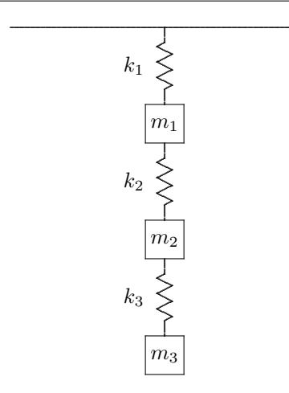
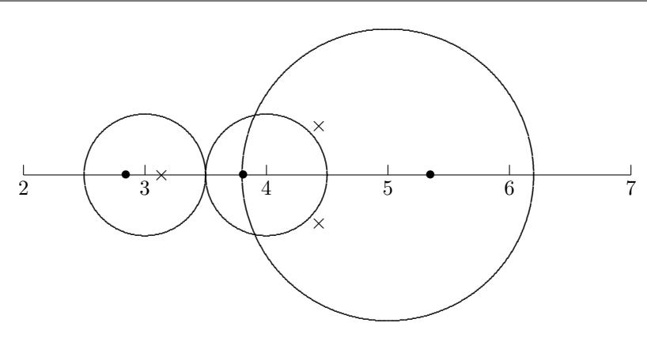
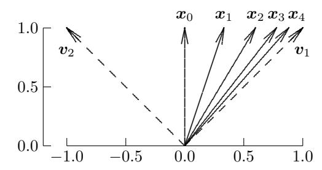
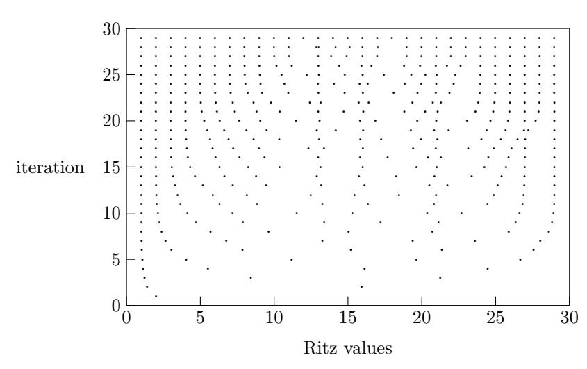

# Eigenvalue Problems

# 4.1 Eigenvalues and Eigenvectors

Linear transformations on a vector space can take many different forms: expanding or shrinking a vector by a scalar multiple, rotating a vector or reflecting it in a hyperplane, permuting the components of a vector, and so on. The effect of most linear transformations is a complicated mixture of these, but a special few are much simpler in their actions. In analyzing any problem characterized by a linear transformation, insight can be gained by breaking the transformation down into its simplest constituent actions so that its overall behavior can be readily understood. This approach enables a structural engineer, for example, to determine the stability of a structure, or a numerical analyst (as we will see later) to establish the convergence of an iterative algorithm. The key issue is what happens when a given linear transformation is applied repeatedly: do the results settle down into some steady state, or oscillate, or grow uncontrollably (i.e., blow up)? This question can be answered by resolving the transformation into a set of simple actions, specifically, expansion or contraction along certain directions.

A given direction in a vector space is determined by any nonzero vector pointing in that direction. Thus, given an n×n matrix A representing a linear transformation on an n-dimensional vector space, we wish to find a nonzero vector x and a scalar λ such that

$$\mathbf{A}\mathbf{x} = \lambda \mathbf{x}.$$

Such a scalar λ is called an eigenvalue, and x is a corresponding eigenvector . In addition to the right eigenvector just defined, we could also define a nonzero left eigenvector y such that y <sup>T</sup> A = λy T . A left eigenvector of A is a right eigenvector of A<sup>T</sup> , however, so for computational purposes we will consider only right eigenvectors (nevertheless, left eigenvectors will play an important role in the theory). The set of all the eigenvalues of a matrix A, denoted by λ(A), is called the spectrum of A. The maximum modulus of the eigenvalues, max{|λ| : λ ∈ λ(A)}, is called the spectral radius of A, denoted by ρ(A).

An eigenvector of a matrix determines a direction in which the effect of the matrix is particularly simple: the matrix expands or shrinks any vector lying in that direction by a scalar multiple, and the expansion or contraction factor is given by the corresponding eigenvalue λ. Thus, eigenvalues and eigenvectors provide a means of understanding the complicated behavior of a general linear transformation by decomposing it into simpler actions.

Eigenvalue problems occur in many areas of science and engineering. For example, the natural modes and frequencies of vibration of a structure are determined by the eigenvectors and eigenvalues, respectively, of an appropriate matrix. The stability of the structure is determined by the eigenvalues, and thus their computation is of critical interest. We will also see later in this book that eigenvalues are useful in analyzing numerical methods, for example, convergence analysis of iterative methods for solving systems of algebraic equations and stability analysis of methods for solving differential equations.

Example 4.1 Spring-Mass System. Consider the system of springs and masses shown in Fig. 4.1, with three masses m1, m2, and m<sup>3</sup> at vertical displacements y1, y2, and y3, connected by three springs having spring constants k1, k2, and k3. According to Newton's Second Law, the motion of the system is governed by the system of ordinary differential equations

$$My'' + Ky = 0,$$

where

$$\boldsymbol{M} = \begin{bmatrix} m_1 & 0 & 0 \\ 0 & m_2 & 0 \\ 0 & 0 & m_3 \end{bmatrix}$$

is called the mass matrix and

$$\mathbf{K} = \begin{bmatrix} k_1 + k_2 & -k_2 & 0\\ -k_2 & k_2 + k_3 & -k_3\\ 0 & -k_3 & k_3 \end{bmatrix}$$

is called the stiffness matrix . Such a system exhibits simple harmonic motion with natural frequency ω, i.e., the solution components are given by

$$y_k(t) = x_k e^{i\omega t},$$

where x<sup>k</sup> is the amplitude, k = 1, 2, or 3, and i = √ −1. To determine the frequency ω and mode of vibration (i.e., the amplitudes xk), we note that for each solution component,

$$y_k''(t) = -\omega^2 x_k e^{i\omega t}.$$

Substituting this relationship into the differential equation, we obtain the algebraic equation

$$Kx = \omega^2 Mx$$
,

or

$$Ax = \lambda x$$

where  $\mathbf{A} = \mathbf{M}^{-1}\mathbf{K}$  and  $\lambda = \omega^2$ . Thus, the natural frequencies and modes of vibration of the spring-mass system can be determined by solving the resulting eigenvalue problem (see Computer Problem 4.13).



Figure 4.1: Spring-mass system.

Although most of our examples will involve only real matrices, both the theory and computational procedures we will discuss in this chapter are generally applicable to matrices with complex entries as well. Notationally, the main difference in dealing with complex matrices is that the conjugate transpose, denoted by  $A^H$ , is used instead of the usual matrix transpose,  $A^T$  (recall the definitions of transpose and conjugate transpose from Section 2.5). For example, a left eigenvector corresponding to an eigenvalue  $\lambda$  of a complex matrix A is a nonzero vector y such that  $y^HA = \lambda y^H$ . It is important to note that even for real matrices we may be forced to deal with complex numbers, since the eigenvalues of a real matrix may be complex rather than real.

#### Example 4.2 Eigenvalues and Eigenvectors.

1. 
$$\mathbf{A} = \begin{bmatrix} 2 & 0 \\ 0 & 1 \end{bmatrix}$$
,  $\lambda_1 = 2$ ,  $\mathbf{x}_1 = \begin{bmatrix} 1 \\ 0 \end{bmatrix}$ ,  $\lambda_2 = 1$ ,  $\mathbf{x}_2 = \begin{bmatrix} 0 \\ 1 \end{bmatrix}$ .  
2.  $\mathbf{A} = \begin{bmatrix} 2 & 1 \\ 0 & 1 \end{bmatrix}$ ,  $\lambda_1 = 2$ ,  $\mathbf{x}_1 = \begin{bmatrix} 1 \\ 0 \end{bmatrix}$ ,  $\lambda_2 = 1$ ,  $\mathbf{x}_2 = \begin{bmatrix} -1 \\ 1 \end{bmatrix}$ .  
3.  $\mathbf{A} = \begin{bmatrix} 3 & 1 \\ 1 & 3 \end{bmatrix}$ ,  $\lambda_1 = 4$ ,  $\mathbf{x}_1 = \begin{bmatrix} 1 \\ 1 \end{bmatrix}$ ,  $\lambda_2 = 2$ ,  $\mathbf{x}_2 = \begin{bmatrix} -1 \\ 1 \end{bmatrix}$ .  
4.  $\mathbf{A} = \begin{bmatrix} 0 & 1 \\ -1 & 0 \end{bmatrix}$ ,  $\lambda_1 = i$ ,  $\mathbf{x}_1 = \begin{bmatrix} 1 \\ i \end{bmatrix}$ ,  $\lambda_2 = -i$ ,  $\mathbf{x}_2 = \begin{bmatrix} i \\ 1 \end{bmatrix}$ , where  $i = \sqrt{-1}$ .

For example matrix 1, which is diagonal, the eigenvalues are the diagonal entries, and the eigenvectors are the columns of the identity matrix I. For example matrix 2, which is triangular, the eigenvalues are still the diagonal entries, but the eigenvectors are now less obvious. For example matrix 3, which is symmetric, the eigenvalues are real. Example matrix 4 shows, however, that a nonsymmetric real matrix need not have real eigenvalues.

# 4.2 Existence and Uniqueness

### 4.2.1 Characteristic Polynomial

The equation  $\mathbf{A}\mathbf{x} = \lambda \mathbf{x}$  is equivalent to

$$(\boldsymbol{A} - \lambda \boldsymbol{I})\boldsymbol{x} = \boldsymbol{0}.$$

This homogeneous system of linear equations has a nonzero solution x if, and only if, its matrix is singular. Thus, the eigenvalues of A are the values of  $\lambda$  such that

$$\det(\boldsymbol{A} - \lambda \boldsymbol{I}) = 0.$$

Now  $\det(\mathbf{A} - \lambda \mathbf{I})$  is a polynomial of degree n in  $\lambda$ , called the *characteristic polynomial* of  $\mathbf{A}$ , and its roots are the eigenvalues of  $\mathbf{A}$ .

**Example 4.3 Characteristic Polynomial.** The characteristic polynomial of the third example matrix in Example 4.2 is

$$\det \begin{pmatrix} \begin{bmatrix} 3 & 1 \\ 1 & 3 \end{bmatrix} - \lambda \begin{bmatrix} 1 & 0 \\ 0 & 1 \end{bmatrix} \end{pmatrix} = \det \begin{pmatrix} \begin{bmatrix} 3 - \lambda & 1 \\ 1 & 3 - \lambda \end{bmatrix} \end{pmatrix}$$
$$= (3 - \lambda)(3 - \lambda) - (1)(1) = \lambda^2 - 6\lambda + 8 = 0.$$

From the quadratic formula, the roots of this polynomial are given by

$$\lambda = \frac{6 \pm \sqrt{36 - 32}}{2} = \frac{6 \pm 2}{2},$$

so the eigenvalues are  $\lambda_1 = 4$  and  $\lambda_2 = 2$ .

According to the Fundamental Theorem of Algebra, a polynomial

$$p(\lambda) = c_0 + c_1 \lambda + \dots + c_n \lambda^n$$

of positive degree n (i.e.,  $c_n \neq 0$ ), with real or complex coefficients  $c_k$ , always has a root  $\lambda_1$ , which may be complex even if the coefficients of the polynomial are real. The quotient  $p(\lambda)/(\lambda-\lambda_1)$  is a polynomial of degree one less, so it has a root  $\lambda_2$ . Repeating this process as long as the degree remains positive, we see that the original polynomial can be written as a product of linear factors,

$$p(\lambda) = c_n (\lambda - \lambda_1)(\lambda - \lambda_2) \cdots (\lambda - \lambda_n).$$

Thus,  $p(\lambda)$  has exactly n roots, counting multiplicities (i.e., the number of times each root appears in the expression of the polynomial as a product of linear factors). Because the eigenvalues of a matrix are the roots of its characteristic polynomial, which has degree n, we conclude that an  $n \times n$  matrix A always has n eigenvalues, but they may not be real and may not be distinct. The latter case simply means that more than one direction may have the same expansion or contraction factor. It is often convenient to number the eigenvalues from largest to smallest in magnitude, so that  $|\lambda_1| \geq |\lambda_2| \geq \cdots \geq |\lambda_n|$ . Although the eigenvalues of a real matrix are not necessarily real, complex eigenvalues of a real matrix must occur in complex conjugate pairs: if  $\lambda = \alpha + i\beta$ , where  $i = \sqrt{-1}$  and  $\beta \neq 0$ , is an eigenvalue of a real matrix, then so is  $\bar{\lambda} = \alpha - i\beta$  (see Exercise 4.9).

We have just seen that for any matrix there is an associated polynomial whose roots are the eigenvalues of the matrix. The reverse is also true: for any polynomial, there is an associated matrix whose eigenvalues are the roots of the polynomial. First, dividing a polynomial of positive degree n by the coefficient of its nth-degree term yields a monic polynomial of the form  $p(\lambda) = c_0 + c_1\lambda + \dots + c_{n-1}\lambda^{n-1} + \lambda^n$  having the same roots as the original polynomial. Then  $p(\lambda)$  is the characteristic polynomial of the  $n \times n$  companion matrix

$$C_n = \begin{bmatrix} 0 & 0 & \cdots & 0 & -c_0 \\ 1 & 0 & \cdots & 0 & -c_1 \\ 0 & 1 & \cdots & 0 & -c_2 \\ \vdots & \vdots & \ddots & \vdots & \vdots \\ 0 & 0 & \cdots & 1 & -c_{n-1} \end{bmatrix},$$

whose entries are the coefficients of the polynomial (with signs reversed) in the last column, ones on the subdiagonal, and zeros elsewhere; and thus the roots of  $p(\lambda)$  are the eigenvalues of  $C_n$ . Note that the correspondence between polynomials and matrices cannot be one-to-one, however, since a general matrix of order n depends on  $n^2$  parameters (its entries), whereas a polynomial of degree n depends on only n+1 parameters (its coefficients). Thus, distinct matrices can have the same characteristic polynomial.

We are now in a position to make an important theoretical observation about computing eigenvalues. Abel proved in 1824 that the roots of a polynomial of degree greater than four cannot always be expressed by a closed-form formula in the coefficients using ordinary arithmetic operations and root extractions. Thus, in general, computing the eigenvalues of matrices of order greater than four requires a (theoretically infinite) iterative process. Otherwise, if eigenvalues could always be computed in a finite number of steps, then we could compute the roots of any polynomial in a finite number of steps simply by computing the eigenvalues of its companion matrix, which would contradict Abel's theorem. Fortunately, as we will soon see, the best iterative algorithms for computing eigenvalues converge very rapidly, so that the number of iterations required to attain reasonable accuracy is usually quite small in practice.

Though it is extremely useful for theoretical purposes, the characteristic polynomial turns out not to be useful as a means of actually computing eigenvalues for matrices of nontrivial size. There are several reasons for this:

- Computing the coefficients of the characteristic polynomial for a given matrix is, in general, a substantial task (see Computer Problem 4.15).
- The coefficients of the characteristic polynomial can be highly sensitive to perturbations in the matrix, and hence their computation is unstable.
- Rounding error incurred in forming the characteristic polynomial can destroy the accuracy of the roots subsequently computed.
- Computing the roots of a polynomial of high degree is another substantial task (indeed, one of the better ways of computing the roots of a polynomial is to compute the eigenvalues of its companion matrix using the methods we will consider in this chapter; see Section 5.5.8).

Thus, the transformation

$$\operatorname{Matrix} \longrightarrow \operatorname{characteristic polynomial} \longrightarrow \operatorname{eigenvalues}$$

does not produce a significantly easier intermediate problem and in practice does not preserve the eigenvalues numerically, even though it preserves them in theory.

Example 4.4 Characteristic Polynomial. To illustrate one of the potential numerical difficulties associated with the characteristic polynomial, consider the matrix

$$\bm{A} = \begin{bmatrix} 1 & \epsilon \\ \epsilon & 1 \end{bmatrix},$$

where is a positive number slightly smaller than <sup>√</sup> mach in a given floating-point system. The exact eigenvalues of A are 1+ and 1−. Computing the characteristic polynomial of A in floating-point arithmetic, we obtain

$$\det(\mathbf{A} - \lambda \mathbf{I}) = \lambda^2 - 2\lambda + (1 - \epsilon^2) = \lambda^2 - 2\lambda + 1,$$

which has 1 as a double root. Thus, we cannot resolve the two eigenvalues by this method even though they are quite distinct in the working precision. We would need up to twice the precision in the coefficients of the characteristic polynomial to compute the eigenvalues to the same precision as that of the input matrix.

# 4.2.2 Multiplicity and Diagonalizability

The algebraic multiplicity of an eigenvalue is its multiplicity as a root of the characteristic polynomial. An eigenvalue of algebraic multiplicity 1 is said to be simple. The geometric multiplicity of an eigenvalue is the number of linearly independent eigenvectors corresponding to that eigenvalue. For example, 1 is an eigenvalue of both algebraic and geometric multiplicity n for the n × n identity matrix I. The geometric multiplicity of an eigenvalue cannot exceed the algebraic multiplicity, but it can be less than the algebraic multiplicity. An eigenvalue with the latter property is said to be defective. Similarly, an n × n matrix that has fewer than n linearly independent eigenvectors is said to be defective.

If an  $n \times n$  matrix  $\boldsymbol{A}$  is nondefective, then it has a full set of linearly independent eigenvectors  $\boldsymbol{x}_1, \ldots, \boldsymbol{x}_n$  corresponding to the eigenvalues  $\lambda_1, \ldots, \lambda_n$ . If we let  $\boldsymbol{D} = \operatorname{diag}(\lambda_1, \ldots, \lambda_n)$  and  $\boldsymbol{X} = [\boldsymbol{x}_1 \cdots \boldsymbol{x}_n]$ , then  $\boldsymbol{X}$  is nonsingular and we have

$$AX = XD$$

so that

$$X^{-1}AX = D,$$

and hence A is said to be diagonalizable. This is an example of a similarity transformation, which we will consider in detail in Section 4.4. In particular, if the eigenvalues of a matrix are all distinct, then the eigenvalues must all be simple, and the matrix is necessarily nondefective and hence diagonalizable.

### 4.2.3 Eigenspaces and Invariant Subspaces

Eigenvectors are not unique in that they can be scaled arbitrarily: if  $\mathbf{A}\mathbf{x} = \lambda \mathbf{x}$ , then for any scalar  $\gamma \neq 0$ ,  $\gamma \mathbf{x}$  is also an eigenvector corresponding to  $\lambda$ , since  $\mathbf{A}(\gamma \mathbf{x}) = \lambda(\gamma \mathbf{x})$ . For example, for the second matrix in Example 4.2,

$$\bm{A} = \begin{bmatrix} 2 & 1 \ 0 & 1 \end{bmatrix}, \qquad \gamma \, \bm{x}_2 = \gamma \begin{bmatrix} -1 \ 1 \end{bmatrix} = \begin{bmatrix} -\gamma \ \gamma \end{bmatrix}$$

is an eigenvector corresponding to the eigenvalue  $\lambda_2 = 1$  for any nonzero scalar  $\gamma$ . Consequently, eigenvectors are usually *normalized* by requiring some norm of the vector to be 1.

When viewed in this way, it becomes clear that the fundamental object of interest is not really any particular eigenvector, but rather the set  $S_{\lambda} = \{x : Ax = \lambda x\}$ , which contains the zero vector as well as all eigenvectors corresponding to an eigenvalue  $\lambda$ .  $S_{\lambda}$  is easily shown to be a subspace of  $\mathbb{R}^n$  (or  $\mathbb{C}^n$  in the complex case), called the *eigenspace* corresponding to the eigenvalue  $\lambda$  (see Exercise 4.21). Any particular eigenvector x can be regarded as representative of the corresponding eigenspace. Note that the dimension of the eigenspace  $S_{\lambda}$  can be greater than 1 if the associated eigenvalue  $\lambda$  has geometric multiplicity greater than 1.

For a given matrix A, a subspace S of  $\mathbb{R}^n$  (or  $\mathbb{C}^n$  in the complex case) is said to be an *invariant subspace* if  $AS \subseteq S$ , i.e., if  $x \in S$  implies  $Ax \in S$ . Note that an eigenspace is an invariant subspace. More generally, if  $x_1, \ldots, x_p$  are eigenvectors of A, then span( $[x_1 \cdots x_p]$ ) is an invariant subspace.

# 4.2.4 Properties of Matrices and Eigenvalue Problems

In preparation for further discussion of eigenvalue problems, we note here some relevant properties that an  $n \times n$  real or complex matrix  $\boldsymbol{A}$  may have, some of which we have already seen (see especially Section 2.5):

- Diagonal:  $a_{ij} = 0$  for  $i \neq j$
- Tridiagonal:  $a_{ij} = 0$  for |i j| > 1

- Triangular:  $a_{ij} = 0$  for i > j (upper triangular) or  $a_{ij} = 0$  for i < j (lower triangular)
- Hessenberg:  $a_{ij} = 0$  for i > j + 1 (upper Hessenberg) or  $a_{ij} = 0$  for i < j 1 (lower Hessenberg)
- Orthogonal:  $\mathbf{A}^T \mathbf{A} = \mathbf{A} \mathbf{A}^T = \mathbf{I}$
- Unitary:  $\mathbf{A}^H \mathbf{A} = \mathbf{A} \mathbf{A}^H = \mathbf{I}$
- Symmetric:  $\mathbf{A} = \mathbf{A}^T$
- Hermitian:  $\mathbf{A} = \mathbf{A}^H$ • Normal:  $\mathbf{A}^H \mathbf{A} = \mathbf{A} \mathbf{A}^H$

Note that some of these properties come in pairs, where one is relevant primarily for real matrices and the other is the appropriate analogue for complex matrices (e.g., symmetric/Hermitian, orthogonal/unitary). As we will see, the eigenvalues of diagonal and triangular matrices are simply their diagonal entries; tridiagonal and Hessenberg matrices are useful intermediate forms in computing eigenvalues; orthogonal and unitary matrices are useful in transforming general matrices into simpler forms; symmetric and Hermitian matrices have only real eigenvalues; and normal matrices always have a full set of orthonormal eigenvectors (i.e., they are unitarily diagonalizable).

**Example 4.5 Matrix Properties.** The following examples illustrate some matrix properties and operations that are relevant to eigenvalue problems:

$$\text{Transpose: } \begin{bmatrix} 1 & 2 \\ 3 & 4 \end{bmatrix}^T = \begin{bmatrix} 1 & 3 \\ 2 & 4 \end{bmatrix},$$
 
$$\text{Conjugate transpose: } \begin{bmatrix} 1+i & 1+2i \\ 2-i & 2-2i \end{bmatrix}^H = \begin{bmatrix} 1-i & 2+i \\ 1-2i & 2+2i \end{bmatrix},$$
 
$$\text{Symmetric: } \begin{bmatrix} 1 & 2 \\ 2 & 3 \end{bmatrix}, \quad \text{nonsymmetric: } \begin{bmatrix} 1 & 3 \\ 2 & 4 \end{bmatrix},$$
 
$$\text{Hermitian: } \begin{bmatrix} 1 & 1+i \\ 1-i & 2 \end{bmatrix}, \quad \text{nonHermitian: } \begin{bmatrix} 1 & 1+i \\ 1+i & 2 \end{bmatrix},$$
 
$$\text{Orthogonal: } \begin{bmatrix} 0 & 1 \\ 1 & 0 \end{bmatrix}, \quad \begin{bmatrix} -1 & 0 \\ 0 & -1 \end{bmatrix}, \quad \text{nonorthogonal: } \begin{bmatrix} 1 & 1 \\ 1 & 2 \end{bmatrix},$$
 
$$\text{Orthogonal: } \begin{bmatrix} \sqrt{2}/2 & \sqrt{2}/2 \\ -\sqrt{2}/2 & \sqrt{2}/2 \end{bmatrix}, \quad \text{unitary: } \begin{bmatrix} i\sqrt{2}/2 & \sqrt{2}/2 \\ -\sqrt{2}/2 & -i\sqrt{2}/2 \end{bmatrix},$$
 
$$\text{Normal: } \begin{bmatrix} 1 & 2 & 0 \\ 0 & 1 & 2 \\ 2 & 0 & 1 \end{bmatrix}, \quad \text{nonnormal: } \begin{bmatrix} 1 & 1 \\ 0 & 1 \end{bmatrix}.$$

Important questions whose answers materially affect the choice of algorithm and software for solving an eigenvalue problem include:

- Is the matrix real, or complex?
- Is the matrix relatively small and dense, or large and sparse?
- Does the matrix have any special properties, such as symmetry, or is it a general matrix?
- Are all of the eigenvalues needed, or only a few (for example, perhaps only the largest or smallest in magnitude)?
- Are only the eigenvalues needed, or are the corresponding eigenvectors required as well?

# 4.2.5 Localizing Eigenvalues

For some purposes, we may not need high accuracy in determining the eigenvalues of a matrix, but only relatively crude information about their location in the complex plane. For example, we might merely need to know that all of the eigenvalues lie within a given disk or half plane, or simply that none of them is zero (i.e., the matrix is nonsingular). The simplest such "localization" result is that if λ is an eigenvalue of A, then

$$|\lambda| \leq \|\boldsymbol{A}\|,$$

which holds for any matrix norm induced by a vector norm. Thus, the eigenvalues of A all lie in a disk in the complex plane of radius kAk centered at the origin. A sharper estimate is given by Gershgorin's Theorem, which says that the eigenvalues of an n × n matrix A are all contained within the union of n disks, with the kth disk centered at akk and having radius P j6=k |akj |. To see why this is true, let λ be any eigenvalue, with corresponding eigenvector x, normalized so that kxk<sup>∞</sup> = 1. Let x<sup>k</sup> be an entry of x such that |xk| = 1 (at least one component has magnitude 1, by definition of the ∞-norm). Because Ax = λx, we have

$$(\lambda - a_{kk})x_k = \sum_{j \neq k} a_{kj}x_j,$$

so that

$$|\lambda - a_{kk}| \le \sum_{j \ne k} |a_{kj}| \cdot |x_j| \le \sum_{j \ne k} |a_{kj}|.$$

Applying this theorem to A<sup>T</sup> shows that a similar result holds for disks defined by off-diagonal absolute column sums. In addition to being useful in its own right, a number of other useful results follow from Gershgorin's Theorem. For example, a strictly diagonally dominant matrix must be nonsingular, since zero cannot lie in any of its Gershgorin disks.

Example 4.6 Gershgorin Disks. The Gershgorin disks for the real matrix

$$\mathbf{A}_1 = \begin{bmatrix} 4.0 & -0.5 & 0.0 \\ 0.6 & 5.0 & -0.6 \\ 0.0 & 0.5 & 3.0 \end{bmatrix}$$

are plotted in the complex plane in Fig 4.2. The three eigenvalues of this matrix, indicated by × in the figure, lie within the union of the disks. Note that two of the eigenvalues are complex conjugates. The matrix

$$\mathbf{A}_2 = \begin{bmatrix} 4.0 & 0.5 & 0.0 \\ 0.6 & 5.0 & 0.6 \\ 0.0 & 0.5 & 3.0 \end{bmatrix}$$

has the same Gershgorin disks, but all three of its eigenvalues, indicated by • in the figure, are real and hence lie on the real axis of the complex plane.



Figure 4.2: Gershgorin disks and eigenvalues for example matrices.

# 4.3 Sensitivity and Conditioning

The conditioning of an eigenvalue problem measures the sensitivity of the eigenvalues and eigenvectors to small changes in the matrix. As we will see, the condition number of a matrix eigenvalue problem is *not* the condition number of the same matrix with respect to solving linear equations. Moreover, different eigenvalues or eigenvectors of a given matrix are not necessarily equally sensitive to perturbations in the matrix.

Suppose that the  $n \times n$  matrix A, with eigenvalues  $\lambda_1, \ldots, \lambda_n$ , is nondefective, so that it has a full set of n linearly independent eigenvectors,  $\boldsymbol{x}_1, \ldots, \boldsymbol{x}_n$ , which form the columns of a nonsingular matrix  $\boldsymbol{X} = [\boldsymbol{x}_1 \cdots \boldsymbol{x}_n]$  such that  $\boldsymbol{X}^{-1}A\boldsymbol{X} = \boldsymbol{D} = \operatorname{diag}(\lambda_1, \ldots, \lambda_n)$  (i.e.,  $\boldsymbol{A}$  is diagonalizable; see Section 4.2.2). Let  $\boldsymbol{\mu}$  be an eigenvalue of the perturbed matrix  $\boldsymbol{A} + \boldsymbol{E}$ , and let  $\boldsymbol{F} = \boldsymbol{X}^{-1}\boldsymbol{E}\boldsymbol{X}$ . Then

$$X^{-1}(A+E)X = X^{-1}AX + X^{-1}EX = D + F,$$

so that A + E and D + F are similar and hence have the same eigenvalues (see Section 4.4). Thus, there is an eigenvector v such that  $(D + F)v = \mu v$ , which can be rewritten

$$\boldsymbol{v} = (\mu \boldsymbol{I} - \boldsymbol{D})^{-1} \boldsymbol{F} \boldsymbol{v},$$

provided µ is not an eigenvalue of D (and hence of A, in which case the eigenvalue is unperturbed), so that µI − D is nonsingular. Taking norms, we have

$$\|\boldsymbol{v}\|_{2} \leq \|(\mu \boldsymbol{I} - \boldsymbol{D})^{-1}\|_{2} \cdot \|\boldsymbol{F}\|_{2} \cdot \|\boldsymbol{v}\|_{2},$$

which, after dividing both sides by kvk<sup>2</sup> and k(µI − D) <sup>−</sup><sup>1</sup>k2, yields

$$\|(\mu \mathbf{I} - \mathbf{D})^{-1}\|_2^{-1} \le \|\mathbf{F}\|_2.$$

Because (µI − D) −1 is diagonal, k(µI − D) <sup>−</sup><sup>1</sup>k<sup>2</sup> = 1/|µ − λk|, where λ<sup>k</sup> is the eigenvalue of D (and hence of A) closest to µ. Thus, we have the bound

$$|\mu - \lambda_k| = \|(\mu \mathbf{I} - \mathbf{D})^{-1}\|_2^{-1}$$

$$\leq \|\mathbf{F}\|_2 = \|\mathbf{X}^{-1}\mathbf{E}\mathbf{X}\|_2$$

$$\leq \|\mathbf{X}^{-1}\|_2 \cdot \|\mathbf{E}\|_2 \cdot \|\mathbf{X}\|_2$$

$$= \operatorname{cond}_2(\mathbf{X}) \|\mathbf{E}\|_2,$$

i.e., a perturbation of size kEk<sup>2</sup> to A changes each of its eigenvalues by at most cond2(X) times as much, where X is the matrix of eigenvectors. This result, due to Bauer and Fike, says that the absolute condition number of the eigenvalues of a matrix is given by the condition number of its matrix of eigenvectors with respect to solving linear equations (there is no point in using a relative condition number here because the eigenvalues already reflect the scale of the matrix). We can conclude that the eigenvalues may be sensitive if the eigenvectors are nearly linearly dependent (i.e., the matrix is nearly defective), but are insensitive if the eigenvectors are far from being linearly dependent. In particular, if A is a normal matrix (i.e., A<sup>H</sup>A = AA<sup>H</sup>), then the eigenvectors can be chosen to be orthonormal (see Section 4.4), so that cond2(X) = 1. Thus, the eigenvalues of normal matrices, which includes all real symmetric and complex Hermitian matrices, are always wellconditioned.

The result just derived is applicable only if the matrix is nondefective. Moreover, the bound it provides depends on all of the eigenvectors, and hence may significantly overestimate the sensitivities of some of the eigenvalues, which can vary substantially. Thus, we now consider the sensitivity of an individual eigenvalue of a (possibly defective) matrix A. Let x and y be right and left eigenvectors, respectively, corresponding to a simple eigenvalue λ of A, and consider the perturbed eigenvalue problem

$$(\mathbf{A} + \mathbf{E})(\mathbf{x} + \Delta \mathbf{x}) = (\lambda + \Delta \lambda)(\mathbf{x} + \Delta \mathbf{x}).$$

Expanding both sides, dropping second-order terms (i.e., products of small perturbations, such as E∆x), and using the fact that Ax = λx, we obtain the approximation

$$A\Delta x + Ex \approx \Delta \lambda x + \lambda \Delta x$$
.

Premultiplying both sides by y <sup>H</sup>, we obtain

$$\mathbf{y}^H \mathbf{A} \Delta \mathbf{x} + \mathbf{y}^H \mathbf{E} \mathbf{x} \approx \Delta \lambda \, \mathbf{y}^H \mathbf{x} + \lambda \mathbf{y}^H \Delta \mathbf{x}.$$

Because y is a left eigenvector, y <sup>H</sup>A = λy <sup>H</sup>, and using this fact yields

$$\mathbf{y}^H \mathbf{E} \mathbf{x} \approx \Delta \lambda \, \mathbf{y}^H \mathbf{x}.$$

By assumption λ is a simple eigenvalue, so y <sup>H</sup>x 6= 0 (see Exercise 4.20) and hence we can divide by y <sup>H</sup>x to obtain

$$\Delta \lambda \approx \frac{\boldsymbol{y}^H \boldsymbol{E} \boldsymbol{x}}{\boldsymbol{y}^H \boldsymbol{x}},$$

which, upon taking norms yields the bound

$$|\Delta \lambda| \lesssim \frac{\|\boldsymbol{y}\|_2 \cdot \|\boldsymbol{x}\|_2}{|\boldsymbol{y}^H \boldsymbol{x}|} \|\boldsymbol{E}\|_2 = \frac{1}{\cos(\theta)} \|\boldsymbol{E}\|_2,$$

where θ is the angle between x and y. Thus, the absolute condition number of a simple eigenvalue is given by the reciprocal of the cosine of the angle between its corresponding right and left eigenvectors. We can conclude that a simple eigenvalue is sensitive if its right and left eigenvectors are nearly orthogonal, so that cos(θ) ≈ 0, but is insensitive if the angle between its right and left eigenvectors is small, so that cos(θ) ≈ 1. In particular, the eigenvalues of real symmetric and complex Hermitian matrices are always well-conditioned, since the right and left eigenvectors are the same, so that cos(θ) = 1.

The sensitivity of a multiple eigenvalue is much more complicated to analyze, and we will not pursue it here. We can get a hint of what can go wrong, however, from the fact that the right and left eigenvectors for a multiple eigenvalue can be orthogonal, so that the denominator of the condition number we derived in the simple case goes to zero, and hence the condition number becomes arbitrarily large. Suffice it to say that multiple or close eigenvalues can be poorly conditioned, especially if the matrix is defective. The sensitivity of eigenvectors is also relatively complicated to analyze, as the sensitivity of an eigenvector depends on both the sensitivity of the corresponding eigenvalue and the distance between that eigenvalue and the other eigenvalues. If a matrix has well-conditioned and well-separated eigenvalues, then its eigenvectors will also be well-conditioned, but if the eigenvalues are ill-conditioned or closely clustered, then the eigenvectors may be poorly conditioned. Balancing—rescaling by a diagonal similarity transformation—can improve the conditioning of an eigenvalue problem, and many software packages for eigenvalue problems offer such an option.

#### Example 4.7 Eigenvalue Sensitivity. Consider the matrix

$$\mathbf{A} = \begin{bmatrix} -149 & -50 & -154 \\ 537 & 180 & 546 \\ -27 & -9 & -25 \end{bmatrix},$$

whose eigenvalues are λ<sup>1</sup> = 1, λ<sup>2</sup> = 2, and λ<sup>3</sup> = 3. Because A has distinct eigenvalues, it is necessarily nondefective and hence diagonalizable, but A is not normal (i.e., A<sup>T</sup> A 6= AA<sup>T</sup> ). The right and left eigenvectors of A, respectively, normalized to have 2-norm 1, are given by the columns of the matrices

$$\boldsymbol{X} = \begin{bmatrix} 0.316 & 0.404 & 0.139 \\ -0.949 & -0.909 & -0.974 \\ 0.000 & -0.101 & 0.179 \end{bmatrix} \quad \text{and} \quad \boldsymbol{Y} = \begin{bmatrix} 0.681 & -0.676 & -0.688 \\ 0.225 & -0.225 & -0.229 \\ 0.697 & -0.701 & -0.688 \end{bmatrix}.$$

The overall condition number for the eigenvalues is given by cond2(X) = 1289, so we would expect the eigenvalues to be sensitive to perturbations in the matrix A. Moreover, since

$$y_1^T x_1 = 0.0017$$
,  $y_2^T x_2 = 0.0025$ , and  $y_3^T x_3 = 0.0046$ ,

we see that the right and left eigenvectors corresponding to each eigenvalue are almost orthogonal, again suggesting that the eigenvalues are ill-conditioned. To demonstrate this sensitivity, the eigenvalues of the same matrix except with the a<sup>22</sup> entry changed to 180.01 are λ<sup>1</sup> = 0.207, λ<sup>2</sup> = 2.301, and λ<sup>3</sup> = 3.502, which differ substantially from the original eigenvalues, considering the tiny perturbation made in a single entry of A. The eigenvalues of the same matrix except with the a<sup>22</sup> entry changed to 179.99 are λ<sup>1</sup> = 1.664 + 1.054i, λ<sup>2</sup> = 1.664 − 1.054i, and λ<sup>3</sup> = 2.662, so that a similarly tiny perturbation has caused two well-separated real eigenvalues of the original matrix to become a complex conjugate pair.

# 4.4 Problem Transformations

Many numerical methods for computing eigenvalues and eigenvectors are based on reducing the original matrix to a simpler form whose eigenvalues and eigenvectors are easily determined. Thus, we need to identify what types of transformations leave eigenvalues either unchanged or easily recoverable, and for what types of matrices the eigenvalues are easily determined.

Shift. A shift subtracts a constant scalar from each diagonal entry of a matrix, effectively shifting the origin of the real line or complex plane. If Ax = λx and σ is any scalar, then (A − σI)x = (λ − σ)x. Thus, the eigenvalues of the matrix A − σI are translated, or shifted, from those of A by σ, but the eigenvectors are unaffected.

Inversion. If A is nonsingular and Ax = λx with x 6= 0, then λ is necessarily nonzero, and A<sup>−</sup><sup>1</sup>x = (1/λ)x. Thus, the eigenvalues of A<sup>−</sup><sup>1</sup> are the reciprocals of the eigenvalues of A, and the eigenvectors of the two matrices are the same.

Powers. If Ax = λx, then A<sup>2</sup>x = λ <sup>2</sup>x. Thus, squaring a matrix squares its eigenvalues, but the eigenvectors are unchanged. More generally, if k is any positive integer, then A<sup>k</sup>x = λ <sup>k</sup>x. Thus, taking the kth power of a matrix also takes the kth power of its eigenvalues, and again the eigenvectors remain unchanged.

Polynomials. More generally still, if

$$p(t) = c_0 + c_1 t + c_2 t^2 + \dots + c_k t^k$$

is any polynomial of degree k, then we can define

$$p(\mathbf{A}) = c_0 \mathbf{I} + c_1 \mathbf{A} + c_2 \mathbf{A}^2 + \dots + c_k \mathbf{A}^k.$$

Now if  $Ax = \lambda x$ , then  $p(A)x = p(\lambda)x$ . Thus, the eigenvalues of a polynomial in a matrix A are given by the same polynomial evaluated at the eigenvalues of A, and the corresponding eigenvectors of p(A) are the same as those of A.

Similarity. The transformations we have considered thus far alter the eigenvalues of a matrix in a systematic way but leave the eigenvectors unchanged. We next consider a general type of transformation that leaves the eigenvalues unchanged, but transforms the eigenvectors in a systematic way. A matrix  $\boldsymbol{B}$  is similar to a matrix  $\boldsymbol{A}$  if there is a nonsingular matrix  $\boldsymbol{T}$  such that

$$\boldsymbol{B} = \boldsymbol{T}^{-1} \boldsymbol{A} \boldsymbol{T}.$$

Then

$$\boldsymbol{B}\boldsymbol{y}=\lambda\boldsymbol{y}\quad\Rightarrow\quad\boldsymbol{T}^{-1}\boldsymbol{A}\boldsymbol{T}\boldsymbol{y}\quad\Rightarrow\quad\boldsymbol{A}\boldsymbol{T}\boldsymbol{y}=\lambda\boldsymbol{T}\boldsymbol{y},$$

so that A and B have the same eigenvalues, and if y is an eigenvector of B, then x = Ty is an eigenvector of A. Thus, similarity transformations preserve eigenvalues, and, although they do not preserve eigenvectors, the eigenvectors are still easily recoverable. Note that the converse is not true: two matrices that are similar must have the same eigenvalues, but two matrices that have the same eigenvalues are not necessarily similar (see Example 4.9).

**Example 4.8 Similarity Transformation.** From the eigenvalues and eigenvectors of the third example matrix in Example 4.2, we see that

$$\bm{AT} = \begin{bmatrix} 3 & 1 \\ 1 & 3 \end{bmatrix} \begin{bmatrix} 1 & -1 \\ 1 & 1 \end{bmatrix} = \begin{bmatrix} 1 & -1 \\ 1 & 1 \end{bmatrix} \begin{bmatrix} 4 & 0 \\ 0 & 2 \end{bmatrix} = \bm{TD},$$

where  $\mathbf{D} = \operatorname{diag}(\lambda_1, \lambda_2)$ , and hence

$$\boldsymbol{T}^{-1}\boldsymbol{A}\boldsymbol{T} = \begin{bmatrix} 0.5 & 0.5 \\ -0.5 & 0.5 \end{bmatrix} \begin{bmatrix} 3 & 1 \\ 1 & 3 \end{bmatrix} \begin{bmatrix} 1 & -1 \\ 1 & 1 \end{bmatrix} = \begin{bmatrix} 4 & 0 \\ 0 & 2 \end{bmatrix} = \boldsymbol{D},$$

so that the original matrix A is similar to the diagonal matrix D, and the eigenvectors of A form the columns of the transformation matrix T.

The definition of a similarity transformation requires only that the transformation matrix T be nonsingular, but it could be arbitrarily ill-conditioned (i.e., nearly singular). Thus, whenever possible, orthogonal or unitary similarity transformations are strongly preferred for numerical computations so that the transformation matrix is perfectly well-conditioned.

# 4.4.1 Diagonal, Triangular, and Block Triangular Forms

We next need to establish suitable targets in transforming eigenvalue problems so that they are more easily solved. If  $\boldsymbol{A}$  is diagonal and  $\lambda$  is equal to any of its diagonal entries, then the diagonal matrix  $\boldsymbol{A} - \lambda \boldsymbol{I}$  necessarily has a zero diagonal entry

and hence is singular. Thus, the eigenvalues of a diagonal matrix are its diagonal entries, and the eigenvectors are the corresponding columns of the identity matrix I. Diagonal form is therefore a desirable target in simplifying an eigenvalue problem for a general matrix by a similarity transformation. This form can often be achieved, for example when all the eigenvalues are distinct, but unfortunately, some matrices cannot be transformed into diagonal form by a similarity transformation. The closest we can come, in general, is  $Jordan\ form$ , in which the matrix is reduced nearly to diagonal form but may yet have a few nonzero entries on the first superdiagonal, corresponding to one or more multiple eigenvalues. The Jordan form is not useful for numerical computation, however, because it is not a continuous function of the matrix entries, and it cannot be computed stably, in general.

#### Example 4.9 Nondiagonalizable Matrix. The matrix

$$\boldsymbol{A} = \begin{bmatrix} 1 & 1 \\ 0 & 1 \end{bmatrix},$$

which is already in Jordan form, cannot be diagonalized by any similarity transformation. The problem is that the matrix is defective: the eigenvalue 1 has multiplicity two, but there is only one linearly independent corresponding eigenvector. To see this, note that if

$$\begin{bmatrix} 1 & 1 \\ 0 & 1 \end{bmatrix} \begin{bmatrix} x_1 \\ x_2 \end{bmatrix} = 1 \begin{bmatrix} x_1 \\ x_2 \end{bmatrix},$$

then  $x_1 + x_2 = x_1$ , so that  $x_2 = 0$ , and hence every eigenvector is a multiple of  $e_1 = \begin{bmatrix} 1 & 0 \end{bmatrix}^T$ . Thus, there is no  $2 \times 2$  nonsingular matrix of linearly independent eigenvectors with which to diagonalize  $\boldsymbol{A}$  by a similarity transformation. In particular, this shows that  $\boldsymbol{A}$  is *not* similar to the  $2 \times 2$  identity matrix even though they have the same eigenvalues.

Fortunately, every matrix can be transformed into triangular form—called Schur form in this context—by a similarity transformation (in fact, by a unitary similarity transformation), and the eigenvalues of a triangular matrix are also the diagonal entries, for  $A - \lambda I$  must have a zero on its diagonal if A is triangular and  $\lambda$  is any diagonal entry of A. The eigenvectors of a triangular matrix are not quite so obvious but are still straightforward to compute. If

$$\boldsymbol{A} - \lambda \boldsymbol{I} = \begin{bmatrix} \boldsymbol{U}_{11} & \boldsymbol{u} & \boldsymbol{U}_{13} \ \boldsymbol{0} & \boldsymbol{0} & \boldsymbol{v}^T \ \boldsymbol{O} & \boldsymbol{0} & \boldsymbol{U}_{33} \end{bmatrix}$$

is triangular, then the system  $U_{11}y = u$  can be solved for y, so that

$$\boldsymbol{x} = \begin{bmatrix} \boldsymbol{y} \ -1 \ \boldsymbol{0} \end{bmatrix}$$

is an eigenvector. (We have assumed here that  $U_{11}$  is nonsingular, which means that we are working with the *first* occurrence of  $\lambda$  on the diagonal.)

For any matrix, the triangular Schur form is always attainable by a unitary similarity transformation, but the Schur form of a real matrix will have complex entries if the matrix has any complex eigenvalues. An alternative with only real entries is real Schur form, which is block triangular with  $1\times 1$  and  $2\times 2$  diagonal blocks corresponding to real eigenvalues and complex conjugate pairs of eigenvalues, respectively, and is attainable by an orthogonal similarity transformation.

Real Schur form is an example of the more general block triangular form

$$\bm{A} = \begin{bmatrix} \bm{A}_{11} & \bm{A}_{12} & \cdots & \bm{A}_{1p} \ & \bm{A}_{22} & \cdots & \bm{A}_{2p} \ & & \ddots & \vdots \ & & \bm{A}_{pp} \end{bmatrix},$$

where each diagonal block is *square* and all subdiagonal blocks are zero. The determinant of a matrix of this form is the product of the determinants of the diagonal blocks, so its spectrum is the union of the spectra of the diagonal blocks, i.e.,  $\lambda(A) = \bigcup_{j=1}^p \lambda(A_{jj})$ . Moreover, the eigenvectors of A are easily recoverable from those of the diagonal blocks (see Exercise 4.22). Thus, the eigenvalue problem for a matrix in block triangular form breaks into smaller subproblems that can be solved more easily, and many algorithms for computing eigenvalues exploit this feature. If a matrix A can be symmetrically permuted into block triangular form with at least two blocks, i.e., there is a permutation matrix P such that

$$\bm{P}\bm{A}\bm{P}^T = \left[\begin{array}{cc} \bm{A}_{11} & \bm{A}_{12} \ \bm{O} & \bm{A}_{22} \end{array}\right],$$

then A is said to be reducible.

One way of transforming a given  $n \times n$  matrix  $\boldsymbol{A}$  into block triangular form is by finding an invariant subspace  $\mathcal{S}$  such that  $\boldsymbol{A}\mathcal{S} \subseteq \mathcal{S}$  (see Section 4.2.3). If  $\boldsymbol{X}_1$  is an  $n \times p$  matrix whose columns are a basis for such an invariant subspace  $\mathcal{S}$ , then by definition each column of  $\boldsymbol{A}\boldsymbol{X}_1$  is a linear combination of the columns of  $\boldsymbol{X}_1$ , and hence there is a  $p \times p$  matrix  $\boldsymbol{B}_{11}$  such that  $\boldsymbol{A}\boldsymbol{X}_1 = \boldsymbol{X}_1\boldsymbol{B}_{11}$ . Now let  $\boldsymbol{X}_2$  be an  $n \times (n-p)$  matrix whose columns are a basis for the complementary subspace, so that the matrix  $\boldsymbol{X} = [\boldsymbol{X}_1 \ \boldsymbol{X}_2]$  is nonsingular, and write its inverse in partitioned form

$$\boldsymbol{X}^{-1} = \begin{bmatrix} \boldsymbol{Y}_1 \\ \boldsymbol{Y}_2 \end{bmatrix},$$

so that

$$\begin{aligned} \boldsymbol{I}_n &= \boldsymbol{X}^{-1} \boldsymbol{X} &= \begin{bmatrix} \boldsymbol{Y}_1 \ \boldsymbol{Y}_2 \end{bmatrix} \begin{bmatrix} \boldsymbol{X}_1 & \boldsymbol{X}_2 \end{bmatrix} &= \begin{bmatrix} \boldsymbol{I}_p & \boldsymbol{O} \ \boldsymbol{O} & \boldsymbol{I}_{n-p} \end{bmatrix}. \end{aligned}$$

Then

$$\begin{aligned} \boldsymbol{X}^{-1}\boldsymbol{A}\boldsymbol{X} &= \begin{bmatrix} \boldsymbol{Y}_1 \\ \boldsymbol{Y}_2 \end{bmatrix} \boldsymbol{A} \begin{bmatrix} \boldsymbol{X}_1 & \boldsymbol{X}_2 \end{bmatrix} = \begin{bmatrix} \boldsymbol{Y}_1\boldsymbol{A}\boldsymbol{X}_1 & \boldsymbol{Y}_1\boldsymbol{A}\boldsymbol{X}_2 \\ \boldsymbol{Y}_2\boldsymbol{A}\boldsymbol{X}_1 & \boldsymbol{Y}_2\boldsymbol{A}\boldsymbol{X}_2 \end{bmatrix} \\ &= \begin{bmatrix} \boldsymbol{Y}_1\boldsymbol{X}_1\boldsymbol{B}_{11} & \boldsymbol{Y}_1\boldsymbol{A}\boldsymbol{X}_2 \\ \boldsymbol{Y}_2\boldsymbol{X}_1\boldsymbol{B}_{11} & \boldsymbol{Y}_2\boldsymbol{A}\boldsymbol{X}_2 \end{bmatrix} = \begin{bmatrix} \boldsymbol{B}_{11} & \boldsymbol{B}_{12} \\ \boldsymbol{O} & \boldsymbol{B}_{22} \end{bmatrix}, \end{aligned}$$

which is block triangular.

The simplest form attainable by a similarity transformation, as well as the type of similarity transformation required, depends on the properties of the given matrix. The simpler diagonal form is obviously preferred whenever possible, and, for both theoretical and numerical reasons, orthogonal or unitary similarity transformations are also preferred whenever possible. Unfortunately, not all matrices are unitarily diagonalizable, and some matrices, as Example 4.9 shows, are not diagonalizable at all. Table 4.1 indicates what form is attainable for a given type of matrix and a given type of similarity transformation. Given a matrix A with one of the properties indicated, there exist matrices B and T having the indicated properties such that B = T <sup>−</sup><sup>1</sup>AT . In the first four cases, where B is diagonal, the columns of T are the eigenvectors of A. In all cases, the diagonal entries of B are the eigenvalues, except for real Schur form, where complex eigenvalues occur in conjugate pairs corresponding to the 2×2 diagonal blocks of B. Note that the eigenvalues of a real symmetric or complex Hermitian matrix are always real (see Exercise 4.10).

| A                    | T           | B                                  |
|----------------------|-------------|------------------------------------|
| Distinct eigenvalues | Nonsingular | Diagonal                           |
| Real symmetric       | Orthogonal  | Real diagonal                      |
| Complex Hermitian    | Unitary     | Real diagonal                      |
| Normal               | Unitary     | Diagonal                           |
| Arbitrary real       | Orthogonal  | Real block triangular (real Schur) |
| Arbitrary            | Unitary     | Triangular (Schur)                 |
| Arbitrary            | Nonsingular | Almost diagonal (Jordan)           |

Table 4.1: Forms attainable by similarity transformation for various types of matrices

# 4.5 Computing Eigenvalues and Eigenvectors

#### 4.5.1 Power Iteration

A simple method for computing a single eigenvalue and corresponding eigenvector of an n×n matrix A is Algorithm 4.1, known as power iteration, which multiplies an arbitrary nonzero vector repeatedly by the matrix, in effect multiplying the initial starting vector by successively higher powers of the matrix.

```
Algorithm 4.1 Power Iteration
   x0 = arbitrary nonzero vector
   for k = 1, 2, . . .
       xk = Axk−1
   end
                                           { generate next vector }
```

Assuming that A has a unique eigenvalue λ<sup>1</sup> of maximum modulus, with corresponding eigenvector v1, power iteration converges to a multiple of v1. To see why, assume we can express the starting vector x<sup>0</sup> as a linear combination, x<sup>0</sup> = P<sup>n</sup> <sup>j</sup>=1 αjv<sup>j</sup> , where the v<sup>j</sup> are eigenvectors of A. We then have

$$\mathbf{x}_{k} = \mathbf{A}\mathbf{x}_{k-1} = \mathbf{A}^{2}\mathbf{x}_{k-2} = \cdots = \mathbf{A}^{k}\mathbf{x}_{0}$$

$$= \mathbf{A}^{k}\sum_{j=1}^{n}\alpha_{j}\mathbf{v}_{j} = \sum_{j=1}^{n}\alpha_{j}\mathbf{A}^{k}\mathbf{v}_{j} = \sum_{j=1}^{n}\lambda_{j}^{k}\alpha_{j}\mathbf{v}_{j}$$

$$= \lambda_{1}^{k}\left(\alpha_{1}\mathbf{v}_{1} + \sum_{j=2}^{n}(\lambda_{j}/\lambda_{1})^{k}\alpha_{j}\mathbf{v}_{j}\right).$$

For j > 1, |λj/λ1| < 1, so that (λj/λ1) <sup>k</sup> → 0, leaving only the term corresponding to v<sup>1</sup> nonvanishing.

Example 4.10 Power Iteration. In the sequence of vectors produced by power iteration, the ratio of the values of a given component of x<sup>k</sup> from one iteration to the next converges to the dominant eigenvalue λ1. If we apply power iteration to the third example matrix in Example 4.2,

$$\boldsymbol{A} = \begin{bmatrix} 3 & 1 \\ 1 & 3 \end{bmatrix},$$

with starting vector

$$x_0 = \begin{bmatrix} 0 \\ 1 \end{bmatrix}$$

then we obtain the following sequence.

| k | T<br>x<br>k | Ratio  |       |
|---|-------------|--------|-------|
| 0 | 0           | 1      |       |
| 1 | 1           | 3      | 3.000 |
| 2 | 6           | 10     | 3.333 |
| 3 | 28          | 36     | 3.600 |
| 4 | 120         | 136    | 3.778 |
| 5 | 496         | 528    | 3.882 |
| 6 | 2016        | 2080   | 3.939 |
| 7 | 8128        | 8256   | 3.969 |
| 8 | 32640       | 32896  | 3.984 |
| 9 | 130816      | 131328 | 3.992 |

The sequence of vectors x<sup>k</sup> is converging to a multiple of the eigenvector [ 1 1 ]<sup>T</sup> . In addition, the table shows the ratio of the values of a given nonzero component of x<sup>k</sup> from one iteration to the next, which is converging to the dominant eigenvalue, λ<sup>1</sup> = 4.

Power iteration usually works in practice, but it can fail for a number of reasons:

• The starting vector x<sup>0</sup> may have no component in the dominant eigenvector v<sup>1</sup> (i.e., α<sup>1</sup> = 0). This possibility is extremely unlikely if x<sup>0</sup> is chosen randomly, and in any case it is not a problem in practice because rounding error usually introduces such a component.

- There may be more than one eigenvalue having the same (maximum) modulus, in which case the iteration may converge to a vector that is a linear combination of the corresponding eigenvectors. This possibility cannot be discounted in practice; for example, the dominant eigenvalue(s) of a real matrix may be a complex conjugate pair, which of course have the same modulus.
- For a real matrix and real starting vector, the iteration cannot converge to a complex vector.

Geometric growth of the components at each iteration risks eventual overflow (or underflow if the dominant eigenvalue is less than 1 in magnitude), so in practice the approximate eigenvector is rescaled at each iteration to have norm 1, typically using the ∞-norm, yielding Algorithm 4.2. With this normalization, x<sup>k</sup> → v1/kv1k∞, and kykk<sup>∞</sup> → |λ1|.

#### Algorithm 4.2 Normalized Power Iteration

```
x0 = arbitrary nonzero vector
for k = 1, 2, . . .
    yk = Axk−1
    xk = yk/kykk∞
end
                                       { generate next vector }
                                       { normalize }
```

Example 4.11 Normalized Power Iteration. Repeating Example 4.10 with this normalized scheme, we obtain the following sequence:

| k | T<br>x<br>k |     | kykk∞ |
|---|-------------|-----|-------|
| 0 | 0.000       | 1.0 |       |
| 1 | 0.333       | 1.0 | 3.000 |
| 2 | 0.600       | 1.0 | 3.333 |
| 3 | 0.778       | 1.0 | 3.600 |
| 4 | 0.882       | 1.0 | 3.778 |
| 5 | 0.939       | 1.0 | 3.882 |
| 6 | 0.969       | 1.0 | 3.939 |
| 7 | 0.984       | 1.0 | 3.969 |
| 8 | 0.992       | 1.0 | 3.984 |
| 9 | 0.996       | 1.0 | 3.992 |

The eigenvalue approximations have not changed, but now the approximate eigenvector is normalized at each iteration, thereby avoiding geometric growth or decay of its components. The behavior of normalized power iteration is depicted graphically in Fig. 4.3. The eigenvectors of the example matrix are shown by dashed arrows. The initial vector

$$\boldsymbol{x}_0 = \begin{bmatrix} 0 \\ 1 \end{bmatrix} = 1/2 \begin{bmatrix} 1 \\ 1 \end{bmatrix} + 1/2 \begin{bmatrix} -1 \\ 1 \end{bmatrix} = \alpha_1 \boldsymbol{v}_1 + \alpha_2 \boldsymbol{v}_2$$

contains equal components in the two eigenvectors. Repeated multiplication by the matrix A causes the component in v<sup>1</sup> (the eigenvector corresponding to the larger



Figure 4.3: Geometric interpretation of power iteration.

eigenvalue,  $\lambda_1 = 4$ ) to dominate as the other component decays like  $(\lambda_2/\lambda_1)^k = (1/2)^k$ , and hence the sequence of approximate eigenvectors converges to  $v_1$ .

The convergence rate of power iteration depends on the ratio  $|\lambda_2/\lambda_1|$ , where  $\lambda_2$  is the eigenvalue having second-largest modulus: the smaller this ratio, the faster the convergence. (In the terminology and notation of Section 5.4, the convergence rate of power iteration is *linear*, with rate r=1 and constant  $C=|\lambda_2/\lambda_1|$ .) It may be possible to choose a shift  $\sigma$  (see Section 4.4) such that this ratio is more favorable for the shifted matrix  $A - \sigma I$ , i.e.,

$$\left| \frac{\lambda_2 - \sigma}{\lambda_1 - \sigma} \right| < \left| \frac{\lambda_2}{\lambda_1} \right|,$$

and thus convergence is accelerated. Of course, the shift must then be added to the result to obtain the eigenvalue of the original matrix. In Example 4.11, for instance, if we use a shift of  $\sigma=1$  (which is equal to the other eigenvalue), then the ratio becomes zero and the method converges in a single iteration, though we would not usually be able to make such a fortuitous choice in practice. In general, if the eigenvalues are all real and ordered from leftmost,  $\lambda_1$ , to rightmost,  $\lambda_n$ , on the real line, then the optimal convergence rate for power iteration is attained with the value of the shift either  $(\lambda_2 + \lambda_n)/2$ , in which case the method converges to a multiple of  $\mathbf{v}_1$ , or  $(\lambda_1 + \lambda_{n-1})/2$ , in which case it converges to a multiple of  $\mathbf{v}_n$ . Regardless of the value of the shift, however, power iteration can converge only to an eigenvector corresponding to one of the extreme eigenvalues. Though shifts have limited usefulness in simple power iteration, we will see that they can have a much greater effect in other contexts.

#### 4.5.2 Inverse Iteration

For some applications, the smallest eigenvalue of a matrix in magnitude is required rather than the largest. We can make use of the fact that the eigenvalues of  $A^{-1}$  are the reciprocals of those of A (see Section 4.4), and hence the smallest eigenvalue of A is the reciprocal of the largest eigenvalue of  $A^{-1}$ . This suggests applying power iteration to  $A^{-1}$ , but as usual the inverse of A need not be computed explicitly. Instead, the equivalent system of linear equations is solved at each iteration using the triangular factors resulting from LU or Cholesky factorization of A, which need

be done only once, before iterations begin. The result is Algorithm 4.3, known as inverse iteration. Inverse iteration converges to the eigenvector corresponding to the smallest eigenvalue of A. The eigenvalue obtained is the dominant eigenvalue of A<sup>−</sup><sup>1</sup> , and hence its reciprocal is the smallest eigenvalue of A in modulus.

#### Algorithm 4.3 Inverse Iteration

```
x0 = arbitrary nonzero vector
for k = 1, 2, . . .
    Solve Ayk = xk−1 for yk
    xk = yk/kykk∞
end
                                       { generate next vector }
                                       { normalize }
```

Example 4.12 Inverse Iteration. To illustrate inverse iteration, we use it to compute the smallest eigenvalue of the matrix in Example 4.10, obtaining the sequence

| k | T<br>x<br>k | kykk∞ |       |
|---|-------------|-------|-------|
| 0 | 0.000       | 1.0   |       |
| 1 | −0.333      | 1.0   | 0.375 |
| 2 | −0.600      | 1.0   | 0.417 |
| 3 | −0.778      | 1.0   | 0.450 |
| 4 | −0.882      | 1.0   | 0.472 |
| 5 | −0.939      | 1.0   | 0.485 |
| 6 | −0.969      | 1.0   | 0.492 |
| 7 | −0.984      | 1.0   | 0.496 |
| 8 | −0.992      | 1.0   | 0.498 |
| 9 | −0.996      | 1.0   | 0.499 |

which is converging to an eigenvector [ −1 1 ]<sup>T</sup> corresponding to the dominant eigenvalue of A<sup>−</sup><sup>1</sup> , which is 0.5. This same vector is an eigenvector corresponding to the smallest eigenvalue of A, λ<sup>2</sup> = 2, which is the reciprocal of the largest eigenvalue of A<sup>−</sup><sup>1</sup> .

Employing a shift offers far more potential for accelerating convergence, as well as greater flexibility in which eigenvalue is obtained, when used in conjunction with inverse iteration than with power iteration. In particular, the eigenvalue of A − σI of smallest magnitude is simply λ − σ, where λ is the eigenvalue of A closest to σ. Thus, with an appropriate choice of shift, inverse iteration can be used to compute any eigenvalue of A, not just the extreme eigenvalues. Moreover, if the shift is very close to an eigenvalue of A, then convergence will be very rapid. For this reason, inverse iteration is particularly useful for computing the eigenvector corresponding to an approximate eigenvalue that has already been obtained by some other means, since it converges extremely rapidly when applied to the matrix A − λI, where λ is an approximate eigenvalue. In the terminology and notation of Section 5.4, the convergence rate of inverse iteration remains linear, but the constant C becomes extremely small when the shift is an approximate eigenvalue of A.

#### 4.5.3 Rayleigh Quotient Iteration

If x is an approximate eigenvector for a real matrix A, then determining the best estimate for the corresponding eigenvalue  $\lambda$  can be considered as an  $n \times 1$  linear least squares approximation problem

$$x\lambda \cong Ax$$

From the normal equation  $x^T x \lambda = x^T A x$ , we see that the least squares solution is given by

$$\lambda = \frac{\boldsymbol{x}^T \boldsymbol{A} \boldsymbol{x}}{\boldsymbol{x}^T \boldsymbol{x}}.$$

The latter quantity, known as the *Rayleigh quotient*, has many useful properties (see, for example, Computer Problem 6.10). In particular, it can be used to accelerate the convergence of a method such as power iteration, since at iteration k the Rayleigh quotient  $\boldsymbol{x}_k^T \boldsymbol{A} \boldsymbol{x}_k / \boldsymbol{x}_k^T \boldsymbol{x}_k$  gives a better approximation to an eigenvalue than that provided by the basic method alone.

**Example 4.13 Rayleigh Quotient.** Repeating Example 4.11 using normalized power iteration, the value of the Rayleigh quotient at each iteration is shown in the following table.

| k | $\boldsymbol{x}_k^T$ |     | $\ \boldsymbol{y}_k\ _{\infty}$ | $\big  \boldsymbol{x}_k^T \boldsymbol{A} \boldsymbol{x}_k^T \boldsymbol{x}_k$ |
|---|----------------------|-----|---------------------------------|-------------------------------------------------------------------------------|
| 0 | 0.000                | 1.0 |                                 | 3.000                                                                         |
| 1 | 0.333                | 1.0 | 3.000                           | 3.600                                                                         |
| 2 | 0.600                | 1.0 | 3.333                           | 3.882                                                                         |
| 3 | 0.778                | 1.0 | 3.600                           | 3.969                                                                         |
| 4 | 0.882                | 1.0 | 3.778                           | 3.992                                                                         |
| 5 | 0.939                | 1.0 | 3.882                           | 3.998                                                                         |
| 6 | 0.969                | 1.0 | 3.939                           | 4.000                                                                         |

Note that the Rayleigh quotient converges to the dominant eigenvalue,  $\lambda_1 = 4$ , much faster than the successive approximations produced by power iteration alone.

Given an approximate eigenvector, the Rayleigh quotient provides a good estimate for the corresponding eigenvalue. Conversely, inverse iteration converges very rapidly to an eigenvector if an approximate eigenvalue is used as shift, with a single iteration often sufficing. It is natural, therefore, to combine these two ideas in Algorithm 4.4, known as *Rayleigh quotient iteration*.

#### Algorithm 4.4 Rayleigh Quotient Iteration

```
 \begin{aligned} & \boldsymbol{x}_0 = \text{arbitrary nonzero vector} \\ & \textbf{for } k = 1, 2, \dots \\ & \sigma_k = \boldsymbol{x}_{k-1}^T \boldsymbol{A} \boldsymbol{x}_{k-1} / \boldsymbol{x}_{k-1}^T \boldsymbol{x}_{k-1} \\ & \text{Solve } (\boldsymbol{A} - \sigma_k \boldsymbol{I}) \, \boldsymbol{y}_k = \boldsymbol{x}_{k-1} \text{ for } \boldsymbol{y}_k \\ & \boldsymbol{x}_k = \boldsymbol{y}_k / \|\boldsymbol{y}_k\|_{\infty} \end{aligned} \qquad \left\{ \begin{array}{l} \text{compute shift } \} \\ \text{generate next vector } \} \\ \text{end} \end{array} \right.
```

As one might expect, Rayleigh quotient iteration converges very rapidly: its convergence rate is at least quadratic for any nondefective eigenvalue, and cubic for any normal matrix, which includes the symmetric matrices to which it is most frequently applied. Thus, asymptotically, the number of correct digits in the approximate eigenvector is at least doubled, and usually tripled, for each iteration (see Section 5.4), so that very few iterations are required to achieve maximum accuracy. On the other hand, using a different shift at each iteration means that the matrix must be refactored each time to solve the linear system, so that the cost per iteration is relatively high unless the matrix has some special form, such as tridiagonal, that makes the factorization easy. Rayleigh quotient iteration also works for complex matrices, for which the transpose is replaced by the conjugate transpose, so that the Rayleigh quotient becomes  $x^H Ax/x^H x$ .

**Example 4.14 Rayleigh Quotient Iteration.** Using the matrix from Example 4.10 and a randomly chosen starting vector  $\mathbf{x}_0$ , Rayleigh quotient iteration converges to the accuracy shown in only two iterations:

| k | $\boldsymbol{x}_k^T$ |       | $\sigma_k$ |
|---|----------------------|-------|------------|
| 0 | 0.807                | 0.397 | 3.792      |
| 1 | 0.924                | 1.000 | 3.997      |
| 2 | 1.000                | 1.000 | 4.000      |

#### 4.5.4 Deflation

Suppose that an eigenvalue  $\lambda_1$  and corresponding eigenvector  $\boldsymbol{x}_1$  for a matrix  $\boldsymbol{A}$  have been computed. We now consider how to compute a second eigenvalue  $\lambda_2$  of  $\boldsymbol{A}$ , if needed, by a process called *deflation*, which effectively removes the known eigenvalue. This process is analogous to removing a known root  $\lambda_1$  from a polynomial  $p(\lambda)$  by dividing it out to obtain a polynomial  $p(\lambda)/(\lambda - \lambda_1)$  of degree one less.

Let  $\boldsymbol{H}$  be any nonsingular matrix such that  $\boldsymbol{H}\boldsymbol{x}_1=\alpha\boldsymbol{e}_1$ , a scalar multiple of the first column of the identity matrix  $\boldsymbol{I}$  (a Householder transformation is a good choice for  $\boldsymbol{H}$ ). Then the similarity transformation determined by  $\boldsymbol{H}$  transforms  $\boldsymbol{A}$  into the block triangular form

$$\bm{H}\bm{A}\bm{H}^{-1} = \begin{bmatrix} \lambda_1 & \bm{b}^T \ \bm{0} & \bm{B} \end{bmatrix},$$

where  $\boldsymbol{B}$  is a matrix of order n-1 having eigenvalues  $\lambda_2, \ldots, \lambda_n$ . Thus, we can work with  $\boldsymbol{B}$  to compute the next eigenvalue  $\lambda_2$ . Moreover, if  $\boldsymbol{y}_2$  is an eigenvector of  $\boldsymbol{B}$  corresponding to  $\lambda_2$ , then

$$\bm{x}_2 = \bm{H}^{-1} \left[ \begin{array}{c} \gamma \ \bm{y}_2 \end{array} \right], \quad \text{where} \quad \gamma = \frac{\bm{b}^T \bm{y}_2}{\lambda_2 - \lambda_1},$$

is an eigenvector corresponding to  $\lambda_2$  for the original matrix  $\boldsymbol{A}$ , provided  $\lambda_1 \neq \lambda_2$ . An alternative approach to deflation is to let  $\boldsymbol{u}_1$  be any vector such that  $\boldsymbol{u}_1^T \boldsymbol{x}_1 = \lambda_1$ .

Then the matrix  $\boldsymbol{A} - \boldsymbol{x}_1 \boldsymbol{u}_1^T$  has eigenvalues  $0, \lambda_2, \dots, \lambda_n$ . Possible choices for  $\boldsymbol{u}_1$  include

- $u_1 = \lambda_1 x_1$ , if A is symmetric and  $x_1$  is normalized so that  $||x_1||_2 = 1$
- $u_1 = \lambda_1 y_1$ , where  $y_1$  is the corresponding left eigenvector (i.e.,  $A^T y_1 = \lambda_1 y_1$ ) normalized so that  $y_1^T x_1 = 1$
- $u_1 = A^T e_k$ , if  $x_1$  is normalized so that  $||x_1||_{\infty} = 1$ , and the kth component of  $x_1$  is 1

With either approach, the deflation process can be repeated to compute additional eigenvalues and eigenvectors, but it becomes increasingly cumbersome and may lose accuracy numerically, so this explicit deflation technique is not recommended for computing many eigenvalues and eigenvectors of a matrix; we will soon see much better alternatives for this purpose. To enhance accuracy, any additional eigenvalues and eigenvectors found from deflated matrices should be refined using inverse iteration on the original matrix with shift equal to the approximate eigenvalue already found.

#### 4.5.5 Simultaneous Iteration

Each of the methods we have considered thus far is designed to compute a single eigenvalue/eigenvector pair for a given matrix. As we have just seen, explicit deflation can be used to enable subsequent computation of additional eigenvalue/eigenvector pairs one at a time, but this approach is less than ideal. We will now consider methods for computing several eigenvalue/eigenvector pairs at once. The simplest way to accomplish this is to use power iteration with several different starting vectors. Let  $\mathbf{x}_1^{(0)}, \ldots, \mathbf{x}_p^{(0)}$  be p linearly independent starting vectors, which form the columns of an  $n \times p$  matrix  $\mathbf{X}_0$  of rank p. Applying power iteration to each of these vectors, we obtain Algorithm 4.5, known as simultaneous iteration.

#### Algorithm 4.5 Simultaneous Iteration

```
\bm{X}_0 = \text{arbitrary } n \times p \text{ matrix of rank } p for k=1,2,\ldots \bm{X}_k = \bm{A} \bm{X}_{k-1} \text{ {generate next matrix }} \} end
```

Let  $S_0 = \operatorname{span}(\boldsymbol{X}_0)$ , and let S be the invariant subspace spanned by the eigenvectors  $\boldsymbol{v}_1, \ldots, \boldsymbol{v}_p$  corresponding to the p largest eigenvalues of  $\boldsymbol{A}$  in magnitude,  $\lambda_1, \ldots, \lambda_p$  (recall Section 4.2.3). Suppose that no nonzero vector in S is orthogonal to  $S_0$ . Then for any k > 0, the columns of  $\boldsymbol{X}_k = \boldsymbol{A}^k \boldsymbol{X}_0$  form a basis for the p-dimensional subspace  $S_k = \boldsymbol{A}^k S_0$ , and, provided that  $|\lambda_p| > |\lambda_{p+1}|$ , a proof analogous to that for simple power iteration shows that the subspaces  $S_k$  converge to S. For this reason, simultaneous iteration is also called subspace iteration.

There are a number of problems with the iteration scheme just outlined. For one thing, as with simple power iteration, the columns of  $X_k$  will need to be rescaled at each iteration to avoid eventual overflow or underflow. More insidiously, since

the effect of this scheme is to carry out power iteration on each column of  $X_0$  individually, each column of  $X_k$  converges to a multiple of the dominant eigenvector of A, and hence the columns of  $X_k$  form an increasingly ill-conditioned basis for the subspace  $S_k$ . We can address both of these problems by orthonormalizing the columns of  $X_k$  at each iteration, using any of the methods for QR factorization from Chapter 3. This produces Algorithm 4.6, known as *orthogonal iteration*.

#### Algorithm 4.6 Orthogonal Iteration

```
\begin{aligned} \bm{X}_0 &= \text{arbitrary } n \times p & \text{matrix of rank } p \ & \text{for } k = 1, 2, \dots & \text{Compute reduced QR factorization} & \text{\{ normalize \}} \ & \text{} & \text{} & \text{} & \text{} & \text{} & \text{} & \text{} & \text{} & \text{} & \text{} & \text{} & \text{} & \text{} & \text{} & \text{} & \text{} & \text{} & \text{} & \text{} & \text{} & \text{} & \text{} & \text{} & \text{} & \text{} & \text{} & \text{} & \text{} & \text{} & \text{} & \text{} & \text{} & \text{} & \text{} & \text{} & \text{} & \text{} & \text{} & \text{} & \text{} & \text{} & \text{} & \text{} & \text{} & \text{} & \text{} & \text{} & \text{} & \text{} & \text{} & \text{} & \text{} & \text{} & \text{} & \text{} & \text{} & \text{} & \text{} & \text{} & \text{} & \text{} & \text{} & \text{} & \text{} & \text{} & \text{} & \text{} & \text{} & \text{} & \text{} & \text{} & \text{} & \text{} & \text{} & \text{} & \text{} & \text{} & \text{} & \text{} & \text{} & \text{} & \text{} & \text{} & \text{} & \text{} & \text{} & \text{} & \text{} & \text{} & \text{} & \text{} & \text{} & \text{} & \text{} & \text{} & \text{} & \text{} & \text{} & \text{} & \text{} & \text{} & \text{} & \text{} & \text{} & \text{} & \text{} & \text{} & \text{} & \text{} & \text{} & \text{} & \text{} & \text{} & \text{} & \text{} & \text{} & \text{} & \text{} & \text{} & \text{} & \text{} & \text{} & \text{} & \text{} & \text{} & \text{} & \text{} & \text{} & \text{} & \text{} & \text{} & \text{} & \text{} & \text{} & \text{} & \text{} & \text{} & \text{} & \text{} & \text{} & \text{} & \text{} & \text{} & \text{} & \text{} & \text{} & \text{} & \text{} & \text{} & \text{} & \text{} & \text{} & \text{} & \text{} & \text{} & \text{} & \text{} & \text{} & \text{} & \text{} & \text{} & \text{} & \text{} & \text{} & \text{} & \text{} & \text{} & \text{} & \text{} & \text{} & \text{} & \text{} & \text{} & \text{} & \text{} & \text{} & \text{} & \text{} & \text{} & \text{} & \text{} & \text{} & \text{} & \text{} & \text{} & \text{} & \text{} & \text{} & \text{} & \text{} & \text{} & \text{} & \text{} & \text{} & \text{} & \text{} & \text{} & \text{} & \text{} & \text{} & \text{} & \text{} & \text{} & \text{} & \text{} & \text{} & \text{} & \text{} &
```

In this algorithm,  $\hat{Q}_k R_k$  is the reduced QR factorization of  $X_{k-1}$  (see Section 3.4.5), with  $\hat{Q}_k$  an  $n \times p$  matrix having orthonormal columns and  $R_k$  a  $p \times p$  upper triangular matrix. Under the same conditions as before, the matrices  $X_k$  produced by this orthogonal version of simultaneous iteration converge to an  $n \times p$  matrix X whose columns form a basis for the invariant subspace corresponding to the p largest eigenvalues of A in magnitude,  $\lambda_1, \ldots, \lambda_p$ . Because  $\operatorname{span}(\hat{Q}_k) = \operatorname{span}(X_{k-1})$ , the matrices  $\hat{Q}_k$  converge to an  $n \times p$  matrix  $\hat{Q}$  whose columns form an orthonormal basis for this same invariant subspace.

Recall from Section 4.4.1 that there is a  $p \times p$  matrix  $\boldsymbol{B}$  such that  $A\hat{\boldsymbol{Q}} = \hat{\boldsymbol{Q}}\boldsymbol{B}$ . Note, however, that for any  $j, 1 \leq j \leq p$ , the first j columns of  $\hat{\boldsymbol{Q}}$  (or  $\boldsymbol{X}$ ) are the same as if the iterations had been executed on only the first j columns of  $\boldsymbol{A}$ , and the remaining p-j columns of  $\hat{\boldsymbol{Q}}$  can be expanded into a basis for the complementary subspace, yielding a block triangular form. Thus, if  $|\lambda_j| > |\lambda_{j+1}|, j=1,\ldots,p$ , then  $\boldsymbol{B}$  must be triangular. If the eigenvalues are not all distinct in modulus, then  $\boldsymbol{B}$  will be merely block triangular; for example, any pair of complex conjugate eigenvalues of a real matrix will yield a corresponding  $2 \times 2$  diagonal block. Thus, we see that orthogonal simultaneous iteration produces a triangular (or block triangular) matrix, from which the p largest eigenvalues of  $\boldsymbol{A}$  can be obtained, along with corresponding orthonormal eigenvectors. Note, however, that the orthogonalization required at each iteration is expensive, and the convergence of the iterations may be quite slow, depending on the ratios of magnitudes of consecutive eigenvalues. We will address these and other issues in the next section.

# 4.5.6 QR Iteration

In principle, by taking p = n, we can use simultaneous iteration to compute *all* of the eigenvalues and eigenvectors of a given  $n \times n$  matrix A. Thus, we now consider what happens when orthogonal iteration is applied to an orthonormal set of basis vectors for  $\mathbb{R}^n$  (or  $\mathbb{C}^n$ ), for which we may as well use the columns of the identity

matrix, i.e.,  $X_0 = I$ . If we define

$$A_k = \hat{Q}_k^H A \hat{Q}_k,$$

then, based on our observations in Section 4.5.5, we expect the sequence of matrices  $A_k$  to converge to triangular, or at least block triangular, form. Thus, both for monitoring convergence and for (eventually) recovering the eigenvalues of A, the matrices  $A_k$ , each of which is unitarily similar to A, are of primary interest. We will therefore develop a recurrence for computing each successive  $A_k$  directly from its immediate predecessor in the sequence, rather than by explicitly forming the product  $\hat{Q}_k^H A \hat{Q}_k$  using the original matrix A at each step.

If we begin with  $X_0 = I$ , then the QR factorization  $\hat{Q}_0 R_0 = X_0$  gives  $\hat{Q}_0 = R_0 = I$ , so that  $X_1 = A\hat{Q}_0 = A$ . For the next iteration, we compute the QR factorization  $\hat{Q}_1 R_1 = X_1 = A$ , from which we can directly compute

$$\bm{A}_1 = \hat{\bm{Q}}_1^H \bm{A} \hat{\bm{Q}}_1 = \hat{\bm{Q}}_1^H (\hat{\bm{Q}}_1 \bm{R}_1) \hat{\bm{Q}}_1 = \bm{R}_1 \hat{\bm{Q}}_1,$$

i.e.,  $A_1$  is just the product of the QR factors of A in reverse order. The next step in orthogonal simultaneous iteration requires the formation of  $X_2 = A\hat{Q}_1$  and its QR factorization  $\hat{Q}_2R_2 = X_2$ , but we can achieve the same effect by computing the QR factorization  $Q_2R_2 = A_1$ , so that

$$\bm{X}_2 = \bm{A}\hat{\bm{Q}}_1 = \hat{\bm{Q}}_1\hat{\bm{Q}}_1^H\bm{A}\hat{\bm{Q}}_1 = \hat{\bm{Q}}_1\bm{A}_1 = \hat{\bm{Q}}_1(\bm{Q}_2\bm{R}_2) = (\hat{\bm{Q}}_1\bm{Q}_2)\bm{R}_2 = \hat{\bm{Q}}_2\bm{R}_2.$$

Thus, rather than forming and factoring  $X_2$ , we can compute  $A_2 = R_2Q_2$  directly from the reverse product of the QR factors of  $A_1$ . Clearly we can continue the iterations in this manner, generating the matrices  $A_k$  successively without any need to form the matrices  $X_k$  or compute their QR factorizations explicitly. This simple and elegant reorganization of simultaneous iteration is summarized in Algorithm 4.7, known as QR iteration.

#### Algorithm 4.7 QR Iteration

```
\begin{aligned} \boldsymbol{A}_0 &= \boldsymbol{A} \ &\text{for} \ k = 1, 2, \dots \ &\text{Compute QR factorization} & \text{ normalize } \ \boldsymbol{Q}_k \boldsymbol{R}_k &= \boldsymbol{A}_{k-1} \ \boldsymbol{A}_k &= \boldsymbol{R}_k \boldsymbol{Q}_k & \text{ {generate next matrix } } \ &\text{end} \end{aligned}
```

The equivalence of orthogonal subspace iteration (with p = n and  $\mathbf{X}_0 = \mathbf{I}$ ) and QR iteration is embodied in the relationship

$$\hat{\bm{Q}}_k = \bm{Q}_1 \bm{Q}_2 \cdots \bm{Q}_k$$

between the sequences of unitary matrices they generate. Let us similarly define the triangular matrices

$$\hat{\boldsymbol{R}}_k = \boldsymbol{R}_k \boldsymbol{R}_{k-1} \cdots \boldsymbol{R}_1.$$

Now since A = Q1R1, we have

$$A^2 = Q_1 R_1 Q_1 R_1 = Q_1 Q_2 R_2 R_1 = \hat{Q}_2 \hat{R}_2.$$

A simple induction shows that

$$A^k = \hat{Q}_k \hat{R}_k,$$

which says that QR iteration in effect produces QR factorizations of successive powers of A, and hence the columns of Qˆ <sup>k</sup> form an orthonormal basis for the subspace spanned by the columns of A<sup>k</sup> , which in turn result from applying simultaneous iteration to A starting with the columns of the identity matrix. A similar induction shows that

$$\boldsymbol{A}_k = \hat{\boldsymbol{Q}}_k^H \boldsymbol{A} \hat{\boldsymbol{Q}}_k,$$

which confirms that the A<sup>k</sup> generated by the QR recurrence are indeed the same as if defined directly in terms of the initial matrix A. We are now in a position to conclude that under the same conditions as for subspace iteration, the matrices A<sup>k</sup> generated by QR iteration converge at least to block triangular form, and to triangular form when the eigenvalues of A are distinct in modulus. Obviously, the matrices A<sup>k</sup> are unitarily similar to each other and to the initial matrix A, and hence QR iteration effectively converges to the Schur form of A, with the eigenvalues of A given by the diagonal entries (or diagonal blocks) and the eigenvectors obtained from the product of the unitary matrices Q<sup>k</sup> generated by the algorithm. Note that if A is real symmetric (or complex Hermitian), then the symmetry is preserved by QR iteration. Thus, QR iteration converges in this case to a matrix that is both symmetric and triangular, and hence is diagonal.

Example 4.15 QR Iteration. To illustrate QR iteration, we will apply it to the real symmetric matrix

$$\boldsymbol{A} = \begin{bmatrix} 2.9766 & 0.3945 & 0.4198 & 1.1159 \\ 0.3945 & 2.7328 & -0.3097 & 0.1129 \\ 0.4198 & -0.3097 & 2.5675 & 0.6079 \\ 1.1159 & 0.1129 & 0.6079 & 1.7231 \end{bmatrix},$$

which has eigenvalues λ<sup>1</sup> = 4, λ<sup>2</sup> = 3, λ<sup>3</sup> = 2, λ<sup>4</sup> = 1. Computing its QR factorization and then forming the reverse product, we obtain

$$\boldsymbol{A}_1 = \begin{bmatrix} 3.7703 & 0.1745 & 0.5126 & -0.3934 \\ 0.1745 & 2.7675 & -0.3872 & 0.0539 \\ 0.5126 & -0.3872 & 2.4019 & -0.1241 \\ -0.3934 & 0.0539 & -0.1241 & 1.0603 \end{bmatrix}.$$

Most of the off-diagonal entries are now smaller in magnitude, and the diagonal entries are somewhat closer to the eigenvalues. Continuing for a couple more iterations, we obtain

$$\boldsymbol{A}_2 = \begin{bmatrix} 3.9436 & 0.0143 & 0.3046 & 0.1038 \\ 0.0143 & 2.8737 & -0.3362 & -0.0285 \\ 0.3046 & -0.3362 & 2.1785 & 0.0083 \\ 0.1038 & -0.0285 & 0.0083 & 1.0042 \end{bmatrix}$$

and

$$\boldsymbol{A}_3 = \begin{bmatrix} 3.9832 & -0.0356 & 0.1611 & -0.0262 \\ -0.0356 & 2.9421 & -0.2432 & 0.0098 \\ 0.1611 & -0.2432 & 2.0743 & 0.0047 \\ -0.0262 & 0.0098 & 0.0047 & 1.0003 \end{bmatrix}$$

The off-diagonal entries are now fairly small, and the diagonal entries are quite close to the eigenvalues. Only a few more iterations would be required to compute the eigenvalues to the full accuracy shown.

The reformulation of simultaneous iteration as QR iteration leads to a convenient and elegant implementation, but it does not by itself address the two major drawbacks noted earlier, slow convergence and high cost per iteration. We will now see that both of these shortcomings can be overcome effectively in the context of QR iteration to produce a highly efficient algorithm for computing all the eigenvalues and corresponding eigenvectors of any matrix.

As with any variant of power iteration, the convergence rate of QR iteration depends on the ratio of magnitudes of successive eigenvalues, and we have already seen that the value of this ratio can be made more favorable by using a shift. For each QR iteration, a shift is subtracted off before the QR factorization and then added back to the reverse product so that the resulting matrix will still be similar to the initial matrix. This process yields Algorithm 4.8.

#### Algorithm 4.8 QR Iteration with Shifts

```
\begin{array}{l} \boldsymbol{A}_0 = \boldsymbol{A} \\ \text{for } k = 1, 2, \dots \\ \text{Choose shift } \sigma_k \\ \text{Compute QR factorization} \\ \boldsymbol{Q}_k \boldsymbol{R}_k = \boldsymbol{A}_{k-1} - \sigma_k \boldsymbol{I} \\ \boldsymbol{A}_k = \boldsymbol{R}_k \boldsymbol{Q}_k + \sigma_k \boldsymbol{I} \end{array} \qquad \left\{ \begin{array}{l} \text{normalize } \} \\ \text{generate next matrix } \end{array} \right\}
```

Before discussing how to choose an appropriate value for the shift, we first make the important observation that QR iteration not only implements simultaneous iteration with  $\mathbf{A}$ , but it also implicitly carries out simultaneous iteration with  $\mathbf{A}^{-H}$  (i.e., inverse iteration with  $\mathbf{A}^{H}$ ) as well (see Exercise 2.9 for an explanation of this notation). To see this, we recall that

$$Q_k R_k = A_{k-1},$$

and if we invert and (Hermitian) transpose both sides, then we have

$$\boldsymbol{Q}_{k}\boldsymbol{R}_{k}^{-H} = \boldsymbol{A}_{k-1}^{-H}.$$

Similarly, the subsequent reverse product gives

$$\boldsymbol{A}_{k}^{-H} = \boldsymbol{R}_{k}^{-H} \boldsymbol{Q}_{k},$$

and from

$$\bm{A}^k = \hat{\bm{Q}}_k \hat{\bm{R}}_k$$

we have

$$(\boldsymbol{A}^{-H})^k = \hat{\boldsymbol{Q}}_k \hat{\boldsymbol{R}}_k^{-H}.$$

Note that  $R_k^{-H}$  is a lower triangular matrix, which simply means that this dual "QL" orthogonalization procedure proceeds from right to left (i.e., starting with column n and working backward) instead of left to right. We can conclude that the columns of  $\hat{Q}_k$  produced by QR iteration are the same as would be produced by inverse iteration with  $A_k^H$ .

We now know that QR iteration is just an implicit form of inverse iteration, and we had already seen that inverse iteration converges extremely rapidly when the shift is approximately equal to an eigenvalue, so this suggests that we should choose the shift  $\sigma_k$  at each iteration to approximate an eigenvalue. Now the lower right corner entry of  $A_{k-1}$ ,  $a_{nn}^{(k-1)}$ , is just such an approximate eigenvalue, since it is the Rayleigh quotient corresponding to the last column of  $\hat{Q}_k$ , which as we have just seen is the result of applying inverse iteration with  $A^H$  to  $e_n$ , and hence it converges to the eigenvector of  $A^H$  corresponding to the smallest eigenvalue in modulus,  $\lambda_n$ . Note that if  $\sigma_k = a_{nn}^{(k-1)}$  were actually equal to  $\lambda_n$ , then  $A_{k-1} - \sigma_k I$ would be singular, and the entire last row of the resulting  $\mathbf{R}_k$ , and hence also of the reverse product  $R_k Q_k$ , would be zero, so that  $A_k = R_k Q_k + \sigma_k I$  would be block upper triangular, with its last row all zeros except for the eigenvalue in the last column. This suggests that we can declare convergence of the iterations to an eigenvalue when the magnitudes of the off-diagonal entries of the last row of  $A_k$  are sufficiently small (e.g., less than  $\epsilon_{\text{mach}} \|A\|$ ), at which point, due to the block triangular form, we can then restrict attention to the leading submatrix of dimension n-1. Continuing in this manner, eigenvalues of successively smaller matrices are deflated out until all the eigenvalues have been obtained.

**Example 4.16 QR Iteration with Shifts.** To illustrate the QR algorithm with shifts, we repeat Example 4.15 using the Rayleigh quotient shift (i.e., the (n, n) entry) at each iteration. Thus, with

$$\boldsymbol{A}_0 = \begin{bmatrix} 2.9766 & 0.3945 & 0.4198 & 1.1159 \\ 0.3945 & 2.7328 & -0.3097 & 0.1129 \\ 0.4198 & -0.3097 & 2.5675 & 0.6079 \\ 1.1159 & 0.1129 & 0.6079 & 1.7231 \end{bmatrix}$$

we use  $\sigma_1 = 1.7231$  as shift for the first iteration. Computing the QR factorization of the resulting shifted matrix  $\mathbf{A}_0 - \sigma_1 \mathbf{I}$ , forming the reverse product, and then adding back the shift, we obtain

$$\boldsymbol{A}_1 = \begin{bmatrix} 3.8816 & -0.0178 & 0.2355 & 0.5065 \\ -0.0178 & 2.9528 & -0.2134 & -0.1602 \\ 0.2355 & -0.2134 & 2.0404 & -0.0951 \\ 0.5065 & -0.1602 & -0.0951 & 1.1253 \end{bmatrix},$$

which is noticeably closer to diagonal form and to the correct eigenvalues than after one iteration of the unshifted algorithm (compare with Example 4.15). Our next shift will be the current corner entry, σ<sup>2</sup> = 1.1253, which gives

$$\boldsymbol{A}_2 = \begin{bmatrix} 3.9946 & -0.0606 & 0.0499 & 0.0233 \\ -0.0606 & 2.9964 & -0.0882 & -0.0103 \\ 0.0499 & -0.0882 & 2.0081 & -0.0252 \\ 0.0233 & -0.0103 & -0.0252 & 1.0009 \end{bmatrix}.$$

Our next shift, σ<sup>3</sup> = 1.0009, is very close to an eigenvalue and gives

$$\boldsymbol{A}_3 = \begin{bmatrix} 3.9980 & -0.0426 & 0.0165 & 0.0000 \\ -0.0426 & 3.0000 & -0.0433 & 0.0000 \\ 0.0165 & -0.0433 & 2.0020 & 0.0000 \\ 0.0000 & 0.0000 & 0.0000 & 1.0000 \end{bmatrix},$$

which is very close to diagonal form. As expected for inverse iteration with a shift close to an eigenvalue, the smallest eigenvalue has been determined to the full accuracy shown. The last row of A<sup>3</sup> is all zeros (to the accuracy shown), so we can reduce the problem to the leading 3 × 3 submatrix for further iterations. Because the diagonal entries are already very close to the eigenvalues, only one or two additional iterations will be required to obtain full accuracy for the remaining eigenvalues.

As one might expect from its kinship with Rayleigh quotient iteration, the shifted QR iteration we have just described almost always converges very rapidly, at least quadratically and often cubically. However, there are some instances, for example when the shift is exactly halfway between two eigenvalues and hence favors neither, in which the simple Rayleigh quotient shift fails. A more robust alternative is the Wilkinson shift, which uses the eigenvalue of the 2×2 submatrix in the lower right corner of Ak−<sup>1</sup> that is closest to a (k−1) nn . Another complication we have glossed over is what to do for a real matrix when an eigenvalue is complex, which would appear to necessitate the use of complex arithmetic. It turns out, however, that two successive iterations, one with shift σ and the other with shift ¯σ, produce a real result, and they can be combined and implemented using only real arithmetic. An appropriate choice in this case is the Francis shift, which uses both of the eigenvalues of the 2 × 2 submatrix in the lower right corner of Ak−1, which will either both be real or else will be complex conjugates, so that a double shift can be performed using only real arithmetic.

There are extremely rare instances in which none of the systematic shifts yields convergence, so practical implementations of QR iteration usually include "exceptional" shifts, chosen essentially randomly, in cases where the usual shifts fail to yield convergence in a reasonable number of iterations. Yet another refinement of QR iteration is an implicit implementation that applies a sequence of similarity transformations directly to A, thereby avoiding the (rare) possibility of cancellation due to explicit subtraction of σI and also avoiding explicit computation of QR factorizations. Sophisticated, "industrial-strength" implementations of QR iteration, such as the implicit double-shift algorithm with a robust repertoire of shifting strategies, are so rapidly and reliably convergent that for practical purposes they can be considered essentially "direct" methods, as typically only two or three iterations are required per eigenvalue, so that the total cost of computing all the eigenvalues is only a small constant times n times the cost per iteration.

As we saw in Chapter 3, the QR factorization of a general n × n matrix that must be performed for each QR iteration requires O(n 3 ) work. This work could be substantially reduced, however, if the matrix were already nearly triangular before iterations begin. To obtain some insight into how to proceed, it is instructive to look more closely at what happens when we perform the QR factorization A = QR, typically using Householder transformations, and then form the reverse product to obtain a similarity transformation. We begin by annihilating the entries of the first column of A below the first row using a Householder transformation H<sup>1</sup> whose corresponding Householder vector has a nonzero first component. Thus, when we postmultiply the resulting reduced matrix on the right by H<sup>H</sup> <sup>1</sup> = H1, the first column will fill back in with nonzeros. If we are a bit less aggressive, however, and annihilate the entries in the first column of A only below the second row, then the resulting Householder vector will have zero as its first component, and hence when we subsequently postmultiply by the corresponding Householder transformation on the right, the zeros just introduced into the first column will be preserved. Continuing in this manner, annihilating the entries in each successive column below the first subdiagonal and then postmultiplying by the same transformation on the right, we arrive after n − 2 steps at an upper Hessenberg matrix (i.e., zero below its first subdiagonal; see Section 4.2.4) that is similar to A.

The initial reduction to Hessenberg form requires O(n 3 ) work, but what we have gained is that the QR factorization of an upper Hessenberg matrix, typically using Givens rotations, requires only O(n 2 ) work. Furthermore, Hessenberg form is preserved by QR iteration; that is, if Ak−<sup>1</sup> is an upper Hessenberg matrix, then, since Ak−<sup>1</sup> = QkRk,

$$\boldsymbol{A}_k = \boldsymbol{R}_k \boldsymbol{Q}_k = \boldsymbol{R}_k \boldsymbol{A}_{k-1} \boldsymbol{R}_k^{-1}$$

is also an upper Hessenberg matrix, since upper Hessenberg form is preserved under pre- or post-multiplication by an upper triangular matrix. Note that a symmetric or Hermitian Hessenberg matrix is tridiagonal, so for a real symmetric or complex Hermitian matrix, the initial reduction is to tridiagonal form, which is also preserved by QR iteration and is even more advantageous because the QR factorization of a tridiagonal matrix requires only O(n) work. The advantages of preliminary reduction to upper Hessenberg or tridiagonal form are summarized as follows:

- The work per QR iteration is reduced to O(n 2 ) for a general matrix, and to O(n) for a real symmetric or complex Hermitian matrix.
- Fewer QR iterations are required, since the matrix is already nearly triangular (or nearly diagonal in the symmetric or Hermitian case).
- If there are any zero entries on the first subdiagonal, then the Hessenberg matrix is block triangular, and hence the problem can be broken into smaller subproblems.

For these reasons, QR iteration is implemented as a two-stage process:

$$\begin{array}{cccc} \text{Symmetric} & \longrightarrow & \text{tridiagonal} & \longrightarrow & \text{diagonal} \\ & & \text{or} & & & \\ \text{General} & \longrightarrow & \text{Hessenberg} & \longrightarrow & \text{triangular} \end{array}$$

The preliminary reduction requires a definite number of steps, whereas the subsequent iterative stage continues until convergence. In practice, however, only a small number of iterations is usually required, so the  $\mathcal{O}(n^3)$  cost of the preliminary reduction actually dominates the cost of computing the eigenvalues. The total cost is strongly affected by whether the eigenvectors are needed, since their computation determines whether the orthogonal transformations must be accumulated. For the real symmetric case, the overall cost is roughly  $\frac{4}{3}n^3$  arithmetic operations (counting both additions and multiplications) if only the eigenvalues are needed, and about  $9n^3$  operations if the eigenvectors are also desired. For the general real case, the overall cost is roughly  $10n^3$  operations if only the eigenvalues are needed, and about  $25n^3$  operations if the eigenvectors are also desired.

QR iteration is a remarkably effective method for computing all the eigenvalues, and optionally the eigenvectors, of a full  $n \times n$  matrix, but it does have some disadvantages, which accrue largely from the fact that we manipulate the *entire* matrix, both during the initial reduction and the subsequent iterative stage:

- It becomes prohibitively expensive for very large values of n.
- It takes no significant advantage when we need only a few of the eigenvalues and eigenvectors, as is often the case, especially when n is large.
- It requires an excessive amount of computer storage when the matrix is large and sparse, as the similarity transformations employed introduce many new nonzero entries that must be stored.

We will next consider an approach that enables the exploitation and preservation of sparsity by using the matrix only for matrix-vector multiplications, and solves only relatively small eigenvalue problems when only a few eigenvalues are needed.

# 4.5.7 Krylov Subspace Methods

QR iteration is based on simultaneous iteration starting with an orthonormal set of basis vectors—namely, the columns of the identity matrix—that span the entire space  $\mathbb{R}^n$  (or  $\mathbb{C}^n$ ). An alternative is to build up a subspace *incrementally*, one vector at a time. Let  $\mathbf{A}$  be an  $n \times n$  matrix,  $\mathbf{x}_0$  an arbitrary nonzero starting vector, and for k > 0 define the *Krylov sequence*  $\mathbf{x}_k = \mathbf{A}\mathbf{x}_{k-1}$  (i.e., the sequence generated by simple power iteration starting with  $\mathbf{x}_0$ ). For each  $k = 1, \ldots, n$ , we then define the  $n \times k$  *Krylov matrix* 

$$\boldsymbol{K}_k = [ \, \boldsymbol{x}_0 \quad \boldsymbol{x}_1 \quad \cdots \quad \boldsymbol{x}_{k-1} \, ] = [ \, \boldsymbol{x}_0 \quad \boldsymbol{A} \boldsymbol{x}_0 \quad \cdots \quad \boldsymbol{A}^{k-1} \boldsymbol{x}_0 \, ]$$

and the corresponding Krylov subspace  $K_k = \text{span}(\mathbf{K}_k)$ . Observe that for k = n,

$$\boldsymbol{A}\boldsymbol{K}_n = \begin{bmatrix} \boldsymbol{A}\boldsymbol{x}_0 & \cdots & \boldsymbol{A}\boldsymbol{x}_{n-2} & \boldsymbol{A}\boldsymbol{x}_{n-1} \end{bmatrix}$$

$$= [x_1 \cdots x_{n-1} x_n]$$

$$= K_n[e_2 \cdots e_n a] \equiv K_nC_n,$$

where  $a = K_n^{-1}x_n$ , assuming  $K_n$  is nonsingular. We therefore have

$$\boldsymbol{K}_n^{-1} \boldsymbol{A} \boldsymbol{K}_n = \boldsymbol{C}_n,$$

so that A is similar to  $C_n$ , which is an upper Hessenberg matrix (in fact, it is a companion matrix; see Section 4.2.1). We have thus derived a method for similarity reduction to Hessenberg form using only matrix-vector multiplication.

Unfortunately, the convergence of the successive columns of  $K_k$  to the dominant eigenvector of A means that  $K_n$  is likely to be an exceedingly ill-conditioned basis for  $K_n$ , but we can remedy this by computing the QR factorization

$$Q_n R_n = K_n$$

so that the columns of the  $n \times n$  matrix  $\mathbf{Q}_n$  form an orthonormal basis for  $\mathcal{K}_n$ . We then have

$$Q_n^H A Q_n = (K_n R_n^{-1})^{-1} A K_n R_n^{-1} = R_n K_n^{-1} A K_n R_n^{-1} = R_n C_n R_n^{-1} \equiv H,$$

which, since the upper Hessenberg form of  $C_n$  is preserved under pre- or post-multiplication by an upper triangular matrix, is an upper Hessenberg matrix that is unitarily similar to A.

For these developments to be useful, we still need to show that the columns of

$$Q_n = [q_1 \quad q_2 \quad \cdots \quad q_n]$$

can be computed one at a time. Equating the kth columns on each side of the equation  $AQ_n = Q_nH$  yields the recurrence

$$\mathbf{A}\mathbf{q}_k = h_{1k}\mathbf{q}_1 + \dots + h_{kk}\mathbf{q}_k + h_{k+1,k}\mathbf{q}_{k+1}$$

relating  $\mathbf{q}_{k+1}$  to the preceding vectors  $\mathbf{q}_1, \ldots, \mathbf{q}_k$ . Premultiplying this equation by  $\mathbf{q}_j^H$  and using orthonormality, we see that  $h_{jk} = \mathbf{q}_j^H A \mathbf{q}_k$ ,  $j = 1, \ldots, k$ . With appropriate normalization, these relationships yield Algorithm 4.9, due to Arnoldi, which is analogous to the Gram-Schmidt orthogonalization procedure given in Section 3.5.3. Note that this is the numerically superior modified version of Gram-Schmidt, because the "updated" vector  $\mathbf{u}_k$  is used at each step of the inner loop, rather than the "original"  $\mathbf{u}_k$  as in classical Gram-Schmidt. Even so, additional measures, such as iterative refinement, may be required to ensure that the computed vectors are orthogonal to working precision.

We can obtain eigenvalue and eigenvector approximations at a given step k of the Arnoldi process using a generalization of the Rayleigh quotient known as the Rayleigh-Ritz procedure, which in effect projects the matrix  $\boldsymbol{A}$  onto the Krylov subspace  $\mathcal{K}_k$ . Let the  $n \times k$  matrix

$$\boldsymbol{Q}_k = [\boldsymbol{q}_1 \quad \cdots \quad \boldsymbol{q}_k]$$

#### Algorithm 4.9 Arnoldi Iteration

```
x_0 = \text{arbitrary nonzero starting vector}
q_1 = x_0 / \|x_0\|_2
                                                             { normalize }
for k = 1, 2, ...
     u_k = Aq_k
                                                             { generate next vector }
     for j = 1 to k
                                                             { subtract from new vector
           h_{jk} = \boldsymbol{q}_i^H \boldsymbol{u}_k
                                                                   its components in all
           \mathbf{u}_k = \mathbf{u}_k - h_{ik}\mathbf{q}_i
                                                                   preceding vectors }
     end
     h_{k+1,k} = \|\boldsymbol{u}_k\|_2
     if h_{k+1.k} = 0 then stop
                                                             { stop if matrix is reducible }
     \boldsymbol{q}_{k+1} = \boldsymbol{u}_k / h_{k+1,k}
                                                             { normalize }
end
```

contain the first k Arnoldi vectors  $q_j$ , and let the  $n \times (n-k)$  matrix

$$U_k = [q_{k+1} \quad \cdots \quad q_n]$$

contain the remaining Arnoldi vectors yet to be computed, so that  $Q_n = [Q_k \ U_k]$ . Then we have

$$\boldsymbol{H} = \boldsymbol{Q}_n^H \boldsymbol{A} \boldsymbol{Q}_n = \begin{bmatrix} \boldsymbol{Q}_k^H \\ \boldsymbol{U}_k^H \end{bmatrix} \boldsymbol{A} \begin{bmatrix} \boldsymbol{Q}_k & \boldsymbol{U}_k \end{bmatrix} = \begin{bmatrix} \boldsymbol{Q}_k^H \boldsymbol{A} \boldsymbol{Q}_k & \boldsymbol{Q}_k^H \boldsymbol{A} \boldsymbol{U}_k \\ \boldsymbol{U}_k^H \boldsymbol{A} \boldsymbol{Q}_k & \boldsymbol{U}_k^H \boldsymbol{A} \boldsymbol{U}_k \end{bmatrix} = \begin{bmatrix} \boldsymbol{H}_k & \boldsymbol{M} \\ \tilde{\boldsymbol{H}}_k & \boldsymbol{N} \end{bmatrix},$$

where M and N are matrices yet to be computed. Because H is upper Hessenberg, we can conclude that  $H_k$  is also upper Hessenberg and that  $\tilde{H}_k$  has at most one nonzero entry,  $h_{k+1,k}$ , in its upper right corner. The eigenvalues of  $H_k$  are called Ritz values, and the vectors  $Q_k y$ , where y is an eigenvector of  $H_k$ , are called Ritz vectors. It can be shown that the Ritz values converge to eigenvalues of A, and the corresponding Ritz vectors usually converge to the corresponding eigenvectors of A. Of course, one must still compute the eigenvalues and eigenvectors of the Hessenberg matrix  $H_k$  by some other method, such as QR iteration, but this is a much easier problem if  $k \ll n$ , and in practice the Rayleigh-Ritz procedure usually produces good approximations to the extreme eigenvalues of A after a relatively small number of iterations of the Arnoldi process.

Arnoldi iteration appears to break down if  $h_{k+1,k} = 0$  at any step k, but in fact this is beneficial in that it implies that  $\tilde{\boldsymbol{H}}_k = \boldsymbol{O}$ , which means that  $\boldsymbol{H}$  is block triangular,  $\mathcal{K}_k$  is an invariant subspace, and the corresponding Ritz values and vectors obtained from  $\boldsymbol{H}_k$  are eigenvalues and eigenvectors of  $\boldsymbol{A}$ .

The amount of work required by the Arnoldi process grows rapidly with the number of iterations: the kth iteration requires a matrix-vector multiplication by  $\mathbf{A}$  plus  $\mathcal{O}(kn)$  additional work to orthogonalize the kth Arnoldi vector against all of the previous ones, and computation of Ritz values and vectors (eigenvalues and eigenvectors of  $\mathbf{H}_k$ ) would require another  $\mathcal{O}(k^3)$  work. One must also store the matrix  $\mathbf{Q}_k$  of Arnoldi vectors and the Hessenberg matrix  $\mathbf{H}_k$ . For this reason, in practical implementations the Arnoldi process is typically run for only a few iterations and then restarted with a new starting vector that is carefully constructed,

based on information already generated, to be relatively rich in components of the desired eigenvectors. A few repetitions of the restarted Arnoldi process usually produces excellent approximations to the extreme eigenvalues and corresponding eigenvectors of  $\boldsymbol{A}$  with a reasonable amount of work.

All of the computational and storage costs associated with the Arnoldi process drop dramatically if the matrix is symmetric (or Hermitian). In particular, the matrix  $\mathbf{H}_k$  is then tridiagonal (and therefore is usually denoted instead by  $\mathbf{T}_k$ ), and the relation between the vectors  $\mathbf{q}_k$  becomes a three-term recurrence, which greatly reduces both the work and the storage required. This symmetric version yields Algorithm 4.10, due to Lanczos.

```
Algorithm 4.10 Lanczos Iteration
```

```
q_0 = 0
                                                                 { initialize }
\beta_0 = 0
x_0 = \text{arbitrary nonzero starting vector}
q_1 = x_0 / \|x_0\|_2
                                                                 { normalize }
for k = 1, 2, ...
                                                                 { generate next vector }
     u_k = Aq_k
     \alpha_k = \boldsymbol{q}_k^H \boldsymbol{u}_k
                                                                  { subtract off its components
     \boldsymbol{u}_k = \boldsymbol{u}_k - \beta_{k-1} \boldsymbol{q}_{k-1} - \alpha_k \boldsymbol{q}_k
                                                                       in two preceding vectors }
     \beta_k = \|\boldsymbol{u}_k\|_2
     if \beta_k = 0 then stop
                                                                  { stop if matrix is reducible }
     q_{k+1} = u_k/\beta_k
                                                                 { normalize }
end
```

The  $\alpha_k$  and  $\beta_k$  generated by Lanczos iteration are the diagonal and subdiagonal entries, respectively, of the Hermitian tridiagonal matrix  $T_k$ , whose eigenvalues and eigenvectors must be determined by some other method, but again this is relatively easy if  $k \ll n$ , and in practice excellent approximations to the extreme eigenvalues of  $\mathbf{A}$  are obtained after a relatively small number of iterations. Lanczos iteration appears to break down if  $\beta_k = 0$  at any step k, but in that case an invariant subspace has already been identified, and the Ritz values and Ritz vectors obtained from  $T_k$  are eigenvalues and eigenvectors of  $\mathbf{A}$ . A potential pitfall in finite-precision arithmetic is a loss of orthogonality among the computed Lanczos vectors  $\mathbf{q}_k$  due to rounding errors. This problem can be overcome by reorthogonalizing the vectors as needed, but the expense of doing so can be substantial. Alternatively, one can ignore the problem, in which case the algorithm still tends to produce good eigenvalue approximations, but multiple copies of some eigenvalues may be generated.

**Example 4.17 Lanczos Iteration.** The behavior of Lanczos iteration is illustrated in Fig. 4.4, where the algorithm is applied to a matrix of order 29 whose eigenvalues are  $1, \ldots, 29$ . The iteration count is plotted on the vertical axis, and the corresponding Ritz values  $\gamma_j$  are on the horizontal axis. At each iteration k, the points  $(\gamma_j, k)$ ,  $j = 1, \ldots, k$ , are plotted. We see that the extreme eigenvalues are closely approximated by Ritz values after only a few iterations, but the interior

eigenvalues take much longer to appear. For this small matrix with well-separated eigenvalues, the Ritz values are identical to the eigenvalues after 29 iterations, as theory predicts, but for more realistic problems this cannot be relied upon owing to rounding error. Moreover, running the algorithm for a full n iterations is generally infeasible if n is very large. The main point, however, is the relatively rapid convergence to the extreme eigenvalues, which is typical of Lanczos iteration in general.



Figure 4.4: Convergence of Ritz values to eigenvalues in Lanczos method.

The Arnoldi and Lanczos iterations most quickly produce approximate eigenvalues near the ends of the spectrum. If eigenvalues are needed from the middle of the spectrum, say, near the value  $\sigma$ , then these iterations can be applied to the matrix  $(A - \sigma I)^{-1}$ , assuming that it is practical to solve systems of the form  $(A - \sigma I)x = y$ . Such a "shift-and-invert" strategy enables much more rapid convergence to interior eigenvalues, since they correspond to extreme eigenvalues of the shifted matrix.

#### 4.5.8 Jacobi Method

One of the oldest methods for computing all the eigenvalues of a real symmetric (or complex Hermitian) matrix is due to Jacobi. Starting with a real symmetric matrix  $A_0 = A$ , each iteration has the form

$$\boldsymbol{A}_{k+1} = \boldsymbol{J}_k^T \boldsymbol{A}_k \boldsymbol{J}_k,$$

where  $J_k$  is a plane rotation chosen to annihilate a symmetric pair of entries in the matrix  $A_k$  (so that the symmetry of the original matrix is preserved). Recall from Section 3.5.2 that a plane rotation is an orthogonal matrix that differs from the

identity matrix I in only four entries, and this  $2 \times 2$  submatrix has the form

$$\begin{bmatrix} c & s \\ -s & c \end{bmatrix},$$

with c and s the cosine and sine of the angle of rotation, respectively, so that  $c^2 + s^2 = 1$ . The choice of c and s is slightly more complicated in this context than in the Givens method for QR factorization because we are annihilating a symmetric pair of matrix entries by a similarity transformation, as opposed to annihilating a single entry by a one-sided transformation. As before, it suffices to consider only the  $2 \times 2$  case,

$$\begin{split} \boldsymbol{J}^T \boldsymbol{A} \boldsymbol{J} &= \begin{bmatrix} c & -s \\ s & c \end{bmatrix} \begin{bmatrix} a & b \\ b & d \end{bmatrix} \begin{bmatrix} c & s \\ -s & c \end{bmatrix} \\ &= \begin{bmatrix} c^2 a - 2csb + s^2 d & c^2 b + cs(a-d) - s^2 b \\ c^2 b + cs(a-d) - s^2 b & c^2 d + 2csb + s^2 a \end{bmatrix}, \end{aligned}$$

where  $b \neq 0$  (else there is nothing to do). The transformed matrix will be diagonal if

$$c^{2}b + cs(a - d) - s^{2}b = 0.$$

Dividing both sides of this equation by  $c^2b$ , we obtain

$$1 + \frac{s}{c} \frac{(a-d)}{b} - \frac{s^2}{c^2} = 0.$$

Making the substitution t = s/c, we obtain a quadratic equation

$$1 + t \, \frac{(a-d)}{b} - t^2 = 0$$

for t, the tangent of the angle of rotation, from which we can recover  $c = 1/\sqrt{1+t^2}$  and  $s = c \cdot t$ . It is advantageous numerically to use the root of smaller magnitude of the equation for t.

**Example 4.18 Jacobi Rotation.** To illustrate the use of a plane rotation to annihilate a symmetric pair of off-diagonal entries, we consider the  $2 \times 2$  matrix

$$\bm{A} = \begin{bmatrix} 1 & 2 \\ 2 & 1 \end{bmatrix}.$$

The quadratic equation for the tangent reduces to  $t^2=1$  in this case, so we have  $t=\pm 1$ . The two roots are of the same magnitude, so we arbitrarily choose t=-1, which yields  $c=1/\sqrt{2}$  and  $s=-1/\sqrt{2}$ . The resulting plane rotation J gives

$$\boldsymbol{J}^T\boldsymbol{A}\boldsymbol{J} = \begin{bmatrix} 1/\sqrt{2} & 1/\sqrt{2} \\ -1/\sqrt{2} & 1/\sqrt{2} \end{bmatrix} \begin{bmatrix} 1 & 2 \\ 2 & 1 \end{bmatrix} \begin{bmatrix} 1/\sqrt{2} & -1/\sqrt{2} \\ 1/\sqrt{2} & 1/\sqrt{2} \end{bmatrix} = \begin{bmatrix} 3 & 0 \\ 0 & -1 \end{bmatrix}.$$

For an n × n symmetric matrix, the classical Jacobi method uses a plane rotation to annihilate the largest symmetric pair of off-diagonal entries of A<sup>k</sup> at iteration k, but this requires an expensive search to find the largest entry. More modern implementations instead make cyclic sweeps through the matrix, annihilating symmetric off-diagonal entries in a systematic row-wise or column-wise order. With an appropriate ordering for the successive annihilations, the sum of squares of the off-diagonal entries decreases by at least a constant factor for each sweep, and thus the resulting sequence of matrices converges at least linearly to a diagonal matrix (in fact, convergence is ultimately quadratic). In practice, convergence is declared when all of the off-diagonal entries of the matrix have been reduced below some small tolerance. The resulting approximately diagonal matrix is orthogonally similar to the original matrix, so its diagonal entries are approximate eigenvalues, and the product of all the plane rotations gives the corresponding eigenvectors, if needed.

The Jacobi method is reliable, simple to program, capable of very high accuracy, and its asymptotic convergence rate is quadratic. However, a single Jacobi sweep requires almost as much work as computing the eigenvalues and eigenvectors using tridiagonal reduction followed by QR iteration. Thus, since it typically requires five to ten sweeps to converge, the Jacobi method usually requires five to ten times more work than QR iteration to compute the eigenvalues and eigenvectors of a symmetric matrix. The main source of inefficiency in the Jacobi method is that matrix entries that have previously been annihilated can subsequently become nonzero again, thereby requiring repeated annihilation. The main computational advantage of more modern methods such as QR iteration is that they are carefully designed to preserve zero entries once they have been introduced into the matrix. Recently, however, the Jacobi method has regained some popularity because it is relatively easy to implement efficiently on parallel computers.

#### Example 4.19 Jacobi Method. Let

$$\mathbf{A}_0 = \mathbf{A} = \begin{bmatrix} 1 & 0 & 2 \\ 0 & 2 & 1 \\ 2 & 1 & 1 \end{bmatrix}.$$

The cyclic Jacobi method repeatedly sweeps through the matrix annihilating successive off-diagonal entries. We first annihilate the symmetrically placed (1, 3) and (3, 1) entries using the plane rotation

$$\boldsymbol{J}_0 = \begin{bmatrix} 0.707 & 0 & -0.707 \\ 0 & 1 & 0 \\ 0.707 & 0 & 0.707 \end{bmatrix}$$

to obtain

$$\boldsymbol{A}_1 = \boldsymbol{J}_0^T \boldsymbol{A}_0 \boldsymbol{J}_0 = \begin{bmatrix} 3 & 0.707 & 0 \\ 0.707 & 2 & 0.707 \\ 0 & 0.707 & -1 \end{bmatrix}.$$

We next annihilate the symmetrically placed (1, 2) and (2, 1) entries using the plane rotation

$$\mathbf{J}_1 = \begin{bmatrix} 0.888 & -0.460 & 0 \\ 0.460 & 0.888 & 0 \\ 0 & 0 & 1 \end{bmatrix}$$

to obtain

$$\boldsymbol{A}_2 = \boldsymbol{J}_1^T \boldsymbol{A}_1 \boldsymbol{J}_1 = \begin{bmatrix} 3.366 & 0 & 0.325 \\ 0 & 1.634 & 0.628 \\ 0.325 & 0.628 & -1 \end{bmatrix}.$$

We next annihilate the symmetrically placed (2, 3) and (3, 2) entries using the plane rotation

$$\mathbf{J}_2 = \begin{bmatrix} 1 & 0 & 0 \\ 0 & 0.975 & -0.221 \\ 0 & 0.221 & 0.975 \end{bmatrix}$$

to obtain

$$\boldsymbol{A}_3 = \boldsymbol{J}_2^T \boldsymbol{A}_2 \boldsymbol{J}_2 = \begin{bmatrix} 3.366 & 0.072 & 0.317 \\ 0.072 & 1.776 & 0 \\ 0.317 & 0 & -1.142 \end{bmatrix}.$$

Beginning a new sweep, we again annihilate the symmetrically placed (1, 3) and (3, 1) entries using the plane rotation

$$\mathbf{J}_3 = \begin{bmatrix} 0.998 & 0 & -0.070 \\ 0 & 1 & 0 \\ 0.070 & 0 & 0.998 \end{bmatrix}$$

to obtain

$$\boldsymbol{A}_4 = \boldsymbol{J}_3^T \boldsymbol{A}_3 \boldsymbol{J}_3 = \begin{bmatrix} 3.388 & 0.072 & 0 \\ 0.072 & 1.776 & -0.005 \\ 0 & -0.005 & -1.164 \end{bmatrix}.$$

This process continues until the off-diagonal entries are reduced to as small a magnitude as desired. The result is an approximately diagonal matrix that is orthogonally similar to the original matrix, with the orthogonal similarity transformation given by the product of the plane rotations.

# 4.5.9 Bisection or Spectrum-Slicing

Another family of methods is based on counting eigenvalues. For a real symmetric (or complex Hermitian) matrix, there are various methods for determining the number of eigenvalues that are less than a given real number σ. By systematically choosing various values for σ (slicing the spectrum at σ) and monitoring the resulting count, any eigenvalue can be isolated as accurately as desired. We sketch such methods briefly here.

Let A be a real symmetric matrix. The inertia of A is a triple of integers consisting of the numbers of positive, negative, and zero eigenvalues. A congruence transformation has the form SAS<sup>T</sup> , where S is any nonsingular matrix. Unless S <sup>T</sup> = S −1 (i.e., S is orthogonal), a congruence is not a similarity transformation and hence does not preserve the eigenvalues of A. However, by Sylvester's Law of Inertia, a congruence transformation does preserve the inertia of A, i.e., the numbers of positive, negative, and zero eigenvalues are invariant under congruence transformations.

If we can find a congruence transformation that makes the inertia easy to determine, then we can apply it to the matrix A − σI to determine the numbers of eigenvalues to the right or left of σ. An obvious candidate is the LDL<sup>T</sup> factorization discussed in Section 2.5.2, where D is a matrix whose inertia is easily determined. By computing the LDL<sup>T</sup> factorization, and hence the inertia, of A − σI for any desired value of σ, individual eigenvalues can be isolated as accurately as desired using an interval bisection technique (see Section 5.5.1).

The most commonly used spectrum-slicing method for computing individual eigenvalues is based on the Sturm sequence property of symmetric matrices. Let A be a symmetric matrix and let pk(σ) denote the determinant of the leading principal submatrix of order k of A − σI. Then the zeros of pk(σ) strictly separate (i.e., are interleaved with) those of pk−1(σ). Furthermore, the number of agreements in sign of successive members of the sequence pk(σ), for k = 1, . . . , n, is equal to the number of eigenvalues of A that are strictly greater than σ. This property allows the determination of the number of eigenvalues lying in a given interval, and again bisection can be used to isolate a given eigenvalue as accurately as desired. The determinants pk(σ) are especially easy to compute if A is tridiagonal, in which case the successive determinants are related by a three-term recurrence, so A is usually reduced to tridiagonal form by a similarity transformation before applying the Sturm sequence technique. This is currently the standard method for computing eigenvalues of dense symmetric matrices when only a few eigenvalues are needed, say the largest, or smallest, or all the eigenvalues lying in a specified interval. Once the desired eigenvalues have been computed, the corresponding eigenvectors can be computed, if needed, using inverse iteration with the computed eigenvalues as shifts.

# 4.5.10 Divide-and-Conquer

Yet another method for computing eigenvalues and eigenvectors of real symmetric matrices is based on a divide-and-conquer approach. Let T be an n × n real symmetric tridiagonal matrix (which may have resulted from preliminary reduction of a general real symmetric matrix). We begin by expressing T as a sum of two matrices, the first block diagonal with tridiagonal blocks and the second of rank one. Specifically, we take

$$\bm{T} = \begin{bmatrix} \bm{T}_1 & \bm{O} \ \bm{O} & \bm{T}_2 \end{bmatrix} + \beta \, \bm{u} \bm{u}^T,$$

where the k × k matrix T<sup>1</sup> and the (n − k) × (n − k) matrix T<sup>2</sup> are tridiagonal, β = tk+1,k = tk,k+1, and u = e<sup>k</sup> + ek+1 (i.e., u has all components 0 except for components k and k+1, both of which are 1). We then compute the eigenvalues and eigenvectors of the smaller symmetric tridiagonal matrices  $T_1$  and  $T_2$ , obtaining

$$Q_1^T T_1 Q_1 = D_1$$
 and  $Q_2^T T_2 Q_2 = D_2$ ,

where  $D_1$  and  $D_2$  are diagonal and  $Q_1$  and  $Q_2$  are orthogonal. Letting  $D = \text{diag}(D_1, D_2)$  and  $Q = \text{diag}(Q_1, Q_2)$ , we then have

$$\begin{aligned} \boldsymbol{Q}^T \boldsymbol{T} \boldsymbol{Q} &= \begin{bmatrix} \boldsymbol{Q}_1^T & \boldsymbol{O} \\ \boldsymbol{O} & \boldsymbol{Q}_2^T \end{bmatrix} \left( \begin{bmatrix} \boldsymbol{T}_1 & \boldsymbol{O} \\ \boldsymbol{O} & \boldsymbol{T}_2 \end{bmatrix} + \beta \boldsymbol{u} \boldsymbol{u}^T \right) \begin{bmatrix} \boldsymbol{Q}_1 & \boldsymbol{O} \\ \boldsymbol{O} & \boldsymbol{Q}_2 \end{bmatrix} \\ &= \begin{bmatrix} \boldsymbol{Q}_1^T \boldsymbol{T}_1 \boldsymbol{Q}_1 & \boldsymbol{O} \\ \boldsymbol{O} & \boldsymbol{Q}_2^T \boldsymbol{T}_2 \boldsymbol{Q}_2 \end{bmatrix} + \beta \begin{bmatrix} \boldsymbol{Q}_1^T & \boldsymbol{O} \\ \boldsymbol{O} & \boldsymbol{Q}_2^T \end{bmatrix} \boldsymbol{u} \boldsymbol{u}^T \begin{bmatrix} \boldsymbol{Q}_1 & \boldsymbol{O} \\ \boldsymbol{O} & \boldsymbol{Q}_2 \end{bmatrix} \\ &= \boldsymbol{D} + \beta \boldsymbol{v} \boldsymbol{v}^T, \end{aligned}$$

where

$$\boldsymbol{v} = \boldsymbol{Q}^T \boldsymbol{u} = \begin{bmatrix} \boldsymbol{Q}_1^T & \boldsymbol{O} \ \boldsymbol{O} & \boldsymbol{Q}_2^T \end{bmatrix} \boldsymbol{u} = \begin{bmatrix} \boldsymbol{v}_1 \ \boldsymbol{v}_2 \end{bmatrix}.$$

Because of the special form of u,  $v_1$  is just the last column of  $Q_1^T$  and  $v_2$  is the first column of  $Q_2^T$ .

At this point we have reduced the original eigenvalue problem for a symmetric tridiagonal matrix to that of computing the eigenvalues and eigenvectors of a rank-one modification of a diagonal matrix. To solve the latter eigenvalue problem, we consider its characteristic polynomial,  $p(\lambda)$ . Assuming  $\lambda$  is not an eigenvalue of D, then  $D - \lambda I$  is nonsingular, and we have

$$D + \beta vv^T - \lambda I = (D - \lambda I) (I + \beta (D - \lambda I)^{-1}vv^T).$$

Thus,

$$p(\lambda) = \det (\mathbf{D} + \beta \mathbf{v} \mathbf{v}^T - \lambda \mathbf{I}) = \det (\mathbf{D} - \lambda \mathbf{I}) \cdot \det (\mathbf{I} + \beta (\mathbf{D} - \lambda \mathbf{I})^{-1} \mathbf{v} \mathbf{v}^T).$$

By assumption  $\det (\mathbf{D} - \lambda \mathbf{I}) \neq 0$ , so we conclude that  $p(\lambda) = 0$  precisely when  $\det (\mathbf{I} + \beta (\mathbf{D} - \lambda \mathbf{I})^{-1} \mathbf{v} \mathbf{v}^T) = 0$ . By Exercise 4.25, the determinant of this rank-one modification of the identity matrix has the value

$$\det \left( \boldsymbol{I} + \beta \left( \boldsymbol{D} - \lambda \boldsymbol{I} \right)^{-1} \boldsymbol{v} \boldsymbol{v}^T \right) = 1 + \beta \boldsymbol{v}^T (\boldsymbol{D} - \lambda \boldsymbol{I})^{-1} \boldsymbol{v} = 1 + \beta \sum_{j=1}^n \frac{v_j^2}{d_j - \lambda} \equiv f(\lambda).$$

Thus, the roots of the characteristic polynomial  $p(\lambda)$  are given by the zeros of the rational function  $f(\lambda)$ . The roots of  $f(\lambda) = 0$ , which is called the *secular equation*, can be computed efficiently and reliably using a one-dimensional nonlinear equation solver such as Newton's method (see Section 5.5). Once an eigenvalue  $\lambda$  has been found, then a corresponding eigenvector of  $\mathbf{D} + \beta \mathbf{v} \mathbf{v}^T$  is given by  $(\mathbf{D} - \lambda \mathbf{I})^{-1} \mathbf{v}$ , as can be verified by direct multiplication. Unfortunately, when two eigenvalues are very close, the cancellation incurred in  $\mathbf{D} - \lambda \mathbf{I}$  may cause the resulting eigenvectors to be inaccurate and far from orthogonal, so a more sophisticated approach is

required. These difficulties with numerical stability and eigenvector orthogonality remained unsolved for several years after the divide-and-conquer method was initially proposed, but these obstacles were ultimately overcome—though we omit the details—to produce accurate and reliable implementations of the method that have found a place in standard software packages, such as LAPACK, alongside routines based on tried and true methods such as QR iteration.

Another issue we have glossed over is what happens when the diagonal entries of D are not all distinct or some v<sup>j</sup> = 0. In such cases the secular equation has fewer than n roots, which may seem problematic, but such a situation is actually beneficial because then the relevant diagonal entries d<sup>j</sup> are in fact eigenvalues of D + βvv<sup>T</sup> . Such deflation tends to occur quite frequently in practice, thereby speeding up the algorithm substantially.

Having shown how to solve a symmetric tridiagonal eigenvalue problem by breaking it into two smaller symmetric tridiagonal eigenvalue problems, we can apply this technique recursively at each level to obtain a divide-and-conquer algorithm for computing the eigenvalues and eigenvectors of the original matrix. For maximum advantage, each problem should be split approximately in half (i.e., k ≈ n/2) at each level. In principle, recursion can be carried out all the way down to the bottom, but in practice it is more efficient to switch to another method, such as QR iteration, when the matrices become sufficiently small. For larger matrices, divide-and-conquer offers no significant advantage over QR iteration if only the eigenvalues are required, but it reduces the total work for a general real symmetric matrix (including the preliminary reduction to tridiagonal form) by more than half if the eigenvectors are also needed, and often does much better still due to substantial deflation. Thus, divide-and-conquer is often significantly faster than QR iteration for computing all the eigenvalues and eigenvectors of a symmetric matrix.

# 4.5.11 Relatively Robust Representation

We have seen several methods that can effectively compute the eigenvalues of a real symmetric tridiagonal matrix in O(n 2 ) floating-point operations. But every method we have seen thus far generally requires O(n 3 ) work to compute the corresponding mutually orthogonal eigenvectors. Can we do better? In QR iteration, orthogonal eigenvectors are computed by accumulating the orthogonal transformations along the way, which inevitably requires O(n 3 ) work. The divide-and-conquer method can do better if the amount of deflation is sufficiently favorable, but O(n 3 ) work is still required in the worst case. Both of these algorithms produce the eigenvectors as an integral part of the overall algorithm. Another possibility would be first to compute the eigenvalues by a separate O(n 2 ) algorithm, and then determine the eigenvectors using inverse iteration with the computed eigenvalues as shifts. With such good shifts, only a very small number of iterations should be required per eigenvector, and since the matrix is tridiagonal, each iteration costs only O(n) work, for an effective total cost of O(n 2 ) work for computing all of the eigenvectors. Unfortunately, there are several flaws in such a scheme:

- The starting vector for computing a given eigenvector must have a nonzero component in that eigenvector. A random starting vector would satisfy this requirement with high probability, but for quick and sure convergence, the starting vector needs to be relatively rich in the corresponding eigenvector.
- With an approximate eigenvalue as shift, the linear system to be solved will be highly ill-conditioned, and hence the right-hand-side vector may need to be scaled to prevent overflow.
- The eigenvectors computed independently for different eigenvalues, especially for close eigenvalues, may not be orthogonal. Of course, the computed eigenvectors could be explicitly orthogonalized, but this would incur the  $\mathcal{O}(n^3)$  work we are trying to avoid.

All of these obstacles are addressed in the relatively robust representation (RRR) method. The name of the method comes from the fact that the eigenvalues of a tridiagonal matrix can be relatively sensitive to perturbations in its diagonal and off-diagonal entries (thereby limiting the accuracy with which the eigenvalues can be computed), but there are alternative representations of the matrix for which the eigenvalues are much less sensitive to perturbations. For example, it can be shown that the eigenvalues are much less sensitive to perturbations in the entries of the bidiagonal Cholesky or  $LDL^T$  factors of the (possibly shifted) tridiagonal matrix. Such alternative representations enable computation of the eigenvalues, even tightly clustered ones, to high relative accuracy, with the help of a shift that makes the gaps between clustered eigenvalues relatively large. High accuracy turns out to be the key, because if the eigenvalues and corresponding eigenvectors are computed with sufficiently high accuracy, then the eigenvectors will automatically be orthogonal, and thus will not require explicit, and expensive, orthogonalization.

Another key feature of the RRR algorithm is the systematic choice of a good starting vector for inverse iteration with the shifted tridiagonal matrix  $T - \lambda I$ , where  $\lambda$  is an approximate eigenvalue. This is accomplished by means of a twisted factorization, which is a combination of two partial triangular factorizations of the tridiagonal matrix obtained by eliminating successive subdiagonal entries starting from the upper left, and also eliminating successive superdiagonal entries starting from the lower right, until the eliminations meet, say at row k, which is then zero except for the diagonal entry, say  $d_k$ . Schematically, the sequence of annihilations for n=5 and k=3 has the form

$$\begin{bmatrix} \times & \times & & & & \\ \times & \times & \times & & & \\ & \times & \times$$

where  $\times$  indicates a nonzero entry and blank indicates a zero entry. It turns out that  $d_k e_k$  is a good starting vector for inverse iteration, where  $|d_k|$  is as small as possible over all choices of k,  $1 \le k \le n$ . All n possible twisted factorizations can be computed with only  $\mathcal{O}(n)$  work, and there are heuristics for choosing an appropriate value for k even more cheaply.

The final piece of the puzzle is the use of differential variants of the qd (quotientdifference) algorithm (which is beyond the scope of this book), both for computing the eigenvalues accurately (via the singular values of the bidiagonal factors of the tridiagonal matrix) and for computing the twisted factorizations used in computing the eigenvectors. All of these features combine to yield an algorithm for computing all of the eigenvalues and orthogonal eigenvectors for a real symmetric tridiagonal matrix at a cost of O(n 2 ) work, which is much faster than other algorithms for matrices of significant size. When the RRR algorithm is applied to a real symmetric tridiagonal matrix resulting from preliminary reduction of a general real symmetric matrix, this means that the O(n 3 ) cost of the preliminary reduction dominates the cost of the subsequent computation of both the eigenvalues and the eigenvectors. The RRR algorithm has not yet undergone the many years of development and testing of older competing algorithms, such as QR iteration, but its speed and low workspace requirements may well cause this approach to become the standard for symmetric eigenproblems. Another advantage of the RRR approach is that the eigenvectors are computed independently, which means that they can be computed selectively only as needed or in parallel, although this potential advantage is not yet exploited in the implementation currently available in LAPACK.

### 4.5.12 Comparison of Methods

We have discussed a wide variety of algorithms for computing eigenvalues and eigenvectors, so a summary and comparison is perhaps in order. For computing all the eigenvalues (and optionally eigenvectors) of a general real or complex matrix, the standard approach is preliminary reduction to Hessenberg form, followed by QR iteration. For a real symmetric or complex Hermitian matrix, far more options are available, but almost all of them involve preliminary reduction to tridiagonal form. Until just a few years ago, QR iteration was the standard method for computing all of the eigenvalues (and optionally eigenvectors) of the resulting tridiagonal matrix. More recently, however, first divide-and-conquer and then relatively robust representation (RRR) methods have surpassed QR iteration in speed for computing all the eigenvectors. Implementations of both of these newer methods are available in LAPACK, but they do not yet have the decades-long record of reliability enjoyed by QR iteration. Thus, for now, the choice is between the speed of the newer methods, especially RRR, and the more proven dependability of QR iteration. The Jacobi method is even more reliable, but its very slow speed restricts its usefulness to special situations.

When only a few eigenvalues and eigenvectors are needed, a different set of choices is available. For symmetric matrices of modest size, tridiagonal reduction followed by bisection for the eigenvalues and inverse iteration for the corresponding eigenvectors remains the standard approach, though this role may eventually be taken over by RRR methods. For very large matrices, especially when the matrix is sparse, the standard algorithms for preliminary reduction to Hessenberg or tridiagonal form are prohibitively expensive, both in work and storage. In such cases, the matrix is best considered as a linear operator with which one can form matrix-vector products. In this context, the current methods of choice are Arnoldi iteration for general matrices and Lanczos iteration for symmetric or Hermitian matrices, though orthogonal simultaneous iteration can also be useful in either case.

# 4.6 Generalized Eigenvalue Problems

Many eigenvalue problems occurring in practice have the form of a generalized eigenvalue problem

$$Ax = \lambda Bx$$

where A and B are given n × n matrices. In structural vibration problems, for example, A represents the stiffness matrix and B the mass matrix , and the eigenvalues and eigenvectors determine the natural frequencies and modes of vibration of the structure (see Example 4.1). A detailed study of the theory and algorithms for this and other generalized eigenvalue problems is beyond the scope of this book, but the basic methods available for their solution are briefly outlined next.

If either of the matrices A or B is nonsingular, then the generalized eigenvalue problem can be converted to a standard eigenvalue problem, either

$$(\boldsymbol{B}^{-1}\boldsymbol{A})\,\boldsymbol{x} = \lambda \boldsymbol{x}$$
 or  $(\boldsymbol{A}^{-1}\boldsymbol{B})\,\boldsymbol{x} = (1/\lambda)\,\boldsymbol{x}$ .

Such a transformation is not generally recommended, however, since it may cause

- Loss of accuracy due to rounding error in forming the product matrix, especially when A or B is ill-conditioned
- Loss of symmetry when A and B are symmetric

If A and B are symmetric, and one of them is positive definite, then symmetry can still be retained by using the Cholesky factorization. For example, if B = LL<sup>T</sup> , then the generalized eigenvalue problem can be rewritten as the standard symmetric eigenvalue problem

$$(\boldsymbol{L}^{-1}\boldsymbol{A}\boldsymbol{L}^{-T})\,\boldsymbol{y} = \lambda\boldsymbol{y},$$

and x can be recovered from the triangular linear system L<sup>T</sup> x = y. Transformation to a standard eigenvalue problem may still incur unnecessary rounding error, however, and it offers no help if both A and B are singular.

A numerically superior approach, which is applicable even when the matrices are singular or indefinite, is the QZ algorithm. Note that if A and B are both triangular, then the eigenvalues are given by λ<sup>i</sup> = aii/bii for bii 6= 0. This fact motivates the QZ algorithm, which reduces A and B simultaneously to upper triangular form by orthogonal transformations. First, B is reduced to upper triangular form by an orthogonal transformation Q<sup>0</sup> applied on the left, and the same orthogonal transformation is also applied to A. Then a sequence of orthogonal transformations Q<sup>k</sup> is applied to both matrices from the left to reduce A to upper Hessenberg form, and these alternate with orthogonal transformations Z<sup>k</sup> applied on the right to restore B to upper triangular form. Finally, in a process analogous to QR iteration for the standard eigenvalue problem, additional orthogonal transformations are applied, alternating on the left and right, so that A converges to upper triangular form while maintaining the upper triangular form of B. The product of all the transformations on the left is denoted by Q, and the product of those on the right is denoted by Z, giving the algorithm its name. The eigenvalues can now be determined from the mutually triangular form, and the eigenvectors can be recovered via Q and Z.

# 4.7 Computing the Singular Value Decomposition

Recall from Section 3.6 that the singular value decomposition (SVD) of an m × n real matrix has the form

$$A = U\Sigma V^T$$
,

where U is an m × m orthogonal matrix, V is an n × n orthogonal matrix, and Σ is an m × n diagonal matrix, with

$$\sigma_{ij} = \left\{ \begin{array}{ll} 0 & \text{for } i \neq j \\ \sigma_i \ge 0 & \text{for } i = j \end{array} \right..$$

The diagonal entries σ<sup>i</sup> are called the singular values of A and are usually ordered so that σ<sup>i</sup> ≥ σi+1, i = 1, . . . , n − 1. The columns u<sup>i</sup> of U and v<sup>i</sup> of V are the corresponding left and right singular vectors. For some of the many ways in which the SVD is used in practice, see Section 3.6.1.

Singular values and vectors are intimately related to eigenvalues and eigenvectors: the singular values of A are the nonnegative square roots of the eigenvalues of A<sup>T</sup> A, and the columns of U and V are orthonormal eigenvectors of AA<sup>T</sup> and A<sup>T</sup> A, respectively. Stable algorithms for computing the SVD work directly with A, however, without forming AA<sup>T</sup> or A<sup>T</sup> A, thereby avoiding any loss of information associated with forming these matrix products explicitly.

For a dense matrix, the SVD is usually computed by a variant of QR iteration. First, A is reduced to bidiagonal form by a finite sequence of orthogonal transformations, then the remaining off-diagonal entries are annihilated iteratively. The SVD can also be computed by a variant of the Jacobi method (see Computer Problem 4.16), which can be useful on parallel computers or if the matrix has some special structure. The total number of arithmetic operations required to compute the SVD of an m×n dense matrix is proportional to mn<sup>2</sup>+n 3 , with the proportionality constants ranging from 4 to 10 or more, depending on the particular algorithm used and the combination of singular values and right or left singular vectors desired. If the matrix is large and sparse, then bidiagonalization is most effectively performed by a variant of the Lanczos algorithm, which is especially suitable if only a few of the extreme singular values and corresponding singular vectors are needed.

# 4.8 Software for Eigenvalue Problems

Table 4.2 is a list of some of the software available for eigenvalue and singular value problems. The routines listed are in most cases high-level drivers whose underlying routines can also be called directly if greater user control is required. Only the most comprehensive and commonly occurring cases are listed, and only for real matrices. There are many additional routines available in these packages, including routines for complex matrices and for various special situations, such as when only the eigenvalues and not the eigenvectors are needed, or when only a few eigenvalues are needed, or when the matrix has some special property, such as being banded. Routines are also available for both symmetric and nonsymmetric generalized eigenvalue problems. EISPACK and its successor LAPACK are the standards in software for dense eigenvalue problems, and the eigenvalue routines in most other libraries are based on them.

|                       | Eigenvalues/eigenvectors |              | Singular value |
|-----------------------|--------------------------|--------------|----------------|
| Source                | General                  | Symmetric    | decomposition  |
| [169, 417]<br>EISPACK | rg                       | rs           | svd            |
| [152]<br>FMM          |                          |              | svd            |
| GSL                   | gsl<br>eigen             | gsl<br>eigen | gsl<br>linalg  |
|                       | nonsymm                  | symm         | SV<br>decomp   |
| HSL                   | eb06                     | ea06         | eb10           |
| IMSL                  | evcrg                    | evcsf        | lsvrr          |
| [9]<br>LAPACK         | sgeev                    | ssyev        | sgesvd         |
| Lawson &              |                          |              | svdrs          |
| Hanson [299]          |                          |              |                |
| [116]<br>LINPACK      |                          |              | ssvdc          |
| MATLAB                | eig                      | eig          | svd            |
| NAG                   | f02ebf                   | f02faf       | f02wef         |
| [220]<br>NAPACK       | diag                     | sdiag        | sing           |
| [377]<br>NR           | elmhes/hqr               | tred2/tqli   | svdcmp         |
| [297]<br>NUMAL        | comeig1                  | qrisym       | qrisngvaldec   |
| SciPy                 | linalg.                  | linalg.      | linalg.        |
|                       | eig                      | eigh         | svd            |
| SLATEC                | rg                       | rs           | ssvdc          |

Table 4.2: Software for standard dense eigenvalue and singular value problems

Conventional software for computing eigenvalues is fairly complicated, especially if eigenvectors are also computed. The standard approach, QR iteration, is typically broken into separate routines for the preliminary reduction to tridiagonal or Hessenberg form, and then QR iteration for computing the eigenvalues. The orthogonal or unitary similarity transformations may or may not be accumulated, depending on whether eigenvectors are also desired. Because of the complexity of the underlying routines, higher-level drivers are often provided for applications that do not require fine control. Typically, the input required is a two-dimensional array containing the matrix, together with information about the size of the matrix and the array containing it. The eigenvalues are returned in one or two one-dimensional arrays, depending on whether they are real or complex; and normalized eigenvectors, if requested, are similarly returned in one or two two-dimensional arrays. Similar remarks apply to software for computing the singular value decomposition except that arrays must be provided for both left and right singular vectors, if requested, and the decomposition is always real if the input matrix is real.

As usual, life is simpler using an interactive environment such as MATLAB, in which functions for eigenvalue and singular value computations are built in. A diagonal matrix D of eigenvalues and full matrix V of eigenvectors of a (real or complex) matrix A are provided by the MATLAB function [V, D] = eig(A). Internally, the eigenvalues and eigenvectors are computed by Hessenberg reduction and then QR iteration to obtain the Schur form of the matrix, but the user need not be aware of this. If the Hessenberg or Schur forms are desired explicitly, they can be computed by the MATLAB functions hess and schur. The MATLAB function for computing the singular value decomposition has the form [U, S, V] = svd(A).

For software implementing the Lanczos algorithm for large sparse symmetric eigenvalue problems, see laso from Netlib, ea15 from the Harwell library, lancz from napack, or the software published in [90]. The Arnoldi method for large sparse nonsymmetric eigenvalue problems is implemented in ARPACK [302], which is available from Netlib and also serves as the basis for the MATLAB function eigs for computing a few eigenvalues and eigenvectors and svds for computing a few singular values and singular vectors of a matrix. The Lanczos and subspace iteration methods for computing singular values and vectors of large sparse matrices are implemented in SVDPACK from Netlib.

# 4.9 Historical Notes and Further Reading

The concept of eigenvalues predates the formal notion of matrices, which was introduced by Cayley in 1855. The name eigenvalues did not become standard, however, until the mid twentieth century; previously they had been called characteristic values, proper values, or latent roots. The notion of similarity can be traced back as far as Cauchy, but Weierstrass first showed in 1868 that similar matrices have equivalent eigenstructures. Jordan formulated his canonical form under similarity transformations in 1870. Schur proved in 1909 that any matrix is unitarily similar to a triangular matrix, but the significance of his result was not fully realized until the invention fifty years later of QR iteration, which produces this Schur form.

The Jacobi method for computing eigenvalues of symmetric matrices dates from 1845. Power iteration is sufficiently obvious to have been rediscovered repeatedly, but as a practical method its use dates from early in the twentieth century, for example by M¨untz in 1913. In 1931 Krylov used the sequence generated by the power method (now called a Krylov sequence) to determine the characteristic polynomial of a matrix (see Computer Problem 4.15). Inverse iteration was proposed by Wielandt in 1944. The Lanczos method for symmetric matrices was first published in 1950, and was followed soon thereafter by the Arnoldi method for nonsymmetric matrices in 1951. The method of bisection using the Sturm sequence property was proposed by Givens in 1954. Givens also suggested preliminary reduction to tridiagonal form using plane rotations, a method whose efficiency was subsequently improved upon by Householder in 1958 using the elementary reflections that now bear his name. QR iteration was devised independently by Francis and by Kublanovskaya in 1961, based on the earlier LR method of Rutishauser (1958), which uses elementary eliminations instead of orthogonal transformations (and hence is less stable). The direct precursors of much of the modern software for eigenvalue and related problems were collected in [504], published in 1971.

The divide-and-conquer method for symmetric tridiagonal matrices was proposed by Cuppen in 1981, but its first stable implementation was published by Gu and Eisenstat in 1995. The various ingredients in the relatively robust representation method were developed by Dhillon, Fernando, Parlett, and others, and were combined into a complete algorithm for the tridiagonal eigenproblem in Dhillon's thesis in 1997. The QZ algorithm for generalized eigenvalue problems was published by Moler and Stewart in 1973. A Jacobi-like algorithm for computing the singular value decomposition was published by Kogbetliantz in 1955. Bidiagonal reduction followed by a variant of QR iteration for computing the SVD was proposed by Golub and Kahan in 1965, and the basic algorithm that is still in use today was published by Businger and Golub in 1969.

Most of the books on matrix computations cited in Section 2.8 also discuss eigenvalue and singular value computations in some detail, and again [198] can be singled out for its comprehensiveness. The classic reference on eigenvalue computations is [501]. Other general references on this topic include [70, 204, 284, 365, 432, 490, 491]. For more insight into QR iteration, see [197, 366, 489, 492, 494]. For detailed discussion of methods for large eigenvalue problems, see [90, 396]. A comprehensive guide is [22]. EISPACK is documented in [169, 417], and its modern successor LAPACK is documented in [9].

# Review Questions

- 4.1. True or false: The eigenvalues of a matrix are not necessarily all distinct.
- 4.2. True or false: All the eigenvalues of a real matrix are necessarily real.
- 4.3. True or false: An eigenvector corresponding to a given eigenvalue of a matrix is unique.
- 4.4. True or false: Every n × n matrix A has n linearly independent eigenvectors.
- 4.5. True or false: If an n × n matrix is singular, then it does not have a full set of n linearly independent eigenvectors.
- 4.6. True or false: A square matrix A is singular if, and only if, 0 is one of its eigenvalues.
- 4.7. True or false: If λ = 0 for every eigenvalue λ of a matrix A, then A = O.
- 4.8. True or false: The diagonal elements of a complex Hermitian matrix must be real.
- 4.9. True or false: The eigenvalues of a complex Hermitian matrix must be real.

- 4.10. True or false: If two matrices have the same eigenvalues, then the two matrices are similar.
- 4.11. True or false: If two matrices are similar, then they have the same eigenvectors.
- 4.12. True or false: Given any arbitrary square matrix, there is some diagonal matrix that is similar to it.
- 4.13. True or false: Given any arbitrary square matrix, there is some triangular matrix that is unitarily similar to it.
- 4.14. True or false: The condition number of a matrix with respect to solving linear systems also determines the conditioning of its eigenvalues.
- 4.15. True or false: The eigenvalues of a real symmetric or complex Hermitian matrix are always well-conditioned.
- 4.16. True or false: A matrix that is both symmetric and Hessenberg must be tridiagonal.
- 4.17. True or false: If an n×n matrix A has distinct eigenvalues, then QR iteration applied to A

Review Questions 205

- necessarily converges to a diagonal matrix.
- 4.18. True or false: For a square matrix, the eigenvalues and the singular values are the same.
- 4.19. Explain the distinction between a right eigenvector and a left eigenvector.
- 4.20. What is meant by the spectral radius of a matrix?
- 4.21. For a given matrix A,
- (a) Can the same eigenvalue correspond to two different eigenvectors?
- (b) Can the same eigenvector correspond to two different eigenvalues?
- 4.22. What is meant by the characteristic polynomial of a matrix? What does it have to do with eigenvalues?
- 4.23. Explain the distinction between algebraic multiplicity and geometric multiplicity of an eigenvalue.
- 4.24. What is meant by an invariant subspace for a given matrix A?
- 4.25. What are the eigenvalues and eigenvectors of a diagonal matrix? Give an example.
- 4.26. Which of the following conditions necessarily imply that an n × n real matrix A is diagonalizable (i.e., is similar to a diagonal matrix)?
- (a) A has n distinct eigenvalues.
- (b) A has only real eigenvalues.
- (c) A is nonsingular.
- (d) A is equal to its transpose.
- (e) A commutes with its transpose.
- 4.27. Which of the following classes of matrices necessarily have all real eigenvalues?
- (a) Real symmetric
- (b) Real triangular
- (c) Arbitrary real
- (d) Complex symmetric
- (e) Complex Hermitian
- (f ) Complex triangular with real diagonal
- (g) Arbitrary complex
- 4.28. Let A and B be similar square matrices, i.e., B = T <sup>−</sup><sup>1</sup>AT for some nonsingular matrix T . If y is an eigenvector of B, then exhibit an eigenvector of A.

- 4.29. Give an example of a matrix that is not diagonalizable, i.e., that is not similar to any diagonal matrix.
- 4.30. The eigenvalues of a matrix are the roots of its characteristic polynomial. Does this fact provide a generally effective numerical method for computing the eigenvalues? Why?
- 4.31. Before applying QR iteration to compute the eigenvalues of a matrix, the matrix is usually first transformed to a simpler form. For each type of matrix listed below, what intermediate form is appropriate?
- (a) A general real matrix
- (b) A real symmetric matrix
- 4.32. A general matrix can be reduced to triangular form by a single QR factorization, and the eigenvalues of a triangular matrix are its diagonal entries. Does this procedure suffice to compute the eigenvalues of the original matrix? Why?
- 4.33. Gauss-Jordan elimination reduces a matrix to diagonal form. Does this make the eigenvalues of the matrix obvious? Why?
- 4.34. (a) Why is the Jacobi method for computing all the eigenvalues of a real symmetric matrix relatively slowly convergent?
- (b) Name a method that is faster, and explain briefly why it is faster.
- 4.35. For which of the following classes of matrices of order n can the eigenvalues be computed in a finite number of steps for arbitrary n?
- (a) Diagonal
- (b) Tridiagonal
- (c) Triangular
- (d) Hessenberg
- (e) General real matrix with distinct eigenvalues
- (f ) General real matrix with eigenvalues that are not necessarily distinct
- 4.36. In using QR iteration for computing the eigenvalues of a matrix, why is the matrix usually first reduced to some simpler form, such as Hessenberg or tridiagonal?
- 4.37. Applied to a given matrix A, QR iteration for computing eigenvalues converges to either diagonal or triangular form. What property of A determines which of these two forms is obtained?

- 4.38. As a preliminary step before computing its eigenvalues, a matrix A is often first reduced to Hessenberg form by a unitary similarity transformation. Why stop there? If such a preliminary reduction to Hessenberg form is good, wouldn't triangular form be even better? What is wrong with this argument?
- 4.39. If you had a routine for computing all the eigenvalues of a nonsymmetric matrix, how could you use it to compute the roots of any polynomial?
- 4.40. Order the following algorithms 1 through 4, from least work required to most work required, for a square nonsingular matrix A:
- (a) LU factorization by Gaussian elimination with partial pivoting
- (b) Computing all of the eigenvalues and eigenvectors
- (c) Solving an upper triangular system by backsubstitution
- (d) Computing the inverse of the matrix
- 4.41. Power iteration converges to which eigenvector of a matrix?
- 4.42. (a) If a matrix A has a simple dominant eigenvalue λ1, what quantity determines the convergence rate of the power method for computing λ1?
- (b) How can the convergence rate of power iteration be improved?
- 4.43. Given an approximate eigenvector x for a matrix A, what is the best estimate (in the least squares sense) for the corresponding eigenvalue?
- 4.44. List three conditions under which power iteration may fail.
- 4.45. Inverse iteration converges to which eigenvector of a matrix?
- 4.46. In power iteration or inverse iteration, why are the vector iterates normalized at each iteration?
- 4.47. What is the main reason that shifts are used in iterative methods for computing eigenvalues, such as the power, inverse iteration, and QR iteration methods?

- 4.48. Given a general square matrix A, what method would you use to compute the following?
- (a) The smallest eigenvalue of A
- (b) The largest eigenvalue of A
- (c) The eigenvalue of A closest to some specified scalar β
- (d) All of the eigenvalues of A
- 4.49. (a) Given an approximate eigenvalue λ for a matrix, how can one obtain a good approximate eigenvector?
- (b) Given an approximate eigenvector x for a matrix, how can one obtain a good approximate eigenvalue?
- 4.50. What is a Krylov sequence, and for what purpose is it useful?
- 4.51. Why is the Lanczos method faster than power iteration for computing a few eigenvalues of a real symmetric matrix?
- 4.52. What features make the Lanczos method suitable for large sparse symmetric eigenvalue problems?
- 4.53. What is meant by the inertia of a real symmetric matrix?
- 4.54. (a) What is meant by a congruence transformation of a real symmetric matrix?
- (b) What properties of the matrix, if any, are preserved by such a transformation.
- 4.55. Explain briefly how spectrum-slicing methods work for computing individual eigenvalues of a real symmetric matrix.
- 4.56. (a) List two reasons why converting a generalized eigenvalue problem Ax = λBx to the standard eigenvalue problem (B<sup>−</sup><sup>1</sup>A)x = λx might not be a good idea.
- (b) What is a better approach?
- 4.57. (a) How are the singular values of an m×n real matrix A related to the eigenvalues of the n × n matrix A<sup>T</sup> A?
- (b) Is forming A<sup>T</sup> A and computing its eigenvalues a good way to compute the singular values of a matrix A? Why?

Exercises 207

#### Exercises

**4.1.** (a) Prove that 5 is an eigenvalue of the matrix

$$\mathbf{A} = \begin{bmatrix} 6 & 3 & 3 & 1 \\ 0 & 7 & 4 & 5 \\ 0 & 0 & 5 & 4 \\ 0 & 0 & 0 & 8 \end{bmatrix}.$$

- (b) Exhibit an eigenvector of  $\boldsymbol{A}$  corresponding to the eigenvalue 5.
- **4.2.** What are the eigenvalues and corresponding eigenvectors of the following matrix?

$$\begin{bmatrix} 1 & 2 & -4 \\ 0 & 2 & 1 \\ 0 & 0 & 3 \end{bmatrix}$$

**4.3.** Let

$$\mathbf{A} = \begin{bmatrix} 1 & 4 \\ 1 & 1 \end{bmatrix}.$$

Your answers to the following questions should be numeric and specific to this particular matrix, not just the general definitions.

- (a) What is the characteristic polynomial of A?
- (b) What are the roots of the characteristic polynomial of  $\boldsymbol{A}$ ?
- (c) What are the eigenvalues of A?
- (d) What are the eigenvectors of  $\mathbf{A}$ ?
- (e) Perform one iteration of power iteration on A, using  $\mathbf{x}_0 = \begin{bmatrix} 1 & 1 \end{bmatrix}^T$  as starting vector.
- (f) To what eigenvector of  $\boldsymbol{A}$  will power iteration ultimately converge?
- (g) What eigenvalue estimate is given by the Rayleigh quotient, using the vector  $\mathbf{x} = \begin{bmatrix} 1 & 1 \end{bmatrix}^T$ ?
- (h) To what eigenvector of A would inverse iteration ultimately converge?
- (i) What eigenvalue of  $\boldsymbol{A}$  would be obtained if inverse iteration were used with shift  $\sigma = 2$ ?
- (j) If QR iteration were applied to  $\boldsymbol{A}$ , to what form would it converge: diagonal or triangular? Why?
- **4.4.** Give an example of a  $2 \times 2$  matrix  $\boldsymbol{A}$  and a nonzero starting vector  $\boldsymbol{x}_0$  such that power iteration fails to converge to the eigenvector corresponding to the dominant eigenvalue of  $\boldsymbol{A}$ .
- **4.5.** Suppose that all of the row sums of an  $n \times n$  matrix A have the same value, say,  $\alpha$ .
- (a) Show that  $\alpha$  is an eigenvalue of  $\boldsymbol{A}$ .
- (b) What is the corresponding eigenvector?

- **4.6.** Show that an  $n \times n$  matrix  $\boldsymbol{A}$  is singular if, and only if, zero is one of its eigenvalues.
- **4.7.** Let **A** be a complex  $n \times n$  matrix.
- (a) Show that  $\boldsymbol{A}$  and  $\boldsymbol{A}^T$  have the same eigenvalues.
- (b) Show that the eigenvalues of  $A^H$  are complex conjugates of the eigenvalues of A.
- **4.8.** Prove that an  $n \times n$  matrix A is diagonalizable by a similarity transformation if, and only if, it has a complete set of n linearly independent eigenvectors.
- **4.9.** (a) Let  $p(\lambda) = c_0 + c_1\lambda + \cdots + c_n\lambda^n$  be a polynomial with real coefficients. Show that any complex roots of  $p(\lambda) = 0$  must occur in conjugate pairs, i.e., if  $p(\alpha + i\beta) = 0$ , then  $p(\alpha i\beta) = 0$ . (*Hint*: Show that for any  $z \in \mathbb{C}$ ,  $p(\bar{z}) = p(z)$ .)
- (b) Let  $\boldsymbol{A}$  be any real matrix. By applying the result of part a to the characteristic polynomial  $\det(\boldsymbol{A}-\lambda\boldsymbol{I})$ , we can conclude that complex eigenvalues of a real matrix must occur in conjugate pairs. This result can also be proved directly: Let  $\lambda$  be a complex eigenvalue with corresponding eigenvector  $\boldsymbol{x}$ . Show that  $\bar{\lambda}$  is an eigenvalue with corresponding eigenvector  $\bar{\boldsymbol{x}}$ .
- **4.10.** (a) Prove that all the eigenvalues of a complex Hermitian matrix  $\boldsymbol{A}$  are real (*Hint*: Consider  $\boldsymbol{x}^H \boldsymbol{A} \boldsymbol{x}$ ).
- (b) Prove that all the eigenvalues of a real symmetric matrix  $\boldsymbol{A}$  are real.
- **4.11.** Give an example of a symmetric complex matrix (not Hermitian) that has complex eigenvalues (i.e., with nonzero imaginary parts).
- **4.12.** Prove that the eigenvalues of a positive definite matrix  $\boldsymbol{A}$  are all positive.
- **4.13.** Prove that for any matrix norm induced by a vector norm,  $\rho(A) \leq ||A||$ .
- **4.14.** Is there any real value for the parameter  $\alpha$  such that the matrix

$$\begin{bmatrix}
 1 & 0 & \alpha \\
 4 & 2 & 0 \\
 6 & 5 & 3
 \end{bmatrix}$$

- (a) Has all real eigenvalues?
- (b) Has all complex eigenvalues with nonzero imaginary parts?

In each case, either give such a value for  $\alpha$  or give a reason why none exists.

- **4.15.** If A and B are  $n \times n$  matrices and A is nonsingular, show that the matrices AB and BA are similar.
- **4.16.** Assume that  $\boldsymbol{A}$  is a nonsingular  $n \times n$  matrix.
- (a) What is the relationship between the eigenvalues of  $\boldsymbol{A}$  and those of  $\boldsymbol{A}^{-1}$ ? Prove your answer.
- (b) What is the relationship between the eigenvectors of A and those of  $A^{-1}$ ? Prove your answer.
- **4.17.** If  $\lambda$  is an eigenvalue of an  $n \times n$  matrix A, show that  $\lambda^2$  is an eigenvalue of  $A^2$ .
- **4.18.** A matrix A is said to be *nilpotent* if  $A^k = O$  for some positive integer k.
- (a) Show that if A is nilpotent, then all of the eigenvalues of A are zero.
- (b) Show that if A is both nilpotent and normal (i.e.,  $A^H A = A A^H$ ), then A = O.
- **4.19.** A matrix A is said to be *idempotent* if  $A^2 = A$ . If A is idempotent, characterize its eigenvalues.
- **4.20.** (a) Suppose that  $\boldsymbol{A}$  is an  $n \times n$  Hermitian matrix. Let  $\lambda$  and  $\mu$ ,  $\lambda \neq \mu$ , be eigenvalues of  $\boldsymbol{A}$  with corresponding eigenvectors  $\boldsymbol{x}$  and  $\boldsymbol{y}$ , respectively. Show that  $\boldsymbol{y}^H\boldsymbol{x}=0$  (i.e., eigenvectors corresponding to distinct eigenvalues of a Hermitian matrix are orthogonal).
- (b) More generally, suppose now that  $\boldsymbol{A}$  is not Hermitian. If  $\boldsymbol{A}\boldsymbol{x} = \lambda\boldsymbol{x}$  and  $\boldsymbol{y}^H\boldsymbol{A} = \mu\boldsymbol{y}^H$ , with  $\lambda \neq \mu$ , show that  $\boldsymbol{y}^H\boldsymbol{x} = 0$  (i.e., right and left eigenvectors corresponding to distinct eigenvalues are orthogonal).
- (c) Finally, suppose that  $Ax = \lambda x$  and  $y^H A = \lambda y^H$ , where A is nonHermitian and  $\lambda$  is a simple eigenvalue. Show that  $y^H x \neq 0$  (i.e., right and left eigenvectors corresponding to the same simple eigenvalue cannot be orthogonal).
- **4.21.** (a) Let A be an  $n \times n$  real or complex matrix. Prove that for any real or complex scalar  $\lambda$ , the set  $S_{\lambda} = \{x : Ax = \lambda x\}$  is a *subspace* of either  $\mathbb{R}^n$  or  $\mathbb{C}^n$ .
- (b) Show that  $\lambda$  is an eigenvalue of  $\boldsymbol{A}$  if, and only if,  $\mathcal{S}_{\lambda} \neq \{\mathbf{0}\}.$

**4.22.** Suppose the  $n \times n$  matrix  $\boldsymbol{A}$  has the block upper triangular form

$$\boldsymbol{A} = \begin{bmatrix} \boldsymbol{A}_{11} & \boldsymbol{A}_{12} \ \boldsymbol{O} & \boldsymbol{A}_{22} \end{bmatrix},$$

where  $\mathbf{A}_{11}$  is  $k \times k$  and  $\mathbf{A}_{22}$  is  $(n-k) \times (n-k)$ .

(a) If  $\lambda$  is an eigenvalue of  $A_{11}$  with corresponding eigenvector u, show that  $\lambda$  is an eigenvalue of A.

(*Hint*: Find an (n-k)-vector  $\boldsymbol{v}$  such that  $\begin{bmatrix} \boldsymbol{u} \\ \boldsymbol{v} \end{bmatrix}$  is an eigenvector of  $\boldsymbol{A}$  corresponding to  $\lambda$ .)

- (b) If  $\lambda$  is an eigenvalue of  $A_{22}$  (but not of  $A_{11}$ ) with corresponding eigenvector  $\boldsymbol{v}$ , show that  $\lambda$  is an eigenvalue of  $\boldsymbol{A}$ . (*Hint*: Find a k-vector  $\boldsymbol{u}$  such
- that  $\begin{bmatrix} u \\ v \end{bmatrix}$  is an eigenvector of  ${\pmb A}$  corresponding to  $\lambda$ .)
- (c) If  $\lambda$  is an eigenvalue of  $\boldsymbol{A}$  with corresponding eigenvector  $\begin{bmatrix} \boldsymbol{u} \\ \boldsymbol{v} \end{bmatrix}$ , where  $\boldsymbol{u}$  is a k-vector, show that  $\lambda$  is either an eigenvalue of  $\boldsymbol{A}_{11}$  with corresponding eigenvector  $\boldsymbol{u}$  or an eigenvalue of  $\boldsymbol{A}_{22}$  with
- (d) Combine the previous parts of this exercise to show that  $\lambda$  is an eigenvalue of A if, and only if, it is an eigenvalue of either  $A_{11}$  or  $A_{22}$ .

corresponding eigenvector v.

- **4.23.** Let A be an  $n \times n$  matrix with eigenvalues  $\lambda_1, \ldots, \lambda_n$ .
- (a) Show that the determinant of  $\boldsymbol{A}$  is equal to the product of its eigenvalues, i.e.,  $\det(\boldsymbol{A}) = \prod_{j=1}^n \lambda_j$ . (*Hint*: Consider the characteristic polynomial of  $\boldsymbol{A}$ .)
- (b) The trace of a matrix is defined to be the sum of its diagonal entries, i.e.,  $\operatorname{trace}(\mathbf{A}) = \sum_{j=1}^{n} a_{jj}$ . Show that the trace of  $\mathbf{A}$  is equal to the sum of its eigenvalues, i.e.,  $\operatorname{trace}(\mathbf{A}) = \sum_{j=1}^{n} \lambda_{j}$ . (Hint: Consider the characteristic polynomial of  $\mathbf{A}$ .)
- **4.24.** Let  $\boldsymbol{A}$  be an  $n \times n$  real matrix of rank one.
- (a) Show that  $\mathbf{A} = \mathbf{u}\mathbf{v}^T$  for some nonzero real vectors  $\mathbf{u}$  and  $\mathbf{v}$ .
- (b) Show that  $\boldsymbol{u}^T\boldsymbol{v}$  is an eigenvalue of  $\boldsymbol{A}$ .
- (c) What are the other eigenvalues of  $\boldsymbol{A}$ ?
- (d) If power iteration is applied to A, how many iterations are required for it to converge exactly to the eigenvector corresponding to the dominant eigenvalue?
- **4.25.** Show that for any two real vectors  $\boldsymbol{u}$  and  $\boldsymbol{v}$ ,  $\det(\boldsymbol{I} + \boldsymbol{u}\boldsymbol{v}^T) = 1 + \boldsymbol{u}^T\boldsymbol{v}$ . (*Hint*: Combine results of Exercises 4.23 and 4.24.)

Exercises 209

- 4.26. Recall that a matrix A is normal if it commutes with its conjugate transpose, i.e., A<sup>H</sup>A = AA<sup>H</sup>.
- (a) Show that if a matrix T is both triangular and normal, then it must be diagonal.
- (b) Show that a matrix A is normal if, and only if, it is unitarily diagonalizable, i.e., there is a unitary matrix Q and a diagonal matrix D such that Q<sup>H</sup>AQ = D. (Hint: Consider the Schur form of A and apply the result of part a.)
- 4.27. Let A be an n × n matrix with ρ(A) < 1.
- (a) Show that I − A is nonsingular.
- (b) Show that

$$(\boldsymbol{I} - \boldsymbol{A})^{-1} = \sum_{k=0}^{\infty} \boldsymbol{A}^k.$$

- 4.28. Let λ<sup>1</sup> ≤ λ<sup>2</sup> ≤ · · · ≤ λ<sup>n</sup> be the (real) eigenvalues of an n × n real symmetric matrix A.
- (a) To which of the eigenvalues of A is it possible for power iteration to converge by using an appropriately chosen shift σ?
- (b) In each such case, what value for the shift gives the most rapid convergence?
- (c) Answer the same two questions for inverse iteration.
- 4.29. Let the n×n complex Hermitian matrix C be written as C = A+iB (i.e., the matrices A and B are its real and imaginary parts, respectively). Define the 2n × 2n real matrix C˜ by

$$\tilde{C} = \begin{bmatrix} A & -B \ B & A \end{bmatrix}.$$

- (a) Show that C˜ is symmetric.
- (b) Let λ be an eigenvalue of C with corresponding eigenvector x + iy. Show that λ is an eigenvalue of C˜, with both

$$\begin{bmatrix} x \\ y \end{bmatrix}$$
 and  $\begin{bmatrix} -y \\ x \end{bmatrix}$ 

as corresponding eigenvectors.

- (c) The previous results show that a routine for real symmetric eigenvalue problems can be used to solve complex Hermitian eigenvalue problems. Is this a good approach? Why?
- 4.30. (a) What are the eigenvalues of the following complex symmetric matrix?

$$\begin{bmatrix} 2i & 1 \\ 1 & 0 \end{bmatrix}$$

- (b) How many linearly independent eigenvectors does it have?
- (c) Contrast this situation with that for a real symmetric or complex Hermitian matrix.
- 4.31. (a) If λ is an eigenvalue of an orthogonal matrix Q, show that |λ| = 1.
- (b) What are the singular values of an orthogonal matrix?
- 4.32. (a) What are the eigenvalues of the Householder transformation

$$\boldsymbol{H} = \boldsymbol{I} - 2 \frac{\boldsymbol{v} \boldsymbol{v}^T}{\boldsymbol{v}^T \boldsymbol{v}},$$

where v is any nonzero vector?

(b) What are the eigenvalues of the plane rotation

$$G = \begin{bmatrix} c & s \\ -s & c \end{bmatrix},$$

where c <sup>2</sup> + s <sup>2</sup> = 1?

- 4.33. Let A be a real symmetric tridiagonal matrix having no zero entries on its subdiagonal. Show that A must have distinct eigenvalues.
- 4.34. Let A be a singular upper Hessenberg matrix having no zero entries on its subdiagonal. Show that the QR method applied to A produces an exact eigenvalue after only one iteration. This result suggests that the convergence of the QR method will be very rapid if we use a shift that is approximately equal to an eigenvalue.
- 4.35. Verify that the successive orthogonal vectors produced by the Lanczos algorithm (Section 4.5.7) satisfy a three-term recurrence. For example, Aq<sup>3</sup> is already orthogonal to q<sup>1</sup> and hence need be orthogonalized only against q<sup>2</sup> and q3.
- 4.36. Let A be an m × n real matrix. Consider the real symmetric eigenvalue problem

$$\begin{bmatrix} \boldsymbol{O} & \boldsymbol{A} \\ \boldsymbol{A}^T & \boldsymbol{O} \end{bmatrix} \begin{bmatrix} \boldsymbol{u} \\ \boldsymbol{v} \end{bmatrix} = \lambda \begin{bmatrix} \boldsymbol{u} \\ \boldsymbol{v} \end{bmatrix}.$$

- (a) Show that if λ, u, and v satisfy this relationship, with u and v suitably normalized, then |λ| is a singular value of A with corresponding left and right singular vectors u and v, respectively.
- (b) Is solving this eigenvalue problem a good way to compute the SVD of the matrix A? Why?

# Computer Problems

4.1. (a) Compute the eigenvalues and eigenvectors of the matrix

$$\mathbf{A} = \begin{bmatrix} 1 & 1000 \\ 0.001 & 1 \end{bmatrix}.$$

- (b) Compute the condition number of the matrix of eigenvectors and also the absolute condition number of each eigenvalue (see Section 4.3).
- (c) What are the eigenvalues of the matrix

$$\boldsymbol{B} = \begin{bmatrix} 1 & 1000 \\ 0 & 1 \end{bmatrix}?$$

How do the changes in the eigenvalues resulting from this perturbation of A compare with expectations?

4.2. (a) Implement power iteration to compute the dominant eigenvalue and a corresponding normalized eigenvector of the matrix

$$\mathbf{A} = \begin{bmatrix} 2 & 3 & 2 \\ 10 & 3 & 4 \\ 3 & 6 & 1 \end{bmatrix}.$$

As starting vector, take x<sup>0</sup> = [ 0 0 1 ]<sup>T</sup> .

- (b) Using any of the methods for deflation given in Section 4.5.4, deflate out the eigenvalue found in part a and apply power iteration again to compute the second largest eigenvalue of the same matrix.
- (c) Use a general real eigensystem library routine to compute all of the eigenvalues and eigenvectors of the matrix, and compare the results with those obtained in parts a and b.
- 4.3. (a) Implement inverse iteration with a shift to compute the eigenvalue nearest to 2, and a corresponding normalized eigenvector, of the matrix

$$\mathbf{A} = \begin{bmatrix} 6 & 2 & 1 \\ 2 & 3 & 1 \\ 1 & 1 & 1 \end{bmatrix}.$$

You may use an arbitrary starting vector.

(b) Use a real symmetric eigensystem library routine to compute all of the eigenvalues and eigenvectors of the matrix, and compare the results with those obtained in part a.

- 4.4. Write a program implementing Rayleigh quotient iteration for computing an eigenvalue and corresponding eigenvector of a matrix. Test your program on the matrix in the previous exercise, using a random starting vector.
- 4.5. (a) Use a library routine to compute the eigenvalues of the matrix

$$\mathbf{A} = \begin{bmatrix} 9 & 4.5 & 3 \\ -56 & -28 & -18 \\ 60 & 30 & 19 \end{bmatrix}.$$

- (b) Compute the eigenvalues of the same matrix again, except with the a<sup>33</sup> entry changed to 18.95. What is the relative change in magnitudes of the eigenvalues?
- (c) Compute the eigenvalues of the same matrix again, except with the a<sup>33</sup> entry changed to 19.05. What is the relative change in magnitudes of the eigenvalues?
- (d) What conclusion can you draw about the conditioning of the eigenvalues of A? Compute an appropriate condition number or condition numbers to explain this behavior.
- 4.6. Implement the following simple version of QR iteration with shifts for computing the eigenvalues of a general real matrix A.

Repeat until convergence:

- 1. σ = an,n (use corner entry as shift)
- 2. Compute QR factorization QR = A − σI
- 3. A = RQ + σI

(These steps will be easy if you use a package such as MATLAB but more involved if you use a library routine for the QR factorization or write your own.)

What convergence test should you use? Test your program on the matrices in Computer Problems 4.2 and 4.3.

4.7. Write a program implementing Lanczos iteration as given in Section 4.5.7. Test your program using a random real symmetric matrix A of order n having eigenvalues 1, 2, . . . , n. To generate such a matrix, first generate an n × n matrix B with random entries uniformly distributed on the interval [0, 1) (see Section 13.5), and then compute the QR factorization B = QR. Now take  $A = QDQ^T$ , where  $D = \text{diag}(1, \ldots, n)$ . The Lanczos algorithm generates only the tridiagonal matrix  $T_k$  at iteration k, so you will need to compute its eigenvalues (i.e., the Ritz values  $\gamma_i$ ,  $i = 1, \ldots, k$ ) at each iteration, say, by using a library routine based on QR iteration. For the purpose of this exercise, run the Lanczos algorithm for a full n iterations.

To see graphically how the Ritz values behave as iterations proceed, construct a plot with the iteration number on the vertical axis and the Ritz values at each iteration on the horizontal axis. Plot each pair  $(\gamma_i, k)$ , i = 1, ..., k, as a discrete point at each iteration k (see Fig. 4.4). As iterations proceed and the number of Ritz values grows correspondingly, you should see vertical "trails" of Ritz values converging on the true eigenvalues. Try several values for n, say, n = 10, 20, ..., 50, making a separate plot for each.

4.8. Compute all the roots of the polynomial

$$p(t) = 24 - 40t + 35t^2 - 13t^3 + t^4$$

by forming the companion matrix (see Section 4.2.1) and then calling an eigenvalue routine to compute its eigenvalues. Note that the companion matrix is already in Hessenberg form, which you may be able to take advantage of, depending on the specific software you use. Compare the speed and accuracy of the companion matrix method with those of a library routine designed specifically for computing roots of polynomials (see Table 5.2). You may need to experiment with polynomials of larger degree to see a significant difference.

- **4.9.** Compute the eigenvalues of the Hilbert matrix of order n (see Computer Problem 2.6) for several values of n, say, up to n = 20. Can you characterize the range of magnitudes of the eigenvalues as a function of n?
- **4.10.** A singular matrix must have a zero eigenvalue, but must a nearly singular matrix have a "small" eigenvalue? Consider a matrix of the form

$$\left[\begin{array}{cccccc} 1 & -1 & -1 & -1 & -1 \\ 0 & 1 & -1 & -1 & -1 \\ 0 & 0 & 1 & -1 & -1 \\ 0 & 0 & 0 & 1 & -1 \\ 0 & 0 & 0 & 0 & 1 \end{array}\right],$$

whose eigenvalues are obviously all ones. Use a library routine to compute the singular values of such a matrix for various dimensions. How does the ratio  $\sigma_{\rm max}/\sigma_{\rm min}$  behave as the order of the matrix grows? What conclusions can you draw?

- **4.11.** A real symmetric tridiagonal matrix with a multiple eigenvalue must have a zero on its subdiagonal, but do a close pair of eigenvalues imply that some subdiagonal element must be small? Consider the symmetric tridiagonal matrix of order n=2k+1 having  $k,k-1,\ldots,1,0,1,\ldots,k$  as its diagonal entries and all ones as its subdiagonal and superdiagonal entries. Compute the eigenvalues of this matrix for various values of n. Does it have any multiple or nearly multiple eigenvalues? What conclusions can you draw?
- **4.12.** A Markov chain is a system that has n possible states and passes through a series of transitions from one state to another. The probability of a transition from state j to state i is given by  $a_{ij}$ , where  $0 \le a_{ij} \le 1$  and  $\sum_{i=1}^n a_{ij} = 1$ . Let A denote the matrix of transition probabilities, and let  $x_i^{(k)}$  denote the probability that the system is in state i after transition k. If the initial probability distribution vector is  $\mathbf{x}^{(0)}$ , then the probability distribution vector after k steps is given by

$$x^{(k)} = Ax^{(k-1)} = A^k x^{(0)}$$

The long-term behavior of the system is therefore determined by the value of  $\lim_{k\to\infty} A^k$ .

Consider a system with three states and transition matrix  $% \left( 1\right) =\left( 1\right) \left( 1\right) \left( 1\right) \left( 1\right) \left( 1\right) \left( 1\right) \left( 1\right) \left( 1\right) \left( 1\right) \left( 1\right) \left( 1\right) \left( 1\right) \left( 1\right) \left( 1\right) \left( 1\right) \left( 1\right) \left( 1\right) \left( 1\right) \left( 1\right) \left( 1\right) \left( 1\right) \left( 1\right) \left( 1\right) \left( 1\right) \left( 1\right) \left( 1\right) \left( 1\right) \left( 1\right) \left( 1\right) \left( 1\right) \left( 1\right) \left( 1\right) \left( 1\right) \left( 1\right) \left( 1\right) \left( 1\right) \left( 1\right) \left( 1\right) \left( 1\right) \left( 1\right) \left( 1\right) \left( 1\right) \left( 1\right) \left( 1\right) \left( 1\right) \left( 1\right) \left( 1\right) \left( 1\right) \left( 1\right) \left( 1\right) \left( 1\right) \left( 1\right) \left( 1\right) \left( 1\right) \left( 1\right) \left( 1\right) \left( 1\right) \left( 1\right) \left( 1\right) \left( 1\right) \left( 1\right) \left( 1\right) \left( 1\right) \left( 1\right) \left( 1\right) \left( 1\right) \left( 1\right) \left( 1\right) \left( 1\right) \left( 1\right) \left( 1\right) \left( 1\right) \left( 1\right) \left( 1\right) \left( 1\right) \left( 1\right) \left( 1\right) \left( 1\right) \left( 1\right) \left( 1\right) \left( 1\right) \left( 1\right) \left( 1\right) \left( 1\right) \left( 1\right) \left( 1\right) \left( 1\right) \left( 1\right) \left( 1\right) \left( 1\right) \left( 1\right) \left( 1\right) \left( 1\right) \left( 1\right) \left( 1\right) \left( 1\right) \left( 1\right) \left( 1\right) \left( 1\right) \left( 1\right) \left( 1\right) \left( 1\right) \left( 1\right) \left( 1\right) \left( 1\right) \left( 1\right) \left( 1\right) \left( 1\right) \left( 1\right) \left( 1\right) \left( 1\right) \left( 1\right) \left( 1\right) \left( 1\right) \left( 1\right) \left( 1\right) \left( 1\right) \left( 1\right) \left( 1\right) \left( 1\right) \left( 1\right) \left( 1\right) \left( 1\right) \left( 1\right) \left( 1\right) \left( 1\right) \left( 1\right) \left( 1\right) \left( 1\right) \left( 1\right) \left( 1\right) \left( 1\right) \left( 1\right) \left( 1\right) \left( 1\right) \left( 1\right) \left( 1\right) \left( 1\right) \left( 1\right) \left( 1\right) \left( 1\right) \left( 1\right) \left( 1\right) \left( 1\right) \left( 1\right) \left( 1\right) \left( 1\right) \left( 1\right) \left( 1\right) \left( 1\right) \left( 1\right) \left( 1\right) \left( 1\right) \left( 1\right) \left( 1\right) \left( 1\right) \left( 1\right) \left( 1\right) \left( 1\right) \left( 1\right) \left( 1\right) \left( 1\right) \left( 1\right) \left( 1\right) \left( 1\right) \left( 1\right) \left( 1\right) \left( 1\right) \left( 1\right) \left( 1\right) \left( 1\right) \left( 1\right) \left( 1\right) \left( 1\right) \left( 1\right) \left( 1\right) \left( 1\right) \left( 1\right) \left( 1\right) \left( 1\right) \left( 1\right) \left( 1\right) \left( 1\right) \left( 1\right) \left( 1\right) \left( 1\right) \left( 1\right) \left( 1\right) \left( 1\right) \left( 1\right) \left( 1\right) \left( 1\right) \left( 1\right) \left( 1\right) \left( 1\right) \left( 1\right) \left( 1\right) \left( 1\right) \left( 1\right) \left( 1\right) \left( 1\right) \left( 1\right) \left( 1\right) \left( 1\right) \left( 1\right) \left( 1\right) \left( 1\right) \left( 1\right) \left( 1\right) \left( 1\right) \left( 1\right) \left( 1\right) \left( 1\right) \left( 1\right) \left( 1\right) \left( 1\right) \left( 1\right) \left( 1\right) \left( 1\right) \left( 1\right) \left( 1\right) \left( 1\right) \left( 1\right) \left( 1\right) \left( 1\right) \left( 1\right) \left( 1\right) \left( 1\right) \left( 1\right) \left( 1\right) \left( 1\right) \left( 1\right) \left( 1\right) \left( 1\right) \left( 1\right) \left( 1\right) \left( 1\right) \left( 1\right) \left( 1\right) \left( 1\right) \left( 1\right) \left( 1\right) \left( 1\right) \left( 1\right) \left( 1\right) \left( 1\right) \left( 1\right) \left( 1\right) \left( 1\right) \left( 1\right) \left( 1\right) \left( 1\right) \left( 1\right) \left( 1\right) \left( 1\right) \left( 1\right) \left( 1\right) \left( 1\right) \left( 1\right) \left( 1\right) \left( 1\right) \left( 1\right) \left( 1\right) \left( 1\right) \left( 1\right) \left( 1\right) \left( 1\right) \left( 1\right) \left( 1\right) \left( 1\right) \left( 1\right) \left( 1\right) \left( 1\right) \left( 1\right) \left( 1\right) \left( 1\right) \left( 1\right) \left( 1\right) \left( 1\right) \left( 1\right) \left( 1\right) \left( 1\right) \left($ 

$$\boldsymbol{A} = \begin{bmatrix} 0.8 & 0.2 & 0.1 \\ 0.1 & 0.7 & 0.3 \\ 0.1 & 0.1 & 0.6 \end{bmatrix},$$

and suppose that the system is initially in state 1.

- (a) What is the probability distribution vector after three steps?
- (b) What is the long-term value of the probability distribution vector?
- (c) Does the long-term value of the probability distribution vector depend on the particular starting value  $\mathbf{x}^{(0)}$ ?
- (d) What is the value of  $\lim_{k\to\infty} A^k$ , and what is the rank of this matrix?
- (e) Explain your previous results in terms of the eigenvalues and eigenvectors of  $\boldsymbol{A}.$
- (f) Must 1 always be an eigenvalue of the transition matrix of a Markov chain? Why?

- (g) A probability distribution vector x is said to be stationary if Ax = x. How can you determine such a stationary value x using the eigenvalues and eigenvectors of A?
- (h) How can you determine a stationary value x without knowledge of the eigenvalues and eigenvectors of A?
- (i) In this particular example, is it possible for a previous distribution vector to recur, other than a stationary distribution? For Markov chains in general, is such nontrivial cyclic behavior possible? If not, why? If so, give an example. (Hint: Think about the location of the eigenvalues of A in the complex plane.)
- (j) Can there be more than one stationary distribution vector for a given Markov chain? If not, why? If so, give an example.
- (k) Of what numerical method does this problem remind you?
- 4.13. Consider the generalized eigenvalue problem Kx = λMx derived from the spring-mass system given in Example 4.1 and illustrated in Fig. 4.1. For purposes of this problem, assume the values k<sup>1</sup> = k<sup>2</sup> = k<sup>3</sup> = 1, m<sup>1</sup> = 2, m<sup>2</sup> = 3, and m<sup>3</sup> = 4, in arbitrary units.
- (a) For this particular problem, the mass matrix M is diagonal, so there is no harm in converting the generalized eigenvalue problem to a standard eigenvalue problem. Taking this approach, determine all three natural frequencies and modes of vibration for the system, using any combination you choose of the power and inverse iteration methods (you may use shifts, or deflation, or both).
- (b) Use a library routine for solving generalized eigenvalue problems to solve this problem directly in its original form, and compare the results with those obtained in part a.
- 4.14. (a) The matrix exponential function of an n × n matrix A is defined by the infinite series

$$\exp(\mathbf{A}) = \mathbf{I} + \mathbf{A} + \frac{\mathbf{A}^2}{2!} + \frac{\mathbf{A}^3}{3!} + \cdots$$

Write a program to evaluate exp(A) using the foregoing series definition.

(b) An alternative way to compute the matrix exponential uses the eigenvalue-eigenvector decomposition

$$\boldsymbol{A} = \boldsymbol{U} \operatorname{diag}(\lambda_1, \dots, \lambda_n) \boldsymbol{U}^{-1},$$

where λ1, . . . , λ<sup>n</sup> are the eigenvalues of A and U is a matrix whose columns are corresponding eigenvectors. Then the matrix exponential is given by

$$\exp(\mathbf{A}) = \mathbf{U}\operatorname{diag}(e^{\lambda_1}, \dots, e^{\lambda_n})\mathbf{U}^{-1}.$$

Write a second program to evaluate exp(A) using this method.

Test both methods using each of the following test matrices:

$$\mathbf{A}_1 = \begin{bmatrix} 2 & -1 \\ -1 & 2 \end{bmatrix},$$

$$\mathbf{A}_2 = \begin{bmatrix} -49 & 24 \\ -64 & 31 \end{bmatrix}.$$

Compare your results with those for a library routine for computing the matrix exponential. Which of your two routines is more accurate and robust? Try to explain why. See [333, 334] for several additional methods for computing the matrix exponential.

- 4.15. In this exercise we will consider several methods for determining the coefficients of the characteristic polynomial of a matrix A. As we have previously observed, the coefficients of the characteristic polynomial may be very sensitive to perturbations in the matrix, so these methods are not recommended as a means of computing eigenvalues. Implement each of the following methods and compare their accuracy and efficiency on a variety of test matrices. After verifying that your implementations work correctly for some simple test matrices, try to devise matrices for which the sensitivity of the polynomial coefficients becomes obvious. With each method, after determining the coefficients of the characteristic polynomial, use a polynomial root finder (see Table 5.2) to compute its roots. How does their accuracy compare with that of the eigenvalues of A computed by a standard eigenvalue routine?
- (a) Krylov method. According to the Cayley-Hamilton Theorem, an n × n matrix A satisfies its own characteristic equation, that is, if p(λ) = c<sup>0</sup> +c1λ+· · ·+cn−1λ <sup>n</sup>−<sup>1</sup> +λ n is the characteristic polynomial of A, then

$$p(\mathbf{A}) = c_0 + c_1 \mathbf{A} + \dots + c_{n-1} \mathbf{A}^{n-1} + \mathbf{A}^n = \mathbf{O}.$$

If we multiply this equation on the right by an arbitrary nonzero vector x0, and for k = 1, . . . , n let x<sup>k</sup> = Axk−<sup>1</sup> (i.e., the sequence generated by power iteration starting with  $x_0$ ), then we obtain the system of linear equations

$$c_0\boldsymbol{x}_o + c_1\boldsymbol{x}_1 + \dots + c_{n-1}\boldsymbol{x}_{n-1} = -\boldsymbol{x}_n,$$

or  $Kc = -x_n$ , where  $K = \begin{bmatrix} x_0 & x_1 & \cdots & x_{n-1} \end{bmatrix}$  is the  $n \times n$  Krylov matrix generated from  $x_0$  by A. The solution to this system gives the coefficients  $c_0, \ldots, c_{n-1}$  of the characteristic polynomial of A, and  $c_n = 1$ .

(b) Leverrier method. This method employs a recurrence involving the trace for a sequence of matrices (see Exercise 4.23 for the definition).

$$\begin{split} c_n &= 1 \\ \boldsymbol{B}_{n-1} &= \boldsymbol{A} \\ c_{n-1} &= -\mathrm{trace}(\boldsymbol{B}_{n-1}) \\ \text{for } k &= n-2 \text{ to } 0 \\ \boldsymbol{B}_k &= \boldsymbol{A}(\boldsymbol{B}_{k+1} + c_{k+1}\boldsymbol{I}) \\ c_k &= -\mathrm{trace}(\boldsymbol{B}_k)/(n-k) \\ \text{end} \end{split}$$

(c) Danilevsky method. This method reduces  $\boldsymbol{A}$  to a companion matrix by a similarity transformation using a sequence of elimination matrices analogous to those used in Gauss-Jordan elimination (see Section 2.4.8). At step  $k, k = 1, \ldots, n-1$ , we define a matrix  $\boldsymbol{T}_k$  that is the identity matrix except that its (k+1)st column is the same as the kth column of  $\boldsymbol{A}$ . Observe that  $\boldsymbol{T}_k^{-1}$  is the identity matrix except that its (k+1)st column is

$$\frac{1}{a_{k+1,k}} \begin{bmatrix} -a_{1,k} \\ \vdots \\ -a_{k,k} \\ 1 \\ -a_{k+2,k} \\ \vdots \\ -a_{n,k} \end{bmatrix}.$$

Premultiplication of  $\mathbf{A}$  on the left by  $\mathbf{T}_k^{-1}$  does not affect the first k-1 columns of  $\mathbf{A}$ , but it transforms column k into companion matrix form, i.e., column k has all zero entries except for a 1 in the subdiagonal entry. Postmultiplication on the right by  $\mathbf{T}_k$ , which is necessary to maintain similarity, does not disturb the first k columns. Thus, if we let  $\mathbf{A}_0 = \mathbf{A}$  and compute  $\mathbf{A}_k = \mathbf{T}_k^{-1} \mathbf{A}_{k-1} \mathbf{T}_k$ ,  $k = 1, \ldots, n-1$ , then after n-1 steps,  $\mathbf{A}_{n-1}$  will be a companion matrix similar to  $\mathbf{A}$ , and hence

the last column of  $A_{n-1}$  must contain the coefficients  $c_0, \ldots, c_{n-1}$  (with signs reversed) of the characteristic polynomial of A (see Section 4.2.1). As with any elimination method, pivoting may be required to avoid division by zero, and in any case it is advisable to minimize error growth. At step k, the row containing the entry of largest magnitude in column k below row k is interchanged with row k+1, if necessary, to yield the largest possible pivot  $|a_{k+1,k}|$ . To maintain similarity, the corresponding columns must also be interchanged. If at some step there is no nonzero entry below the diagonal in the pivot column, then the algorithm cannot be continued, but in that case the matrix is block triangular, so the algorithm can be applied to the diagonal blocks separately.

- (d) The Danilevsky method simplifies considerably for an upper Hessenberg matrix. In particular, no pivot search is necessary, since at step k,  $a_{k+1,k}$  is the only nonzero candidate for the pivot. (If  $a_{k+1,k}=0$  in a Hessenberg matrix, then the matrix is block triangular, and the algorithm can be applied to the diagonal blocks separately.) This suggests a two-phase approach: first reduce  $\boldsymbol{A}$  to upper Hessenberg form, say by a sequence of Householder similarity transformations, resulting in an upper Hessenberg matrix  $\boldsymbol{H}=\boldsymbol{Q}^H\boldsymbol{A}\boldsymbol{Q}$  similar to  $\boldsymbol{A}$ , and then apply the Danilevsky method to  $\boldsymbol{H}$ , ultimately producing a companion matrix similar to  $\boldsymbol{A}$  whose last column contains the coefficients of the characteristic polynomial of  $\boldsymbol{A}$ .
- (e) The original motivation for the classical methods we have just seen for computing the coefficients of the characteristic polynomial was to use the resulting polynomial to compute eigenvalues. Such methods have been superseded by modern algorithms for computing eigenvalues, such as QR iteration, that are much more accurate, reliable, and efficient. The availability of the latter algorithms suggests yet another way to obtain the coefficients of the characteristic polynomial of a matrix (though it turns the traditional motivation on its head): compute the eigenvalues  $\lambda_1, \ldots, \lambda_n$  of the matrix first, and then compute the characteristic polynomial  $p(\lambda) = (\lambda - \lambda_1)(\lambda - \lambda_2) \cdots (\lambda - \lambda_n)$ from them. This is the method used in the poly function of MATLAB.
- **4.16.** (a) Write a routine that uses a one-sided plane rotation to symmetrize an arbitrary  $2 \times 2$

real matrix. That is, given a  $2 \times 2$  real matrix  $\boldsymbol{A}$ , choose c and s so that

$$\begin{bmatrix}c&s\\-s&c\end{bmatrix}\begin{bmatrix}a_{11}&a_{12}\\a_{21}&a_{22}\end{bmatrix}=\begin{bmatrix}b_{11}&b_{12}\\b_{12}&b_{22}\end{bmatrix}$$

is real symmetric.

(b) Write a routine that uses a two-sided plane rotation to annihilate the off-diagonal entries of an arbitrary  $2 \times 2$  real symmetric matrix. That is, given a real symmetric  $2 \times 2$  matrix  $\boldsymbol{B}$ , choose c and s so that

$$\begin{bmatrix} c & -s \\ s & c \end{bmatrix} \begin{bmatrix} b_{11} & b_{12} \\ b_{12} & b_{22} \end{bmatrix} \begin{bmatrix} c & s \\ -s & c \end{bmatrix} = \begin{bmatrix} d_{11} & 0 \\ 0 & d_{22} \end{bmatrix}$$

is diagonal.

(c) Combine the two routines developed in parts a and b to obtain a routine for computing the singular value decomposition  $\mathbf{A} = \mathbf{U} \boldsymbol{\Sigma} \mathbf{V}^T$  of an arbitrary  $2 \times 2$  real matrix  $\mathbf{A}$ . Note that  $\mathbf{U}$  will be a product to two plane rotations, whereas  $\mathbf{V}$  will be a single plane rotation. Test your routine on several  $2 \times 2$  real matrices and compare the results with those for a library SVD routine.

By systematically solving successive  $2\times 2$  subproblems, the module you have just developed can be used to compute the SVD of an arbitrary  $m\times n$  real matrix in a manner analogous to the Jacobi method for real symmetric eigenvalue problems.