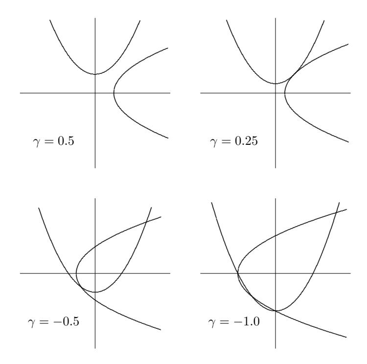
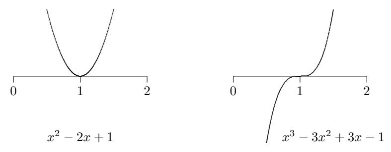
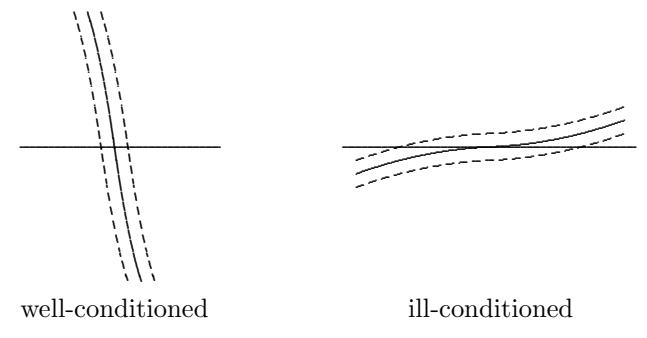
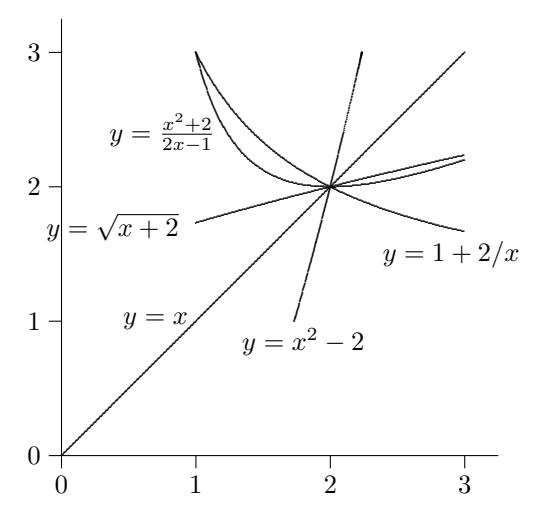
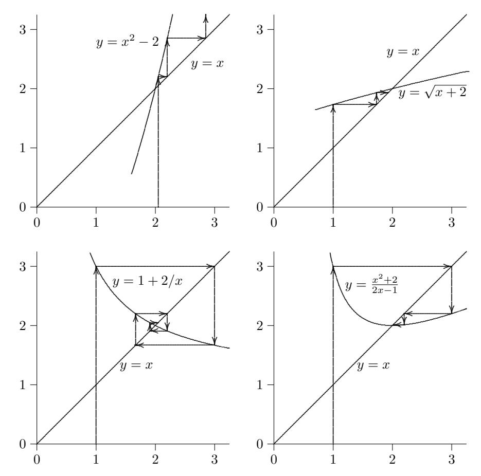
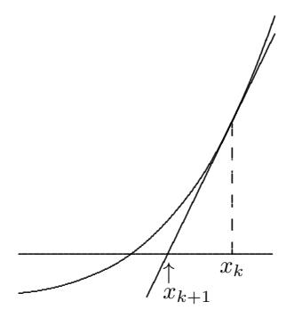
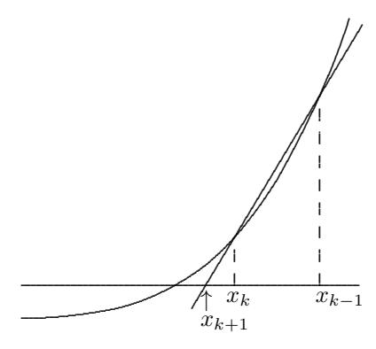
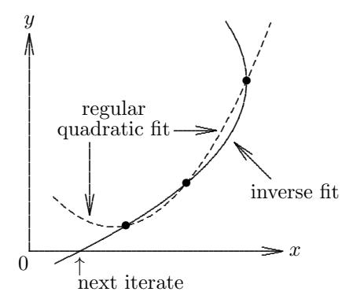

# Nonlinear Equations

# 5.1 Nonlinear Equations

Some relationships in nature are linear, as we saw in Chapter 2, but many others are inherently nonlinear in that effects are not in direct proportion to their causes. For example, the force on a moving object due to air resistance is proportional to the square of its velocity, where the proportionality constant is called the drag coefficient. Thus, drag grows rapidly with velocity, which accounts for why fuel economy of an automobile is poor if you drive too fast: you are expending most of the energy pushing air out of the way. If you want to know the drag for a given velocity, you simply evaluate this quadratic function; but if you want to know what velocity would yield a given drag, then you must solve a quadratic equation.

Another example of a nonlinear equation is the familiar ideal gas law,

$$pV = nRT$$
,

relating pressure p, volume V , and temperature T, where n is the amount of gas present and R is a universal constant. As the name suggests, the ideal gas law is only a crude approximation to reality because it ignores important physical effects, such as the nonzero size of the gas molecules and the forces between them, so that it is reasonably accurate only at relatively high temperatures and low pressures. A better approximation that takes some of these effects into account is the van der Waals equation of state,

$$\left(p + \frac{a}{v^2}\right)(v - b) = RT,$$

where v = V /n is the specific volume and a and b are constants that depend on the particular gas. This example is typical in that the relationship becomes more nonlinear as more physical features are included.

By analogy with a general system of linear equations Ax = b, perhaps the most natural way to write a general nonlinear equation would be f(x) = y, which asks the question, "For what value of x does the nonlinear function f(x) take on the value y?" It is more customary, however, to subtract y from both sides of the equation and incorporate it into f, so that the equation to be solved is expressed as f(x) = 0. In one dimension, this simply means that we seek the intersection of the curve defined by f with the x axis rather than the horizontal line y = constant.

Thus, a general system of m nonlinear equations in n unknowns has the form

$$f(x) = 0$$

where  $f: \mathbb{R}^n \to \mathbb{R}^m$ , and we seek an n-vector x such that all m component functions of f(x) are zero simultaneously. If the system is overdetermined, m > n, then usually there is no solution in this strict sense, and one seeks instead an approximate solution in the least squares sense (see Section 6.6). If the system is underdetermined, m < n, then usually there are infinitely many solutions; this case is mainly of interest as a constraint for an optimization problem (see Section 6.7). In this chapter we will be concerned only with the case m = n, nonlinear systems having the same number of equations as unknowns. For m = n = 1, we have a single nonlinear equation in one unknown, an important special case we will discuss at some length.

A solution value x such that f(x) = 0 is called a *root* of the equation, and a zero of the function f. Though technically they have distinct meanings, these two terms are informally used more or less interchangeably, with the obvious meaning. Thus, this problem is often referred to as *root finding* or zero finding.

**Example 5.1 Nonlinear Equations.** An example of a nonlinear equation in one dimension is

$$f(x) = x^2 - 4\sin(x) = 0,$$

for which one approximate solution is x=1.93375. An example of a system of two nonlinear equations in two unknowns is

$$\boldsymbol{f}(\boldsymbol{x}) = \begin{bmatrix} f_1(\boldsymbol{x}) \\ f_2(\boldsymbol{x}) \end{bmatrix} = \begin{bmatrix} x_1^2 - x_2 + 0.25 \\ -x_1 + x_2^2 + 0.25 \end{bmatrix} = \begin{bmatrix} 0 \\ 0 \end{bmatrix},$$

for which the solution vector is  $\boldsymbol{x} = \begin{bmatrix} 0.5 & 0.5 \end{bmatrix}^T$ .

### 5.2 Existence and Uniqueness

A general geometric description of solutions to systems of nonlinear equations is analogous to that for systems of linear equations. Each nonlinear equation in a system defines a "curved" hypersurface (as opposed to a "flat" hyperplane for a linear equation) in  $\mathbb{R}^n$ , and a solution to the system is any point where all these hypersurfaces intersect. But curved surfaces can intersect, or fail to intersect, in many more ways than flat surfaces can. For example, unlike flat surfaces, two

curved surfaces can be tangent without being coincident. As a result, it is often difficult to determine the existence or number of solutions of nonlinear equations. Whereas for systems of linear equations the number of solutions must be either zero, one, or infinitely many, nonlinear equations can have any number of solutions.

**Example 5.2 Solutions of Nonlinear Systems.** Consider the system of nonlinear equations in two dimensions

$$f(x) = \begin{bmatrix} x_1^2 - x_2 + \gamma \\ -x_1 + x_2^2 + \gamma \end{bmatrix} = \begin{bmatrix} 0 \\ 0 \end{bmatrix},$$

where  $\gamma$  is a parameter to be specified. Each of the two component equations defines a parabola, and any point where the two parabolas intersect is a solution to the system. Depending on the particular value for  $\gamma$ , this system can have either zero, one, two, or four solutions, as illustrated in Fig. 5.1.



Figure 5.1: Systems of nonlinear equations with various numbers of solutions.

**Example 5.3 Solutions of Nonlinear Equations.** Even in one dimension, a wide variety of behavior is possible, as shown by these examples.

•  $e^x + 1 = 0$  has no solution.

- $e^{-x} x = 0$  has one solution.
- $x^2 4\sin(x) = 0$  has two solutions.
- $x^3 + 6x^2 + 11x 6 = 0$  has three solutions.
- sin(x) = 0 has infinitely many solutions.

Although it is difficult to make any global assertions about solutions of nonlinear equations, there are nevertheless some useful local criteria that guarantee existence of a solution. The simplest of these is for one-dimensional problems, for which a sufficient condition for a solution is provided by the *Intermediate Value Theorem*, which says that if f is continuous on a closed interval [a, b], and c lies between f(a) and f(b), then there is a value  $x^* \in [a, b]$  such that  $f(x^*) = c$ . Thus, if f(a) and f(b) differ in sign, then by taking c = 0 in the theorem we can conclude that there must be a root within the interval [a, b]. Such an interval [a, b] for which the sign of f differs at its endpoints is called a *bracket* for a solution of the one-dimensional nonlinear equation f(x) = 0. As we will see later, refining such a bracket plays an important part in some algorithms for finding a solution. Identifying such a bracket in the first place, however, is often a matter of trial and error.

The bracket criterion just given can be generalized to n dimensions. For motivation, we first note that in one dimension the condition  $f(a) \leq 0$  and  $f(b) \geq 0$  is equivalent to  $(x-z)f(x) \geq 0$  for x=a and x=b, where z is any point in the open interval (a,b). Now if  $\mathbf{f}: \mathbb{R}^n \to \mathbb{R}^n$  is continuous on the closure of an open, bounded set  $S \subseteq \mathbb{R}^n$ , and  $(\mathbf{x}-\mathbf{z})^T \mathbf{f}(\mathbf{x}) \geq 0$  for any  $\mathbf{z} \in S$  and any  $\mathbf{x}$  in the boundary of S, then  $\mathbf{f}(\mathbf{x}) = \mathbf{0}$  has a solution in S. Unfortunately, this generalization of the bracket criterion is usually impractical to apply in n dimensions.

Another relevant theorem from calculus in this context is the *Inverse Function Theorem*, which says that for a continuously differentiable function f, if the Jacobian matrix  $J_f$  defined by  $\{J_f(x)\}_{ij} = \partial f_i(x)/\partial x_j$  is nonsingular at a point  $x^*$ , then there is a neighborhood of  $f(x^*)$  in which f is invertible, that is, the equation f(x) = y has a solution for any y in that neighborhood of  $f(x^*)$ . Unfortunately, even if  $J_f(x)$  is nonsingular for all  $x \in \mathbb{R}^n$ , so that f is locally invertible everywhere, it still may not be globally invertible on all of  $\mathbb{R}^n$  unless some additional condition holds, such as  $\|J_f^{-1}(x)\|$  being bounded above by some finite constant. Such strong sufficient conditions may seem unlikely to hold in practice, but keep in mind that they are far from necessary for a solution to exist, so one should not be deterred from seeking a solution in any particular instance just because one may not be able to ensure the existence of a solution in advance.

Yet another approach to verifying the existence of solutions to nonlinear systems is provided by the theory of fixed points and contractive mappings. A function  $g: \mathbb{R}^n \to \mathbb{R}^n$  is *contractive* on a set  $S \subseteq \mathbb{R}^n$  if there is a constant  $\gamma$ , with  $0 < \gamma < 1$ , such that

$$\|\boldsymbol{g}(\boldsymbol{x}) - \boldsymbol{g}(\boldsymbol{z})\| \le \gamma \|\boldsymbol{x} - \boldsymbol{z}\|$$

for all  $x, z \in S$ . A fixed point of g is any value x such that g(x) = x. The Contraction Mapping Theorem says that if g is contractive on a closed set  $S \subseteq \mathbb{R}^n$  and  $g(S) \subseteq S$ , then g has a unique fixed point in S. Thus, if f has the form f(x) = x - g(x), where g is contractive on a closed set  $S \subseteq \mathbb{R}^n$ , with  $g(S) \subseteq S$ ,

then f(x) = 0 has a unique solution in S, namely the fixed point of g. The general applicability of this approach may not be obvious now, but we will soon see that it provides the basis for useful iterative algorithms for computing solutions to nonlinear systems.

Finally, we mention another powerful theoretical tool, the topological degree of a function f on a given closed and bounded set S ⊆ R <sup>n</sup>. Its formal definition is too complicated to state here, but we can think of the degree informally as the number of zeros x <sup>∗</sup> of f in S, counted by positive or negative orientation, i.e.,

$$\sum_{\boldsymbol{x}^* \in S} \operatorname{sign}(\det(\boldsymbol{J}_f(\boldsymbol{x}^*))).$$

It turns out that the degree can be defined analytically in terms of a certain integral, the numerical evaluation of which is involved and expensive, but it can be computed reliably using methods based on interval arithmetic (see Section 1.3.10). Though the topological degree is an important theoretical tool, it is of limited practical utility in ordinary numerical computations.

Thus far we have focused primarily on existence, rather than uniqueness, of solutions to nonlinear equations because one generally takes it for granted that a nonlinear equation may have more than one solution, at least globally. One may still be concerned, however, about local uniqueness. Recall from Section 2.2 that an n × n system of linear equations Ax = b always has a unique solution whenever the matrix A is nonsingular. The analogous regularity condition for a nonlinear function f, at least locally, is that the Jacobian matrix J<sup>f</sup> (x ∗ ) is nonsingular at a given point x ∗ , and in that case the Inverse Function Theorem cited earlier establishes the existence of a neighborhood U of x ∗ that f maps one-to-one onto some neighborhood of y = f(x ∗ ), which implies that U contains no other solution to f(x) = y. Thus, in the "normal" situation, where J<sup>f</sup> is nonsingular, solutions are isolated. Degeneracy can occur, however, when J<sup>f</sup> (x ∗ ) is singular at a solution x ∗ , and we will see that such degeneracy affects the conditioning of the solution as well as the convergence properties of iterative algorithms for computing it.

For a nonlinear equation in one dimension, such degeneracy at a solution x ∗ means that both the function and its derivative are zero, i.e., f(x ∗ ) = 0 and f 0 (x ∗ ) = 0; such a solution is called a multiple root. Geometrically, this property means that the curve defined by f has a horizontal tangent on the x axis. More generally, for a smooth function f, if f(x ∗ ) = f 0 (x ∗ ) = f <sup>00</sup>(x ∗ ) = · · · = f (m−1)(x ∗ ) = 0 but f (m) (x ∗ ) 6= 0, then x ∗ is said to be a root of multiplicity m. If m = 1, i.e., f(x ∗ ) = 0 and f 0 (x ∗ ) 6= 0, then x ∗ is said to be a simple root.

Example 5.4 Multiple Root. Examples of equations having a multiple root include the quadratic equation x <sup>2</sup> − 2x + 1 = 0, for which x = 1 is a root of multiplicity two, and the cubic equation x <sup>3</sup> − 3x <sup>2</sup> + 3x − 1 = 0, for which x = 1 is a root of multiplicity three. Each of these functions is tangent to the horizontal axis at the root, as can be seen in Fig. 5.2. Note that the quadratic on the left touches the horizontal axis but does not cross it, and hence the bracket criterion (which requires a sign change in the function) would fail to identify this solution.



Figure 5.2: Two nonlinear functions, each having a multiple root.

# 5.3 Sensitivity and Conditioning

As was already discussed in Section 1.2.6, the sensitivity of the root-finding problem for a given function is opposite to that for *evaluating* the function: if the function value is insensitive to the value of the argument, then the root will be sensitive, whereas if the function value is sensitive to the argument, then the root will be insensitive. This property makes sense, because the two problems are inverses of each other: if f(x) = y, then finding x given y has the opposite conditioning from finding y given x.

For a quantitative measure of sensitivity for the root-finding problem, we must use an absolute (as opposed to relative) condition number, since the function value at the solution is zero by definition. Recall from Section 1.2.6 that in one dimension the absolute condition number for evaluating a smooth function f near a root  $x^*$  is  $|f'(x^*)|$ , and the root-finding problem for f at  $x^*$  has absolute condition number  $1/|f'(x^*)|$ . This means that when we have found a point  $\hat{x}$  at which  $|f(\hat{x})| \leq \epsilon$ , the error  $|\hat{x} - x^*|$  in the solution may be as large as  $\epsilon/|f'(x^*)|$ , which can be quite large if  $|f'(x^*)|$  is very small. The corresponding absolute condition numbers for function evaluation and root-finding problems in n-dimensions are  $||J_f(x^*)||$  and  $||J_f^{-1}(x^*)||$ , respectively.

These results are illustrated in Fig. 5.3, which is analogous to Fig. 2.4 for linear systems, except the lines are now curved and we seek the intersection points of those curves with the horizontal axis. The dashed curves indicate the region of uncertainty about each solid curve, so that the root in each case could be anywhere between the points at which the dashed curves intersect the horizontal axis. The small interval of uncertainty for the root on the left is due to the steep slope (and hence small reciprocal of that slope), whereas the large interval of uncertainty for the root on the right is due to the shallow slope (and hence large reciprocal of that slope).

In one dimension,  $f'(x^*) = 0$  at a multiple root  $x^*$ , so the condition number of a multiple root is infinite. This makes sense because a slight perturbation can cause a multiple root to become more than one root or not a root at all (see Example 5.4). Similarly, for a solution  $x^*$  to an n-dimensional nonlinear system, the condition number is infinite if  $J_f(x^*)$  is singular. Again this makes sense, because the existence and number of roots may be discontinuous at such a point.



Figure 5.3: Conditioning of roots of nonlinear equations.

**Example 5.5 Singular Jacobian.** For the nonlinear system of Example 5.2, with  $\gamma = 0.25$  (the upper right case in Fig.5.1), the Jacobian matrix

$$J_f(x) = \begin{bmatrix} 2x_1 & -1 \\ -1 & 2x_2 \end{bmatrix}$$

is singular at the unique solution  $x^* = [0.5, 0.5]^T$ . For a slightly smaller value of  $\gamma$  there are two solutions, and for a slightly larger value of  $\gamma$  there is no solution.

The conditioning of a nonlinear equation affects our expectations of an approximate solution  $\hat{x}$ : should we expect  $\|f(\hat{x})\| \approx 0$ , which corresponds to having a small residual, or  $\|\hat{x} - x^*\| \approx 0$ , which measures closeness to the (usually unknown) true solution  $x^*$ ? As with linear systems, these two criteria for a solution are not necessarily "small" simultaneously, depending on the conditioning. For an ill-conditioned problem,  $\|f(\hat{x})\|$  can be small without  $\hat{x}$  being close to the true solution. As with linear systems, a small residual implies an accurate solution only if the problem is well-conditioned. These considerations, along with several others, affect the choice of stopping criteria for iterative solution methods, which we will consider next.

# 5.4 Convergence Rates and Stopping Criteria

Unlike linear equations, most nonlinear equations cannot be solved in a finite number of steps. Thus, we must usually resort to an iterative method that produces increasingly accurate approximations to a solution, and we terminate the iterations when the result is sufficiently accurate. The total cost of solving the problem depends on both the cost per iteration and the number of iterations required for convergence, and there is often a tradeoff between these two factors.

To compare the effectiveness of iterative methods, we need to characterize their convergence rates. The error at iteration k, which we denote by  $e_k$ , is usually given by  $e_k = x_k - x^*$ , where  $x_k$  is the approximate solution at iteration k and  $x^*$  is the true solution. Some methods for one-dimensional problems do not produce a specific approximate solution  $x_k$ , however, but merely an interval known to contain

the solution, with the length of the interval decreasing as iterations proceed. For such methods, we take e<sup>k</sup> to be the length of this interval at iteration k. In either case, an iterative method is said to converge with rate r if

$$\lim_{k \to \infty} \frac{\|\boldsymbol{e}_{k+1}\|}{\|\boldsymbol{e}_k\|^r} = C$$

for some finite constant C > 0. Some particular cases of interest are:

- If r = 1 and C < 1, the convergence rate is linear.
- If r > 1, the convergence rate is superlinear.
- If r = 2, the convergence rate is quadratic.
- If r = 3, the convergence rate is cubic, and so on.

One way to interpret the distinction between linear and superlinear convergence is that, asymptotically, a linearly convergent sequence gains a constant number of additional correct digits per iteration, whereas a superlinearly convergent sequence gains an increasing number of additional correct digits with each iteration. Specifically, a linearly convergent sequence gains − log<sup>β</sup> (C) base-β digits per iteration, but a superlinearly convergent sequence has r times as many correct digits after each iteration as it had the previous iteration. In particular, a quadratically convergent method doubles the number of correct digits with each iteration.

Example 5.6 Convergence Rates. If the members of each of the following sequences are the magnitudes of the errors at successive iterations of an iterative method, then the convergence rate is as indicated.

- 1. 10<sup>−</sup><sup>2</sup> , 10<sup>−</sup><sup>3</sup> , 10<sup>−</sup><sup>4</sup> , 10<sup>−</sup><sup>5</sup> , . . . linear, with C = 10<sup>−</sup><sup>1</sup>
- 2. 10<sup>−</sup><sup>2</sup> , 10<sup>−</sup><sup>4</sup> , 10<sup>−</sup><sup>6</sup> , 10<sup>−</sup><sup>8</sup> , . . . linear, with C = 10<sup>−</sup><sup>2</sup>
- 3. 10<sup>−</sup><sup>2</sup> , 10<sup>−</sup><sup>3</sup> , 10<sup>−</sup><sup>5</sup> , 10<sup>−</sup><sup>8</sup> , . . . superlinear, but not quadratic
- 4. 10<sup>−</sup><sup>2</sup> , 10<sup>−</sup><sup>4</sup> , 10<sup>−</sup><sup>8</sup> , 10<sup>−</sup><sup>16</sup> , . . . quadratic

A convergence theorem may tell us that an iterative scheme will converge for a given problem, and how rapidly it will do so, but that does not specifically address the issue of when to stop iterating and declare the resulting approximate solution to be "good enough." Devising a suitable stopping criterion is a complex and subtle issue for a number of reasons. We may know in principle that the error kekk is becoming small, but since we do not know the true solution, we have no way of knowing kekk directly. A reasonable surrogate is the relative change in successive iterates, kxk+1 − xkk/kxkk. When the latter quantity becomes sufficiently small, then the approximate solutions have ceased changing significantly and there is little point in continuing. On the other hand, to ensure that the problem has actually been solved, one may also want to verify that the residual kf(xk)k is suitably small. As we have already observed, however, these two quantities are not necessarily small simultaneously, depending on the conditioning of the problem. In addition, all of these criteria are affected by the relative scaling of the components of both the argument x and the function f, and possibly other problem-dependent features as well. For all these reasons, a foolproof stopping criterion can be difficult to achieve and complicated to state. In stating iterative algorithms in this book, we will usually omit any explicit convergence test and instead merely indicate an indefinite number of iterations, with the understanding that the iterative process is to be terminated when a suitable stopping criterion is met. This avoids cluttering an otherwise clean algorithm statement with a complicated convergence test, or else using a misleadingly simplistic one.

# 5.5 Nonlinear Equations in One Dimension

We first consider solution methods for nonlinear equations in one dimension: given a continuous function  $f: \mathbb{R} \to \mathbb{R}$ , we seek a point  $x^* \in \mathbb{R}$  such that  $f(x^*) = 0$ .

#### 5.5.1 Interval Bisection

In finite-precision arithmetic, there may be no machine number  $x^*$  such that  $f(x^*)$  is exactly zero. An alternative is to seek a very short interval [a,b] in which f has a change of sign. As we saw in Section 5.2, such a bracket ensures that the corresponding continuous function must take on the value zero somewhere within the interval. The bisection method begins with an initial bracket and successively reduces its length until the solution has been isolated as accurately as desired (or the arithmetic precision will permit). At each iteration, the function is evaluated at the midpoint of the current interval, and half of the interval can then be discarded, depending on the sign of the function at the midpoint. The bisection method is stated formally in Algorithm 5.1, for which the initial input is a function f, an interval [a,b] such that  $\operatorname{sign}(f(a)) \neq \operatorname{sign}(f(b))$ , and an error tolerance tol for the length of the final interval.

#### Algorithm 5.1 Interval Bisection

```
while ((b-a)>tol) do m=a+(b-a)/2 if \mathrm{sign}(f(a))=\mathrm{sign}(f(m)) then a=m else b=m end end
```

We note a couple of details in Algorithm 5.1 that are designed to avoid potential pitfalls when it is implemented in finite-precision, floating-point arithmetic. First, perhaps the most obvious formula for computing the midpoint m of the interval [a,b] is m=(a+b)/2. However, with this formula the result in finite-precision arithmetic is not even guaranteed to fall within the interval [a,b] (in two-digit,

decimal arithmetic, for example, this formula gives a "midpoint" of 0.7 for the interval [0.67, 0.69]). Moreover, the intermediate quantity a+b could overflow in an extreme case, even though the midpoint is well defined and should be computable. A better alternative is the formula m = a + (b − a)/2, which cannot overflow and is guaranteed to fall within the interval [a, b], provided a and b have the same sign (as will normally be the case unless the root happens to be near zero). Second, testing whether two function values f(x1) and f(x2) agree in sign is mathematically equivalent to testing whether the product f(x1) · f(x2) is positive or negative. In floating-point arithmetic, however, such an implementation is risky because the product could easily underflow when the function values are small, which they will be as we approach the root. A safer alternative is to use the sign function explicitly, where sign(x) = 1 if x ≥ 0 and sign(x) = −1 if x < 0.

Example 5.7 Interval Bisection. We illustrate the bisection method by finding a root of the equation

$$f(x) = x^2 - 4\sin(x) = 0.$$

For the initial bracketing interval [a, b], we take a = 1 and b = 3. All that really matters is that the function values differ in sign at the two points. We evaluate the function at the midpoint m = a + (b − a)/2 = 2 and find that f(m) has the opposite sign from f(a), so we retain the first half of the initial interval by setting b = m. We then repeat the process until the bracketing interval isolates the root of the equation as accurately as desired. The sequence of iterations is shown here.

| a        | f(a)      | b        | f(b)     |
|----------|-----------|----------|----------|
| 1.000000 | −2.365884 | 3.000000 | 8.435520 |
| 1.000000 | −2.365884 | 2.000000 | 0.362810 |
| 1.500000 | −1.739980 | 2.000000 | 0.362810 |
| 1.750000 | −0.873444 | 2.000000 | 0.362810 |
| 1.875000 | −0.300718 | 2.000000 | 0.362810 |
| 1.875000 | −0.300718 | 1.937500 | 0.019849 |
| 1.906250 | −0.143255 | 1.937500 | 0.019849 |
| 1.921875 | −0.062406 | 1.937500 | 0.019849 |
| 1.929688 | −0.021454 | 1.937500 | 0.019849 |
| 1.933594 | −0.000846 | 1.937500 | 0.019849 |
| 1.933594 | −0.000846 | 1.935547 | 0.009491 |
| 1.933594 | −0.000846 | 1.934570 | 0.004320 |
| 1.933594 | −0.000846 | 1.934082 | 0.001736 |
| 1.933594 | −0.000846 | 1.933838 | 0.000445 |
| 1.933716 | −0.000201 | 1.933838 | 0.000445 |
| 1.933716 | −0.000201 | 1.933777 | 0.000122 |
| 1.933746 | −0.000039 | 1.933777 | 0.000122 |
| 1.933746 | −0.000039 | 1.933762 | 0.000041 |
| 1.933746 | −0.000039 | 1.933754 | 0.000001 |
| 1.933750 | −0.000019 | 1.933754 | 0.000001 |
| 1.933752 | −0.000009 | 1.933754 | 0.000001 |
| 1.933753 | −0.000004 | 1.933754 | 0.000001 |

The bisection method makes no use of the magnitudes of the function values, only their signs. As a result, bisection is certain to converge but does so rather slowly. Specifically, at each successive iteration the length of the interval containing the solution, and hence a bound on the possible error, is reduced by half. This means that the bisection method is linearly convergent, with r=1 and C=0.5. Another way of stating this is that we gain one additional correct bit in the approximate solution for each iteration of bisection. Given a starting interval [a, b], the length of the interval after k iterations is  $(b-a)/2^k$ , so that achieving an error tolerance of tol requires

$$\left\lceil \log_2\left(\frac{b-a}{tol}\right) \right\rceil$$

iterations, regardless of the particular function f involved.

#### 5.5.2 Fixed-Point Iteration

We now consider an alternative problem that will help us solve our original problem. Given a function  $g: \mathbb{R} \to \mathbb{R}$ , a value x such that

$$x = g(x)$$

is called a fixed point of the function g, since x is unchanged when g is applied to it. Whereas with a nonlinear equation f(x) = 0 we seek a point where the curve defined by f intersects the x-axis (i.e., the line g = 0), with a fixed-point problem g = g(x) we seek a point where the curve defined by g intersects the diagonal line g = x. Fixed-point problems often arise directly in practice, but they are also important because a nonlinear equation can usually be recast as a fixed-point problem for a related nonlinear function. Indeed, many iterative algorithms for solving nonlinear equations are based on iteration schemes of the form

$$x_{k+1} = g(x_k),$$

where g is a function chosen so that its fixed points are solutions for f(x) = 0. Such a scheme is called *fixed-point iteration* or sometimes *functional iteration*, since the function g is applied repeatedly to an initial starting value  $x_0$ .

For a given equation f(x) = 0, there may be many equivalent fixed-point problems x = g(x) with different choices for the function g. But not all fixed-point formulations are equally useful in deriving an iteration scheme for solving a given nonlinear equation. The resulting iteration schemes may differ not only in their convergence rates but also in whether they converge at all.

#### Example 5.8 Fixed-Point Problems. The nonlinear equation

$$f(x) = x^2 - x - 2 = 0$$

has roots  $x^* = 2$  and  $x^* = -1$ . Equivalent fixed-point problems include

- 1.  $g(x) = x^2 2$ ,
- 2.  $g(x) = \sqrt{x+2}$ ,

3. 
$$g(x) = 1 + 2/x$$
,  
4.  $g(x) = (x^2 + 2)/(2x - 1)$ .

Each of these functions is plotted near x = 2 in Fig. 5.4, along with the line y = x. By design, each of the functions intersects the line y = x at the fixed point (2, 2).

The corresponding fixed-point iteration schemes are depicted graphically in Fig. 5.5. A vertical arrow corresponds to evaluation of the function at a point, and a horizontal arrow pointing to the line y=x indicates that the result of the previous function evaluation is used as the argument for the next. For the first of these functions, even with a starting point very near the solution, the successive iterates diverge. For the other three functions, the successive iterates converge to the fixed point even if started at a point relatively far from the solution, although the rates of convergence appear to vary somewhat.



Figure 5.4: A fixed point of some nonlinear functions.

As one can see from Fig. 5.5, the behavior of fixed-point iteration schemes can vary widely, from divergence, to slow convergence, to rapid convergence. What makes the difference? The simplest (though not the most general) way to characterize the behavior of an iterative scheme  $x_{k+1} = g(x_k)$  for the fixed-point problem x = g(x) is to consider the derivative of g at the solution  $x^*$ , assuming that g is smooth. In particular, if  $x^* = g(x^*)$  and  $|g'(x^*)| < 1$ , then the iterative scheme is locally convergent, i.e., there is an interval containing  $x^*$  such that fixed-point iteration with g converges if started at a point within that interval. If  $|g'(x^*)| > 1$ , on the other hand, then fixed-point iteration with g diverges for any starting point other than  $x^*$ .

The proof of this result is simple and instructive, so we sketch it here. If  $x^*$  is a fixed point, then for the error at the kth iteration we have

$$e_{k+1} = x_{k+1} - x^* = g(x_k) - g(x^*).$$



Figure 5.5: Fixed-point iterations for some nonlinear functions.

By the Mean Value Theorem, there is a point  $\theta_k$  between  $x_k$  and  $x^*$  such that

$$g(x_k) - g(x^*) = g'(\theta_k)(x_k - x^*),$$

so that

$$e_{k+1} = g'(\theta_k)e_k.$$

We do not know the value of  $\theta_k$ , but if  $|g'(x^*)| < 1$ , then by starting the iterations close enough to  $x^*$ , we can be assured that there is a constant C such that  $|g'(\theta_k)| \le C < 1$ , for  $k = 0, 1, \ldots$  Thus, we have

$$|e_{k+1}| \le C|e_k| \le \dots \le C^k|e_0|,$$

but C < 1 implies  $C^k \to 0$ , so  $|e_k| \to 0$  and the sequence converges.

As we can see from the proof, when fixed-point iteration converges the asymptotic convergence rate is linear, with constant  $C = |g'(x^*)|$ . The smaller the constant, the faster the convergence, so ideally we would like to have  $g'(x^*) = 0$ , in

which case Taylor's Theorem shows that

$$g(x_k) - g(x^*) = g''(\xi_k)(x_k - x^*)^2/2$$

for some  $\xi_k$  between  $x_k$  and  $x^*$ . Thus,

$$\lim_{k \to \infty} \frac{|e_{k+1}|}{|e_k|^2} = \left| \frac{g''(x^*)}{2} \right|,$$

and hence the convergence rate is at least quadratic. In Section 5.5.3, we will see a systematic way of choosing g so that this occurs.

**Example 5.9 Convergence of Fixed-Point Iteration.** For the four fixed-point problems in Example 5.8, we have

- 1. g'(x) = 2x, so g'(2) = 4, and hence fixed-point iteration diverges.
- 2.  $g'(x) = 1/(2\sqrt{x+2})$ , so g'(2) = 1/4, and hence fixed-point iteration converges linearly with C = 1/4. The positive sign of g'(2) causes the iterates to approach the fixed-point from one side.
- 3.  $g'(x) = -2/x^2$ , so g'(2) = -1/2, and hence fixed-point iteration converges linearly with C = 1/2. The negative sign of g'(2) causes the iterates to spiral around the fixed-point, alternating sides.
- 4.  $g'(x) = (2x^2 2x 4)/(2x 1)^2$ , so g'(2) = 0, and hence fixed-point iteration converges quadratically.

#### 5.5.3 Newton's Method

The bisection technique makes no use of the function values other than their signs, which results in slow but sure convergence. More rapidly convergent methods can be derived by using the function values to obtain a more accurate approximation to the solution at each iteration. In particular, the truncated Taylor series

$$f(x+h) \approx f(x) + f'(x)h$$

is a linear function of h that approximates f near a given x. We can therefore replace the nonlinear function f with this linear function, whose zero is easily determined to be h = -f(x)/f'(x), assuming that  $f'(x) \neq 0$ . Of course, the zeros of the two functions are not identical in general, so we repeat the process. This motivates the iteration scheme, known as *Newton's method*, shown in Algorithm 5.2. As illustrated in Fig. 5.6, Newton's method can be interpreted as approximating the function f near  $x_k$  by the tangent line at  $f(x_k)$ . We can then take the next approximate solution to be the zero of this linear function, and repeat the process.

**Example 5.10 Newton's Method.** We illustrate Newton's method by again finding a root of the equation

$$f(x) = x^2 - 4\sin(x) = 0.$$

#### Algorithm 5.2 Newton's Method for One-Dimensional Nonlinear Equation

$$x_0$$
 = initial guess  
for  $k = 0, 1, 2, ...$   
 $x_{k+1} = x_k - f(x_k)/f'(x_k)$   
\nend



Figure 5.6: Newton's method for solving nonlinear equation.

The derivative of this function is given by

$$f'(x) = 2x - 4\cos(x),$$

so that the iteration scheme is given by

$$x_{k+1} = x_k - \frac{x_k^2 - 4\sin(x_k)}{2x_k - 4\cos(x_k)}.$$

Taking  $x_0 = 3$  as initial guess, we obtain the sequence of iterations shown next, where  $h_k = -f(x_k)/f'(x_k)$  denotes the change in  $x_k$  at each iteration. The iteration can be terminated when  $|h_k|/|x_k|$  or  $|f(x_k)|$ , or both, are as small as desired.

| k | $x_k$    | $f(x_k)$ | $f'(x_k)$ | $h_k$     |
|---|----------|----------|-----------|-----------|
| 0 | 3.000000 | 8.435520 | 9.959970  | -0.846942 |
| 1 | 2.153058 | 1.294772 | 6.505771  | -0.199019 |
| 2 | 1.954039 | 0.108438 | 5.403795  | -0.020067 |
| 3 | 1.933972 | 0.001152 | 5.288919  | -0.000218 |
| 4 | 1.933754 | 0.000000 | 5.287670  | 0.000000  |

We can view Newton's method as a systematic way of transforming a nonlinear equation f(x) = 0 into a fixed-point problem x = g(x), where

$$g(x) = x - f(x)/f'(x).$$

To study the convergence of this scheme, we therefore determine the derivative

$$g'(x) = f(x)f''(x)/(f'(x))^2.$$

If x ∗ is a simple root (i.e., f(x ∗ ) = 0 and f 0 (x ∗ ) 6= 0), then g 0 (x ∗ ) = 0. Thus, the asymptotic convergence rate of Newton's method for a simple root is quadratic, i.e., r = 2. We have already seen an illustration of this: the fourth fixed-point iteration scheme in Example 5.8 is Newton's method for solving that example equation (note that the fourth iteration function in Fig. 5.5 has a horizontal tangent at the fixed point).

The quadratic convergence rate of Newton's method for a simple root means that asymptotically the error is squared at each iteration. Another way of stating this is that the number of correct digits in the approximate solution is doubled at each iteration of Newton's method. For a multiple root, on the other hand, Newton's method is only linearly convergent, with constant C = 1 − (1/m), where m is the multiplicity. It is important to remember, however, that these convergence results are only local, and Newton's method may not converge at all unless started close enough to the solution. For example, a relatively small value for f 0 (xk) (i.e., a nearly horizontal tangent of f) tends to cause the next iterate to lie far away from the current approximation.

Example 5.11 Newton's Method for Multiple Root. Both types of behavior are shown in the following examples, where the first shows quadratic convergence to a simple root and the second shows linear convergence to a multiple root. The multiplicity of the root for the second problem is 2, so C = 1/2.

|   | 2 −<br>f(x) =<br>x<br>1 | 2 −<br>f(x) =<br>x<br>2x<br>+ 1 |
|---|-------------------------|---------------------------------|
| k | xk                      | xk                              |
| 0 | 2.0                     | 2.0                             |
| 1 | 1.25                    | 1.5                             |
| 2 | 1.025                   | 1.25                            |
| 3 | 1.0003                  | 1.125                           |
| 4 | 1.00000005              | 1.0625                          |
| 5 | 1.0                     | 1.03125                         |

### 5.5.4 Secant Method

One drawback of Newton's method is that both the function and its derivative must be evaluated at each iteration. The derivative may be inconvenient or expensive to evaluate, so we might consider replacing it by a finite difference approximation using some small step size h, as in Example 1.3, but this would require a second evaluation of the function at each iteration purely for the purpose of obtaining derivative information. A better idea is to base the finite difference approximation on successive iterates,

$$f'(x_k) \approx \frac{f(x_k) - f(x_{k-1})}{x_k - x_{k-1}},$$

where the function must be evaluated anyway. This approach gives the secant method, shown in Algorithm 5.3. As illustrated in Fig. 5.7, the secant method can be interpreted as approximating the function f by the secant line through the previous two iterates, and taking the zero of the resulting linear function to be the next approximate solution.

#### Algorithm 5.3 Secant Method

```
x_0, x_1 = \text{initial guesses}

for k = 1, 2, \dots

x_{k+1} = x_k - f(x_k)(x_k - x_{k-1})/(f(x_k) - f(x_{k-1}))
\nend
```



Figure 5.7: Secant method for solving nonlinear equation.

**Example 5.12 Secant Method.** We illustrate the secant method by again finding a root of the equation

$$f(x) = x^2 - 4\sin(x) = 0.$$

We evaluate the function at each of two starting guesses,  $x_0 = 1$  and  $x_1 = 3$ , and take the next approximate solution to be the zero of the straight line fitting the two function values. We then repeat the process using this new value and the more recent of our two previous values, so only one new function evaluation is needed per iteration. The sequence of iterations is shown next, where  $h_k$  denotes the change in  $x_k$  at each iteration.

| k | $x_k$    | $f(x_k)$  | $h_k$     |
|---|----------|-----------|-----------|
| 0 | 1.000000 | -2.365884 |           |
| 1 | 3.000000 | 8.435520  | -1.561930 |
| 2 | 1.438070 | -1.896774 | 0.286735  |
| 3 | 1.724805 | -0.977706 | 0.305029  |
| 4 | 2.029833 | 0.534305  | -0.107789 |
| 5 | 1.922044 | -0.061523 | 0.011130  |
| 6 | 1.933174 | -0.003064 | 0.000583  |
| 7 | 1.933757 | 0.000019  | -0.000004 |
| 8 | 1.933754 | 0.000000  | 0.000000  |

Because each new approximate solution produced by the secant method depends on two previous iterates, its convergence behavior is somewhat more complicated to analyze, so we omit most of the details. It can be shown that the errors satisfy

$$\lim_{k\to\infty}\frac{|e_{k+1}|}{|e_k|\cdot|e_{k-1}|}=c$$

for some finite constant c > 0, which implies that the sequence is locally convergent and suggests that the rate is superlinear. For each k we define

$$s_k = |e_{k+1}|/|e_k|^r,$$

where r is the convergence rate to be determined. Thus, we have

$$|e_{k+1}| = s_k |e_k|^r = s_k (s_{k-1} |e_{k-1}|^r)^r = s_k s_{k-1}^r |e_{k-1}|^{r^2},$$

so that

$$\frac{|e_{k+1}|}{|e_k| \cdot |e_{k-1}|} = \frac{s_k s_{k-1}^r |e_{k-1}|^{r^2}}{s_{k-1} |e_{k-1}|^r |e_{k-1}|} = s_k s_{k-1}^{r-1} |e_{k-1}|^{r^2 - r - 1}.$$

But  $|e_k| \to 0$ , whereas the foregoing ratio on the left tends to a nonzero constant; so we must have  $r^2 - r - 1 = 0$ , which implies that the convergence rate is given by the positive solution to this quadratic equation,  $r = (1 + \sqrt{5})/2 \approx 1.618$ . Thus, the secant method is normally superlinearly convergent, but, like Newton's method, it must be started close enough to the solution in order to converge.

Compared with Newton's method, the secant method has the advantage of requiring only one new function evaluation per iteration, but it has the disadvantages of requiring two starting guesses and converging somewhat more slowly, though still superlinearly. The lower cost per iteration of the secant method often more than offsets the larger number of iterations required for convergence, however, so that the total cost of finding a root is often less for the secant method than for Newton's method.

### 5.5.5 Inverse Interpolation

At each iteration of the secant method, a straight line is fit to two values of the function whose zero is sought. A higher convergence rate (but not exceeding r=2) can be obtained by fitting a higher-degree polynomial to the appropriate number of function values. For example, one could fit a quadratic polynomial to three successive iterates and use one of its roots as the next approximate solution. There are several difficulties with this idea, however: the polynomial may not have any real roots, and even if it does they may not be easy to compute, and it may not be easy to choose which root to use as the next iterate. (On the other hand, if one seeks a *complex root*, then a polynomial having complex roots is desirable; in *Muller's method*, for example, a quadratic polynomial is used in approximating complex roots.)

An answer to these difficulties is provided by *inverse interpolation*, in which one fits the values  $x_k$  as a function of the values  $y_k = f(x_k)$  by a polynomial p(y),

so that the next approximate solution is simply p(0). This idea is illustrated in Fig. 5.8, where a parabola fitting y as a function of x has no real root (i.e., it fails to cross the x axis), but a parabola fitting x as a function of y is merely evaluated at y = 0 to obtain the next iterate.



Figure 5.8: Inverse interpolation for approximating root. Dashed line is regular quadratic fit, solid line is inverse quadratic fit.

Using inverse quadratic interpolation, at each iteration we have three approximate solution values, which we denote by a, b, and c, with corresponding function values  $f_a$ ,  $f_b$ , and  $f_c$ , respectively. The next approximate solution is found by fitting a quadratic polynomial to a, b, and c as a function of  $f_a$ ,  $f_b$ , and  $f_c$ , and then evaluating the polynomial at 0. This task is accomplished by the following formulas, whose derivation will become clearer after we study Lagrange interpolation in Section 7.3.2:

$$u = f_b/f_c,$$
  $v = f_b/f_a,$   $w = f_a/f_c,$   $p = v(w(u-w)(c-b) - (1-u)(b-a)),$   $q = (w-1)(u-1)(v-1).$ 

The new approximate solution is given by b+p/q. The process is then repeated with b replaced by the new approximation, a replaced by the old b, and c replaced by the old a. Note that only one new function evaluation is needed per iteration. The convergence rate of inverse quadratic interpolation for root finding is  $r \approx 1.839$ , which is the same as for regular quadratic interpolation (Muller's method). Again this result is local, and the iterations must be started close enough to the solution to obtain convergence.

**Example 5.13 Inverse Quadratic Interpolation.** We illustrate inverse quadratic interpolation by again finding a root of the equation

$$f(x) = x^2 - 4\sin(x) = 0.$$

Taking a = 1, b = 2, and c = 3 as starting values, the sequence of iterations is shown next, where  $h_k = p/q$  denotes the change in  $x_k$  at each iteration.

| k | xk       | f(xk)     | hk        |
|---|----------|-----------|-----------|
| 0 | 1.000000 | −2.365884 |           |
| 1 | 2.000000 | 0.362810  |           |
| 2 | 3.000000 | 8.435520  |           |
| 3 | 1.886318 | −0.244343 | −0.113682 |
| 4 | 1.939558 | 0.030786  | 0.053240  |
| 5 | 1.933742 | −0.000060 | −0.005815 |
| 6 | 1.933754 | 0.000000  | 0.000011  |

### 5.5.6 Linear Fractional Interpolation

The zero-finding methods we have considered thus far may have difficulty if the function whose zero is sought has a horizontal or vertical asymptote. A horizontal asymptote may yield a tangent or secant line that is almost horizontal, causing the next approximate solution to be far afield, and a vertical asymptote may be skipped over, placing the approximation on the wrong branch of the function. Linear fractional interpolation, which uses a rational fraction of the form

$$\phi(x) = \frac{x - u}{vx - w},$$

is a useful alternative in such cases. This function has a zero at x = u, a vertical asymptote at x = w/v, and a horizontal asymptote at y = 1/v.

In seeking a zero of a nonlinear function f(x), suppose that we have three approximate solution values, which we denote by a, b, and c, with corresponding function values fa, fb, and fc, respectively. Fitting the linear fraction φ to the three data points yields a 3 × 3 system of linear equations

$$\begin{bmatrix} 1 & af_a & -f_a \\ 1 & bf_b & -f_b \\ 1 & cf_c & -f_c \end{bmatrix} \begin{bmatrix} u \\ v \\ w \end{bmatrix} = \begin{bmatrix} a \\ b \\ c \end{bmatrix},$$

whose solution determines the coefficients u, v, and w. We now replace a and b with b and c, respectively, and take the next approximate solution to be the zero of the linear fraction, c = u. Because v and w play no direct role, the solution to the foregoing system is most conveniently implemented as a single formula for the change h in c, which is given by

$$h = \frac{(a-c)(b-c)(f_a - f_b)f_c}{(a-c)(f_c - f_b)f_a - (b-c)(f_c - f_a)f_b}.$$

Linear fractional interpolation is also effective as a general-purpose one-dimensional zero finder, as the following example illustrates. Its asymptotic convergence rate is the same as that given by quadratic interpolation (inverse or regular), r ≈ 1.839. Once again this result is local, and the iterations must be started close enough to the solution to obtain convergence.

Example 5.14 Linear Fractional Interpolation. We illustrate linear fractional interpolation by again finding a root of the equation

$$f(x) = x^2 - 4\sin(x) = 0.$$

Taking a = 1, b = 2, and c = 3 as starting values, the sequence of iterations is shown next.

| k | xk       | f(xk)     | hk        |
|---|----------|-----------|-----------|
| 0 | 1.000000 | −2.365884 |           |
| 1 | 2.000000 | 0.362810  |           |
| 2 | 3.000000 | 8.435520  |           |
| 3 | 1.906953 | −0.139647 | −1.093047 |
| 4 | 1.933351 | −0.002131 | 0.026398  |
| 5 | 1.933756 | 0.000013  | −0.000406 |
| 6 | 1.933754 | 0.000000  | −0.000003 |

### 5.5.7 Safeguarded Methods

Rapidly convergent methods for solving nonlinear equations, such as Newton's method, the secant method, and other types of methods based on interpolation, are unsafe in that they may not converge unless they are started close enough to the solution. Safe methods such as bisection, on the other hand, are slow and therefore costly. Which should one choose?

A solution to this dilemma is provided by hybrid methods that combine features of both types of methods. For example, one could use a rapidly convergent method but maintain a bracket around the solution. If the next approximate solution given by the rapid algorithm falls outside the bracketing interval, one would fall back on a safe method, such as bisection, for one iteration. Then one can try the rapid method again on a smaller interval with a greater chance of success. Ultimately, the fast convergence rate should prevail. This approach seldom does worse than the slow method and usually does much better.

A popular implementation of such a hybrid approach was originally developed by Dekker, van Wijngaarden, and others, and later improved by Brent. This method, which is found in a number of subroutine libraries, combines the safety of bisection with the faster convergence of inverse quadratic interpolation. By avoiding Newton's method, derivatives of the function are not required. A careful implementation must address a number of potential pitfalls in floating-point arithmetic, such as underflow, overflow, or an unrealistically tight user-supplied error tolerance.

### 5.5.8 Zeros of Polynomials

Thus far we have discussed methods for finding a single zero of an arbitrary function in one dimension. For the special case of a polynomial p(x) of degree n, one often may need to find all n of its zeros, which may be complex even if the coefficients of the polynomial are real. Several approaches are available:

- Use one of the methods we have discussed, such as Newton's method or Muller's method, to find a single root x<sup>1</sup> (keeping in mind that the root may be complex), then consider the deflated polynomial p(x)/(x − x1) of degree one less. Repeat until all roots have been found. It is a good idea to go back and refine each root using the original polynomial p(x) to avoid contamination due to rounding error in forming the deflated polynomials.
- Form the companion matrix (see Section 4.2.1) of the given polynomial and use an eigenvalue routine to compute its eigenvalues, which are the roots of the polynomial. This method, which is used by the roots function in MATLAB, is reliable but is less efficient in both work and storage than methods tailored specifically for this problem.
- Use a method designed specifically for finding all the roots of a polynomial. Some of these methods are based on classical techniques for isolating the roots of a polynomial in a region of the complex plane, typically a union of disks, and then refining it in a manner similar in spirit to bisection until the roots have been localized as accurately as desired. Like bisection, such methods are guaranteed to work but are only linearly convergent. More rapidly convergent methods are available, however, including the methods of Laguerre, of Bairstow, and of Jenkins and Traub. The latter is probably the most effective method currently available for finding all of the roots of a polynomial.

The first two of these approaches are relatively simple to implement since they make use of other software for the primary subtasks. The third approach is rather complicated, but fortunately good software implementations are available (see Section 5.7).

### 5.6 Systems of Nonlinear Equations

Systems of nonlinear equations tend to be more difficult to solve than single nonlinear equations for a number of reasons:

- A much wider range of behavior is possible, so that a theoretical analysis of the existence and number of solutions is much more complex, as we saw in Section 5.2.
- With conventional numerical methods, there is no simple way, in general, of bracketing a desired solution to produce an absolutely safe method with guaranteed convergence. Using homotopy methods (see Computer Problem 9.10) or interval methods (see Section 1.3.10), global convergence guarantees are possible, but detailed discussion of these methods is beyond the scope of this book (we will, however, cite available software based on such methods in Section 5.7).
- As we will soon see, computational overhead increases rapidly with the dimension of the problem.

#### 5.6.1 Fixed-Point Iteration

Just as for one dimension, a system of nonlinear equations can be converted into a fixed-point problem, so we now briefly consider the multidimensional case. If  $g:\mathbb{R}^n\to\mathbb{R}^n$ , then a fixed-point problem for g is to find an  $x\in\mathbb{R}^n$  such that

$$x = g(x)$$
.

The corresponding fixed-point iteration is simply

$$\boldsymbol{x}_{k+1} = \boldsymbol{g}(\boldsymbol{x}_k),$$

given some starting vector  $x_0$ .

In one dimension, we saw that the convergence (and convergence rate) of fixed-point iteration is determined by  $|g'(x^*)|$ , where  $x^*$  is the solution. In higher dimensions the analogous condition is that the spectral radius

$$\rho(\boldsymbol{G}(\boldsymbol{x}^*)) < 1,$$

where G(x) denotes the Jacobian matrix of g evaluated at x,

$$\{\boldsymbol{G}(\boldsymbol{x})\}_{ij} = \frac{\partial g_i(\boldsymbol{x})}{\partial x_j}.$$

If the foregoing condition is satisfied, then the fixed-point iteration converges if started close enough to the solution. (Note that testing this condition does not necessarily require computing eigenvalues, since  $\rho(A) \leq \|A\|$  for any matrix A and any matrix norm induced by a vector norm; see Exercise 4.13.) As with one-dimensional problems, the smaller the spectral radius the faster the convergence rate. In particular, if  $G(x^*) = O$ , then the convergence rate is at least quadratic. We will next see that the n-dimensional version of Newton's method is a systematic way of choosing g so that this happens.

#### 5.6.2 Newton's Method

Many methods for solving nonlinear equations in one-dimension do not generalize directly to n dimensions. The most popular and powerful method that does generalize is *Newton's method*, which for a differentiable function  $\mathbf{f}: \mathbb{R}^n \to \mathbb{R}^n$  is based on the truncated Taylor series

$$\boldsymbol{f}(\boldsymbol{x}+\boldsymbol{s})\approx\boldsymbol{f}(\boldsymbol{x})+\boldsymbol{J}_f(\boldsymbol{x})\,\boldsymbol{s},$$

where  $J_f(x)$  is the Jacobian matrix of f,  $\{J_f(x)\}_{ij} = \partial f_i(x)/\partial x_j$ . If s satisfies the linear system  $J_f(x) s = -f(x)$ , then x + s is taken as an approximate zero of f. In this sense, Newton's method replaces a system of nonlinear equations with a system of linear equations, but since the solutions of the two systems are not identical in general, the process must be repeated, as shown in Algorithm 5.4, until the approximate solution is as accurate as desired.

**Example 5.15 Newton's Method.** We illustrate Newton's method by solving the nonlinear system

$$\boldsymbol{f}(\boldsymbol{x}) = \begin{bmatrix} x_1 + 2x_2 - 2 \\ x_1^2 + 4x_2^2 - 4 \end{bmatrix} = \begin{bmatrix} 0 \\ 0 \end{bmatrix},$$

#### Algorithm 5.4 Newton's Method for System of Nonlinear Equations

```
x0 = initial guess
for k = 0, 1, 2, . . .
    Solve Jf (xk) sk = −f(xk) for sk
    xk+1 = xk + sk
end
                                               { compute Newton step }
                                               { update solution }
```

for which the Jacobian matrix is given by

$$\boldsymbol{J}_f(\boldsymbol{x}) = \begin{bmatrix} 1 & 2 \\ 2x_1 & 8x_2 \end{bmatrix}.$$

If we take x<sup>0</sup> = [ 1 2 ]<sup>T</sup> , then

$$\bm{f}(\bm{x}_0) = \begin{bmatrix} 3 \ 13 \end{bmatrix}, \qquad \bm{J}_f(\bm{x}_0) = \begin{bmatrix} 1 & 2 \ 2 & 16 \end{bmatrix}.$$

Solving the system

$$\boldsymbol{J}_f(\boldsymbol{x}_0)\,\boldsymbol{s}_0 = \begin{bmatrix} 1 & 2 \\ 2 & 16 \end{bmatrix}\boldsymbol{s}_0 = \begin{bmatrix} -3 \\ -13 \end{bmatrix} = -\boldsymbol{f}(\boldsymbol{x}_0)$$

gives s<sup>0</sup> = [ −1.83 −0.58 ]<sup>T</sup> , and hence

$$\boldsymbol{x}_1 = \boldsymbol{x}_0 + \boldsymbol{s}_0 = \begin{bmatrix} -0.83 \\ 1.42 \end{bmatrix}, \quad \boldsymbol{f}(\boldsymbol{x}_1) = \begin{bmatrix} 0 \\ 4.72 \end{bmatrix}, \quad \boldsymbol{J}_f(\boldsymbol{x}_1) = \begin{bmatrix} 1 & 2 \\ -1.67 & 11.3 \end{bmatrix}.$$

Solving the system

$$\boldsymbol{J}_f(\boldsymbol{x}_1) \, \boldsymbol{s}_1 = \begin{bmatrix} 1 & 2 \\ -1.67 & 11.3 \end{bmatrix} \boldsymbol{s}_1 = \begin{bmatrix} 0 \\ -4.72 \end{bmatrix} = -\boldsymbol{f}(\boldsymbol{x}_1)$$

gives s<sup>1</sup> = [ 0.64 −0.32 ]<sup>T</sup> , and hence

> G(x ∗

$$\bm{x}_2 = \bm{x}_1 + \bm{s}_1 = \begin{bmatrix} -0.19 \\ 1.10 \end{bmatrix}, \quad \bm{f}(\bm{x}_2) = \begin{bmatrix} 0 \\ 0.83 \end{bmatrix}, \quad \bm{J}_f(\bm{x}_2) = \begin{bmatrix} 1 & 2 \\ -0.38 & 8.76 \end{bmatrix}.$$

Iterations continue until convergence to the solution x <sup>∗</sup> = [ 0 1 ]<sup>T</sup> .

We can determine the convergence rate of Newton's method in n dimensions by differentiating the corresponding fixed-point operator (assuming it is smooth) and evaluating the resulting Jacobian matrix at the solution x ∗ :

$$\begin{aligned} \boldsymbol{g}(\boldsymbol{x}) &= \boldsymbol{x} - \boldsymbol{J}_f(\boldsymbol{x})^{-1} \boldsymbol{f}(\boldsymbol{x}^*) + \sum_{i=1}^n f_i(\boldsymbol{x}^*) \boldsymbol{H}_i(\boldsymbol{x}^*) &= \boldsymbol{O}, \end{aligned}$$

where Hi(x) denotes a component matrix of the derivative of J<sup>f</sup> (x) −1 (which is a tensor). Thus, the convergence rate of Newton's method for solving a nonlinear system is normally quadratic, provided that the Jacobian matrix J<sup>f</sup> (x ∗ ) is nonsingular, but the algorithm may have to be started close to the solution in order to converge.

The arithmetic overhead per iteration for Newton's method in n dimensions can be substantial:

- Computing the Jacobian matrix J<sup>f</sup> (xk), either in closed form or by finite differences, requires the equivalent of n 2 scalar function evaluations for a dense problem (i.e., if every component function of f depends on every component of x). Computation of the Jacobian may be much cheaper if it is sparse or has some special structure. Another alternative for computing derivatives is automatic differentiation (see Section 8.6.2).
- Solving the linear system J<sup>f</sup> (xk)s<sup>k</sup> = −f(xk) by LU factorization costs O(n 3 ) arithmetic operations, again assuming the Jacobian matrix is dense.

Many variations on Newton's method, sometimes called quasi-Newton methods, have been designed to reduce these relatively high costs. One of these is simply to reuse the same Jacobian matrix for several consecutive iterations, which avoids both recomputing it and refactoring it at every iteration. The convergence rate suffers accordingly, of course, so there is a tradeoff between the average cost per iteration and the number of iterations required for convergence. Another option is to solve the linear system at each iteration to only a rough approximation, say by an iterative method with a loose convergence tolerance, since computing the Newton step to high accuracy is of dubious value anyway when far from the solution to the nonlinear system. For more on this approach, see Section 6.5.7. Among the most successful variations on Newton's method are the secant updating methods, which we consider next. Still other variations on Newton's method attempt to improve its reliability when far from a solution; some of these will be addressed in Sections 5.6.4 and 6.5.3.

### 5.6.3 Secant Updating Methods

The partial derivatives that make up the Jacobian matrix could be replaced by finite difference approximations along each coordinate direction, but this would entail additional function evaluations purely for the purpose of obtaining derivative information. Instead, we take our cue from the secant method for nonlinear equations in one dimension, which avoids explicitly computing derivatives by approximating the derivative based on the change in function values between successive iterates. An analogous approach for problems in n dimensions is gradually to build up an approximation to the Jacobian matrix based on function values at successive iterates, where the function would have to be evaluated anyway. Moreover, these methods save further on computational overhead by updating a factorization of the approximate Jacobian matrix at each iteration (using techniques similar to the Sherman-Morrison formula) rather than refactoring it each time. Because of these two features, such methods are usually called secant updating methods.

These savings in computational overhead per iteration are offset, however, by a slower rate of convergence, which is generally superlinear for secant updating methods but not quadratic. Nevertheless, as with the secant method in one dimension, there is often a net reduction in the overall cost of finding a solution, especially when the problem function and its derivatives are expensive to evaluate.

One of the simplest and most effective secant updating methods for solving nonlinear systems is Broyden's method, shown in Algorithm 5.5, which begins with an approximate Jacobian matrix and updates it (or a factorization of it) at each iteration. The initial Jacobian approximation  $B_0$  can be taken as the true Jacobian (or a finite difference approximation to it) at the starting point  $x_0$ , or, to avoid computing derivatives altogether,  $B_0$  can simply be initialized to be the identity matrix I.

#### Algorithm 5.5 Broyden's Method

```
\begin{align*} \boldsymbol{x}_0 &= \text{initial guess} \ \boldsymbol{B}_0 &= \text{initial Jacobian approximation} \ \boldsymbol{Formula} \boldsymbol{B}_0 &= \text{initial Jacobian approximation} \ \boldsymbol{Formula} \boldsymbol{G}_1, 2, \dots \ &= \text{Solve} \boldsymbol{B}_k \boldsymbol{s}_k &= \text{compute Newton-like step} \ \boldsymbol{x}_{k+1} &= \text{s}_k + \text{s}_k &  &  &  &  &  &  &  &  &  &  &  &  &
```

The motivation for the formula for the updated Jacobian approximation  $B_{k+1}$  is that it gives the least change to  $B_k$  subject to satisfying the *secant equation* 

$$B_{k+1}(x_{k+1} - x_k) = f(x_{k+1}) - f(x_k).$$

In this way, the sequence of matrices  $B_k$  gains and maintains information about the behavior of the function f along the various directions generated by the algorithm, without the need for the function to be sampled purely for the purpose of obtaining derivative information.

Updating  $\mathbf{B}_k$  as just indicated would still leave one needing to solve a linear system at each iteration at a cost of  $\mathcal{O}(n^3)$  arithmetic. Therefore, in practice a factorization of  $\mathbf{B}_k$  is updated instead of updating  $\mathbf{B}_k$  directly, so that the total cost per iteration is only  $\mathcal{O}(n^2)$ .

**Example 5.16 Broyden's Method.** We illustrate Broyden's method by again solving the nonlinear system of Example 5.15,

$$\boldsymbol{f}(\boldsymbol{x}) = \begin{bmatrix} x_1 + 2x_2 - 2 \\ x_1^2 + 4x_2^2 - 4 \end{bmatrix} = \begin{bmatrix} 0 \\ 0 \end{bmatrix}.$$

Again we let  $\boldsymbol{x}_0 = \begin{bmatrix} 1 & 2 \end{bmatrix}^T$ , so  $\boldsymbol{f}(\boldsymbol{x}_0) = \begin{bmatrix} 3 & 13 \end{bmatrix}^T$ , and we let

$$\boldsymbol{B}_0 = \boldsymbol{J}_f(\boldsymbol{x}_0) = \begin{bmatrix} 1 & 2 \\ 2 & 16 \end{bmatrix}.$$

Solving the system

$$\boldsymbol{B}_0 \, \boldsymbol{s}_0 = \begin{bmatrix} 1 & 2 \\ 2 & 16 \end{bmatrix} \boldsymbol{s}_0 = \begin{bmatrix} -3 \\ -13 \end{bmatrix} = -\boldsymbol{f}(\boldsymbol{x}_0)$$

gives s<sup>0</sup> = [ −1.83 −0.58 ]<sup>T</sup> , and hence

$$\bm{x}_1 = \bm{x}_0 + \bm{s}_0 = \begin{bmatrix} -0.83 \\ 1.42 \end{bmatrix}, \qquad \bm{f}(\bm{x}_1) = \begin{bmatrix} 0 \\ 4.72 \end{bmatrix}, \qquad \bm{y}_0 = \begin{bmatrix} -3 \\ -8.28 \end{bmatrix}.$$

From the updating formula, we therefore have

$$\boldsymbol{B}_1 = \begin{bmatrix} 1 & 2 \\ 2 & 16 \end{bmatrix} + \begin{bmatrix} 0 & 0 \\ -2.34 & -0.74 \end{bmatrix} = \begin{bmatrix} 1 & 2 \\ -0.34 & 15.3 \end{bmatrix}.$$

Solving the system

$$\boldsymbol{B}_1 \, \boldsymbol{s}_1 = \begin{bmatrix} 1 & 2 \\ -0.34 & 15.3 \end{bmatrix} \boldsymbol{s}_1 = \begin{bmatrix} 0 \\ -4.72 \end{bmatrix} = -\boldsymbol{f}(\boldsymbol{x}_1)$$

gives s<sup>1</sup> = [ 0.59 −0.30 ]<sup>T</sup> , and hence

$$\bm{x}_2 = \bm{x}_1 + \bm{s}_1 = \begin{bmatrix} -0.24 \\ 1.120 \end{bmatrix}, \qquad \bm{f}(\bm{x}_2) = \begin{bmatrix} 0 \\ 1.08 \end{bmatrix}, \qquad \bm{y}_1 = \begin{bmatrix} 0 \\ -3.64 \end{bmatrix}.$$

From the updating formula, we therefore have

$$\mathbf{B}_2 = \begin{bmatrix} 1 & 2 \\ -0.34 & 15.3 \end{bmatrix} + \begin{bmatrix} 0 & 0 \\ 1.46 & -0.73 \end{bmatrix} = \begin{bmatrix} 1 & 2 \\ 1.12 & 14.5 \end{bmatrix}.$$

Iterations continue until convergence to the solution x <sup>∗</sup> = [ 0 1 ]<sup>T</sup> .

### 5.6.4 Robust Newton-Like Methods

Newton's method and its variants may fail to converge when started far from a solution. Unfortunately, in n dimensions there is no simple analogue of bisection in one dimension that can provide a fail-safe hybrid method. Nevertheless, safeguards can be taken that may substantially widen the region of convergence for Newton-like methods.

The simplest of these precautions is the damped Newton method, in which the Newton (or Newton-like) step s<sup>k</sup> is computed as usual at each iteration, but then the new iterate is taken to be

$$\boldsymbol{x}_{k+1} = \boldsymbol{x}_k + \alpha_k \boldsymbol{s}_k,$$

where α<sup>k</sup> is a scalar parameter to be chosen. The motivation is that far from a solution the full Newton step is likely to be unreliable—often much too large—and so α<sup>k</sup> can be adjusted to ensure that xk+1 is a better approximation to the solution than xk. One way to enforce this condition is to monitor kf(xk)k<sup>2</sup> and ensure that it decreases sufficiently with each iteration. One could even minimize kf(x<sup>k</sup> + αksk)k<sup>2</sup> with respect to α<sup>k</sup> at each iteration (see the discussion of line searches in Chapter 6). Whatever the strategy for choosing αk, when the iterates become close enough to a solution of the nonlinear system, the value α<sup>k</sup> = 1 should suffice, and indeed the α<sup>k</sup> must approach 1 in order to maintain the usual convergence rate. Although this damping technique can improve the robustness of Newtonlike methods, it is not foolproof. For example, there may be no value for α<sup>k</sup> that produces sufficient decrease, or the iterations may converge to a local minimum of kf(x)k<sup>2</sup> having a value other than 0.

A somewhat more complicated but often more effective approach to making Newton-like methods more robust is to maintain an estimate of the radius of a trust region within which the Taylor series approximation upon which Newton's method is based is sufficiently accurate for the resulting computed step to be reliable. By adjusting the size of the trust region as necessary to constrain the step size, these methods can usually make progress toward a solution even when started far away, yet still converge rapidly once near a solution, since the trust radius should then be large enough to permit full Newton steps to be taken. Again, however, the point to which such a method converges may be a nonzero local minimum of kf(x)k2. Unlike damped Newton methods, trust region methods may modify the direction as well as the length of the Newton step when necessary, and hence they are generally more robust. See Section 6.5.3 for further discussion and a graphical illustration.

## 5.7 Software for Nonlinear Equations

Table 5.1 is a list of some of the software available for solving general nonlinear equations. In the multidimensional case, we distinguish between routines that do or do not require the user to supply derivatives for the functions, although in some cases the routines cited offer both options.

Software for solving a nonlinear equation f(x) = 0 typically requires the user to supply the name of a routine that computes the value of the function f for any given value of x. The user must also supply absolute or relative error tolerances that are used in the stopping criterion for the iterative solution process. Additional input for one-dimensional problems usually includes the endpoints of an interval in which the function has a change of sign. Additional input for multidimensional problems includes the number of functions and variables in the system and a starting guess for the solution, and may also include the name of a routine for computing the Jacobian of the function and a workspace array for storing the Jacobian matrix or an approximation to it. In addition to the computed solution x ∗ , the output typically includes a status flag indicating any warnings or errors.

For both single equations and systems, it is highly advisable to make a preliminary plot, or at least a rough sketch, of the function(s) involved to determine a good starting guess or bracketing interval. Some trial and error may be required to determine an initial guess for which a zero finder converges, or finds the desired root in cases with more than one solution.

|                  | One-dimensional  | Multidimensional  |                      |
|------------------|------------------|-------------------|----------------------|
| Source           | No derivatives   | No derivatives    | Derivatives          |
| Brent [53]       | zero             |                   |                      |
| [152]<br>FMM     | zeroin           |                   |                      |
| GSL              | gsl<br>root      | gsl<br>multiroot  | gsl<br>multiroot     |
|                  | fsolver<br>brent | fsolver<br>hybrid | fdfsolver<br>hybridj |
| HSL              | nb01/nb02        | ns11              |                      |
| IMSL             | zbren            | neqbf             | neqnj                |
| Dennis &         |                  | nedriver          | nedriver             |
| Schnabel [107]   |                  |                   |                      |
| [262]<br>KMN     | fzero            | snsqe             | snsqe                |
| MATLAB           | fzero            | fsolve            |                      |
| [340]<br>MINPACK |                  | hybrd1            | hybrj1               |
| NAG              | c05adf           | c05nbf            | c05pbf               |
| NAPACK           | root             | quasi             |                      |
| [377]<br>NR      | zbrent           | broydn            | newt                 |
| [297]<br>NUMAL   | zeroin           | quanewbnd         |                      |
| SciPy            | optimize.brentq  | optimize.root     | optimize.fsolve      |
| SLATEC           | fzero            | snsq/sos          |                      |
| SUNDIALS         |                  |                   | KINSOL               |
| TOMS             | zero1(#631)      | brentm(#554)      | tensolve(#768)       |

Table 5.1: Software for nonlinear equations

Some additional packages for solving systems of nonlinear equations are based on methods (not covered in this book) that can guarantee global convergence to a solution. One such approach is homotopy and continuation methods, which parameterize the problem space and then follow a path from a trivial problem instance to the actual problem to be solved. See Computer Problem 9.10 for an example of this approach, which can be especially useful for very difficult nonlinear problems for which a good starting guess for the solution is unavailable. Software implementing such methods includes fixpt(#555), dafne(#617), and hompack(#652, #777), all available from TOMS. Yet another "guaranteed" approach is generalized bisection, which is based on interval methods and is implemented in the routines chabis(#666) and intbis(#681) available from TOMS.

Table 5.2 is a list of specialized software for finding all the zeros of a polynomial with real or complex coefficients.

# 5.8 Historical Notes and Further Reading

Iterative methods for finding roots of specific nonlinear equations appear in ancient Greek, Babylonian, Arabic, and Indian texts. These methods far predated the invention of calculus and were based on algebraic or geometric reasoning. Newton's method has an interesting history and is only partially due to Newton himself

| Source      | Real          | Complex                         |
|-------------|---------------|---------------------------------|
| GSL         |               | gsl<br>poly<br>complex<br>solve |
| HSL         | pa17          | pa16                            |
| IMSL        | zporc/zplrc   | zpocc                           |
| MATLAB      | roots         | roots                           |
| NAG         | c02agf        | c02aff                          |
| NAPACK      |               | czero                           |
| [377]<br>NR | zrhqr         | zroots                          |
| NUMERALGO   |               | polzeros(na10)                  |
| SciPy       | numpy.roots   | numpy.roots                     |
| SLATEC      | rpzero/rpqr79 | cpzero/cpqr79                   |
| TOMS        | rpoly(#493)   | cpoly(#419)                     |

Table 5.2: Software for finding zeros of polynomials

(see [281, 516]). Although he had used a method equivalent to the secant method as early as 1665, Newton first formulated in 1669 a method that is roughly equivalent to what we now call Newton's method. Surprisingly, however, Newton's own version did not use derivatives (which he introduced elsewhere in the same publication), but instead was based on binomial expansions and was initially applied only to polynomials. Newton's approach was strongly influenced by a closely related method that had been published by Vieta in 1600. Raphson simplified and improved on Newton's approach in 1690, giving rise to the name Newton-Raphson method, by which it is still often called today. The first expression of what we now call Newton's method using derivatives was published in 1740 by Simpson, who was also first to extend the method to more than one dimension. The simple and elegant modern formulation of Newton's method was published by Lagrange in 1798 and popularized by Fourier in 1831, by which time the contributions of Vieta and Simpson had been forgotten, leaving only the name of Newton (and sometimes Raphson) associated with the method. Ironically, Simpson probably deserves more credit for "Newton's" method than for "Simpson's" rule (see Section 8.9).

Muller published his method based on successive quadratic interpolation in 1956, Jarratt and Nudds proposed using linear fractional interpolation in 1965, and Cox suggested inverse interpolation in 1970. Hybrid, safeguarded methods were developed by Dekker, van Wijngaarden, and others in the 1960s and improved and popularized by Brent in 1973 through software published in the book [53].

For systems of nonlinear equations, Newton's method has served to motivate most other methods, and it is the standard by which they are measured. Indeed, "Newton's method" has become as much a paradigm as a specific algorithm, synonymous with local linear approximations to nonlinear problems of many different types. Secant updating methods were first developed for optimization problems in 1959, but analogous methods were soon developed for solving systems of nonlinear equations; Broyden's method was published in 1965.

The basic methods for solving nonlinear equations in one dimension are discussed in almost every general textbook on numerical methods. More detailed Review Questions 245

treatment of the classical methods can be found in [244, 360, 460]. For zero finding using linear fractional interpolation, see [253]; more general rational functions for this purpose are discussed in [296]. For a comprehensive survey of methods for finding the zeros of a polynomial see [321, 322, 323]; for the Jenkins-Traub method see [255, 256]; for the companion matrix method see [126]. Comprehensive works on solving systems of nonlinear equations include [107, 270, 359, 384]. References focusing specifically on Newton's method include [109, 272]. An incisive overview of the theory and convergence analysis of secant updating methods appears in [106]. The MINPACK software for nonlinear equations is documented in [340]. Continuation and homotopy methods are the subject of [8, 7, 150], and interval methods for solving systems of equations are surveyed in [347].

### Review Questions

- 5.1. True or false: A small residual kf(x)k guarantees an accurate solution of a system of nonlinear equations f(x) = 0.
- 5.2. True or false: Newton's method is an example of a fixed-point iteration scheme.
- 5.3. True or false: If an iterative method for solving a nonlinear equation gains more than one bit of accuracy per iteration, then it is said to have a superlinear convergence rate.
- 5.4. True or false: For a given fixed level of accuracy, a superlinearly convergent iterative method always requires fewer iterations than a linearly convergent method to find a solution to that level of accuracy.
- 5.5. Suppose you are using an iterative method to solve a nonlinear equation f(x) = 0 for a root that is ill-conditioned, and you need to choose a convergence test. Would it be better to terminate the iteration when you find an iterate x<sup>k</sup> for which |f(xk)| is small, or when |x<sup>k</sup> − xk−1| is small? Why?
- 5.6. (a) What is meant by a bracket for a nonlinear function in one dimension?
- (b) What does this concept have to do with zero finding?
- 5.7. For root finding problems, why must we use an absolute rather than a relative condition number in assessing sensitivity?
- 5.8. (a) What is the definition of the convergence rate r of an iterative method?
- (b) Is it possible to have a cubically convergent method (r = 3) for finding a zero of a function?

- (c) If not, why, and if so, how might such a scheme be derived?
- 5.9. If the errors at successive iterations of an iterative method are as follows, how would you characterize the convergence rate?
- (a) 10<sup>−</sup><sup>2</sup> , 10<sup>−</sup><sup>4</sup> , 10<sup>−</sup><sup>8</sup> , 10<sup>−</sup><sup>16</sup> , . . .
- (b) 10<sup>−</sup><sup>2</sup> , 10<sup>−</sup><sup>4</sup> , 10<sup>−</sup><sup>6</sup> , 10<sup>−</sup><sup>8</sup> , . . .
- 5.10. What condition ensures that the bisection method will find a zero of a continuous nonlinear function f in the interval [a, b]?
- 5.11. (a) If the bisection method for finding a zero of a function f: R → R starts with an initial bracket of length 1, what is the length of the interval containing the root after six iterations?
- (b) Do you need to know the particular function f to answer the question in part a?
- (c) If we assume that it is started with a bracket for the solution in which there is a sign change, is the convergence rate of the bisection method dependent on whether the solution sought is a simple root or a multiple root? Why?
- 5.12. Suppose you are using the bisection method to find a zero of a nonlinear function, starting with an initial bracketing interval [a, b]. Give a general expression for the number of iterations that will be required to achieve an error tolerance of tol for the length of the final bracketing interval.
- 5.13. What is meant by a quadratic convergence rate for an iterative method?
- 5.14. If an iterative method squares the error every two iterations, what is its convergence rate r?

- 5.15. (a) What does it mean for a root of an equation to be a multiple root?
- (b) What is the effect of a multiple root on the convergence rate of the bisection method?
- (c) What is the effect of a multiple root on the convergence rate of Newton's method?
- 5.16. Which of the following behaviors are possible in using Newton's method for solving a nonlinear equation?
- (a) It may converge linearly.
- (b) It may converge quadratically.
- (c) It may not converge at all.
- 5.17. What is the convergence rate for Newton's method for finding the root x = 2 of each of the following equations?
- (a) f(x) = (x − 1)(x − 2)<sup>2</sup> = 0
- (b) f(x) = (x − 1)<sup>2</sup> (x − 2) = 0
- 5.18. (a) What is meant by a fixed point of a function g(x)?
- (b) Given a nonlinear equation f(x) = 0, how can you determine an equivalent fixed-point problem, that is, a function g(x) such that a fixed point x of g is a solution to the nonlinear equation f(x) = 0?
- (c) Specifically, what function g(x) results from this approach?
- 5.19. In using the secant method for solving a one-dimensional nonlinear equation,
- (a) How many starting guesses for the solution are required?
- (b) How many new function evaluations are required per iteration?
- 5.20. Let g: R → R be a smooth function having a fixed point x ∗ .
- (a) What condition determines whether the iteration scheme xk+1 = g(xk) is locally convergent to x ∗ ?
- (b) What is the convergence rate?
- (c) What additional condition implies that the convergence rate is quadratic?
- (d) Is Newton's method for finding a zero of a smooth function f: R → R an example of such a fixed-point iteration scheme? If so, what is the function g in this case? If not, then explain why not.

- 5.21. In bracketing a zero of a nonlinear function, one needs to determine if two function values, say f(a) and f(b), differ in sign. Is the following a good way to test for this condition: if (f(a) ∗ f(b) < 0). . .? Why?
- 5.22. Let g: R → R be a smooth function, and let x <sup>∗</sup> be a point such that g(x ∗ ) = x ∗ .
- (a) State a general condition under which the iteration scheme xk+1 = g(xk) converges quadratically to x ∗ , assuming that the starting guess x<sup>0</sup> is close enough to x ∗ .
- (b) Use this condition to prove that Newton's method is locally quadratically convergent to a simple zero x ∗ of a smooth function f: R → R.
- 5.23. List one advantage and one disadvantage of the secant method compared with the bisection method for finding a simple zero of a single nonlinear equation.
- 5.24. List one advantage and one disadvantage of the secant method compared with Newton's method for solving a nonlinear equation in one dimension.
- 5.25. The secant method for solving a onedimensional nonlinear equation uses linear interpolation of the given function at two points. Interpolation at more points by a higher-degree polynomial would increase the convergence rate of the iteration.
- (a) Give three reasons why such an approach might not work well.
- (b) What alternative approach using higherdegree interpolation in this context avoids these difficulties?
- 5.26. For solving a one-dimensional nonlinear equation, how many function or derivative evaluations are required per iteration of each of the following methods?
- (a) Newton's method
- (b) Secant method
- 5.27. Rank the following methods 1 through 3, from slowest convergence rate to fastest convergence rate, for finding a simple root of a nonlinear equation in one dimension:
- (a) Bisection method
- (b) Newton's method
- (c) Secant method

Exercises 247

- 5.28. In solving a nonlinear equation in one dimension, how many bits of accuracy are gained per iteration of
- (a) Bisection method?
- (b) Newton's method?
- 5.29. In solving a nonlinear equation f(x) = 0, if you assume that the cost of evaluating the derivative f 0 (x) is about the same as the cost of evaluating f(x), how does the cost of Newton's method compare with the cost of the secant method per iteration?
- 5.30. What is meant by inverse interpolation? Why is it useful for root finding problems in one dimension?
- 5.31. Suppose that you are using fixed-point iteration based on the fixed-point problem x = g(x) to find a solution x ∗ to a nonlinear equation f(x) = 0. Which would be more favorable for the convergence rate: a horizontal tangent of g at x ∗ or a horizontal tangent of f at x ∗ ? Why?
- 5.32. Suggest a procedure for safeguarding the secant method for solving a one-dimensional nonlinear equation so that it will still converge even if started far from a root.
- 5.33. For what type of function is linear fractional interpolation a particularly good choice of zero finder?
- 5.34. Each of the following methods for computing a root of a nonlinear equation has the same

- asymptotic convergence rate. For each method, specify a situation in which that method is particularly appropriate.
- (a) Regular quadratic interpolation
- (b) Inverse quadratic interpolation
- (c) Linear fractional interpolation
- 5.35. State at least one method for finding all the zeros of a polynomial, and discuss its advantages and disadvantages.
- 5.36. Does the bisection method generalize to finding zeros of multidimensional functions? Why?
- 5.37. For solving an n-dimensional nonlinear equation, how many scalar function evaluations are required per iteration of Newton's method?
- 5.38. Relative to Newton's method, which of the following factors motivate secant updating methods for solving systems of nonlinear equations?
- (a) Lower cost per iteration
- (b) Faster convergence rate
- (c) Greater robustness far from solution
- (d) Avoidance of computing derivatives
- 5.39. Give two reasons why secant updating methods for solving systems of nonlinear equations are often more efficient than Newton's method despite converging more slowly.

### Exercises

5.1. Consider the nonlinear equation

$$f(x) = x^2 - 2 = 0.$$

- (a) With x<sup>0</sup> = 1 as a starting point, what is the value of x<sup>1</sup> if you use Newton's method for solving this problem?
- (b) With x<sup>0</sup> = 1 and x<sup>1</sup> = 2 as starting points, what is the value of x<sup>2</sup> if you use the secant method for the same problem?
- 5.2. Write out Newton's iteration for solving each of the following nonlinear equations:
- (a) x <sup>3</sup> − 2x − 5 = 0.
- (b) e <sup>−</sup><sup>x</sup> = x.
- (c) x sin(x) = 1.

- 5.3. Newton's method is sometimes used to implement the built-in square root function on a computer, with the initial guess supplied by a lookup table.
- (a) What is the Newton iteration for computing the square root of a positive number y (i.e., for solving the equation f(x) = x <sup>2</sup> − y = 0, given y)?
- (b) If we assume that the starting guess has an accuracy of 4 bits, how many iterations would be necessary to attain 24-bit accuracy? 53-bit accuracy?
- 5.4. On a computer with no functional unit for floating-point division, one might instead use multiplication by the reciprocal of the divisor. Apply Newton's method to produce an iterative scheme

for approximating the reciprocal of a number y > 0 (i.e., to solve the equation f(x) = (1/x) - y = 0, given y). Considering the intended application, your formula should contain no divisions!

**5.5.** (a) Show that the iterative method

$$x_{k+1} = \frac{x_{k-1}f(x_k) - x_k f(x_{k-1})}{f(x_k) - f(x_{k-1})}$$

is mathematically equivalent to the secant method for solving a scalar nonlinear equation f(x) = 0.

- (b) When implemented in finite-precision floatingpoint arithmetic, what advantages or disadvantages does the formula given in part a have compared with the formula for the secant method given in Section 5.5.4)?
- **5.6.** Suppose we wish to develop an iterative method to compute the square root of a given positive number y, i.e., to solve the nonlinear equation  $f(x) = x^2 y = 0$  given the value of y. Each of the functions  $g_1$  and  $g_2$  listed next gives a fixed-point problem that is equivalent to the equation f(x) = 0. For each of these functions, determine whether the corresponding fixed-point iteration scheme  $x_{k+1} = g_i(x_k)$  is locally convergent to  $\sqrt{y}$  if y = 3. Explain your reasoning in each case.
- (a)  $g_1(x) = y + x x^2$ .
- (b)  $g_2(x) = 1 + x x^2/y$ .
- (c) What is the fixed-point iteration function given by Newton's method for this particular problem?
- **5.7.** The gamma function has the following known values:  $\Gamma(0.5) = \sqrt{\pi}$ ,  $\Gamma(1) = 1$ ,  $\Gamma(1.5) = \sqrt{\pi}/2$ . From these three values, determine the approximate value x for which  $\Gamma(x) = 1.5$ , using one step of each of the following methods.
- (a) Quadratic interpolation
- (b) Inverse quadratic interpolation
- (c) Linear fractional interpolation
- **5.8.** Using the various criteria given in Section 5.2, investigate the existence and uniqueness of solutions to the system of nonlinear equations in Example 5.2. How do your results change as  $\gamma$  varies through the range of values given in the example?
- **5.9.** Express the Newton iteration for solving each of the following systems of nonlinear equations.

(a) 
$$x_1^2 + x_2^2 = 1,$$
 
$$x_1^2 - x_2 = 0.$$

(b)  $x_1^2 + x_1 x_2^3 = 9,$   $3x_1^2 x_2 - x_2^3 = 4.$ 

(c)  $x_1 + x_2 - 2x_1x_2 = 0,$  $x_1^2 + x_2^2 - 2x_1 + 2x_2 = -1.$ 

(d)  $x_1^3 - x_2^2 = 0,$   $x_1 + x_1^2 x_2 = 2.$ 

 $2\sin(x_1) + \cos(x_2) - 5x_1 = 0$   $4\cos(x_1) + 2\sin(x_2) - 5x_2 = 0$ 

**5.10.** Carry out one iteration of Newton's method applied to the system of nonlinear equations

$$x_1^2 - x_2^2 = 0,$$
  
$$2x_1x_2 = 1,$$

with starting value  $\boldsymbol{x}_0 = \begin{bmatrix} 0 & 1 \end{bmatrix}^T$ .

- **5.11.** Suppose you are using the secant method to find a root  $x^*$  of a nonlinear equation f(x) = 0. Show that if at any iteration it happens to be the case that either  $x_k = x^*$  or  $x_{k-1} = x^*$  (but not both), then it will also be true that  $x_{k+1} = x^*$ .
- **5.12.** Newton's method for solving a scalar nonlinear equation f(x) = 0 requires computation of the derivative of f at each iteration. Suppose that we instead replace the true derivative with a constant value d, that is, we use the iteration scheme

$$x_{k+1} = x_k - f(x_k)/d.$$

- (a) Under what condition on the value of d will this scheme be locally convergent?
- (b) What will be the convergence rate, in general?
- (c) Is there any value for d that would still yield quadratic convergence?

#### 5.13. Consider the system of equations

$$\begin{array}{rcl}
 x_1 - 1 & = & 0, \\
 x_1 x_2 - 1 & = & 0.
 \end{array}$$

For what starting point or points, if any, will Newton's method for solving this system fail? Why?

5.14. Supply the details of a proof that if x ∗ is a fixed point of the smooth function g: R → R, and g 0 (x ∗ ) = 0, then the convergence rate of the fixedpoint iteration scheme xk+1 = g(xk) is at least quadratic if started close enough to x ∗ .

5.15. Verify the formula given in Section 5.5.6 for the change h in c when using linear fractional interpolation to find a zero of a nonlinear function.

### Computer Problems

#### 5.1. (a) How many zeros does the function

$$f(x) = \sin(10x) - x$$

have? (Hint: Sketching the graph of the function will be very helpful.)

- (b) Use a library routine or one of your own design to find all of the zeros of this function. (Hint: You will need a different starting point or initial bracketing interval for each root.)
- 5.2. For the equation

$$f(x) = x^2 - 3x + 2 = 0,$$

each of the following functions yields an equivalent fixed-point problem:

$$g_1(x) = (x^2 + 2)/3,$$
  
 $g_2(x) = \sqrt{3x - 2},$   
 $g_3(x) = 3 - 2/x,$   
 $g_4(x) = (x^2 - 2)/(2x - 3).$ 

- (a) Analyze the convergence properties of each of the corresponding fixed-point iteration schemes for the root x = 2 by considering |g 0 <sup>i</sup>(2)|.
- (b) Confirm your analysis by implementing each of the schemes and verifying its convergence (or lack thereof) and approximate convergence rate.
- 5.3. Implement the bisection, Newton, and secant methods for solving nonlinear equations in one dimension, and test your implementations by finding at least one root for each of the following equations. What termination criterion should you use? What convergence rate is achieved in each case? Compare your results (solutions and convergence rates) with those for a library routine for solving nonlinear equations.

(a) 
$$x^3 - 2x - 5 = 0$$
.

- (b) e <sup>−</sup><sup>x</sup> = x.
- (c) x sin(x) = 1.
- (d) x <sup>3</sup> − 3x <sup>2</sup> + 3x − 1 = 0.
- 5.4. Repeat the previous exercise, this time implementing the inverse quadratic interpolation and linear fractional interpolation methods, and answer the same questions as before.
- 5.5. Consider the function

$$f(x) = (((x - 0.5) + x) - 0.5) + x,$$

evaluated as indicated (i.e., without any simplification). On your computer, is there any floatingpoint value x such that f(x) is exactly zero? If you use a zero-finding routine on this function, what result is returned, and what is the value of f for this argument? Experiment with the error tolerance to determine its effect on the results obtained.

- 5.6. Compute the first several iterations of Newton's method for solving each of the following equations, starting with the given initial guess.
- (a) x <sup>2</sup> − 1 = 0, x<sup>0</sup> = 10<sup>6</sup> .

(b) 
$$(x-1)^4 = 0$$
,  $x_0 = 10$ .

For each equation, answer the following questions: What is the apparent convergence rate of the sequence initially? What should the asymptotic convergence rate of Newton's method be for this equation? How many iterations are required before the asymptotic range is reached? Give an analytical explanation of the behavior you observe empirically.

5.7. (a) How does Newton's method behave when you apply it to find a solution to the nonlinear equation

$$x^5 - x^3 - 4x = 0,$$

with x<sup>0</sup> = 1 as starting point?

- (b) What are the real roots of the foregoing equation? Is there anything pathological about them?
- 5.8. Consider the problem of finding the smallest positive root of the nonlinear equation

$$\cos(x) + 1/(1 + e^{-2x}) = 0.$$

Investigate, both theoretically and empirically, the following iterative schemes for solving this problem using the starting point x<sup>0</sup> = 3. For each scheme, you should show that it is indeed an equivalent fixed-point problem, determine analytically whether it is locally convergent and its expected convergence rate, and then implement the method to confirm your results.

- (a) xk+1 = arccos(−1/(1 + e <sup>−</sup>2x<sup>k</sup> )).
- (b) xk+1 = 0.5 log(−1/(1 + 1/ cos(xk))).
- (c) Newton's method.
- 5.9. In celestial mechanics, Kepler's equation

$$M = E - e\sin(E)$$

relates the mean anomaly M to the eccentric anomaly E of an elliptical orbit of eccentricity e, where 0 < e < 1.

(a) Prove that fixed-point iteration using the iteration function

$$g(E) = M + e\sin(E)$$

is locally convergent.

- (b) Use the fixed-point iteration scheme in part a to solve Kepler's equation for the eccentric anomaly E corresponding to a mean anomaly of M = 1 (radians) and an eccentricity of e = 0.5.
- (c) Use Newton's method to solve the same problem.
- (d) Use a library zero finder to solve the same problem.
- 5.10. In neutron transport theory, the critical length of a fuel rod is determined by the roots of the equation

$$\cot(x) = (x^2 - 1)/(2x).$$

Use a zero finder to determine the smallest positive root of this equation.

5.11. The natural frequencies of vibration of a uniform beam of unit length, clamped on one end and free on the other, satisfy the equation

$$\tan(x)\tanh(x) = -1.$$

Use a zero finder to determine the smallest positive root of this equation.

5.12. The vertical distance y that a parachutist falls before opening the parachute is given by the equation

$$y = \log(\cosh(t\sqrt{gk}))/k,$$

where t is the elapsed time in seconds, g = 9.8065 m/s<sup>2</sup> is the acceleration due to gravity, and k = 0.00341 m<sup>−</sup><sup>1</sup> is a constant related to air resistance. Use a zero finder to determine the elapsed time required to fall a distance of 1 km.

- 5.13. Use a zero finder to determine the depth (relative to its radius) to which a sphere of density 0.4 (relative to water) sinks. (Hint: The volume of a sphere of radius r is 4πr<sup>3</sup> /3, and the volume of a spherical "cap" of height h is πh<sup>2</sup> (3r − h)/3).
- 5.14. The van der Waals equation of state,

$$\left(p + \frac{a}{v^2}\right)(v - b) = RT,$$

relates the pressure p, specific volume v, and temperature T of a gas, where R is a universal constant and a and b are constants that depend on the particular gas. In appropriate units, R = 0.082054, and for carbon dioxide, a = 3.592 and b = 0.04267. Use a zero finder to compute the specific volume v for a temperature of 300 K and for pressures of 1 atm, 10 atm, and 100 atm. Compare your results to those for the ideal gas law, pv = RT. The latter can be used as a starting guess for an iterative method to solve the van der Waals equation.

5.15. If an amount a is borrowed at interest rate r for n years, then the total amount to be repaid is given by

$$a(1+r)^n.$$

Yearly payments of p each would reduce this amount by

$$\sum_{i=0}^{n-1} p(1+r)^i = p \, \frac{(1+r)^n - 1}{r}.$$

The loan will be repaid when these two quantities are equal.

- (a) For a loan of a = \$100,000 and yearly payments of p = \$10,000, how long will it take to pay off the loan if the interest rate is 6 percent, i.e., r = 0.06?
- (b) For a loan of a = \$100,000 and yearly payments of p = \$10,000, what interest rate r would be required for the loan to be paid off in n = 20 years?
- (c) For a loan of a = \$100,000, how large must the yearly payments p be for the loan to be paid off in n = 20 years at 6 percent interest?

You may use any method you like to solve the given equation in each case. For the purpose of this problem, we will treat n as a continuous variable (i.e., it can have fractional values).

- 5.16. (a) Write a program using Newton's method to compute the nth root of a given number y, that is, to solve the nonlinear equation f(x) = x <sup>n</sup> − y = 0 for x, given y and n. We want to be able to compute any nth root, so your program should work for complex as well as real roots. Test your program by computing the complex cube root of 3 lying in the upper left quadrant of the complex plane, using x<sup>0</sup> = −1+i as starting guess.
- (b) Repeat part a, but this time use Muller's method (i.e., successive quadratic polynomial interpolation). For this method, you will need two additional starting guesses.
- 5.17. By dividing by its nonzero leading coefficient, any cubic equation can be put into the form

$$x^3 + ax^2 + bx + c = 0.$$

According to Vieta's Theorem, the three roots of such a cubic equation satisfy the system of nonlinear equations

$$-(x_1 + x_2 + x_3) = a,$$
  

$$x_1x_2 + x_2x_3 + x_1x_3 = b,$$
  

$$-x_1x_2x_3 = c.$$

Write a program based on Newton's method, or any other method of your choice, to solve this system for any given cubic polynomial. Note that two of the roots may be complex even if the coefficients are real, so you will need to use a complex starting guess and complex arithmetic to find the complex roots. Test your program on a variety of cubic equations and compare your results with the roots computed by a library routine for computing roots of cubic (or more general) polynomials. See also Computer Problem 1.11.

5.18. (a) Write a program based on Newton's method to solve the system of nonlinear equations

$$(x_1+3)(x_2^3-7)+18 = 0,$$
  
 $\sin(x_2e^{x_1}-1) = 0$ 

with starting point x<sup>0</sup> = [ −0.5 1.4 ]<sup>T</sup> .

- (b) Write a program based on Broyden's method to solve the same system with the same starting point.
- (c) Compare the convergence rates of the two methods by computing the error at each iteration, given that the exact solution is x <sup>∗</sup> = [ 0 1 ]<sup>T</sup> . How many iterations does each method require to attain full machine precision?
- 5.19. Bioremediation involves the use of bacteria to consume toxic wastes. At steady state, the bacterial density x and nutrient concentration y satisfy the system of nonlinear equations

$$\gamma xy - x(1+y) = 0,$$
  
$$-xy + (\delta - y)(1+y) = 0,$$

where γ and δ are parameters that depend on various physical features of the system; typical values are γ = 5 and δ = 1. Solve this system numerically using Newton's method. You should find at least one solution with a nonzero bacterial density (x 6= 0), and one solution in which the bacterial population has died out (x = 0).

5.20. (a) According to quantum mechanics, the ground state of a particle in a spherical well is determined by the system of nonlinear equations

$$\frac{x}{\tan(x)} = -y,$$

$$x^2 + y^2 = s^2,$$

where s depends on the mass and radius of the particle and the strength of the potential. In appropriate units, s = 3.5. Use any method of your choice to solve this nonlinear system.

(b) The first excited state of the particle is determined by the nonlinear system

$$\frac{1}{x\tan(x)} - \frac{1}{x^2} = \frac{1}{y} + \frac{1}{y^2},$$
$$x^2 + y^2 = s^2.$$

Again, use any method of your choice to solve this nonlinear system.

**5.21.** Lorenz derived a simple system of ordinary differential equations describing buoyant convection in a fluid as a crude model for atmospheric circulation. At steady state, the convective velocity x, temperature gradient y, and heat flow z satisfy the system of nonlinear equations

$$\begin{aligned}
\sigma(y-x) &= 0, \\
rx - y - xz &= 0, \\
xy - bz &= 0,
\end{aligned}$$

where  $\sigma$  (the Prandtl number), r (the Rayleigh number), and b are positive constants that depend on the properties of the fluid, the applied temperature gradient, and the geometry of the problem. Typical values Lorenz used are  $\sigma=10,\ r=28,$  and b=8/3. Write a program using Newton's method to solve this system of equations. You should find three different solutions.

**5.22.** (a) Solve the following nonlinear system by the obvious fixed-point iteration scheme.

$$x_1 = -\frac{\cos(x_1)}{81} + \frac{x_2^2}{9} + \frac{\sin(x_3)}{3},$$

$$x_2 = \frac{\sin(x_1)}{3} + \frac{\cos(x_3)}{3},$$

$$x_3 = -\frac{\cos(x_1)}{9} + \frac{x_2}{3} + \frac{\sin(x_3)}{6}.$$

- (b) At the fixed point, what is the value of the constant C in the linear convergence rate? How does this compare with your observation of the actual convergence behavior?
- (c) Solve the same system using Newton's method and compare the convergence behavior with that for fixed-point iteration.
- **5.23.** Write a program to solve the system of non-linear equations

$$16x^{4} + 16y^{4} + z^{4} = 16,$$
  

$$x^{2} + y^{2} + z^{2} = 3,$$
  

$$x^{3} - y = 0$$

using Newton's method. You may solve the resulting linear system at each iteration either by a library routine or by a linear system solver of your own design. As starting guess, you may take each

variable to be 1. In addition, try nonlinear solvers from a subroutine library, based on both Newton and secant updating methods, and compare the solutions obtained and the convergence rates with those for your program.

**5.24.** The derivation of a two-point Gaussian quadrature rule (which we will consider in Section 8.3.3) on the interval [-1,1] using the method of undetermined coefficients leads to the following system of nonlinear equations for the nodes  $x_1, x_2$  and weights  $w_1, w_2$ :

$$w_1 + w_2 = 2,$$
  

$$w_1x_1 + w_2x_2 = 0,$$
  

$$w_1x_1^2 + w_2x_2^2 = 2/3,$$
  

$$w_1x_1^3 + w_2x_2^3 = 0.$$

Solve this system for  $x_1$ ,  $x_2$ ,  $w_1$ , and  $w_2$  using a library routine or one of your own design. How many different solutions can you find?

**5.25.** Use a library routine, or one of your own design, to solve the following system of nonlinear equations:

$$\sin(x) + y^{2} + \log(z) = 3,$$
  

$$3x + 2^{y} - z^{3} = 0,$$
  

$$x^{2} + y^{2} + z^{3} = 6.$$

Try to find as many different solutions as you can. You should find at least four real solutions (there are also complex solutions).

**5.26.** A model for combustion of propane in air yields the system of nonlinear equations

$$x_{1} + x_{4} = 3,$$

$$2x_{1} + x_{2} + x_{4} + x_{7} + x_{8} + x_{9} + 2x_{10} = R + 10,$$

$$2x_{2} + 2x_{5} + x_{6} + x_{7} = 8,$$

$$2x_{3} + x_{5} = 4R,$$

$$x_{1}x_{5} - 0.193 x_{2}x_{4} = 0,$$

$$x_{6}\sqrt{x_{2}} - 0.002597\sqrt{x_{2}x_{4}S} = 0,$$

$$x_{7}\sqrt{x_{4}} - 0.003448\sqrt{x_{1}x_{4}S} = 0,$$

$$x_{4}x_{8} - 0.00001799 x_{2}S = 0,$$

$$x_{4}x_{9} - 0.0002155 x_{1}\sqrt{x_{3}S} = 0,$$

$$x_{4}^{2}(x_{10} - 0.00003846 S) = 0.$$

where R = 4.056734 and  $S = \sum_{i=1}^{10} x_i$ . Use a library routine to solve this nonlinear system.

(Hint: If any square root should fail because a variable becomes negative, replace that variable by its absolute value.)

5.27. Each of the following systems of nonlinear equations may present some difficulty in computing a solution. Use a library routine, or one of your own design, to solve each of the systems from the given starting point. In some cases, the nonlinear solver may fail to converge or may converge to a point other than a solution. When this happens, try to explain the reason for the observed behavior. Also note the convergence rate attained, and if it is slower than expected, try to explain why. (a)

$$x_1 + x_2(x_2(5 - x_2) - 2) = 13,$$
  
 $x_1 + x_2(x_2(1 + x_2) - 14) = 29,$ 

starting from x<sup>1</sup> = 15, x<sup>2</sup> = −2. (b)

$$x_1^2 + x_2^2 + x_3^2 = 5,$$
  
 $x_1 + x_2 = 1,$   
 $x_1 + x_3 = 3,$ 

starting from <sup>x</sup><sup>1</sup> = (1 + <sup>√</sup> 3 )/2, x<sup>2</sup> = (1 − √ 3 )/2, x<sup>3</sup> = √ 3 . (c)

$$x_1 + 10x_2 = 0,$$

$$\sqrt{5}(x_3 - x_4) = 0,$$

$$(x_2 - x_3)^2 = 0,$$

$$\sqrt{10}(x_1 - x_4)^2 = 0,$$

starting from x<sup>1</sup> = 1, x<sup>2</sup> = 2, x<sup>3</sup> = 1, x<sup>4</sup> = 1. (d)

$$x_1 = 0,$$
  
$$10x_1/(x_1 + 0.1) + 2x_2^2 = 0,$$

starting from x<sup>1</sup> = 1.8, x<sup>2</sup> = 0. (e)

$$10^{4}x_{1}x_{2} = 1,$$

$$e^{-x_{1}} + e^{-x_{2}} = 1.0001,$$

starting from x<sup>1</sup> = 0, x<sup>2</sup> = 1.

5.28. Newton's method can be used to compute the inverse of a nonsingular n×n matrix A. If we define the function F : R <sup>n</sup>×<sup>n</sup> → R <sup>n</sup>×<sup>n</sup> by

$$F(X) = I - AX,$$

where X is an n × n matrix, then F (X) = O precisely when X = A<sup>−</sup><sup>1</sup> . Because F 0 (X) = −A, Newton's method for solving this equation has the form

$$X_{k+1} = X_k - [F'(X_k)]^{-1}F(X_k)$$
  
=  $X_k + A^{-1}(I - AX_k)$ .

But A<sup>−</sup><sup>1</sup> is what we are trying to compute, so instead we use the current approximation to A<sup>−</sup><sup>1</sup> , namely Xk. Thus, the iteration scheme takes the form

$$\boldsymbol{X}_{k+1} = \boldsymbol{X}_k + \boldsymbol{X}_k (\boldsymbol{I} - \boldsymbol{A} \boldsymbol{X}_k).$$

(a) If we define the residual matrix

$$\boldsymbol{R}_k = \boldsymbol{I} - \boldsymbol{A}\boldsymbol{X}_k$$

and the error matrix

$$\boldsymbol{E}_k = \boldsymbol{A}^{-1} - \boldsymbol{X}_k,$$

show that

$$\boldsymbol{R}_{k+1} = \boldsymbol{R}_k^2$$
 and  $\boldsymbol{E}_{k+1} = \boldsymbol{E}_k \boldsymbol{A} \boldsymbol{E}_k$ ,

from which we can conclude that the convergence rate is quadratic, despite using only an approximate derivative.

(b) Write a program to compute the inverse of a given input matrix A using this iteration scheme. A reasonable starting guess is to take

$$\boldsymbol{X}_0 = \frac{\boldsymbol{A}^T}{\|\boldsymbol{A}\|_1 \cdot \|\boldsymbol{A}\|_{\infty}}.$$

Test your program on some random matrices and compare its accuracy and efficiency with conventional methods for computing the inverse, such as LU factorization or Gauss-Jordan elimination.

5.29. Newton's method can be used to compute an eigenvalue λ and corresponding eigenvector x of an n × n matrix A. If we define the function f: R <sup>n</sup>+1 → R <sup>n</sup>+1 by

$$\boldsymbol{f}(\boldsymbol{x},\lambda) = \left[ \begin{array}{c} \boldsymbol{A}\boldsymbol{x} - \lambda \boldsymbol{x} \\ \boldsymbol{x}^T \boldsymbol{x} - 1 \end{array} \right]$$

,

then f(x, λ) = 0 precisely when λ is an eigenvalue and x is a corresponding normalized eigenvector. Because

$$\bm{J}_f(\bm{x},\lambda) = \begin{bmatrix} \bm{A} - \lambda \bm{I} & -\bm{x} \ 2\bm{x}^T & 0 \end{bmatrix},$$

Newton's method for solving this equation has the form

$$\begin{bmatrix} \boldsymbol{x}_{k+1} \\ \lambda_{k+1} \end{bmatrix} = \begin{bmatrix} \boldsymbol{x}_k \\ \lambda_k \end{bmatrix} + \begin{bmatrix} \boldsymbol{s}_k \\ \delta_k \end{bmatrix},$$

where [ s<sup>k</sup> δ<sup>k</sup> ] T is the solution to the linear system

$$\begin{bmatrix} \boldsymbol{A} - \lambda_k \boldsymbol{I} & -\boldsymbol{x}_k \\ 2\boldsymbol{x}_k^T & 0 \end{bmatrix} \begin{bmatrix} \boldsymbol{s}_k \\ \delta_k \end{bmatrix} = -\begin{bmatrix} \boldsymbol{A}\boldsymbol{x}_k - \lambda_k \boldsymbol{x}_k \\ \boldsymbol{x}_k^T \boldsymbol{x}_k - 1 \end{bmatrix}$$

.

Write a program to compute an eigenvalueeigenvector pair of a given input matrix A using this iteration scheme. A reasonable starting guess is to take x<sup>0</sup> to be an arbitrary normalized nonzero vector (i.e., x T <sup>0</sup> x<sup>0</sup> = 1) and take λ<sup>0</sup> = x T <sup>0</sup> Ax<sup>0</sup> (Why?). Test your program on some random matrices and compare its accuracy and efficiency with those of conventional methods for computing a single eigenvalue-eigenvector pair, such as the power method. Note, however, that Newton's method does not necessarily converge to the dominant eigenvalue.