# Optimization

# 6.1 Optimization Problems

Optimization problems arise in all areas of science and engineering, and are perhaps even more common in business and industry. Any design problem usually involves optimizing some figure of merit, such as cost or efficiency. Among all configurations in some space of possible designs, we want the one that best achieves some desired objective. Of course, the result will depend on the particular objective. For example, an automobile engine designed to maximize power will differ greatly from one designed to maximize fuel efficiency.

Examples of optimization problems abound. A structural engineer might minimize the weight of a bridge subject to a constraint on its strength. A dietitian might minimize the cost of a diet subject to meeting nutritional requirements. These examples illustrate two important features about optimization problems. The first is that in most optimization problems the choices in design space are not totally unfettered: the solution must satisfy some restrictions or constraints. The lightest possible bridge might be made of string and balsa wood, and would not support much of a load. The cheapest possible diet might starve its victims. For this reason, the bridge must meet a minimum strength requirement, and the diet must meet minimum nutritional requirements. Among all such feasible choices, however, we want one that minimizes the weight or cost, respectively.

The second important feature is the duality that pervades optimization. For example, the structural engineer might instead maximize the strength of the bridge subject to a constraint on its weight, and the dietitian might maximize the nutritional value of a diet subject to a constraint on its cost. In each case the constraint has become the objective and vice versa, and minimization has become maximization. There is an intimate relationship between such dual problems, whose solutions are often identical.

**Example 6.1 Energy Minimization.** People are not the only optimizers. Many physical systems, from molecules to galaxies, naturally seek a configuration having minimum energy. A simple example is the spring-mass system shown in Fig. 6.1, where an object of mass m is suspended at position (x, y) from two springs with spring constants  $k_1$  and  $k_2$  and rest lengths  $L_1$  and  $L_2$ , and whose upper ends are fixed at a distance D apart. The potential energy of the system is given by

$$V(x,y) = \frac{1}{2} k_1 \left( \sqrt{x^2 + y^2} - L_1 \right)^2 + \frac{1}{2} k_2 \left( \sqrt{(D-x)^2 + y^2} - L_2 \right)^2 - mgy,$$

where g is the acceleration due to gravity. The system is in equilibrium when the mass is at the position (x, y) that minimizes the potential energy V(x, y). Thus, this and many other physical systems can be analyzed using optimization techniques.

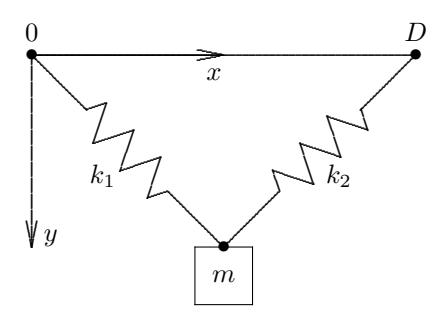

Figure 6.1: Spring-mass system.

An optimization problem can be expressed mathematically as the problem of determining an argument for which a given function has an extreme value (minimum or maximum) on a given domain. More formally, given a function  $f: \mathbb{R}^n \to \mathbb{R}$ , and a set  $S \subseteq \mathbb{R}^n$ , we seek  $\boldsymbol{x}^* \in S$  such that f attains a minimum on S at  $\boldsymbol{x}^*$ , i.e.,  $f(\boldsymbol{x}^*) \leq f(\boldsymbol{x})$  for all  $\boldsymbol{x} \in S$ . Such a point  $\boldsymbol{x}^*$  is called a *minimizer*, or simply a *minimum*, of f. A maximum of f is a minimum of -f, so it suffices to consider only minimization.

The objective function f may be linear or nonlinear, and it is usually assumed to be differentiable. The set S is usually defined by a set of equations and inequalities, called *constraints*, which may be linear or nonlinear. Any vector  $\mathbf{x} \in S$ , i.e., that satisfies the constraints, is called a *feasible point*, and S is called the *feasible set*. If  $S = \mathbb{R}^n$ , then the problem is *unconstrained*.

A general *continuous* optimization problem has the form

$$\min_{\boldsymbol{x}} f(\boldsymbol{x})$$
 subject to  $g(\boldsymbol{x}) = \boldsymbol{0}$  and  $h(\boldsymbol{x}) \leq \boldsymbol{0}$ ,

where  $f: \mathbb{R}^n \to \mathbb{R}$ ,  $g: \mathbb{R}^n \to \mathbb{R}^m$ , and  $h: \mathbb{R}^n \to \mathbb{R}^p$ . Optimization problems are classified by the properties of the functions involved. For example, if f, g, and h are all linear (or affine), then we have a *linear programming* problem. If any of the functions involved are nonlinear, then we have a *nonlinear programming* problem.

(The use of the term programming in optimization has nothing to do with computer programming, but instead refers to planning activities in the sense of operations research or management science.)

Example 6.2 Constrained Optimization. A simple example with n = 2 and m = 1, i.e., two variables and one constraint, is to minimize the surface area of a cylinder subject to a constraint on its volume:

$$\min_{\mathbf{x}} f(x_1, x_2) = 2\pi x_1(x_1 + x_2) \quad \text{subject to} \quad g(x_1, x_2) = \pi x_1^2 x_2 - V = 0,$$

where x<sup>1</sup> and x<sup>2</sup> are the radius and height of the cylinder and V is the required volume. The objective function f and constraint function g are both nonlinear in this instance. The solution to this problem, which we will compute in Example 6.6, minimizes the amount of material required to make a container of the given volume.

Before proceeding, we need to be a bit more precise about what we mean by a solution to an optimization problem. The concept of a minimum defined earlier is more properly called a global minimum, in that f(x ∗ ) ≤ f(x) for any feasible point x. Finding such a global minimum, or even verifying that a point is a global minimum after it has been found, is difficult unless the problem has special properties. Most optimization methods use local information, such as derivatives and Taylor series expansions, and consequently are designed to find only a local minimum, i.e., a feasible point x ∗ such that f(x ∗ ) ≤ f(x) for any feasible point x in some neighborhood of x ∗ . These concepts are illustrated for a one-dimensional problem in Fig. 6.2.

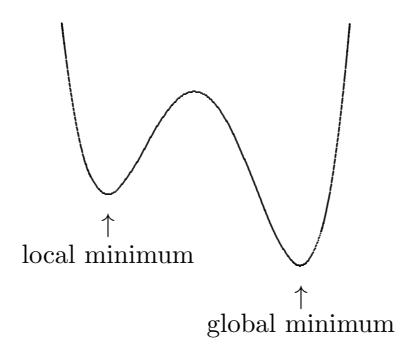

Figure 6.2: Local and global minima.

Unless the problem has special properties, there is usually no way to guarantee that a specific local minimum, or in particular a global minimum, will be found using conventional numerical methods. Often the best one can do is to start with an initial guess that is as close to the desired minimum as possible and hope that the iterative solution process will then converge to it. For some purposes, any local minimum may suffice. If a global minimum is required, however, then one might try several different starting points, widely scattered throughout the feasible set. If they all produce the same result, then there is a good chance that a global minimum has been found. If they produce different results, then taking the lowest of the local minima is the best one can do, but there may still be unexplored regions with even smaller values of the objective function.

For some important categories of problems, global optimization is much more tractable. For example, global solutions to linear programming problems, or more generally convex programming problems (defined later), are routinely obtained by very efficient methods. Global optimization for more general problems is an active area of research in which significant progress has been made, but the techniques employed are beyond the scope of this book; see Section 6.9 for references.

We also will not address discrete optimization problems—such as integer programming, in which the variables can take on only integer values—because such problems usually require combinatorial rather than numerical techniques. In addition to traditional combinatorial techniques, such as branch-and-bound, there has been a great deal of research on other approaches to discrete optimization, such as simulated annealing and genetic algorithms, but these topics are beyond the scope of this book.

# 6.2 Existence and Uniqueness

It is difficult to say anything conclusive about the existence or uniqueness of a solution to an optimization problem without making some assumptions about the objective function f and the feasible set S. A basic result from analysis is that if f is continuous on a closed and bounded set S ⊆ R <sup>n</sup>, then f has a global minimum on S. But if S is not closed or is unbounded, then f may have no local or global minimum on S. For example, the continuous function f(x) = x has no minimum on any open interval S = (a, b) or on the closed but unbounded set S = R. We will next consider some properties that ensure the existence of a global minimum even when the feasible set is unbounded, which includes the important case of unconstrained optimization.

A continuous function f on an unbounded set S ⊆ R <sup>n</sup> is said to be coercive if

$$\lim_{\|\boldsymbol{x}\| \to \infty} f(\boldsymbol{x}) = +\infty,$$

i.e., for any constant M, there is an r > 0 (depending on M) such that f(x) ≥ M for any x ∈ S such that kxk ≥ r. The importance of this concept, which says that f(x) must be large whenever kxk is large, is that if f is coercive on a closed, unbounded set S ⊆ R <sup>n</sup>, then f has a global minimum on S (see Exercise 6.10).

#### Example 6.3 Coercive and Noncoercive Functions.

- f(x) = x 2 is coercive on R because it has arbitrarily large positive values for arbitrarily large positive or negative arguments. It has a global minimum at x = 0.
- f(x) = x 3 is not coercive on R because it has arbitrarily large negative (rather than positive) values for arbitrarily large negative arguments. It has no global minimum.

- $f(x) = e^x$  is *not* coercive on  $\mathbb{R}$  because it does not have arbitrarily large positive values for arbitrarily large negative arguments. Though bounded below by 0, it has no global minimum.
- $f(x,y) = x^4 4xy + y^4$  is coercive on  $\mathbb{R}^2$ . This is less obvious because of the 4xy term, but observe that  $f(x,y) = (x^4 + y^4)(1 4xy/(x^4 + y^4))$ , and  $4xy/(x^4 + y^4) \to 0$  as  $||(x,y)|| \to +\infty$ . It has global minima at (-1,-1) and (1,1).
- f(x,y) = ax + by + c, where at least one of the real numbers a and b is nonzero, is *not* coercive on  $\mathbb{R}^2$ , because it has the constant value c on the unbounded line ax + by = 0. It has no global minimum.

A level set for a function  $f: S \subseteq \mathbb{R}^n \to \mathbb{R}$  is the set of all points in S for which the function has some given constant value. In  $\mathbb{R}^2$  level sets are sometimes called contour lines or simply contours (familiar from topographic maps and weather maps), and in  $\mathbb{R}^n$  they are sometimes called isosurfaces of the function (the ellipses in Fig. 6.5 are an illustrative example in  $\mathbb{R}^2$ ). We are also interested in the interior of the region whose boundary is a level set, i.e., the set of all points for which the function is less than or equal to a given constant value, so we define the sublevel set for a given  $\gamma \in \mathbb{R}$  to be

$$L_{\gamma} = \{ \boldsymbol{x} \in S : f(\boldsymbol{x}) \le \gamma \}.$$

Level and sublevel sets have many uses in optimization and elsewhere, but of most immediate interest here is the fact that if f is continuous on a set  $S \subseteq \mathbb{R}^n$  and has a nonempty sublevel set that is closed and bounded, then f has a global minimum on S (see Exercise 6.11). We note that if S is unbounded, then f is coercive on S if, and only if, all of its sublevel sets are bounded.

# 6.2.1 Convexity

We have now seen some useful existence results for optimization problems, but we have said nothing about uniqueness of solutions or the relationship between local and global minima. Little can be said about these issues, in general, without some additional assumptions. The most important of these is *convexity*. A set  $S \subseteq \mathbb{R}^n$  is *convex* if it contains the line segment between any two of its points, i.e.,

$$\{\alpha \boldsymbol{x} + (1-\alpha)\boldsymbol{y} \colon 0 \leq \alpha \leq 1\} \subseteq S$$

for all  $x, y \in S$ . Examples of some convex and nonconvex sets are shown in Fig. 6.3. A function  $f: S \subseteq \mathbb{R}^n \to \mathbb{R}$  is *convex* on a convex set S if its graph along any line segment in S lies *on or below* the chord connecting the function values at the endpoints of the segment, i.e., if

$$f(\alpha x + (1 - \alpha)y) \le \alpha f(x) + (1 - \alpha)f(y)$$

for all  $\alpha \in [0,1]$  and all  $x, y \in S$ . In the preceding definition, if strict inequality holds for all  $\alpha \in (0,1)$ , then f is said to be *strictly convex*. A convex function is

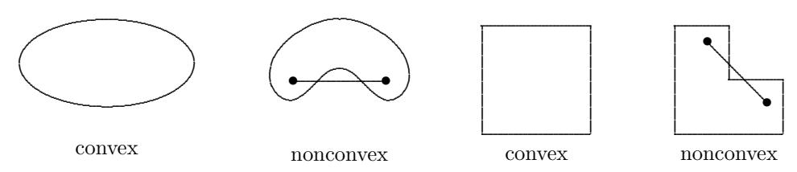

Figure 6.3: Examples of convex and nonconvex sets in  $\mathbb{R}^2$ . Each set includes interior of region bounded by closed curve.

strictly convex if its graph in  $\mathbb{R}^n \times \mathbb{R}$  contains no straight line segment. Examples of nonconvex, convex, and strictly convex functions in one dimension are shown in Fig. 6.4.

A number of important results follow from convexity. For example, if f is a convex function on a convex set S, then f is necessarily continuous at any interior point of S. Also, any sublevel set of a convex function is convex. But the most important such result is that any local minimum of a convex function f on a convex set  $S \subseteq \mathbb{R}^n$  is a global minimum of f on S. Moreover, any local minimum of a strictly convex function f on a convex set  $S \subseteq \mathbb{R}^n$  is the unique global minimum of f on f (see Exercise 6.12). Note that the latter result guarantees uniqueness but not the existence of a global minimum. If f is closed and bounded, of course, then existence is already assured. It turns out that if f is strictly convex on an unbounded set f is coercive on f has a (necessarily unique) minimum on f if, and only if, f is coercive on f.

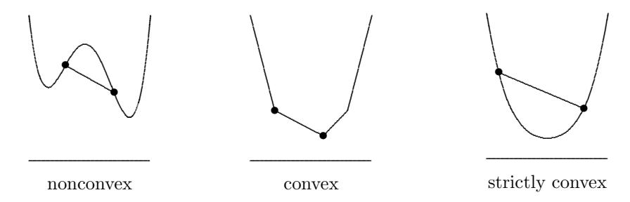

Figure 6.4: Examples of nonconvex, convex, and strictly convex functions in one dimension.

## 6.2.2 Unconstrained Optimality Conditions

The existence and uniqueness results we have cited thus far give no hint how to find a minimum or to verify that a point is indeed a minimum once it has been found. To do that, we will assume that the objective function f is smooth and then generalize to n dimensions the standard approach from one-dimensional calculus: set the first derivative equal to zero and then use the sign of the second derivative to determine whether the resulting solution is a minimum, a maximum, or an inflection point.

If  $f: \mathbb{R}^n \to \mathbb{R}$  is differentiable, then the vector-valued function  $\nabla f: \mathbb{R}^n \to \mathbb{R}^n$  defined by

$$\nabla f(\boldsymbol{x}) = \begin{bmatrix} \frac{\partial f(\boldsymbol{x})}{\partial x_1} \\ \frac{\partial f(\boldsymbol{x})}{\partial x_2} \\ \vdots \\ \frac{\partial f(\boldsymbol{x})}{\partial x_n} \end{bmatrix}$$

is called the *gradient* of f. An important fact about the gradient vector of a continuously differentiable function f is that it points "uphill" from f(x), and the negative gradient,  $-\nabla f(x)$ , points "downhill," i.e., toward points having lower function values than f(x). To see why this is true, recall from *Taylor's Theorem* that for any  $s \in \mathbb{R}^n$  we have

$$f(\boldsymbol{x} + \boldsymbol{s}) = f(\boldsymbol{x}) + \nabla f(\boldsymbol{x} + \alpha \boldsymbol{s})^T \boldsymbol{s}$$

for some  $\alpha \in (0,1)$ . Taking  $\mathbf{s} = -\nabla f(\mathbf{x})$  and using the continuity of  $\nabla f$  then shows that f decreases along  $-\nabla f(\mathbf{x})$  in some neighborhood of  $\mathbf{x}$ , provided  $\nabla f(\mathbf{x}) \neq \mathbf{0}$ . But if  $\mathbf{x}^*$  is a local minimum of f, then by definition there can be no such downhill direction, so we must have  $\nabla f(\mathbf{x}^*) = \mathbf{0}$ . Such an  $\mathbf{x}^*$  where  $\nabla f(\mathbf{x}^*) = \mathbf{0}$  is called a critical point of f (also sometimes called a stationary point or equilibrium point). We can conclude that if  $f: S \subseteq \mathbb{R}^n \to \mathbb{R}$  is continuously differentiable and  $\mathbf{x}^*$  is an interior point of S at which f has a local minimum, then  $\mathbf{x}^*$  must be a critical point of f. This is called a first-order necessary condition for a minimum, because it involves only first derivatives of the objective function.

**Example 6.4 Equilibrium.** Continuing with Example 6.1, a minimum of the potential energy must occur at a critical point of V, i.e., when  $\nabla V(x,y) = 0$ . We recall from mechanics that the force (a vector) is equal to the negative gradient of the potential energy (a scalar), i.e.,

$$\mathbf{F}(x,y) = -\nabla V(x,y).$$

Thus, the potential energy is minimized and the system is in equilibrium when the net force from the springs and gravity is zero. Such a physical interpretation explains the synonyms stationary point or equilibrium point for a critical point.

We have just seen that a necessary condition for an interior point x of S to be a local minimum of f is that x be a critical point, i.e.,  $\nabla f(x) = 0$ . The latter is a system of (usually nonlinear) equations, so we can use the methods of Chapter 5 to seek a critical point. If f is convex, then any critical point must be a global minimum, and we are done. In general, however, this necessary condition is not sufficient to guarantee even a local minimum: a critical point may be a minimum, a maximum, or neither (e.g., a saddle point, from which some directions are downhill and others are uphill). Thus, we need a criterion for classifying critical points and checking their optimality.

If  $f: \mathbb{R}^n \to \mathbb{R}$  is twice differentiable, then the matrix-valued function  $\mathbf{H}_f: \mathbb{R}^n \to \mathbb{R}^{n \times n}$  defined by

$$\boldsymbol{H}_{f}(\boldsymbol{x}) = \begin{bmatrix} \frac{\partial^{2} f(\boldsymbol{x})}{\partial x_{1}^{2}} & \frac{\partial^{2} f(\boldsymbol{x})}{\partial x_{1} \partial x_{2}} & \cdots & \frac{\partial^{2} f(\boldsymbol{x})}{\partial x_{1} \partial x_{n}} \\ \frac{\partial^{2} f(\boldsymbol{x})}{\partial x_{2} \partial x_{1}} & \frac{\partial^{2} f(\boldsymbol{x})}{\partial x_{2}^{2}} & \cdots & \frac{\partial^{2} f(\boldsymbol{x})}{\partial x_{2} \partial x_{n}} \\ \vdots & \vdots & \ddots & \vdots \\ \frac{\partial^{2} f(\boldsymbol{x})}{\partial x_{n} \partial x_{1}} & \frac{\partial^{2} f(\boldsymbol{x})}{\partial x_{n} \partial x_{2}} & \cdots & \frac{\partial^{2} f(\boldsymbol{x})}{\partial x_{n}^{2}} \end{bmatrix}$$

is called the *Hessian matrix* of f. Note that the Hessian matrix of f is simply the Jacobian matrix of the gradient,  $\nabla f$ . If the second partial derivatives of f are continuous, then  $\partial^2 f/\partial x_i \partial x_j = \partial^2 f/\partial x_j \partial x_i$ , and hence the Hessian matrix of f is symmetric.

Assume that  $f: \mathbb{R}^n \to \mathbb{R}$  is twice continuously differentiable, and let  $x^*$  be a critical point of f. According to Taylor's Theorem, for  $s \in \mathbb{R}^n$  we have

$$f(\boldsymbol{x}^* + \boldsymbol{s}) = f(\boldsymbol{x}^*) + \nabla f(\boldsymbol{x}^*)^T \boldsymbol{s} + \frac{1}{2} \boldsymbol{s}^T \boldsymbol{H}_f(\boldsymbol{x}^* + \alpha \boldsymbol{s}) \boldsymbol{s}$$

for some  $\alpha \in (0,1)$ . Since  $\boldsymbol{x}^*$  is a critical point, we have  $\nabla f(\boldsymbol{x}^*) = \boldsymbol{0}$ , so the term involving the Hessian matrix determines whether  $f(\boldsymbol{x}^*+\boldsymbol{s})$  is larger or smaller than  $f(\boldsymbol{x}^*)$ . If  $\boldsymbol{H}_f(\boldsymbol{x}^*)$  is positive definite at  $\boldsymbol{x}^*$ , then by continuity  $\boldsymbol{H}_f(\boldsymbol{x}^*+\alpha \boldsymbol{s})$  is also positive definite in some neighborhood of  $\boldsymbol{x}^*$ , and hence the value of f must increase near  $\boldsymbol{x}^*$ . We can conclude that if the Hessian matrix is positive definite at a critical point  $\boldsymbol{x}^*$ , then  $\boldsymbol{x}^*$  must be a local minimum of f. This is called a second-order sufficient condition for a minimum because it involves second derivatives of the objective function. By similar reasoning, we can classify critical points as follows. At a critical point  $\boldsymbol{x}^*$ , where  $\nabla f(\boldsymbol{x}^*) = \boldsymbol{0}$ , if  $\boldsymbol{H}_f(\boldsymbol{x}^*)$  is

- Positive definite, then  $x^*$  is a minimum of f.
- Negative definite, then  $x^*$  is a maximum of f.
- Indefinite, then  $x^*$  is a saddle point of f.
- Singular, then various pathological situations can occur.

The Hessian matrix also provides a practical test for convexity of a function. If  $f: S \subseteq \mathbb{R}^n \to \mathbb{R}$  is twice continuously differentiable on a convex set S and  $\mathbf{H}_f(\mathbf{x})$  is positive definite at a point  $\mathbf{x} \in S$ , then f is convex on some convex neighborhood of  $\mathbf{x}$ . Moreover, if  $\mathbf{H}_f(\mathbf{x})$  is positive definite at every  $\mathbf{x} \in S$ , then f is convex on S.

There are a number of ways to test a symmetric matrix for positive definiteness. One of the simplest and cheapest is to try to compute its Cholesky factorization: the Cholesky algorithm will succeed if, and only if, the matrix is positive definite (this approach requires a Cholesky factorization routine that fails gracefully when given an input matrix that is not positive definite). Another good method is to compute the inertia of the matrix (see Section 4.5.9) using a symmetric factorization of the form  $\boldsymbol{LDL}^T$ , as in Section 2.5.2. A much more expensive approach is to compute the eigenvalues of the matrix and check whether they are all positive.

Example 6.5 Classifying Critical Points. Consider the function f: R <sup>2</sup> → R,

$$f(\mathbf{x}) = 2x_1^3 + 3x_1^2 + 12x_1x_2 + 3x_2^2 - 6x_2 + 6,$$

whose gradient is given by

$$\nabla f(\mathbf{x}) = \begin{bmatrix} 6x_1^2 + 6x_1 + 12x_2 \\ 12x_1 + 6x_2 - 6 \end{bmatrix}.$$

Solving the nonlinear system ∇f(x) = 0 using any of the methods from Chapter 5, we obtain two critical points, [ 1 −1 ]<sup>T</sup> and [ 2 −3 ]<sup>T</sup> . To test them for optimality, we determine the Hessian matrix,

$$\boldsymbol{H}_f(\boldsymbol{x}) = \begin{bmatrix} 12x_1 + 6 & 12 \\ 12 & 6 \end{bmatrix}.$$

Note that H<sup>f</sup> is symmetric, as expected. Evaluating H<sup>f</sup> at each of the critical points, we obtain

$$\boldsymbol{H}_f(1,-1) = \begin{bmatrix} 18 & 12 \\ 12 & 6 \end{bmatrix},$$

which is not positive definite (its eigenvalues are approximately 25.4 and −1.4), and

$$\boldsymbol{H}_f(2,-3) = \begin{bmatrix} 30 & 12 \\ 12 & 6 \end{bmatrix},$$

which is positive definite (its eigenvalues are approximately 35.0 and 1.0). We conclude that [ 2 −3 ]<sup>T</sup> is a local minimum of f, whereas [ 1 −1 ]<sup>T</sup> is a saddle point.

## 6.2.3 Constrained Optimality Conditions

Thus far we have considered only minima that occur at an interior point of the feasible set, which of course is always the case for an unconstrained problem. But for constrained optimization, the solution often occurs on the boundary of the feasible set. When constraints are present, the fundamental principle remains the same: a minimum occurs at a point x <sup>∗</sup> when there is no downhill direction starting from x ∗ , but now we require that x <sup>∗</sup> ∈ S, where S is the feasible set, and we need consider only feasible directions, i.e., directions for which the constraints continue to be satisfied. More precisely, a nonzero vector s is a feasible direction at a point x <sup>∗</sup> ∈ S if there is an r > 0 such that x <sup>∗</sup> + αs ∈ S for all α ∈ [0, r]. A first-order necessary optimality condition is that for any feasible direction s,

$$\nabla f(\boldsymbol{x}^*)^T \boldsymbol{s} \ge 0,$$

which says that f is nondecreasing near x <sup>∗</sup> along any feasible direction. Note that at an interior point of S any direction is feasible, so this inequality must hold for both s and -s, which implies that  $\nabla f(x^*) = 0$ , which is the first-order necessary condition for an interior minimum that we saw previously. Similarly, a second-order necessary optimality condition is that in addition to the first-order condition,

$$\boldsymbol{s}^T \boldsymbol{H}_f(\boldsymbol{x}^*) \, \boldsymbol{s} \geq 0$$

for any feasible direction s, which says that  $H_f(x^*)$  is positive semidefinite for any feasible direction.

A convenient means of dealing with constraints, both theoretically and computationally, is provided by Lagrange multipliers. Consider the problem of minimizing a nonlinear function subject to nonlinear equality constraints,

$$\min_{\boldsymbol{x}} f(\boldsymbol{x})$$
 subject to  $\boldsymbol{g}(\boldsymbol{x}) = \boldsymbol{0}$ ,

where  $f: \mathbb{R}^n \to \mathbb{R}$  and  $g: \mathbb{R}^n \to \mathbb{R}^m$ , with  $m \leq n$ . A necessary condition for a feasible point  $x^*$  to be a solution to this problem is that the negative gradient of f lie in the space spanned by the constraint normals, i.e., that

$$-\nabla f(\boldsymbol{x}^*) = \boldsymbol{J}_q^T(\boldsymbol{x}^*) \, \boldsymbol{\lambda}^*$$

for some  $\lambda^* \in \mathbb{R}^m$ , where  $J_g(x)$  is the Jacobian matrix of g(x). The components of  $\lambda^*$  are called *Lagrange multipliers*. This necessary condition says that we cannot reduce the objective function without violating the constraints, and it motivates the definition of the *Lagrangian function*,  $\mathcal{L}: \mathbb{R}^{n+m} \to \mathbb{R}$ , given by

$$\mathcal{L}(\boldsymbol{x}, \boldsymbol{\lambda}) = f(\boldsymbol{x}) + \boldsymbol{\lambda}^T \boldsymbol{g}(\boldsymbol{x}),$$

whose gradient and Hessian are given by

$$\nabla \mathcal{L}(\boldsymbol{x},\boldsymbol{\lambda}) = \begin{bmatrix} \nabla_x \mathcal{L}(\boldsymbol{x},\boldsymbol{\lambda}) \\ \nabla_\lambda \mathcal{L}(\boldsymbol{x},\boldsymbol{\lambda}) \end{bmatrix} = \begin{bmatrix} \nabla f(\boldsymbol{x}) + \boldsymbol{J}_g^T(\boldsymbol{x})\boldsymbol{\lambda} \\ 
\boldsymbol{g}(\boldsymbol{x}) \end{bmatrix}$$

and

$$\begin{aligned} \boldsymbol{H}_{\mathcal{L}}(\boldsymbol{x},\boldsymbol{\lambda}) & \boldsymbol{J}_g^T(\boldsymbol{x}) \ \boldsymbol{J}_g(\boldsymbol{x}) & \boldsymbol{O} \end{bmatrix}, \end{aligned}$$

where

$$\bm{B}(\bm{x},\bm{\lambda}) = \nabla_{xx} \mathcal{L}(\bm{x},\bm{\lambda}) = \bm{H}_f(\bm{x}) + \sum_{i=1}^m \lambda_i \bm{H}_{g_i}(\bm{x}).$$

Together, the necessary condition and the requirement of feasibility say that we are looking for a critical point of the Lagrangian function, which is expressed by the system of n + m nonlinear equations in n + m unknowns

$$\nabla \mathcal{L}(\boldsymbol{x},\boldsymbol{\lambda}) = \left[ \begin{array}{c} \nabla f(\boldsymbol{x}) + \boldsymbol{J}_g^T(\boldsymbol{x}) \boldsymbol{\lambda} \\ \boldsymbol{g}(\boldsymbol{x}) \end{array} \right] = \boldsymbol{0}.$$

It is important to note that the block  $2 \times 2$  matrix  $H_{\mathcal{L}}(x, \lambda)$  is symmetric but cannot be positive definite, even if the matrix  $B(x, \lambda)$  is positive definite (in general,  $B(x, \lambda)$  is not positive definite, but the Lagrangian function is sometimes

augmented by a "penalty" term so that its Hessian matrix will be positive definite). Thus, a critical point of  $\mathcal{L}(x,\lambda)$  is necessarily a saddle point rather than a minimum or maximum.

If the Hessian of the Lagrangian is never positive definite, even at a constrained minimum, then how can we check a critical point of the Lagrangian for optimality? It turns out that a sufficient condition for a constrained minimum is that the matrix  $B(x^*, \lambda^*)$  at the critical point be positive definite on the tangent space to the constraint surface, which is simply the null space of  $J_g(x^*)$  (i.e., the set of all vectors orthogonal to the rows of  $J_g(x^*)$ ). If Z is a matrix whose columns form a basis for this subspace, then we check whether the symmetric matrix  $Z^TBZ$ , called the projected (or reduced) Hessian, is positive definite. This condition says that we need positive definiteness only with respect to locally feasible directions (i.e., parallel to the constraint surface), for movement orthogonal to the constraint surface would violate the constraints. A suitable matrix Z can be obtained from an orthogonal factorization of  $J_g(x^*)^T$  (see Section 3.4.5).

**Example 6.6 Equality-Constrained Optimality.** To illustrate the concepts just introduced, we apply them to the equality-constrained optimization problem in Example 6.2. For

$$f(x_1, x_2) = 2\pi x_1(x_1 + x_2)$$
 and  $g(x_1, x_2) = \pi x_1^2 x_2 - V$ ,

we have

$$\nabla f(\boldsymbol{x}) = 2\pi \left[ \begin{array}{c} 2x_1 + x_2 \\ x_1 \end{array} \right] \quad \text{and} \quad \boldsymbol{J}_g(\boldsymbol{x}) = \pi \left[ \, 2x_1 x_2 \quad x_1^2 \, \right].$$

Thus, the system of equations to be solved is

$$\nabla \mathcal{L}(\boldsymbol{x},\boldsymbol{\lambda}) = \begin{bmatrix} \nabla f(\boldsymbol{x}) + \boldsymbol{J}_g^T(\boldsymbol{x}) \boldsymbol{\lambda} \\ \boldsymbol{g}(\boldsymbol{x}) \end{bmatrix} = \pi \begin{bmatrix} 2(2x_1 + x_2 + x_1x_2\lambda) \\ 2x_1 + x_1^2\lambda \\ x_1^2x_2 - V/\pi \end{bmatrix} = \boldsymbol{0}.$$

Assuming the container is to hold one liter, or  $V = 1000 \text{ cm}^3$ , we solve this nonlinear system by any of the methods in Section 5.6 to obtain the approximate solution  $x_1 = 5.4 \text{ cm}$ ,  $x_2 = 10.8 \text{ cm}$ ,  $\lambda = -0.37$ . To confirm the optimality of this solution, we compute

$$\bm{H}_f(\bm{x}) = 2\pi \begin{bmatrix} 2 & 1 \ 1 & 0 \end{bmatrix} \quad \text{and} \quad \bm{H}_g(\bm{x}) = 2\pi \begin{bmatrix} x_2 & x_1 \ x_1 & 0 \end{bmatrix},$$

so that

$$\boldsymbol{B}(\boldsymbol{x}^*, \boldsymbol{\lambda}^*) = 2\pi \begin{bmatrix} 2 + x_2 \lambda & 1 + x_1 \lambda \\ 1 + x_1 \lambda & 0 \end{bmatrix} = \begin{bmatrix} -12.6 & -6.3 \\ -6.3 & 0 \end{bmatrix}.$$

This matrix is not positive definite (its eigenvalues are approximately -15.2 and 2.6), but that is to be expected, since the solution must be a saddle point of  $\mathcal{L}$ . To consider the appropriate subspace, we compute a null vector z (i.e., a basis for the one-dimensional null space) for  $J_g(x^*) = \begin{bmatrix} 369 & 92.3 \end{bmatrix}$  and obtain  $z = \begin{bmatrix} -0.243 & 0.970 \end{bmatrix}^T$ , so that

$$z^T B z = 2.23,$$

which is positive, confirming that the point found is indeed a constrained minimum. The optimal function value is  $f(x^*) = 554$  cm<sup>2</sup> of surface area.

When there are inequality constraints, i.e., when the problem has the form

$$\min_{x} f(x)$$
 subject to  $g(x) = 0$  and  $h(x) \leq 0$ ,

where  $f: \mathbb{R}^n \to \mathbb{R}$ ,  $g: \mathbb{R}^n \to \mathbb{R}^m$ , and  $h: \mathbb{R}^n \to \mathbb{R}^p$  are suitably smooth, the optimality conditions become more complicated. We can still define the Lagrangian function as before, including both the equality constraints g and inequality constraints h, but some of the inequality constraints may be irrelevant to the solution. A given inequality constraint  $h_i(x) \leq 0$  is said to be *active* (or *binding*) at a feasible point x if  $h_i(x) = 0$ ; an equality constraint is always active. If a given inequality constraint  $h_i$  is inactive at a constrained local minimum  $x^*$ , then the corresponding Lagrange multiplier  $\lambda_i^*$  must be zero. Thus, either  $h_i(x^*) = 0$  or  $\lambda_i^* = 0$ , which is conveniently stated as a *complementarity condition*  $h_i(x^*)\lambda_i^* = 0$ . We will assume the *constraint qualification* that the Jacobian matrix of the set of active constraints has full row rank. Under these assumptions, if  $x^*$  is a constrained local minimum, then there exists a vector of Lagrange multipliers  $\lambda^* \in \mathbb{R}^{m+p}$  such that the following conditions hold:

- 1.  $\nabla_x \mathcal{L}(\boldsymbol{x}^*, \boldsymbol{\lambda}^*) = \mathbf{0}$ ,
- $2. \ \boldsymbol{g}(\boldsymbol{x}^*) = \boldsymbol{0},$
- 3.  $h(x^*) \leq 0$ ,
- 4.  $\lambda_i^* \ge 0, \ i = m+1, \dots, m+p,$
- 5.  $h_i(\mathbf{x}^*)\lambda_i^* = 0, \ i = m+1, \dots, m+p.$

These first-order necessary conditions are known as the Karush-Kuhn-Tucker (or KKT) conditions for a constrained local minimum. Second-order necessary and sufficient conditions analogous to those for the equality-constrained case can be defined by focusing on the active constraints, but we will not go into these details.

**Example 6.7 Inequality-Constrained Optimality.** As a simple illustration of inequality-constrained optimization, we minimize quadratic function

$$f(\mathbf{x}) = 0.5x_1^2 + 2.5x_2^2$$

subject to the inequality constraint

$$h(x) = x_2 - x_1 + 1 \le 0.$$

The unconstrained minimum of f occurs at the origin, which is infeasible, so the constraint must be active at the solution. The Lagrangian function is given by

$$\mathcal{L}(\boldsymbol{x}, \lambda) = f(\boldsymbol{x}) + \lambda^T h(\boldsymbol{x}) = 0.5x_1^2 + 2.5x_2^2 + \lambda(x_2 - x_1 + 1),$$

where the Lagrange multiplier  $\lambda$  is a scalar in this instance because there is only one constraint. Now

$$\nabla f(\bm{x}) = \left[ \begin{array}{c} x_1 \ 5x_2 \end{array} \right] \quad \text{and} \quad \bm{J}_h(\bm{x}) = \left[ \begin{array}{c} -1 & 1 \end{array} \right],$$

so we have

$$\nabla_x \mathcal{L}(\boldsymbol{x}, \lambda) = \nabla f(\boldsymbol{x}) + \boldsymbol{J}_h^T(\boldsymbol{x}) \lambda = \begin{bmatrix} x_1 \\ 5x_2 \end{bmatrix} + \lambda \begin{bmatrix} -1 \\ 1 \end{bmatrix}.$$

The optimality conditions require that the solution must satisfy the system of equations

$$\begin{bmatrix} \nabla_x \mathcal{L}(\boldsymbol{x}, \lambda) \\ h(\boldsymbol{x}) \end{bmatrix} = \begin{bmatrix} x_1 - \lambda \\ 5x_2 + \lambda \\ x_2 - x_1 + 1 \end{bmatrix} = \mathbf{0},$$

which in this case is a linear system whose matrix formulation is

$$\begin{bmatrix} 1 & 0 & -1 \\ 0 & 5 & 1 \\ -1 & 1 & 0 \end{bmatrix} \begin{bmatrix} x_1 \\ x_2 \\ \lambda \end{bmatrix} = \begin{bmatrix} 0 \\ 0 \\ -1 \end{bmatrix}.$$

Solving this system, we obtain the solution

$$x_1 = 0.833, \quad x_2 = -0.167, \quad \lambda = 0.833.$$

The solution is illustrated in Fig. 6.5. The necessary conditions for optimality require that the negative gradient of the objective function be in alignment with the gradient of the constraint (as indicated by the two sets of arrows in the drawing), and that the point lie on the line  $x_2 - x_1 + 1 = 0$ . The only point satisfying both requirements is the solution we computed, indicated by a bullet in the diagram. Note that  $\lambda$  is positive, as required.

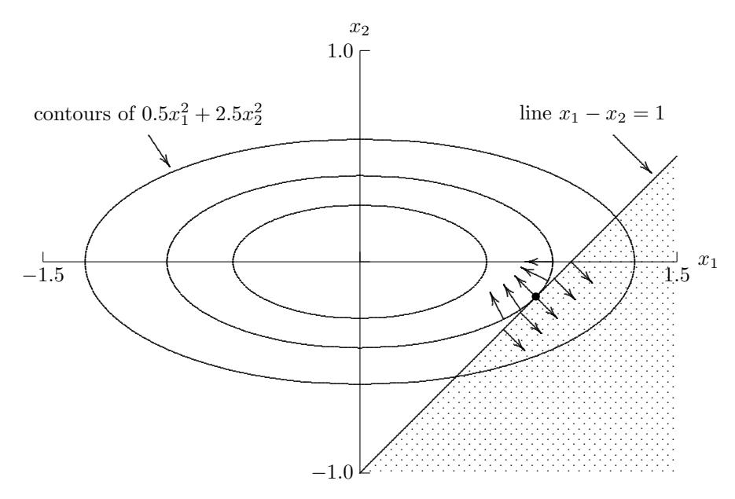

Figure 6.5: Solution to constrained optimization problem. Feasible region is shaded.

# 6.3 Sensitivity and Conditioning

We have just seen that minimizing a function and solving an equation are intimately related, but the solution to an optimization problem is inherently more sensitive than the solution to an equation. We observed in Sections 1.2.6 and 5.3 that a simple root  $x^*$  of an equation f(x) = 0 in one dimension has absolute condition number  $1/|f'(x^*)|$ , which means that for a point  $\hat{x}$  at which  $|f(\hat{x})| \leq \epsilon$ , the error  $|\hat{x} - x^*|$  in the solution may be as large as  $\epsilon/|f'(x^*)|$ . To derive a comparable result for minimizing a function in one dimension, we consider the Taylor series

$$f(\hat{x}) = f(x^* + h) = f(x^*) + f'(x^*)h + \frac{1}{2}f''(x^*)h^2 + \mathcal{O}(h^3).$$

At a minimum of f we have  $f'(x^*) = 0$ , so that  $f(\hat{x}) \approx f(x^*) + \frac{1}{2}f''(x^*)h^2$ , and hence  $h^2 \approx 2(f(\hat{x}) - f(x^*))/f''(x^*)$ , provided that  $f''(x^*) \neq 0$ . This means that for a point  $\hat{x}$  at which  $|f(\hat{x}) - f(x^*)| \leq \epsilon$ , the error  $|\hat{x} - x^*|$  in the solution may be as large as  $\sqrt{2\epsilon/|f''(x^*)|}$ . If  $\epsilon$  represents the accuracy with which the function can be computed, then having  $|f(\hat{x}) - f(x^*)| \leq \epsilon$  is as good a result as we can expect, yet the error  $|\hat{x} - x^*|$  can be much larger, even if  $|f''(x^*)|$  is of reasonable size. If  $\epsilon = \epsilon_{\rm mach}$ , for example, and  $|f''(x^*)|$  is of order 1, then the error is about  $\sqrt{\epsilon_{\rm mach}}$ . Thus, based on function values alone, the solution can be computed to only about half as many digits of accuracy as the underlying machine precision.

This result should not be surprising because a minimum of a function is analogous to a multiple root of a nonlinear equation: in either case a horizontal tangent implies that the function is locally approximately parallel to the x axis, so that the function values are relatively insensitive, and accordingly the solution is poorly determined. This fact should be kept in mind when selecting an error tolerance for an optimization problem: an unrealistically tight tolerance may drive up the cost of computing a solution without producing a concomitant gain in accuracy.

Greater accuracy may be attainable, however, if derivatives of the objective function are available, since we can then directly solve the nonlinear equation f'(x) = 0, which usually does *not* have a horizontal tangent. The absolute condition number of a simple root  $x^*$  of f'(x) = 0 is  $1/|f''(x^*)|$ , which means that for a point  $\hat{x}$  at which  $|f'(\hat{x})| \leq \epsilon$ , the error  $|\hat{x} - x^*|$  in the solution may be as large as  $\epsilon/|f''(x^*)|$ . The latter is likely to be much smaller than our previous bound on the error unless  $|f''(x^*)|$  is extremely small.

All of these observations generalize to unconstrained minimization in n dimensions. If  $f: \mathbb{R}^n \to \mathbb{R}$  is suitably smooth, then we have the Taylor series

$$f(\hat{\boldsymbol{x}}) = f(\boldsymbol{x}^* + h\boldsymbol{s}) = f(\boldsymbol{x}^*) + h\nabla f(\boldsymbol{x}^*)^T\boldsymbol{s} + \frac{1}{2}h^2\boldsymbol{s}^T\boldsymbol{H}_f(\boldsymbol{x}^*)\boldsymbol{s} + \mathcal{O}(h^3),$$

where  $|h| = ||\hat{x} - x^*||$  and ||s|| = 1. At a minimum  $x^*$  of f we have  $\nabla f(x^*) = 0$  and  $H_f(x^*)$  positive definite, so that

$$h^2 \approx \frac{2 \left( f(\hat{\boldsymbol{x}}) - f(\boldsymbol{x}^*) \right)}{\boldsymbol{s}^T \boldsymbol{H}_f(\boldsymbol{x}^*) \, \boldsymbol{s}},$$

and hence if  $\hat{x}$  is a point such that  $|f(\hat{x}) - f(x^*)| \le \epsilon$ , then a bound on the error is given by

$$\|\hat{\boldsymbol{x}} - \boldsymbol{x}^*\|^2 \lessapprox \frac{2\epsilon}{\boldsymbol{s}^T \boldsymbol{H}_f(\boldsymbol{x}^*) \, \boldsymbol{s}} \le \frac{2\epsilon}{\lambda_{\min}},$$

where  $\lambda_{\min}$  is the smallest eigenvalue of  $\boldsymbol{H}_f(\boldsymbol{x}^*)$ . That the sensitivity of the solution  $\boldsymbol{x}^*$  depends on the Hessian matrix  $\boldsymbol{H}_f(\boldsymbol{x}^*)$  is not surprising, since this matrix determines the shape of the contours (level sets) of f near  $\boldsymbol{x}^*$ . If  $\boldsymbol{H}_f(\boldsymbol{x}^*)$  is ill-conditioned, then the contours of f will be relatively long and thin along some directions (namely eigenvectors of  $\boldsymbol{H}_f(\boldsymbol{x}^*)$  corresponding to relatively small eigenvalues), and the solution  $\boldsymbol{x}^*$  will be highly sensitive, and the value of f correspondingly insensitive, to perturbations in those directions.

Analyzing the sensitivity of a solution to a constrained optimization problem is significantly more complicated, and we will merely highlight the main issues. For an equality-constrained problem,  $\min f(x)$  subject to g(x) = 0, the error in the solution can be resolved into two components, one parallel to the constraint surface and the other orthogonal to the constraint surface. The sensitivity of the component parallel to the constraints depends on the conditioning of the projected Hessian matrix  $\mathbf{Z}^T \mathbf{B}(x^*, \lambda^*) \mathbf{Z}$  (see Section 6.2.3), much as in the unconstrained case just considered. The sensitivity of the component orthogonal to the constraints depends on the magnitudes of the Lagrange multipliers, which in turn depend on the conditioning of the Jacobian matrix  $\mathbf{J}_g^T(x^*)$  of the constraint function g. In particular, the larger a given Lagrange multiplier, the more influential the corresponding constraint is on the solution. If the Jacobian matrix  $\mathbf{J}_g^T(x^*)$  is nearly rank deficient, then the Lagrange multipliers will be highly sensitive and the resulting solution will likely be inaccurate.

# 6.4 Optimization in One Dimension

We begin with methods for optimization in one dimension, which is an important problem in its own right, and will also be a key subproblem in many algorithms for optimization in higher dimensions. First, we need a way of bracketing a minimum in an interval, analogous to the way we used a sign change for bracketing solutions to nonlinear equations in one dimension. A function  $f: \mathbb{R} \to \mathbb{R}$  is unimodal on an interval [a,b] if there is a unique  $x^* \in [a,b]$  such that  $f(x^*)$  is the minimum value of f on [a,b], and for any  $x_1,x_2 \in [a,b]$  with  $x_1 < x_2$ ,

$$x_2 < x^* \text{ implies } f(x_1) > f(x_2) \text{ and } x_1 > x^* \text{ implies } f(x_1) < f(x_2).$$

Thus, f(x) is strictly decreasing for  $x \leq x^*$  and strictly increasing for  $x \geq x^*$ . The significance of this property is that it will enable us to refine an interval containing a solution by computing sample values of the function within the interval and discarding portions of the interval according to the function values obtained, analogous to bisection for solving nonlinear equations.

#### 6.4.1 Golden Section Search

Suppose f is unimodal on [a,b], and let  $x_1, x_2 \in [a,b]$  with  $x_1 < x_2$ . Comparing the function values  $f(x_1)$  and  $f(x_2)$  and using the unimodality property allows us to discard a subinterval, either  $(x_2,b]$  or  $[a,x_1)$ , and know that the minimum of the function lies within the remaining subinterval. In particular, if  $f(x_1) < f(x_2)$ ,

then the minimum cannot lie in the interval  $(x_2, b]$ , and if  $f(x_1) > f(x_2)$ , then the minimum cannot lie in the interval  $[a, x_1)$ . Thus, we are left with a shorter interval, either  $[a, x_2]$  or  $[x_1, b]$ , within which we already have one function value, either  $f(x_1)$  or  $f(x_2)$ , respectively. Hence, we will need to compute only one new function evaluation to repeat this process.

To make consistent progress in reducing the length of the interval containing the minimum, each new pair of points should have the same relative positions within the new interval that the previous pair had within the previous interval. Such an arrangement will enable us to reduce the length of the interval by a fixed fraction at each iteration, much as we reduced the length by half at each iteration of the bisection method for computing a zero of a function.

To accomplish this objective, we choose the relative positions of the two points within the current interval to be  $\tau$  and  $1-\tau$ , where  $\tau^2=1-\tau$ , so that  $\tau=(\sqrt{5}-1)/2\approx 0.618$  and  $1-\tau\approx 0.382$ . With this choice, no matter which subinterval is retained, its length will be  $\tau$  relative to the previous interval, and the interior point retained will be at position either  $\tau$  or  $1-\tau$  relative to the new interval. Thus, we will need to compute only one new function value, at the complementary point, to continue the iteration. This choice of sample points is called *golden section search*, after the "golden ratio,"  $(1+\sqrt{5})/2\approx 1.618$ , of antiquity. The complete procedure is shown in Algorithm 6.1, for which the initial input is a function f, an interval [a,b] on which f is unimodal, and an error tolerance tol. For a unimodal function, golden section search is safe but slowly convergent. Specifically, its convergence rate is linear, with r=1 and  $C\approx 0.618$ .

#### Algorithm 6.1 Golden Section Search

```
\tau = (\sqrt{5} - 1)/2
x_1 = a + (1 - \tau)(b - a)
f_1 = f(x_1)
x_2 = a + \tau(b - a)
                                                     ļ
                                                     İ
f_2 = f(x_2)
while ((b-a) > tol) do
                                                     ı
    if (f_1 > f_2) then
                                                     a
                                                                x_1
                                                                        x_2
         a = x_1
         x_1 = x_2
         f_1 = f_2
         x_2 = a + \tau(b - a)
         f_2 = f(x_2)
                                                                        x_1
                                                                            x_2
    else
                                                                 1
                                                                        1
         b=x_2
         x_2 = x_1
         f_2 = f_1
                                                                x_1
                                                                        x_2
         x_1 = a + (1 - \tau)(b - a)
                                                                        \downarrow
         f_1 = f(x_1)
    end
                                                            x_1
                                                                x_2
end
```

**Example 6.8 Golden Section Search.** We illustrate golden section search by using it to minimize the function

$$f(x) = 0.5 - xe^{-x^2}.$$

Starting with the initial interval [0, 2], we evaluate the function at points  $x_1 = 0.764$  and  $x_2 = 1.236$ , obtaining  $f(x_1) = 0.074$  and  $f(x_2) = 0.232$ . Because  $f(x_1) < f(x_2)$ , we know that the minimum must lie in the interval  $[a, x_2]$ , and thus we may replace b by  $x_2$  and repeat the process. The first iteration is depicted in Fig. 6.6, and the full sequence of iterates is given next.

| $x_1$    | $f(x_1)$ | $x_2$    | $f(x_2)$ |
|----------|----------|----------|----------|
| 0.763932 | 0.073809 | 1.236068 | 0.231775 |
| 0.472136 | 0.122204 | 0.763932 | 0.073809 |
| 0.763932 | 0.073809 | 0.944272 | 0.112868 |
| 0.652476 | 0.073740 | 0.763932 | 0.073809 |
| 0.583592 | 0.084857 | 0.652476 | 0.073740 |
| 0.652476 | 0.073740 | 0.695048 | 0.071243 |
| 0.695048 | 0.071243 | 0.721360 | 0.071291 |
| 0.678787 | 0.071815 | 0.695048 | 0.071243 |
| 0.695048 | 0.071243 | 0.705098 | 0.071122 |
| 0.705098 | 0.071122 | 0.711310 | 0.071133 |
| 0.701260 | 0.071147 | 0.705098 | 0.071122 |
| 0.705098 | 0.071122 | 0.707471 | 0.071118 |
| 0.707471 | 0.071118 | 0.708937 | 0.071121 |
| 0.706565 | 0.071118 | 0.707471 | 0.071118 |

Note that the function values are relatively insensitive near the minimum, as expected (see Section 6.3).

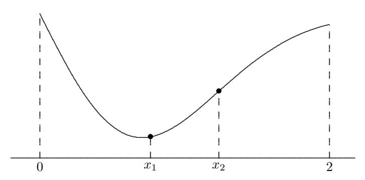

Figure 6.6: First iteration of golden section search for example problem.

Although unimodality plays a role in one-dimensional optimization similar to that played by a sign change in root finding, there are important practical differences. A sign change brackets a root of an equation regardless of how large the bracketing interval may be. The same is true of unimodality, but in practice most

functions cannot be expected to be unimodal unless both endpoints of the interval are reasonably near a minimum, or unless the function has a special property such as convexity. Thus, more trial and error may be required to find a suitable starting interval for one-dimensional optimization than is typically required for root finding. In practice, one might simply search for three points such that the value of the objective function is greater at the two outer points than at the intermediate point. Although golden section search always converges, it is not guaranteed to find the global minimum, or even a local minimum, unless the objective function is unimodal on the starting interval.

## 6.4.2 Successive Parabolic Interpolation

As we have seen, golden section search for optimization is analogous in a number of ways to bisection for solving a nonlinear equation; in particular, golden section search makes no use of the function values other than to compare them. As with nonlinear equations, faster methods can be obtained by making greater use of the function values, such as fitting them with some simpler function. Fitting a straight line to two points, as in the secant method, is of no value for optimization because the resulting linear function has no minimum. Instead, we must use a polynomial of degree at least two.

The simplest example of this approach is successive parabolic interpolation. Initially, the function f to be minimized is evaluated at three points and a quadratic polynomial is fit to the three resulting function values. The minimum of the resulting parabola, assuming it has one, is then taken as a new approximate minimum of the function. One of the previous points is then dropped and the process repeated until convergence. At a given iteration, we have three points, say u, v, and w, with corresponding function values fu, fv, and fw, respectively, where v is the best approximate minimum thus far. The minimum of the parabola interpolating the three function values is given by v − p/q, where

$$p = (v-u)^{2}(f_{v}-f_{w}) - (v-w)^{2}(f_{v}-f_{u}),$$
  

$$q = 2((v-u)(f_{v}-f_{w}) - (v-w)(f_{v}-f_{u})).$$

We now replace u by w, w by v, and v by the new approximate minimum v−p/q and repeat until convergence. This process is illustrated in Fig. 6.7. Successive parabolic interpolation is not guaranteed to converge, but under normal circumstances if started close enough to a minimum it converges superlinearly with convergence rate r ≈ 1.324.

Example 6.9 Successive Parabolic Interpolation. We illustrate successive parabolic interpolation by using it to minimize the function from Example 6.8,

$$f(x) = 0.5 - xe^{-x^2}.$$

We evaluate the function at three points, say, x<sup>0</sup> = 0, x<sup>1</sup> = 1.2, and x<sup>2</sup> = 0.6, obtaining f(x0) = 0.5, f(x1) = 0.216, f(x2) = 0.081. We fit a parabola to these three points and take its minimizer, x<sup>3</sup> = 0.754, to be the next approximation to

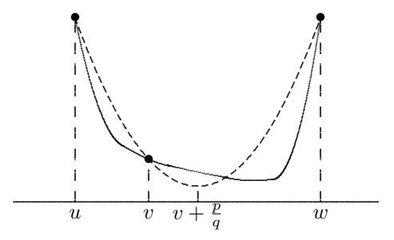

Figure 6.7: Successive parabolic iteration for minimizing a function.

the solution. We then discard  $x_0$  and repeat the process with the three remaining points. The first iteration is depicted in Fig. 6.8, and the full sequence of iterates is given next.

| k | $x_k$    | $f(x_k)$ |
|---|----------|----------|
| 0 | 0.000000 | 0.500000 |
| 1 | 1.200000 | 0.215687 |
| 2 | 0.600000 | 0.081394 |
| 3 | 0.754267 | 0.072981 |
| 4 | 0.720797 | 0.071278 |
| 5 | 0.708374 | 0.071119 |
| 6 | 0.706920 | 0.071118 |
| 7 | 0.707103 | 0.071118 |

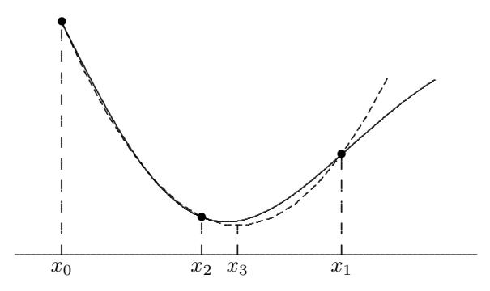

Figure 6.8: First iteration of successive parabolic iteration for example problem.

#### 6.4.3 Newton's Method

A local quadratic approximation to the objective function is useful because the minimum of a quadratic is easy to compute. Another way to obtain a local quadratic approximation is to use a truncated Taylor series expansion,

$$f(x+h) \approx f(x) + f'(x)h + \frac{1}{2}f''(x)h^2$$
.

By differentiation, we find that the minimum of this quadratic function of h is given by h = −f 0 (x)/f<sup>00</sup>(x). This result suggests the iteration scheme shown in Algorithm 6.2, which is equivalent to Newton's method for solving the nonlinear equation f 0 (x) = 0 (compare with Algorithm 5.2). As usual, Newton's method for finding a minimum normally has a quadratic convergence rate. Unless it is started near the desired minimum, however, Newton's method may fail to converge, or it may converge to a maximum or to an inflection point of the function.

#### Algorithm 6.2 Newton's Method for One-Dimensional Optimization

```
x0 = initial guess
for k = 0, 1, 2, . . .
    xk+1 = xk − f
                    0
                     (xk)/f00(xk)
end
```

Example 6.10 Newton's Method. We illustrate Newton's method by using it to minimize the function from Example 6.8,

$$f(x) = 0.5 - xe^{-x^2}.$$

The first and second derivatives of f are given by

$$f'(x) = (2x^2 - 1)e^{-x^2}$$
 and  $f''(x) = 2x(3 - 2x^2)e^{-x^2}$ ,

so the Newton iteration for finding a minimum of f is given by

$$x_{k+1} = x_k - (2x_k^2 - 1)/(2x_k(3 - 2x_k^2)).$$

Using x<sup>0</sup> = 1 as starting guess, we obtain the sequence of iterates shown next.

| k | xk       | f(xk)    |
|---|----------|----------|
| 0 | 1.000000 | 0.132121 |
| 1 | 0.500000 | 0.110600 |
| 2 | 0.700000 | 0.071162 |
| 3 | 0.707072 | 0.071118 |
| 4 | 0.707107 | 0.071118 |

## 6.4.4 Safeguarded Methods

As with solving nonlinear equations in one dimension, slow-but-sure and fast-butrisky optimization methods can be combined to provide both safety and efficiency. A fast method is tried at each iteration, but an interval bracketing the solution is also maintained so that a safe method can be used instead whenever the fast method generates an iterate that lies outside the interval. Once close enough to the solution, rapid convergence should be attained by the fast method. Most library routines for one-dimensional optimization are based on such a hybrid approach. One popular combination, which requires no derivatives of the objective function, is golden section search and successive parabolic interpolation.

## 6.5 Unconstrained Optimization

We next consider multidimensional unconstrained optimization, which has a number of features in common with both one-dimensional optimization and with solving systems of nonlinear equations in n dimensions.

#### 6.5.1 Direct Search

Recall that golden section search for one-dimensional optimization makes no use of the objective function values other than to compare them. Direct search methods for multidimensional optimization share this property, although they do not retain the convergence guarantee of golden section search. Perhaps the best known of these is the method of Nelder and Mead, which is implemented in the fminsearch function of MATLAB. To seek a minimum of a function  $f: \mathbb{R}^n \to \mathbb{R}$ , the function is first evaluated at each of n+1 starting points, no three of which are collinear (i.e., the points form a simplex in  $\mathbb{R}^n$ ). A new point is generated along the straight line from the worst current point through the centroid of the other points. This new point then replaces the worst point, and the process is repeated until convergence. The algorithm involves several parameters that determine how far to move along the line and how much to expand or contract the simplex, depending on whether a given iteration is successful in generating a point with a still-lower function value. Direct search methods are especially useful for nonsmooth objective functions, for which few other methods are applicable, and they can be effective when n is small, but they tend to be quite expensive when n is larger than two or three. There has been renewed interest in direct search methods, however, because they are relatively easily parallelized.

## 6.5.2 Steepest Descent

As expected, greater use of the objective function and its derivatives leads to faster methods. Recall from Section 6.2.2 that the negative gradient of a differentiable function  $f: \mathbb{R}^n \to \mathbb{R}$  points downhill, i.e., toward points having lower function values, from any point  $\boldsymbol{x}$  such that  $\nabla f(\boldsymbol{x}) \neq \boldsymbol{0}$ . In fact,  $-\nabla f(\boldsymbol{x})$  is locally the direction of steepest descent for the function f in the sense that the value of the function initially decreases more rapidly along the direction of the negative gradient than along any other direction. Thus, the negative gradient is a potentially fruitful direction in which to seek points having lower function values, but it gives no indication how far to go in that direction.

The maximum possible benefit from movement in any downhill direction would be to attain the minimum of the objective function along that direction. For any fixed x and direction s, we can define a function  $\phi: \mathbb{R} \to \mathbb{R}$  by

$$\phi(\alpha) = f(\boldsymbol{x} + \alpha \boldsymbol{s}).$$

In this way the problem of minimizing the objective function f along direction s from s is seen to be a one-dimensional optimization problem that can be solved by one of the methods discussed in Section 6.4. Because we are minimizing the

objective function only along a fixed line in R <sup>n</sup>, such a procedure is called a line search. Taking s = −∇f(x) as the direction for such a line search yields one of the oldest and simplest methods for multidimensional optimization, the steepest descent method, shown in Algorithm 6.3. Once the minimum is found in a given direction, the negative gradient is computed at the new point and the process is repeated until convergence.

#### Algorithm 6.3 Steepest Descent

```
x0 = initial guess
for k = 0, 1, 2, . . .
   sk = −∇f(xk)
   Choose αk to minimize f(xk + αksk)
   xk+1 = xk + αksk
end
                                              { compute negative gradient }
                                              { perform line search }
                                              { update solution }
```

The steepest descent method is very reliable in that it can always make progress provided the gradient is nonzero. But as Example 6.11 demonstrates, the method is rather myopic in its view of the behavior of the function, and the resulting iterates can zigzag back and forth, making very slow progress toward a solution. In general, the convergence rate of steepest descent is only linear, with a constant factor that can be arbitrarily close to 1, depending on the specific objective function f.

Example 6.11 Steepest Descent. We illustrate the steepest descent method by using it to minimize the function

$$f(\mathbf{x}) = 0.5x_1^2 + 2.5x_2^2,$$

whose gradient is given by

$$\nabla f(\boldsymbol{x}) = \begin{bmatrix} x_1 \\ 5x_2 \end{bmatrix}.$$

If we take x<sup>0</sup> = [ 5 1 ]<sup>T</sup> as starting point, the gradient is ∇f(x0) = [ 5 5 ]<sup>T</sup> . One-dimensional minimization of f as a function of α along the negative gradient direction gives α<sup>0</sup> = 1/3, so that the next approximation is

$$x_1 = x_0 + \alpha_0 s_0 = x_0 - \alpha_0 \nabla f(x_0) = \begin{bmatrix} 5 \\ 1 \end{bmatrix} - \frac{1}{3} \begin{bmatrix} 5 \\ 5 \end{bmatrix} = \begin{bmatrix} 3.333 \\ -0.667 \end{bmatrix}.$$

We then evaluate the gradient at this new point to determine the next search direction and repeat the process. The resulting sequence of iterates is shown numerically in the following table and graphically in Fig. 6.9, where the ellipses represent contours on which the function f has a constant value. The gradient direction at any given point is always normal to the level curve passing through that point. Note that the minimum along a given search direction occurs when the gradient at the new point is orthogonal to the search direction. The sequence of iterates given by steepest descent is converging slowly toward the solution, which for this problem is at the origin, where the minimum function value is zero.

| k | $\boldsymbol{x}_k^T$ |        | $f(\boldsymbol{x}_k)$ | $\nabla f(\boldsymbol{x}_k)^T$ |        |
|---|----------------------|--------|-----------------------|--------------------------------|--------|
| 0 | 5.000                | 1.000  | 15.000                | 5.000                          | 5.000  |
| 1 | 3.333                | -0.667 | 6.667                 | 3.333                          | -3.333 |
| 2 | 2.222                | 0.444  | 2.963                 | 2.222                          | 2.222  |
| 3 | 1.481                | -0.296 | 1.317                 | 1.481                          | -1.481 |
| 4 | 0.988                | 0.198  | 0.585                 | 0.988                          | 0.988  |
| 5 | 0.658                | -0.132 | 0.260                 | 0.658                          | -0.658 |
| 6 | 0.439                | 0.088  | 0.116                 | 0.439                          | 0.439  |
| 7 | 0.293                | -0.059 | 0.051                 | 0.293                          | -0.293 |
| 8 | 0.195                | 0.039  | 0.023                 | 0.195                          | 0.195  |
| 9 | 0.130                | -0.026 | 0.010                 | 0.130                          | -0.130 |

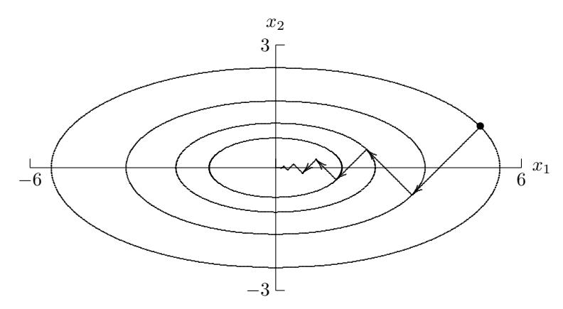

Figure 6.9: Convergence of steepest descent.

#### 6.5.3 Newton's Method

A broader view of the objective function can be gained from a local quadratic approximation, which can be obtained from the truncated Taylor series expansion

$$f(\boldsymbol{x} + \boldsymbol{s}) \approx f(\boldsymbol{x}) + \nabla f(\boldsymbol{x})^T \boldsymbol{s} + \frac{1}{2} \boldsymbol{s}^T \boldsymbol{H}_f(\boldsymbol{x}) \boldsymbol{s},$$

where  $\mathbf{H}_f(\mathbf{x})$  is the *Hessian matrix* of second partial derivatives of f,  $\{\mathbf{H}_f(\mathbf{x})\}_{ij} = \partial^2 f(\mathbf{x})/\partial x_i \partial x_j$ . This quadratic function in  $\mathbf{s}$  is minimized when

$$\boldsymbol{H}_f(\boldsymbol{x})\,\boldsymbol{s} = -\nabla f(\boldsymbol{x}),$$

which suggests the iterative scheme shown in Algorithm 6.4. The Hessian matrix is the Jacobian matrix of the gradient, so this approach is equivalent to Newton's method for solving the nonlinear system  $\nabla f(\boldsymbol{x}) = \mathbf{0}$  (compare with Algorithm 5.4). The convergence rate of Newton's method for unconstrained optimization is normally quadratic. As usual, however, Newton's method is unreliable unless started close enough to the solution.

#### Algorithm 6.4 Newton's Method for Unconstrained Optimization

```
x0 = initial guess
for k = 0, 1, 2, . . .
    Solve Hf (xk) sk = −∇f(xk) for sk
    xk+1 = xk + sk
end
                                                 { compute Newton step }
                                                 { update solution }
```

Example 6.12 Newton's Method. We illustrate Newton's method by using it to minimize the function from Example 6.11,

$$f(\mathbf{x}) = 0.5x_1^2 + 2.5x_2^2,$$

whose gradient and Hessian are given by

$$\nabla f(\bm{x}) = \left[ \begin{array}{c} x_1 \\ 5x_2 \end{array} \right] \quad {\rm and} \quad \bm{H}_f(\bm{x}) = \left[ \begin{array}{c} 1 & 0 \\ 0 & 5 \end{array} \right].$$

If we take x<sup>0</sup> = [ 5 1 ]<sup>T</sup> as starting point, the gradient is ∇f(x0) = [ 5 5 ]<sup>T</sup> . The linear system to be solved for the Newton step is therefore

$$\begin{bmatrix} 1 & 0 \\ 0 & 5 \end{bmatrix} s_0 = \begin{bmatrix} -5 \\ -5 \end{bmatrix},$$

whose solution is s<sup>0</sup> = [ −5 −1 ], and hence the next approximate solution is

$$\boldsymbol{x}_1 = \boldsymbol{x}_0 + \boldsymbol{s}_0 = \begin{bmatrix} 5 \\ 1 \end{bmatrix} + \begin{bmatrix} -5 \\ -1 \end{bmatrix} = \begin{bmatrix} 0 \\ 0 \end{bmatrix},$$

which is the exact solution for this problem. That Newton's method has converged in a single iteration in this case should not be surprising, since the function being minimized is a quadratic. Of course, the quadratic model used by Newton's method is not exact in general, but nevertheless it enables Newton's method to take a more global view of the problem, yielding much more rapid asymptotic convergence than the steepest descent method.

Intuitively, unconstrained minimization is like finding the bottom of a bowl by rolling a marble down the side. If the bowl is oblong, then the marble will rock back and forth along the valley before eventually settling at the bottom, analogous to the zigzagging path taken by the steepest descent method. With Newton's method, the metric of the space is redefined so that the bowl becomes circular, and hence the marble rolls directly to the bottom.

Unlike the steepest descent method, Newton's method does not require a line search parameter because the quadratic model determines an appropriate length as well as direction for the step to the next approximate solution. When started far from a solution, however, it may still be advisable to perform a line search along the direction of the Newton step  $s_k$  in order to make the method more robust (this procedure is sometimes called the *damped Newton method*). Once the iterates are near the solution, then the value  $\alpha_k = 1$  for the line search parameter should suffice for subsequent iterations.

An alternative to a line search is a trust-region method, in which an estimate is maintained of the radius of a sphere within which the quadratic model is sufficiently accurate for the computed Newton step to be reliable (see Section 5.6.4), and the next approximate solution is constrained to lie within that trust region. If the current trust radius is binding, minimizing the quadratic model function subject to this constraint may modify the direction as well as the length of the Newton step, as illustrated in Fig. 6.10. The accuracy of the quadratic model at a given step is assessed by comparing the actual decrease in the objective function value with the decrease predicted by the quadratic model, and the trust radius is then increased or decreased accordingly. Once near a solution, the trust radius should be large enough to permit full Newton steps, yielding rapid local convergence.

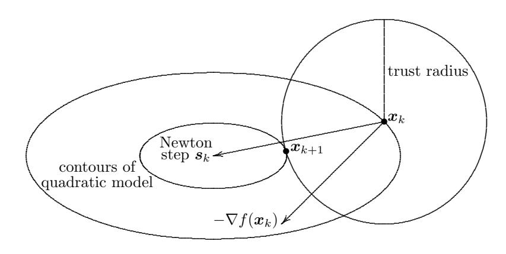

Figure 6.10: Modification of Newton step in trust-region method.

If the objective function f has continuous second partial derivatives, then the Hessian matrix  $\mathbf{H}_f$  is symmetric; and near a minimum it is positive definite (see Section 6.2.2). Thus, the linear system for the Newton step  $\mathbf{s}_k$  can be solved by Cholesky factorization, requiring only about half of the work required by LU factorization. Far from a minimum, however,  $\mathbf{H}_f(\mathbf{x}_k)$  may not be positive definite and thus a symmetric indefinite factorization (see Section 2.5.2) may be required. If  $\mathbf{H}_f$  is not positive definite, then the resulting Newton step  $\mathbf{s}_k$  is not necessarily a descent direction for the function, i.e., we may not have

$$\nabla f(\boldsymbol{x}_k)^T \boldsymbol{s}_k < 0.$$

In this case, an alternative descent direction can be used, such as the negative gradient or a direction of negative curvature (i.e., a vector  $\mathbf{p}_k$  such that  $\mathbf{p}_k^T \mathbf{H}_f(\mathbf{x}_k) \mathbf{p}_k < 0$ , which can be obtained readily from a symmetric indefinite factorization of  $\mathbf{H}_f(\mathbf{x}_k)$ ),

along which a line search can be performed. Another alternative is to modify the Hessian matrix so that it becomes positive definite, e.g., replace H<sup>f</sup> (xk) with H<sup>f</sup> (xk) + µI, where µ is a scalar chosen so that the modified matrix is positive definite. As µ varies, the resulting computed step varies between the usual Newton step s<sup>k</sup> and the steepest descent direction −∇f(xk). Such alternative measures should become unnecessary once the approximate solution is sufficiently close to the desired minimum, so that the ultimate quadratic convergence rate of Newton's method can still be attained.

#### 6.5.4 Quasi-Newton Methods

Newton's method usually converges very rapidly once it nears a solution, but it requires a substantial amount of work per iteration; specifically, for a problem with a dense Hessian matrix, each iteration requires O(n 2 ) scalar function evaluations to form the gradient vector and Hessian matrix and O(n 3 ) arithmetic operations to solve the linear system for the Newton step. Many variants of Newton's method have been developed to reduce its overhead or improve its reliability, or both. These quasi-Newton methods have the general form

$$\boldsymbol{x}_{k+1} = \boldsymbol{x}_k - \alpha_k \boldsymbol{B}_k^{-1} \nabla f(\boldsymbol{x}_k),$$

where α<sup>k</sup> is a line search parameter and B<sup>k</sup> is some approximation to the Hessian matrix obtained in any of a number of ways, including secant updating, finite differences, periodic reevaluation, or neglecting some terms in the true Hessian of the objective function.

Many quasi-Newton methods are more robust than the pure Newton method and have considerably lower overhead per iteration, yet remain superlinearly (though not quadratically) convergent. For example, secant updating methods for optimization, which we will consider next, require no second derivative evaluations, require only one gradient evaluation per iteration, and solve the necessary linear system at each iteration by updating methods that require only O(n 2 ) work rather than the O(n 3 ) work that would be required by a matrix factorization at each step. These substantial savings in work per iteration more than offset the somewhat slower convergence rate (generally superlinear but not quadratic), so that these methods usually take less total time to compute a solution.

## 6.5.5 Secant Updating Methods

As with secant updating methods for solving nonlinear equations, the motivation for secant updating methods for optimization is to reduce the work per iteration of Newton's method and possibly improve its robustness. One could simply use Broyden's method (see Section 5.6.3) to seek a zero of the gradient, but this approach would not preserve the symmetry of the Hessian matrix. Several secant updating formulas for unconstrained minimization have been developed that not only preserve symmetry in the approximate Hessian matrix but also preserve positive definiteness. Symmetry reduces the amount of work and storage required by about half, and positive definiteness guarantees that the resulting quasi-Newton step will be a descent direction.

One of the most effective of these secant updating methods for optimization, called BFGS after the initials of its four co-inventors, is shown in Algorithm 6.5. In practice, a factorization of  $\mathbf{B}_k$  is updated rather than  $\mathbf{B}_k$  itself, so that the linear system for the quasi-Newton step  $\mathbf{s}_k$  can be solved at a cost per iteration of  $\mathcal{O}(n^2)$  rather than  $\mathcal{O}(n^3)$  operations. Note that unlike Newton's method for optimization, no second derivatives are required. These methods are often started with  $\mathbf{B}_0 = \mathbf{I}$ , which means that the initial step is along the negative gradient (i.e., the direction of steepest descent), and then second derivative information is gradually built up in the approximate Hessian matrix by updating over successive iterations.

#### Algorithm 6.5 BFGS Method for Unconstrained Optimization

```
 \begin{aligned} & \boldsymbol{x}_0 = \text{initial guess} \\ & \boldsymbol{B}_0 = \text{initial Hessian approximation} \\ & \textbf{for } k = 0, 1, 2, \dots \\ & \text{Solve } \boldsymbol{B}_k \, \boldsymbol{s}_k = -\nabla f(\boldsymbol{x}_k) \text{ for } \boldsymbol{s}_k \\ & \boldsymbol{x}_{k+1} = \boldsymbol{x}_k + \boldsymbol{s}_k \\ & \boldsymbol{y}_k = \nabla f(\boldsymbol{x}_{k+1}) - \nabla f(\boldsymbol{x}_k) \\ & \boldsymbol{B}_{k+1} = \boldsymbol{B}_k + (\boldsymbol{y}_k \boldsymbol{y}_k^T)/(\boldsymbol{y}_k^T \boldsymbol{s}_k) \\ & - (\boldsymbol{B}_k \boldsymbol{s}_k \boldsymbol{s}_k^T \boldsymbol{B}_k)/(\boldsymbol{s}_k^T \boldsymbol{B}_k \boldsymbol{s}_k) \end{aligned} \quad \left\{ \begin{array}{l} \text{compute quasi-Newton step } \} \\ \text{update solution } \} \\ \text{update approximate Hessian } \} \\ & - (\boldsymbol{B}_k \boldsymbol{s}_k \boldsymbol{s}_k^T \boldsymbol{B}_k)/(\boldsymbol{s}_k^T \boldsymbol{B}_k \boldsymbol{s}_k) \end{array} \right.
```

Like most secant updating methods, BFGS normally has a superlinear convergence rate, even though the approximate Hessian does not necessarily converge to the true Hessian. A line search can also be used to enhance the effectiveness of the method. Indeed, for a quadratic objective function, if an exact line search is performed at each iteration, then the BFGS method terminates at the exact solution in at most n iterations, where n is the dimension of the problem.

**Example 6.13 BFGS Method.** We illustrate the BFGS method by using it to minimize the function from Example 6.11,

$$f(\mathbf{x}) = 0.5x_1^2 + 2.5x_2^2,$$

whose gradient is given by

$$\nabla f(\boldsymbol{x}) = \begin{bmatrix} x_1 \\ 5x_2 \end{bmatrix}.$$

Starting with  $x_0 = \begin{bmatrix} 5 & 1 \end{bmatrix}^T$  and  $B_0 = I$ , the initial step is simply the negative gradient, so

$$\bm{x}_1 = \bm{x}_0 + \bm{s}_0 = \begin{bmatrix} 5 \\ 1 \end{bmatrix} + \begin{bmatrix} -5 \\ -5 \end{bmatrix} = \begin{bmatrix} 0 \\ -4 \end{bmatrix}.$$

Updating the approximate Hessian according to the BFGS formula, we obtain

$$\boldsymbol{B}_1 = \begin{bmatrix} 0.667 & 0.333 \\ 0.333 & 4.667 \end{bmatrix}.$$

| A new step is now computed and the process continued. | The resulting sequence of |
|-------------------------------------------------------|---------------------------|
| iterates is shown next.                               |                           |

| k | $\boldsymbol{x}_k^T$ |        | $f(\boldsymbol{x}_k)$ | $\nabla f(\boldsymbol{x}_k)^T$ |         |
|---|----------------------|--------|-----------------------|--------------------------------|---------|
| 0 | 5.000                | 1.000  | 15.000                | 5.000                          | 5.000   |
| 1 | 0.000                | -4.000 | 40.000                | 0.000                          | -20.000 |
| 2 | -2.222               | 0.444  | 2.963                 | -2.222                         | 2.222   |
| 3 | 0.816                | 0.082  | 0.350                 | 0.816                          | 0.408   |
| 4 | -0.009               | -0.015 | 0.001                 | -0.009                         | -0.077  |
| 5 | -0.001               | 0.001  | 0.000                 | -0.001                         | 0.005   |

The increase in function value on the first iteration could have been avoided by using a line search.

## 6.5.6 Conjugate Gradient Method

The conjugate gradient method is another alternative to Newton's method that does not require explicit second derivatives. Indeed, unlike secant updating methods, the conjugate gradient method does not even store an approximation to the Hessian matrix, which makes it especially suitable for very large problems.

As we saw in Section 6.5.2, the steepest descent method tends to search in the same directions repeatedly, leading to very slow convergence. As its name suggests, the *conjugate gradient method*, shown in Algorithm 6.6, also uses gradients, but it avoids repeatedly searching the same directions by modifying the new gradient at each step to remove components in previous directions. The resulting sequence of *conjugate* (i.e., orthogonal in the inner product  $(x, y) = x^T H_f y$ ) search directions implicitly accumulates information about the Hessian matrix as iterations proceed. Details of the motivation for this method are discussed in Section 11.5.5.

## Algorithm 6.6 Conjugate Gradient Method for Unconstrained Optimization

```
 \begin{aligned} & \boldsymbol{x}_0 = \text{initial guess} \\ & \boldsymbol{g}_0 = \nabla f(\boldsymbol{x}_0) \\ & \boldsymbol{s}_0 = -\boldsymbol{g}_0 \\ & \text{for } k = 0, 1, 2, \dots \\ & \text{Choose } \alpha_k \text{ to minimize } f(\boldsymbol{x}_k + \alpha_k \boldsymbol{s}_k) \\ & \boldsymbol{x}_{k+1} = \boldsymbol{x}_k + \alpha_k \boldsymbol{s}_k \\ & \boldsymbol{g}_{k+1} = \nabla f(\boldsymbol{x}_{k+1}) \\ & \boldsymbol{\beta}_{k+1} = (\boldsymbol{g}_{k+1}^T \boldsymbol{g}_{k+1})/(\boldsymbol{g}_k^T \boldsymbol{g}_k) \\ & \boldsymbol{s}_{k+1} = -\boldsymbol{g}_{k+1} + \beta_{k+1} \boldsymbol{s}_k \end{aligned} \qquad \left\{ \begin{array}{ll} \text{perform line search } \} \\ \text{compute new gradient } \} \\ & \text{end} \end{aligned} \right.
```

The formula for  $\beta_{k+1}$  used in Algorithm 6.6 is due to Fletcher and Reeves. An alternative formula due to Polak and Ribiere,

$$\beta_{k+1} = ((\boldsymbol{g}_{k+1} - \boldsymbol{g}_k)^T \boldsymbol{g}_{k+1}) / (\boldsymbol{g}_k^T \boldsymbol{g}_k),$$

is equivalent for quadratic functions with exact line searches but tends to perform better than the Fletcher-Reeves formula for general nonlinear functions with inexact line searches. Theoretically, the conjugate gradient method is exact after at most n iterations for a quadratic objective function in n dimensions, but it is usually quite effective for more general unconstrained optimization problems as well. It is common to restart the algorithm after every n iterations by reinitializing to use the negative gradient at the current point.

Example 6.14 Conjugate Gradient Method. We illustrate the conjugate gradient method by using it to minimize the function from Example 6.11,

$$f(\mathbf{x}) = 0.5x_1^2 + 2.5x_2^2,$$

whose gradient is given by

$$\nabla f(\boldsymbol{x}) = \begin{bmatrix} x_1 \\ 5x_2 \end{bmatrix}.$$

Starting with x<sup>0</sup> = [ 5 1 ]<sup>T</sup> , the initial search direction is the negative gradient,

$$s_0 = -g_0 = -\nabla f(x_0) = \begin{bmatrix} -5 \\ -5 \end{bmatrix}.$$

The exact minimum along this line is given by α<sup>0</sup> = 1/3, so that the next approximation is x<sup>1</sup> = [ 3.333 −0.667 ]<sup>T</sup> , at which point we compute the new gradient,

$$\mathbf{g}_1 = \nabla f(\mathbf{x}_1) = \begin{bmatrix} 3.333 \\ -3.333 \end{bmatrix}.$$

So far there is no difference from the steepest descent method. At this point, however, rather than search along the new negative gradient, we compute instead the quantity

$$\beta_1 = (\boldsymbol{g}_1^T \boldsymbol{g}_1) / (\boldsymbol{g}_0^T \boldsymbol{g}_0) = 0.444,$$

which gives as the next search direction

$$\boldsymbol{s}_1 = -\boldsymbol{g}_1 + \beta_1 \boldsymbol{s}_0 = \begin{bmatrix} -3.333 \\ 3.333 \end{bmatrix} + 0.444 \begin{bmatrix} -5 \\ -5 \end{bmatrix} = \begin{bmatrix} -5.556 \\ 1.111 \end{bmatrix}.$$

The minimum along this direction is given by α<sup>1</sup> = 0.6, which gives the exact solution at the origin. Thus, as expected for a quadratic function, the conjugate gradient method converges in n = 2 steps in this case.

## 6.5.7 Truncated or Inexact Newton Methods

Another way of potentially reducing the work per iteration of Newton's method or its variants is to use an iterative method (see Section 11.5) to solve the linear system for the Newton or quasi-Newton step,

$$\boldsymbol{B}_k \boldsymbol{s}_k = -\nabla f(\boldsymbol{x}_k),$$

where  $B_k$  is the true or approximate Hessian matrix, rather than using a direct method based on factorization of  $B_k$ . One advantage is that only a few iterations of the iterative method may suffice to produce a step that is just as useful as the true Newton step. Indeed, far from a minimum the true Newton step may offer no special advantage, yet can be very costly to compute accurately. Such an approach is called an *inexact* or *truncated* Newton method, because the linear system for the Newton step is solved inexactly by terminating the iterative linear solver before convergence.

If  $B_k$  is positive definite, then a good choice for the iterative linear solver is the conjugate gradient method (see Section 11.5.5). The conjugate gradient method begins with the negative gradient vector and eventually converges to the true Newton step, so truncating the iterations produces a step that is intermediate between these two vectors and is always a descent direction when  $B_k$  is positive definite. Moreover, since the conjugate gradient method requires only matrix-vector products, the Hessian matrix need not be formed explicitly, which can mean a substantial savings in storage. To supply the product  $B_k v$ , for example, the finite difference approximation

$$\boldsymbol{B}_k \boldsymbol{v} \approx \frac{\nabla f(\boldsymbol{x}_k + h\boldsymbol{v}) - \nabla f(\boldsymbol{x}_k)}{h}$$

can be computed instead, without ever forming  $B_k$ .

In implementing a truncated Newton method, the termination criterion for the inner iteration must be chosen carefully to preserve the superlinear (or quadratic) convergence rate of the outer iteration. In addition, special measures may be required if the matrix  $\boldsymbol{B}_k$  is not positive definite. Nevertheless, truncated Newton methods are usually very effective in practice and are among the best methods available for large sparse problems.

# 6.6 Nonlinear Least Squares

Least squares data fitting can be viewed as an optimization problem. Given data points  $(t_i, y_i)$ , i = 1, ..., m, we wish to find the vector  $\mathbf{x} \in \mathbb{R}^n$  of parameters that gives the best fit in the least squares sense to the model function  $f(t, \mathbf{x})$ , where  $f: \mathbb{R}^{n+1} \to \mathbb{R}$ . In Chapter 3 we considered only the case in which the model function f is linear in the components of  $\mathbf{x}$ ; we are now in a position to consider nonlinear least squares as a special case of nonlinear optimization.

If we define the components of the *residual* function  $r: \mathbb{R}^n \to \mathbb{R}^m$  by

$$r_i(\mathbf{x}) = y_i - f(t_i, \mathbf{x}), \quad i = 1, ..., m,$$

then we wish to minimize the function

$$\phi(\boldsymbol{x}) = \frac{1}{2} \, \boldsymbol{r}(\boldsymbol{x})^T \boldsymbol{r}(\boldsymbol{x}),$$

i.e., the sum of squares of the residual components (the factor  $\frac{1}{2}$  is inserted for later convenience and has no effect on the optimal value for x). The gradient vector and Hessian matrix of  $\phi$  are given by

$$\nabla \phi(\boldsymbol{x}) = \boldsymbol{J}^T(\boldsymbol{x}) \, \boldsymbol{r}(\boldsymbol{x})$$

and

$$\boldsymbol{H}_{\phi}(\boldsymbol{x}) = \boldsymbol{J}^T(\boldsymbol{x}) \, \boldsymbol{J}(\boldsymbol{x}) + \sum_{i=1}^m r_i(\boldsymbol{x}) \, \boldsymbol{H}_{r_i}(\boldsymbol{x}),$$

where J(x) is the Jacobian matrix of r(x), and H<sup>r</sup><sup>i</sup> (x) denotes the Hessian matrix of the component function ri(x). Thus, if we apply Newton's method and x<sup>k</sup> is an approximate solution, then the Newton step s<sup>k</sup> is given by the linear system

$$\left(\boldsymbol{J}^T(\boldsymbol{x}_k)\boldsymbol{J}(\boldsymbol{x}_k) + \sum_{i=1}^m r_i(\boldsymbol{x}_k)\boldsymbol{H}_{r_i}(\boldsymbol{x}_k)\right)\boldsymbol{s}_k = -\boldsymbol{J}^T(\boldsymbol{x}_k)\boldsymbol{r}(\boldsymbol{x}_k).$$

The m Hessian matrices H<sup>r</sup><sup>i</sup> of the residual components are usually inconvenient and expensive to compute. Fortunately, we can exploit the special structure of this problem to avoid computing them in most cases, as we will see next.

## 6.6.1 Gauss-Newton Method

Note that in H<sup>φ</sup> each of the Hessian matrices H<sup>r</sup><sup>i</sup> is multiplied by the corresponding residual component function r<sup>i</sup> , which should be small at a solution if the model function fits the data reasonably well. This feature motivates the Gauss-Newton method for nonlinear least squares, in which the terms involving H<sup>r</sup><sup>i</sup> are dropped from the Hessian and the linear system

$$\left(\boldsymbol{J}^T(\boldsymbol{x}_k)\,\boldsymbol{J}(\boldsymbol{x}_k)\right)\boldsymbol{s}_k = -\boldsymbol{J}^T(\boldsymbol{x}_k)\,\boldsymbol{r}(\boldsymbol{x}_k)$$

determines an approximate Newton step s<sup>k</sup> at each iteration. We recognize this system as the normal equations (see Section 3.2.1) for the m×n linear least squares problem

$$\boldsymbol{J}(\boldsymbol{x}_k)\,\boldsymbol{s}_k\cong -\boldsymbol{r}(\boldsymbol{x}_k),$$

which can be solved more reliably by orthogonal factorization of J(xk) (see Section 3.5). The next approximate solution is then given by

$$\boldsymbol{x}_{k+1} = \boldsymbol{x}_k + \boldsymbol{s}_k,$$

and the process is repeated until convergence. In effect, the Gauss-Newton method replaces a nonlinear least squares problem by a sequence of linear least squares problems whose solutions converge to the solution of the original nonlinear problem.

Example 6.15 Gauss-Newton Method. We illustrate the Gauss-Newton method for nonlinear least squares by fitting the nonlinear model function

$$f(t, \boldsymbol{x}) = x_1 e^{x_2 t}$$

to the four data points

$$\begin{array}{c|ccccc} t & 0.0 & 1.0 & 2.0 & 3.0 \\ y & 2.0 & 0.7 & 0.3 & 0.1 \end{array}.$$

For this model function, the entries of the Jacobian matrix of the residual function r are given by

$$\{\boldsymbol{J}(\boldsymbol{x})\}_{i,1} = \frac{\partial r_i(\boldsymbol{x})}{\partial x_1} = -e^{x_2 t_i}, \qquad \{\boldsymbol{J}(\boldsymbol{x})\}_{i,2} = \frac{\partial r_i(\boldsymbol{x})}{\partial x_2} = -x_1 t_i e^{x_2 t_i},$$

i = 1, . . . , 4. If we take x<sup>0</sup> = [ 1 0 ]<sup>T</sup> as starting point, then the linear least squares problem to be solved for the Gauss-Newton step s<sup>0</sup> is

$$\bm{J}(\bm{x}_0)\,\bm{s}_0 = \begin{bmatrix} -1 & 0 \ -1 & -1 \ -1 & -2 \ -1 & -3 \end{bmatrix} \bm{s}_0 \cong \begin{bmatrix} -1 \ 0.3 \ 0.7 \ 0.9 \end{bmatrix} = -\bm{r}(\bm{x}_0).$$

The least squares solution to this system is s<sup>0</sup> = [ 0.69 −0.61 ]<sup>T</sup> . We then take x<sup>1</sup> = x<sup>0</sup> + s<sup>0</sup> = [ 1.69 −0.61 ]<sup>T</sup> as the next approximate solution and repeat the process until convergence. The resulting sequence of iterates is shown next.

| k | T<br>x<br>k |        | 2<br>kr(xk)k<br>2 |
|---|-------------|--------|-------------------|
| 0 | 1.000       | 0.000  | 2.390             |
| 1 | 1.690       | −0.610 | 0.212             |
| 2 | 1.975       | −0.930 | 0.007             |
| 3 | 1.994       | −1.004 | 0.002             |
| 4 | 1.995       | −1.009 | 0.002             |
| 5 | 1.995       | −1.010 | 0.002             |

Like all methods based on Newton's method, the Gauss-Newton method for solving nonlinear least squares problems may fail to converge unless it is started close enough to the solution. A line search can be used to improve its robustness, but additional modifications may be necessary to ensure that the computed step s<sup>k</sup> is a descent direction when far from the solution. In addition, if the residual components at the solution are relatively large, then the terms omitted from the Hessian matrix may not be negligible, in which case the Gauss-Newton approximation may be inaccurate, so that the method converges slowly at best and may not converge at all. In such "large-residual" cases, it may be best to use a general nonlinear optimization method that takes into account the full Hessian matrix.

# 6.6.2 Levenberg-Marquardt Method

The Levenberg-Marquardt method is a useful alternative when the Gauss-Newton approximation yields an ill-conditioned or rank-deficient linear least squares subproblem. At each iteration of this method, the linear system for the step s<sup>k</sup> is of the form

$$\left(\boldsymbol{J}^T(\boldsymbol{x}_k)\,\boldsymbol{J}(\boldsymbol{x}_k) + \mu_k \boldsymbol{I}\right)\boldsymbol{s}_k = -\boldsymbol{J}^T(\boldsymbol{x}_k)\,\boldsymbol{r}(\boldsymbol{x}_k),$$

where µ<sup>k</sup> is a nonnegative scalar parameter chosen by some strategy. The corresponding linear least squares problem to be solved is

$$\begin{bmatrix} \bm{J}(\bm{x}_k) \ \sqrt{\mu_k}\bm{I} \end{bmatrix}\bm{s}_k\cong\begin{bmatrix} -\bm{r}(\bm{x}_k) \ 0 \end{bmatrix}.$$

This method, which is an example of a general technique known as regularization (see Section 8.5), can be variously interpreted as replacing the terms omitted from the true Hessian by a scalar multiple of the identity matrix, or as shifting the spectrum of the approximate Hessian to make it positive definite (or equivalently, as boosting the rank of the corresponding least squares problem), or as using a weighted combination of the Gauss-Newton step and the steepest descent direction. With a suitable strategy for choosing the parameter µk, typically based on a trustregion approach, the Levenberg-Marquardt method can be very robust in practice, and it forms the basis for several effective software packages for solving nonlinear least squares problems.

# 6.7 Constrained Optimization

We turn now to methods for constrained optimization, first considering equalityconstrained problems, which have the form

$$\min_{\boldsymbol{x}} f(\boldsymbol{x})$$
 subject to  $g(\boldsymbol{x}) = \mathbf{0}$ ,

where f: R <sup>n</sup> → R and g: R <sup>n</sup> → R <sup>m</sup>, with m ≤ n.

## 6.7.1 Sequential Quadratic Programming

As we saw in Section 6.2.3, a constrained local minimum must be a critical point of the Lagrangian function

$$\mathcal{L}(\boldsymbol{x}, \boldsymbol{\lambda}) = f(\boldsymbol{x}) + \boldsymbol{\lambda}^T \boldsymbol{g}(\boldsymbol{x}),$$

where λ ∈ R <sup>m</sup> is a vector of Lagrange multipliers. Thus, one way to compute a constrained minimum is to solve the system of n+ m equations in n+ m unknowns

$$\nabla \mathcal{L}(\boldsymbol{x},\boldsymbol{\lambda}) = \left\lceil \begin{aligned} \nabla f(\boldsymbol{x}) + \boldsymbol{J}_g^T(\boldsymbol{x}) \, \boldsymbol{\lambda} \\ \boldsymbol{g}(\boldsymbol{x}) \end{aligned} \right\rvert = \boldsymbol{0}.$$

From a starting guess (x0,λ0), we can apply Newton's method to solve this nonlinear system. The linear system to be solved at iteration k for the Newton step (sk, δk) is

$$\begin{bmatrix} \boldsymbol{B}(\boldsymbol{x}_k, \boldsymbol{\lambda}_k) & \boldsymbol{J}_g^T(\boldsymbol{x}_k) \\ \boldsymbol{J}_g(\boldsymbol{x}_k) & \boldsymbol{O} \end{bmatrix} \begin{bmatrix} \boldsymbol{s}_k \\ \boldsymbol{\delta}_k \end{bmatrix} = - \begin{bmatrix} \nabla f(\boldsymbol{x}_k) + \boldsymbol{J}_g^T(\boldsymbol{x}_k) \, \boldsymbol{\lambda}_k \\ \boldsymbol{g}(\boldsymbol{x}_k) \end{bmatrix},$$

where

$$\boldsymbol{B}(\boldsymbol{x},\boldsymbol{\lambda}) = \boldsymbol{H}_f(\boldsymbol{x}) + \sum_{i=1}^m \lambda_i \, \boldsymbol{H}_{g_i}(\boldsymbol{x}).$$

We recognize this block 2 × 2 system of equations as the first-order optimality conditions for the constrained optimization problem

$$\min_{\boldsymbol{s}} \frac{1}{2} \, \boldsymbol{s}^T \boldsymbol{B}(\boldsymbol{x}_k, \boldsymbol{\lambda}_k) \, \boldsymbol{s} + \boldsymbol{s}^T \left( \nabla f(\boldsymbol{x}_k) + \boldsymbol{J}_g^T(\boldsymbol{x}_k) \, \boldsymbol{\lambda}_k \right)$$

subject to

$$\boldsymbol{J}_g(\boldsymbol{x}_k)\,\boldsymbol{s} + \boldsymbol{g}(\boldsymbol{x}_k) = \boldsymbol{0}.$$

The latter is a quadratic programming problem, i.e., a problem with a quadratic objective function and linear constraints, so this approach is known as sequential quadratic programming. Just as Newton's method replaces a nonlinear system of equations by a sequence of linear systems, or an unconstrained nonlinear optimization problem by a sequence of unconstrained quadratic problems, so Newton's method replaces a constrained nonlinear optimization problem by a sequence of quadratic programming problems.

Because of its relationship to the constrained optimality conditions, the block  $2 \times 2$  matrix of the Newton system is sometimes called the *KKT matrix*; for convenience we will write the  $(n+m) \times (n+m)$  KKT system more compactly as

$$\begin{bmatrix} \bm{B} & \bm{J}^T \ \bm{J} & \bm{O} \end{bmatrix} \begin{bmatrix} \bm{s} \ \bm{\delta} \end{bmatrix} = - \begin{bmatrix} \bm{w} \ \bm{g} \end{bmatrix}.$$

There are a number of ways to solve such quadratic programming problems:

**Direct solution.** The KKT matrix is symmetric but not positive definite, so Cholesky factorization is not applicable, but a symmetric indefinite factorization (see Section 2.5.2) can be used, preferably with a pivoting strategy that takes advantage of sparsity, to solve directly for  $(s, \delta)$ . Alternatively, a suitable iterative solution method could be used.

**Range-space method.** Assuming  $\boldsymbol{B}$  is nonsingular and  $\boldsymbol{J}$  has full row rank, block elimination in the KKT system yields the  $m \times m$  symmetric (but not necessarily positive definite) system

$$(\boldsymbol{J}\boldsymbol{B}^{-1}\boldsymbol{J}^T)\,\boldsymbol{\delta} = \boldsymbol{g} - \boldsymbol{J}\boldsymbol{B}^{-1}\boldsymbol{w},$$

which can be solved for  $\delta$ , and then s can be determined by solving the system

$$\boldsymbol{B}\boldsymbol{s} = -\boldsymbol{w} - \boldsymbol{J}^T\boldsymbol{\delta},$$

which follows from the first block row of the KKT system. Both of these systems require a factorization of the  $n \times n$  matrix  $\boldsymbol{B}$ , which is symmetric but not necessarily positive definite. The range-space method is most attractive when the number of constraints m is relatively small. Unfortunately, as in the normal equations method for least squares problems (see Section 3.4.1), explicit formation of the product  $J\boldsymbol{B}^{-1}J^T$  may cause loss of information and may degrade the conditioning of the problem, so this method must be used with caution.

Null-space method. Compute the QR factorization

$$\boldsymbol{J}^T = \boldsymbol{Q} \begin{bmatrix} \boldsymbol{R} \ \boldsymbol{O} \end{bmatrix}$$

and partition

$$Q = [\bm{Y} \quad \bm{Z}],$$

where Y is n × m and Z is n × (n − m). Assuming J has full row rank, the m × m upper triangular matrix R will be nonsingular. As we saw in Section 3.4.5, the columns of Y form an orthonormal basis for the range space of J T (i.e., span(J T )), and the columns of Z form an orthonormal basis for the null space of J. Thus, s can be written as a sum of components in these two mutually orthogonal subspaces,

$$s = Yu + Zv,$$

where u ∈ R <sup>m</sup> and v ∈ R <sup>n</sup>−<sup>m</sup>. Because JY = R<sup>T</sup> and JZ = O, the second block row of the KKT system yields the m × m lower triangular system

$$Js = J(Yu + Zv) = R^Tu = -g,$$

which can be solved for u. Similarly, premultiplying the first block row of the KKT system by Z<sup>T</sup> yields the (n − m) × (n − m) symmetric system

$$(\boldsymbol{Z}^T \boldsymbol{B} \boldsymbol{Z}) \, \boldsymbol{v} = - \boldsymbol{Z}^T (\boldsymbol{w} + \boldsymbol{B} \boldsymbol{Y} \boldsymbol{u}),$$

which can be solved for v, so that s is now completely determined. Note that the projected Hessian matrix Z<sup>T</sup> BZ should be positive definite near a constrained minimum (see Section 6.2.3), so that Cholesky factorization can be used to solve the latter system. Finally, premultiplying the first block row of the KKT system by Y <sup>T</sup> yields the triangular system

$$\boldsymbol{Y}^T \boldsymbol{J}^T \boldsymbol{\delta} = \boldsymbol{R} \, \boldsymbol{\delta} = - \boldsymbol{Y}^T (\boldsymbol{w} + \boldsymbol{B} \boldsymbol{s}),$$

which can be solved for δ. The null-space method is most attractive when the number of constraints m is relatively large, so that n − m is small. The use of orthogonal matrices in the null-space method avoids the potential loss of information and degradation of conditioning associated with the range-space method. Moreover, the null-space method does not require B to be nonsingular, so it is more broadly applicable than the range-space method.

We have now seen several methods for computing the Newton step (sk, δk) at each iteration of the sequential quadratic programming method for solving a constrained nonlinear optimization problem. As usual, however, Newton's method may be unreliable unless it is started close to the solution. We have seen that Newton's method can be made more robust by using a line search or trust-region strategy, but for a constrained problem it is no longer clear how we should measure progress toward a solution: should we focus on minimizing the objective function f or on satisfying the constraints g? A suitable merit function for measuring progress is a weighted combination of these two objectives, such as

$$\phi_{\rho}(\boldsymbol{x}) = f(\boldsymbol{x}) + \frac{1}{2} \rho \, \boldsymbol{g}(\boldsymbol{x})^T \boldsymbol{g}(\boldsymbol{x}),$$

where ρ is a nonnegative real parameter. This type of merit function is called a penalty function because it penalizes violation of the constraints, with the relative severity of the penalty determined by ρ. Another type of merit function is an augmented Lagrangian function, such as

$$\mathcal{L}_{\rho}(\boldsymbol{x}, \boldsymbol{\lambda}) = f(\boldsymbol{x}) + \boldsymbol{\lambda}^T \boldsymbol{g}(\boldsymbol{x}) + \frac{1}{2} \rho \, \boldsymbol{g}(\boldsymbol{x})^T \boldsymbol{g}(\boldsymbol{x}),$$

where again  $\rho$  is a nonnegative real parameter. With an appropriate choice of the weighting parameter  $\rho$ , which may need to be adjusted adaptively, either type of merit function can be used in conjunction with a line search or trust-region strategy to make sequential quadratic programming more robust for solving constrained optimization problems.

Even if a good starting guess  $x_0$  for the solution is available, the user is unlikely to have any basis for choosing a starting guess  $\lambda_0$  for the Lagrange multipliers. At a constrained minimum  $x^*$ , the first-order optimality conditions say that  $J_g^T(x^*)\lambda^* = -\nabla f(x^*)$ . Thus, given a starting guess  $x_0$  for the solution, a reasonable starting guess for the corresponding Lagrange multipliers can be obtained by solving the  $n \times m$  linear least squares problem

$$\boldsymbol{J}_{q}^{T}(\boldsymbol{x}_{0})\,\boldsymbol{\lambda}_{0}\cong-\nabla f(\boldsymbol{x}_{0}),$$

which projects the negative gradient of the objective function onto the span of the constraint normals.

The sequential quadratic programming method can be extended to problems with inequality constraints by using an *active set strategy*, in which the inequality constraints are provisionally divided into those that are already strictly satisfied (and can therefore be disregarded temporarily) and those that are violated (and are therefore treated as equality constraints temporarily). This division of the constraints is revised as iterations proceed until eventually the constraints that are binding at the solution are identified. When there are inequality constraints, the merit function must be modified so that only the violated constraints are penalized.

## 6.7.2 Penalty and Barrier Methods

We have just seen how to solve a constrained nonlinear optimization problem by solving a sequence of quadratic programming problems. Another family of methods is based on converting a constrained optimization problem into an unconstrained optimization problem or a sequence of such problems. One way to accomplish this is by using a *penalty function method*, which attempts to attain feasibility while simultaneously minimizing the objective function by minimizing a weighted combination of the two. We have already seen a penalty function used as a merit function in Section 6.7.1. For the equality-constrained problem

$$\min_{\boldsymbol{x}} f(\boldsymbol{x})$$
 subject to  $\boldsymbol{g}(\boldsymbol{x}) = \boldsymbol{0}$ ,

if  $\boldsymbol{x}_{\rho}^{*}$  is the solution to the unconstrained problem

$$\min_{\boldsymbol{x}} \phi_{\rho}(\boldsymbol{x}) = f(\boldsymbol{x}) + \frac{1}{2} \, \rho \, \boldsymbol{g}(\boldsymbol{x})^T \boldsymbol{g}(\boldsymbol{x}),$$

then under appropriate conditions it can be shown that

$$\lim_{\rho \to \infty} \boldsymbol{x}_{\rho}^* = \boldsymbol{x}^*,$$

where  $x^*$  is the solution to the original constrained problem. For any finite value of  $\rho$ , we can apply an unconstrained optimization method from Section 6.5 to find

a minimum of  $\phi_{\rho}(\boldsymbol{x})$ , and in principle the solution  $\boldsymbol{x}_{\rho}^{*}$  will be as close as desired to  $\boldsymbol{x}^{*}$  for large enough  $\rho$ .

This approach has a compelling simplicity about it, but it comes with some significant drawbacks. Perhaps the most serious of these is that the Hessian matrix of  $\phi_{\rho}$  becomes increasingly ill-conditioned as  $\rho$  becomes larger, and hence the solutions  $\boldsymbol{x}_{\rho}^{*}$  are increasingly poorly determined, with the result that even a very good unconstrained optimization method will find it increasingly difficult to compute an accurate solution. For this reason, this method is usually implemented so that a sequence of unconstrained optimization problems is solved for increasing values of  $\rho$ , with the solution for each serving as starting guess for the next. Another way to lessen the effect of ill-conditioning is to use an augmented Lagrangian function, such as

$$\mathcal{L}_{\rho}(\boldsymbol{x}, \boldsymbol{\lambda}) = f(\boldsymbol{x}) + \boldsymbol{\lambda}^{T} \boldsymbol{g}(\boldsymbol{x}) + \frac{1}{2} \rho \boldsymbol{g}(\boldsymbol{x})^{T} \boldsymbol{g}(\boldsymbol{x}),$$

instead of a simple penalty function. The necessary Lagrange multiplier estimates can be obtained in a variety of ways, including the least squares approximation we saw in Section 6.7.1.

**Example 6.16 Penalty Method.** We illustrate the penalty method by using it to solve the constrained optimization problem from Example 6.7, taking the constraint as an equality. For this problem, we have

$$\phi_{\rho}(\mathbf{x}) = f(\mathbf{x}) + \frac{1}{2} \rho \mathbf{g}(\mathbf{x})^T \mathbf{g}(\mathbf{x}) = 0.5x_1^2 + 2.5x_2^2 + 0.5 \rho (x_2 - x_1 + 1)^2.$$

Starting with  $\mathbf{x}_0 = \begin{bmatrix} 1 & 1 \end{bmatrix}^T$  as initial guess and taking  $\rho = 1$ , we use an unconstrained optimization routine to compute a minimum  $\mathbf{x}_{\rho}^*$  of  $\phi_{\rho}$ . We then increase  $\rho$ , say by a factor of ten, and compute a new unconstrained minimum using the previous solution as starting guess. The resulting sequence of unconstrained minima is shown next. For  $\rho = 1000$ , the solution is accurate to the number of digits shown.

$$\begin{array}{c|cccc} \rho & \boldsymbol{x}_{\rho}^{*T} \\ \hline 1 & 0.454 & -0.091 \\ 10 & 0.769 & -0.154 \\ 100 & 0.826 & -0.165 \\ 1000 & 0.833 & -0.167 \\ \hline \end{array}$$

The constrained optimization methods we have considered thus far attain feasibility only in the limit at the solution: penalty methods penalize constraint violations, but they do not avoid them altogether. For some problems, the objective function may not be defined except at feasible points (for example, an infeasible point might require taking the square root of a negative number). In such cases, one must not only start with an initial guess that is feasible, but all intermediate points at which the objective function is evaluated must remain feasible. One way to accomplish this is by using a barrier function, which increasingly penalizes feasible points as they approach the boundary of the feasible region. Consider the inequality-constrained problem

$$\min_{\boldsymbol{x}} f(\boldsymbol{x})$$
 subject to  $\boldsymbol{h}(\boldsymbol{x}) \leq \boldsymbol{0}$ ,

where  $f: \mathbb{R}^n \to \mathbb{R}$  and  $h: \mathbb{R}^n \to \mathbb{R}^p$ . Two examples of barrier functions for this problem are the *inverse barrier function* 

$$\phi_{\mu}(\boldsymbol{x}) = f(\boldsymbol{x}) - \mu \sum_{i=1}^{p} \frac{1}{h_{i}(\boldsymbol{x})}$$

and the logarithmic barrier function

$$\phi_{\mu}(\boldsymbol{x}) = f(\boldsymbol{x}) - \mu \sum_{i=1}^{p} \log(-h_i(\boldsymbol{x})).$$

For any  $\mu > 0$ , the unconstrained minimum  $\boldsymbol{x}_{\mu}^{*}$  of  $\phi_{\mu}$  is necessarily feasible, and  $\boldsymbol{x}_{\mu}^{*} \to \boldsymbol{x}^{*}$ , the constrained minimum, as  $\mu \to 0$ . We can apply an unconstrained optimization method from Section 6.5 to find a minimum of  $\phi_{\mu}(\boldsymbol{x})$ , and in principle the solution  $\boldsymbol{x}_{\mu}^{*}$  will be as close as desired to  $\boldsymbol{x}^{*}$  for small enough  $\mu$ , but again these problems become increasingly ill-conditioned as  $\mu$  becomes smaller, so typically a sequence of problems is solved for a decreasing sequence of values of  $\mu$ . Nevertheless, such *interior-point methods* have had a major impact in constrained optimization, including linear programming, which we consider next.

#### 6.7.3 Linear Programming

One of the most important and commonly occurring constrained optimization problems is *linear programming*, in which both the objective function and the constraints are all linear. One of several standard forms for such problems is

$$\min_{\boldsymbol{x}} f(\boldsymbol{x}) = \boldsymbol{c}^T \boldsymbol{x}$$
 subject to  $A\boldsymbol{x} = \boldsymbol{b}$  and  $\boldsymbol{x} \geq \boldsymbol{0}$ ,

where m < n,  $\mathbf{A} \in \mathbb{R}^{m \times n}$ ,  $\mathbf{b} \in \mathbb{R}^m$ , and  $\mathbf{c}, \mathbf{x} \in \mathbb{R}^n$ . The feasible region for such a problem is a convex polyhedron in  $\mathbb{R}^n$ , and the global minimum must occur at one of its vertices. The standard method for solving linear programming problems, called the *simplex method*, systematically examines a sequence of these vertices to find a vertex yielding the minimum.

A detailed description of the simplex method is beyond the scope of this book, but the main procedures, which we merely sketch here, make use of a number of tools we have already seen. Phase 1 of the simplex method is to find a vertex of the feasible region. A vertex of the feasible region is a point where all of the constraints are satisfied, and n-m of the inequality constraints are binding (i.e.,  $x_i=0$ ). If we choose any subset of n-m variables, called nonbasic variables, and set them to zero, then we can use the equality constraints to solve for the m remaining basic variables. If the resulting values for the basic variables are nonnegative, then we have found a feasible vertex. Otherwise, we must choose a different set of nonbasic variables and try again. There are systematic procedures, which involve adding new artificial variables and constraints, to ensure that a feasible vertex is found rapidly and efficiently.

Phase 2 of the simplex method moves systematically from vertex to vertex until the minimum point is found. Starting from the feasible vertex found in Phase 1, a

neighboring vertex that has a smaller value for the objective function is selected. The specific new vertex chosen is obtained by exchanging one of the current nonbasic variables for the basic variable that produces the greatest reduction in the value of the objective function, subject to remaining feasible. This process is then repeated until no vertex has a lower function value than the current point, which must therefore be optimal.

The linear system solutions required at each step of the simplex method use matrix factorization and updating techniques similar to those in Chapter 2. In particular, much of the efficiency of the method depends on updating the factorization at each step as variables are added or deleted one at a time.

In this brief sketch of the simplex method, we have glossed over many details, such as the various degeneracies that can arise, the detection of infeasible or unbounded problems, the updating of the factorization, and the optimality test. Suffice it to say that all of these can be addressed effectively, so that the method is very reliable and efficient in practice, able to solve problems having thousands of variables and constraints.

The efficiency of the simplex method in practice is somewhat surprising, since the number of vertices that must potentially be examined is

$$\binom{n}{m} = \frac{n!}{m! (n-m)!},$$

which is enormous for problems of realistic size. Yet in practice, the number of iterations required is usually only a small multiple of the number of constraints m, essentially independent of the number of variables n (the value of n affects the cost per iteration, but not the number of iterations).

Although the simplex method is extremely effective in practice, in principle it can require in the worst case a solution time that is exponential in the size of the problem, and there are contrived examples for which such behavior actually occurs. Alternative methods for linear programming have been developed, such as those of Khachiyan and of Karmarkar, whose worst-case solution time is polynomial in the size of the problem. These methods move through the interior of the feasible region, not restricting themselves to investigating only its vertices. Although such interior-point methods have had significant practical impact, the simplex method remains the predominant method in standard packages for linear programming, and its effectiveness in practice is excellent.

Example 6.17 Linear Programming. To illustrate linear programming we consider a graphical solution of the problem

$$\min_{\boldsymbol{x}} f(\boldsymbol{x}) = \boldsymbol{c}^T \boldsymbol{x} = -8x_1 - 11x_2$$

subject to the linear inequality constraints

$$5x_1 + 4x_2 \le 40$$
,  $-x_1 + 3x_2 \le 12$ ,  $x_1 \ge 0$ ,  $x_2 \ge 0$ .

The feasible region, which is bounded by the coordinate axes and the other two straight lines, is shaded in Fig. 6.11. Contour lines of the objective function are drawn, with corresponding values of the objective function shown along the bottom of the graph. The minimum value necessarily occurs at one of the vertices of the feasible region, in this case the point  $\boldsymbol{x}^* = \begin{bmatrix} 3.79 & 5.26 \end{bmatrix}^T$  indicated by a bullet in the graph, where the objective function has the value -88.2.

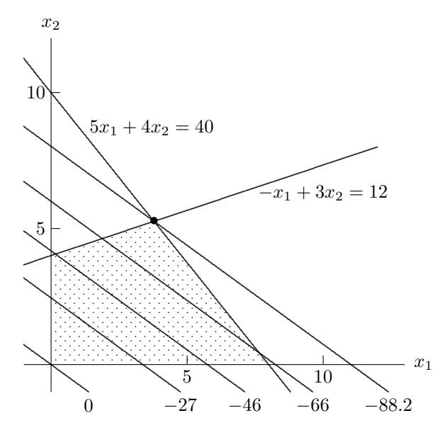

Figure 6.11: Linear programming problem from Example 6.17.

# 6.8 Software for Optimization

Table 6.1 is a list of some of the software available for solving one-dimensional and unconstrained optimization problems. In the multidimensional case, we distinguish between routines that do or do not require the user to supply derivatives for the functions, although in some cases the routines cited offer both options.

Software for minimizing a function f(x) typically requires the user to supply the name of a routine that computes the value of the objective function f for any given value of x. The user must also supply absolute or relative error tolerances that are used in the stopping criterion for the iterative solution process. Additional input for one-dimensional problems usually includes the endpoints of an interval in which the function is unimodal. (If the function is not unimodal, then the routine often will still find a local minimum, but it may not be the global minimum on the interval.) Additional input for multidimensional problems includes the dimension of the problem and a starting guess for the solution, and may also include the name of a routine for computing the gradient (and possibly the Hessian) of the objective function and a workspace array for storing the Hessian or an approximation to it. In addition to the computed solution  $x^*$ , the output typically includes a status flag

|                | One-dimensional    |                 | Multidimensional |
|----------------|--------------------|-----------------|------------------|
| Source         | No derivatives     | No derivatives  | Derivatives      |
| Brent [53]     | localmin           | praxis          |                  |
| [152]<br>FMM   | fmin               |                 |                  |
| GSL            | gsl<br>min         | gsl<br>multimin | gsl<br>multimin  |
|                | fminimizer         | fminimizer      | fdfminimizer     |
|                | brent              | nmsimplex2      | vector<br>bfgs2  |
| HSL            | vd01/vd04          | va08/va10/va24  | va06/va09/va13   |
| IMSL           | uvmif              | uminf           | umiah            |
| [262]<br>KMN   | fmin               | uncmin          |                  |
| MATLAB         | fminbnd            | fminsearch      | fminunc          |
| NAG            | e04abf             | e04jyf          | e04lyf           |
| NAPACK         |                    |                 | cg               |
| [377]<br>NR    | brent              | powell          | dfpmin           |
| [297]<br>NUMAL | minin              | praxis          | flemin/rnk1min   |
| PORT           |                    | mnf             | mng              |
| Schnabel,      |                    | uncmin          | uncmin           |
| et al. [400]   |                    |                 |                  |
| SciPy          | optimize.          | optimize.       | optimize.        |
|                | minimize<br>scalar | minimize        | minimize         |
| TOMS           |                    |                 | mini(#500)       |
| TOMS           |                    | smsno(#611)     | sumsl(#611)      |
| TOMS           |                    | bbvscg(#630)    | bbvscg(#630)     |
| TOMS           |                    |                 | tnpack(#702)     |
| TOMS           |                    | tensor(#739)    | tensor(#739)     |

Table 6.1: Software for one-dimensional and unconstrained optimization

indicating any warnings or errors. A preliminary plot of the functions involved can help greatly in determining a suitable starting guess.

Table 6.2 is a list of some of the software available for solving nonlinear least squares problems, linear programming problems, and general nonlinear constrained optimization problems. Good software is also available from a number of sources for solving many other types of optimization problems, including quadratic programming, linear or simple bounds constraints, network flow problems, etc. There is an optimization toolbox for MATLAB in which some of the software listed in the tables can be found, along with numerous additional routines for various other optimization problems. For the nonlinear analogue of total least squares, called orthogonal distance regression, odrpack(#676) is available from TOMS. A comprehensive survey of optimization software can be found in [342].

# 6.9 Historical Notes and Further Reading

Optimality conditions for unconstrained optimization are as old as calculus. For equality-constrained optimization, optimality conditions based on what are now

|                | Nonlinear             | Linear      | Nonlinear      |
|----------------|-----------------------|-------------|----------------|
| Source         | least squares         | programming | programming    |
| GSL            | gsl<br>multifit       |             |                |
|                | nlinear<br>driver     |             |                |
| HSL            | ns13/va27/vb01/vb13   | la01/la04   | vf01/vf04/vf13 |
| IMSL           | unlsf                 | dlprs       | nconf/ncong    |
| MATLAB         | lsqnonlin/lsqcurvefit | linprog     | fmincon        |
| MINPACK        | lmdif1                |             |                |
| NAG            | e04fyf                | e04mff      | e04ucf         |
| Netlib         | varpro/dqed           |             |                |
| [377]<br>NR    | mrqmin                | simplx      |                |
| [297]<br>NUMAL | gssnewton/marquardt   |             |                |
| PORT           | n2f/n2g/nsf/nsg       |             |                |
| SciPy          | optimize.             | optimize.   | optimize.      |
|                | leastsq               | linprog     | minimize       |
| SLATEC         | snls1                 | splp        |                |
| SOL            |                       | minos       | npsol          |
| TOMS           | nl2sol(#573)          |             |                |
| TOMS           | tensolve(#768)        |             |                |

Table 6.2: Software for nonlinear least squares and constrained optimization

called Lagrange multipliers were formulated in the eighteenth century, initially by Euler and then further developed by Lagrange. The Karush-Kuhn-Tucker conditions for inequality-constrained optimization appeared in Karush's thesis in 1939 but did not become widely known until their independent publication in the open literature by Kuhn and Tucker in 1951.

As with nonlinear equations in one dimension, the one-dimensional optimization methods based on Newton's method or interpolation are classical. A theory of optimal one-dimensional search methods using only function value comparisons was initiated in the 1950s by Kiefer, who showed that Fibonacci search, in which successive evaluation points are determined by ratios of Fibonacci numbers, is optimal in the sense that it produces the minimum interval of uncertainty for a given number of function evaluations. What we usually want, however, is to fix the error tolerance rather than the number of function evaluations, so golden section search, which can be viewed as a limiting case of Fibonacci search, turns out to be more practical. See [498] for a detailed discussion of these methods. As with nonlinear equations, hybrid safeguarded methods for one-dimensional optimization were popularized by Brent [53].

For multidimensional optimization, most of the basic direct search methods were proposed in the 1960s. The method of Nelder and Mead is based on an earlier method of Spendley, Hext, and Himsworth. Another popular direct search method is that of Hooke and Jeeves. For a survey of direct search methods, see [280, 376, 449, 508]. For a broader view of derivative-free optimization, see [84].

Steepest descent and Newton's method for multidimensional optimization were analyzed as practical algorithms by Cauchy. Secant updating methods were originated by Davidon (who used the term variable metric method) in 1959. In 1963, Fletcher and Powell published an improved implementation, which came to be known as the DFP method. Continuing this trend of initialisms, the BFGS method was developed independently by Broyden, Fletcher, Goldfarb, and Shanno in 1970. Many other secant updates have been proposed, but these two have been the most successful, with BFGS having a slight edge. The conjugate gradient method was originally developed by Hestenes and Stiefel in the early 1950s to solve symmetric linear systems by minimizing a quadratic function. It was later adapted to minimize general nonlinear functions by Fletcher and Reeves in 1964.

The Levenberg-Marquardt method for nonlinear least squares was originally developed by Levenberg in 1944 and improved by Marquardt in 1963. A modern implementation of this method, due to Mor´e [339], can be found in MINPACK [340].

Penalty function methods for constrained optimization originated with Courant in the early 1940s and were popularized by Fiacco and McCormick in the 1960s. The sequential quadratic programming method was first described by Wilson in his 1963 thesis. The simplex method for linear programming, which is still a workhorse for such problems, was originated by Dantzig in the late 1940s. The first polynomial-time algorithm for linear programming, the ellipsoid algorithm published by Khachiyan in 1979, was based on earlier work in the 1970s by Shor and by Judin and Nemirovskii (Khachiyan's main contribution was to show that the algorithm indeed has polynomial complexity). A much more practical polynomialtime algorithm is the interior-point method of Karmarkar, published in 1984, which is related to earlier barrier methods popularized by Fiacco and McCormick [141].

For a detailed treatment of optimality conditions and other theoretical background on optimization, see [266, 315, 367]. There are many good general references on optimization with an emphasis on numerical algorithms, including [20, 37, 146, 184, 310, 320, 211, 352]. References focusing primarily on methods for unconstrained optimization include [107, 190, 271, 351]. The theory and convergence analysis of Newton's method and quasi-Newton methods are summarized in [341] and [106], respectively. Trust-region methods are exhaustively covered in [83]. For detailed discussion of nonlinear least squares, see [28, 403]. For detailed treatment of penalty and barrier methods, see [141]. A survey of sequential quadratic programming methods is given in [41]. The classic account of the simplex method for linear programming is [95]. More recent treatments of the simplex method can be found in [185, 310, 211, 352]. For an overview of linear programming including polynomial-time algorithms, see [140, 191]. For interior-point methods for constrained optimization, see [149, 507, 511, 513]. General references on global optimization include [147, 243, 308]; global optimization using interval methods is the subject of [224, 268, 381].

## Review Questions

- 6.1. True or false: Points that minimize a nonlinear function are inherently less accurately determined than points for which a nonlinear function has a zero value.
- 6.2. True or false: If a function is unimodal on a closed interval, then it has exactly one minimum on the interval.
- 6.3. True or false: In minimizing a unimodal function of one variable by golden section search, the point discarded at each iteration is always the point having the largest function value.
- 6.4. True or false: For minimizing a real-valued function of several variables, the steepest descent method is usually more rapidly convergent than Newton's method.
- 6.5. True or false: The solution to a linear programming problem must occur at one of the vertices of the feasible region.
- 6.6. True or false: The approximate solution produced at each step of the simplex method for linear programming is a feasible point.
- 6.7. Suppose that the real-valued function f is unimodal on the interval [a, b]. Let x<sup>1</sup> and x<sup>2</sup> be two points in the interval, with a < x<sup>1</sup> < x<sup>2</sup> < b. If f(x1) = 1.232 and f(x2) = 3.576, then which of the following statements is valid?
- 1. The minimum of f must lie in the subinterval [x1, b].
- 2. The minimum of f must lie in the subinterval [a, x2].
- 3. One can't tell which of these two subintervals the minimum must lie in without knowing the values of f(a) and f(b).
- 6.8. (a) In minimizing a unimodal function of one variable on the interval [0, 1] by golden section search, at what two points in the interval is the function initially evaluated?
- (b) Why are those particular points chosen?
- 6.9. If the real-valued function f is monotonic on the interval [a, b], will golden section search to find a minimum of f still converge? If not, why, and if so, to what point?
- 6.10. Suppose that the real-valued function f is unimodal on the interval [a, b], and x<sup>1</sup> and x<sup>2</sup>

- are points in the interval such that x<sup>1</sup> < x<sup>2</sup> and f(x1) < f(x2).
- (a) What is the shortest interval in which you know that the minimum of f must lie?
- (b) How would your answer change if we happened to have f(x1) = f(x2)?
- 6.11. List one advantage and one disadvantage of golden section search compared with successive parabolic interpolation for minimizing a function of one variable.
- 6.12. (a) Why is linear interpolation of a function f: R → R not useful for finding a minimum of f?
- (b) In using quadratic interpolation for onedimensional problems, why would one use inverse quadratic interpolation for finding a zero but regular quadratic interpolation for finding a minimum?
- 6.13. For minimizing a function f: R → R, successive parabolic interpolation and Newton's method both fit a quadratic polynomial to the function f and then take its minimum as the next approximate solution.
- (a) How do these two methods differ in choosing the quadratic polynomials they use?
- (b) What difference does this make in their respective convergence rates?
- 6.14. Explain why Newton's method minimizes a quadratic function in one iteration but does not solve a quadratic equation in one iteration.
- 6.15. Suppose you want to minimize a function of one variable, f: R → R. For each convergence rate given, name a method that normally has that convergence rate for this problem:
- (a) Linear but not superlinear
- (b) Superlinear but not quadratic
- (c) Quadratic
- 6.16. Suppose you want to minimize a function of several variables, f: R <sup>n</sup> → R. For each convergence rate given, name a method that normally has that convergence rate for this problem:
- (a) Linear but not superlinear
- (b) Superlinear but not quadratic
- (c) Quadratic

Review Questions 299

- 6.17. Which of the following iterative methods have a superlinear convergence rate under normal circumstances?
- (a) Successive parabolic interpolation for minimizing a function
- (b) Golden section search for minimizing a function
- (c) Interval bisection for finding a zero of a function
- (d) Secant updating methods for minimizing a function of n variables
- (e) Steepest descent method for minimizing a function of n variables
- 6.18. (a) For minimizing a real-valued function f of n variables, what is the initial search direction in the conjugate gradient method?
- (b) Under what condition will the BFGS method for minimization use this same initial search direction?
- 6.19. For minimizing a quadratic function of n variables, what is the maximum number of iterations required to converge to the exact solution (assuming exact arithmetic) from an arbitrary starting point for each of the following algorithms?
- (a) Conjugate gradient method
- (b) Newton's method
- (c) BFGS secant updating method with exact line search
- 6.20. (a) What is meant by a critical point of a smooth nonlinear function f: R <sup>n</sup> → R?
- (b) Is a critical point always a minimum or maximum of the function?
- (c) How can you test a given critical point to determine which type it is?
- 6.21. Let f: R <sup>2</sup> → R be a real-valued function of two variables. What is the geometrical interpretation of the gradient vector

$$\nabla f(\boldsymbol{x}) = \begin{bmatrix} \partial f(\boldsymbol{x})/\partial x_1 \\ \partial f(\boldsymbol{x})/\partial x_2 \end{bmatrix}?$$

Specifically, explain the meaning of the direction and magnitude of ∇f(x).

6.22. (a) If f: R <sup>n</sup> → R, what do we call the Jacobian matrix of the gradient ∇f(x)?

- (b) What special property does this matrix have, assuming f is twice continuously differentiable?
- (c) What additional special property does this matrix have near a local minimum of f?
- 6.23. The steepest descent method for minimizing a function of several variables is usually slow but reliable. However, it can sometimes fail, and it can also sometimes converge rapidly. Under what conditions would each of these two types of behavior occur?
- 6.24. Consider Newton's method for minimizing a function of n variables:
- (a) When might the use of a line search parameter be beneficial?
- (b) When might the use of a line search parameter not be beneficial?
- 6.25. Many iterative methods for solving multidimensional nonlinear problems replace the given nonlinear problem by a sequence of linear problems, each of which can be solved by some matrix factorization. For each method listed, what is the most appropriate matrix factorization for solving the linear subproblems? (Assume that we start close enough to a solution to avoid any potential difficulties.)
- (a) Newton's method for solving a system of nonlinear equations
- (b) Newton's method for minimizing a function of several variables
- (c) Gauss-Newton method for solving a nonlinear least squares problem
- 6.26. Let f: R <sup>n</sup> → R <sup>n</sup> be a nonlinear function. Since kf(x)k = 0 if, and only if, f(x) = 0, does this relation mean that searching for a minimum of kf(x)k is equivalent to solving the nonlinear system f(x) = 0? Why?
- 6.27. (a) Why is a line search parameter always used in the steepest descent method for minimizing a general function of several variables?
- (b) Why might one use a line search parameter in Newton's method for minimizing a function of several variables?
- (c) Asymptotically, as the solution is approached, what should be the value of this line search parameter for Newton's method?
- 6.28. What is a good way to test a symmetric matrix to determine whether it is positive definite?

- 6.29. Suppose we want to minimize a function f: R <sup>n</sup> → R using a secant updating method. Why would one not just apply Broyden's method for finding a zero of the gradient of f?
- 6.30. To what method does the first iteration of the BFGS method for minimization reduce if the initial approximate Hessian is
- (a) The identity matrix I?
- (b) The exact Hessian at the starting point?
- 6.31. In secant updating methods for solving systems of nonlinear equations or minimizing a function of several variables, why is it preferable to update a factorization of the approximate Jacobian or Hessian matrix rather than update the matrix itself?
- 6.32. For solving a very large unconstrained optimization problem whose objective function has a sparse Hessian matrix, which type of method would be better, a secant updating method such as BFGS or the conjugate gradient method? Why?
- 6.33. How does the conjugate gradient method for minimizing an unconstrained nonlinear function differ from a truncated Newton method for the same problem, assuming the conjugate gradient method is used in the latter as the iterative solver for the Newton linear system?
- 6.34. For what type of nonlinear least squares problem, if any, would you expect the Gauss-Newton method to converge quadratically?
- 6.35. For what type of nonlinear least squares

- problem may the Gauss-Newton method converge very slowly or not at all? Why?
- 6.36. For what two general classes of least squares problems is the Gauss-Newton approximation to the Hessian exact at the solution?
- 6.37. The Levenberg-Marquardt method adds an extra term to the Gauss-Newton approximation to the Hessian. Give a geometric or algebraic interpretation of this additional term.
- 6.38. What are Lagrange multipliers, and what is their relevance to constrained optimization problems?
- 6.39. Consider the optimization problem min f(x) subject to g(x) = 0, where f: R <sup>n</sup> → R and g: R <sup>n</sup> → R m.
- (a) What is the Lagrangian function for this problem?
- (b) What is a necessary condition for optimality for this problem?
- 6.40. Explain the difference between range space methods and null space methods for solving constrained optimization problems.
- 6.41. What is meant by an active set strategy for inequality-constrained optimization problems?
- 6.42. (a) Is it possible, in general, to solve linear programming problems by an algorithm whose computational complexity is polynomial in the size of the problem data?
- (b) Does the simplex method have this property?

### Exercises

- 6.1. Determine whether each of the following functions is coercive on R 2 .
- (a) f(x, y) = x + y + 2.
- (b) f(x, y) = x <sup>2</sup> + y <sup>2</sup> + 2.
- (c) f(x, y) = x <sup>2</sup> − 2xy + y 2 .
- (d) f(x, y) = x <sup>4</sup> − 2xy + y 4 .
- 6.2. Determine whether each of the following functions is convex, strictly convex, or nonconvex on R.
- (a) f(x) = x 2 .
- (b) f(x) = x 3 .
- (c) f(x) = e −x .

- (d) f(x) = |x|.
- 6.3. For each of the following functions, what do the first- and second-order optimality conditions say about whether 0 is a minimum on R?
- (a) f(x) = x 2 .
- (b) f(x) = x 3 .
- (c) f(x) = x 4 .
- (d) f(x) = −x 4 .
- 6.4. Determine the critical points of each of the following functions and characterize each as a minimum, maximum, or inflection point. Also determine whether each function has a global minimum

Exercises 301

or maximum on R.

- (a) f(x) = x <sup>3</sup> + 6x <sup>2</sup> − 15x + 2.
- (b) f(x) = 2x <sup>3</sup> − 25x <sup>2</sup> − 12x + 15.
- (c) f(x) = 3x <sup>3</sup> + 7x <sup>2</sup> − 15x − 3.
- (d) f(x) = x 2 e x .
- 6.5. Determine the critical points of each of the following functions and characterize each as a minimum, maximum, or saddle point. Also determine whether each function has a global minimum or maximum on R 2 .
- (a) f(x, y) = x <sup>2</sup> − 4xy + y 2 .
- (b) f(x, y) = x <sup>4</sup> − 4xy + y 4 .
- (c) f(x, y) = 2x <sup>3</sup> − 3x <sup>2</sup> − 6xy(x − y − 1).
- (d) f(x, y) = (x − y) <sup>4</sup> + x <sup>2</sup> − y <sup>2</sup> − 2x + 2y + 1.
- 6.6. Determine the critical points of the Lagrangian function for each of the following problems and determine whether each is a constrained minimum, a constrained maximum, or neither.

$$f(x,y) = x^2 + y^2$$

subject to

$$g(x,y) = x + y - 1 = 0.$$

$$f(x,y) = x^3 + y^3$$

subject to

$$g(x,y) = x + y - 1 = 0.$$

$$f(x,y) = 2x + y$$

subject to

$$g(x,y) = x^2 + y^2 - 1 = 0.$$

2

$$f(x,y) = x^2 + y$$

subject to

$$g(x,y) = xy^2 - 1 = 0.$$

6.7. Use the first- and second-order optimality conditions to show that x <sup>∗</sup> = [ 2.5 −1.5 −1 ]<sup>T</sup> is a constrained local minimum for the function

$$f(\mathbf{x}) = x_1^2 - 2x_1 + x_2^2 - x_3^2 + 4x_3$$

subject to

$$g(\mathbf{x}) = x_1 - x_2 + 2x_3 - 2 = 0.$$

6.8. Consider the function f: R <sup>2</sup> → R defined by

$$f(\mathbf{x}) = \frac{1}{2} (x_1^2 - x_2)^2 + \frac{1}{2} (1 - x_1)^2.$$

- (a) At what point does f attain a minimum?
- (b) Perform one iteration of Newton's method for minimizing f using as starting point x<sup>0</sup> = [ 2 2 ]<sup>T</sup> .
- (c) In what sense is this a good step?
- (d) In what sense is this a bad step?
- 6.9. Let f: R <sup>n</sup> → R be given by

$$f(\boldsymbol{x}) = \frac{1}{2} \, \boldsymbol{x}^T \boldsymbol{A} \boldsymbol{x} - \boldsymbol{x}^T \boldsymbol{b} + c,$$

where A is an n × n symmetric positive definite matrix, b is an n-vector, and c is a scalar.

- (a) Show that Newton's method for minimizing this function converges in one iteration from any starting point x0.
- (b) If the steepest descent method is used on this problem, what happens if the starting value x<sup>0</sup> is such that x<sup>0</sup> − x ∗ is an eigenvector of A, where x ∗ is the solution?
- 6.10. (a) Prove that if a continuous function f: R <sup>n</sup> → R is coercive on R n (see Section 6.2), then f has a global minimum on R n . (Hint: In the definition of coercive, let M = f(0) and consider the resulting closed and bounded set {x ∈ R n : kxk ≤ r}.)
- (b) Adapt your proof to obtain the same result for any closed, unbounded set S ⊆ R n .
- 6.11. Prove that if a continuous function f: S ⊆ R <sup>n</sup> → R has a nonempty sublevel set that is closed and bounded, then f has a global minimum on S.
- 6.12. (a) Prove that any local minimum of a convex function f on a convex set S ⊆ R n is a global minimum of f on S. (Hint: If a local minimum x is not a global minimum, then let y be a point in S such that f(y) < f(x) and consider the line segment between x and y to obtain a contradiction.)
- (b) Prove that any local minimum of a strictly convex function f on a convex set S ⊆ R n is the unique global minimum of f on S. (Hint: Assume there are two distinct minima x, y ∈ S and consider the line segment between x and y to obtain a contradiction.)

6.13. A function f: R <sup>n</sup> → R is said to be quasiconvex on a convex set S ⊆ R n if for any x, y ∈ S,

$$f(\alpha \boldsymbol{x} + (1 - \alpha)\boldsymbol{y}) \le \max\{f(\boldsymbol{x}), f(\boldsymbol{y})\}\$$

for all α ∈ (0, 1), and f is strictly quasiconvex if strict inequality holds when x 6= y. If f: R → R has a minimum on an interval [a, b], show that f is unimodal on [a, b] if, and only if, f is strictly quasiconvex on [a, b].

- 6.14. Prove that the block 2×2 Hessian matrix of the Lagrangian function for equality-constrained optimization (see Section 6.2.3) cannot be positive definite.
- 6.15. Consider the problem

$$\min_{x,y} f(x,y) = x^2 + y^2$$

subject to

$$g(x,y) = x + y - 1 = 0.$$

Show that if the penalty method given in Section 6.7.2 is applied to this problem, then x ∗ <sup>ρ</sup> → x ∗ as ρ → ∞.

6.16. Consider the problem

$$\min_{x,y} f(x,y) = x^2 + y^2$$

subject to

$$g(x,y) = y^2 - (x-1)^3 = 0.$$

(a) First try to solve this problem using the method of Lagrange multipliers. Explain why this method fails for this problem.

(b) Next try the penalty method given in Section 6.7.2 to solve this problem, i.e., solve

$$\min_{x,y} f(x,y) + \frac{1}{2} \rho g(x,y)^2.$$

Derive an expression for the solution to the latter problem as a function of ρ and then take the limit as ρ → ∞.

6.17. Consider the linear programming problem

$$\min_{\boldsymbol{x}} f(\boldsymbol{x}) = -3x_1 - 2x_2$$

subject to

$$5x_1 + x_2 \le 6, \quad 3x_1 + 4x_2 \le 6,$$

$$4x_1 + 3x_2 \le 6, \quad x_1 \ge 0, \quad x_2 \ge 0.$$

- (a) How many vertices does the feasible region have?
- (b) Since the solution must occur at a vertex, solve the problem by evaluating the objective function at each vertex and choosing the one that gives the lowest value.
- (c) Obtain a graphical solution to the problem by drawing the feasible region and contours of the objective function, as in Fig. 6.11.
- 6.18. How can the linear programming problem given in Example 6.17 be stated in the standard form given at the beginning of Section 6.7.3? (Hint: Additional variables may be needed.)

# Computer Problems

6.1. (a) The function

$$f(x) = x^2 - 2x + 2$$

has a minimum at x <sup>∗</sup> = 1. On your computer, for what range of values of x near x ∗ is f(x) = f(x ∗ )? Can you explain this phenomenon? What are the implications regarding the accuracy with which a minimum can be computed?

(b) Repeat the preceding exercise, this time using the function

$$f(x) = 0.5 - xe^{-x^2},$$

which has a minimum at x <sup>∗</sup> = √ 2/2.

6.2. Consider the function f defined by

$$f(x) = \begin{cases} 0.5 & \text{if } x = 0\\ (1 - \cos(x))/x^2 & \text{if } x \neq 0 \end{cases}.$$

- (a) Use l'Hˆopital's rule to show that f is continuous at x = 0.
- (b) Use differentiation to show that f has a local maximum at x = 0.
- (c) Use a library routine, or one of your own design, to find a maximum of f on the interval [−2π, 2π], on which −f is unimodal. Experiment

with the error tolerance to determine how accurately the routine can approximate the known solution at x = 0.

- (d) If you have difficulty in obtaining a highly accurate result, try to explain why. (Hint: Make a plot of f in the vicinity of x = 0, say on the interval [−0.001, 0.001] with a spacing of 0.00001 between points.)
- (e) Can you devise an alternative formulation of f such that the maximum can be determined more accurately? (Hint: Consider a double angle formula.)
- 6.3. Use a library routine, or one of your own design, to find a minimum of each of the following functions on the interval [0, 3]. Draw a plot of each function to confirm that it is unimodal.
- (a) f(x) = x <sup>4</sup> − 14x <sup>3</sup> + 60x <sup>2</sup> − 70x.
- (b) f(x) = 0.5x <sup>2</sup> − sin(x).
- (c) f(x) = x <sup>2</sup> + 4 cos(x).
- (d) f(x) = Γ(x). (The gamma function, defined by

$$\Gamma(x) = \int_0^\infty t^{x-1} e^{-t} dt, \quad x > 0,$$

is a built-in function on many computer systems.)

- 6.4. Try using a library routine for onedimensional optimization on a function that is not unimodal and see what happens. Does it find the global minimum on the given interval, merely a local minimum, or neither? Experiment with various functions and different intervals to determine the range of behavior that is possible.
- 6.5. If a water hose with initial water velocity v is aimed at angle α with respect to the ground to hit a target of height h, then the horizontal distance x from nozzle to target satisfies the quadratic equation

$$(g/(2v^2\cos^2\alpha))x^2 - (\tan\alpha)x + h = 0,$$

where g = 9.8065 m/s<sup>2</sup> is the acceleration due to gravity. How do you interpret the two roots of this quadratic equation? Assuming that v = 20 m/s and h = 13.5 m, use a one-dimensional optimization routine to find the maximum distance x at which the target can still be hit, and the angle α for which the maximum occurs.

6.6. Write a general-purpose line search routine. Your routine should take as input a vector defining the starting point, a second vector defining the search direction, the name of a routine defining the objective function, and a convergence tolerance. For the resulting one-dimensional optimization problem, you may call a library routine or one of your own design. In any case, you will need to determine a bracket for the minimum along the search direction using some heuristic procedure. Test your routine for a variety of objective functions and search directions. This routine will be useful in some of the other computer exercises in this section.

6.7. Consider the function f: R <sup>2</sup> → R defined by

$$f(x,y) = 2x^3 - 3x^2 - 6xy(x - y - 1).$$

- (a) Determine all of the critical points of f analytically (i.e., without using a computer).
- (b) Classify each critical point found in part a as a minimum, a maximum, or a saddle point, again working analytically.
- (c) Verify your analysis graphically by creating a contour plot or three-dimensional surface plot of f over the region −2 ≤ x ≤ 2, −2 ≤ y ≤ 2.
- (d) Use a library routine for minimization to find the minima of both f and −f. Experiment with various starting points to see how well the routine gets around other types of critical points to find minima and maxima. You may find it instructive to plot the sequence of iterates generated by the routine.
- 6.8. Consider the function f: R <sup>2</sup> → R defined by

$$f(x,y) = 2x^2 - 1.05x^4 + x^6/6 + xy + y^2.$$

Using any method or routine you like, how many critical points can you find for this function? Classify each critical point you find as a local minimum, a local maximum, or a saddle point. What is the global minimum of this function?

6.9. Write a program to find a minimum of Rosenbrock's function,

$$f(x,y) = 100(y - x^{2})^{2} + (1 - x)^{2}$$

using each of the following methods:

- (a) Steepest descent
- (b) Newton
- (c) Damped Newton (Newton's method with a line search)

You should try each of the methods from each of the three starting points [ −1 1 ]<sup>T</sup> , [ 0 1 ]<sup>T</sup> , and [ 2 1 ]<sup>T</sup> . For any line searches and linear system solutions required, you may use either library routines or routines of your own design. Plot the path taken in the plane by the approximate solutions for each method from each starting point.

6.10. Let A be an n × n real symmetric matrix with eigenvalues λ<sup>1</sup> ≤ · · · ≤ λn. It can be shown that the critical points of the Rayleigh quotient (see Section 4.5.3) are eigenvectors of A, and in particular

$$\lambda_1 = \min_{\boldsymbol{x} \neq \boldsymbol{0}} \frac{\boldsymbol{x}^T \boldsymbol{A} \boldsymbol{x}}{\boldsymbol{x}^T \boldsymbol{x}}$$

and

$$\lambda_n = \max_{\boldsymbol{x} \neq \boldsymbol{0}} \frac{\boldsymbol{x}^T \boldsymbol{A} \boldsymbol{x}}{\boldsymbol{x}^T \boldsymbol{x}},$$

with the minimum and maximum occurring at the corresponding eigenvectors. Thus, we can in principle compute the extreme eigenvalues and corresponding eigenvectors of A using any suitable method for optimization.

(a) Use an unconstrained optimization routine to compute the extreme eigenvalues and corresponding eigenvectors of the matrix

$$\mathbf{A} = \begin{bmatrix} 6 & 2 & 1 \\ 2 & 3 & 1 \\ 1 & 1 & 1 \end{bmatrix}.$$

Is the solution unique in each case? Why?

- (b) The foregoing characterization of λ<sup>1</sup> and λ<sup>n</sup> remains valid if we restrict the vector x to be normalized by taking x <sup>T</sup> x = 1. Repeat part a, but use a constrained optimization routine to impose this normalization constraint. What is the significance of the Lagrange multiplier in this context?
- 6.11. Write a program implementing the BFGS method of Section 6.5.5 for unconstrained minimization. For the purpose of this exercise, you may refactor the resulting matrix B at each iteration, whereas in a real implementation you would update either B<sup>−</sup><sup>1</sup> or a factorization of B to reduce the amount of work per iteration. You may use an initial value of B<sup>0</sup> = I, but you might also wish to include an option to compute a finite difference approximation to the Hessian of the objective function to use as the initial B0. You may wish to include a line search to enhance the robustness of your program. Test your program on some of the other computer problems in this chapter,

and compare its robustness and convergence rate with those of Newton's method and the method of steepest descent.

- 6.12. Write a program implementing the conjugate gradient method of Section 6.5.6 for unconstrained minimization. You will need a line search routine to determine the parameter α<sup>k</sup> at each iteration. Try both the Fletcher-Reeves and Polak-Ribiere formulas for computing βk+1 to see how much difference this makes. Test your program on both quadratic and nonquadratic objective functions. For a reasonable error tolerance, does your program terminate in at most n steps for a quadratic function of n variables?
- 6.13. Using a library routine or one of your own design, find least squares solutions to the following overdetermined systems of nonlinear equations:

(a)

$$x_1^2 + x_2^2 = 2,$$
  

$$(x_1 - 2)^2 + x_2^2 = 2,$$
  

$$(x_1 - 1)^2 + x_2^2 = 9.$$

(b)  

$$x_1^2 + x_2^2 + x_1 x_2 = 0,$$

$$\sin^2(x_1) = 0,$$

$$\cos^2(x_2) = 0.$$

6.14. The concentration of a drug in the bloodstream is expected to diminish exponentially with time. We will fit the model function

$$y = f(t, \boldsymbol{x}) = x_1 e^{x_2 t}$$

to the following data:

t 0.5 1.0 1.5 2.0 y 6.80 3.00 1.50 0.75 t 2.5 3.0 3.5 4.0 y 0.48 0.25 0.20 0.15

- (a) Perform the exponential fit using nonlinear least squares. You may use a library routine or one of your own design, perhaps using the Gauss-Newton method.
- (b) Taking the logarithm of the model function gives log(x1) + x2t, which is now linear in x2. Thus, an exponential fit can also be done using linear least squares, assuming that we also take

logarithms of the data points  $y_i$ . Use linear least squares to compute  $x_1$  and  $x_2$  in this manner. Do the values obtained agree with those determined in part a? Why?

**6.15.** A bacterial population P grows according to the geometric progression

$$P_k = rP_{k-1},$$

where r is the growth rate. The following population counts (in billions) are observed:

$$\begin{array}{c|ccccccccccccccccccccccccccccccccccc$$

- (a) Perform a nonlinear least squares fit of the growth function to these data to estimate the initial population  $P_0$  and the growth rate r.
- (b) By using logarithms, a fit to these data can also be done by linear least squares (see previous exercise). Perform such a linear least squares fit to obtain estimates for  $P_0$  and r, and compare your results with those for the nonlinear fit.
- **6.16.** The Michaelis-Menten equation describes the chemical kinetics of enzyme reactions. According to this equation, if  $v_0$  is the initial velocity, V is the maximum velocity,  $K_m$  is the Michaelis constant, and S is the substrate concentration, then

$$v_0 = \frac{V}{1 + K_m/S}.$$

In a typical experiment,  $v_0$  is measured as S is varied, and then V and  $K_m$  are to be determined from the resulting data.

(a) Given the measured data,

$$\begin{array}{c|cccc} S & 2.5 & 5.0 & 10.0 \\ \hline v_0 & 0.024 & 0.036 & 0.053 \\ \hline S & 15.0 & 20.0 \\ \hline v_0 & 0.060 & 0.064 \\ \end{array}$$

determine V and  $K_m$  by performing a nonlinear least squares fit of  $v_0$  as a function of S. You may use a library routine or one of your own design, perhaps using the Gauss-Newton method.

(b) To avoid a nonlinear fit, a number of researchers have rearranged the Michaelis-Menten

equation so that a linear least squares fit will suffice. For example, Lineweaver and Burk used the rearrangement

$$\frac{1}{v_o} = \frac{1}{V} + \frac{K_m}{V} \cdot \frac{1}{S}$$

and performed a linear fit of  $1/v_o$  as a function of 1/S to determine 1/V and  $K_m/V$ , from which the values of V and  $K_m$  can then be derived. Similarly, Dixon used the rearrangement

$$\frac{S}{v_0} = \frac{K_m}{V} + \frac{1}{V} \cdot S$$

and performed a linear fit of  $S/v_0$  as a function of S to determine  $K_m/V$  and 1/V, from which the values of V and  $K_m$  can then be derived. Finally, Eadie and Hofstee used the rearrangement

$$v_0 = V - K_m \cdot \frac{v_0}{S}$$

and performed a linear fit of  $v_0$  as a function of  $v_0/S$  to determine V and  $K_m$ .

Verify the algebraic validity of each of these rearrangements. Perform the indicated linear least squares fit in each case, using the same data as in part a, and determine the resulting values for V and  $K_m$ . Compare the results with those obtained in part a. Why do they differ? For which of these linear fits are the resulting parameter values closest to those determined by the true nonlinear fit for these data?

**6.17.** We wish to fit the model function

$$f(t, \mathbf{x}) = x_1 + x_2 t + x_3 t^2 + x_4 e^{x_5 t}$$

to the following data:

$$\begin{array}{c|cccc} t & 0.00 & 0.25 & 0.50 \\ y & 20.00 & 51.58 & 68.73 \\ \hline t & 0.75 & 1.00 & 1.25 \\ y & 75.46 & 74.36 & 67.09 \\ \hline t & 1.50 & 1.75 & 2.00 \\ y & 54.73 & 37.98 & 17.28 \\ \hline \end{array}$$

We must determine the values for the five parameters  $x_i$  that best fit the data in the least squares sense. The model function is linear in the first four parameters, but it is a nonlinear function of the fifth parameter,  $x_5$ . We will solve this problem in five different ways:

(a) Use a general multidimensional unconstrained minimization routine with  $\phi(\mathbf{x}) = \frac{1}{2}\mathbf{r}^T(\mathbf{x})\mathbf{r}(\mathbf{x})$  as objective function, where  $\mathbf{r}$  is the residual function defined by  $r_i(x) = y_i - f(t_i, \mathbf{x})$ . This method

will determine all five parameters (i.e., the five components of  $\boldsymbol{x}$ ) simultaneously.

- (b) Use a multidimensional nonlinear equation solver to solve the system of nonlinear equations  $\nabla \phi(x) = 0$ .
- (c) Given a value for  $x_5$ , the best values for the remaining four parameters can be determined by linear least squares. Thus, we can view the problem as a one-dimensional nonlinear minimization problem with an objective function whose input is  $x_5$  and whose output is the residual sum of squares of the resulting linear least squares problem. Use a one-dimensional minimization routine to solve the problem in this manner. (*Hint*: Your routine for computing the objective function will in turn call a linear least squares routine.)
- (d) Solve the problem in the same manner as c, except use a one-dimensional nonlinear equation solver to find a zero of the derivative of the objective function in part c.
- (e) Use the Gauss-Newton method for nonlinear least squares to solve the problem. You will need to call a linear least squares routine to solve the linear least squares subproblem at each iteration.

In each of the five methods, you may compute any derivatives required either analytically or by finite differences. You may need to do some experimentation to find a suitable starting value for which each method converges. Of course, after you have solved the problem once, you will know the correct answer, but try to use "fair" starting guesses for the remaining methods. You may need to use global variables in MATLAB or C, or common blocks in Fortran, to pass information to subroutines in some cases.

**6.18.** An empirical model of a chemical processing plant yields the following constrained optimization problem:

$$\max_{x} f(x) = 5 x_1 x_2 x_4 - 4 x_1 x_2^{1.4} - 0.75 x_3^{0.6}$$

subject to

$$x_1x_4 - 8.4x_2x_3(1 - x_4)^2 = 0,$$

$$x_1 \ge 0, x_2 \ge 0, x_3 \ge 0, \text{ and } 0 \le x_4 \le 1,$$

where the variables are defined as follows:

- $x_1$  feed rate in liters/hr
- $x_2$  concentration of reactant in g mole/liter
- $x_3$  volume of reactor in liters
- $x_4$  fraction of reactant converted into product
- f profit in hr

The equality constraint comes from a material balance. Solve this problem using a library routine or one of your own design, based on any method of your choice.

**6.19.** According to Fermat's Principle of Least Time, a light ray takes the path that requires the least time in going from one point to another. Many laws of geometrical optics, such as the laws of reflection and refraction, can be derived from this principle. Refraction is the "bending" of a light ray when it passes between two media in which the velocity of light differs, such as air and glass.

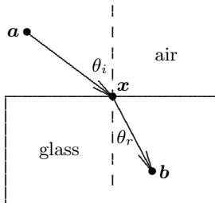

The ratio of velocities is called the *refractive in*dex; for air and glass,  $v_a/v_g = 1.5$ .

- (a) For given points a in the air and b in the glass, and taking the surface of the glass to be the line  $x_2 = 0$ , formulate an optimization problem whose solution is the point  $(x_1, x_2)$  on the surface of the glass at which a light ray enters the glass in going from a to b.
- (b) For  $\mathbf{a} = (-1,1)$  and  $\mathbf{b} = (1,-1)$ , solve the optimization problem in part a to determine  $\mathbf{x}$ .
- (c) Check the consistency of your results from part b with  $Snell's\ Law\ of\ Refraction$ , which says that

$$\frac{\sin(\theta_i)}{\sin(\theta_r)} = \frac{v_a}{v_g},$$

where the angle of incidence  $\theta_i$  and angle of refraction  $\theta_r$  are measured with respect to the normal to the surface at  $\boldsymbol{x}$  (the dashed line in the drawing).

(d) How do your results for parts b and c change if instead of glass the ray strikes water, for which the refractive index is  $v_a/v_w = 1.33$ ?

**6.20.** (a) A lifeguard sees a swimmer in distress, with the two positioned as shown in the drawing. If the lifeguard runs at a speed of 5 m/s and swims at 1 m/s, what is the optimal path for the lifeguard to reach the swimmer in the shortest time? Formulate an optimization problem whose solution is the point along the shoreline at which the lifeguard should enter the water. Using the optimal path, how long will it take the lifeguard to reach the swimmer?

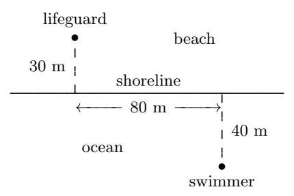

- (b) How does your formulation of this problem change if the shoreline is not a straight line, but is instead a curve described by the zero contour of some function g? Try solving the modified problem with some simple curve, such as a portion of an ellipse, representing the shoreline.
- **6.21.** Use a library routine for linear programming to solve the following problem:

$$\max_{\mathbf{x}} f(\mathbf{x}) = 2x_1 + 4x_2 + x_3 + x_4$$

subject to

$$\begin{array}{rcl} x_1 + 3x_2 + x_4 & \leq & 4 \\ 2x_1 + x_2 & \leq & 3 \\ x_2 + 4x_3 + x_4 & \leq & 3 \end{array}$$

and

$$x_i \ge 0, \quad i = 1, 2, 3, 4.$$

**6.22.** Use the method of Lagrange multipliers to solve each of the following constrained optimization problems. To solve the resulting system of nonlinear equations, you may use a library routine

or one of your own design. Once you find a critical point of the Lagrangian function, check it for optimality using the second-order optimality condition and by sampling the objective at nearby feasible points. You may also wish to compare your results with those of a library routine designed for constrained optimization.

(a) Quadratic objective function and linear constraints:

$$\min_{\mathbf{x}} f(\mathbf{x}) = (4x_1 - x_2)^2 + (x_2 + x_3 - 2)^2 + (x_4 - 1)^2 + (x_5 - 1)^2$$

subject to

$$x_1 + 3x_2 = 0,$$
  

$$x_3 + x_4 - 2x_5 = 0,$$
  

$$x_2 - x_5 = 0.$$

(b) Quadratic objective function and nonlinear constraints:

$$\min_{\boldsymbol{x}} f(\boldsymbol{x}) = 4x_1^2 + 2x_2^2 + 2x_3^2 - 33x_1 + 16x_2 - 24x_3$$

subject to

$$3x_1 - 2x_2^2 = 7,$$
  
$$4x_1 - x_3^2 = 11.$$

(c) Nonquadratic objective function and nonlinear constraints:

$$\min_{\mathbf{x}} f(\mathbf{x}) = (x_1 - 1)^2 + (x_1 - x_2)^2 + (x_2 - x_3)^2 + (x_3 - x_4)^4 + (x_4 - x_5)^4$$

subject to

$$x_1 + x_2^2 + x_3^3 = 3\sqrt{2} + 2,$$
  
 $x_2 - x_3^2 + x_4 = 2\sqrt{2} - 2,$   
 $x_1x_5 = 2.$