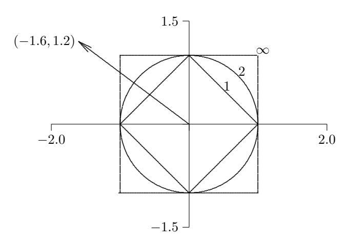

## 2.3 Érzékenység és kondicionáltság

Miután megfogalmaztuk az $Ax = b$ lineáris egyenletrendszer megoldásának létezésére és egyértelműségére vonatkozó feltételeket, most az $x$ megoldás érzékenységét vizsgáljuk a bemeneti adatok perturbációival szemben, amelyek ebben a feladatban az $A$ mátrix és a $b$ jobb oldali vektor. Az ilyen perturbációk méréséhez szükségünk van a vektorok és mátrixok „méretének" valamilyen fogalmára. A nagyság, abszolút érték vagy modulus skaláris fogalma általánosítható a vektorok és mátrixok normáinak fogalmára.

### 2.3.1 Vektornormák

Bár általánosabb definíció is lehetséges, a továbbiakban használt vektornormák mind a $p$-normák speciális esetei, amelyeket egy $p > 0$ egész szám és egy $n$-dimenziós $x$ vektor esetén a következőképpen definiálunk:

$$\|\boldsymbol{x}\|_p = \left(\sum_{i=1}^n |x_i|^p\right)^{1/p}.$$

Fontos speciális esetek:

- 1-norma:

$$\|x\|_1 = \sum_{i=1}^n |x_i|,$$

amelyet néha Manhattan-normának is neveznek, mivel két dimenzióban ez két pont „háztömbökben" mért távolságának felel meg.

- 2-norma:

$$\|\boldsymbol{x}\|_2 = \left(\sum_{i=1}^n |x_i|^2\right)^{1/2},$$

amely az euklideszi térben megszokott távolságfogalomnak felel meg, ezért euklideszi normának is nevezzük.

- $\infty$-norma:

$$\|\boldsymbol{x}\|_{\infty} = \max_{1 \le i \le n} |x_i|,$$

amely $p \to \infty$ határesetként értelmezhető.

Ezek a normák kvalitatívan mind hasonló eredményeket adnak, de bizonyos körülmények között egy adott norma a legkönnyebben kezelhető analitikusan vagy számítástechnikailag. A lineáris egyenletrendszerek megoldásainak érzékenységi vizsgálatához általában az 1-normát vagy az $\infty$-normát használjuk. A 2-normát később más kontextusokban fogjuk kiterjedten alkalmazni. E normák közötti különbségeket $\mathbb{R}^2$-ben a 2.2. ábra szemlélteti, amely az egységgömböt, azaz az $\{x : \|x\|_p = 1\}$ halmazt mutatja $p = 1, 2, \infty$ esetén. (Megjegyzendő, hogy az egységgömb – amelyet két dimenzióban pontosabb egységkörnek nevezni – csak a 2-normában valóban „kerek", innen kapta a nevét.) Egy vektor normája egyszerűen az a tényező, amellyel a megfelelő egységgömböt ki kell tágítani vagy össze kell zsugorítani ahhoz, hogy az a vektort magában foglalja.

**2.3. Példa. Vektornormák.** A 2.2. ábrán látható $x = [-1{,}6, 1{,}2]^T$ vektor esetén

$$\|\boldsymbol{x}\|_1 = 2{,}8, \quad \|\boldsymbol{x}\|_2 = 2{,}0, \quad \|\boldsymbol{x}\|_{\infty} = 1{,}6.$$

2.2. ábra: Egységgömbök különböző vektornormákban.

Általában tetszőleges $n$-dimenziós $\boldsymbol{x}$ vektor esetén

$$\|x\|_1 \ge \|x\|_2 \ge \|x\|_{\infty}.$$

Másrészt fennáll, hogy

$$\|x\|_1 \le \sqrt{n} \|x\|_2$$
, $\|x\|_2 \le \sqrt{n} \|x\|_{\infty}$ és $\|x\|_1 \le n \|x\|_{\infty}$.

Így adott $n$ esetén e normák közül bármely kettő legfeljebb egy konstansban tér el egymástól, tehát abban az értelemben mind ekvivalensek, hogy ha az egyik kicsi, akkor valamennyinek arányosan kicsinek kell lennie (valójában minden $p$-norma ekvivalens ebben az értelemben). Ezért mindig azt a normát választhatjuk, amelyik az adott kontextusban a legkényelmesebb. A könyv hátralévő részében megfelelő alsó index jelöli majd a konkrét normát, amikor ez szükséges, de az alsó indexet elhagyjuk, ha közömbös, hogy melyik normát használjuk.

Minden vektor $p$-norma rendelkezik a következő fontos tulajdonságokkal, ahol $\boldsymbol{x}$ és $\boldsymbol{y}$ tetszőleges vektorok:

- 1. $\|\mathbf{x}\| > 0$, ha $\mathbf{x} \neq \mathbf{0}$.
- 2. $\|\gamma \boldsymbol{x}\| = |\gamma| \cdot \|\boldsymbol{x}\|$ tetszőleges $\gamma$ skalár esetén.
- 3. $\|\boldsymbol{x} + \boldsymbol{y}\| \le \|\boldsymbol{x}\| + \|\boldsymbol{y}\|$ (háromszög-egyenlőtlenség).

Az általánosabb megközelítésben egy vektornorma *definíciójaként* bármely olyan valós értékű függvényt tekinthetünk egy vektoron, amely e három tulajdonságot teljesíti. Megjegyzendő, hogy az első két tulajdonság együtt magában foglalja, hogy $\|\boldsymbol{x}\| = 0$ akkor és csak akkor, ha $\boldsymbol{x} = \boldsymbol{0}$. A háromszög-egyenlőtlenség hasznos változata

$$|\|x\| - \|y\|| \le \|x - y\|,$$

amely egyúttal azt is mutatja, hogy a vektornorma folytonos függvény.

### 2.3.2 Mátrixnormák

A mátrixok méretének vagy nagyságának mérésére is szükségünk van valamilyen módszerre. Itt is lehetséges általánosabb definíció, de a továbbiakban használt mátrixnormákat mind egy alapul szolgáló vektornorma segítségével definiáljuk. Pontosabban: adott vektornorma mellett egy $m \times n$ méretű $A$ mátrixhoz tartozó mátrixnormát a következőképpen értelmezzük:

$$\|\boldsymbol{A}\| = \max_{\boldsymbol{x} \neq \boldsymbol{0}} \frac{\|\boldsymbol{A}\boldsymbol{x}\|}{\|\boldsymbol{x}\|}.$$

Az ilyen mátrixnormáról azt mondjuk, hogy a vektornorma által indukált vagy annak szubordinált normája. Szemléletesen: a mátrix normája azt a maximális nyújtást méri, amelyet a mátrix az adott vektornormában mérve bármely vektoron végrehajt.

Egyes mátrixnormák sokkal könnyebben számíthatók ki, mint mások. Például a vektor 1-normához tartozó mátrixnorma egyszerűen a mátrix maximális abszolút oszlopösszege,

$$\|A\|_1 = \max_j \sum_{i=1}^m |a_{ij}|,$$

a vektor $\infty$-normához tartozó mátrixnorma pedig egyszerűen a mátrix maximális abszolút sorösszege,

$$\|\mathbf{A}\|_{\infty} = \max_{i} \sum_{j=1}^{n} |a_{ij}|.$$

Ezek megjegyzésének kényelmes módja, hogy ezek a mátrixnormák $n \times 1$ méretű mátrix esetén megegyeznek a megfelelő vektornormákkal. Sajnos a vektor 2-normához tartozó mátrixnormát nem olyan könnyű kiszámítani (lásd 3.6.1. szakasz).

**2.4. Példa. Mátrixnormák.** Az

$$\mathbf{A} = \begin{bmatrix} 2 & -1 & 1 \\ 1 & 0 & 1 \\ 3 & -1 & 4 \end{bmatrix}$$

mátrix esetén a maximális abszolút oszlop- és sorösszegekből rendre

$$\|A\|_1 = 6$$
és $\|A\|_{\infty} = 8$ adódik.

E mátrix 2-normáját lásd a 3.17. példában.

A definiált mátrixnormák a következő fontos tulajdonságokkal rendelkeznek, ahol $A$ és $B$ tetszőleges mátrixok:

- 1. $\|A\| > 0$, ha $A \neq O$.
- 2. $\|\gamma A\| = |\gamma| \cdot \|A\|$ tetszőleges $\gamma$ skalár esetén.
- 3. $\|A + B\| \le \|A\| + \|B\|$.
- 4. $\|AB\| \le \|A\| \cdot \|B\|$.
- 5. $\|Ax\| \le \|A\| \cdot \|x\|$ tetszőleges $x$ vektor esetén.

Az általánosabb megközelítésben egy mátrixnorma definíciójaként bármely olyan valós értékű mátrixfüggvényt tekinthetünk, amely az első három tulajdonságot teljesíti. A fennmaradó két tulajdonság, amelyeket szubmultiplikatív vagy konzisztenciafeltételeknek neveznek, az ilyen általánosabb mátrixnormákra nem feltétlenül teljesül, de a vektor $p$-normák által indukált mátrixnormákra mindig érvényesek. Ismét megjegyezzük, hogy az első két tulajdonság együtt azt adja, hogy $\|A\| = 0$ akkor és csak akkor, ha $A = O$.

### 2.3.3 Mátrix kondíciószáma

Egy nemszinguláris $A$ négyzetes mátrix adott mátrixnormára vonatkozó kondíciószámát a következőképpen definiáljuk:

$$\operatorname{cond}(\boldsymbol{A}) = \|\boldsymbol{A}\| \cdot \|\boldsymbol{A}^{-1}\|.$$

Megállapodás szerint $\operatorname{cond}(A) = \infty$, ha $A$ szinguláris. A 2.3.4. szakaszban látni fogjuk, hogy ez a fogalom összhangban van a kondíciószám 1.2.6. szakaszban bevezetett általános fogalmával annyiban, hogy a mátrix kondíciószáma felső korlátot ad a lineáris egyenletrendszer megoldásának relatív változásának és a bemeneti adatok adott relatív változásának arányára.

**2.5. Példa. Mátrix kondíciószáma.** Mátrixszorzással könnyen ellenőrizhető, hogy a 2.4. példa mátrixának inverze

$$\mathbf{A}^{-1} = \begin{bmatrix} 0{,}5 & 1{,}5 & -0{,}5 \\ -0{,}5 & 2{,}5 & -0{,}5 \\ -0{,}5 & -0{,}5 & 0{,}5 \end{bmatrix},$$

így

$$\|\mathbf{A}^{-1}\|_1 = 4{,}5$$
és $\|\mathbf{A}^{-1}\|_{\infty} = 3{,}5$.

Ebből tehát

$$\operatorname{cond}_1(\mathbf{A}) = \|\mathbf{A}\|_1 \cdot \|\mathbf{A}^{-1}\|_1 = 6 \cdot 4{,}5 = 27$$

és

$$\operatorname{cond}_{\infty}(\mathbf{A}) = \|\mathbf{A}\|_{\infty} \cdot \|\mathbf{A}^{-1}\|_{\infty} = 8 \cdot 3{,}5 = 28.$$

E mátrix 2-normára vonatkozó kondíciószámát lásd a 3.17. példában.

A 2.5. példából látható, hogy egy $n \times n$ méretű mátrix kondíciószámának számértéke függ az alkalmazott normától (amit a megfelelő alsó index jelez), de az alapul szolgáló vektornormák ekvivalenciája miatt ezek az értékek legfeljebb egy rögzített konstansban térhetnek el (amely $n$-től függ), így a kondicionáltság kvantitatív mértékeként egyaránt hasznosak.

Mivel

$$\|\boldsymbol{A}\| \cdot \|\boldsymbol{A}^{-1}\| = \left(\max_{\boldsymbol{x} \neq \boldsymbol{0}} \frac{\|\boldsymbol{A}\boldsymbol{x}\|}{\|\boldsymbol{x}\|}\right) \cdot \left(\min_{\boldsymbol{x} \neq \boldsymbol{0}} \frac{\|\boldsymbol{A}\boldsymbol{x}\|}{\|\boldsymbol{x}\|}\right)^{-1},$$

egy mátrix kondíciószáma a maximális relatív nyújtás és a maximális relatív zsugorítás arányát méri, amelyet a mátrix bármely nem nulla vektoron végrehajt. Ezt úgy is megfogalmazhatjuk, hogy a mátrix kondíciószáma az egységgömb torzulásának mértékét méri (a megfelelő vektornormában) a mátrix által való transzformáció során. Minél nagyobb a kondíciószám, annál torzabb (relatíve nyúlt és vékony) lesz az egységgömb a mátrix általi transzformáció után. Két dimenzióban például a 2-normabeli egységkörből egyre inkább szivar alakú ellipszis lesz, az 1-normában vagy az $\infty$-normában pedig az egységgömb négyzetből egyre ferdébb paralelogrammává torzul, ahogy a kondíciószám nő.

**2.6. Példa. Mátrix kondíciószáma.** A 2.3. ábra négy különböző mátrix hatását szemlélteti az $\mathbb{R}^2$-beli egységkörön a 2-normát használva. $A_1$ az egységkört 30 fokkal az óramutató járásával megegyező irányba forgatja el, de egyik vektor euklideszi hosszát sem változtatja meg, így $\operatorname{cond}_2(A_1) = 1$. $A_2$ az $e_1$ bázisvektort 2-szeresére nyújtja, az $e_2$ bázisvektort pedig 0,5-szeresére zsugorítja, és mindkettő maximális, tehát $\operatorname{cond}_2(A_2) = 2/0{,}5 = 4$. $A_3$ egyszerre forgat és torzít az egységkörön, de a maximális arány itt is ugyanaz, mint $A_2$ esetén, így $\operatorname{cond}_2(A_3) = 4$. Végül $A_4$ egy általánosabb transzformáció, amely esetén a maximális arány már nem a bázisvektoroknál jelentkezik, de a maximum értéke továbbra is ugyanaz, tehát $\operatorname{cond}_2(A_4) = 4$.

2.3. ábra: Az egységkör transzformációja 2-normában különböző mátrixokkal.

A kondíciószám következő fontos tulajdonságai a definícióból könnyen levezethetők, és tetszőleges normára érvényesek:

- 1. Tetszőleges $A$ mátrix esetén $\operatorname{cond}(A) \ge 1$.
- 2. Az egységmátrixra $\operatorname{cond}(I) = 1$.
- 3. Tetszőleges $A$ mátrix és nem nulla $\gamma$ skalár esetén $\operatorname{cond}(\gamma A) = \operatorname{cond}(A)$.
- 4. Tetszőleges $D = \operatorname{diag}(d_i)$ diagonális mátrix esetén $\operatorname{cond}(D) = (\max |d_i|)/(\min |d_i|)$.

A kondíciószám azt méri, hogy a mátrix mennyire van közel a szingularitáshoz: egy nagy kondíciószámú mátrix (amit a 2.3.4. szakaszban fogunk kvantifikálni) közel szinguláris, míg az 1-hez közeli kondíciószámú mátrix messze van a szingularitástól. A definícióból nyilvánvaló, hogy egy nemszinguláris mátrix és inverze kondíciószáma megegyezik. Ez érthető, hiszen ha egy mátrix közel szinguláris, akkor az inverze is ugyanolyan közel van a szingularitáshoz.

Megjegyzendő, hogy a mátrix determinánsa nem jó indikátora a szingularitáshoz való közelségnek: bár egy $A$ mátrix szinguláris, ha $\det(A) = 0$, a nem nulla determináns nagysága – akár nagy, akár kicsi – semmilyen információt nem ad arról, hogy a mátrix mennyire közelít a szingularitáshoz. Például $\det(\alpha I_n) = \alpha^n$, ami $|\alpha| < 1$ esetén tetszőlegesen kicsi lehet, ennek ellenére a mátrix tetszőleges nem nulla $\alpha$ esetén tökéletesen jól kondicionált, kondíciószáma bármely mátrixnormában 1.

Ahogy nemsokára látni fogjuk, a kondíciószám hasznossága a lineáris egyenletrendszerek megoldásának pontosságának megítélésében rejlik. A kondíciószám definíciója a mátrix inverzét tartalmazza, így értékének kiszámítása nyilvánvalóan nem triviális feladat. Valójában a kondíciószámot közvetlenül a definícióból kiszámítani lényegesen nagyobb munkát igényelne, mint annak a megoldásnak a kiszámítása, amelynek pontosságát a kondíciószám segítségével kívánjuk megítélni. A gyakorlatban ezért a kondíciószámot csupán becsüljük, legfeljebb egy nagyságrend pontossággal, a megoldási folyamat viszonylag olcsó melléktermékeként.

Az $\|A\|$ mátrixnormát könnyen kiszámíthatjuk maximális abszolút oszlopösszegként (vagy sorösszegként, a használt normától függően). Az $\|A^{-1}\|$ alacsony költségű becslése jelenti a kihívást. A normák tulajdonságaiból tudjuk, hogy ha $z$ az $Az = y$ rendszer megoldása, akkor

$$\|z\| = \|A^{-1}y\| \le \|A^{-1}\| \cdot \|y\|,$$

így

$$\frac{\|\boldsymbol{z}\|}{\|\boldsymbol{y}\|} \le \|\boldsymbol{A}^{-1}\|,$$

és ez a korlát valamely optimálisan választott $y$ vektor esetén elérhető. Ezért ha $y$-t úgy tudjuk megválasztani, hogy az $\|z\|/\|y\|$ hányados a lehető legnagyobb legyen, akkor ésszerű becslést kapunk $\|A^{-1}\|$-re.

**2.7. Példa. Kondícióbecslés.** Tekintsük az

$$\mathbf{A} = \begin{bmatrix} 0{,}913 & 0{,}659 \\ 0{,}457 & 0{,}330 \end{bmatrix}$$

mátrixot. Ha $y = [0, 1{,}5]^T$-t választjuk, akkor $z = [-7780, 10780]^T$, tehát

$$\|\boldsymbol{A}^{-1}\|_{1} \approx \frac{\|\boldsymbol{z}\|_{1}}{\|\boldsymbol{y}\|_{1}} \approx 1{,}238 \times 10^{4},$$

és így

$$\operatorname{cond}_1(\mathbf{A}) = \|\mathbf{A}\|_1 \cdot \|\mathbf{A}^{-1}\|_1 \approx 1{,}370 \times 1{,}238 \times 10^4 = 1{,}696 \times 10^4,$$

ami – mint kiderül – a megjelenített számjegyek pontosságával egzakt. E viszonylag nagy kondíciószám következményeit a 2.8. és a 2.17. példában vizsgáljuk.

A 2.7. példabeli $y$ vektort gondosan úgy választottuk meg, hogy a lehető legnagyobb $\|z\|/\|y\|$ hányadost adja, és így $\|A^{-1}\|$ pontos értékét eredményezze. Egy ilyen optimális $y$ megtalálása általában megengedhetetlenül költséges lenne, de jóval olcsóbban is kaphatunk hasznos közelítést. Az egyik heurisztika az, hogy $y$-t az $A^T y = c$ rendszer megoldásaként választjuk, ahol $c$ egy olyan vektor, amelynek komponensei $\pm 1$ értékűek; az előjeleket egymás után úgy választjuk meg, hogy az adódó $y$ a lehető legnagyobb legyen. Egy másik stratégia egyszerűen az, hogy néhány véletlen $y$-t próbálunk; a közöttük legnagyobb hányados megadása gyakorlati célokra általában elegendően pontos becslést ad $\|A^{-1}\|$-re.

A kondícióbecslés alternatív megközelítése, hogy konvex optimalizálási feladatként kezeljük, amely heurisztikus algoritmussal a gyakorlatban nagyon hatékonyan megoldható. További lehetőség – a 2-norma használatakor – a kondíciószámot a szingulárisérték-felbontásból származtatni (lásd 3.6.1. szakasz), ez azonban megengedhetetlenül költséges, hacsak az SVD-t egyéb okból amúgy sem számítjuk ki. Szerencsére a felhasználóknak nem kell aggódniuk e részletek miatt, mivel a lineáris egyenletrendszerek megoldására szolgáló jó modern szoftvercsomagok többsége hatékony és megbízható kondícióbecslőt biztosít, amely az itt vázolt módszerek valamelyikének kifinomult megvalósításán alapul (lásd 2.1. táblázat).

### 2.3.4 Hibakorlátok

A kondíciószám nemcsak a szingularitáshoz való közelség megbízható indikátora, hanem kvantitatív korlátot is szolgáltat a lineáris egyenletrendszer számított megoldásának hibájára, ahogy azt most megmutatjuk. Legyen $x$ a nemszinguláris $Ax = b$ lineáris egyenletrendszer megoldása, és legyen $\hat{x}$ az $A\hat{x} = b + \Delta b$ perturbált jobb oldalú rendszer megoldása. Ha definiáljuk $\Delta x = \hat{x} - x$-et, akkor

$$\boldsymbol{A}\hat{\boldsymbol{x}} = \boldsymbol{A}(\boldsymbol{x} + \Delta\boldsymbol{x}) = \boldsymbol{A}\boldsymbol{x} + \boldsymbol{A}\,\Delta\boldsymbol{x} = \boldsymbol{b} + \Delta\boldsymbol{b}.$$

Mivel $Ax = b$, ezért $A\,\Delta x = \Delta b$-nek kell teljesülnie, így $\Delta x = A^{-1}\Delta b$. Normákat véve kapjuk az

$$\|b\| = \|Ax\| \le \|A\| \cdot \|x\|, \quad \text{vagyis} \quad \|x\| \ge \|b\|/\|A\|,$$

és

$$\|\Delta x\| = \|A^{-1}\Delta b\| \le \|A^{-1}\| \cdot \|\Delta b\|$$

egyenlőtlenségeket. E két egyenlőtlenséget összekapcsolva adódik, hogy

$$\frac{\|\Delta \boldsymbol{x}\|}{\|\boldsymbol{x}\|} \leq \|\boldsymbol{A}^{-1}\| \cdot \|\Delta \boldsymbol{b}\| \frac{\|\boldsymbol{A}\|}{\|\boldsymbol{b}\|}.$$

Definíció szerint $\|A\| \cdot \|A^{-1}\| = \operatorname{cond}(A)$, így a következő korlátot kapjuk:

$$\frac{\|\Delta \boldsymbol{x}\|}{\|\boldsymbol{x}\|} \leq \operatorname{cond}(\boldsymbol{A}) \frac{\|\Delta \boldsymbol{b}\|}{\|\boldsymbol{b}\|}.$$

Így a mátrix kondíciószáma egy „erősítési tényező", amely a jobb oldali vektor adott relatív változásából fakadó megoldás maximális relatív változását korlátozza (vö. a kondíciószám 1.2.6. szakaszban megadott általános fogalmával).

Hasonló eredmény érvényes az $A$ mátrix elemeinek relatív változásaira is. Ha $Ax = b$ és $(A + E)\hat{x} = b$, akkor

$$\Delta x = \hat{x} - x = A^{-1}(A\hat{x} - b) = -A^{-1}E\hat{x}.$$

Normákat véve az

$$\|\Delta \boldsymbol{x}\| \leq \|\boldsymbol{A}^{-1}\| \cdot \|\boldsymbol{E}\| \cdot \|\hat{\boldsymbol{x}}\|$$

egyenlőtlenséget kapjuk, amelyből $\operatorname{cond}(A)$ definíciójával adódik a

$$\frac{\|\Delta \boldsymbol{x}\|}{\|\hat{\boldsymbol{x}}\|} \leq \operatorname{cond}(\boldsymbol{A}) \frac{\|\boldsymbol{E}\|}{\|\boldsymbol{A}\|}$$

korlát.

Az imént ismertetett algebrai levezetések alternatívájaként a lineáris egyenletrendszerek érzékenységét a differenciálszámítás segítségével is becsülhetjük. A $t$ valós paraméter bevezetésével definiáljuk az $A(t) = A + tE$ és $b(t) = b + t\Delta b$ mennyiségeket, és tekintjük az $A(t)x(t) = b(t)$ lineáris egyenletrendszer $x(t)$ megoldását. Ezt az egyenletet $t$ szerint differenciálva

$$\boldsymbol{A}'(t)\boldsymbol{x}(t) + \boldsymbol{A}(t)\boldsymbol{x}'(t) = \boldsymbol{b}'(t),$$

vagy ekvivalens módon

$$Ex(t) + A(t)x'(t) = \Delta b$$

adódik. Átrendezve kapjuk, hogy

$$\boldsymbol{x}'(t) = \boldsymbol{A}(t)^{-1} (\Delta \boldsymbol{b} - \boldsymbol{E} \boldsymbol{x}(t)),$$

amiből

$$\boldsymbol{x}'(0) = \boldsymbol{A}^{-1}(\Delta \boldsymbol{b} - \boldsymbol{E}\boldsymbol{x}(0)).$$

A Taylor-tétel szerint $x(t) = x(0) + tx'(0) + \mathcal{O}(t^2)$, tehát

$$\boldsymbol{x}(t) - \boldsymbol{x}(0) = t\boldsymbol{x}'(0) + \mathcal{O}(t^2) = t\boldsymbol{A}^{-1}(\Delta\boldsymbol{b} - \boldsymbol{E}\boldsymbol{x}(0)) + \mathcal{O}(t^2).$$

Legyen $x \equiv x(0)$; normákat véve, majd $\|x\|$-szel osztva a

$$\frac{\|\boldsymbol{x}(t) - \boldsymbol{x}\|}{\|\boldsymbol{x}\|} \leq \|\boldsymbol{A}^{-1}\| \left( \frac{\|\Delta \boldsymbol{b}\|}{\|\boldsymbol{x}\|} + \|\boldsymbol{E}\| \right) |t| + \mathcal{O}(t^{2})$$

$$\leq \operatorname{cond}(\boldsymbol{A}) \left( \frac{\|\Delta \boldsymbol{b}\|}{\|\boldsymbol{A}\| \cdot \|\boldsymbol{x}\|} + \frac{\|\boldsymbol{E}\|}{\|\boldsymbol{A}\|} \right) |t| + \mathcal{O}(t^{2})$$

$$\leq \operatorname{cond}(\boldsymbol{A}) \left( \frac{\|\Delta \boldsymbol{b}\|}{\|\boldsymbol{b}\|} + \frac{\|\boldsymbol{E}\|}{\|\boldsymbol{A}\|} \right) |t| + \mathcal{O}(t^{2})$$

korlátot kapjuk.

Így ismét azt látjuk, hogy a megoldás relatív változását a kondíciószám szorozva a feladat adatainak relatív változásával korlátozza.

Az érzékenységi eredmények geometriai értelmezése két dimenzióban: ha a két egyenlet által meghatározott két egyenes közel párhuzamos, akkor metszéspontjuk nem élesen definiált, amennyiben az egyenesek kerekítési vagy mérési hiba miatt némileg bizonytalanok. Ha viszont az egyenesek távol vannak a párhuzamostól, mondjuk közel merőlegesek, akkor metszéspontjuk viszonylag élesen definiált. E két esetet a 2.4. ábra mutatja be, ahol a szaggatott vonalak jelölik az egyes folytonos vonalakhoz tartozó bizonytalansági tartományt, úgyhogy a metszéspont mindkét esetben a satírozott paralelogramma bármelyik pontja lehet. Így egy nagy kondíciószám a megoldás nagy bizonytalanságával jár.

2.4. ábra: Jól kondicionált és rosszul kondicionált lineáris egyenletrendszerek.

Összefoglalva: ha a bemeneti adatok gépi pontosságig pontosak, akkor egy $Ax = b$ lineáris egyenletrendszer közelítő $\hat{x}$ megoldásának relatív hibájára azt várhatjuk, hogy

$$\frac{\|\hat{\boldsymbol{x}}-\boldsymbol{x}\|}{\|\boldsymbol{x}\|}\lessapprox \operatorname{cond}(\boldsymbol{A})\;\epsilon_{\mathrm{mach}}.$$

Ezt az eredményt a hátraható hibaelemzés nyelvén úgy értelmezhetjük, hogy a számított megoldásról azt várhatjuk: a bemenet pontosságához képest körülbelül $\log_{10}(\operatorname{cond}(\mathbf{A}))$ tizedes értékes jegyet veszít pontosságából. A 2.7. példabeli mátrix kondíciószáma például nagyobb $10^4$-nél, ezért e mátrixot tartalmazó lineáris egyenletrendszer megoldásában egyetlen helyes számjegyet sem várhatunk, hacsak a bemeneti adatok négy tizedes értékes jegynél pontosabbak, és a munkapontosság is négy tizedes értékes jegynél többet hordoz (lásd a 2.8. és a 2.17. példát).

Az érzékenység kvantitatív mértékeként a mátrix kondíciószáma a lineáris egyenletrendszerek megoldásának feladatában ugyanazt a szerepet tölti be – és ugyanolyan típusú kapcsolatot ad az előreható és a hátraható hiba között –, mint az 1.2.6. szakaszban definiált általános kondíciószám. Fontos különbség azonban, hogy a mátrix kondíciószáma soha nem lehet kisebb 1-nél.

Mielőtt lezárnánk a pontosság kondíciószámok alapján történő megítélésének témáját, vegyük figyelembe e két megjegyzést:

- A fenti normákon alapuló elemzés a megoldásvektor *legnagyobb* komponenseinek relatív hibájára ad korlátot. A kisebb komponensek *relatív* hibája ennél jóval nagyobb is lehet, mivel a vektornormát a vektor legnagyobb komponensei dominálják. Komponensenkénti hibakorlátok is nyerhetők, de ezek kiszámítása valamivel összetettebb, és mi ezzel a témával nem foglalkozunk. A komponensenkénti korlátok különösen érdekesek, amikor a rendszer rosszul skálázott (lásd 2.4.10. szakasz).

- A mátrix kondíciószámát befolyásolja a mátrix skálázása (lásd 2.10. példa). Nagy kondíciószám származhat pusztán rossz skálázásból (lásd 2.20. példa), csakúgy, mint a szingularitáshoz való közelségből. A mátrix átskálázása az előbbin segíthet, az utóbbin nem (lásd 2.4.10. szakasz).

### 2.3.5 Maradék

Egy egyenlet megoldásának egyik ellenőrzési módja, hogy behelyettesítjük az egyenletbe, és megnézzük, mennyire illeszkedik a bal és a jobb oldal. Az $Ax = b$ lineáris egyenletrendszer közelítő $\hat{x}$ megoldásának maradéka a

$$r = b - A\hat{x}$$

különbség.

Ha $A$ nemszinguláris, akkor elvben a $\|\Delta x\| = \|\hat{x} - x\| = 0$ hiba akkor és csak akkor teljesül, ha $\|r\| = 0$. A gyakorlatban azonban ezek a mennyiségek nem szükségképpen egyszerre kicsik. Először is figyeljük meg, hogy ha az $Ax = b$ egyenletet tetszőleges nem nulla konstanssal megszorozzuk, akkor a megoldás nem változik, de a maradék ugyanezzel a tényezővel szorzódik. Így a maradék a feladat skálázásától függően tetszőlegesen naggyá vagy kicsivé tehető, ezért a maradék nagysága önmagában értelmetlen, hacsak nem a feladat adatainak és a megoldás méretéhez viszonyítva tekintjük. Ezért a $\hat{x}$ közelítő megoldás relatív maradékát $\|r\|/(\|A\|\cdot\|\hat{x}\|)$-ként definiáljuk.

A hiba és a maradék kapcsolatának megállapítása érdekében megfigyeljük, hogy

$$\|\Delta x\| = \|\hat{x} - x\| = \|A^{-1}(A\hat{x} - b)\| = \|-A^{-1}r\| \le \|A^{-1}\| \cdot \|r\|.$$

Mindkét oldalt $\|\hat{x}\|$-szel osztva és $\operatorname{cond}(A)$ definícióját felhasználva kapjuk, hogy

$$\frac{\|\Delta \boldsymbol{x}\|}{\|\hat{\boldsymbol{x}}\|} \leq \operatorname{cond}(\boldsymbol{A}) \frac{\|\boldsymbol{r}\|}{\|\boldsymbol{A}\| \cdot \|\hat{\boldsymbol{x}}\|}.$$

Így kis relatív maradék akkor és csak akkor jelent kis relatív hibát a megoldásban, ha $A$ jól kondicionált.

Ha viszont a nagy maradék következményeit akarjuk látni, tegyük fel, hogy a számított $\hat{x}$ megoldás egzaktul kielégíti az

$$(\boldsymbol{A} + \boldsymbol{E})\hat{\boldsymbol{x}} = \boldsymbol{b}$$

egyenletet. Ekkor

$$\|\bm{r}\| = \|\bm{b} - \bm{A}\hat{\bm{x}}\| = \|\bm{E}\hat{\bm{x}}\| \le \|\bm{E}\| \cdot \|\hat{\bm{x}}\|,$$

tehát a

$$\frac{\|\boldsymbol{r}\|}{\|\boldsymbol{A}\|\cdot\|\hat{\boldsymbol{x}}\|} \leq \frac{\|\boldsymbol{E}\|}{\|\boldsymbol{A}\|}$$

egyenlőtlenséget kapjuk.

Így a nagy relatív maradék nagy hátraható hibát jelent a mátrixban, azaz a megoldás kiszámítására használt algoritmus instabil. Másként fogalmazva: egy stabil algoritmus a feladat kondicionáltságától függetlenül mindig kis relatív maradékú megoldást ad, ezért egy kis maradék önmagában keveset mond a közelítő megoldás minőségéről. Erre a kérdésre a 2.4.5. szakaszban még visszatérünk.

**2.8. Példa. Kis maradék.** Tekintsük az

$$\boldsymbol{Ax} = \begin{bmatrix} 0{,}913 & 0{,}659 \\ 0{,}457 & 0{,}330 \end{bmatrix} \begin{bmatrix} x_1 \\ x_2 \end{bmatrix} = \begin{bmatrix} 0{,}254 \\ 0{,}127 \end{bmatrix} = \boldsymbol{b}$$

lineáris egyenletrendszert, amelynek mátrixát a 2.7. példában láttuk. Tekintsük a két közelítő megoldást:

$$\hat{\boldsymbol{x}}_1 = \begin{bmatrix} 0{,}6391 \\ -0{,}5 \end{bmatrix}$$
és $\hat{\boldsymbol{x}}_2 = \begin{bmatrix} 0{,}999 \\ -1{,}001 \end{bmatrix}$.

A megfelelő maradékok normái

$$\|\boldsymbol{r}_1\|_1 = 7{,}0 \times 10^{-5}$$
és $\|\boldsymbol{r}_2\|_1 = 2{,}4 \times 10^{-2}$.

Melyik tehát a jobb megoldás? Hajlamosak lennénk $\hat{x}_1$-et választani a sokkal kisebb maradéka miatt. Azonban e rendszer egzakt megoldása – ahogy könnyen ellenőrizhető – $x = [1, -1]^T$, tehát $\hat{x}_2$ valójában sokkal pontosabb, mint $\hat{x}_1$. E meglepő viselkedés oka, hogy az $A$ mátrix rosszul kondicionált, ahogy a 2.7. példában láttuk, és nagy kondíciószáma miatt a kis maradék nem jelent kis hibát a megoldásban. Arra, hogy $\hat{x}_1$-et hogyan kaptuk, lásd a 2.17. példát.
