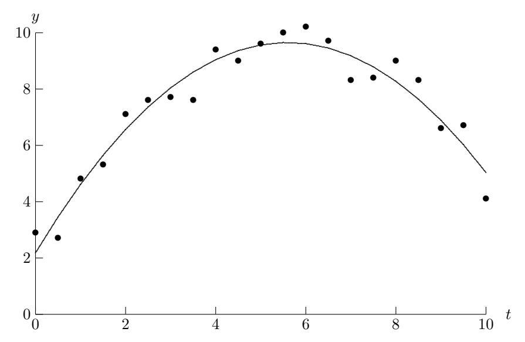
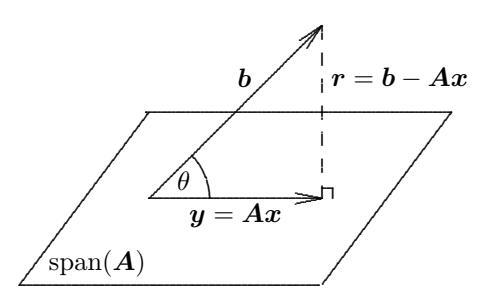

# Lineáris legkisebb négyzetek

# 3.1 Lineáris legkisebb négyzetek feladatok

Tegyük fel, hogy szeretnénk tudni, mennyi a tipikus havi csapadékmennyiség Seattle-ben. Elegendő lenne ehhez egyetlen hónap mérései? Természetesen nem – egy adott hónap szokatlanul napos vagy viharos is lehet. Ehelyett inkább több hónapon át – legalább egy éven, vagy talán tíz éven át – végeznénk méréseket, majd ezeket átlagolnánk. Az így kapott átlag ugyan nem lesz pontosan helyes egyetlen konkrét hónapra sem, mégis valamiféle megérzés azt súgja, hogy a tipikus csapadékmennyiségről sokkal pontosabb képet ad, mint amekkorát bármelyik egyedi mérés valaha is adhatna. Ez az elv – azaz hogy sok mérés elvégzésével elsimítjuk a mérési hibákat és más véletlen ingadozásokat – szinte általánosan elterjedt a megfigyeléses és kísérleti tudományokban. A földmérők szándékosan több mérést is végeznek, mint amennyi szigorúan szükséges volna a tájékozódási pontok közötti távolságok meghatározásához. A csillagászok és a távközlési mérnökök ezt az elvet alkalmazzák, amikor zajos adatokból értelmes jeleket nyernek ki. Még az ács mondása is, miszerint „kétszer mérj, egyszer vágj”, e megközelítés bölcsességének példája.

A csapadékpéldában egyetlen számot kerestünk, amely egy egész számsokaságot reprezentál, vagy valamilyen értelemben közelít. Általánosabban fogalmazva: különféle elméleti és gyakorlati okokból gyakran keresünk egy-egy magasabb dimenziós objektumhoz alacsonyabb dimenziós közelítést. Ennek célja lehet a hibák kisimítása vagy a lényegtelen részletek figyelmen kívül hagyása – például amikor zajos adatokból jelet vagy trendet nyerünk ki –, vagy az, hogy egy nagy adattömeget kezelhetőbb mennyiségre csökkentsünk, vagy hogy egy bonyolult függvényt egyszerű közelítéssel helyettesítsünk. Nem várjuk el, hogy egy ilyen közelítés egzakt legyen – a legtöbb célra nem is szeretnénk, hogy az legyen –, mindazonáltal azt akarjuk, hogy valamennyire emlékeztessen az eredeti adatokra. A lineáris algebra terminológiájával élve azt szeretnénk, hogy egy magasabb dimenziós térből vett vektort egy alacsonyabb dimenziós altérre vetítsünk. Ennek egyik legnépszerűbb és számítási szempontból legkényelmesebb módja a legkisebb négyzetek módszere, amelyet ebben a fejezetben tárgyalunk.

Figyelmünket egyelőre a lineáris feladatokra szűkítjük, a nemlineáris legkisebb négyzeteket a 6.6. szakaszra halasztva. A 2.2. szakaszban láttuk, hogy egy négyzetes lineáris rendszer pontosan meghatározott: ugyanannyi egyenlettel és ismeretlennel mindig pontosan egy megoldás létezik, feltéve hogy a mátrix nemszinguláris. Az interpolációnál például a paraméterek és az adatpontok száma közötti egyezést kihasználva bázisfüggvények lineáris kombinációjával illesztjük pontosan az adott adatokat (lásd a 7. fejezetet). A jelen helyzetben ezzel szemben feltételezzük, hogy az adott adatok zajosak vagy lényegtelen részleteket tartalmaznak, ezért semmilyen különleges előnnyel nem jár, ha pontosan illesztjük őket. Sőt, az ilyen ingadozásokat éppen azzal simíthatjuk ki, hogy lemondunk a pontos illeszkedésről, és a szükségesnél több adatpontot vagy mérést használunk, ami egy túlhatározott rendszerhez vezet, amelyben több az egyenlet, mint az ismeretlen. A lineáris rendszert mátrix-vektor jelöléssel felírva a következőt kapjuk:

$$\boldsymbol{A}\boldsymbol{x} = \boldsymbol{b},$$

ahol $\boldsymbol{A}$ egy $m \times n$-es mátrix, amelyre $m > n$, $\boldsymbol{b}$ egy $m$-dimenziós vektor, $\boldsymbol{x}$ pedig egy $n$-dimenziós vektor. Általában, mivel az $\boldsymbol{x}$ vektorban mindössze $n$ paraméter szerepel, nem várhatjuk el, hogy az $\boldsymbol{A}$ $n$ oszlopának lineáris kombinációjaként reprodukálni tudjuk az $m$-dimenziós $\boldsymbol{b}$ vektort. Más szóval egy túlhatározott rendszernek a szokásos értelemben általában nincs megoldása. Ehelyett a bal és a jobb oldal közötti távolságot minimalizáljuk, azaz az $\boldsymbol{r} = \boldsymbol{b} - \boldsymbol{A}\boldsymbol{x}$ maradékvektor valamely normáját minimalizáljuk az $\boldsymbol{x}$ függvényeként. Elvileg bármelyik norma használható, de – ahogyan látni fogjuk – erős érvek szólnak az euklideszi norma (2-norma) mellett, ideértve a belső szorzattal és az ortogonalitással való kapcsolatát, a simaságát és szigorú konvexitását, valamint a számítási kényelmét. A 2-norma használata adja a legkisebb négyzetek módszerének nevét: a megoldás az az $\boldsymbol{x}$ vektor, amely a lineáris rendszer bal és jobb oldala komponenseinek különbségei négyzetösszegét minimalizálja. A pontos egyenlőség hiányát tükrözendő egy lineáris legkisebb négyzetek feladatot a következő alakban írunk fel:

$$\boldsymbol{A}\boldsymbol{x} \cong \boldsymbol{b},$$

ahol a közelítést a 2-norma, illetve a legkisebb négyzetek értelmében értjük.

**3.1. Példa. Túlhatározott rendszer.** Egy földmérőnek három domb magasságát kell meghatároznia egy referenciaponthoz képest. Először a referenciapontból mérve a földmérő a dombok magasságait rendre $x_1 = 1237$ lábnak, $x_2 = 1941$ lábnak és $x_3 = 2417$ lábnak méri. Ezen kezdeti mérések megerősítésére felmászik az első domb tetejére, és azt méri, hogy a második domb $x_2 - x_1 = 711$ lábbal, a harmadik pedig $x_3 - x_1 = 1177$ lábbal magasabb az elsőnél. Végül a második domb tetejére is felmászik, és azt méri, hogy a harmadik domb $x_3 - x_2 = 475$ lábbal magasabb a másodiknál. Észrevéve a mérések közötti ellentmondásokat, a földmérő a később bemutatandó módszereket használja a

$$\boldsymbol{A}\boldsymbol{x} = \begin{bmatrix} 1 & 0 & 0 \\ 0 & 1 & 0 \\ 0 & 0 & 1 \\ -1 & 1 & 0 \\ -1 & 0 & 1 \\ 0 & -1 & 1 \end{bmatrix} \begin{bmatrix} x_1 \\ x_2 \\ x_3 \end{bmatrix} \cong \begin{bmatrix} 1237 \\ 1941 \\ 2417 \\ 711 \\ 1177 \\ 475 \end{bmatrix} = \boldsymbol{b}$$

túlhatározott lineáris rendszer legkisebb négyzetes megoldásának meghatározására, amelyből $\boldsymbol{x} = [1236,\ 1943,\ 2416]^T$ adódik. Ezek az értékek, amelyek enyhén eltérnek a három kezdeti magasságméréstől, olyan kompromisszumot képviselnek, amely (a legkisebb négyzetek értelmében) a lehető legjobban összehangolja a mérési hibákból eredő ellentmondásokat.

A legkisebb négyzetek módszerének korai fejlesztése nagyrészt Gaussnak köszönhető, aki csillagászati feladatok – különösen égitestek, például kisbolygók és üstökösök pályájának meghatározása – megoldására használta. Egy ilyen test elliptikus pályáját öt paraméter határozza meg (lásd a 3.5. számítógépes feladatot), így elvileg öt pozíciómegfigyelés elegendő lenne a teljes pálya meghatározásához. A mérési hibák miatt azonban egy csupán öt megfigyelésre alapozott pálya rendkívül megbízhatatlan volna. Ehelyett jóval több megfigyelést végeznek, és a legkisebb négyzetek módszerét alkalmazzák arra, hogy elsimítsák a hibákat, és pontosabb értékeket kapjanak a pályaparaméterekre. A legkisebb négyzetes közelítés a megfigyelések tucatjait vagy százait – amelyek egy megfelelően nagy dimenziós térben helyezkednek el – az elliptikus pályamodell ötdimenziós paramétertérévé redukálja.

**3.2. Példa. Adatillesztés.** A legkisebb négyzetek módszerének egyik leggyakoribb alkalmazási területe az *adatillesztés*, más néven a *görbeillesztés*, különösen akkor, amikor az adatokat valamilyen véletlen hiba terheli, mint a legtöbb empirikus laboratóriumi mérés vagy egyéb természeti megfigyelés esetében. Adott $(t_i, y_i)$, $i = 1, \ldots, m$ adatpontok esetén azt az $n$-dimenziós $\boldsymbol{x}$ paramétervektort keressük, amely az $f(t, \boldsymbol{x})$ *modellfüggvénnyel* – ahol $f: \mathbb{R}^{n+1} \to \mathbb{R}$ – a „legjobb illeszkedést” adja az adatokra, ahol a legjobb illeszkedést a legkisebb négyzetek értelmében értjük:

$$\min_{\boldsymbol{x}} \sum_{i=1}^{m} (y_i - f(t_i, \boldsymbol{x}))^2.$$

Egy adatillesztési feladat *lineáris*, ha az $f$ függvény lineáris az $\boldsymbol{x}$ paramétervektor komponenseiben, azaz $f$ a csak $t$-től függő $\phi_j$ függvények

$$f(t, \boldsymbol{x}) = x_1 \phi_1(t) + x_2 \phi_2(t) + \dots + x_n \phi_n(t)$$

lineáris kombinációja. Például a polinomillesztés, amelyre

$$f(t, \boldsymbol{x}) = x_1 + x_2 t + x_3 t^2 + \dots + x_n t^{n-1},$$

lineáris adatillesztési feladat, mert a polinom a $x_j$ együtthatóiban lineáris, bár a $t$ független változóban nemlineáris. Egy *nemlineáris* adatillesztési feladatra példa – amellyel a 6.6. szakaszban foglalkozunk – az exponenciálisok

$$f(t, \boldsymbol{x}) = x_1 e^{x_2 t} + \dots + x_{n-1} e^{x_n t}$$

alakú összege.

Ha definiáljuk az $a_{ij} = \phi_j(t_i)$ elemekkel rendelkező $m \times n$-es $\boldsymbol{A}$ mátrixot, valamint a $b_i = y_i$ komponensekkel rendelkező $m$-dimenziós $\boldsymbol{b}$ vektort, akkor egy lineáris legkisebb négyzetes adatillesztési feladat a

$$\boldsymbol{A}\boldsymbol{x} \cong \boldsymbol{b}$$

alakot ölti. Például ha egy háromparaméteres másodfokú polinomot illesztünk öt $(t_1, y_1), \ldots, (t_5, y_5)$ adatpontra, akkor az $\boldsymbol{A}$ mátrix $5 \times 3$-as, és a feladat alakja:

$$\boldsymbol{A}\boldsymbol{x} = \begin{bmatrix} 1 & t_1 & t_1^2 \\ 1 & t_2 & t_2^2 \\ 1 & t_3 & t_3^2 \\ 1 & t_4 & t_4^2 \\ 1 & t_5 & t_5^2 \end{bmatrix} \begin{bmatrix} x_1 \\ x_2 \\ x_3 \end{bmatrix} \cong \begin{bmatrix} y_1 \\ y_2 \\ y_3 \\ y_4 \\ y_5 \end{bmatrix} = \boldsymbol{b}.$$

Egy ilyen alakú mátrixot, amelynek oszlopai (vagy sorai) egy független változó egymás utáni hatványai, *Vandermonde-mátrixnak* nevezünk.

Tegyük fel, hogy az alábbi mért adatokkal rendelkezünk.

Ez a 21 adatpont, amelyet a 3.1. ábrán pontokként ábrázoltunk, láthatóan tartalmaz bizonyos véletlen zajt, de úgy tűnik, nagyjából egy parabolaív mentén helyezkednek el (vagy talán valamilyen mögöttes fizikai folyamat, például egy lövedék röppályája parabolikus modellt sugall), ezért úgy döntünk, hogy egy másodfokú polinommal illesztjük őket. Nyilvánvaló, hogy egy másodfokú polinom nem illeszkedik pontosan az adatokra, de csupán az adatok általános trendjét kívánjuk meghatározni, és amúgy sem szeretnénk utánozni a véletlen mérési zajt, így a legkisebb négyzetes közelítés megfelelőnek tűnik. Az így kapott túlhatározott $21 \times 3$-as lineáris rendszer alakja:

$$\boldsymbol{A}\boldsymbol{x} = \begin{bmatrix} 1 & 0{,}0 & 0{,}0 \\ 1 & 0{,}5 & 0{,}25 \\ 1 & 1{,}0 & 1{,}0 \\ \vdots & \vdots & \vdots \\ 1 & 10{,}0 & 100{,}0 \end{bmatrix} \begin{bmatrix} x_1 \\ x_2 \\ x_3 \end{bmatrix} \cong \begin{bmatrix} 2{,}9 \\ 2{,}7 \\ 4{,}8 \\ \vdots \\ 4{,}1 \end{bmatrix} = \boldsymbol{b}.$$

E rendszer megoldása – amelynek kiszámítását később ismertetjük – $\boldsymbol{x} \approx \begin{bmatrix} 2{,}18 & 2{,}67 & -0{,}238 \end{bmatrix}^T$, ami azt jelenti, hogy a közelítő polinom, amelyet a 3.1. ábrán sima görbeként ábrázoltunk, a következő:

$$p(t) = 2{,}18 + 2{,}67t - 0{,}238t^2.$$

Ez a konkrét polinom olyan értelemben a legjobban illeszkedő polinom az adott adatokra az összes másodfokú polinom közül, hogy az adatpontok és a görbe közötti függőleges távolságok négyzetösszegét minimalizálja az összes lehetséges másodfokú polinom körében.

A legkisebb négyzetek módszere fontos eszköz a statisztikában, ahol regresszióanalízis néven is ismerik. Mi csak a legkisebb négyzetes feladatok megoldására szolgáló numerikus algoritmusokkal foglalkozunk. A legkisebb négyzetes feladatok felírásával és az eredmények helyes értelmezésével kapcsolatos sok fontos statisztikai szempontért lásd a regresszióanalízis vagy a többváltozós statisztika bármelyik tankönyvét.

3.1. ábra: Másodfokú polinom legkisebb négyzetes illesztése az adott adatokra.

# 3.2 Létezés és egyértelműség

A 2.1. szakaszból felidézhetjük, hogy egy $m \times n$-es $\boldsymbol{A}\boldsymbol{x} = \boldsymbol{b}$ lineáris egyenletrendszer azt kérdezi, kifejezhető-e $\boldsymbol{b}$ az $\boldsymbol{A}$ oszlopainak lineáris kombinációjaként. Négyzetes rendszerek ($m = n$) esetén a válasz nemszinguláris $\boldsymbol{A}$-ra mindig „igen”. Túlhatározott rendszerek ($m > n$) esetén ezzel szemben a válasz általában „nem”, hacsak $\boldsymbol{b}$ történetesen a $\operatorname{span}(\boldsymbol{A})$-ban fekszik, ami a legtöbb alkalmazásban igen valószínűtlen. A legkisebb négyzetek módszerénél azonban nem is várjuk el – és többnyire nem is kívánjuk –, hogy az egyenlet két oldala pontosan egyezzen, csupán a 2-norma szerinti lehető legjobb egyezést. A megoldás ezen másféle fogalmával a létezés és egyértelműség feltételei némileg eltérnek a négyzetes lineáris rendszerekéitől, ahogyan azt a továbbiakban látni fogjuk.

Először is megjegyezzük, hogy a legkisebb négyzetes megoldás létezése mindig biztosított: a $\phi(\boldsymbol{y}) = \|\boldsymbol{b} - \boldsymbol{y}\|_2$ függvény folytonos és koercív $\mathbb{R}^m$-en, így $\phi$-nek minimuma van a zárt, nem korlátos $\operatorname{span}(\boldsymbol{A})$ halmazon (lásd a 6.2. szakaszt), azaz létezik olyan $\boldsymbol{y} \in \operatorname{span}(\boldsymbol{A})$ $m$-dimenziós vektor, amely euklideszi normában a legközelebb van $\boldsymbol{b}$-hez. Emellett $\phi$ szigorúan konvex a $\operatorname{span}(\boldsymbol{A})$ konvex halmazon, így a $\boldsymbol{b}$-hez legközelebbi $\boldsymbol{y} \in \operatorname{span}(\boldsymbol{A})$ vektor egyértelmű (lásd a 6.2.1. szakaszt). Ez azonban nem jelenti azt, hogy a legkisebb négyzetes feladat $\boldsymbol{x}$ megoldása szükségképpen egyértelmű. Tegyük fel, hogy $\boldsymbol{x}_1$ és $\boldsymbol{x}_2$ ilyen megoldások, és legyen $\boldsymbol{z} = \boldsymbol{x}_2 - \boldsymbol{x}_1$. Ekkor, mivel $\boldsymbol{A}\boldsymbol{x}_1 = \boldsymbol{y} = \boldsymbol{A}\boldsymbol{x}_2$, azt kapjuk, hogy $\boldsymbol{A}\boldsymbol{z} = \boldsymbol{0}$. Márpedig ha $\boldsymbol{z} \neq \boldsymbol{0}$, azaz $\boldsymbol{x}_1 \neq \boldsymbol{x}_2$, akkor az $\boldsymbol{A}$ oszlopai lineárisan összefüggők kell, hogy legyenek (vö. négyzetes mátrix nemszingularitásának 4. feltételével a 2.2. szakaszban). Arra a következtetésre jutunk, hogy egy $m \times n$-es $\boldsymbol{A}\boldsymbol{x} \cong \boldsymbol{b}$ legkisebb négyzetes feladat megoldása akkor és csak akkor egyértelmű, ha $\boldsymbol{A}$ teljes oszloprangú, azaz $\operatorname{rank}(\boldsymbol{A}) = n$ (vö. négyzetes mátrix nemszingularitásának 3. feltételével a 2.2. szakaszban). Ha $\operatorname{rank}(\boldsymbol{A}) < n$, akkor az $\boldsymbol{A}$-t *ranghiányosnak* mondjuk, és bár a megfelelő legkisebb négyzetes feladatnak ekkor is kell hogy legyen megoldása, ebben az esetben az nem lehet egyértelmű. A ranghiány következményeit később vizsgáljuk; egyelőre feltételezzük, hogy $\boldsymbol{A}$ teljes oszloprangú.

Az imént idézett létezési bizonyítás nem konstruktív, és kevés betekintést nyújt abba, miként jellemezzük vagy számítsuk ki egy lineáris legkisebb négyzetes feladat megoldását. A továbbiakban analitikus, geometriai és algebrai nézőpontokat tekintünk át, amelyek mélyebb betekintést nyújtanak a legkisebb négyzetes feladatok természetébe és a megoldásukra szolgáló különféle módszerekbe.

### 3.2.1 Normálegyenletek

Minimalizálási feladatként a legkisebb négyzetes feladat a többváltozós analízis eszközeivel kezelhető, hasonlóan ahhoz, ahogyan az egyváltozós analízisben a derivált nullával egyenlőségét írjuk elő. Az $\boldsymbol{r} = \boldsymbol{b} - \boldsymbol{A}\boldsymbol{x}$ maradékvektor euklideszi normájának négyzetét szeretnénk minimalizálni. Ezt a célfüggvényt $\phi: \mathbb{R}^n \to \mathbb{R}$-rel jelölve

$$\phi(\boldsymbol{x}) = \|\boldsymbol{r}\|_2^2 = \boldsymbol{r}^T\boldsymbol{r} = (\boldsymbol{b} - \boldsymbol{A}\boldsymbol{x})^T(\boldsymbol{b} - \boldsymbol{A}\boldsymbol{x}) = \boldsymbol{b}^T\boldsymbol{b} - 2\boldsymbol{x}^T\boldsymbol{A}^T\boldsymbol{b} + \boldsymbol{x}^T\boldsymbol{A}^T\boldsymbol{A}\boldsymbol{x}.$$

A minimum szükséges feltétele, hogy $\boldsymbol{x}$ kritikus pontja legyen $\phi$-nek, azaz a $\nabla \phi(\boldsymbol{x})$ gradiensvektor – amelynek $i$-edik komponensét $\partial \phi(\boldsymbol{x})/\partial x_i$ adja – nulla legyen (lásd a 6.2.2. szakaszt). Ezért teljesülnie kell, hogy

$$\boldsymbol{0} = \nabla \phi(\boldsymbol{x}) = 2\boldsymbol{A}^T\boldsymbol{A}\boldsymbol{x} - 2\boldsymbol{A}^T\boldsymbol{b},$$

tehát $\phi$ bármely $\boldsymbol{x}$ minimumhelyének ki kell elégítenie az $n \times n$-es szimmetrikus lineáris rendszert:

$$\boldsymbol{A}^T\boldsymbol{A}\boldsymbol{x} = \boldsymbol{A}^T\boldsymbol{b}.$$

Elegendő feltétel ahhoz, hogy egy ilyen $\boldsymbol{x}$ valóban minimum legyen, az, hogy a második parciális deriváltakból álló Hesse-mátrix – amely ebben az esetben éppen $2\boldsymbol{A}^T\boldsymbol{A}$ – pozitív definit (ismét lásd a 6.2.2. szakaszt). Könnyen belátható, hogy $\boldsymbol{A}^T\boldsymbol{A}$ akkor és csak akkor pozitív definit, ha az $\boldsymbol{A}$ oszlopai lineárisan függetlenek, azaz $\operatorname{rank}(\boldsymbol{A}) = n$, ami éppen az a kritérium, amelyet korábban a legkisebb négyzetes megoldás egyértelműségére vonatkozóan láttunk.

Az $\boldsymbol{A}^T\boldsymbol{A}\boldsymbol{x} = \boldsymbol{A}^T\boldsymbol{b}$ lineáris rendszert általánosan *normálegyenletek*nek nevezik. Az $\boldsymbol{A}^T\boldsymbol{A}$ mátrix $(i, j)$ elemét az $\boldsymbol{A}$ $i$-edik és $j$-edik oszlopainak belső szorzata adja; emiatt az $\boldsymbol{A}^T\boldsymbol{A}$-t olykor az $\boldsymbol{A}$ keresztszorzat-mátrixának is nevezik. Ez a négyzetes lineáris rendszer egy módszert sugall – amelyet a 3.4.1. szakaszban részletesebben megvizsgálunk – a túlhatározott legkisebb négyzetes feladatok megoldására.

**3.3. Példa. Normálegyenletek.** A 3.1. példabeli lineáris legkisebb négyzetes feladat normálegyenlet-rendszere az alábbi szimmetrikus pozitív definit rendszer:

$$\boldsymbol{A}^T\boldsymbol{A}\boldsymbol{x} = \begin{bmatrix} 3 & -1 & -1 \\ -1 & 3 & -1 \\ -1 & -1 & 3 \end{bmatrix} \begin{bmatrix} x_1 \\ x_2 \\ x_3 \end{bmatrix} = \begin{bmatrix} -651 \\ 2177 \\ 4069 \end{bmatrix} = \boldsymbol{A}^T\boldsymbol{b},$$

amelynek megoldása $\boldsymbol{x} = [1236,\ 1943,\ 2416]^T$, és a 2.21. példában kapott Cholesky-felbontással számítható ki; ez éri el a négyzetösszeg lehető legkisebb értékét, $\|\boldsymbol{r}\|_2^2 = 35$.

#### 3.2.2 Ortogonalitás és ortogonális projektorok

A legkisebb négyzetes feladatok geometriai szemléletéhez szükségünk van az ortogonalitás fogalmára. Felidézzük, hogy $\boldsymbol{v}_1, \boldsymbol{v}_2 \in \mathbb{R}^m$ vektorokra

$$\boldsymbol{v}_1^T\boldsymbol{v}_2 = \|\boldsymbol{v}_1\|_2 \cdot \|\boldsymbol{v}_2\|_2 \cdot \cos(\theta),$$

ahol $\theta$ a $\boldsymbol{v}_1$ és a $\boldsymbol{v}_2$ által bezárt szög. Ennek megfelelően a $\boldsymbol{v}_1$ és a $\boldsymbol{v}_2$ *ortogonális* (vagy *merőleges*, illetve *normális*) egymásra, ha $\boldsymbol{v}_1^T\boldsymbol{v}_2 = 0$.

Egy $\boldsymbol{A}\boldsymbol{x} \cong \boldsymbol{b}$ legkisebb négyzetes feladatnál, ahol $m > n$, az $m$-dimenziós $\boldsymbol{b}$ vektor általában nem fekszik a legfeljebb $n$ dimenziós $\operatorname{span}(\boldsymbol{A})$ altérben. Az az $\boldsymbol{y} = \boldsymbol{A}\boldsymbol{x} \in \operatorname{span}(\boldsymbol{A})$ vektor, amely euklideszi normában a legközelebb van $\boldsymbol{b}$-hez, ott adódik, ahol az $\boldsymbol{r} = \boldsymbol{b} - \boldsymbol{A}\boldsymbol{x}$ maradékvektor ortogonális a $\operatorname{span}(\boldsymbol{A})$-ra (lásd a 3.2. ábrát). Ezért az $\boldsymbol{x}$ legkisebb négyzetes megoldásra az $\boldsymbol{r} = \boldsymbol{b} - \boldsymbol{A}\boldsymbol{x}$ maradékvektornak az $\boldsymbol{A}$ minden oszlopára ortogonálisnak kell lennie, és így teljesülnie kell, hogy

$$\boldsymbol{0} = \boldsymbol{A}^T\boldsymbol{r} = \boldsymbol{A}^T(\boldsymbol{b} - \boldsymbol{A}\boldsymbol{x}),$$

azaz

$$\boldsymbol{A}^T\boldsymbol{A}\boldsymbol{x} = \boldsymbol{A}^T\boldsymbol{b},$$

ami ugyanaz a normálegyenlet-rendszer, mint amelyet korábban az analízis eszközeivel vezettünk le.

3.2. ábra: A lineáris legkisebb négyzetes feladat geometriai szemléltetése. A paralelogramma a $\operatorname{span}(\boldsymbol{A})$ alteret jelöli, amelyben $\boldsymbol{b}$ általában nem fekszik benne.

Az ortogonalitás iménti tárgyalásából, különösen a 3.2. ábrából intuitívan látható, hogy az a $\boldsymbol{y} = \boldsymbol{A}\boldsymbol{x} \in \operatorname{span}(\boldsymbol{A})$ vektor, amely euklideszi normában a legközelebb van $\boldsymbol{b}$-hez, nem más, mint $\boldsymbol{b}$ ortogonális projekciója a $\operatorname{span}(\boldsymbol{A})$-ra. E megfigyelés a legkisebb négyzetes megoldások algebrai jellemzéséhez vezet, amelyet most formálisabban is megvizsgálunk.

Egy $\boldsymbol{P}$ négyzetes mátrixot *projektornak* nevezünk, ha idempotens (azaz $\boldsymbol{P}^2 = \boldsymbol{P}$). Egy ilyen mátrix bármely adott vektort egy altérre – nevezetesen a $\operatorname{span}(\boldsymbol{P})$-re – vetít, viszont változatlanul hagy bármely olyan vektort, amely már eleve ebben az altérben fekszik. Ha egy $\boldsymbol{P}$ projektor ezen kívül szimmetrikus is (azaz $\boldsymbol{P}^T = \boldsymbol{P}$), akkor *ortogonális projektor*. Ha $\boldsymbol{P}$ ortogonális projektor, akkor $\boldsymbol{P}_{\perp} = \boldsymbol{I} - \boldsymbol{P}$ is ortogonális projektor a $\operatorname{span}(\boldsymbol{P})^{\perp}$-re, azaz a $\operatorname{span}(\boldsymbol{P})$ ortogonális kiegészítőjére – vagyis a $\operatorname{span}(\boldsymbol{P})$-re ortogonális összes vektor alterére. Bármely $\boldsymbol{v} \in \mathbb{R}^m$ vektor felírható

$$\boldsymbol{v} = (\boldsymbol{P} + (\boldsymbol{I} - \boldsymbol{P}))\,\boldsymbol{v} = \boldsymbol{P}\boldsymbol{v} + \boldsymbol{P}_{\perp}\boldsymbol{v}$$

alakban, kölcsönösen ortogonális vektorok összegeként, amelyek közül az egyik a $\operatorname{span}(\boldsymbol{P})$-ben, a másik a $\operatorname{span}(\boldsymbol{P})^{\perp}$-ben van.

Hogy ezeket a fogalmakat az $\boldsymbol{A}\boldsymbol{x} \cong \boldsymbol{b}$ legkisebb négyzetes feladatra alkalmazzuk, tegyük fel, hogy $\boldsymbol{P}$ ortogonális projektor a $\operatorname{span}(\boldsymbol{A})$-ra. Ekkor

$$\begin{aligned}
\|\boldsymbol{b} - \boldsymbol{A}\boldsymbol{x}\|_2^2 &= \|\boldsymbol{P}(\boldsymbol{b} - \boldsymbol{A}\boldsymbol{x}) + \boldsymbol{P}_{\perp}(\boldsymbol{b} - \boldsymbol{A}\boldsymbol{x})\|_2^2 \\
&= \|\boldsymbol{P}(\boldsymbol{b} - \boldsymbol{A}\boldsymbol{x})\|_2^2 + \|\boldsymbol{P}_{\perp}(\boldsymbol{b} - \boldsymbol{A}\boldsymbol{x})\|_2^2 \quad \text{(Pitagorasz-tétel alapján)} \\
&= \|\boldsymbol{P}\boldsymbol{b} - \boldsymbol{A}\boldsymbol{x}\|_2^2 + \|\boldsymbol{P}_{\perp}\boldsymbol{b}\|_2^2 \quad \text{(mivel } \boldsymbol{P}\boldsymbol{A} = \boldsymbol{A} \text{ és } \boldsymbol{P}_{\perp}\boldsymbol{A} = \boldsymbol{O}\text{)}.
\end{aligned}$$

A jobb oldal második tagja nem függ $\boldsymbol{x}$-től, így a maradéknorma akkor minimális, ha $\boldsymbol{x}$-et úgy választjuk, hogy az első tag nulla legyen. A legkisebb négyzetes megoldást tehát a

$$\boldsymbol{A}\boldsymbol{x} = \boldsymbol{P}\boldsymbol{b}$$

túlhatározott, de konzisztens lineáris rendszer adja meg. Ebből az egyenletből úgy juthatunk négyzetes lineáris rendszerhez, hogy mindkét oldalát balról megszorozzuk $\boldsymbol{A}^T$-vel, figyelembe véve, hogy $\boldsymbol{A}^T\boldsymbol{P} = \boldsymbol{A}^T\boldsymbol{P}^T = (\boldsymbol{P}\boldsymbol{A})^T = \boldsymbol{A}^T$, amiből

$$\boldsymbol{A}^T\boldsymbol{A}\boldsymbol{x} = \boldsymbol{A}^T\boldsymbol{b}$$

adódik, ami ismét a korábban levezetett normálegyenlet-rendszer.

Az ortogonális projektort az alábbi módon kaphatjuk meg explicit alakban: ha $\boldsymbol{A}$ teljes oszloprangú, úgyhogy $\boldsymbol{A}^T\boldsymbol{A}$ nemszinguláris, akkor

$$\boldsymbol{P} = \boldsymbol{A}(\boldsymbol{A}^T\boldsymbol{A})^{-1}\boldsymbol{A}^T$$

szimmetrikus és idempotens, és így ortogonális projektor a $\operatorname{span}(\boldsymbol{A})$-ra. Ennélfogva az a $\boldsymbol{y} \in \operatorname{span}(\boldsymbol{A})$ vektor, amely a legközelebb van $\boldsymbol{b}$-hez, a

$$\boldsymbol{y} = \boldsymbol{P}\boldsymbol{b} = \boldsymbol{A}(\boldsymbol{A}^T\boldsymbol{A})^{-1}\boldsymbol{A}^T\boldsymbol{b} = \boldsymbol{A}\boldsymbol{x}$$

ortogonális projekció, ahol $\boldsymbol{x}$ a normálegyenletek által megadott legkisebb négyzetes megoldás. Érdemes megjegyezni azt is, hogy $\boldsymbol{b}$ a

$$\boldsymbol{b} = \boldsymbol{P}\boldsymbol{b} + \boldsymbol{P}_{\perp}\boldsymbol{b} = \boldsymbol{A}\boldsymbol{x} + (\boldsymbol{b} - \boldsymbol{A}\boldsymbol{x}) = \boldsymbol{y} + \boldsymbol{r}$$

alakban felírható két kölcsönösen ortogonális vektor összegeként, ahol $\boldsymbol{y} \in \operatorname{span}(\boldsymbol{A})$ és $\boldsymbol{r} \in \operatorname{span}(\boldsymbol{A})^{\perp}$.

Egy másik lehetőség: legyen $\boldsymbol{Q}$ egy olyan $m \times n$-es mátrix, amelynek oszlopai ortonormált bázist alkotnak (azaz $\boldsymbol{Q}^T\boldsymbol{Q} = \boldsymbol{I}$) a $\operatorname{span}(\boldsymbol{A})$-ban. Ekkor $\boldsymbol{P} = \boldsymbol{Q}\boldsymbol{Q}^T$ szimmetrikus és idempotens, így ortogonális projektor a $\operatorname{span}(\boldsymbol{Q}) = \operatorname{span}(\boldsymbol{A})$-ra. Ezzel a megközelítéssel az előbbi konzisztens túlhatározott rendszerből úgy kaphatunk négyzetes rendszert, hogy mindkét oldalát balról megszorozzuk $\boldsymbol{Q}^T$-vel, és figyelembe vesszük, hogy $\boldsymbol{Q}^T\boldsymbol{P} = \boldsymbol{Q}^T\boldsymbol{Q}\boldsymbol{Q}^T = \boldsymbol{Q}^T$, amiből a

$$\boldsymbol{Q}^T\boldsymbol{A}\boldsymbol{x} = \boldsymbol{Q}^T\boldsymbol{b}$$

négyzetes rendszer adódik. Később látni fogjuk, hogyan számítható ki a $\boldsymbol{Q}$ mátrix úgy, hogy ez a rendszer felső háromszögű legyen, és ezért könnyen megoldható. A szokásos normálegyenletek felírásának ily módon való elkerülése pontosság és stabilitás szempontjából is előnyökkel jár, amint azt hamarosan látni fogjuk.

**3.4. Példa. Ortogonalitás és projekciók.** Ezeket a fogalmakat a 3.1. és 3.3. példabeli legkisebb négyzetes feladat folytatásaként szemléltetjük. Az $\boldsymbol{x} = [1236,\ 1943,\ 2416]^T$ megoldáshelyen a maradékvektor

$$\boldsymbol{r} = \boldsymbol{b} - \boldsymbol{A}\boldsymbol{x} = \boldsymbol{b} - \boldsymbol{y} = \begin{bmatrix} 1237 \\ 1941 \\ 2417 \\ 711 \\ 1177 \\ 475 \end{bmatrix} - \begin{bmatrix} 1236 \\ 1943 \\ 2416 \\ 707 \\ 1180 \\ 473 \end{bmatrix} = \begin{bmatrix} 1 \\ -2 \\ 1 \\ 4 \\ -3 \\ 2 \end{bmatrix}$$

ortogonális az $\boldsymbol{A}$ minden oszlopára, azaz $\boldsymbol{A}^T\boldsymbol{r} = \boldsymbol{0}$. A $\operatorname{span}(\boldsymbol{A})$-ra vetítő ortogonális projektor

$$\boldsymbol{P} = \boldsymbol{A}(\boldsymbol{A}^T\boldsymbol{A})^{-1}\boldsymbol{A}^T = \frac{1}{4}\begin{bmatrix} 2 & 1 & 1 & -1 & -1 & 0 \\ 1 & 2 & 1 & 1 & 0 & -1 \\ 1 & 1 & 2 & 0 & 1 & 1 \\ -1 & 1 & 0 & 2 & 1 & -1 \\ -1 & 0 & 1 & 1 & 2 & 1 \\ 0 & -1 & 1 & -1 & 1 & 2 \end{bmatrix},$$

a $\operatorname{span}(\boldsymbol{A})^{\perp}$-re vetítő ortogonális projektor pedig

$$\boldsymbol{P}_{\perp} = \boldsymbol{I} - \boldsymbol{P} = \frac{1}{4}\begin{bmatrix} 2 & -1 & -1 & 1 & 1 & 0 \\ -1 & 2 & -1 & -1 & 0 & 1 \\ -1 & -1 & 2 & 0 & -1 & -1 \\ 1 & -1 & 0 & 2 & -1 & 1 \\ 1 & 0 & -1 & -1 & 2 & -1 \\ 0 & 1 & -1 & 1 & -1 & 2 \end{bmatrix},$$

úgyhogy $\boldsymbol{b} = \boldsymbol{P}\boldsymbol{b} + \boldsymbol{P}_{\perp}\boldsymbol{b} = \boldsymbol{y} + \boldsymbol{r}$.
