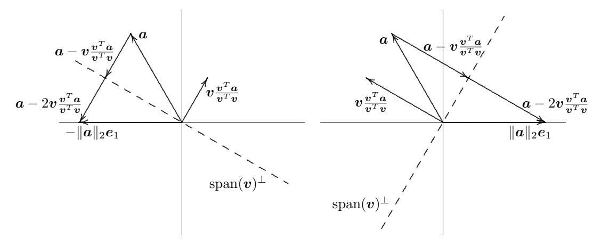

# 3.5 Ortogonalizációs módszerek

Egy mátrix QR-felbontásának kiszámításához hasonló megközelítést követünk, mint a Gauss-kiküszöböléssel végzett LU-felbontásnál: egymás után vezetünk be nullákat az $\boldsymbol{A}$ mátrixba, míg végül felső háromszögalakot kapunk; most azonban nem elemi eliminációs mátrixokat, hanem ortogonális transzformációkat használunk, hogy az euklideszi norma megmaradjon. Számos ilyen ortogonalizációs módszer elterjedt, többek között

- Householder-transzformációk (elemi reflektorok)
- Givens-transzformációk (síkbeli forgatások)
- Gram–Schmidt-ortogonalizáció

Elsősorban a Householder-transzformációk használatára összpontosítunk, hiszen ez a legelterjedtebb, és ebben a kontextusban általában a leghatékonyabb eljárás is, de a másik két módszert is felvázoljuk.

#### 3.5.1 Householder-transzformációk

Olyan ortogonális transzformációt keresünk, amely egy adott vektor kívánt komponenseit nullázza ki. Ennek egyik módja a *Householder-transzformáció*, más néven *elemi reflektor*, amely a

$$\boldsymbol{H} = \boldsymbol{I} - 2\frac{\boldsymbol{v}\boldsymbol{v}^T}{\boldsymbol{v}^T\boldsymbol{v}}$$

alakú mátrix, ahol $\boldsymbol{v}$ nemnulla vektor. A definícióból azonnal látszik, hogy $\boldsymbol{H} = \boldsymbol{H}^T = \boldsymbol{H}^{-1}$, vagyis a $\boldsymbol{H}$ egyszerre ortogonális és szimmetrikus. Adott $\boldsymbol{a}$ vektor esetén a $\boldsymbol{v}$ vektort úgy szeretnénk megválasztani, hogy az $\boldsymbol{a}$ első komponensén kívül minden további komponens nullává váljon, azaz

$$\boldsymbol{H}\boldsymbol{a} = \begin{bmatrix} \alpha \\ 0 \\ \vdots \\ 0 \end{bmatrix} = \alpha \begin{bmatrix} 1 \\ 0 \\ \vdots \\ 0 \end{bmatrix} = \alpha \boldsymbol{e}_1.$$

A $\boldsymbol{H}$ képletét felhasználva

$$\alpha\, \boldsymbol{e}_1 = \boldsymbol{H}\boldsymbol{a} = \left(\boldsymbol{I} - 2\,\frac{\boldsymbol{v}\boldsymbol{v}^T}{\boldsymbol{v}^T\boldsymbol{v}}\right)\boldsymbol{a} = \boldsymbol{a} - 2\,\boldsymbol{v}\,\frac{\boldsymbol{v}^T\boldsymbol{a}}{\boldsymbol{v}^T\boldsymbol{v}},$$

és így

$$\boldsymbol{v} = (\boldsymbol{a} - \alpha\,\boldsymbol{e}_1)\,\frac{\boldsymbol{v}^T\boldsymbol{v}}{2\boldsymbol{v}^T\boldsymbol{a}}.$$

A skaláris szorzó azonban közömbös a $\boldsymbol{v}$ meghatározása szempontjából, mert a $\boldsymbol{H}$ képletéből úgyis kiesik, ezért vehetjük, hogy

$$\boldsymbol{v} = \boldsymbol{a} - \alpha\,\boldsymbol{e}_1.$$

A norma megőrzéséhez szükségképpen $\alpha = \pm \|\boldsymbol{a}\|_2$, az előjelet pedig úgy kell megválasztani, hogy elkerüljük a számjegykioltást (azaz $\alpha = -\mathrm{sign}(a_1)\|\boldsymbol{a}\|_2$). További lehetséges numerikus nehézség, hogy a $\|\boldsymbol{a}\|_2$ kiszámítása fölösleges túlcsorduláshoz vagy alulcsorduláshoz vezethet, ha az $\boldsymbol{a}$ komponensei nagyon nagyok vagy nagyon kicsik. Ezt elkerülhetjük, ha az $\boldsymbol{a}$ vektort már az elején elosztjuk a legnagyobb abszolút értékű komponensével. Ez a skálatényező a kapott $\boldsymbol{H}$ transzformációt sem változtatja meg.

A fenti algebrai levezetés mélyebb megértése érdekében tekintsük a 3.3. ábrán szemléltetett geometriai értelmezést. Az $\boldsymbol{a}$ vektort úgy vihetjük át az első koordinátatengelyre (ahol a többi komponense nullává válik) a normáját megőrizve, hogy tükrözzük azt valamelyik hipersíkra a kettő közül (a kétdimenziós ábrákon szaggatott vonalakkal jelölt hipersíkokra), amelyek az $\boldsymbol{a}$ és az első koordinátatengely közötti két szöget megfelezik. Az így kapott transzformált vektor $\pm \|\boldsymbol{a}\|_2 \boldsymbol{e}_1$ lesz, attól függően, hogy a két hipersík közül melyiket választjuk. Egy ilyen hipersík alakja $\operatorname{span}(\boldsymbol{v})^{\perp} = \{\boldsymbol{x} : \boldsymbol{v}^T\boldsymbol{x} = 0\}$ valamilyen nemnulla $\boldsymbol{v}$ vektorra. Az ábrákból jól látszik, hogy a $\boldsymbol{v}$ párhuzamos kell, hogy legyen az $\boldsymbol{a} - \alpha \boldsymbol{e}_1$ vektorral, ahol $\alpha = \pm \|\boldsymbol{a}\|_2$ – a hipersík választásától függően. Emlékezzünk a 3.2.2. szakaszból arra, hogy a $\operatorname{span}(\boldsymbol{v})$-re vetítő ortogonális projektor $\boldsymbol{P} = \boldsymbol{v}(\boldsymbol{v}^T\boldsymbol{v})^{-1}\boldsymbol{v}^T = (\boldsymbol{v}\boldsymbol{v}^T)/(\boldsymbol{v}^T\boldsymbol{v})$, a $\operatorname{span}(\boldsymbol{v})^{\perp}$-re vetítő projektor pedig $\boldsymbol{I} - \boldsymbol{P}$. Ennélfogva $(\boldsymbol{I} - \boldsymbol{P})\boldsymbol{a} = \boldsymbol{a} - \boldsymbol{v}(\boldsymbol{v}^T\boldsymbol{a})/(\boldsymbol{v}^T\boldsymbol{v})$ adja az $\boldsymbol{a}$ vektornak a hipersíkra vett vetületét, de az első koordinátatengely eléréséhez kétszer olyan messzire kell elmennünk, azaz $\boldsymbol{a} - 2\boldsymbol{v}(\boldsymbol{v}^T\boldsymbol{a})/(\boldsymbol{v}^T\boldsymbol{v})$-ig, így a keresett transzformáció $\boldsymbol{H} = \boldsymbol{I} - 2\boldsymbol{P} = \boldsymbol{I} - 2(\boldsymbol{v}\boldsymbol{v}^T)/(\boldsymbol{v}^T\boldsymbol{v})$. Elvben bármelyik hipersík választása működik, de ahhoz, hogy véges precíziójú aritmetikában a $\boldsymbol{v}$ kiszámítása során elkerüljük a számjegykioltást, az $\alpha$-nak azt az előjelét kell választanunk, amelyhez az első koordinátatengelyen az $\boldsymbol{a}$-tól távolabbi pont tartozik. Az ábrákon szereplő példavektor esetén a pozitív előjelet kell választani (azaz a jobb oldali ábrát), mert $a_1$ negatív.



3.3. ábra: A Householder-transzformáció geometriai értelmezése tükrözésként.

**3.7. Példa. Householder-transzformáció.** A most leírt konstrukció szemléltetéséhez olyan Householder-transzformációt határozunk meg, amely a

$$\boldsymbol{a} = \begin{bmatrix} 2 \\ 1 \\ 2 \end{bmatrix}$$

vektor első komponensén kívül minden komponensét kinullázza.

Az ismertetett recept szerint a

$$\boldsymbol{v} = \boldsymbol{a} - \alpha \boldsymbol{e}_1 = \begin{bmatrix} 2 \\ 1 \\ 2 \end{bmatrix} - \alpha \begin{bmatrix} 1 \\ 0 \\ 0 \end{bmatrix} = \begin{bmatrix} 2 \\ 1 \\ 2 \end{bmatrix} - \begin{bmatrix} \alpha \\ 0 \\ 0 \end{bmatrix}$$

vektort választjuk, ahol $\alpha = \pm \|\boldsymbol{a}\|_2 = \pm 3$. Mivel $a_1$ pozitív, a számjegykioltást úgy kerülhetjük el, ha az $\alpha$-hoz a negatív előjelet választjuk. Így

$$\boldsymbol{v} = \begin{bmatrix} 2\\1\\2 \end{bmatrix} - \begin{bmatrix} -3\\0\\0 \end{bmatrix} = \begin{bmatrix} 5\\1\\2 \end{bmatrix}.$$

Annak ellenőrzésére, hogy a Householder-transzformáció a vártnak megfelelően viselkedik, kiszámoljuk, hogy

$$\boldsymbol{H}\boldsymbol{a} = \boldsymbol{a} - 2\,\frac{\boldsymbol{v}^T\boldsymbol{a}}{\boldsymbol{v}^T\boldsymbol{v}}\,\boldsymbol{v} = \begin{bmatrix} 2\\1\\2 \end{bmatrix} - 2\,\frac{15}{30}\begin{bmatrix} 5\\1\\2 \end{bmatrix} = \begin{bmatrix} -3\\0\\0 \end{bmatrix},$$

ami azt mutatja, hogy az eredmény nullamintázata helyes, és a 2-norma megmarad. Figyeljük meg, hogy a $\boldsymbol{H}$ mátrixot nem kell explicit módon felírnunk, hiszen a $\boldsymbol{H}$ bármely vektorra való alkalmazásához elegendő a $\boldsymbol{v}$ vektor ismerete.

Eddig azt mutattuk meg, hogyan konstruálhatunk Householder-transzformációt, amely egy adott vektor első komponensén kívül minden komponensét kinullázza. Általánosabban, egy adott $m$-dimenziós $\boldsymbol{a}$ vektorhoz tekintsük a

$$\boldsymbol{a} = \begin{bmatrix} \boldsymbol{a}_1 \\ \boldsymbol{a}_2 \end{bmatrix}$$

partíciót, ahol $\boldsymbol{a}_1$ egy $(k-1)$-dimenziós vektor, $1 \le k < m$. Ha a Householder-vektort a

$$\boldsymbol{v} = \begin{bmatrix} \boldsymbol{0} \\ \boldsymbol{a}_2 \end{bmatrix} - \alpha\,\boldsymbol{e}_k$$

alakban vesszük, ahol $\alpha = -\mathrm{sign}(a_k)\|\boldsymbol{a}_2\|_2$, akkor az ebből adódó Householder-transzformáció az $\boldsymbol{a}$ utolsó $m - k$ komponensét nullázza ki. Ilyen Householder-transzformációk sorozatát $k = 1, \ldots, n$ értékekre alkalmazva egy $m \times n$-es $\boldsymbol{A}$ mátrix minden főátló alatti elemét kinullázhatjuk – oszloponként haladva balról jobbra –, és így a mátrixot felső háromszögalakra hozzuk. Minden Householder-transzformációt a mátrix még redukálatlan részére kell alkalmazni, de a már redukált korábbi oszlopokat nem érinti, ezért a nullák az egymás utáni transzformációk során megmaradnak. Egy tetszőleges $\boldsymbol{u}$ vektorra alkalmazott $\boldsymbol{H}$ Householder-transzformáció esetén

$$\boldsymbol{H}\boldsymbol{u} = \left(\boldsymbol{I} - 2\frac{\boldsymbol{v}\boldsymbol{v}^T}{\boldsymbol{v}^T\boldsymbol{v}}\right)\boldsymbol{u} = \boldsymbol{u} - \left(2\frac{\boldsymbol{v}^T\boldsymbol{u}}{\boldsymbol{v}^T\boldsymbol{v}}\right)\boldsymbol{v},$$

amelynek kiszámítása lényegesen olcsóbb, mint egy általános mátrix-vektor szorzásé, és csupán a $\boldsymbol{v}$ vektor ismeretét igényli, a $\boldsymbol{H}$ mátrix explicit felírását nem. Egy $m \times n$-es $\boldsymbol{A}$ mátrix Householder-transzformációkkal történő QR-felbontását a 3.1. algoritmus foglalja össze; benne az $\boldsymbol{A}$ mátrix $j$-edik oszlopát $\boldsymbol{a}_j$ jelöli, az egyszerűség kedvéért pedig elhagytuk azt a skálázást, amely robusztus megvalósításhoz elengedhetetlen volna. Hatékony megvalósításban kerülnénk az egyes $\boldsymbol{v}_k$ vezető nulláival végzett műveleteket. Az algoritmus végén a mátrix felső háromszögű lesz.

Vegyük észre, hogy ha valamely $k$ lépésnél $\beta_k = 0$, akkor az ebben a lépésben kinullázandó főátló alatti elemek már eleve nullák, így egyszerűen továbbléphetünk a következő oszlopra, és a QR-felbontás ettől még befejezhető. Az $\alpha_k$ előjelének választása miatt azonban $\beta_k$ csak akkor lehet nulla, ha $a_{kk}$ is nulla, ami azt jelenti, hogy az $\boldsymbol{A}$ $k$-adik oszlopa lineárisan függ az első $k-1$ oszloptól, tehát az $\boldsymbol{A}$ nem teljes oszlopú rangú. Ekkor a kapott $\boldsymbol{R}$ felső háromszögmátrixnak lesz nulla főátlóeleme, és így szinguláris lesz. Alattomosabb gond, ha a főátlóban egy nagyon kicsi, de nemnulla elem jelenik meg, ami közel ranghiányra utal. A ranghiány és a közel ranghiány következményeit a 3.5.4. szakaszban tárgyaljuk.

A most leírt folyamat egy

$$\boldsymbol{H}_n \cdots \boldsymbol{H}_1 \boldsymbol{A} = \begin{bmatrix} \boldsymbol{R} \\ \boldsymbol{O} \end{bmatrix}$$

alakú felbontást ad,

#### 3.1. Algoritmus. Householder QR-felbontás.

```
for k = 1 to min(n, m − 1)                                { ciklus az oszlopokra }
    αk = −sign(akk) √(akk² + … + amk²)
    vk = [0 … 0  akk … amk]ᵀ − αk ek                      { Householder-vektor
                                                            kiszámítása a
                                                            jelenlegi oszlopra }
    βk = vkᵀ vk
    if βk = 0 then                                        { az aktuális oszlop
        continue with next k                                átugrása, ha az
                                                            már nulla }
    for j = k to n                                        { transzformáció
        γj = vkᵀ aj                                         alkalmazása a maradék
        aj = aj − (2γj/βk) vk                               részmátrixra }
    end
end
```

ahol $\boldsymbol{R}$ felső háromszögű. Az egymást követő Householder-transzformációk $\boldsymbol{H}_n \cdots \boldsymbol{H}_1$ szorzata maga is ortogonális mátrix. Így ha bevezetjük a

$$\boldsymbol{Q}^T = \boldsymbol{H}_n \cdots \boldsymbol{H}_1,$$

vagy ezzel ekvivalens módon a $\boldsymbol{Q} = \boldsymbol{H}_1 \cdots \boldsymbol{H}_n$ jelölést, akkor

$$\boldsymbol{A} = \boldsymbol{Q} \begin{bmatrix} \boldsymbol{R} \\ \boldsymbol{O} \end{bmatrix}.$$

Ezzel tehát valóban kiszámítottuk az $\boldsymbol{A}$ mátrix QR-felbontását, amellyel a lineáris legkisebb négyzetek feladata most már megoldható. A megoldás megőrzéséhez azonban ugyanezen Householder-transzformációk sorozatával a $\boldsymbol{b}$ jobb oldali vektort is transzformálnunk kell. Ezek után az ezzel ekvivalens, háromszögű legkisebb négyzetes feladatot oldjuk meg:

$$\begin{bmatrix} \boldsymbol{R} \\ \boldsymbol{O} \end{bmatrix} \boldsymbol{x} \cong \boldsymbol{Q}^T \boldsymbol{b} = \begin{bmatrix} \boldsymbol{c}_1 \\ \boldsymbol{c}_2 \end{bmatrix}.$$

A lineáris legkisebb négyzetek feladatának megoldásához a Householder-transzformációk $\boldsymbol{Q}$ szorzatát nem szükséges explicit módon felírni. Az erre a feladatra készült szoftverek többségében a $\boldsymbol{R}$-t az eredetileg az $\boldsymbol{A}$-t tartalmazó tömb felső háromszögében tárolják, a Householder-transzformációk felírásához szükséges $\boldsymbol{v}_k$ Householder-vektorok nemnulla részeit pedig az $\boldsymbol{A}$ (most nullákká vált) alsó háromszögű részében helyezik el. (Szigorúan véve ehhez még egy $n$-dimenziós vektornyi memóriára van szükség, mivel minden Householder-vektornak eggyel több nemnulla komponense van, mint ahányat az $\boldsymbol{A}$ megfelelő oszlopának főátló alatti része el tud tárolni.) Amint már láttuk, a Householder-transzformációkat amúgy is legegyszerűbben ebben az alakban alkalmazzuk (nem pedig explicit mátrix-vektor szorzással), így a $\boldsymbol{v}_k$ vektorok elegendőek mind az eredeti legkisebb négyzetes feladat, mind minden további, ugyanolyan mátrixú, de más jobb oldali vektort tartalmazó feladat megoldásához. Ha azonban a $\boldsymbol{Q}$-ra valamilyen más okból explicit alakban volna szükségünk, úgy az kiszámítható az egyes Householder-transzformációk egymás utáni szorzataként, kiindulásként az $\boldsymbol{I}$ egységmátrixszal – ehhez viszont további memória szükséges.

**3.8. Példa. Householder QR-felbontás.** A Householder QR-felbontást a 3.1. példában szereplő legkisebb négyzetes feladat megoldásával szemléltetjük. Az $\boldsymbol{A}$ első oszlopa főátló alatti elemeinek kinullázásához a $\boldsymbol{v}_1$ Householder-vektor

$$\boldsymbol{v}_1 = \boldsymbol{a}_1 - \alpha\,\boldsymbol{e}_1 = \begin{bmatrix} 1\\0\\0\\-1\\-1\\0 \end{bmatrix} - \begin{bmatrix} -1{,}7321\\0\\0\\0\\0\\0 \end{bmatrix} = \begin{bmatrix} 2{,}7321\\0\\0\\-1\\-1\\0 \end{bmatrix}.$$

Az ebből adódó $\boldsymbol{H}_1$ Householder-transzformáció alkalmazásával

$$\boldsymbol{H}_1 \boldsymbol{A} = \begin{bmatrix} -1{,}7321 & 0{,}5774 & 0{,}5774 \\ 0 & 1 & 0 \\ 0 & 0 & 1 \\ 0 & 0{,}7887 & -0{,}2113 \\ 0 & -0{,}2113 & 0{,}7887 \\ 0 & -1 & 1 \end{bmatrix}, \qquad \boldsymbol{H}_1 \boldsymbol{b} = \begin{bmatrix} 376 \\ 1941 \\ 2417 \\ 1026 \\ 1492 \\ 475 \end{bmatrix}.$$

A $\boldsymbol{H}_1 \boldsymbol{A}$ második oszlopa főátló alatti elemeinek kinullázásához a $\boldsymbol{v}_2$ Householder-vektor

$$\boldsymbol{v}_2 = \begin{bmatrix} 0\\1\\0\\0{,}7887\\-0{,}2113\\-1 \end{bmatrix} - \begin{bmatrix} 0\\-1{,}6330\\0\\0\\0\\0 \end{bmatrix} = \begin{bmatrix} 0\\2{,}6330\\0\\0{,}7887\\-0{,}2113\\-1 \end{bmatrix}.$$

Az ebből adódó $\boldsymbol{H}_2$ Householder-transzformáció alkalmazásával

$$\boldsymbol{H}_2 \boldsymbol{H}_1 \boldsymbol{A} = \begin{bmatrix} -1{,}7321 & 0{,}5774 & 0{,}5774 \\ 0 & -1{,}6330 & 0{,}8165 \\ 0 & 0 & 1 \\ 0 & 0 & 0{,}0332 \\ 0 & 0 & 0{,}7231 \\ 0 & 0 & 0{,}6899 \end{bmatrix}, \qquad \boldsymbol{H}_2 \boldsymbol{H}_1 \boldsymbol{b} = \begin{bmatrix} 376 \\ -1200 \\ 2417 \\ 85 \\ 1744 \\ 1668 \end{bmatrix}.$$

A $\boldsymbol{H}_2 \boldsymbol{H}_1 \boldsymbol{A}$ harmadik oszlopa főátló alatti elemeinek kinullázásához a $\boldsymbol{v}_3$ Householder-vektor

$$\boldsymbol{v}_3 = \begin{bmatrix} 0\\0\\1\\0{,}0332\\0{,}7231\\0{,}6899 \end{bmatrix} - \begin{bmatrix} 0\\0\\-1{,}4142\\0\\0\\0 \end{bmatrix} = \begin{bmatrix} 0\\0\\2{,}4142\\0{,}0332\\0{,}7231\\0{,}6899 \end{bmatrix}.$$

Az ebből adódó $\boldsymbol{H}_3$ Householder-transzformáció alkalmazásával

$$\boldsymbol{H}_3 \boldsymbol{H}_2 \boldsymbol{H}_1 \boldsymbol{A} = \begin{bmatrix} -1{,}7321 & 0{,}5774 & 0{,}5774 \\ 0 & -1{,}6330 & 0{,}8165 \\ 0 & 0 & -1{,}4142 \\ 0 & 0 & 0 \\ 0 & 0 & 0 \\ 0 & 0 & 0 \end{bmatrix} = \begin{bmatrix} \boldsymbol{R} \\ \boldsymbol{O} \end{bmatrix}$$

és

$$\boldsymbol{H}_3 \boldsymbol{H}_2 \boldsymbol{H}_1 \boldsymbol{b} = \begin{bmatrix} 376 \\ -1200 \\ -3417 \\ 5 \\ 3 \\ 1 \end{bmatrix} = \boldsymbol{Q}^T \boldsymbol{b} = \begin{bmatrix} \boldsymbol{c}_1 \\ \boldsymbol{c}_2 \end{bmatrix}.$$

Az $\boldsymbol{R}\boldsymbol{x} = \boldsymbol{c}_1$ felső háromszögű rendszert mostantól visszahelyettesítéssel oldhatjuk meg, és az $\boldsymbol{x} = [1236, 1943, 2416]^T$ megoldást kapjuk. Mind a megoldás, mind a minimális maradék négyzetösszege – $\|\boldsymbol{r}\|_2^2 = \|\boldsymbol{c}_2\|_2^2 = 35$ – megegyezik a 3.3. példában kapott értékekkel.

#### 3.5.2 Givens-forgatások

A Householder-transzformációk egyszerre sok nullát vezetnek be egy oszlopba. Bár hatékonyság szempontjából ez általában előnyös, a megközelítés túlságosan „durva" is lehet, ha nagyobb szelektivitásra van szükségünk a nullák bevezetésekor. Ezért bizonyos esetekben érdemesebb Givens-forgatásokat használni, amelyek egyszerre egy-egy nullát vezetnek be.

Olyan ortogonális mátrixot keresünk, amely egy adott vektor egyetlen komponensét nullázza ki. Ennek egyik módja a *síkbeli forgatás*, amelyet a QR-felbontás kontextusában gyakran *Givens-forgatásnak* neveznek; alakja

$$\boldsymbol{G} = \begin{bmatrix} c & s \\ -s & c \end{bmatrix},$$

ahol $c$ és $s$ a forgatási szög koszinusza és szinusza. Az ortogonalitás megköveteli, hogy $c^2 + s^2 = 1$ teljesüljön, ami természetesen bármely szög koszinuszára és szinuszára igaz. Itt egy adott $\boldsymbol{a} = \begin{bmatrix} a_1 & a_2 \end{bmatrix}^T$ 2-dimenziós vektorra úgy szeretnénk megválasztani $c$-t és $s$-t, hogy

$$\boldsymbol{G}\boldsymbol{a} = \begin{bmatrix} c & s \\ -s & c \end{bmatrix} \begin{bmatrix} a_1 \\ a_2 \end{bmatrix} = \begin{bmatrix} \alpha \\ 0 \end{bmatrix}.$$

Azaz: ha az $\boldsymbol{a}$ vektort úgy forgatjuk el, hogy az első koordinátatengellyel párhuzamos legyen, akkor a második komponense nullává válik. A fenti egyenlet átírható a következő alakba:

$$\begin{bmatrix} a_1 & a_2 \\ a_2 & -a_1 \end{bmatrix} \begin{bmatrix} c \\ s \end{bmatrix} = \begin{bmatrix} \alpha \\ 0 \end{bmatrix}.$$

Erre a rendszerre Gauss-kiküszöbölést végrehajtva a

$$\begin{bmatrix} a_1 & a_2 \\ 0 & -a_1 - a_2^2/a_1 \end{bmatrix} \begin{bmatrix} c \\ s \end{bmatrix} = \begin{bmatrix} \alpha \\ -\alpha a_2/a_1 \end{bmatrix}$$

háromszögű rendszert kapjuk. Visszahelyettesítéssel ezután

$$s = \frac{\alpha a_2}{a_1^2 + a_2^2}, \qquad c = \frac{\alpha a_1}{a_1^2 + a_2^2}.$$

Végül a $c^2 + s^2 = 1$ követelmény, amelyből $\alpha = \sqrt{a_1^2 + a_2^2}$, azt adja, hogy

$$c = \frac{a_1}{\sqrt{a_1^2 + a_2^2}}, \qquad s = \frac{a_2}{\sqrt{a_1^2 + a_2^2}}.$$

A Householder-transzformációkhoz hasonlóan a fölösleges túlcsordulás vagy alulcsordulás megfelelő skálázással elkerülhető. Ha $|a_1| > |a_2|$, akkor dolgozhatunk a forgatási szög tangensével, $t = s/c = a_2/a_1$, így a koszinuszt és a szinuszt a

$$c = 1/\sqrt{1 + t^2}, \qquad s = c \cdot t$$

képletek adják. Ha viszont $|a_2| > |a_1|$, akkor a $\tau = c/s = a_1/a_2$ kotangenssel analóg képleteket használhatjuk, így

$$s = 1/\sqrt{1 + \tau^2}, \qquad c = s \cdot \tau.$$

Mindkét esetben elkerüljük, hogy 1-nél nagyobb abszolút értékű számot négyzetre emeljünk. A forgatási szöget nem szükséges explicit módon meghatározni, csak a szinuszára és a koszinuszára van szükségünk.

**3.9. Példa. Givens-forgatás.** A most leírt konstrukciót úgy szemléltetjük, hogy meghatározunk egy olyan Givens-forgatást, amely az

$$\boldsymbol{a} = \begin{bmatrix} 4 \\ 3 \end{bmatrix}$$

vektor második komponensét nullázza ki.

Ennél a feladatnál a koszinuszt és a szinuszt biztonságosan közvetlenül is kiszámíthatjuk:

$$c = \frac{a_1}{\sqrt{a_1^2 + a_2^2}} = \frac{4}{5} = 0{,}8, \qquad s = \frac{a_2}{\sqrt{a_1^2 + a_2^2}} = \frac{3}{5} = 0{,}6,$$

vagy ezzel ekvivalens módon használhatjuk a $t = a_2/a_1 = 3/4 = 0{,}75$ tangenst is:

$$c = \frac{1}{\sqrt{1 + (0{,}75)^2}} = \frac{1}{1{,}25} = 0{,}8, \qquad s = c \cdot t = (0{,}8)(0{,}75) = 0{,}6.$$

Így a forgatást a

$$\boldsymbol{G} = \begin{bmatrix} c & s \\ -s & c \end{bmatrix} = \begin{bmatrix} 0{,}8 & 0{,}6 \\ -0{,}6 & 0{,}8 \end{bmatrix}$$

mátrix adja. Annak ellenőrzésére, hogy a forgatás a vártnak megfelelően viselkedik, kiszámoljuk, hogy

$$\boldsymbol{G}\boldsymbol{a} = \begin{bmatrix} 0{,}8 & 0{,}6 \\ -0{,}6 & 0{,}8 \end{bmatrix} \begin{bmatrix} 4 \\ 3 \end{bmatrix} = \begin{bmatrix} 5 \\ 0 \end{bmatrix},$$

ami azt mutatja, hogy az eredmény nullamintázata helyes, és a 2-norma megmarad. A forgatási szög értéke – ebben az esetben körülbelül $36{,}87$ fok – közvetlenül nem szerepel a számításban, és nem is szükséges explicit módon meghatározni.

Láttuk, hogyan tervezhetünk síkbeli forgatást egy 2-dimenziós vektor egyik komponensének kinullázására. Egy $m$-dimenziós vektor bármely kívánt komponensének kinullázásához ugyanezt a technikát alkalmazhatjuk: a célkomponenst – legyen ez a $j$-edik – egy másik komponenssel – mondjuk az $i$-edikkel – együtt forgatjuk. A vektor e két kiválasztott komponense a fentiek szerint határozza meg a megfelelő $2 \times 2$-es forgatási mátrixot, amelyet azután $2 \times 2$-es részmátrixként beágyazunk az $m$-dimenziós $\boldsymbol{I}_m$ egységmátrix $i$-edik és $j$-edik sorába, illetve oszlopába – ahogy az alábbiakban bemutatjuk az $m = 5$, $i = 2$, $j = 4$ esetben:

$$\begin{bmatrix} 1 & 0 & 0 & 0 & 0 \\ 0 & c & 0 & s & 0 \\ 0 & 0 & 1 & 0 & 0 \\ 0 & -s & 0 & c & 0 \\ 0 & 0 & 0 & 0 & 1 \end{bmatrix} \begin{bmatrix} a_1 \\ a_2 \\ a_3 \\ a_4 \\ a_5 \end{bmatrix} = \begin{bmatrix} a_1 \\ \alpha \\ a_3 \\ 0 \\ a_5 \end{bmatrix}.$$

Ilyen Givens-forgatások sorozatával az $\boldsymbol{A}$ mátrix egyes elemeit egymás után kinullázhatjuk, míg végül a mátrixot felső háromszögalakra nem hozzuk. Az egyetlen megszorítás az elemek kinullázásának sorrendjére az, hogy ne vezessünk vissza nemnulla értékeket olyan mátrixelemekbe, amelyeket korábban már kinulláztunk; ez azonban sokféle sorrenddel megvalósítható. Itt is a forgatások szorzata egy olyan ortogonális mátrix, amely megadja a keresett QR-felbontást.

Az általános lineáris legkisebb négyzetes feladatok megoldására szolgáló Givens-módszer egyszerű megvalósítása körülbelül 50 százalékkal több munkát igényel, mint a Householder-módszer. Több memóriát is igényel, mivel minden forgatást két szám – $c$ és $s$ – határoz meg (így a kinullázott $a_{ij}$ elem nem elegendő a forgatás tárolására). Ezek a munkával és a memóriával kapcsolatos hátrányok leküzdhetők annyira, hogy a Givens-módszer versenyképes legyen a Householder-módszerrel, de ennek ára a bonyolultabb megvalósítás. A Givens-módszert ezért általában azokra a helyzetekre tartjuk fenn, amelyekben a nagyobb szelektivitás kiemelt jelentőségű – például amikor a mátrix ritka, vagy amikor a meglévő nullák valamilyen adott mintázatát meg kell őriznünk.

A Householder-transzformációkhoz hasonlóan a $\boldsymbol{Q}$ mátrixot nem szükséges explicit módon felírni, mivel az egymást követő forgatásokkal való szorzás ugyanazt az eredményt adja, mint a $\boldsymbol{Q}$-val való szorzás. Ha azonban a $\boldsymbol{Q}$-ra valamilyen más okból explicit alakban volna szükségünk, úgy az kiszámítható az egyes forgatások egymás utáni szorzataként, kiindulásként az $\boldsymbol{I}$ egységmátrixszal.

**3.10. Példa. Givens QR-felbontás.** A Givens QR-felbontást a 3.1. példában szereplő legkisebb négyzetes feladat megoldásával szemléltetjük. Ennek a feladatnak a mátrixában a főátló alatt mindössze hat nemnulla elem van, amelyek Givens-forgatásokkal egyenként, szelektíven kinullázhatók (a Householder-módszer az ilyen ritkaságot nem tudja könnyen kihasználni, mivel egyszerre egy egész oszlopot nulláz ki).

Az első oszlopban alulról felfelé haladva, az $\boldsymbol{A}$ első nemnulla eleme az $(5,1)$ pozícióban van; ez kinullázható egy olyan Givens-forgatással, amely az $\boldsymbol{A}$ első oszlopának első és ötödik elemére épül. Egy megfelelő forgatást a $c = 1/\sqrt{2}$, $s = -1/\sqrt{2}$ értékek adnak, amelyet a $6 \times 6$-os egységmátrixba beágyazva

$$\boldsymbol{G}_1 = \begin{bmatrix} 0{,}7071 & 0 & 0 & 0 & -0{,}7071 & 0 \\ 0 & 1 & 0 & 0 & 0 & 0 \\ 0 & 0 & 1 & 0 & 0 & 0 \\ 0 & 0 & 0 & 1 & 0 & 0 \\ 0{,}7071 & 0 & 0 & 0 & 0{,}7071 & 0 \\ 0 & 0 & 0 & 0 & 0 & 1 \end{bmatrix}.$$

Ezt a forgatást az $\boldsymbol{A}$-ra és a $\boldsymbol{b}$-re alkalmazva

$$\boldsymbol{G}_1 \boldsymbol{A} = \begin{bmatrix} 1{,}4142 & 0 & -0{,}7071 \\ 0 & 1 & 0 \\ 0 & 0 & 1 \\ -1 & 1 & 0 \\ 0 & 0 & 0{,}7071 \\ 0 & -1 & 1 \end{bmatrix}, \qquad \boldsymbol{G}_1 \boldsymbol{b} = \begin{bmatrix} 42 \\ 1941 \\ 2417 \\ 711 \\ 1707 \\ 475 \end{bmatrix}.$$

Ezek után a $(4,1)$ elemet nullázzuk ki egy olyan Givens-forgatással, amely az első oszlop első és negyedik elemére épül. Egy megfelelő forgatást a $c = \sqrt{2}/\sqrt{3}$, $s = -1/\sqrt{3}$ értékek adnak, amelyet az egységmátrixba beágyazva

$$\boldsymbol{G}_2 = \begin{bmatrix} 0{,}8165 & 0 & 0 & -0{,}5774 & 0 & 0 \\ 0 & 1 & 0 & 0 & 0 & 0 \\ 0 & 0 & 1 & 0 & 0 & 0 \\ 0{,}5774 & 0 & 0 & 0{,}8165 & 0 & 0 \\ 0 & 0 & 0 & 0 & 1 & 0 \\ 0 & 0 & 0 & 0 & 0 & 1 \end{bmatrix}.$$

Ezt a forgatást alkalmazva

$$\boldsymbol{G}_2 \boldsymbol{G}_1 \boldsymbol{A} = \begin{bmatrix} 1{,}7321 & -0{,}5744 & -0{,}5744 \\ 0 & 1 & 0 \\ 0 & 0 & 1 \\ 0 & 0{,}8165 & -0{,}4082 \\ 0 & 0 & 0{,}7071 \\ 0 & -1 & 1 \end{bmatrix}, \qquad \boldsymbol{G}_2 \boldsymbol{G}_1 \boldsymbol{b} = \begin{bmatrix} -376 \\ 1941 \\ 2417 \\ 605 \\ 1707 \\ 475 \end{bmatrix}.$$

Ezzel az első oszlop készen van, így ezután a második oszlopra lépnénk tovább, és hasonló módon egyenként kinulláznánk a főátló alatti nemnulla elemeit, majd végül ugyanígy járnánk el a harmadik oszloppal is, míg a végén megkapnánk a felső háromszögű mátrixot és a transzformált jobb oldalt:

$$\boldsymbol{Q}^T \boldsymbol{A} = \begin{bmatrix} 1{,}7321 & -0{,}5774 & -0{,}5774 \\ 0 & 1{,}6330 & -0{,}8165 \\ 0 & 0 & 1{,}4142 \\ 0 & 0 & 0 \\ 0 & 0 & 0 \\ 0 & 0 & 0 \end{bmatrix}, \qquad \boldsymbol{Q}^T \boldsymbol{b} = \begin{bmatrix} -376 \\ 1200 \\ 3417 \\ 5{,}66 \\ -1{,}63 \\ -0{,}56 \end{bmatrix},$$

ahol $\boldsymbol{Q}^T$ az összes felhasznált Givens-forgatás szorzata. A felső háromszögű rendszert mostantól visszahelyettesítéssel oldhatjuk meg, és az $\boldsymbol{x} = [1236, 1943, 2416]^T$ megoldást kapjuk.