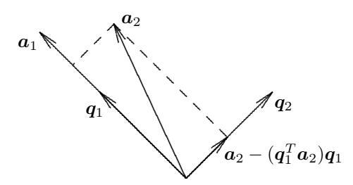
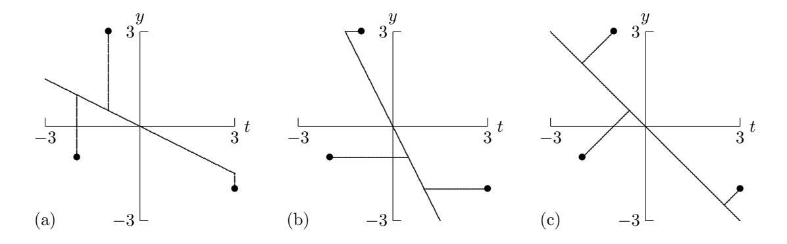

### 3.5.3 Gram–Schmidt-ortogonalizáció

A QR-felbontás kiszámításának egy másik módszere a Gram–Schmidt-ortogonalizáció. Adott két lineárisan független $m$-dimenziós vektor, $\boldsymbol{a}_1$ és $\boldsymbol{a}_2$; célunk két olyan ortonormált $m$-dimenziós $\boldsymbol{q}_1$ és $\boldsymbol{q}_2$ vektor meghatározása, amelyek ugyanazt az alteret feszítik ki, mint $\boldsymbol{a}_1$ és $\boldsymbol{a}_2$. Először $\boldsymbol{a}_1$-et normáljuk, és így megkapjuk $\boldsymbol{q}_1 = \boldsymbol{a}_1/\|\boldsymbol{a}_1\|_2$-t. Ezután $\boldsymbol{a}_2$-ből le szeretnénk vonni annak $\boldsymbol{q}_1$ irányú összetevőjét, amit úgy érhetünk el, hogy $\boldsymbol{a}_2$-t ortogonálisan levetítjük a span($\boldsymbol{q}_1$) altérre; lásd a 3.4. ábrát. Ez utóbbi ekvivalens az alábbi $m \times 1$ méretű legkisebb négyzetek feladattal:

$$\boldsymbol{q}_1 \gamma \cong \boldsymbol{a}_2,$$

amelynek megoldása a normálegyenleten keresztül

$$\gamma = \left(\boldsymbol{q}_1^T \boldsymbol{q}_1\right)^{-1} \left(\boldsymbol{q}_1^T \boldsymbol{a}_2\right) = \boldsymbol{q}_1^T \boldsymbol{a}_2.$$

A kívánt $\boldsymbol{q}_2$ vektort tehát úgy kapjuk meg, hogy normáljuk az $\boldsymbol{r} = \boldsymbol{a}_2 - (\boldsymbol{q}_1^T \boldsymbol{a}_2) \boldsymbol{q}_1$ maradékvektort ehhez az $m \times 1$ méretű legkisebb négyzetek feladathoz.



3.4. ábra: A Gram–Schmidt-ortogonalizáció egyetlen lépése.

Az imént leírt folyamat tetszőleges számú $\boldsymbol{a}_1, \ldots, \boldsymbol{a}_k$, $1 \leq k \leq m$ vektorra kiterjeszthető úgy, hogy minden egyes új vektort ortogonalizálunk az összes megelőző vektorhoz képest; ezt nevezzük a *klasszikus* Gram–Schmidt-ortogonalizációs eljárásnak, amelyet a 3.2. algoritmus mutat be. Ha az $\boldsymbol{a}_k$ vektorok az $m \times n$-es $\boldsymbol{A}$ mátrix oszlopai, akkor a keletkező $\boldsymbol{q}_k$ vektorok az $m \times n$-es $\boldsymbol{Q}_1$ mátrix oszlopai lesznek, az $r_{jk}$ értékek pedig

#### 3.2. Algoritmus. Klasszikus Gram–Schmidt-ortogonalizáció

```
for k = 1 to n
    qk = ak
    for j = 1 to k − 1
        rjk = qj^T * ak
        qk = qk − rjk * qj
    end
    rkk = ||qk||2
    if rkk = 0 then stop
    qk = qk / rkk
end
                                  { oszlopokon futó ciklus }
                                  { a jelenlegi oszlopból levonjuk
                                      az őt megelőző oszlopok
                                      irányú komponenseit }
                                  { megállás, ha lineárisan összefüggő }
                                  { a jelenlegi oszlop normálása }
```

az $\boldsymbol{A}$ redukált QR-felbontásában szereplő $n \times n$-es felső háromszögű $\boldsymbol{R}$ mátrix elemei (lásd a 3.4.5. szakaszt).

Sajnos a klasszikus Gram–Schmidt-eljárás véges pontosságú aritmetikával megvalósítva nem kielégítő, mert a kiszámított $\boldsymbol{q}_k$ vektorok ortogonalitása a kerekítési hibák miatt hajlamos elveszni. Ráadásul a klasszikus Gram–Schmidt-eljárás külön memóriát igényel az $\boldsymbol{A}$ és a $\boldsymbol{Q}_1$ (valamint az $\boldsymbol{R}$) számára, mert az eredeti $\boldsymbol{a}_k$-t a belső ciklusban is használjuk, ezért a belső ciklusban frissülő $\boldsymbol{q}_k$ nem írhatja felül. Mindkét hiányosság egyszerűen orvosolható, ha a belső ciklusban $\boldsymbol{a}_k$ helyett $\boldsymbol{q}_k$-t használjuk; ez egy olyan Gram–Schmidt-változatot ad, amely továbbra is oszloponként állítja elő az $\boldsymbol{R}$-t. A számítás alaposabb átrendezése azonban további előnnyel is jár.

Mégpedig, amint kiszámítottuk az új $\boldsymbol{q}_k$ vektort, rögtön ortogonalizáljuk hozzá az összes hátralévő vektort, így az $\boldsymbol{R}$-t nem oszloponként, hanem soronként állítjuk elő. Ez az átrendezés a módosított Gram–Schmidt-ortogonalizációs eljárást adja, amelyet a 3.3. algoritmus mutat be; ez matematikailag ekvivalens a klasszikus Gram–Schmidttel, de numerikusan jobb nála. A Gram–Schmidt mindkét változatában, ha valamelyik $k$ lépésnél $r_{kk}=0$, akkor az $\boldsymbol{A}$ $k$-adik oszlopa szükségképpen lineárisan függ az első $k-1$ oszloptól, ezért $\boldsymbol{A}$ nem teljes oszlopranggal rendelkezik. Az itt közölt formában egyik algoritmus sem folytatható ebben a helyzetben. Az oszloponkénti Gram–Schmidt-eljárásokkal ellentétben azonban a soronkénti módosított Gram–Schmidt-eljárás lehetővé teszi az oszloponkénti főelemkiválasztás használatát az $\boldsymbol{A}$ oszlopai közül egy maximális lineárisan független részhalmaz kiválasztására (lásd a 3.5.4. szakaszt). Alattomosabb probléma, ha $r_{kk}$ értéke nagyon kicsi, de nem nulla: ez a közeli ranghiányt jelzi, és szintén elegánsan kezelhető oszloponkénti főelemkiválasztással, a soronkénti módosított Gram–Schmidt-eljárással együtt.

A 3.3. algoritmusban a világosság kedvéért továbbra is külön írtuk $\boldsymbol{a}_k$-t és $\boldsymbol{q}_k$-t, de valójában most már közös memóriát használhatnak (egy programozó eleve így is fogalmazta volna meg az algoritmust). Sajnos a $\boldsymbol{Q}_1$ és az $\boldsymbol{R}$ továbbra is külön memóriát igényel, ami hátrány a Householder-módszerhez képest, ahol az $\boldsymbol{R}$ és a $\boldsymbol{Q}$ implicit reprezentációja osztozhat az $\boldsymbol{A}$ által korábban elfoglalt területen. Másrészt a Gram–Schmidt explicit reprezentációt ad a $\boldsymbol{Q}_1$-re,

#### 3.3. Algoritmus. Módosított Gram–Schmidt-ortogonalizáció

```
for k = 1 to n
    rkk = ||ak||2
    if rkk = 0 then stop
    qk = ak / rkk
    for j = k+1 to n
        rkj = qk^T * aj
        aj = aj − rkj * qk
    end
end
                                  { oszlopokon futó ciklus }
                                  { megállás, ha lineárisan összefüggő }
                                  { a jelenlegi oszlop normálása }
                                  { a rákövetkező oszlopokból
                                      levonjuk a jelenlegi oszlop
                                      irányú komponenseiket }
```

amit a Householder-módszer esetén — ha szükséges — többlet-memória árán kapnánk meg.

Még a módosított Gram–Schmidt-eljárás esetén is előfordulhat számjegykioltás, amikor egyik vektorból egy másik irányú komponenst vonunk le, és ez a $\boldsymbol{Q}_1$ oszlopainak ortogonalitásában jelentős veszteséghez vezethet, ha $\boldsymbol{A}$ rosszul kondicionált, bár a veszteség jóval enyhébb, mint a klasszikus Gram–Schmidtnél. Ezért, ha a módosított Gram–Schmidtet az $\boldsymbol{A}\boldsymbol{x} \cong \boldsymbol{b}$ lineáris legkisebb négyzetek feladat megoldására használjuk, nem tanácsos a kiszámított $\boldsymbol{Q}_1$-et explicit módon felhasználni a transzformált jobb oldal $\boldsymbol{c}_1 = \boldsymbol{Q}_1^T \boldsymbol{b}$ kiszámításához. Numerikusan jobb, ha a $\boldsymbol{b}$ jobb oldali vektort $(n+1)$-edik oszlopként kezeljük, és a módosított Gram–Schmidtet használjuk az így kapott $m \times (n+1)$-es kibővített mátrix redukált QR-felbontásának kiszámítására:

$$\left[ \begin{array}{cc} \boldsymbol{A} & \boldsymbol{b} \end{array} \right] = \left[ \begin{array}{cc} \boldsymbol{Q}_1 & \boldsymbol{q}_{n+1} \end{array} \right] \left[ \begin{array}{cc} \boldsymbol{R} & \boldsymbol{c}_1 \\ \boldsymbol{0}^T & \rho \end{array} \right],$$

ezután a legkisebb négyzetek feladat $\boldsymbol{x}$ megoldását az $\boldsymbol{R}\boldsymbol{x} = \boldsymbol{c}_1$ $n \times n$-es háromszögű lineáris egyenletrendszer megoldása adja.

A Gram–Schmidt-eljárás bármelyik változatával a kapott $\boldsymbol{Q}_1$ mátrix ortogonalitása jelentősen javítható reortogonalizációval: egyszerűen ismételjük meg az eljárást $\boldsymbol{Q}_1$-en. Ilyen reortogonalizáció ismételten is végezhető, iteratív finomítás gyanánt, de tipikusan már egyetlen reortogonalizáció is kielégítő eredményt ad.

**3.11. Példa. Gram–Schmidt QR-felbontás.** A módosított Gram–Schmidt-ortogonalizációt a 3.1. példa legkisebb négyzetek feladatának megoldásával szemléltetjük. Az $\boldsymbol{A}$ első oszlopát normálva kapjuk:

$$r_{1,1} = \|\boldsymbol{a}_1\|_2 = 1{,}7321, \qquad \boldsymbol{q}_1 = \boldsymbol{a}_1/r_{1,1} = \begin{bmatrix} 0{,}5774\\0\\0\\-0{,}5774\\-0{,}5774\\0 \end{bmatrix}.$$

Az első oszlopot ortogonalizálva a rákövetkező oszlopokhoz képest, a következőt kapjuk:

$$r_{1,2} = \boldsymbol{q}_1^T \boldsymbol{a}_2 = -0{,}5774, \qquad r_{1,3} = \boldsymbol{q}_1^T \boldsymbol{a}_3 = -0{,}5774.$$

Levonva $\boldsymbol{q}_1$ ezen többszöröseit a második, illetve a harmadik oszlopból, és $\boldsymbol{q}_1$-et az első oszlop helyére írva, a transzformált mátrix:

$$\begin{bmatrix} 0{,}5774 & 0{,}3333 & 0{,}3333 \\ 0 & 1 & 0 \\ 0 & 0 & 1 \\ -0{,}5774 & 0{,}6667 & -0{,}3333 \\ -0{,}5774 & -0{,}3333 & 0{,}6667 \\ 0 & -1 & 1 \end{bmatrix}.$$

A második oszlopot normálva kapjuk:

$$r_{2,2} = \|\boldsymbol{a}_2\|_2 = 1{,}6330, \qquad \boldsymbol{q}_2 = \boldsymbol{a}_2/r_{2,2} = \begin{bmatrix} 0{,}2041 \\ 0{,}6124 \\ 0 \\ 0{,}4082 \\ -0{,}2041 \\ -0{,}6124 \end{bmatrix}.$$

A második oszlopot a harmadik oszlophoz képest ortogonalizálva:

$$r_{2,3} = \boldsymbol{q}_2^T \boldsymbol{a}_3 = -0{,}8165.$$

$\boldsymbol{q}_2$ e többszörösét levonva a harmadik oszlopból, és $\boldsymbol{q}_2$-t a második oszlop helyére írva, a transzformált mátrix:

$$\begin{bmatrix} 0{,}5774 & 0{,}2041 & 0{,}5 \\ 0 & 0{,}6124 & 0{,}5 \\ 0 & 0 & 1 \\ -0{,}5774 & 0{,}4082 & 0 \\ -0{,}5774 & -0{,}2041 & 0{,}5 \\ 0 & -0{,}6124 & 0{,}5 \end{bmatrix}.$$

Végül normáljuk a harmadik oszlopot:

$$r_{3,3} = \|\boldsymbol{a}_3\|_2 = 1{,}4142, \qquad \boldsymbol{q}_3 = \boldsymbol{a}_3/r_{3,3} = \begin{bmatrix} 0{,}3536\\0{,}3536\\0{,}7071\\0\\0{,}3536\\0{,}3536 \end{bmatrix}.$$

A harmadik oszlopot $\boldsymbol{q}_3$-mal helyettesítve megkapjuk a redukált QR-felbontást:

$$\boldsymbol{A} = \begin{bmatrix} 0{,}5774 & 0{,}2041 & 0{,}3536 \\ 0 & 0{,}6124 & 0{,}3536 \\ 0 & 0 & 0{,}7071 \\ -0{,}5774 & 0{,}4082 & 0 \\ -0{,}5774 & -0{,}2041 & 0{,}3536 \\ 0 & -0{,}6124 & 0{,}3536 \end{bmatrix} \begin{bmatrix} 1{,}7321 & -0{,}5774 & -0{,}5774 \\ 0 & 1{,}6330 & -0{,}8165 \\ 0 & 0 & 1{,}4142 \end{bmatrix} = \boldsymbol{Q}_1 \boldsymbol{R}.$$

Mivel a feladat jól kondicionált, a transzformált jobb oldalt biztonsággal kiszámíthatjuk explicit módon:

$$\boldsymbol{Q}_1^T \boldsymbol{b} = \begin{bmatrix} -376 \\ 1200 \\ 3417 \end{bmatrix} = \boldsymbol{c}_1.$$

Az $\boldsymbol{R}\boldsymbol{x} = \boldsymbol{c}_1$ felső háromszögű rendszert visszahelyettesítéssel megoldva $\boldsymbol{x} = [1236, 1943, 2416]^T$ adódik.

### 3.5.4 Ranghiány

Eddig feltettük, hogy $\boldsymbol{A}$ teljes oszloprangú, azaz $\operatorname{rank}(\boldsymbol{A}) = n$. Ha ez nem teljesül, azaz ha $\boldsymbol{A}$-nak lineárisan összefüggő oszlopai vannak, akkor a QR-felbontás még mindig létezik, de a felső háromszögű $\boldsymbol{R}$ faktor szinguláris (akárcsak az $\boldsymbol{A}^T \boldsymbol{A}$ mátrix). Így sok $\boldsymbol{x}$ vektor adja ugyanazt a minimális maradéknormát, és a legkisebb négyzetek megoldás nem egyértelmű. Ez a helyzet rendszerint rosszul megtervezett kísérlet, hiányos adatok, vagy nem megfelelő, illetve redundáns modell következménye. Ezért a feladatot valószínűleg át kell fogalmazni vagy újra kell gondolni.

Ha mégis ragaszkodunk a továbblépéshez, bevett eljárás a minimális maradékot adó megoldások közül a legkisebb euklideszi normájú $\boldsymbol{x}$ kiválasztása. Ez kiszámítható oszloponkénti főelemkiválasztással végzett QR-felbontással, amit alább tárgyalunk, vagy szingulárisérték-felbontással (SVD), amit a 3.6. szakaszban fogunk tárgyalni. Megjegyezzük, hogy a ranghiány ilyen kezelése lehetővé teszi az alulhatározott — $m < n$ — feladatok kezelését is, mert ebben az esetben $\boldsymbol{A}$ oszlopai szükségképpen lineárisan összefüggők.

**3.12. Példa. Ranghiány.** Tegyük fel, hogy a 3.1. példában szereplő földmérő csak az egyes dombpárok egymáshoz viszonyított relatív magasságát mérte meg, de egyik domb magasságát sem mérte meg közvetlenül a referenciaponthoz képest, így a $3 \times 3$-as lineáris egyenletrendszerünk:

$$\boldsymbol{A}\boldsymbol{x} = \begin{bmatrix} -1 & 1 & 0 \\ -1 & 0 & 1 \\ 0 & -1 & 1 \end{bmatrix} \begin{bmatrix} x_1 \\ x_2 \\ x_3 \end{bmatrix} \cong \begin{bmatrix} 711 \\ 1177 \\ 475 \end{bmatrix} = \boldsymbol{b}.$$

Elég információ áll-e még rendelkezésre a három domb magasságának meghatározásához? E kérdés megválaszolásához kiszámítjuk a QR-felbontást:

$$\boldsymbol{A} = \begin{bmatrix} -0{,}7071 & 0{,}4082 & 0{,}5774 \\ -0{,}7071 & -0{,}4082 & -0{,}5774 \\ 0 & -0{,}8165 & 0{,}5774 \end{bmatrix} \begin{bmatrix} 1{,}4142 & -0{,}7071 & -0{,}7071 \\ 0 & 1{,}2247 & -1{,}2247 \\ 0 & 0 & 0 \end{bmatrix} = \boldsymbol{Q}\boldsymbol{R},$$

ami mutatja, hogy $\boldsymbol{R}$ szinguláris, és ezért $\boldsymbol{A}$ ranghiányos. Ebben az egyszerű példában ezt közvetlenül is láthattuk volna abból, hogy $\boldsymbol{A}$ minden sorösszege nulla (azaz $\boldsymbol{A}\boldsymbol{e} = \boldsymbol{0}$), a gyakorlatban azonban a ranghiány ritkán ennyire nyilvánvaló.

A gyakorlatban egy mátrix rangja gyakran nem egyértelmű. Így a legkisebb négyzetek feladatok közeli ranghiányának kimutatására relatív tolerancia szolgál, pontosan úgy, mint a négyzetes lineáris egyenletrendszerek közeli szingularitásának kimutatására. Ha egy legkisebb négyzetek feladat majdnem ranghiányos, akkor a megoldás érzékeny lesz a bemeneti adatok perturbációira. Ezeket a kérdéseket pontosabban meg tudjuk majd vizsgálni, amikor a 3.6. szakaszban bevezetjük egy mátrix szingulárisérték-felbontását. A QR-felbontás keretein belül a ranghiány kimutatására és kezelésére egy megbízható módszer az oszloponkénti főelemkiválasztás, amit alább tárgyalunk.

**3.13. Példa. Közeli ranghiány.** Tekintsük a következő $3 \times 2$-es mátrixot:

$$\boldsymbol{A} = \begin{bmatrix} 0{,}913 & 0{,}659 \\ 0{,}780 & 0{,}563 \\ 0{,}457 & 0{,}330 \end{bmatrix}.$$

Ha kiszámítjuk az $\boldsymbol{A}$ QR-felbontását, azt találjuk, hogy

$$\boldsymbol{R} = \begin{bmatrix} -1{,}28484 & -0{,}92744 \\ 0 & 0{,}00013 \end{bmatrix}.$$

Tehát $\boldsymbol{R}$ rendkívül közel áll ahhoz, hogy szinguláris legyen, és ha $\boldsymbol{R}$-et használjuk egy legkisebb négyzetek feladat megoldására, az eredmény ennek megfelelően érzékeny lesz a feladat adatainak perturbációira. Gyakorlati célokra az $\boldsymbol{A}$ rangja csak egy, nem pedig kettő, hiszen az oszlopai közel lineárisan összefüggők.

Az $\boldsymbol{A}$ mátrix oszlopait tekinthetjük vektorok rendezetlen halmazának, amelyből egy maximális lineárisan független részhalmazt szeretnénk kiválasztani. A QR-felbontás kiszámításakor ahelyett, hogy az oszlopokat a természetes sorrendjükben dolgoznánk fel, minden lépésben a hátralévő, még redukálatlan részmátrix maximális euklideszi normájú oszlopát választjuk ki redukálásra. Ezt az oszlopot (explicit módon vagy implicit módon) felcseréljük a természetes sorrendben következő oszloppal, majd az átló alatti részét a szokásos módon lenullázzuk. Az ehhez szükséges transzformációt ezután alkalmazni kell a hátralévő redukálatlan oszlopokra, majd az eljárást megismételjük. Az imént leírt folyamat neve az *oszloponkénti főelemkiválasztással végzett QR-felbontás*. Megjegyezzük, hogy az oszloponkénti főelemkiválasztás működésének feltétele, hogy a QR-felbontási folyamat minden lépésében a hátralévő oszlopoknak ne legyen komponensük a már feldolgozott oszlopok irányában. Ez igaz a Householder-, a Givens- és a soronkénti módosított Gram–Schmidt-algoritmusra, de nem igaz az oszloponkénti Gram–Schmidt-algoritmusokra (sem a klasszikusra, sem a módosítottra), ezért ez utóbbiak nem használhatók oszloponkénti főelemkiválasztással.

Ha $\operatorname{rank}(\boldsymbol{A}) = k < n$, akkor az oszloponkénti főelemkiválasztással végzett QR-felbontás $k$ lépése után a hátralévő redukálatlan oszlopok normái a $k$-adik sor alatt nullák (vagy véges pontosságú aritmetikában „elhanyagolhatóak”) lesznek. Így a következő alakú ortogonális felbontást állítottuk elő:

$$\boldsymbol{Q}^T \boldsymbol{A} \boldsymbol{P} = \begin{bmatrix} \boldsymbol{R} & \boldsymbol{S} \\ \boldsymbol{O} & \boldsymbol{O} \end{bmatrix},$$

ahol $\boldsymbol{R}$ $k \times k$-as felső háromszögű és nemszinguláris, $\boldsymbol{P}$ pedig az oszlopcseréket végrehajtó permutációs mátrix. Ezen a ponton az $\boldsymbol{A}\boldsymbol{x} \cong \boldsymbol{b}$ legkisebb négyzetek feladat egy bázismegoldása (azaz egy legfeljebb $k$ darab nem nulla komponenssel rendelkező megoldás) kiszámítható úgy, hogy megoldjuk az $\boldsymbol{R}\boldsymbol{z} = \boldsymbol{c}_1$ háromszögű rendszert, ahol $\boldsymbol{c}_1$ a $\boldsymbol{Q}^T \boldsymbol{b}$ vektor első $k$ komponenséből álló vektor, majd vesszük

$$\boldsymbol{x} = \boldsymbol{P} \begin{bmatrix} \boldsymbol{z} \\ \boldsymbol{0} \end{bmatrix}.$$

Az adatillesztés szempontjából ez az eljárás azt jelenti, hogy figyelmen kívül hagyjuk a modell azon komponenseit, amelyek redundánsak vagy rosszul meghatározottak. Ha azonban a *minimális normájú megoldásra* van szükségünk, ez is kiszámítható, további ortogonális transzformációk költségén, amelyeket jobbról alkalmazunk, hogy $\boldsymbol{S}$-et is nullázzuk.

**3.14. Példa. Bázis- és minimális normájú megoldás.** A 3.12. példát folytatva egy bázismegoldás az egyik dombhoz nulla magasságot rendel (hogy melyik dombot választjuk, az a QR-felbontásban szereplő $\boldsymbol{P}$ oszlop-permutációtól függ), ami ezután lehetővé teszi a másik két domb magasságának meghatározását ehhez képest egy kisebb rendszer megoldásával. Ebben a példában a harmadik dombnak nulla magasságot rendelve a $\boldsymbol{x}^T = [-1180, -472, 0]$ bázismegoldást kapjuk (a negatív magasságok egyszerűen azt jelentik, hogy az első két domb a nulla magasságúnak választott domb alatt van). Megjegyezzük, hogy ez a megoldás nem elégíti ki egzaktul a lineáris rendszert (tükrözve azt, hogy a rendszer inkonzisztens, ami négyzetes rendszernél csak ranghiány esetén lehetséges), de ez egy (nem egyértelmű) legkisebb négyzetek megoldás. Ennek a ranghiányos feladatnak a minimális normájú megoldása $\boldsymbol{x}^T = [-629, 79, 551]$ (lásd a 3.16. példát).

A gyakorlatban $\boldsymbol{A}$ rangja általában ismeretlen, ezért az oszloponkénti főelemkiválasztási folyamatot a rang felderítésére használjuk: a hátralévő redukálatlan oszlopok normáit figyeljük, és a felbontást akkor állítjuk le, amikor a maximális érték egy relatív tolerancia alá esik. QR-felbontáson alapuló, kifinomultabb rangfelderítő technikák is léteznek, valamint a szingulárisérték-felbontás, amely a rang numerikus meghatározásának legmegbízhatóbb (de legköltségesebb) módja (lásd a 3.6.1. szakaszt).

## 3.6 Szingulárisérték-felbontás

Akárcsak a négyzetes lineáris egyenletrendszereknél, egy diagonális lineáris legkisebb négyzetek feladat még könnyebben megoldható, mint egy háromszögű. Idézzük fel a háromszögű LU-felbontás és a négyzetes mátrix Gauss–Jordan-kiküszöböléssel kapott diagonális felbontása közötti összefüggést (lásd a 2.4.8. szakaszt). Bizonyos mértékig hasonló módon a háromszögű QR-felbontáson túl is el lehet jutni: téglalap alakú mátrix diagonális felbontását is meg lehet kapni ortogonális transzformációkkal.

Egy $m \times n$-es $\boldsymbol{A}$ mátrix szingulárisérték-felbontása (SVD) a következő alakú:

$$\boldsymbol{A} = \boldsymbol{U}\boldsymbol{\Sigma}\boldsymbol{V}^T,$$

ahol az $\boldsymbol{U}$ egy $m \times m$-es ortogonális mátrix, a $\boldsymbol{V}$ egy $n \times n$-es ortogonális mátrix, a $\boldsymbol{\Sigma}$ pedig egy $m \times n$-es diagonális mátrix, amelyre

$$\sigma_{ij} = \begin{cases} 0 & \text{ha } i \neq j, \\ \sigma_i \ge 0 & \text{ha } i = j. \end{cases}$$

A $\sigma_i$ diagonális elemeket az $\boldsymbol{A}$ mátrix szinguláris értékeinek nevezzük, és rendszerint úgy rendezzük őket, hogy $\sigma_{i-1} \ge \sigma_i$, $i = 2, \ldots, \min\{m, n\}$. Az $\boldsymbol{U}$ $\boldsymbol{u}_i$ oszlopai, illetve a $\boldsymbol{V}$ $\boldsymbol{v}_i$ oszlopai az ezeknek megfelelő bal és jobb oldali szinguláris vektorok. Mivel az SVD kiszámítása szorosan kapcsolódik a sajátértékek kiszámításának algoritmusaihoz, az SVD kiszámításának tárgyalását a 4.7. szakaszra halasztjuk; az SVD alkalmazásait viszont itt tárgyaljuk, mivel a legkisebb négyzetek és kapcsolódó feladatok megoldásában fontos szerepet játszik.

**3.15. Példa. Szingulárisérték-felbontás.** Az

$$\boldsymbol{A} = \begin{bmatrix} 1 & 2 & 3 \\ 4 & 5 & 6 \\ 7 & 8 & 9 \\ 10 & 11 & 12 \end{bmatrix}$$

mátrix szingulárisérték-felbontása $\boldsymbol{U}\boldsymbol{\Sigma}\boldsymbol{V}^T =$

$$\begin{bmatrix} 0{,}141 & 0{,}825 & -0{,}420 & -0{,}351 \\ 0{,}344 & 0{,}426 & 0{,}298 & 0{,}782 \\ 0{,}547 & 0{,}028 & 0{,}664 & -0{,}509 \\ 0{,}750 & -0{,}371 & -0{,}542 & 0{,}079 \end{bmatrix} \begin{bmatrix} 25{,}5 & 0 & 0 \\ 0 & 1{,}29 & 0 \\ 0 & 0 & 0 \\ 0 & 0 & 0 \end{bmatrix} \begin{bmatrix} 0{,}504 & 0{,}574 & 0{,}644 \\ -0{,}761 & -0{,}057 & 0{,}646 \\ 0{,}408 & -0{,}816 & 0{,}408 \end{bmatrix}.$$

Tehát $\sigma_1 = 25{,}5$, $\sigma_2 = 1{,}29$ és $\sigma_3 = 0$. Egy nullával egyenlő szinguláris érték azt jelzi, hogy a mátrix ranghiányos; általánosabban egy mátrix rangja egyenlő a nem nulla szinguláris értékek számával, ami ebben a példában kettő.

Az SVD különösen rugalmas módszert nyújt tetszőleges alakú és rangú lineáris legkisebb négyzetek feladatok megoldására. Tekintsük először a túlhatározott, teljes rangú esetet. Ha $\boldsymbol{A}$ egy $m \times n$-es mátrix $\operatorname{rank}(\boldsymbol{A}) = n$ esetén, akkor

$$\boldsymbol{A} = \boldsymbol{U} \boldsymbol{\Sigma} \boldsymbol{V}^T = \begin{bmatrix} \boldsymbol{U}_1 & \boldsymbol{U}_2 \end{bmatrix} \begin{bmatrix} \boldsymbol{\Sigma}_1 \\ \boldsymbol{O} \end{bmatrix} \boldsymbol{V}^T = \boldsymbol{U}_1 \boldsymbol{\Sigma}_1 \boldsymbol{V}^T,$$

ahol az $\boldsymbol{U}_1$ egy $m \times n$-es, a $\boldsymbol{\Sigma}_1$ pedig egy $n \times n$-es, nemszinguláris mátrix; ez az $\boldsymbol{A}$ redukált, „takarékos méretű” SVD-je. Az $\boldsymbol{A}\boldsymbol{x} \cong \boldsymbol{b}$ legkisebb négyzetek feladat megoldását ekkor a

$$\boldsymbol{x} = \boldsymbol{V} \boldsymbol{\Sigma}_1^{-1} \boldsymbol{U}_1^T \boldsymbol{b}$$

összefüggés adja, amint az $\boldsymbol{A}$ redukált SVD-jét a normálegyenletbe behelyettesítve könnyen ellenőrizhető. Általánosabban, tetszőleges alakú és rangú $\boldsymbol{A}$ esetén az $\boldsymbol{A}\boldsymbol{x} \cong \boldsymbol{b}$ legkisebb négyzetek feladat minimális euklideszi normájú megoldását a

$$\boldsymbol{x} = \sum_{\sigma_i \neq 0} \frac{\boldsymbol{u}_i^T \boldsymbol{b}}{\sigma_i} \, \boldsymbol{v}_i$$

összefüggés adja. Az SVD különösen hasznos rosszul kondicionált vagy közel ranghiányos feladatoknál, mert az összegzésből tetszőleges, relatív értelemben kicsi szinguláris értékek elhagyhatók, és így a megoldás jóval kevésbé érzékeny az adatok perturbációira.

**3.16. Példa. Minimális normájú megoldás.** A 3.12. példában szereplő $\boldsymbol{A}$ mátrix SVD-je $\boldsymbol{A} = \boldsymbol{U}\boldsymbol{\Sigma}\boldsymbol{V}^T =$

$$\begin{bmatrix} -0{,}707 & 0{,}408 & 0{,}577 \\ -0{,}707 & -0{,}408 & -0{,}577 \\ 0 & -0{,}816 & 0{,}577 \end{bmatrix} \begin{bmatrix} 1{,}732 & 0 & 0 \\ 0 & 1{,}732 & 0 \\ 0 & 0 & 0 \end{bmatrix} \begin{bmatrix} 0{,}816 & -0{,}408 & -0{,}408 \\ 0 & 0{,}707 & -0{,}707 \\ -0{,}577 & -0{,}577 & -0{,}577 \end{bmatrix},$$

így a minimális euklideszi normájú legkisebb négyzetek megoldás:

$$\boldsymbol{x} = \frac{\boldsymbol{u}_1^T \boldsymbol{b}}{\sigma_1} \, \boldsymbol{v}_1 + \frac{\boldsymbol{u}_2^T \boldsymbol{b}}{\sigma_2} \, \boldsymbol{v}_2 = \frac{-1335}{1{,}732} \begin{bmatrix} 0{,}816 \\ -0{,}408 \\ -0{,}408 \end{bmatrix} + \frac{-578}{1{,}732} \begin{bmatrix} 0 \\ 0{,}707 \\ -0{,}707 \end{bmatrix} = \begin{bmatrix} -629 \\ 79 \\ 551 \end{bmatrix}.$$

### 3.6.1 Az SVD további alkalmazásai

Az $\boldsymbol{A} = \boldsymbol{U}\boldsymbol{\Sigma}\boldsymbol{V}^T$ szingulárisérték-felbontásnak számos más fontos alkalmazása is van, köztük az alábbiak:

*Euklideszi mátrixnorma.* Az euklideszi vektornorma által indukált mátrixnormát a mátrix legnagyobb szinguláris értéke adja:

$$\|\boldsymbol{A}\|_2 = \max_{\boldsymbol{x} \neq \boldsymbol{0}} \frac{\|\boldsymbol{A}\boldsymbol{x}\|_2}{\|\boldsymbol{x}\|_2} = \sigma_{\max}.$$

Még nem áll módunkban belátni, miért igaz ez, mert sajátértékek (4. fejezet) és optimalizálás (6. fejezet) ismeretét igényli.

*Euklideszi kondíciószám.* Egy tetszőleges $\boldsymbol{A}$ mátrix euklideszi normában vett kondíciószámát a

$$\operatorname{cond}_2(\boldsymbol{A}) = \sigma_{\max}/\sigma_{\min}$$

hányados adja. Ez a definíció egybeesik a $\operatorname{cond}(\boldsymbol{A})$ 2.3.3. szakaszban adott, négyzetes mátrixra vonatkozó — euklideszi normát használó — definíciójával, valamint a 3.3. szakaszban megadott, teljes oszloprangú túlhatározott mátrix kondíciószámával is. Ez mindkettőt általánosítja tetszőleges alakú és rangú téglalap alakú mátrixra. Figyeljük meg, hogy ezzel a definícióval, akárcsak korábban, $\operatorname{cond}_2(\boldsymbol{A}) = \infty$ ha $\operatorname{rank}(\boldsymbol{A}) < \min(m,n)$, mert ebben az esetben $\sigma_{\min} = 0$. Ahogyan egy négyzetes mátrix kondíciószáma a szingularitáshoz való közelséget méri, úgy egy téglalap alakú mátrix kondíciószáma a ranghiányhoz való közelséget méri.

**3.17. Példa. Euklideszi mátrixnorma és kondíciószám.** A 2.4. és 2.5. példában szereplő $\boldsymbol{A}$ mátrix SVD-je $\boldsymbol{A} = \boldsymbol{U}\boldsymbol{\Sigma}\boldsymbol{V}^T =$

$$\begin{bmatrix} 0{,}392 & -0{,}920 & -0{,}021 \\ 0{,}240 & 0{,}081 & 0{,}967 \\ 0{,}888 & 0{,}384 & -0{,}253 \end{bmatrix} \begin{bmatrix} 5{,}723 & 0 & 0 \\ 0 & 1{,}068 & 0 \\ 0 & 0 & 0{,}327 \end{bmatrix} \begin{bmatrix} 0{,}645 & -0{,}224 & 0{,}731 \\ -0{,}567 & 0{,}501 & 0{,}653 \\ 0{,}513 & 0{,}836 & -0{,}196 \end{bmatrix},$$

így

$$\|\boldsymbol{A}\|_2 = 5{,}723, \quad \operatorname{cond}_2(\boldsymbol{A}) = 5{,}723/0{,}327 = 17{,}5.$$

*Rang meghatározása.* Egy mátrix rangja egyenlő a nem nulla szinguláris értékeinek számával (lásd a 3.15. és 3.16. példát). A gyakorlatban azonban a rang nem feltétlenül egyértelmű, mert egyes szinguláris értékek nagyon kicsik lehetnek, de nem nullák. Sok célra célszerűbb elhanyagolhatónak tekinteni azokat a szinguláris értékeket, amelyek (a legnagyobb szinguláris értékhez viszonyítva) egy bizonyos küszöb alá esnek, és így határozni meg a mátrix „numerikus rangját”. Ennek egyik értelmezése, hogy az adott mátrix nagyon közel van (azaz az adott küszöbön belül) ahhoz a mátrixhoz, amelynek rangját így határoztuk meg. Az SVD használata a numerikus rang meghatározására megbízhatóbb (bár drágább), mint az oszloponkénti főelemkiválasztással végzett QR-felbontás használata (lásd a 3.5.4. szakaszt).

**3.18. Példa. Rang meghatározása.** A 3.13. példában szereplő $\boldsymbol{A}$ mátrix SVD-je $\boldsymbol{A} = \boldsymbol{U}\boldsymbol{\Sigma}\boldsymbol{V}^T =$

$$\begin{bmatrix} 0{,}71058 & -0{,}26631 & -0{,}65127 \\ 0{,}60707 & -0{,}23592 & 0{,}75882 \\ 0{,}35573 & 0{,}93457 & 0{,}00597 \end{bmatrix} \begin{bmatrix} 1{,}58460 & 0 \\ 0 & 0{,}00011 \\ 0 & 0 \end{bmatrix} \begin{bmatrix} 0{,}81083 & 0{,}58528 \\ -0{,}58528 & 0{,}81083 \end{bmatrix}.$$

Tehát körülbelül $10^{-4}$ vagy nagyobb küszöb mellett a rangot egynek nyilvánítanánk, nem pedig kettőnek.

*Pszeudoinverz.* Egy $\sigma$ skalár pszeudoinverzét $1/\sigma$-ként definiáljuk, ha $\sigma \neq 0$, egyébként nullaként. Egy (esetleg téglalap alakú) diagonális mátrix pszeudoinverzét a mátrix transzponálásával, majd minden elem skaláris pszeudoinverzének vételével definiáljuk. Ekkor egy általános $m \times n$-es $\boldsymbol{A}$ mátrix pszeudoinverzét a

$$\boldsymbol{A}^+ = \boldsymbol{V} \boldsymbol{\Sigma}^+ \boldsymbol{U}^T$$

összefüggés adja. Figyeljük meg, hogy a pszeudoinverz mindig létezik, függetlenül attól, hogy a mátrix négyzetes-e, vagy teljes rangú-e. Ha $\boldsymbol{A}$ négyzetes és nemszinguláris, akkor a pszeudoinverz megegyezik a szokásos $\boldsymbol{A}^{-1}$ mátrixinverzzel. Ha $\boldsymbol{A}$ teljes oszloprangú, akkor ez a definíció egybeesik a 3.3. szakaszban adottal (lásd a 3.33. feladatot). Minden esetben az $\boldsymbol{A}\boldsymbol{x} \cong \boldsymbol{b}$ legkisebb négyzetek feladat minimális euklideszi normájú megoldását $\boldsymbol{A}^+\boldsymbol{b}$ adja.

**3.19. Példa. Pszeudoinverz.** A 3.16. példában látott SVD-ből azt látjuk, hogy a 3.12. példában szereplő $\boldsymbol{A}$ mátrix pszeudoinverze:

$$\boldsymbol{A}^{+} = \frac{1}{3} \begin{bmatrix} -1 & -1 & 0\\ 1 & 0 & -1\\ 0 & 1 & 1 \end{bmatrix},$$

így az $\boldsymbol{A}\boldsymbol{x} \cong \boldsymbol{b}$ legkisebb négyzetek feladat minimális euklideszi normájú megoldása:

$$\boldsymbol{x} = \boldsymbol{A}^{+}\boldsymbol{b} = \frac{1}{3} \begin{bmatrix} -1 & -1 & 0 \\ 1 & 0 & -1 \\ 0 & 1 & 1 \end{bmatrix} \begin{bmatrix} 711 \\ 1177 \\ 475 \end{bmatrix} = \begin{bmatrix} -629 \\ 79 \\ 551 \end{bmatrix}.$$

*Ortonormált bázisok.* Ha $\boldsymbol{A} = \boldsymbol{U}\boldsymbol{\Sigma}\boldsymbol{V}^T$, akkor az $\boldsymbol{U}$ nem nulla szinguláris értékekhez tartozó oszlopai ortonormált bázist alkotnak a span($\boldsymbol{A}$) altérben, az $\boldsymbol{U}$ többi oszlopa pedig annak ortogonális kiegészítőjében, azaz a span($\boldsymbol{A}$)$^{\perp}$ altérben. Hasonlóképpen, a $\boldsymbol{V}$ nulla szinguláris értékekhez tartozó oszlopai ortonormált bázist alkotnak az $\boldsymbol{A}$ nullterében, azaz az $\{\boldsymbol{x} \in \mathbb{R}^n : \boldsymbol{A}\boldsymbol{x} = \boldsymbol{0}\}$ altérben, a $\boldsymbol{V}$ többi oszlopa pedig a nulltér ortogonális kiegészítőjében.

*Alacsonyabb rangú közelítés.* Az SVD egy másik írásmódja:

$$\boldsymbol{A} = \boldsymbol{U}\boldsymbol{\Sigma}\boldsymbol{V}^T = \sigma_1\boldsymbol{E}_1 + \sigma_2\boldsymbol{E}_2 + \dots + \sigma_n\boldsymbol{E}_n,$$

ahol $\boldsymbol{E}_i = \boldsymbol{u}_i\boldsymbol{v}_i^T$. Minden $\boldsymbol{E}_i$ egyrangú, és tárolása csupán $m+n$ memóriahelyet igényel. Ráadásul a $\boldsymbol{E}_i\boldsymbol{x}$ szorzat csupán $m+n$ szorzással képezhető. Így az $\boldsymbol{A}$ egy hasznos, tömörített közelítését kaphatjuk meg, ha a fenti összegzésből elhagyjuk a kisebb szinguláris értékekhez tartozó tagokat, hiszen azok az összeghez viszonylag keveset tesznek hozzá. Megmutatható, hogy a $k$ legnagyobb szinguláris értékkel kapott közelítés a Frobenius-normában az $\boldsymbol{A}$-hoz legközelebbi $k$ rangú mátrix. (Egy $m \times n$-es mátrix Frobenius-normája a mátrix $\mathbb{R}^{mn}$-beli vektornak tekintett euklideszi normája.) Ez a közelítés hasznos a képfeldolgozásban, az adattömörítésben, az információ-visszakeresésben, a kriptográfiában és számos más alkalmazásban.

**3.20. Példa. Alacsonyabb rangú közelítés.** A 3.13. példában megadott $\boldsymbol{A}$ mátrix 3.18. példában látott SVD-jéből azt látjuk, hogy az

$$\sigma_1 \boldsymbol{E}_1 = \sigma_1 \boldsymbol{u}_1 \boldsymbol{v}_1^T = 1{,}58460 \begin{bmatrix} 0{,}71058 \\ 0{,}60707 \\ 0{,}35573 \end{bmatrix} \begin{bmatrix} 0{,}81083 & 0{,}58528 \end{bmatrix} = \begin{bmatrix} 0{,}91298 & 0{,}65902 \\ 0{,}77999 & 0{,}56302 \\ 0{,}45706 & 0{,}32992 \end{bmatrix}$$

egyrangú mátrix rendkívül közeli közelítése az eredeti $\boldsymbol{A}$ mátrixnak, mert $\sigma_2$ olyan kicsi, hogy a hozzá tartozó tag szinte semmit sem tesz hozzá az összeghez.

*Teljes legkisebb négyzetek.* Egy közönséges $\boldsymbol{A}\boldsymbol{x} \cong \boldsymbol{b}$ lineáris legkisebb négyzetek feladatban implicit módon feltesszük, hogy az $\boldsymbol{A}$ elemei pontosan ismertek, míg a $\boldsymbol{b}$ elemei véletlen hibával terheltek, és ez indokolja az adatpontok és a görbe közötti függőleges távolságok minimalizálását. Amikor azonban az összes változó mérési hibával vagy egyéb bizonytalansággal terhelt, értelmesebb lehet az adatpontok és a görbe közötti ortogonális távolságok minimalizálása; ez a *teljes legkisebb négyzetek* feladatmegoldást adja. Idézzük fel, hogy a közönséges legkisebb négyzetek esetén az $\|\boldsymbol{b} - \boldsymbol{y}\|_2$-t szeretnénk minimalizálni az $\boldsymbol{y} \in \operatorname{span}(\boldsymbol{A})$ feltétel mellett, azaz a legközelebbi kompatibilis rendszert keressük, és csak a jobb oldalt engedjük változni. A teljes legkisebb négyzetek esetén is a legközelebbi kompatibilis rendszert keressük, de most a mátrix és a jobb oldal is változhat. Ahogy az előző bekezdésben láttuk, az ilyen mátrixközelítési feladat a szingulárisérték-felbontással megoldható. Nevezetesen, tekintsük az $m \times (n+1)$-es $[\boldsymbol{A} \ \boldsymbol{b}] = \boldsymbol{U}\boldsymbol{\Sigma}\boldsymbol{V}^T$ SVD-jét. Ahhoz, hogy a közelítő $[\hat{\boldsymbol{A}} \ \boldsymbol{y}]$ rendszer kompatibilis legyen, azaz $\boldsymbol{y} \in \operatorname{span}(\hat{\boldsymbol{A}})$ teljesüljön, a rangjának legfeljebb $n$-nek kell lennie. Ahogy láttuk, a legközelebbi $n$ rangú közelítő mátrixot úgy kapjuk meg, hogy az első $n$ szinguláris értéket tartjuk meg, és $\sigma_{n+1}$-et elhagyjuk. A keletkező kompatibilis rendszer $\boldsymbol{x}$ megoldásának ki kell elégítenie a

$$[\hat{\boldsymbol{A}} \ \boldsymbol{y}] \begin{bmatrix} \boldsymbol{x} \\ -1 \end{bmatrix} = \boldsymbol{0}$$

egyenletet, amiből látszik, hogy $[\boldsymbol{x}^T \ -1]^T$-nek a $[\hat{\boldsymbol{A}} \ \boldsymbol{y}]$ nullterében kell lennie, ami viszont azt jelenti, hogy $[\boldsymbol{x}^T \ -1]^T$ arányos $\boldsymbol{v}_{n+1}$-gyel, azaz a $\sigma_{n+1}$-nek megfelelő jobb oldali szinguláris vektorral. Így a megoldás megszerzéséhez csupán annyit kell tennünk, hogy $\boldsymbol{v}_{n+1}$-et úgy skálázzuk, hogy az utolsó komponense $-1$ legyen. Arra a következtetésre jutunk tehát, hogy amennyiben $\sigma_{n+1} < \sigma_n$ és $v_{n+1,n+1} \neq 0$, a teljes legkisebb négyzetek megoldását az

$$\boldsymbol{x} = -\frac{1}{v_{n+1,n+1}} \begin{bmatrix} v_{1,n+1} \\ \vdots \\ v_{n,n+1} \end{bmatrix}$$

összefüggés adja. Általánosabb feladatok — például több jobb oldallal, vagy ha a változók egy része pontosan ismert — hasonló módon kezelhetők, de lényegesen bonyolultabbak (a részletekhez lásd [478]-at).

**3.21. Példa. Teljes legkisebb négyzetek.** Tekintsük az

$$f(t,x) = x t$$

modellfüggvény (azaz egy origón átmenő, meghatározandó $x$ meredekségű egyenes) illesztését a következő adatpontokhoz:

$$\begin{array}{c|ccc} t & -2 & -1 & 3 \\ y & -1 & 3 & -2 \end{array}$$

Az $y$ értékeknek $t$ függvényeként való illesztése akkor célszerű, ha az $y$ adatok hibával terheltek, a $t$-re vonatkozó adatok viszont pontosak. Az így kapott közönséges legkisebb négyzetek illesztés, amely a 3.5(a). ábrán látható, az egyenes és az adatpontok közötti függőleges távolságok négyzetösszegét minimalizálja, ami $x = -0{,}5$ meredekséget ad. Ha azonban a $t$-re vonatkozó adatok éppúgy hibával terheltek, akár meg is fordíthattuk volna a szerepeket, és $t$-t illeszthettük volna $y$ függvényében. Az így kapott közönséges legkisebb négyzetek illesztés, amely a 3.5(b). ábrán látható, az egyenes és az adatpontok közötti vízszintes távolságok négyzetösszegét minimalizálja, ami $x = -2$ meredekséget ad. Ilyen helyzetben mindkettőnél jobb stratégia a teljes legkisebb négyzetek, amely minden adatot egyenrangúan kezel. Az így kapott illesztés, amely a 3.5(c). ábrán látható, az egyenes és az adatpontok közötti legrövidebb (azaz merőleges) távolságok négyzetösszegét minimalizálja, ami $x = -1$ meredekséget ad. Ahhoz, hogy ezt az utóbbi illesztést hogyan kaptuk, észrevesszük, hogy ennek a feladatnak az $\boldsymbol{A}$ mátrixa csak egyetlen oszlopot tartalmaz, ezért kiszámítjuk az

$$[\boldsymbol{A} \ \boldsymbol{b}] = [\boldsymbol{t} \ \boldsymbol{y}] = \begin{bmatrix} -2 & -1 \\ -1 & 3 \\ 3 & -2 \end{bmatrix} =$$

$$\begin{bmatrix} -0{,}154 & 0{,}802 & 0{,}577 \\ -0{,}617 & -0{,}535 & 0{,}577 \\ 0{,}772 & -0{,}267 & 0{,}577 \end{bmatrix} \begin{bmatrix} 4{,}583 & 0 \\ 0 & 2{,}646 \\ 0 & 0 \end{bmatrix} \begin{bmatrix} 0{,}707 & -0{,}707 \\ -0{,}707 & -0{,}707 \end{bmatrix} = \boldsymbol{U}\boldsymbol{\Sigma}\boldsymbol{V}^T$$

SVD-t, így

$$\boldsymbol{x} = -(1/v_{2,2})\,v_{1,2} = -(1/(-0{,}707))\,(-0{,}707) = -1.$$



3.5. ábra: Egyenes közönséges és teljes legkisebb négyzetes illesztése adott adatokra.

## 3.7 Módszerek összehasonlítása

Eddig több módszert is láttunk legkisebb négyzetek feladatok megoldására. Hogy közülük melyiket választjuk, az a konkrét megoldandó feladattól függ, és a hatékonyság, a pontosság és a megbízhatóság közötti átváltásokkal jár.

A normálegyenletek módszere könnyen megvalósítható: csupán mátrixszorzást és Cholesky-felbontást igényel. Ráadásul rendkívül vonzó, hogy $m \gg n$ esetén a feladatot egy $n \times n$-es rendszerre redukálja. Ha kihasználjuk a szimmetriáját, az $\boldsymbol{A}^T \boldsymbol{A}$ keresztszorzat-mátrix előállítása körülbelül $mn^2/2$ szorzást és hasonló számú összeadást igényel. A keletkező lineáris egyenletrendszer megoldása Cholesky-felbontással körülbelül $n^3/6$ szorzást és hasonló számú összeadást igényel. Sajnos a normálegyenletek módszere olyan megoldást ad, amelynek relatív hibája $[\operatorname{cond}(\boldsymbol{A})]^2$-tel arányos, a szükséges Cholesky-felbontás pedig $\operatorname{cond}(\boldsymbol{A}) \approx 1/\sqrt{\epsilon_{\text{mach}}}$ vagy rosszabb esetén várhatóan meghiúsul.

Sűrű lineáris legkisebb négyzetek feladatok megoldására a Householder-módszer általában a leghatékonyabb és legpontosabb az ortogonalizációs módszerek közül. Körülbelül $mn^2 - n^3/3$ szorzást és hasonló számú összeadást igényel. Megmutatható, hogy a Householder-módszer olyan megoldást ad, amelynek relatív hibája $\operatorname{cond}(\boldsymbol{A}) + \|\boldsymbol{r}\|_2[\operatorname{cond}(\boldsymbol{A})]^2$-tel arányos, ami a lehető legjobb, mivel ez a legkisebb négyzetek feladat megoldásának belső érzékenysége (idézzük fel a 3.3. szakaszt). Ráadásul a Householder-módszer (a visszahelyettesítési fázisban) csak akkor várhatóan hiúsul meg, ha $\operatorname{cond}(\boldsymbol{A}) \approx 1/\epsilon_{\text{mach}}$ vagy rosszabb.

Majdnem négyzetes feladatokra, $m \approx n$ esetén a normálegyenletek módszere és a Householder-módszer körülbelül ugyanannyi munkát igényel. Erősen túlhatározott feladatokra azonban, $m \gg n$, a Householder-módszer körülbelül kétszer annyi munkát igényel, mint a normálegyenletek módszere. Másrészt a Householder-módszer pontosabb és szélesebb körben alkalmazható, mint a normálegyenletek módszere. Ezek az előnyök azonban nem feltétlenül érik meg a többletköltséget, ha a feladat elég jól kondicionált ahhoz, hogy a normálegyenletek módszere kellően pontos eredményt szolgáltasson. Ranghiányos vagy közel ranghiányos feladatokra természetesen az oszloponkénti főelemkiválasztással végzett Householder-módszer használható eredményt adhat ott is, ahol a normálegyenletek módszere egyenesen meghiúsulna.

Végül az SVD a legköltségesebb módszer: költsége $mn^2 + n^3$-tel arányos, az arányossági állandó pedig $4$-től $10$-ig vagy annál is tovább terjedhet, az alkalmazott konkrét algoritmustól függően (lásd a 4.7. szakaszt). Így az SVD kiemelkedő robusztusságának és megbízhatóságának magas az ára, amit mindazonáltal különösen kritikus vagy kényes helyzetekben érdemes lehet megfizetni.

# 3.8 Szoftverek lineáris legkisebb négyzetek feladatokhoz

A 3.1. táblázat a lineáris legkisebb négyzetek feladatok megoldására alkalmas rutinok listáját tartalmazza, mind teljes rangú, mind ranghiányos esetre. A felsorolt rutinok többsége QR-felbontáson alapul. Sok csomag SVD-hez is tartalmaz szoftvert, amely — nagyobb számítási költséggel — szintén használható legkisebb négyzetek feladatok megoldására. Az SVD különösen megbízható módszert ad a numerikus rang meghatározására és a lehetséges ranghiány kezelésére (lásd a 3.6. szakaszt). Mivel az SVD kiszámításának módszerei szorosan kapcsolódnak a sajátérték-számítás módszereihez (lásd a 4.7. szakaszt), az SVD kiszámítására szolgáló szoftvereket a sajátértékekre és sajátvektorokra vonatkozó szoftverekkel együtt a 4.2. táblázat sorolja fel. A teljes legkisebb négyzetek feladatok megoldására — ahol az összes változó véletlen hibával terhelt — a `dtls` rutin elérhető a Netlibről.

Az $\boldsymbol{A}\boldsymbol{x} \cong \boldsymbol{b}$ lineáris legkisebb négyzetek feladatok megoldására szolgáló hagyományos szoftver olykor egyetlen rutinként van megvalósítva, de felosztható két rutinra is: az egyik a felbontás kiszámítására, a másik a keletkező háromszögű rendszer megoldására szolgál. A tipikusan megkövetelt bemenet a következőket tartalmazza: egy kétdimenziós tömb az $\boldsymbol{A}$ mátrixszal, egy egydimenziós tömb a $\boldsymbol{b}$ jobb oldali vektorral (vagy egy kétdimenziós tömb több jobb oldali vektorra), a mátrix $m$ sorainak és $n$ oszlopainak száma, az $\boldsymbol{A}$-t tartalmazó tömb vezető dimenziója (hogy a szubrutin helyesen tudja értelmezni a tömbindexeket), valamint esetenként némi munkaterület és egy zászló az elvégzendő konkrét feladat jelzésére.

| Forrás             | Felbontás          | Megoldás                       | Ranghiányos          |
| ------------------ | ------------------ | ------------------------------ | -------------------- |
| FMM [152]          | `svd`              |                                | `svd`                |
| GSL                | `gsl_linalg_QR_decomp` | `gsl_linalg_QR_solve`      | `gsl_linalg_QRPT_decomp` |
| IMSL               | `lqrrr`            | `lqrsl`                        | `lsqrr`              |
| KMN [262]          | `sqrls`            | `sqrls`                        | `ssvdc`              |
| LAPACK [9]         | `sgeqrf`           | `sormqr` / `strtrs`            | `sgeqpf` / `stzrqf`  |
| Lawson & Hanson [299] | `hft`           | `hs1`                          | `hfti`               |
| LINPACK [116]      | `sqrdc`            | `sqrsl`                        | `sqrst`              |
| MATLAB             | `qr`               | `\`                            | `svd`                |
| NAG                | `f08aef`           | `f08agf` / `f07tef`            | `f04jgf`             |
| NAPACK [220]       | `qr`               | `over`                         | `sing` / `rsolve`    |
| NR [377]           | `qrdcmp`ᵃ          | `qrsolv`                       | `svdcmp` / `svbksb`  |
| NUMAL [297]        | `lsqortdec`        | `lsqsol`                       | `solovr`             |
| SciPy              | `linalg.qr`        | `linalg.solve_triangular`      | `linalg.qr`          |
| SLATEC             | `sqrdc`            | `sqrsl`                        | `llsia` / `sglss` / `minfit` |
| SOL [509]          | `hredl`            | `qrvslv`                       | `mnlnls`             |

ᵃA megjelent formájában a `qrdcmp` és a `qrsolv` csak négyzetes mátrixokat kezel, de könnyen módosíthatók téglalap alakú mátrixok kezelésére.

3.1. táblázat: Szoftverek lineáris legkisebb négyzetek feladatokhoz.

A felhasználónak adott esetben egy toleranciát is meg kell adnia, ha oszloponkénti főelemkiválasztás vagy más rang-meghatározási módszer alkalmazására kerül sor. Visszatéréskor az $\boldsymbol{x}$ megoldás rendszerint felülírja a $\boldsymbol{b}$ memóriáját, a felbontás pedig az $\boldsymbol{A}$ memóriáját.

A MATLAB-ban a négyzetes lineáris egyenletrendszerek megoldására használt bal oldali osztás operátor téglalap alakú rendszerekre is kiterjesztésre került. Így az $\boldsymbol{A}\boldsymbol{x} \cong \boldsymbol{b}$ túlhatározott rendszer legkisebb négyzetek megoldását az `x = A \ b` utasítás adja. A megoldást belsőleg QR-felbontással számítja, de a felhasználónak erről nem kell tudnia. A QR-felbontás kifejezetten is kiszámítható, ha szükséges, a MATLAB `qr` függvényével: `[Q, R] = qr(A)`. A szingulárisérték-felbontást kiszámító MATLAB-függvény alakja `[U, S, V] = svd(A)`.

A táblázatban felsoroltakhoz hasonló matematikai szoftverkönyvtárakon kívül számos statisztikai csomag terjedelmes szoftverrel rendelkezik a legkisebb négyzetek feladatok különféle kontextusban történő megoldására, és ezek gyakran számos diagnosztikai lehetőséget is tartalmaznak az eredmények minőségének értékelésére. Ebbe a kategóriába tartozó ismert csomagok a BMDP, a JMP, a Minitab, az R, az S, a SAS, az SPSS, a Stata és a Statistica. Elérhető egy statisztikai eszköztár (*toolbox*) MATLAB-hoz, valamint könyvtárak a Pythonhoz, például a pandas és a statsmodels. További szoftver is rendelkezésre áll olyan adatillesztéshez, amely nem a legkisebb négyzetek, hanem más kritériumok alapján történik — különösen az 1-norma és a $\infty$-norma alapján –, amelyek bizonyos kontextusokban kedvezőbbek.

# 3.9 Történeti jegyzetek és további olvasnivaló

A legkisebb négyzetek módszerét, amely a normálegyenleteken alapul, Gauss fogalmazta meg és használta 1795-ben, először azonban Legendre publikálta 1805-ben, ami elsőbbségi vitához vezetett (lásd [374]-et). A Gram–Schmidt-ortogonalizációt Gram fogalmazta meg 1883-ban, majd modern algoritmikus formában Schmidt adta meg 1907-ben. A Gram–Schmidt „módosított” változata valójában idősebb a „klasszikus” változatnál: Laplace vezette le 1816-ban, numerikus fölényét azonban csak 1966-ban ismerte fel Rice. A QR-felbontás kiszámításának Householder-féle módszerét 1958-ban publikálták, bár elemi reflektorokat (amelyeket ma Householder-transzformációknak nevezünk) Turnbull és Aitken már 1932-ben használt, egy másik célból. A QR-felbontás kiszámításának Givens-féle módszerét szintén 1958-ban publikálták, bár síkbeli forgatásokat Jacobi már egy évszázaddal korábban használt sajátértékek kiszámítására (lásd a 4.5.8. szakaszt). A QR-felbontás — és különösen a Householder-módszer — legkisebb négyzetek feladatok megoldására való felhasználását Golub tette népszerűvé 1965-ben [194]. A legkisebb négyzetek feladat számításainak átfogó kézikönyvei közé tartoznak [39, 136, 229, 299]. A 2.8. szakaszban hivatkozott, mátrixszámításokkal foglalkozó könyvek szintén tárgyalják részletesen a lineáris legkisebb négyzetek feladatokat. A ranghiány kezelésére szolgáló technikák tárgya [226, 228]. A teljes legkisebb négyzetek alapos tárgyalása — amely akkor megfelelő, ha minden változó véletlen hibával terhelt — megtalálható [477, 478]-ban. A legkisebb négyzetek feladatok számításainak statisztikai nézőpontú tárgyalásához lásd [178, 179, 273, 335, 452]-t.

A legkisebb négyzetek feladatok legegyszerűbb típusával foglalkoztunk, amelyben a modellfüggvény lineáris és minden adatpont egyenlő súllyal szerepel. A nemlineáris legkisebb négyzetek feladatokat a 6.6. szakaszban tárgyaljuk. Az adatpontok változó súlyainak vagy a változók közötti általánosabb keresztkorrelációknak a figyelembevétele a tárgyalt keretben viszonylag egyszerű. Az adatpontok változó súlyainak engedélyezése például mindössze annyit jelent, hogy a legkisebb négyzetek rendszer mindkét oldalát megszorozzuk egy megfelelő diagonális mátrixszal.

A szingulárisérték-felbontást egymástól függetlenül Beltrami fogalmazta meg 1873-ban és Jordan 1874-ben, mindketten kvadratikus alakok kapcsán. Az SVD mátrixokra vonatkozó definícióját az 1930-as években Eckart és Young dolgozta ki, akik a 3.6.1. szakaszban idézett alacsonyabb rangú közelítési tételt is bizonyították. A szingulárisérték-felbontás részletes történetéhez lásd [427]-et. A szingulárisérték-felbontásnak a törzsanyagban tárgyaltakon kívül az alkalmazások széles köre ismert, köztük a képfeldolgozás [11], a jelfeldolgozás [470], az irányítás [336], a geofizika [250], az információ-visszakeresés [36] és a kriptográfia [332]. A pszeudoinverzt — az itt adott definícióban — Moore fogalmazta meg 1920-ban, majd Penrose tette népszerűvé 1955-ben, hatalmas szakirodalmat indítva útjára.
